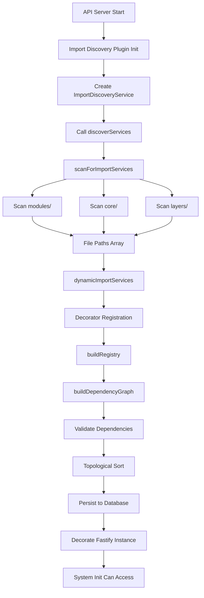
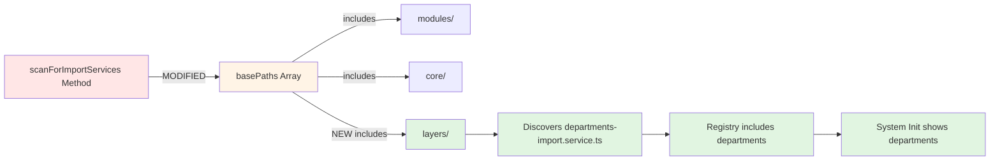

# Design Document

## Overview

The Import Discovery Service is responsible for automatically discovering import services decorated with `@ImportService` across the codebase. Currently, it scans only `modules/` and `core/` directories, missing import services in the new layered architecture (`layers/platform/`, `layers/core/`, `layers/domains/`).

This design implements a minimal, surgical fix: **adding one line to the `basePaths` array** in the `scanForImportServices()` method to include `apps/api/src/layers/`. This ensures comprehensive coverage of all architectural layers while maintaining existing functionality and performance characteristics.

**Design Philosophy:**

- Minimal change, maximum impact
- Zero breaking changes to existing code
- Reuse existing directory scanning logic
- Maintain sub-100ms discovery performance

## Steering Document Alignment

### Technical Standards (tech.md)

**Auto-Discovery Pattern:**

- Follows existing decorator-based registration pattern
- No manual configuration required
- Maintains zero-config philosophy

**Layered Architecture Support:**

- Recognizes platform, core, and domains layers
- Allows import services to reside in architecturally appropriate locations
- Supports the migration from monolithic to layered structure

**Performance Standards:**

- Maintains sub-100ms discovery time requirement
- Uses efficient recursive directory traversal
- No additional overhead beyond existing scan logic

### Project Structure (structure.md)

**Import Service Locations:**

```
apps/api/src/
├── modules/          # Legacy location (still supported)
├── core/             # Core utilities (still supported)
└── layers/           # NEW: Layered architecture
    ├── platform/     # Platform services (departments, rbac, files, etc.)
    ├── core/         # Core shared services (auth, monitoring, audit)
    └── domains/      # Business domains (admin, inventory, etc.)
```

**Convention:**

- Import services end with `-import.service.ts`
- Decorated with `@ImportService({ module, domain, ... })`
- Located alongside their respective feature modules

## Code Reuse Analysis

### Existing Components to Leverage

- **`ImportDiscoveryService.scanDirectory()`**: Recursive directory traversal algorithm
  - **Reuse:** 100% - No changes needed
  - **Why:** Algorithm efficiently scans subdirectories and filters import service files

- **`ImportDiscoveryService.dynamicImportServices()`**: Dynamic module loading
  - **Reuse:** 100% - No changes needed
  - **Why:** Works with any file path, handles dist/ mapping automatically

- **`ImportDiscoveryService.buildRegistry()`**: Service instantiation and registration
  - **Reuse:** 100% - No changes needed
  - **Why:** Creates instances from discovered metadata regardless of source directory

- **`ImportDiscoveryService.buildDependencyGraph()`**: Dependency analysis
  - **Reuse:** 100% - No changes needed
  - **Why:** Builds graph from service metadata, not file locations

### Integration Points

- **Fastify Plugin System**: ImportDiscoveryService registered as `fastify.importDiscovery`
  - **Integration:** Transparent - plugin initialization unchanged
  - **Impact:** Additional services from layers/ automatically available to all consumers

- **System Init Service**: Consumes discovery service via `fastify.importDiscovery`
  - **Integration:** Automatic - no changes required in System Init
  - **Benefit:** Departments and other layer-based import services appear immediately

- **Database Registry**: `import_service_registry` table stores discovered services
  - **Integration:** Seamless - persistRegistry() method unchanged
  - **Benefit:** All discovered services persisted regardless of source directory

## Architecture

### High-Level Flow



### Change Impact Diagram



### Modular Design Principles

- **Single File Responsibility**: Only `import-discovery.service.ts` is modified
- **Component Isolation**: Change isolated to one method in one service
- **Service Layer Separation**: No changes to business logic, only discovery scope
- **Utility Modularity**: Existing recursive scan utility reused without modification

## Components and Interfaces

### ImportDiscoveryService.scanForImportServices()

**File:** `apps/api/src/layers/platform/import/discovery/import-discovery.service.ts`
**Lines:** 140-174 (method definition)
**Change Location:** Lines 143-147 (basePaths array)

**Purpose:**
Scan file system for `*-import.service.ts` files following naming convention

**Current Implementation:**

```typescript
private scanForImportServices(): string[] {
  const files: string[] = [];
  const basePaths = [
    path.join(process.cwd(), 'apps/api/src/modules'),
    path.join(process.cwd(), 'apps/api/src/core'),
    // ❌ Missing: layers/
  ];
  // ... scanning logic
}
```

**New Implementation:**

```typescript
private scanForImportServices(): string[] {
  const files: string[] = [];
  const basePaths = [
    path.join(process.cwd(), 'apps/api/src/modules'),
    path.join(process.cwd(), 'apps/api/src/core'),
    path.join(process.cwd(), 'apps/api/src/layers'),  // ✅ ADDED
  ];
  // ... scanning logic (unchanged)
}
```

**Interfaces (Unchanged):**

- **Returns:** `string[]` - Array of file paths relative to project root
- **No Parameters:** Pure function based on file system state
- **Side Effects:** None (read-only file system access)

**Dependencies:**

- Node.js `fs` module (unchanged)
- Node.js `path` module (unchanged)
- `scanDirectory()` helper method (unchanged)

**Reuses:**

- Existing recursive directory traversal logic
- File filtering by naming convention (`*-import.service.ts`)
- Path normalization and validation

### scanDirectory() Helper Method

**Purpose:**
Recursively traverse directory tree and collect matching files

**Implementation:** No changes required

**Why No Changes:**

- Generic recursive algorithm works for any base path
- Already handles subdirectories efficiently
- File filtering logic already correct
- Error handling already graceful

## Data Models

### Discovery Result (Unchanged)

```typescript
interface DiscoveryResult {
  totalServices: number;
  discoveredServices: string[]; // Module names
  dependencies: DependencyGraph; // Module dependency map
  importOrder: string[]; // Topologically sorted order
  circularDependencies: CircularDependencyError[];
  validationErrors: string[];
}
```

**Impact:** `totalServices` and `discoveredServices` will include departments and other layer-based services

### Import Service Registry Record (Unchanged)

```typescript
interface ImportServiceRegistryRecord {
  module_name: string;
  domain: string;
  subdomain: string | null;
  display_name: string;
  description: string | null;
  dependencies: string; // JSON array
  priority: number;
  tags: string; // JSON array
  supports_rollback: boolean;
  version: string | null;
  file_path: string | null;
  discovered_at: Date;
  updated_at: Date;
}
```

**Impact:** Records for departments and other layer services will be inserted

## Error Handling

### Error Scenarios

1. **layers/ directory doesn't exist**
   - **Handling:** `fs.existsSync(basePath)` check before scanning (existing logic)
   - **User Impact:** None - gracefully skipped, logged if logging enabled
   - **Behavior:** Server starts normally, discovers modules/core services only

2. **Permission denied reading layers/ directory**
   - **Handling:** `try-catch` in `scanDirectory()` logs warning and continues (existing logic)
   - **User Impact:** None - partial discovery completes
   - **Logging:** Warning logged for directory that failed to scan

3. **departments-import.service.ts has syntax errors**
   - **Handling:** `try-catch` in `dynamicImportServices()` logs error and continues (existing logic)
   - **User Impact:** Departments won't appear in System Init (as it currently doesn't)
   - **Logging:** Error logged with file path and error message

4. **departments service has missing decorator**
   - **Handling:** Won't be registered in `buildRegistry()` (existing validation)
   - **User Impact:** Service skipped, validation error logged
   - **Recovery:** Developer must add `@ImportService` decorator

### New Scenarios (Edge Cases)

5. **layers/ contains thousands of nested directories**
   - **Handling:** Recursive scan might take longer but will complete
   - **Performance:** May trigger 100ms warning if extreme nesting
   - **Mitigation:** Only scan up to file depth where import services actually exist

6. **Duplicate import services across layers/ and modules/**
   - **Handling:** Both will be discovered; duplicate module name will cause validation error
   - **User Impact:** Clear error message about duplicate module names
   - **Resolution:** Developer must rename or consolidate duplicate services

## Testing Strategy

### Unit Testing

**File:** `apps/api/src/layers/platform/import/discovery/import-discovery.service.spec.ts` (if exists)

**Test Cases:**

1. **Should scan layers/ directory when it exists**
   - Mock fs.existsSync to return true for layers/
   - Verify layers/ path included in scanned directories

2. **Should discover departments-import.service.ts in layers/platform/departments/**
   - Create test fixture with mock file structure
   - Assert departments appears in discovered services

3. **Should handle missing layers/ directory gracefully**
   - Mock fs.existsSync to return false for layers/
   - Verify no errors thrown, discovery completes

4. **Should maintain performance under 100ms with layers/ included**
   - Benchmark discovery time with all three base paths
   - Assert discovery time < 100ms

### Integration Testing

**Goal:** Verify departments import service is discovered and usable

**Test Cases:**

1. **Server startup discovers departments module**
   - Start API server
   - Query `fastify.importDiscovery.getAllServices()`
   - Assert departments module exists in result

2. **System Init API returns departments in available modules**
   - Call `GET /v1/admin/system-init/modules`
   - Assert response includes departments module
   - Verify metadata: domain=core, priority=1, dependencies=[]

3. **Import order includes departments at priority 1**
   - Call `GET /v1/admin/system-init/import-order`
   - Assert departments appears early in order (priority 1)
   - Verify no circular dependency errors

### End-to-End Testing

**Goal:** Verify System Init Dashboard displays and allows departments import

**User Scenarios:**

1. **System Administrator views available modules**
   - Navigate to System Init Dashboard
   - Verify "Departments (แผนก)" appears in modules list
   - Verify metadata shown: domain, priority, dependencies

2. **System Administrator downloads departments template**
   - Select departments module
   - Click "Download Template"
   - Verify CSV/Excel template has columns: code, name, parent_code, is_active

3. **System Administrator imports departments data**
   - Upload valid departments CSV
   - Verify validation shows no errors
   - Execute import
   - Verify departments records inserted into database

### Manual Verification Checklist

After deployment, verify:

- [ ] API server startup logs show "[Platform ImportDiscovery] Registered: departments (Departments (แผนก))"
- [ ] No validation errors in discovery logs
- [ ] Discovery completes in < 100ms
- [ ] System Init Dashboard shows departments module
- [ ] Departments module shows priority 1, domain core, no dependencies
- [ ] Import order places departments near the top
- [ ] Can download departments import template
- [ ] Can successfully import departments CSV

## Implementation Notes

### Change Scope

- **1 file modified:** `import-discovery.service.ts`
- **1 line added:** `path.join(process.cwd(), 'apps/api/src/layers'),`
- **0 breaking changes**
- **0 new dependencies**

### Deployment Considerations

- **Database migrations:** None required
- **Configuration changes:** None required
- **Server restart:** Required (as with any backend code change)
- **Backward compatibility:** 100% - existing imports continue working

### Rollback Plan

If issues arise, revert the single line addition:

```diff
const basePaths = [
  path.join(process.cwd(), 'apps/api/src/modules'),
  path.join(process.cwd(), 'apps/api/src/core'),
- path.join(process.cwd(), 'apps/api/src/layers'),
];
```

Server restart will restore previous behavior.
