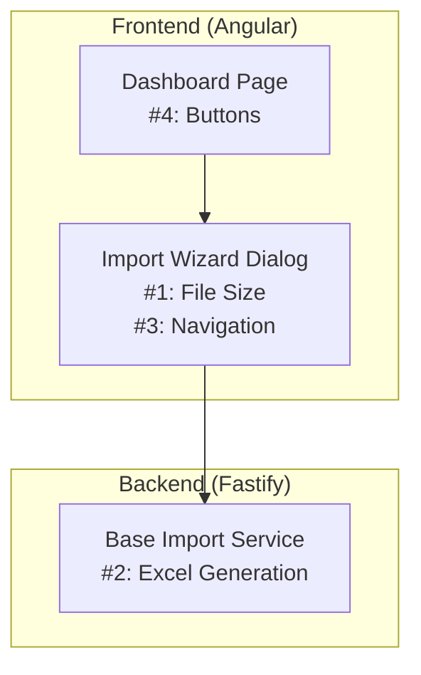

# Design Document: Import Wizard Bug Fixes

## Overview

This design addresses 4 bugs in the System Initialization Import Wizard:

1. File size display showing "0.00 MB" for small files
2. Excel template download failing
3. Validation step navigation not working (Next button stuck)
4. Import History & Settings buttons not implemented

All fixes are isolated changes with minimal impact on surrounding code.

## Code Reuse Analysis

### Existing Components to Leverage

- **ValidationResultsComponent.formattedFileSize**: Already has proper dynamic unit calculation (B, KB, MB, GB) - will use same pattern for import-wizard file size display
- **BaseImportService**: Existing Excel generation logic - just needs await fix
- **MatTooltipModule**: Already imported - will use for disabled button tooltips

### Integration Points

- **Import Wizard Dialog**: Main component receiving fixes (file size, navigation)
- **Base Import Service**: Backend service for Excel template generation
- **Dashboard Page**: UI buttons for History/Settings

## Architecture



## Components and Interfaces

### Fix 1: File Size Display (import-wizard.dialog.ts)

**Purpose:** Fix file size display to show appropriate units

**Current Code (lines 117-135):**

```typescript
fileInfo = computed(() => {
  const file = this.selectedFile();
  if (!file) return null;
  const sizeInMB = (file.size / (1024 * 1024)).toFixed(2);
  // Always shows MB, even for small files
});
```

**Fixed Code:**

```typescript
fileInfo = computed(() => {
  const file = this.selectedFile();
  if (!file) return null;

  // Dynamic unit selection (same pattern as ValidationResultsComponent)
  const units = ['B', 'KB', 'MB', 'GB'];
  let size = file.size;
  let unitIndex = 0;
  while (size >= 1024 && unitIndex < units.length - 1) {
    size /= 1024;
    unitIndex++;
  }
  const formattedSize = `${size.toFixed(2)} ${units[unitIndex]}`;

  const isValidSize = file.size <= 10 * 1024 * 1024;
  const isValidType = file.name.endsWith('.csv') || file.name.endsWith('.xlsx') || file.name.endsWith('.xls');

  return {
    name: file.name,
    size: formattedSize, // Now includes unit
    isValidSize,
    isValidType,
    isValid: isValidSize && isValidType,
  };
});
```

**HTML Change (import-wizard.dialog.html line 164):**

```html
<!-- Before -->
<span class="file-size">{{ fileInfo()?.size }} MB</span>

<!-- After -->
<span class="file-size">{{ fileInfo()?.size }}</span>
```

---

### Fix 2: Excel Template Download (base-import.service.ts)

**Purpose:** Fix async handling in Excel buffer generation

**File:** `apps/api/src/core/import/base/base-import.service.ts`

**Current Code (line 205):**

```typescript
return workbook.xlsx.writeBuffer() as Promise<Buffer>;
```

**Fixed Code:**

```typescript
const buffer = await workbook.xlsx.writeBuffer();
return buffer as Buffer;
```

---

### Fix 3: Validation Navigation (import-wizard.dialog.ts)

**Purpose:** Fix async flow so validation completes before step transition

**Current Code (lines 417-428):**

```typescript
nextStep() {
  if (!this.canProceedToNextStep() || !this.canNavigate()) return;

  if (this.currentStep() === 2 && !this.validationResult()) {
    this.validateFile();  // Not awaited!
  }

  if (this.currentStep() < this.totalSteps) {
    this.currentStep.update((s) => s + 1);  // Runs immediately
  }
}
```

**Fixed Code:**

```typescript
async nextStep() {
  if (!this.canProceedToNextStep() || !this.canNavigate()) return;

  // Auto-validate when moving from step 2 to step 3
  if (this.currentStep() === 2 && !this.validationResult()) {
    await this.validateFile();
    // Check if validation allows proceeding
    if (!this.canProceedToNextStep()) return;
  }

  if (this.currentStep() < this.totalSteps) {
    this.currentStep.update((s) => s + 1);
  }
}
```

---

### Fix 4: Dashboard Buttons (system-init-dashboard.page.html)

**Purpose:** Disable non-implemented buttons with tooltip

**Current Code (lines 22-30):**

```html
<button mat-raised-button color="primary" class="action-btn">
  <mat-icon>history</mat-icon>
  <span>Import History</span>
</button>

<button mat-raised-button color="primary" class="action-btn">
  <mat-icon>settings</mat-icon>
  <span>Settings</span>
</button>
```

**Fixed Code:**

```html
<button mat-raised-button color="primary" class="action-btn" [disabled]="true" matTooltip="Coming Soon">
  <mat-icon>history</mat-icon>
  <span>Import History</span>
</button>

<button mat-raised-button color="primary" class="action-btn" [disabled]="true" matTooltip="Coming Soon">
  <mat-icon>settings</mat-icon>
  <span>Settings</span>
</button>
```

**Component Update (system-init-dashboard.page.ts):**
Add `MatTooltipModule` to imports if not already present.

---

## Data Models

No data model changes required. All fixes are behavioral/display fixes.

## Error Handling

### Error Scenarios

1. **Excel Generation Failure**
   - **Handling:** Exception will now properly propagate with await
   - **User Impact:** Shows error snackbar "Failed to download template"

2. **Validation API Failure**
   - **Handling:** Existing try/catch in validateFile() handles this
   - **User Impact:** Shows error snackbar, user stays on current step

3. **File Too Large**
   - **Handling:** Existing validation prevents upload
   - **User Impact:** Shows error message, file not accepted

## Testing Strategy

### Manual Testing

1. **File Size Display:**
   - Upload file < 1KB → verify shows "X.XX B"
   - Upload file ~500KB → verify shows "X.XX KB"
   - Upload file ~2MB → verify shows "X.XX MB"

2. **Excel Template Download:**
   - Click "Download Excel Template" → verify .xlsx downloads
   - Open file in Excel → verify headers and example data present

3. **Validation Navigation:**
   - Upload valid CSV → click Next → verify validation runs → verify can proceed
   - Upload invalid CSV → verify error shown → verify cannot proceed

4. **Dashboard Buttons:**
   - Hover over History button → verify tooltip "Coming Soon"
   - Hover over Settings button → verify tooltip "Coming Soon"
   - Click buttons → verify no action (disabled)

## Files to Modify

| File                                                                                                | Changes                                    |
| --------------------------------------------------------------------------------------------------- | ------------------------------------------ |
| `apps/web/src/app/features/system-init/components/import-wizard/import-wizard.dialog.ts`            | Fix fileInfo computed, make nextStep async |
| `apps/web/src/app/features/system-init/components/import-wizard/import-wizard.dialog.html`          | Remove " MB" suffix from file size display |
| `apps/api/src/core/import/base/base-import.service.ts`                                              | Add await to writeBuffer()                 |
| `apps/web/src/app/features/system-init/pages/system-init-dashboard/system-init-dashboard.page.html` | Disable buttons with tooltip               |
| `apps/web/src/app/features/system-init/pages/system-init-dashboard/system-init-dashboard.page.ts`   | Add MatTooltipModule import (if needed)    |
