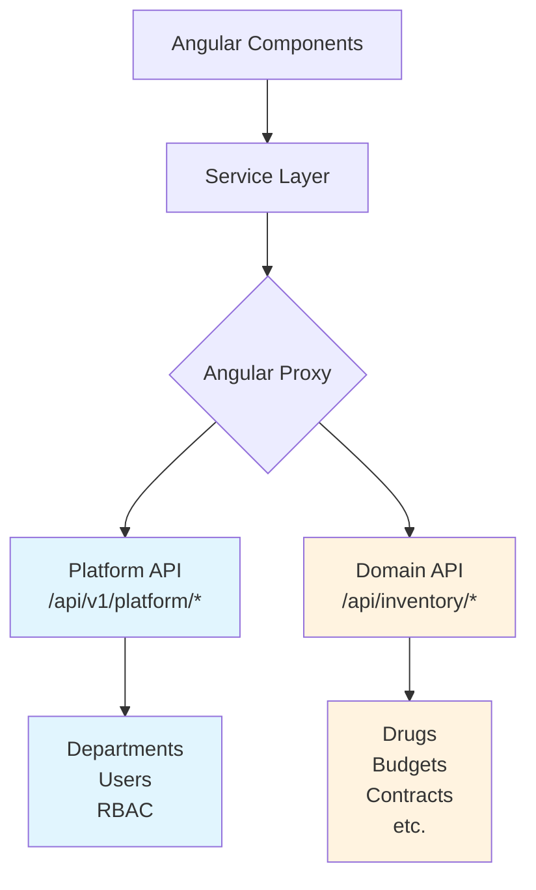

# Design Document

## Overview

This design document outlines the technical approach for refactoring inventory frontend routes to align with the backend's layer-based architecture. The refactoring corrects API endpoint assignments, ensuring Platform Layer resources (shared services) use `/v1/platform/*` endpoints while Domain Layer resources (inventory-specific) continue using `/inventory/*` endpoints. This eliminates 404 errors and establishes proper architectural boundaries.

**Scope:**

- 1 service requiring endpoint change (departments)
- 1 component requiring refactoring (budget requests form)
- 26 services verified as correct (no changes)
- Testing strategy to ensure no regressions

## Steering Document Alignment

### Technical Standards (tech.md)

This design follows established architectural patterns:

- **Layer-Based Routing**: Separates Platform Layer (shared) from Domain Layer (business-specific)
- **Service Layer Pattern**: Components use services instead of direct HTTP calls
- **Angular Proxy Configuration**: Relies on existing proxy to prepend `/api` prefix
- **TypeScript Type Safety**: Maintains existing service interfaces and types

### Project Structure (structure.md)

File organization follows existing conventions:

- Services: `apps/web/src/app/features/inventory/modules/{module}/services/{module}.service.ts`
- Components: `apps/web/src/app/features/inventory/modules/{module}/components/*.component.ts`
- No new directories created
- Minimal file modifications (2 files only)

## Code Reuse Analysis

### Existing Components to Leverage

- **DepartmentService**: Existing service will be updated (baseUrl change only)
- **HttpClient**: Angular's built-in HTTP client (no changes)
- **Angular Proxy**: Existing `proxy.conf.js` handles `/api` prefix prepending
- **Service Base Pattern**: All services follow consistent CRUD pattern

### Integration Points

- **Backend Platform API**: `/api/v1/platform/departments` endpoint (already exists)
- **Backend Domain APIs**: `/api/inventory/*` endpoints (unchanged)
- **Angular Router**: No changes to route configuration
- **Authentication Guards**: No changes to existing auth middleware

## Architecture

### Routing Layer Distinction

The backend uses a two-layer routing architecture:

```
Backend API Structure:
├── Platform Layer (/api/v1/platform/*)
│   ├── departments     ← Shared across all domains
│   ├── users
│   ├── rbac
│   └── settings
│
└── Domain Layer (/api/{domain}/*)
    └── inventory
        ├── master-data
        │   ├── drugs           ← Inventory-specific
        │   ├── budgets
        │   ├── hospitals
        │   └── ...
        ├── operations
        │   ├── budget-allocations
        │   └── ...
        └── budget
            ├── budget-requests
            └── ...
```

### Modular Design Principles

- **Single File Responsibility**: Each service handles API calls for one resource only
- **Component Isolation**: Components depend on services, not direct HTTP calls
- **Service Layer Separation**: Clear boundary between presentation and data access
- **No Breaking Changes**: Existing functionality maintained, only endpoint URLs change

### Routing Decision Matrix

| Resource Type | Characteristics           | Correct Layer  | Endpoint Pattern                        |
| ------------- | ------------------------- | -------------- | --------------------------------------- |
| **Platform**  | Shared across all domains | Platform Layer | `/v1/platform/{resource}`               |
|               | Organization structure    |                | Example: `/v1/platform/departments`     |
|               | User management           |                |                                         |
| **Domain**    | Business-specific         | Domain Layer   | `/inventory/{section}/{resource}`       |
|               | Unique to inventory       |                | Example: `/inventory/master-data/drugs` |
|               | Not shared                |                |                                         |

### Architecture Diagram



## Components and Interfaces

### Component 1: DepartmentService

- **Purpose:** Handles all API calls for departments resource
- **Current Issue:** Uses incorrect Domain Layer endpoint
- **Fix:** Change baseUrl to Platform Layer endpoint
- **Interfaces:**
  ```typescript
  interface DepartmentService {
    getAll(params?: PaginationParams): Observable<PaginatedResponse<Department>>;
    getById(id: string): Observable<Department>;
    create(data: CreateDepartmentDto): Observable<Department>;
    update(id: string, data: UpdateDepartmentDto): Observable<Department>;
    delete(id: string): Observable<void>;
  }
  ```
- **Dependencies:** HttpClient, Angular Router
- **Reuses:** Standard CRUD service pattern used across all modules

### Component 2: BudgetRequestsFormComponent

- **Purpose:** Form for creating/editing budget requests
- **Current Issue:** Makes direct HTTP call to departments endpoint
- **Fix:** Inject and use DepartmentService instead
- **Interfaces:**
  ```typescript
  interface BudgetRequestsFormComponent {
    loadDepartments(): void; // Refactor to use service
    // Other form methods unchanged
  }
  ```
- **Dependencies:** DepartmentService (to be injected), FormBuilder, HttpClient (to be removed)
- **Reuses:** Service injection pattern used in other components

### Component 3: All Other Inventory Services (26 services)

- **Purpose:** Handle API calls for inventory-specific resources
- **Status:** ✅ Already correct, no changes needed
- **Verification:** Confirm all continue to work after refactoring
- **Reuses:** Same service pattern as departments (ensures consistency)

## Data Models

### Department Model (Unchanged)

```typescript
interface Department {
  id: string; // UUID
  name: string; // Department name
  code?: string; // Optional department code
  description?: string; // Optional description
  active: boolean; // Active status
  createdAt: string; // ISO timestamp
  updatedAt: string; // ISO timestamp
}
```

### PaginatedResponse<T> (Unchanged)

```typescript
interface PaginatedResponse<T> {
  data: T[]; // Array of items
  total: number; // Total count
  page: number; // Current page
  limit: number; // Items per page
  totalPages: number; // Total pages
}
```

### API Request/Response Formats (Unchanged)

All request and response formats remain the same. Only the endpoint URL changes.

## Error Handling

### Error Scenarios

1. **404 Not Found (Current Issue)**
   - **Handling:** Fixed by using correct endpoint
   - **Before:** `/api/inventory/master-data/departments` → 404
   - **After:** `/api/v1/platform/departments` → 200 OK
   - **User Impact:** Departments page will load successfully

2. **Service Injection Failure**
   - **Handling:** Angular DI will throw error at compile time
   - **Prevention:** Ensure DepartmentService is provided in root
   - **User Impact:** Development error only, caught before deployment

3. **Network Errors**
   - **Handling:** Existing error handling in services (unchanged)
   - **User Impact:** Same error messages as before
   - **Recovery:** Standard retry mechanisms apply

4. **Permission Errors (403)**
   - **Handling:** Existing RBAC error handling (unchanged)
   - **User Impact:** Same permission denied messages
   - **Recovery:** User must request appropriate permissions

## Testing Strategy

### Unit Testing

**DepartmentService:**

- Test baseUrl is set to `/v1/platform/departments`
- Mock HttpClient to verify correct endpoint is called
- Test all CRUD methods still work with new endpoint
- Verify existing service tests pass with updated baseUrl

**BudgetRequestsFormComponent:**

- Test loadDepartments() uses DepartmentService
- Mock DepartmentService instead of HttpClient
- Verify departments dropdown populates correctly
- Ensure form submission includes selected department

### Integration Testing

**Departments Module:**

- Test complete CRUD workflow:
  1. List departments → verify data loads from platform API
  2. Create department → verify POST to platform API
  3. Update department → verify PUT to platform API
  4. Delete department → verify DELETE to platform API
- Verify pagination, search, and filtering work correctly

**Budget Requests Form:**

- Test form workflow:
  1. Open form → verify departments dropdown loads
  2. Select department → verify form state updates
  3. Submit form → verify department ID saved correctly
- Verify integration with DepartmentService

**Regression Testing:**

- Test all 26 inventory modules still work:
  - Drugs CRUD
  - Budgets CRUD
  - Contracts CRUD
  - Budget Allocations
  - Budget Plans
  - All other modules in inventory

### End-to-End Testing

**Critical User Journeys:**

1. **Departments Management:**
   - Navigate to inventory → master-data → departments
   - Verify list loads without errors
   - Create new department
   - Edit existing department
   - Delete department
   - Verify no console errors or network 404s

2. **Budget Request Creation:**
   - Navigate to inventory → budget → budget-requests
   - Click "Create New"
   - Verify departments dropdown loads
   - Fill form and select department
   - Submit and verify success

3. **Regression Test - Other Modules:**
   - Spot check 3-5 other modules (drugs, budgets, contracts)
   - Verify list pages load
   - Test one CRUD operation per module
   - Confirm no unintended side effects

### Network Tab Verification

Use browser DevTools to verify:

- ✅ All requests to `/api/v1/platform/departments` return 200 OK
- ❌ No requests to `/api/inventory/master-data/departments` (old endpoint)
- ✅ All inventory domain requests continue to work
- ✅ Response formats match expected schemas

### Manual Testing Checklist

**Before Deployment:**

- [ ] Run `pnpm run build` → must pass without errors
- [ ] Start dev server → no console errors on startup
- [ ] Test departments module → all CRUD operations work
- [ ] Test budget requests form → departments dropdown loads
- [ ] Spot check 5 other inventory modules → verify still work
- [ ] Check Network tab → no 404 errors
- [ ] Verify console logs → no new errors or warnings

## Rollback Plan

### Immediate Rollback (If Critical Issues)

```bash
# Revert the commit
git revert <commit-hash>

# Rebuild
pnpm run build

# Redeploy
# (follow standard deployment process)
```

### Temporary Backend Alias (Alternative)

If frontend rollback isn't possible, add temporary backend alias:

```typescript
// Backend: Add alias route
app.get('/api/inventory/master-data/departments', (req, res) => {
  // Forward to platform endpoint
  return platformDepartmentsController.handle(req, res);
});
```

This provides backward compatibility while frontend is fixed.

### Rollback Decision Criteria

Rollback if ANY of these occur:

- Departments CRUD completely broken
- Other inventory modules stop working
- Critical 500 errors in production
- Data corruption detected

Do NOT rollback for:

- Minor UI glitches (fix forward)
- Non-critical console warnings
- Performance issues (optimize forward)

## File Modification Details

### File 1: departments.service.ts

**Path:** `apps/web/src/app/features/inventory/modules/departments/services/departments.service.ts`

**Change:** Single line modification

```typescript
// BEFORE:
private baseUrl = '/inventory/master-data/departments';

// AFTER:
private baseUrl = '/v1/platform/departments';
```

**Impact:** All department API calls now target platform endpoint
**Risk Level:** Low (only URL change, logic unchanged)
**Testing:** Existing unit tests should pass with updated baseUrl

### File 2: budget-requests-form.component.ts

**Path:** `apps/web/src/app/features/inventory/modules/budget-requests/components/budget-requests-form.component.ts`

**Changes:**

1. Inject DepartmentService
2. Replace direct HTTP call with service call
3. Update error handling if needed

```typescript
// BEFORE:
loadDepartments(): void {
  this.http.get<any>('/api/inventory/master-data/departments', {
    params: new HttpParams().set('page', '1').set('limit', '1000')
  }).subscribe({ /* ... */ });
}

// AFTER:
private departmentService = inject(DepartmentService);

loadDepartments(): void {
  this.departmentService.getAll({ page: 1, limit: 1000 }).subscribe({
    next: (response) => {
      this.departments.set(response.data);
      this.loadingDepartments.set(false);
    },
    error: (error) => {
      console.error('Error loading departments:', error);
      this.loadingDepartments.set(false);
    }
  });
}
```

**Impact:** Component now follows service layer pattern
**Risk Level:** Low (improves architecture, easier to test)
**Testing:** Existing component tests should be updated to mock DepartmentService

## Success Criteria

### Technical Success Metrics

- ✅ All API calls to departments return 200 OK (not 404)
- ✅ TypeScript compilation succeeds without errors
- ✅ All existing tests pass (with updated mocks)
- ✅ No new ESLint warnings introduced
- ✅ Build completes successfully

### Functional Success Metrics

- ✅ Departments list page loads data correctly
- ✅ Departments CRUD operations all work
- ✅ Budget requests form departments dropdown populates
- ✅ All 26 inventory modules continue to work
- ✅ No 404 errors in Network tab

### Quality Success Metrics

- ✅ Code follows existing patterns and conventions
- ✅ Service layer architecture maintained
- ✅ No direct HTTP calls in components
- ✅ Clear distinction between Platform and Domain layers

## Future Enhancements

### Shared Platform Services

Create centralized platform services instead of duplicating across domains:

```
apps/web/src/app/core/services/platform/
├── departments.service.ts    → /v1/platform/departments
├── users.service.ts          → /v1/platform/users
├── rbac.service.ts           → /v1/platform/rbac/*
└── settings.service.ts       → /v1/platform/settings
```

**Benefits:**

- Single source of truth for platform resources
- Reduce code duplication
- Easier to maintain and test
- Better type safety and IntelliSense

### Environment-Based API Configuration

Consider adding API prefix configuration to environment files:

```typescript
// environment.ts
export const environment = {
  production: false,
  apiPrefix: '/api',
  platformPrefix: '/api/v1/platform',
  inventoryPrefix: '/api/inventory',
};

// Usage in service:
private baseUrl = `${environment.platformPrefix}/departments`;
```

**Benefits:**

- Easier to change API structure in future
- Support different environments (dev, staging, prod)
- Clearer intent in code

### Service Generator Update

Update CRUD generator to automatically detect Platform vs Domain resources:

```bash
# Generator asks: "Is this a platform resource?"
# If yes → uses /v1/platform/{resource}
# If no → uses /inventory/{section}/{resource}
```

This prevents future misconfigurations.
