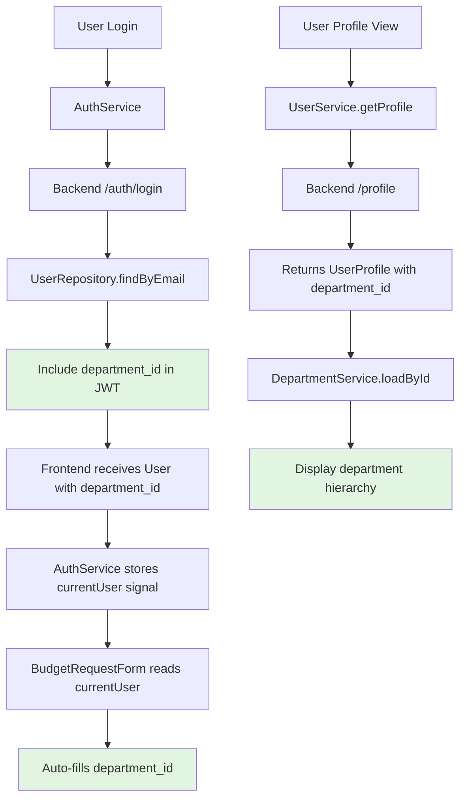

# Design Document

## Overview

This design integrates department context into the user authentication and profile system, enabling automatic department-based workflows throughout the application. The implementation follows a layered approach: extending the backend user API to include department_id, updating the frontend authentication service to maintain department context, and modifying business logic (starting with budget requests) to leverage this context.

The design prioritizes backward compatibility, ensuring existing users and workflows continue functioning while new features progressively adopt department context.

## Steering Document Alignment

### Technical Standards (tech.md)

This design follows the project's established patterns:

- **API-First Development**: Backend API changes before frontend integration
- **TypeBox Schema Validation**: All new fields use TypeBox schemas for type safety
- **Signal-Based State Management**: Frontend uses Angular signals for reactive state
- **Layer-Based Architecture**: Backend follows `layers/platform/users/` structure
- **Repository Pattern**: Database access through BaseRepository
- **Service Layer Separation**: Business logic isolated from controllers

### Project Structure (structure.md)

Implementation follows the monorepo structure:

- **Backend**: `apps/api/src/layers/platform/users/`
- **Frontend**: `apps/web/src/app/core/auth/` and `apps/web/src/app/core/users/`
- **Shared Types**: Department types from `apps/web/src/app/features/system/modules/departments/`
- **Migration**: `apps/api/src/database/migrations/`

## Code Reuse Analysis

### Existing Components to Leverage

- **DepartmentService** (`apps/web/src/app/features/system/modules/departments/services/departments.service.ts`): Already provides department CRUD operations and hierarchy resolution
- **DepartmentSelectorComponent**: Reusable form control for department selection (already integrated in user forms)
- **BaseRepository**: Provides standard CRUD with UUID validation
- **AuthService** (`apps/web/src/app/core/auth/services/auth.service.ts`): Manages authentication state with signals
- **UserService** (`apps/web/src/app/core/users/services/user.service.ts`): Already has department_id in type definitions (REQ-2 complete)
- **BudgetRequestsService** (`apps/api/src/layers/domains/inventory/budget/budgetRequests/budget-requests.service.ts`): Has commented-out auto-population logic ready to enable

### Integration Points

- **Authentication Flow**: JWT token generation in `/auth/login` endpoint will include department_id in user payload
- **User Profile API**: `/users/:id` and `/profile` endpoints already return department_id (from previous implementation)
- **Budget Request Form**: `budget-requests-form.component.ts` will inject AuthService to pre-fill department
- **Database Schema**: `users` table in `platform` schema already has `department_id` column (nullable foreign key)

## Architecture

The architecture follows a three-tier approach with clear separation of concerns:

1. **Data Layer**: PostgreSQL with foreign key relationship `users.department_id → departments.id`
2. **API Layer**: Fastify routes with TypeBox validation, controllers delegate to services
3. **Frontend Layer**: Angular services manage state with signals, components consume reactive data

### Modular Design Principles

- **Single File Responsibility**: Auth service manages authentication, User service manages user data, Department service manages departments
- **Component Isolation**: Department integration is added incrementally without modifying existing core logic
- **Service Layer Separation**: Business logic (auto-population) separated from data access (repository queries)
- **Utility Modularity**: Department utilities (hierarchy path, validation) isolated in department module



## Components and Interfaces

### Component 1: Backend User API Enhancement

- **Purpose:** Add department_id to user authentication and profile responses
- **Files Modified:**
  - `apps/api/src/layers/platform/users/users.types.ts` - Add department_id to User type
  - `apps/api/src/layers/platform/users/users.schemas.ts` - Add department_id to schemas
  - `apps/api/src/layers/platform/users/users.controller.ts` - Include department in responses
- **Interfaces:**
  ```typescript
  interface User {
    id: string;
    email: string;
    username: string;
    firstName: string;
    lastName: string;
    department_id?: number | null; // NEW
    // ... existing fields
  }
  ```
- **Dependencies:** DepartmentsRepository for validation
- **Reuses:** BaseRepository, TypeBox schemas, existing user service structure

### Component 2: Frontend Auth Service Enhancement

- **Purpose:** Store and expose department_id in authentication context
- **Files Modified:**
  - `apps/web/src/app/core/auth/services/auth.service.ts` - Add department_id to User interface
- **Interfaces:**
  ```typescript
  export interface User {
    id: string;
    email: string;
    firstName: string;
    lastName: string;
    department_id?: number | null; // NEW
    roles?: string[];
    permissions?: string[];
  }
  ```
- **Dependencies:** None (pure state management)
- **Reuses:** Existing signal-based reactive pattern

### Component 3: Budget Request Auto-Population

- **Purpose:** Pre-fill department_id in budget request forms from logged-in user
- **Files Modified:**
  - `apps/web/src/app/features/inventory/modules/budget-requests/components/budget-requests-form.component.ts`
- **Interfaces:**
  ```typescript
  ngOnInit() {
    const user = this.authService.currentUser();
    if (user?.department_id) {
      this.budgetRequestsForm.patchValue({
        department_id: user.department_id
      });
    }
  }
  ```
- **Dependencies:** AuthService (inject)
- **Reuses:** Existing reactive form structure, DepartmentService for validation

### Component 4: Backend Budget Request Auto-Population (Re-enable)

- **Purpose:** Uncomment and enable auto-population logic in budget request service
- **Files Modified:**
  - `apps/api/src/layers/domains/inventory/budget/budgetRequests/budget-requests.service.ts`
- **Interfaces:**

  ```typescript
  async create(data: CreateBudgetRequests, userId?: string) {
    let departmentId = data.department_id;

    // Re-enable: Get user's department if not provided
    if (!departmentId && userId) {
      const user = await this.userRepository.findById(userId);
      departmentId = user?.department_id;

      if (!departmentId) {
        throw new Error('USER_NO_DEPARTMENT: User must be assigned to a department');
      }
    }

    // Continue with existing logic...
  }
  ```

- **Dependencies:** UserRepository (new dependency)
- **Reuses:** Existing service structure, error handling patterns

## Data Models

### User Model (Backend)

```typescript
interface User {
  id: string; // UUID primary key
  email: string; // Unique, required
  username: string; // Unique, required
  firstName: string; // Required
  lastName: string; // Required
  password: string; // Hashed, required
  department_id?: number | null; // NEW - Foreign key to departments.id
  status: UserStatus; // 'active' | 'inactive' | 'suspended' | 'pending'
  createdAt: string; // ISO timestamp
  updatedAt: string; // ISO timestamp
}
```

**Database Schema Changes:**

- No migration needed - column already exists in `platform.users` table
- Foreign key constraint: `FOREIGN KEY (department_id) REFERENCES inventory.departments(id) ON DELETE SET NULL`
- Index: `CREATE INDEX idx_users_department_id ON platform.users(department_id)`

### User Model (Frontend Auth)

```typescript
export interface User {
  id: string;
  email: string;
  firstName: string;
  lastName: string;
  department_id?: number | null; // NEW
  role?: string; // Deprecated
  roles?: string[]; // Multi-role support
  permissions?: string[];
  avatar?: string;
  bio?: string;
}
```

### UserProfile Model (Frontend)

```typescript
export interface UserProfile {
  id: string;
  email: string;
  username: string;
  firstName?: string;
  lastName?: string;
  bio?: string;
  avatar?: string;
  role: string;
  roles: UserRole[];
  status: string;
  emailVerified: boolean;
  createdAt: string;
  updatedAt: string;
  preferences?: UserPreferences;
  department_id?: number | null; // ALREADY EXISTS
}
```

## Error Handling

### Error Scenarios

1. **User has no department assignment**
   - **Context:** User with `department_id: null` tries to create budget request
   - **Backend Handling:** Return 400 error with code `USER_NO_DEPARTMENT`
   - **Frontend Handling:** Show clear message: "You must be assigned to a department before creating budget requests. Please contact your administrator."
   - **User Impact:** Cannot proceed with form submission, sees actionable error

2. **Invalid department_id (orphaned reference)**
   - **Context:** User has `department_id: 999` but department doesn't exist
   - **Backend Handling:** Validate on login, log warning, allow login with `department_id: null`
   - **Frontend Handling:** Show warning banner: "Your department assignment is invalid. Some features may be unavailable."
   - **User Impact:** Can login but department-dependent features show warnings

3. **Department is inactive**
   - **Context:** User assigned to inactive department
   - **Backend Handling:** Allow assignment, return department with `is_active: false` flag
   - **Frontend Handling:** Show warning in user profile: "Your department is currently inactive"
   - **User Impact:** Informational only, does not block functionality

4. **Department deleted with assigned users**
   - **Context:** Admin tries to delete department with users assigned
   - **Backend Handling:**
     - **Option A (Recommended):** Set all users' `department_id` to `null` before deletion
     - **Option B:** Prevent deletion with error: "Cannot delete department with assigned users"
   - **Frontend Handling:** Show confirmation dialog explaining impact
   - **User Impact:** Admin makes informed decision

5. **Budget request approval with null department_id**
   - **Context:** Legacy budget request has `department_id: null`, admin tries to approve
   - **Backend Handling:** Return 400 error: "BUDGET_REQUEST_NO_DEPARTMENT: Budget request must have a department to create allocations"
   - **Frontend Handling:** Disable approve button, show: "This request cannot be approved without a department assignment"
   - **User Impact:** Admin must edit request to add department before approval

## Testing Strategy

### Unit Testing

**Backend Tests:**

- `users.service.test.ts`:
  - ✅ User login includes department_id in response
  - ✅ User profile retrieval includes department_id
  - ✅ Department validation on user update
  - ✅ Handle null department_id gracefully

- `budget-requests.service.test.ts`:
  - ✅ Auto-populate department_id from user
  - ✅ Error when user has no department
  - ✅ Manual department_id override works
  - ✅ Approval fails without department_id

**Frontend Tests:**

- `auth.service.spec.ts`:
  - ✅ currentUser signal includes department_id
  - ✅ Login stores department_id
  - ✅ Token refresh maintains department_id

- `budget-requests-form.component.spec.ts`:
  - ✅ Form pre-fills department_id from auth
  - ✅ Manual override allowed
  - ✅ Validation error when submitting without department

### Integration Testing

**API Integration Tests:**

- ✅ Full auth flow: Login → Store department → Use in profile
- ✅ Department assignment flow: Assign department → User login → Verify context
- ✅ Budget request flow: User with department → Create request → Verify auto-fill
- ✅ Backward compatibility: User with null department → Login succeeds → Manual selection required

**Frontend Integration Tests:**

- ✅ Auth service + User service integration
- ✅ Budget form + Auth service integration
- ✅ User profile + Department service integration

### End-to-End Testing

**User Scenarios:**

1. **New user with department:**
   - Admin creates user with department assignment
   - User logs in → Department available in auth context
   - User creates budget request → Department pre-filled
   - User views profile → Department displayed with hierarchy

2. **Existing user (migration scenario):**
   - User with `department_id: null` logs in
   - Auth succeeds without error
   - User creates budget request → Manual department selection required
   - Admin assigns department → Next login includes department context

3. **Admin workflow:**
   - Admin views user list → Departments displayed
   - Admin edits user → Can change department assignment
   - Admin tries to delete department with users → See impact warning
   - Admin approves budget request → Allocations created successfully

4. **Error handling:**
   - User with inactive department logs in → Warning shown
   - User with invalid department_id logs in → Graceful fallback
   - User without department tries to create budget → Clear error message

## Migration Strategy

### Phase 1: Backend Enhancement (No Breaking Changes)

- Add department_id to User type and schemas
- Update auth login to include department_id in JWT payload
- Update profile endpoint to include department_id
- No database migration needed (column exists)

### Phase 2: Frontend Auth Integration

- Add department_id to AuthService User interface
- Update login flow to store department_id in currentUser signal
- Verify backward compatibility with null department_id

### Phase 3: Budget Request Auto-Population

- Inject AuthService in budget request form
- Pre-fill department_id on form init
- Add user-friendly error messages for missing department

### Phase 4: Backend Business Logic

- Re-enable auto-population in BudgetRequestsService
- Add UserRepository dependency
- Validate department assignment on budget creation

### Phase 5: Testing & Validation

- Run full test suite
- Test migration scenarios (existing users with null department)
- Verify budget approval flow end-to-end

## Rollback Plan

If issues arise:

1. **Frontend rollback:** Remove department_id from AuthService User interface (keeps backend compatible)
2. **Backend rollback:** Comment out auto-population logic in BudgetRequestsService
3. **Full rollback:** Revert all code changes (database schema unchanged, no data loss)

The nullable design ensures no data corruption - worst case is users manually select department until fixed.
