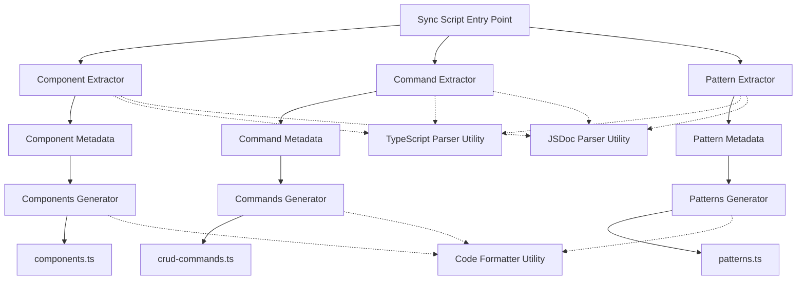

# Design Document

## Overview

This design implements an automated synchronization system for aegisx-mcp that extracts metadata from aegisx-ui Angular components and aegisx-cli commands, then generates TypeScript data files. The system uses TypeScript compiler API for AST parsing, Node.js filesystem operations, and follows a modular extractor-generator pattern to ensure maintainability and extensibility.

## Steering Document Alignment

### Technical Standards (tech.md)

- **TypeScript-first**: All sync code written in TypeScript with strict typing
- **Node.js ecosystem**: Uses TypeScript compiler API and built-in fs/path modules
- **Zero runtime dependencies**: Leverages existing devDependencies only
- **Build integration**: Integrates with existing TypeScript build pipeline

### Project Structure (structure.md)

- Sync tool lives in `libs/aegisx-mcp/scripts/sync/`
- Generated files output to `libs/aegisx-mcp/src/data/`
- Follows monorepo workspace structure with pnpm
- Respects existing aegisx-mcp directory organization

## Code Reuse Analysis

### Existing Components to Leverage

- **TypeScript Compiler API** (`typescript` package): Already a devDependency in aegisx-mcp, will be used for AST parsing
- **Node.js fs/path modules**: Built-in modules for file system operations
- **aegisx-mcp existing interfaces**: Reuse ComponentInfo, CommandInfo, PackageInfo, CodePattern interfaces from current data files

### Integration Points

- **aegisx-mcp package.json**: Add `presync` and `sync` scripts
- **aegisx-mcp build process**: Add sync step before `tsc` compilation
- **aegisx-ui components**: Source of truth for component metadata
- **aegisx-cli lib/**: Source of truth for command metadata

## Architecture

The system follows a **Pipeline Architecture** with three distinct phases:

1. **Extraction Phase**: Parse source files and extract metadata
2. **Transformation Phase**: Convert extracted data to target interfaces
3. **Generation Phase**: Write formatted TypeScript files

### Modular Design Principles

- **Single File Responsibility**: Each extractor handles one source type (components, commands, patterns)
- **Component Isolation**: Extractors, generators, and utilities are independent modules
- **Service Layer Separation**: Clear separation between file I/O, parsing, and generation
- **Utility Modularity**: Shared utilities for AST parsing, file operations, and formatting



## Components and Interfaces

### 1. Sync Script (sync.ts)

- **Purpose:** Main entry point that orchestrates the sync process
- **Location:** `libs/aegisx-mcp/scripts/sync/sync.ts`
- **Responsibilities:**
  - Parse command-line arguments (--dry-run, --verbose)
  - Execute extractors in sequence
  - Call generators with extracted data
  - Report statistics and errors
  - Exit with appropriate status code
- **Interfaces:**

  ```typescript
  interface SyncOptions {
    dryRun: boolean;
    verbose: boolean;
    projectRoot: string;
  }

  interface SyncResult {
    componentsFound: number;
    commandsFound: number;
    patternsFound: number;
    filesGenerated: string[];
    errors: Error[];
  }
  ```

- **Dependencies:** All extractors, all generators, utilities
- **Reuses:** Node.js `process.argv`, path resolution

### 2. Component Extractor (component-extractor.ts)

- **Purpose:** Extract metadata from aegisx-ui Angular component files
- **Location:** `libs/aegisx-mcp/scripts/sync/extractors/component-extractor.ts`
- **Responsibilities:**
  - Scan `libs/aegisx-ui/src/lib/components/` directory
  - Parse TypeScript files using TS compiler API
  - Extract @Component decorator metadata (selector, standalone, etc.)
  - Extract @Input decorators (name, type, default, description from JSDoc)
  - Extract @Output decorators (name, type, description from JSDoc)
  - Parse JSDoc comments for usage examples and best practices
  - Determine component category from directory structure
- **Interfaces:**

  ```typescript
  interface ExtractedComponent {
    name: string;
    selector: string;
    category: string;
    description: string;
    inputs: ExtractedInput[];
    outputs: ExtractedOutput[];
    usage: string;
    bestPractices: string[];
    relatedComponents: string[];
    filePath: string; // For debugging
  }

  interface ExtractedInput {
    name: string;
    type: string;
    default?: string;
    description: string;
    required: boolean;
  }

  interface ExtractedOutput {
    name: string;
    type: string;
    description: string;
  }
  ```

- **Dependencies:** TypeScript Parser Utility, JSDoc Parser Utility, File Scanner Utility
- **Reuses:** Existing ComponentInfo interface structure

### 3. Command Extractor (command-extractor.ts)

- **Purpose:** Extract metadata from aegisx-cli command files and documentation
- **Location:** `libs/aegisx-mcp/scripts/sync/extractors/command-extractor.ts`
- **Responsibilities:**
  - Scan `libs/aegisx-cli/lib/` for generator files
  - Parse JavaScript files to extract command definitions
  - Extract command names, descriptions, options from commander.js definitions
  - Read `libs/aegisx-cli/docs/QUICK_REFERENCE.md` for additional context
  - Extract package information (standard, enterprise, full)
  - Parse usage examples from documentation
- **Interfaces:**

  ```typescript
  interface ExtractedCommand {
    name: string;
    description: string;
    usage: string;
    options: ExtractedOption[];
    examples: string[];
    notes: string[];
    filePath: string;
  }

  interface ExtractedOption {
    name: string;
    alias?: string;
    type: 'boolean' | 'string' | 'number';
    default?: string | boolean | number;
    description: string;
    choices?: string[];
  }

  interface ExtractedPackage {
    name: string;
    description: string;
    features: string[];
    useCases: string[];
    command: string;
  }
  ```

- **Dependencies:** TypeScript Parser Utility, Markdown Parser Utility, File Scanner Utility
- **Reuses:** Existing CommandInfo and PackageInfo interface structures

### 4. Pattern Extractor (pattern-extractor.ts)

- **Purpose:** Extract development patterns from existing pattern definitions
- **Location:** `libs/aegisx-mcp/scripts/sync/extractors/pattern-extractor.ts`
- **Responsibilities:**
  - Read current `libs/aegisx-mcp/src/data/patterns.ts` as baseline
  - Validate pattern structure
  - Allow for manual pattern additions
  - Future: Extract patterns from codebase templates
- **Interfaces:**
  ```typescript
  interface ExtractedPattern {
    name: string;
    category: 'backend' | 'frontend' | 'database' | 'testing';
    description: string;
    code: string;
    language: string;
    notes: string[];
    relatedPatterns: string[];
    filePath?: string;
  }
  ```
- **Dependencies:** TypeScript Parser Utility, File Scanner Utility
- **Reuses:** Existing CodePattern interface structure

### 5. Components Generator (components-generator.ts)

- **Purpose:** Generate `libs/aegisx-mcp/src/data/components.ts` from extracted data
- **Location:** `libs/aegisx-mcp/scripts/sync/generators/components-generator.ts`
- **Responsibilities:**
  - Transform ExtractedComponent[] to ComponentInfo[] format
  - Generate valid TypeScript code with proper imports
  - Format code with consistent indentation and line breaks
  - Add header comments with generation timestamp
  - Preserve existing interface definitions
- **Interfaces:**

  ```typescript
  interface GeneratorOptions {
    outputPath: string;
    dryRun: boolean;
  }

  interface GenerationResult {
    filePath: string;
    itemCount: number;
    success: boolean;
    error?: Error;
  }
  ```

- **Dependencies:** Code Formatter Utility, File Writer Utility
- **Reuses:** ComponentInfo interface from aegisx-mcp

### 6. Commands Generator (commands-generator.ts)

- **Purpose:** Generate `libs/aegisx-mcp/src/data/crud-commands.ts` from extracted data
- **Location:** `libs/aegisx-mcp/scripts/sync/generators/commands-generator.ts`
- **Responsibilities:**
  - Transform ExtractedCommand[] and ExtractedPackage[] to target format
  - Generate valid TypeScript with proper structure
  - Format code consistently
  - Add generation metadata
- **Dependencies:** Code Formatter Utility, File Writer Utility
- **Reuses:** CommandInfo and PackageInfo interfaces from aegisx-mcp

### 7. Patterns Generator (patterns-generator.ts)

- **Purpose:** Generate `libs/aegisx-mcp/src/data/patterns.ts` from extracted data
- **Location:** `libs/aegisx-mcp/scripts/sync/generators/patterns-generator.ts`
- **Responsibilities:**
  - Transform ExtractedPattern[] to CodePattern[] format
  - Generate valid TypeScript
  - Preserve code snippets with proper escaping
- **Dependencies:** Code Formatter Utility, File Writer Utility
- **Reuses:** CodePattern interface from aegisx-mcp

### Shared Utilities

#### TypeScript Parser Utility (ts-parser.ts)

- **Location:** `libs/aegisx-mcp/scripts/sync/utils/ts-parser.ts`
- **Purpose:** Wrapper around TypeScript compiler API for common parsing tasks
- **Functions:**
  - `createSourceFile(filePath: string): ts.SourceFile`
  - `findDecorator(node: ts.Node, name: string): ts.Decorator | undefined`
  - `getDecoratorArguments(decorator: ts.Decorator): any[]`
  - `getPropertyType(property: ts.PropertyDeclaration): string`
  - `getPropertyInitializer(property: ts.PropertyDeclaration): string | undefined`

#### JSDoc Parser Utility (jsdoc-parser.ts)

- **Location:** `libs/aegisx-mcp/scripts/sync/utils/jsdoc-parser.ts`
- **Purpose:** Extract and parse JSDoc comments from TypeScript nodes
- **Functions:**
  - `getJSDocComment(node: ts.Node): string`
  - `getJSDocTags(node: ts.Node): Map<string, string>`
  - `parseExampleTag(node: ts.Node): string | undefined`
  - `parseDescriptionTag(node: ts.Node): string`

#### File Scanner Utility (file-scanner.ts)

- **Location:** `libs/aegisx-mcp/scripts/sync/utils/file-scanner.ts`
- **Purpose:** Recursively scan directories for specific file patterns
- **Functions:**
  - `scanDirectory(dirPath: string, pattern: RegExp): string[]`
  - `readFileContent(filePath: string): string`
  - `isComponentFile(filePath: string): boolean`

#### Code Formatter Utility (code-formatter.ts)

- **Location:** `libs/aegisx-mcp/scripts/sync/utils/code-formatter.ts`
- **Purpose:** Format generated TypeScript code consistently
- **Functions:**
  - `formatTypeScript(code: string): string`
  - `addFileHeader(code: string, metadata: { generatedAt: Date }): string`
  - `indentCode(code: string, level: number): string`

#### File Writer Utility (file-writer.ts)

- **Location:** `libs/aegisx-mcp/scripts/sync/utils/file-writer.ts`
- **Purpose:** Safe file writing with validation
- **Functions:**
  - `writeFile(path: string, content: string, options: WriteOptions): Promise<void>`
  - `validateTypeScript(code: string): boolean`
  - `ensureDirectoryExists(dirPath: string): void`

## Data Models

### Generated File Structure

All generated files follow this structure:

```typescript
/**
 * [File Description]
 * Auto-generated by aegisx-mcp sync tool
 * DO NOT EDIT MANUALLY - Changes will be overwritten
 *
 * Generated: 2025-12-19T14:52:00.000Z
 * Source: [Source directory path]
 */

// Interface definitions (if needed)
export interface [InterfaceName] {
  // ...
}

// Data exports
export const [dataArrayName]: [InterfaceName][] = [
  // Generated data items
];

// Additional exports (categories, helpers, etc.)
export const [helperName] = ...;
```

### Package.json Scripts

Add to `libs/aegisx-mcp/package.json`:

```json
{
  "scripts": {
    "sync": "tsx scripts/sync/sync.ts",
    "sync:dry-run": "tsx scripts/sync/sync.ts --dry-run",
    "sync:verbose": "tsx scripts/sync/sync.ts --verbose",
    "presync": "echo 'Starting aegisx-mcp sync...'",
    "prebuild": "pnpm run sync"
  },
  "devDependencies": {
    "tsx": "^4.7.0"
  }
}
```

## Error Handling

### Error Scenarios

1. **Source file not found**
   - **Handling:** Log warning, continue with other files
   - **User Impact:** Missing components/commands in generated data
   - **Recovery:** Sync will succeed but report incomplete data

2. **Malformed TypeScript/JSDoc**
   - **Handling:** Catch parsing errors, log file path and error
   - **User Impact:** Specific component/command skipped
   - **Recovery:** Continue processing other files

3. **Invalid component structure**
   - **Handling:** Validate required fields, log validation errors
   - **User Impact:** Component excluded from generated data
   - **Recovery:** Proceed with valid components only

4. **TypeScript compilation error in generated file**
   - **Handling:** Validate generated code before writing
   - **User Impact:** Build fails with clear error message
   - **Recovery:** Manual fix required, dry-run helps prevent

5. **File write permission error**
   - **Handling:** Catch I/O errors, exit with status code 1
   - **User Impact:** Sync fails, build cannot proceed
   - **Recovery:** Check file permissions, retry

6. **Missing dependencies (typescript, tsx)**
   - **Handling:** Check for required packages on startup
   - **User Impact:** Sync fails immediately with clear message
   - **Recovery:** Run `pnpm install` in aegisx-mcp

### Error Reporting Format

```typescript
interface SyncError {
  phase: 'extraction' | 'generation' | 'validation';
  source: string; // File path or component name
  message: string;
  stack?: string;
  recoverable: boolean;
}
```

All errors collected and reported at end of sync:

```
✖ Sync completed with errors:

Extraction Phase:
  • libs/aegisx-ui/src/lib/components/broken/broken.component.ts
    Failed to parse decorator: Unexpected token

Generation Phase:
  • libs/aegisx-mcp/src/data/components.ts
    Generated code contains TypeScript errors

Summary: 45 components found, 2 errors (1 recoverable)
```

## Testing Strategy

### Unit Testing

**Tool:** Vitest (already in aegisx-mcp devDependencies)

**Test Files:**

- `scripts/sync/__tests__/component-extractor.test.ts`
- `scripts/sync/__tests__/command-extractor.test.ts`
- `scripts/sync/__tests__/pattern-extractor.test.ts`
- `scripts/sync/__tests__/generators.test.ts`
- `scripts/sync/__tests__/utilities.test.ts`

**Coverage Requirements:**

- Extractors: 80% coverage
- Generators: 90% coverage (critical path)
- Utilities: 85% coverage

**Key Test Cases:**

- Component extractor handles various decorator patterns
- JSDoc parser extracts examples and descriptions
- Generators produce valid TypeScript
- Error handling gracefully skips invalid files
- Dry-run mode doesn't write files

### Integration Testing

**Approach:** Test full sync process against sample data

**Test Setup:**

- Create `scripts/sync/__tests__/fixtures/` with sample components/commands
- Mock file system operations where needed
- Verify generated files match expected output

**Key Flows:**

1. Full sync: Extract from fixtures → Generate → Validate output
2. Partial sync: Some invalid files → Gracefully skip → Report errors
3. Dry-run: Extract → Generate (in memory) → No files written
4. Verbose mode: Extract → Log detailed info → Generate

### Manual Testing

**Pre-release Checklist:**

1. Run sync on actual aegisx-ui and aegisx-cli
2. Verify generated files compile successfully
3. Build aegisx-mcp: `pnpm run build`
4. Test MCP server: `node dist/index.js`
5. Verify components/commands accessible via MCP tools
6. Check for missing components (compare against manual count)

### Validation Testing

**TypeScript Compilation:**

- Generated files must pass `tsc --noEmit` check
- All interfaces must match existing types
- No `any` types in generated code

**Data Integrity:**

- All required fields present in generated data
- No duplicate component selectors
- Valid TypeScript syntax in code snippets

## Performance Considerations

### Optimization Strategies

1. **Parallel Extraction:** Run component, command, and pattern extractors in parallel using `Promise.all()`
2. **Incremental Updates (Future):** Only process files modified since last sync (requires cache mechanism)
3. **Streaming Large Files:** Use streams for reading very large source files
4. **Lazy AST Parsing:** Only parse files that match component/command patterns

### Performance Targets

- Full sync (cold): < 5 seconds
- Full sync (warm cache, future): < 2 seconds
- Memory usage: < 500MB peak
- CPU usage: Multi-threaded extraction where beneficial

### Monitoring

Log performance metrics:

```
Sync Performance:
  • Component extraction: 1.2s (45 files)
  • Command extraction: 0.8s (12 files)
  • Pattern extraction: 0.1s (25 patterns)
  • Generation: 0.3s (3 files)
  • Total: 2.4s
```

## Build Integration

### Pre-build Hook

Modify `libs/aegisx-mcp/package.json`:

```json
{
  "scripts": {
    "prebuild": "pnpm run sync",
    "build": "tsc"
  }
}
```

This ensures:

1. Every build starts with fresh, synced data
2. CI/CD pipelines automatically sync before deployment
3. Local development stays in sync with source libraries

### Development Workflow

**Standard Development:**

1. Modify aegisx-ui component or aegisx-cli command
2. Run `pnpm run build` in aegisx-mcp
3. Sync runs automatically (prebuild hook)
4. Build compiles with updated data

**Manual Sync:**

1. Make changes to aegisx-ui or aegisx-cli
2. Run `pnpm run sync` in aegisx-mcp to update data only
3. Test changes without full build

**Dry-run Preview:**

1. Run `pnpm run sync:dry-run` to preview changes
2. Review console output for extraction results
3. Run `pnpm run sync` to apply changes

## Future Enhancements

### Phase 2 Improvements (Not in Initial Implementation)

1. **Incremental Sync:** Cache file timestamps, only re-extract modified files
2. **Watch Mode:** Auto-sync when source files change during development
3. **Pattern Extraction from Templates:** Auto-discover patterns from aegisx-cli templates
4. **Validation Rules:** Configurable rules for required component metadata
5. **Sync Report:** Generate HTML report of sync results with statistics
6. **Multi-workspace Support:** Sync from multiple monorepo packages

### Configuration File (Future)

```json
// .aegisx-mcp-sync.json
{
  "sources": {
    "components": "libs/aegisx-ui/src/lib/components",
    "commands": "libs/aegisx-cli/lib",
    "patterns": "libs/aegisx-cli/templates"
  },
  "output": {
    "components": "libs/aegisx-mcp/src/data/components.ts",
    "commands": "libs/aegisx-mcp/src/data/crud-commands.ts",
    "patterns": "libs/aegisx-mcp/src/data/patterns.ts"
  },
  "extraction": {
    "ignorePatterns": ["**/*.spec.ts", "**/*.test.ts"],
    "componentCategories": {
      "data-display": "data-display",
      "forms": "forms"
    }
  },
  "validation": {
    "requireDescription": true,
    "requireUsageExample": true,
    "requireBestPractices": false
  }
}
```

## Migration Path

### Transition Strategy

1. **Phase 1:** Implement extractors and generators, run alongside manual updates
2. **Validation:** Compare generated output with current data files for accuracy
3. **Phase 2:** Replace manual data files with generated ones
4. **Phase 3:** Remove manual update documentation, enforce generated-only approach

### Rollback Plan

If sync fails:

1. Keep backup of current data files in `src/data/.backup/`
2. Sync errors exit with non-zero code, build fails
3. Restore from backup: `cp src/data/.backup/* src/data/`
4. Fix sync issues, retry

## Security Considerations

- **Input Validation:** Sanitize all extracted strings before code generation
- **Code Injection Prevention:** No `eval()` or dynamic code execution
- **Path Traversal:** Validate all file paths are within expected directories
- **Dependency Security:** Only use trusted, well-maintained packages (TypeScript compiler API)
- **Generated Code Review:** Manual spot-check of generated files before first release
