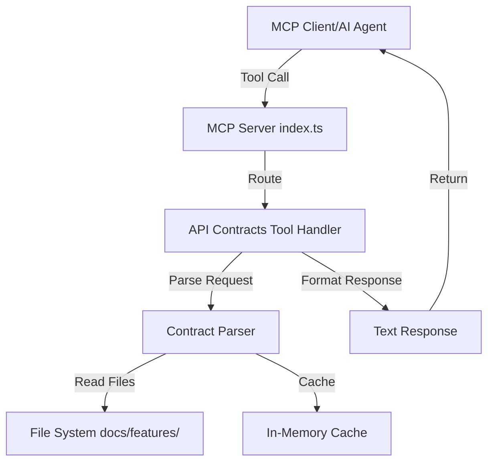

# Design Document

## Overview

The API Contract Tools feature adds four new MCP tools to the aegisx-mcp server that enable programmatic access to API contract documentation stored in `docs/features/*/api-contracts.md` files. This feature follows the existing aegisx-mcp architecture pattern established by the components, CRUD, and patterns tools.

The implementation will consist of:

1. **API Contract Parser** - Extracts structured data from markdown contract files
2. **MCP Tool Handlers** - Implements the four core tools (list, search, get, validate)
3. **Server Registration** - Registers tools in the main MCP server with Zod schemas
4. **Data Layer** - Manages caching and file system access

This design aligns with the project's API-First development philosophy by making API contracts discoverable and verifiable through structured tooling.

## Steering Document Alignment

### Technical Standards (tech.md)

This feature follows established technical patterns:

- **TypeScript** for all implementation code
- **Zod** for MCP tool parameter validation
- **Model Context Protocol SDK** for server implementation
- **File System Access** using Node.js `fs` module with proper error handling
- **Markdown Parsing** using pattern matching and regex for structure extraction

### Project Structure (structure.md)

Files will be organized following the existing aegisx-mcp structure:

```
libs/aegisx-mcp/src/
├── tools/
│   ├── api-contracts.tool.ts (NEW - handler functions)
│   └── index.ts (UPDATED - export new handlers)
├── data/
│   └── api-contracts-parser.ts (NEW - parsing logic)
└── index.ts (UPDATED - register new MCP tools)
```

## Code Reuse Analysis

### Existing Components to Leverage

- **MCP Server Infrastructure** (`src/index.ts`): Reuse existing server setup, tool registration pattern, and Zod schema validation approach
- **Tool Handler Pattern** (`src/tools/components.tool.ts`): Follow the same handler function structure with switch-case for different operations
- **Data Layer Pattern** (`src/data/components.ts`): Apply similar data structure design with TypeScript interfaces and helper functions
- **File System Utilities**: Use Node.js `fs.promises` for async file operations (already used in the project)

### Integration Points

- **aegisx-mcp Server**: New tools will be registered alongside existing tools (components, CRUD, patterns) in `src/index.ts`
- **Documentation Structure**: Parser will read from `docs/features/*/api-contracts.md` following the established documentation conventions
- **Error Handling**: Will use the same error response pattern as existing tools (return helpful error messages in text format)

## Architecture

The architecture follows a **layered design** with clear separation of concerns:



### Modular Design Principles

- **Single File Responsibility**:
  - `api-contracts.tool.ts` - Handles MCP tool routing and response formatting
  - `api-contracts-parser.ts` - Handles markdown parsing and data extraction
  - `index.ts` - Registers tools with MCP server

- **Component Isolation**:
  - Parser is completely independent of MCP tool handlers
  - Can be tested separately
  - Can be reused for other purposes (CLI tools, documentation generators, etc.)

- **Service Layer Separation**:
  - **MCP Layer** (`index.ts`) - Tool registration and schema validation
  - **Handler Layer** (`api-contracts.tool.ts`) - Business logic and response formatting
  - **Data Layer** (`api-contracts-parser.ts`) - File I/O and parsing

- **Utility Modularity**:
  - Parser functions are small and focused (parseContract, extractEndpoints, etc.)
  - Each function has a single responsibility

## Components and Interfaces

### Component 1: API Contract Parser

**Purpose**: Parse markdown API contract files and extract structured endpoint data

**Interfaces**:

```typescript
export interface ApiEndpoint {
  method: 'GET' | 'POST' | 'PUT' | 'PATCH' | 'DELETE';
  path: string;
  description: string;
  feature: string; // e.g., "user-profile", "rbac"
  authentication: boolean;
  requestSchema?: string; // Code block content
  responseSchema?: string; // Code block content
  requestExample?: string;
  responseExample?: string;
  errorResponses?: Array<{
    statusCode: number;
    description: string;
    example?: string;
  }>;
}

export interface ApiContract {
  feature: string;
  baseUrl: string;
  authentication: string;
  contentType: string;
  endpoints: ApiEndpoint[];
  filePath: string;
}

// Main parser functions
export function parseContractFile(filePath: string): Promise<ApiContract>;
export function getAllContracts(rootPath: string): Promise<ApiContract[]>;
export function searchEndpoints(contracts: ApiContract[], query: string): ApiEndpoint[];
export function findEndpoint(contracts: ApiContract[], path: string, method?: string): ApiEndpoint | null;
```

**Dependencies**:

- Node.js `fs.promises` for file reading
- Path utilities for file path resolution

**Reuses**: Standard Node.js APIs, no project-specific utilities needed

### Component 2: MCP Tool Handler

**Purpose**: Implement the four MCP tools with proper request handling and response formatting

**Interfaces**:

```typescript
export function handleApiContractTool(name: string, args: Record<string, unknown>): { content: Array<{ type: string; text: string }> };

// Internal formatting functions
function formatEndpointBrief(endpoint: ApiEndpoint): string;
function formatEndpointDetail(endpoint: ApiEndpoint): string;
function formatContractList(contracts: ApiContract[]): string;
function formatValidationReport(report: ValidationReport): string;
```

**Dependencies**:

- API Contract Parser for data access
- Cache manager (if implemented)

**Reuses**: Parser component for all data access

### Component 3: Validation Logic

**Purpose**: Compare documented endpoints with actual route implementations

**Interfaces**:

```typescript
export interface ValidationReport {
  feature: string;
  matched: number;
  missing: Array<{
    method: string;
    path: string;
    expectedFile: string;
  }>;
  undocumented: Array<{
    method: string;
    path: string;
    foundIn: string;
  }>;
  methodMismatches: Array<{
    path: string;
    documentedMethod: string;
    implementedMethod: string;
    file: string;
  }>;
}

export function validateFeature(contracts: ApiContract[], feature: string, codebaseRoot: string): Promise<ValidationReport>;
```

**Dependencies**:

- Glob/grep for searching route files
- Parser for contract data

**Reuses**: Parser component, file system utilities

## Data Models

### ApiEndpoint Model

```typescript
interface ApiEndpoint {
  method: 'GET' | 'POST' | 'PUT' | 'PATCH' | 'DELETE';
  path: string; // e.g., "/api/profile"
  description: string; // Brief description of what endpoint does
  feature: string; // Feature name (e.g., "user-profile")
  authentication: boolean; // Whether auth is required
  requestSchema?: string; // TypeScript interface or JSON schema
  responseSchema?: string; // TypeScript interface or JSON schema
  requestExample?: string; // Example request (bash/curl/json)
  responseExample?: string; // Example response (json)
  errorResponses?: ErrorResponse[];
}

interface ErrorResponse {
  statusCode: number; // HTTP status code (401, 404, 500, etc.)
  description: string; // Error description
  example?: string; // Example error response JSON
}
```

### ApiContract Model

```typescript
interface ApiContract {
  feature: string; // Feature name from directory
  baseUrl: string; // Base URL prefix (e.g., "/api/profile")
  authentication: string; // Auth requirements description
  contentType: string; // Content-Type header
  endpoints: ApiEndpoint[]; // All endpoints in this contract
  filePath: string; // Path to contract file
}
```

### ValidationReport Model

```typescript
interface ValidationReport {
  feature: string; // Feature being validated
  matched: number; // Number of matching endpoints
  missing: MissingEndpoint[]; // Documented but not implemented
  undocumented: UndocumentedEndpoint[]; // Implemented but not documented
  methodMismatches: MethodMismatch[]; // Wrong HTTP methods
}

interface MissingEndpoint {
  method: string; // Expected HTTP method
  path: string; // Expected path
  expectedFile: string; // Where it should be implemented
}

interface UndocumentedEndpoint {
  method: string; // Found HTTP method
  path: string; // Found path
  foundIn: string; // File where it was found
}

interface MethodMismatch {
  path: string; // Endpoint path
  documentedMethod: string; // Method in contract
  implementedMethod: string; // Method in code
  file: string; // File with implementation
}
```

## Error Handling

### Error Scenarios

1. **Contract File Not Found**
   - **Handling**: Return empty contract with warning message
   - **User Impact**: Tool shows "No contracts found" with helpful message suggesting feature names

2. **Malformed Markdown**
   - **Handling**: Parser attempts to extract available information, logs warnings for malformed sections
   - **User Impact**: Partial data returned with note about parsing issues

3. **Invalid Endpoint Path**
   - **Handling**: Return error with suggestion for similar endpoints
   - **User Impact**: Helpful error: "Endpoint '/api/users' not found. Did you mean '/api/profile'?"

4. **Empty Search Results**
   - **Handling**: Return empty array with suggestion to try different terms
   - **User Impact**: "No endpoints found matching 'xyz'. Try searching for 'budget', 'user', or 'auth'"

5. **Validation Errors (File Access)**
   - **Handling**: Skip inaccessible files, continue validating remaining features
   - **User Impact**: Validation report shows which features were checked and which were skipped

6. **Invalid Tool Parameters**
   - **Handling**: Zod validation catches at MCP layer before reaching handler
   - **User Impact**: Clear validation error from MCP server

## Testing Strategy

### Unit Testing

**Parser Tests** (`api-contracts-parser.test.ts`):

- Test parsing valid contract markdown
- Test handling malformed markdown gracefully
- Test extracting endpoints with all fields
- Test extracting endpoints with missing optional fields
- Test searching endpoints by different criteria
- Test finding endpoints by path and method

**Tool Handler Tests** (`api-contracts.tool.test.ts`):

- Test each tool (list, search, get, validate) with valid inputs
- Test error handling for invalid inputs
- Test response formatting
- Test empty result scenarios

### Integration Testing

**End-to-End MCP Tests**:

- Test full MCP tool call flow (client → server → parser → response)
- Test with real contract files from `docs/features/`
- Test caching behavior (if implemented)
- Test concurrent requests

**Validation Tests**:

- Test validation against real codebase
- Test detection of missing endpoints
- Test detection of undocumented endpoints
- Test detection of method mismatches

### End-to-End Testing

**Real-World Scenarios**:

1. AI agent searches for budget-related endpoints
2. AI agent retrieves contract for specific endpoint to implement frontend
3. AI agent validates implementation matches contract
4. AI agent discovers all available APIs before starting feature work

**Test Data**:

- Use existing `docs/features/*/api-contracts.md` files
- Create test contract files with known endpoints
- Create test route files with known implementations
