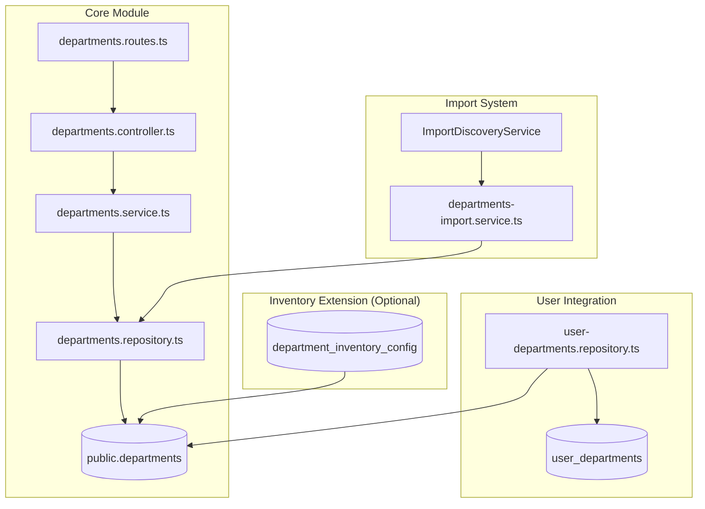

# Design Document: Core Departments

## Overview

Core Departments module จะเป็น centralized module สำหรับจัดการข้อมูลแผนก/หน่วยงานขององค์กร โดยย้ายจาก `inventory.departments` มาเป็น `public.departments` และสร้าง API layer ใหม่ใน `/apps/api/src/core/departments/`

Module นี้จะเป็น foundation ให้ระบบอื่นๆ ใช้งาน เช่น:

- User management (user_departments)
- ระบบหนังสือเวียน
- ระบบจองรถ
- ระบบห้องประชุม
- ระบบคลังยา (ผ่าน extension)

## Steering Document Alignment

### Technical Standards (tech.md)

- ใช้ **TypeBox** สำหรับ schema validation ตาม pattern ที่มีอยู่
- ใช้ **BaseRepository** pattern ที่มีอยู่ใน codebase
- ใช้ **Fastify plugin** pattern สำหรับ route registration
- ใช้ **Knex** สำหรับ database operations

### Project Structure (structure.md)

```
apps/api/src/core/departments/
├── index.ts                      # Plugin export
├── departments.schemas.ts        # TypeBox schemas
├── departments.types.ts          # TypeScript types
├── departments.repository.ts     # Database operations
├── departments.service.ts        # Business logic
├── departments.controller.ts     # HTTP handlers
├── departments.routes.ts         # Route definitions
├── departments-import.service.ts # Import service (ย้ายจาก inventory)
└── __tests__/
    └── departments.test.ts
```

## Code Reuse Analysis

### Existing Components to Leverage

- **BaseRepository**: Extend สำหรับ CRUD operations
  - Location: `apps/api/src/core/base/base.repository.ts`
  - ใช้ pattern เดียวกับ departments ใน inventory

- **BaseService**: Extend สำหรับ business logic
  - Location: `apps/api/src/core/base/base.service.ts`

- **BaseImportService**: Extend สำหรับ import functionality
  - Location: `apps/api/src/core/import/base/base-import.service.ts`
  - ใช้ @ImportService decorator

- **UserDepartmentsRepository**: มีอยู่แล้ว ต้องปรับ FK
  - Location: `apps/api/src/core/users/user-departments.repository.ts`

### Integration Points

- **Users Module**: user_departments table FK ไปที่ departments
- **System Init**: Import discovery จะ detect departments-import.service.ts
- **RBAC**: ใช้ permission pattern ที่มี (departments:read, departments:create, etc.)
- **Inventory Extension**: Optional table สำหรับ consumption_group, his_code

## Architecture



### Modular Design Principles

- **Single File Responsibility**: แต่ละ file มีหน้าที่เดียว (schema, repository, service, controller)
- **Component Isolation**: Departments module แยกจาก inventory โดยสมบูรณ์
- **Service Layer Separation**: Repository (DB) → Service (Logic) → Controller (HTTP)
- **Utility Modularity**: ใช้ shared utilities จาก core/base

## Components and Interfaces

### DepartmentsRepository

- **Purpose:** Database operations สำหรับ departments table
- **Interfaces:**
  ```typescript
  findAll(options: ListOptions): Promise<{ data: Department[], total: number }>
  findById(id: number): Promise<Department | null>
  findByCode(code: string): Promise<Department | null>
  create(data: CreateDepartment): Promise<Department>
  update(id: number, data: UpdateDepartment): Promise<Department>
  delete(id: number): Promise<void>
  getHierarchy(parentId?: number): Promise<Department[]>
  getDropdown(): Promise<DropdownItem[]>
  ```
- **Dependencies:** Knex, BaseRepository
- **Reuses:** BaseRepository pattern จาก inventory/departments

### DepartmentsService

- **Purpose:** Business logic และ validation
- **Interfaces:**
  ```typescript
  list(options: ListOptions): Promise<PaginatedResult<Department>>
  getById(id: number): Promise<Department>
  create(data: CreateDepartment, userId: string): Promise<Department>
  update(id: number, data: UpdateDepartment, userId: string): Promise<Department>
  delete(id: number): Promise<void>
  canDelete(id: number): Promise<{ canDelete: boolean, reason?: string }>
  ```
- **Dependencies:** DepartmentsRepository
- **Reuses:** BaseService pattern

### DepartmentsController

- **Purpose:** Handle HTTP requests และ response formatting
- **Interfaces:**
  ```typescript
  list(request, reply): Promise<void>
  getById(request, reply): Promise<void>
  create(request, reply): Promise<void>
  update(request, reply): Promise<void>
  delete(request, reply): Promise<void>
  dropdown(request, reply): Promise<void>
  ```
- **Dependencies:** DepartmentsService
- **Reuses:** Controller pattern จาก users module

### DepartmentsImportService

- **Purpose:** Import departments via System Init
- **Interfaces:**
  ```typescript
  getMetadata(): ImportServiceMetadata
  getTemplateColumns(): TemplateColumn[]
  validateRow(row, rowNumber): Promise<ValidationError[]>
  insertBatch(batch, trx, options): Promise<Department[]>
  performRollback(batchId, knex): Promise<number>
  ```
- **Dependencies:** BaseImportService, DepartmentsRepository
- **Reuses:** BaseImportService, @ImportService decorator

## Data Models

### Department (Core)

```typescript
interface Department {
  id: number; // Primary key (SERIAL)
  dept_code: string; // Unique code (VARCHAR 10)
  dept_name: string; // Department name (VARCHAR 100)
  parent_id: number | null; // Self-reference for hierarchy
  is_active: boolean; // Active status (default: true)
  import_batch_id: string | null; // For rollback tracking
  created_at: Date;
  updated_at: Date;
}
```

### CreateDepartment

```typescript
interface CreateDepartment {
  dept_code: string;
  dept_name: string;
  parent_id?: number;
  is_active?: boolean;
}
```

### UpdateDepartment

```typescript
interface UpdateDepartment {
  dept_code?: string;
  dept_name?: string;
  parent_id?: number | null;
  is_active?: boolean;
}
```

### DepartmentInventoryConfig (Extension - Optional)

```typescript
interface DepartmentInventoryConfig {
  id: number;
  department_id: number; // FK to departments
  consumption_group: string; // GROUP_1 to GROUP_9
  his_code: string | null; // HIS integration code
  created_at: Date;
  updated_at: Date;
}
```

## Database Migration Plan

### Step 1: Create new table in public schema

```sql
CREATE TABLE public.departments (
  id SERIAL PRIMARY KEY,
  dept_code VARCHAR(10) NOT NULL UNIQUE,
  dept_name VARCHAR(100) NOT NULL,
  parent_id INTEGER REFERENCES public.departments(id),
  is_active BOOLEAN DEFAULT true,
  import_batch_id VARCHAR(100),
  created_at TIMESTAMP WITH TIME ZONE DEFAULT NOW(),
  updated_at TIMESTAMP WITH TIME ZONE DEFAULT NOW()
);

CREATE INDEX idx_departments_parent ON public.departments(parent_id);
CREATE INDEX idx_departments_active ON public.departments(is_active);
CREATE INDEX idx_departments_batch ON public.departments(import_batch_id);
```

### Step 2: Migrate data from inventory.departments

```sql
INSERT INTO public.departments (id, dept_code, dept_name, parent_id, is_active, created_at, updated_at)
SELECT id, dept_code, dept_name, parent_id, is_active, created_at, updated_at
FROM inventory.departments;

-- Reset sequence
SELECT setval('public.departments_id_seq', (SELECT MAX(id) FROM public.departments));
```

### Step 3: Update user_departments FK

```sql
ALTER TABLE user_departments
  DROP CONSTRAINT user_departments_department_id_fkey,
  ADD CONSTRAINT user_departments_department_id_fkey
    FOREIGN KEY (department_id) REFERENCES public.departments(id) ON DELETE CASCADE;
```

### Step 4: Create inventory extension table (optional)

```sql
CREATE TABLE inventory.department_inventory_config (
  id SERIAL PRIMARY KEY,
  department_id INTEGER NOT NULL REFERENCES public.departments(id) ON DELETE CASCADE,
  consumption_group VARCHAR(20),
  his_code VARCHAR(20),
  created_at TIMESTAMP WITH TIME ZONE DEFAULT NOW(),
  updated_at TIMESTAMP WITH TIME ZONE DEFAULT NOW(),
  UNIQUE(department_id)
);

-- Migrate existing data
INSERT INTO inventory.department_inventory_config (department_id, consumption_group, his_code)
SELECT id, consumption_group, his_code
FROM inventory.departments
WHERE consumption_group IS NOT NULL OR his_code IS NOT NULL;
```

### Step 5: Update inventory FKs to point to public.departments

```sql
-- For each table that references inventory.departments
ALTER TABLE inventory.budget_allocations
  DROP CONSTRAINT budget_allocations_department_id_fkey,
  ADD CONSTRAINT budget_allocations_department_id_fkey
    FOREIGN KEY (department_id) REFERENCES public.departments(id);

-- Repeat for: budget_plans, purchase_requests, drug_distributions, drug_returns
```

### Step 6: Drop old table (after verification)

```sql
DROP TABLE inventory.departments;
```

## API Endpoints

| Method | Endpoint                     | Description                      | Permission         |
| ------ | ---------------------------- | -------------------------------- | ------------------ |
| GET    | `/api/departments`           | List departments with pagination | departments:read   |
| GET    | `/api/departments/:id`       | Get department by ID             | departments:read   |
| POST   | `/api/departments`           | Create department                | departments:create |
| PUT    | `/api/departments/:id`       | Update department                | departments:update |
| DELETE | `/api/departments/:id`       | Delete department                | departments:delete |
| GET    | `/api/departments/dropdown`  | Get dropdown list                | departments:read   |
| GET    | `/api/departments/hierarchy` | Get hierarchical tree            | departments:read   |

## Error Handling

### Error Scenarios

1. **Department not found**
   - **Handling:** Return 404 with error code `DEPARTMENT_NOT_FOUND`
   - **User Impact:** "Department with ID {id} not found"

2. **Duplicate dept_code**
   - **Handling:** Return 409 with error code `DEPARTMENT_CODE_EXISTS`
   - **User Impact:** "Department code '{code}' already exists"

3. **Cannot delete - has references**
   - **Handling:** Return 422 with error code `DEPARTMENT_HAS_REFERENCES`
   - **User Impact:** "Cannot delete department. It has {count} user assignments and {count} child departments"

4. **Invalid parent_id**
   - **Handling:** Return 400 with error code `INVALID_PARENT_ID`
   - **User Impact:** "Parent department with ID {id} does not exist"

5. **Circular hierarchy**
   - **Handling:** Return 400 with error code `CIRCULAR_HIERARCHY`
   - **User Impact:** "Cannot set parent: would create circular hierarchy"

## Testing Strategy

### Unit Testing

- Repository methods: CRUD operations, hierarchy queries
- Service methods: Validation logic, business rules
- Controller: Request/response handling

### Integration Testing

- API endpoints: Full request/response cycle
- Database operations: Transaction handling, FK constraints
- Import service: Template generation, validation, batch insert

### End-to-End Testing

- Create department → Assign to user → Verify user profile
- Import departments → Verify hierarchy → Test dropdown
- Delete with references → Verify error handling

## Implementation Order

1. **Database Migration** - สร้าง table และ migrate data
2. **Core Module** - Repository, Service, Controller, Routes
3. **Import Service** - ย้ายและปรับปรุง import service
4. **Update user_departments** - ปรับ FK และ test
5. **Inventory Extension** - สร้าง extension table (optional)
6. **Cleanup** - ลบ old table และ code
