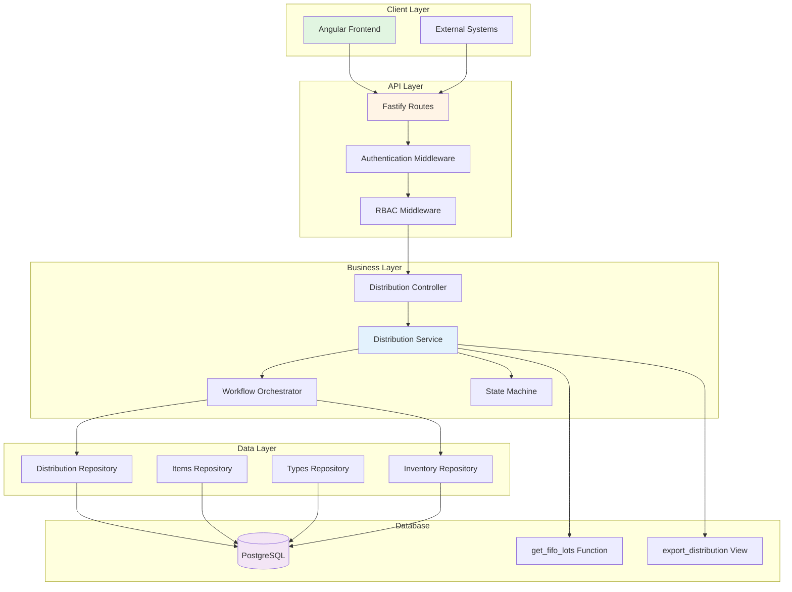
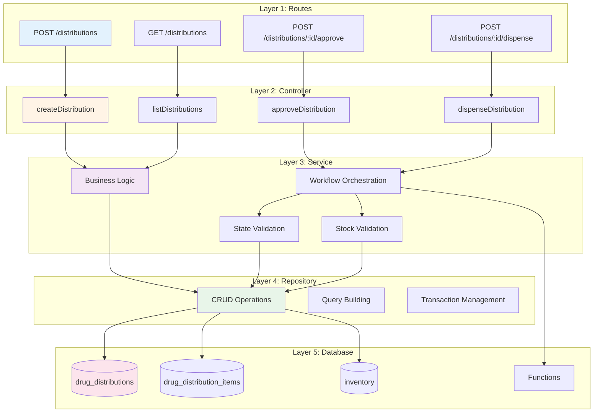
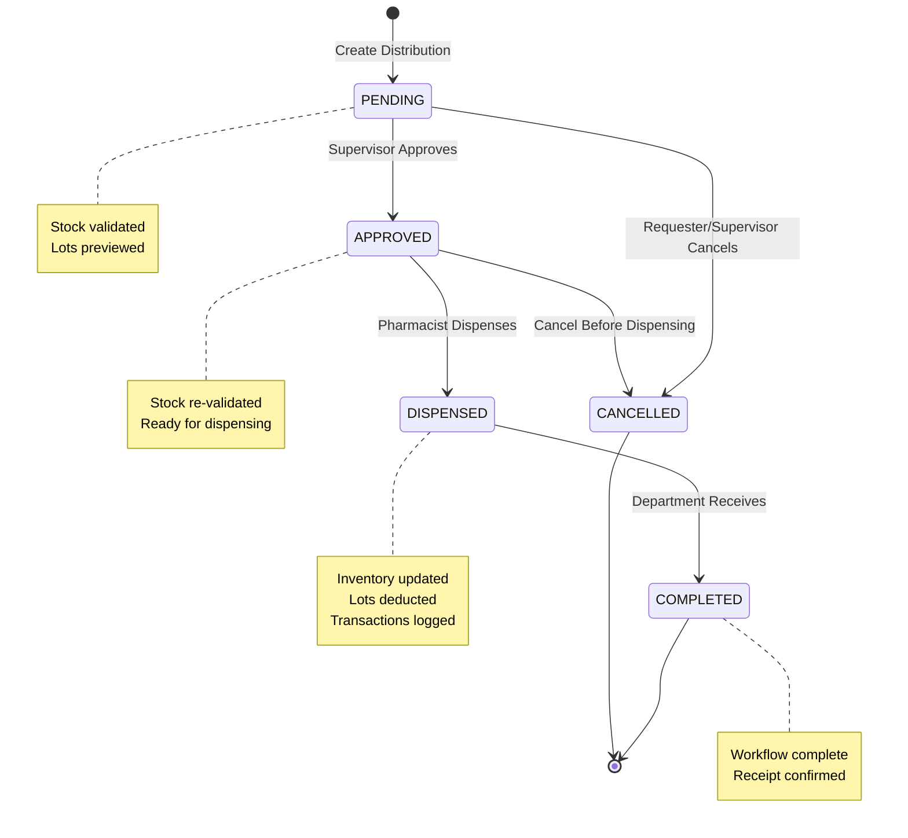

# Design Document - Distribution Backend API

## Overview

The Distribution Backend API implements a comprehensive hospital drug distribution management system with multi-level approval workflows, FIFO/FEFO lot tracking, and complete audit trails. The system is designed following domain-driven design principles, implementing the `inventory/operations` domain with three core entities and fifteen RESTful endpoints.

**Key Design Principles:**

- **API-First Development**: Complete API specification before implementation
- **Domain-Driven Design**: Operations domain with clear bounded contexts
- **TypeBox Schema Validation**: Type-safe request/response contracts
- **Repository Pattern**: Clean separation of data access from business logic
- **Service Layer**: Centralized business logic and workflow orchestration
- **State Machine Pattern**: Explicit state transitions with validation
- **Immutable Audit Trail**: Transaction log for regulatory compliance
- **Database Functions**: FIFO/FEFO lot selection in PostgreSQL
- **Atomic Transactions**: All multi-step operations execute atomically

## Steering Document Alignment

### Technical Standards (tech.md)

This design follows AegisX platform standards:

1. **Fastify Framework**: All endpoints use Fastify with TypeBox schema validation
2. **Layered Architecture**: Repository → Service → Controller → Routes pattern
3. **TypeScript Strict Mode**: Full type safety across all layers
4. **BaseRepository Pattern**: Extends platform BaseRepository for CRUD operations
5. **Authentication**: JWT-based authentication via `fastify.authenticate` hook
6. **Authorization**: RBAC via `fastify.verifyPermission` hook
7. **Error Handling**: Standardized AppError with error codes
8. **Logging**: Structured logging with correlation IDs
9. **WebSocket Events**: Real-time updates via EventService (optional)
10. **Database**: PostgreSQL with Knex query builder

### Project Structure (structure.md)

Implementation follows project organization conventions:

```
apps/api/src/layers/inventory/operations/
├── drug-distributions/
│   ├── drug-distributions.repository.ts
│   ├── drug-distributions.service.ts
│   ├── drug-distributions.controller.ts
│   ├── drug-distributions.routes.ts
│   ├── drug-distributions.schemas.ts
│   ├── drug-distributions.types.ts
│   ├── index.ts
│   └── __tests__/
│       ├── drug-distributions.repository.spec.ts
│       ├── drug-distributions.service.spec.ts
│       └── drug-distributions.controller.spec.ts
├── drug-distribution-items/
│   ├── drug-distribution-items.repository.ts
│   ├── drug-distribution-items.service.ts
│   ├── drug-distribution-items.controller.ts
│   ├── drug-distribution-items.routes.ts
│   ├── drug-distribution-items.schemas.ts
│   ├── drug-distribution-items.types.ts
│   ├── index.ts
│   └── __tests__/
├── distribution-types/
│   ├── distribution-types.repository.ts
│   ├── distribution-types.service.ts
│   ├── distribution-types.controller.ts
│   ├── distribution-types.routes.ts
│   ├── distribution-types.schemas.ts
│   ├── distribution-types.types.ts
│   ├── index.ts
│   └── __tests__/
└── workflows/
    ├── distribution-state-machine.ts
    ├── fifo-dispensing.workflow.ts
    ├── stock-validation.workflow.ts
    └── __tests__/
```

**Database Schema**: `inventory` (separate schema from `public`)

**Migration Path**: `apps/api/src/database/migrations-inventory/`

## Code Reuse Analysis

### Existing Components to Leverage

1. **BaseRepository** (`shared/repositories/base.repository.ts`)
   - **Usage**: All repositories extend BaseRepository for standard CRUD operations
   - **Features**: Automatic pagination, filtering, sorting, field selection, UUID validation
   - **Benefits**: Reduces boilerplate, ensures consistent query patterns
   - **Methods**: findAll, findById, create, update, delete, search

2. **BaseService** (`shared/services/base.service.ts`)
   - **Usage**: All services extend BaseService for common operations
   - **Features**: getById, getList, create, update, delete with validation
   - **Benefits**: Centralized business logic patterns, error handling
   - **Methods**: Standard CRUD + custom business methods

3. **EventService** (`shared/websocket/event.service.ts`)
   - **Usage**: Real-time WebSocket notifications for distribution changes (optional)
   - **Features**: CRUD event helper, room-based broadcasting
   - **Benefits**: Automatic frontend updates on status changes
   - **Events**: distribution.created, distribution.approved, distribution.dispensed

4. **AppError** (`core/errors/app-error.ts`)
   - **Usage**: Standardized error responses with error codes
   - **Features**: HTTP status mapping, localized error messages
   - **Benefits**: Consistent error handling across all endpoints
   - **Error Codes**: DISTRIBUTION_NOT_FOUND, INSUFFICIENT_STOCK, INVALID_STATUS, etc.

5. **TypeBox Base Schemas** (`schemas/base.schemas.ts`)
   - **Usage**: Pagination, sorting, filtering query schemas
   - **Features**: ApiSuccessResponseSchema, PaginatedResponseSchema
   - **Benefits**: Reusable schema patterns, OpenAPI documentation

6. **Authentication Hooks** (`core/auth/hooks/`)
   - **Usage**: fastify.authenticate, fastify.verifyPermission
   - **Features**: JWT validation, RBAC enforcement
   - **Benefits**: Secured endpoints with minimal configuration

7. **Response Helpers** (`core/response/response-helper.ts`)
   - **Usage**: reply.paginated(), reply.success(), reply.error()
   - **Features**: Standardized response formats
   - **Benefits**: Consistent API responses

### Integration Points

1. **Inventory System Integration**
   - **Purpose**: FIFO/FEFO lot selection and stock updates
   - **Method**: Database functions `get_fifo_lots()`, `get_fefo_lots()`
   - **Data Flow**:
     - Distribution request → Check stock availability
     - Dispensing → Select lots via FIFO/FEFO → Deduct quantities
     - Update inventory.quantity_on_hand → Update drug_lots.quantity_available
     - Create inventory_transactions with type ISSUE
   - **Tables**: inventory, drug_lots, inventory_transactions
   - **Error Handling**: Atomic transaction with rollback on failure

2. **Master Data Integration**
   - **Purpose**: Validate locations, departments, drugs
   - **Method**: Foreign key constraints + service-level validation
   - **Data Flow**:
     - Validate from_location_id exists in locations table
     - Validate requesting_dept_id exists in departments table
     - Validate drug_id exists in drugs table
   - **Tables**: locations, departments, drugs
   - **Error Handling**: Return 400 error if foreign keys invalid

3. **Budget System Integration** (Future)
   - **Purpose**: Track department drug consumption for cost allocation
   - **Method**: Service-to-service API call (optional)
   - **Data Flow**: Distribution completed → Calculate total_amount → Update budget usage
   - **Error Handling**: Graceful degradation if Budget API unavailable

4. **Ministry Reporting Integration**
   - **Purpose**: Export distribution data for DMSIC 2568 compliance
   - **Method**: Database view `export_distribution`
   - **Data Flow**: Query view → Format 11 fields → Export CSV/Excel
   - **Fields**: DISTNO, DISTDATE, DEPTCODE, DEPT_TYPE, DRUGCODE, QTY, UNITCOST, LOTNO, EXPDATE, AMOUNT, DISPENSER

## Architecture

### System Architecture



### Modular Design Principles

- **Single File Responsibility**: Each file handles one specific entity or workflow
- **Component Isolation**: Distribution, Items, Types are separate modules
- **Service Layer Separation**: Clear separation of concerns (Repository, Service, Controller)
- **Workflow Modularity**: State machine, FIFO logic, validation in separate files
- **Database Functions**: Complex FIFO/FEFO logic encapsulated in PostgreSQL functions

### Layered Architecture



## API Endpoints Specification

### 1. Distribution CRUD Endpoints

#### GET /api/inventory/operations/drug-distributions

**Purpose**: List distribution requests with filtering and pagination

**Request Schema**:

```typescript
{
  status?: 'PENDING' | 'APPROVED' | 'DISPENSED' | 'COMPLETED' | 'CANCELLED',
  requestingDeptId?: string (UUID),
  fromLocationId?: string (UUID),
  fromDate?: string (ISO date),
  toDate?: string (ISO date),
  search?: string,
  includeItems?: boolean,
  page?: number,
  limit?: number,
  sortBy?: string,
  sortOrder?: 'asc' | 'desc'
}
```

**Response Schema**:

```typescript
{
  data: [
    {
      id: string (UUID),
      distributionNumber: string,
      distributionDate: string,
      fromLocationId: string (UUID),
      toLocationId: string | null,
      requestingDeptId: string (UUID),
      requestedBy: string,
      approvedBy: string | null,
      dispensedBy: string | null,
      status: 'PENDING' | 'APPROVED' | 'DISPENSED' | 'COMPLETED' | 'CANCELLED',
      totalItems: number,
      totalAmount: number,
      notes: string | null,
      createdAt: string,
      updatedAt: string,
      // Populated relations
      fromLocation: { id, code, name },
      toLocation: { id, code, name } | null,
      requestingDept: { id, code, name },
      items?: [ /* if includeItems=true */ ]
    }
  ],
  meta: {
    page: number,
    limit: number,
    total: number,
    totalPages: number
  }
}
```

**Permissions**: `distribution:read`

---

#### GET /api/inventory/operations/drug-distributions/:id

**Purpose**: Get single distribution with complete details

**Response Schema**:

```typescript
{
  data: {
    id: string (UUID),
    distributionNumber: string,
    distributionDate: string,
    fromLocationId: string (UUID),
    toLocationId: string | null,
    requestingDeptId: string (UUID),
    requestedBy: string,
    approvedBy: string | null,
    dispensedBy: string | null,
    status: 'PENDING' | 'APPROVED' | 'DISPENSED' | 'COMPLETED' | 'CANCELLED',
    totalItems: number,
    totalAmount: number,
    notes: string | null,
    createdAt: string,
    updatedAt: string,
    // Relations
    fromLocation: { id, code, name, type },
    toLocation: { id, code, name, type } | null,
    requestingDept: { id, code, name },
    items: [
      {
        id: string (UUID),
        itemNumber: number,
        drugId: string (UUID),
        lotNumber: string,
        quantityDispensed: number,
        unitCost: number,
        expiryDate: string,
        createdAt: string,
        drug: {
          id, code, tradeName, genericName, unit
        }
      }
    ]
  }
}
```

**Permissions**: `distribution:read`

---

#### POST /api/inventory/operations/drug-distributions

**Purpose**: Create new distribution request

**Request Schema**:

```typescript
{
  fromLocationId: string (UUID, required),
  toLocationId?: string (UUID, optional),
  requestingDeptId: string (UUID, required),
  requestedBy: string (required),
  distributionDate?: string (ISO date, defaults to today),
  items: [
    {
      drugId: string (UUID, required),
      quantityRequested: number (required, > 0)
    }
  ] (min 1 item, required)
}
```

**Response Schema**:

```typescript
{
  data: {
    id: string (UUID),
    distributionNumber: string, // Auto-generated: DIST-YYYY-MM-###
    distributionDate: string,
    status: 'PENDING',
    totalItems: number,
    totalAmount: number,
    items: [ /* preview with lot info */ ]
  }
}
```

**Business Logic**:

1. Validate from_location_id, requesting_dept_id exist
2. Check stock availability for each item
3. Generate unique distribution_number
4. Preview FIFO lots for each item using `get_fifo_lots()`
5. Populate lot_number, unit_cost, expiry_date from preview
6. Calculate total_items, total_amount
7. Create distribution + items in transaction

**Permissions**: `distribution:create`

---

### 2. Workflow Endpoints

#### POST /api/inventory/operations/drug-distributions/:id/approve

**Purpose**: Approve distribution request (supervisor action)

**Request Schema**:

```typescript
{
  approvedBy: string(required);
}
```

**Response Schema**:

```typescript
{
  data: {
    id: string (UUID),
    status: 'APPROVED',
    approvedBy: string,
    updatedAt: string
  }
}
```

**Business Logic**:

1. Validate distribution exists and status is PENDING
2. Re-check stock availability (may have changed)
3. Update status to APPROVED
4. Record approved_by and timestamp

**Permissions**: `distribution:approve`

---

#### POST /api/inventory/operations/drug-distributions/:id/cancel

**Purpose**: Cancel distribution request

**Request Schema**:

```typescript
{
  reason: string(required);
}
```

**Response Schema**:

```typescript
{
  data: {
    id: string (UUID),
    status: 'CANCELLED',
    notes: string, // Contains cancellation reason
    updatedAt: string
  }
}
```

**Business Logic**:

1. Validate distribution exists
2. Validate status is PENDING or APPROVED (cannot cancel DISPENSED/COMPLETED)
3. Update status to CANCELLED
4. Store reason in notes

**Permissions**: `distribution:cancel`

---

#### POST /api/inventory/operations/drug-distributions/:id/dispense

**Purpose**: Dispense drugs using FIFO/FEFO logic (pharmacist action)

**Request Schema**:

```typescript
{
  dispensedBy: string (required),
  userId: string (UUID, required) // For audit trail
}
```

**Response Schema**:

```typescript
{
  data: {
    id: string (UUID),
    status: 'DISPENSED',
    dispensedBy: string,
    updatedAt: string,
    lotsUsed: [
      {
        itemNumber: number,
        drugName: string,
        lots: [
          { lotNumber, quantity, expiryDate }
        ]
      }
    ]
  }
}
```

**Business Logic** (Atomic Transaction):

1. Validate distribution exists and status is APPROVED
2. For each item:
   - Call `get_fifo_lots(drug_id, location_id, quantity)`
   - Deduct from drug_lots.quantity_available
   - Set lot.is_active = false when quantity_available = 0
   - Deduct from inventory.quantity_on_hand
   - Create inventory_transaction (type: ISSUE)
3. Update distribution status to DISPENSED
4. Record dispensed_by and timestamp

**Permissions**: `distribution:dispense`

---

#### POST /api/inventory/operations/drug-distributions/:id/complete

**Purpose**: Mark distribution as completed (department receipt confirmation)

**Request Schema**:

```typescript
{
  notes?: string (optional) // e.g., "Received by Ward Nurse Jane"
}
```

**Response Schema**:

```typescript
{
  data: {
    id: string (UUID),
    status: 'COMPLETED',
    notes: string,
    updatedAt: string
  }
}
```

**Business Logic**:

1. Validate distribution exists and status is DISPENSED
2. Update status to COMPLETED
3. Record notes and timestamp

**Permissions**: `distribution:complete`

---

#### GET /api/inventory/operations/drug-distributions/:id/preview-lots

**Purpose**: Preview FIFO lots before dispensing

**Response Schema**:

```typescript
{
  data: [
    {
      itemNumber: number,
      drugId: string(UUID),
      drugName: string,
      quantityNeeded: number,
      lots: [
        {
          lotId: string(UUID),
          lotNumber: string,
          quantityToDispense: number,
          unitCost: number,
          expiryDate: string,
          daysUntilExpiry: number,
        },
      ],
    },
  ];
}
```

**Business Logic**:

1. Validate distribution exists and status is APPROVED
2. For each item, call `get_fifo_lots()` without updating
3. Return preview of lots that will be used

**Permissions**: `distribution:read`

---

### 3. Reporting Endpoints

#### GET /api/inventory/operations/drug-distributions/by-department/:deptId

**Purpose**: Get distribution history by department

**Request Schema**:

```typescript
{
  fromDate?: string (ISO date),
  toDate?: string (ISO date),
  status?: 'PENDING' | 'APPROVED' | 'DISPENSED' | 'COMPLETED' | 'CANCELLED',
  includeItems?: boolean
}
```

**Response Schema**:

```typescript
{
  data: [ /* distributions */ ],
  summary: {
    totalDistributions: number,
    totalValue: number,
    avgValuePerDistribution: number
  }
}
```

**Permissions**: `distribution:read`

---

#### GET /api/inventory/operations/drug-distributions/usage-report

**Purpose**: Department drug usage summary

**Request Schema**:

```typescript
{
  deptId?: string (UUID),
  drugId?: string (UUID),
  fromDate?: string (ISO date),
  toDate?: string (ISO date)
}
```

**Response Schema**:

```typescript
{
  data: [
    {
      deptCode: string,
      deptName: string,
      drugCode: string,
      drugTradeName: string,
      drugGenericName: string,
      totalQuantity: number,
      totalValue: number,
      distributionCount: number
    }
  ],
  grandTotal: {
    totalValue: number,
    totalDistributions: number
  }
}
```

**Permissions**: `distribution:read`, `reports:read`

---

#### GET /api/inventory/operations/drug-distributions/ministry-export

**Purpose**: Export DMSIC 2568 compliance data

**Request Schema**:

```typescript
{
  fromDate: string (ISO date, required),
  toDate: string (ISO date, required),
  format?: 'csv' | 'excel' (default: 'csv')
}
```

**Response**: CSV or Excel file with 11 fields

**Fields**:

- DISTNO (distribution_number)
- DISTDATE (distribution_date)
- DEPTCODE (dept_code)
- DEPT_TYPE (consumption_group)
- DRUGCODE (drug_code)
- QTY (quantity_dispensed)
- UNITCOST (unit_cost)
- LOTNO (lot_number)
- EXPDATE (expiry_date)
- AMOUNT (quantity × unit_cost)
- DISPENSER (dispensed_by)

**Permissions**: `distribution:export`, `ministry:export`

---

### 4. Item Management Endpoints

#### GET /api/inventory/operations/drug-distribution-items

**Purpose**: List distribution items

**Request Schema**:

```typescript
{
  distributionId?: string (UUID),
  drugId?: string (UUID)
}
```

**Permissions**: `distribution:read`

---

#### PUT /api/inventory/operations/drug-distribution-items/:id

**Purpose**: Update item quantity (only for PENDING distributions)

**Request Schema**:

```typescript
{
  quantityRequested: number (> 0, required)
}
```

**Business Logic**:

1. Validate parent distribution status is PENDING
2. Re-check stock availability
3. Re-preview FIFO lots
4. Update item with new lot info
5. Recalculate parent total_amount

**Permissions**: `distribution:update`

---

#### DELETE /api/inventory/operations/drug-distribution-items/:id

**Purpose**: Remove item from PENDING distribution

**Business Logic**:

1. Validate parent distribution status is PENDING
2. Prevent deleting last item (cancel distribution instead)
3. Recalculate parent total_items and total_amount

**Permissions**: `distribution:update`

---

### 5. Distribution Types Endpoint

#### GET /api/inventory/operations/distribution-types

**Purpose**: List distribution types

**Request Schema**:

```typescript
{
  activeOnly?: boolean (default: true)
}
```

**Response Schema**:

```typescript
{
  data: [
    {
      id: string(UUID),
      name: string,
      description: string,
      isActive: boolean,
    },
  ];
}
```

**Permissions**: `distribution:read`

---

## Data Models

### 1. DrugDistribution (drug_distributions table)

```typescript
interface DrugDistribution {
  id: string; // UUID, PK
  distributionNumber: string; // UNIQUE, "DIST-YYYY-MM-###"
  distributionDate: Date; // NOT NULL
  fromLocationId: string; // UUID, FK → locations(id), NOT NULL
  toLocationId: string | null; // UUID, FK → locations(id)
  requestingDeptId: string; // UUID, FK → departments(id), NOT NULL
  requestedBy: string; // VARCHAR(100)
  approvedBy: string | null; // VARCHAR(100)
  dispensedBy: string | null; // VARCHAR(100)
  status: DistributionStatus; // ENUM, NOT NULL, DEFAULT 'PENDING'
  totalItems: number; // INT, DEFAULT 0
  totalAmount: number; // DECIMAL(15,2), DEFAULT 0
  notes: string | null; // TEXT
  createdAt: Date; // TIMESTAMP
  updatedAt: Date; // TIMESTAMP
}

enum DistributionStatus {
  PENDING = 'PENDING',
  APPROVED = 'APPROVED',
  DISPENSED = 'DISPENSED',
  COMPLETED = 'COMPLETED',
  CANCELLED = 'CANCELLED',
}
```

**Indexes**:

- `idx_dist_number` ON distribution_number
- `idx_dist_status` ON status
- `idx_dist_dept` ON requesting_dept_id
- `idx_dist_from_location` ON from_location_id
- `idx_dist_date` ON distribution_date
- `idx_dist_created` ON created_at DESC

**Unique Constraints**:

- `UNIQUE(distribution_number)`

---

### 2. DrugDistributionItem (drug_distribution_items table)

```typescript
interface DrugDistributionItem {
  id: string; // UUID, PK
  distributionId: string; // UUID, FK → drug_distributions(id), NOT NULL
  itemNumber: number; // INT, NOT NULL (1, 2, 3...)
  drugId: string; // UUID, FK → drugs(id), NOT NULL
  lotNumber: string; // VARCHAR(50), NOT NULL
  quantityDispensed: number; // DECIMAL(15,3), NOT NULL
  unitCost: number; // DECIMAL(15,4), NOT NULL
  expiryDate: Date; // DATE, NOT NULL
  createdAt: Date; // TIMESTAMP
}
```

**Indexes**:

- `idx_dist_items_distribution` ON distribution_id
- `idx_dist_items_drug` ON drug_id
- `idx_dist_items_lot` ON lot_number
- `idx_dist_items_expiry` ON expiry_date

**Unique Constraints**:

- `UNIQUE(distribution_id, item_number)`

---

### 3. DistributionType (distribution_types table)

```typescript
interface DistributionType {
  id: string; // UUID, PK
  name: string; // VARCHAR(100), NOT NULL
  description: string | null; // TEXT
  isActive: boolean; // BOOLEAN, DEFAULT true
  createdAt: Date; // TIMESTAMP
}
```

**Seed Data**:

- จ่ายถาวร (Permanent distribution)
- ยืม-คืน (Loan-return)

---

## Workflow State Machine

### Distribution Status State Machine



### State Transition Rules

```typescript
interface StateTransition {
  from: DistributionStatus;
  to: DistributionStatus;
  action: string;
  permissions: string[];
  validations: ValidationRule[];
}

const STATE_MACHINE: StateTransition[] = [
  {
    from: null,
    to: 'PENDING',
    action: 'CREATE',
    permissions: ['distribution:create'],
    validations: ['validate_locations_exist', 'validate_department_exists', 'check_stock_availability', 'validate_items_not_empty'],
  },
  {
    from: 'PENDING',
    to: 'APPROVED',
    action: 'APPROVE',
    permissions: ['distribution:approve'],
    validations: ['recheck_stock_availability'],
  },
  {
    from: 'PENDING',
    to: 'CANCELLED',
    action: 'CANCEL',
    permissions: ['distribution:cancel'],
    validations: ['require_cancellation_reason'],
  },
  {
    from: 'APPROVED',
    to: 'DISPENSED',
    action: 'DISPENSE',
    permissions: ['distribution:dispense'],
    validations: ['validate_fifo_lots_available', 'ensure_atomic_transaction'],
  },
  {
    from: 'APPROVED',
    to: 'CANCELLED',
    action: 'CANCEL',
    permissions: ['distribution:cancel'],
    validations: ['require_cancellation_reason'],
  },
  {
    from: 'DISPENSED',
    to: 'COMPLETED',
    action: 'COMPLETE',
    permissions: ['distribution:complete'],
    validations: [],
  },
];
```

---

## Integration with Inventory System

### FIFO/FEFO Lot Selection

```typescript
// Database Function: get_fifo_lots(drug_id, location_id, quantity_needed)
interface FifoLot {
  lot_id: string; // UUID
  lot_number: string;
  quantity: number; // Quantity to dispense from this lot
  unit_cost: number;
  expiry_date: Date;
  received_date: Date;
}

// Service method
async getFifoLotsForItem(
  drugId: string,
  locationId: string,
  quantityNeeded: number
): Promise<FifoLot[]> {
  const result = await this.db.raw(`
    SELECT * FROM inventory.get_fifo_lots(
      ?::UUID,
      ?::UUID,
      ?::DECIMAL
    )
  `, [drugId, locationId, quantityNeeded]);

  return result.rows;
}
```

### Stock Availability Check

```typescript
async checkStockAvailability(
  drugId: string,
  locationId: string,
  quantityNeeded: number
): Promise<{ available: boolean; currentStock: number }> {
  const inventory = await this.inventoryRepository.findOne({
    drug_id: drugId,
    location_id: locationId
  });

  if (!inventory) {
    return { available: false, currentStock: 0 };
  }

  return {
    available: inventory.quantity_on_hand >= quantityNeeded,
    currentStock: inventory.quantity_on_hand
  };
}
```

### Inventory Deduction (Atomic Transaction)

```typescript
async dispenseDistribution(
  distributionId: string,
  dispensedBy: string,
  userId: string
): Promise<DrugDistribution> {
  return await this.db.transaction(async (trx) => {
    // 1. Get distribution with items
    const distribution = await this.repository.findById(distributionId, { trx });

    if (distribution.status !== 'APPROVED') {
      throw new AppError('INVALID_STATUS', 'Distribution must be APPROVED to dispense');
    }

    // 2. Process each item
    for (const item of distribution.items) {
      // 2.1 Get FIFO lots
      const fifoLots = await this.getFifoLotsForItem(
        item.drugId,
        distribution.fromLocationId,
        item.quantityDispensed,
        trx
      );

      if (!fifoLots || fifoLots.length === 0) {
        throw new AppError('NO_FIFO_LOTS', `No available lots for drug ${item.drugId}`);
      }

      // 2.2 Deduct from each lot
      let remainingQty = item.quantityDispensed;
      for (const lot of fifoLots) {
        const deductQty = Math.min(lot.quantity, remainingQty);

        // Update lot quantity
        await trx('inventory.drug_lots')
          .where('id', lot.lot_id)
          .decrement('quantity_available', deductQty);

        // Check if lot depleted
        const updatedLot = await trx('inventory.drug_lots')
          .where('id', lot.lot_id)
          .first();

        if (updatedLot.quantity_available === 0) {
          await trx('inventory.drug_lots')
            .where('id', lot.lot_id)
            .update({ is_active: false });
        }

        remainingQty -= deductQty;
        if (remainingQty <= 0) break;
      }

      // 2.3 Update inventory
      await trx('inventory.inventory')
        .where({
          drug_id: item.drugId,
          location_id: distribution.fromLocationId
        })
        .decrement('quantity_on_hand', item.quantityDispensed)
        .update({ last_updated: new Date() });

      // 2.4 Create transaction
      const inventory = await trx('inventory.inventory')
        .where({
          drug_id: item.drugId,
          location_id: distribution.fromLocationId
        })
        .first();

      await trx('inventory.inventory_transactions').insert({
        inventory_id: inventory.id,
        transaction_type: 'ISSUE',
        quantity: -item.quantityDispensed,
        unit_cost: item.unitCost,
        reference_id: distribution.id,
        reference_type: 'distribution',
        notes: `Distribution ${distribution.distributionNumber} to ${distribution.requestingDept.name}`,
        created_by: userId
      });
    }

    // 3. Update distribution status
    const updated = await this.repository.update(
      distributionId,
      {
        status: 'DISPENSED',
        dispensed_by: dispensedBy,
        updated_at: new Date()
      },
      { trx }
    );

    return updated;
  });
}
```

---

## Error Handling

### Error Codes and Scenarios

```typescript
enum DistributionErrorCode {
  DISTRIBUTION_NOT_FOUND = 'DISTRIBUTION_NOT_FOUND',
  INSUFFICIENT_STOCK = 'INSUFFICIENT_STOCK',
  INVALID_STATUS = 'INVALID_STATUS',
  NO_FIFO_LOTS = 'NO_FIFO_LOTS',
  INVALID_LOCATION = 'INVALID_LOCATION',
  INVALID_DEPARTMENT = 'INVALID_DEPARTMENT',
  INVALID_DRUG = 'INVALID_DRUG',
  CANNOT_DELETE_LAST_ITEM = 'CANNOT_DELETE_LAST_ITEM',
  DUPLICATE_DISTRIBUTION_NUMBER = 'DUPLICATE_DISTRIBUTION_NUMBER',
}
```

### Error Response Format

```typescript
interface ErrorResponse {
  error: {
    code: DistributionErrorCode;
    message: string;
    details?: Record<string, any>;
    timestamp: string;
    path: string;
  };
}
```

### Example Error Scenarios

1. **Insufficient Stock**

```typescript
throw new AppError(
  'INSUFFICIENT_STOCK',
  'Insufficient stock for Paracetamol',
  {
    drugId: '...',
    drugName: 'Paracetamol 500mg',
    locationId: '...',
    locationName: 'Central Pharmacy',
    requested: 1000,
    available: 500,
  },
  400,
);
```

2. **Invalid Status Transition**

```typescript
throw new AppError(
  'INVALID_STATUS',
  'Distribution must be APPROVED before dispensing',
  {
    currentStatus: 'PENDING',
    requiredStatus: 'APPROVED',
    action: 'dispense',
  },
  400,
);
```

3. **No FIFO Lots Available**

```typescript
throw new AppError(
  'NO_FIFO_LOTS',
  'No available lots for drug',
  {
    drugId: '...',
    drugName: 'Morphine 10mg',
    locationId: '...',
    quantityNeeded: 50,
  },
  400,
);
```

---

## Testing Strategy

### Unit Testing

**Files to Test**:

- `drug-distributions.service.spec.ts`
- `drug-distributions.repository.spec.ts`
- `drug-distribution-items.service.spec.ts`
- `distribution-state-machine.spec.ts`
- `fifo-dispensing.workflow.spec.ts`

**Key Test Cases**:

1. **Repository Tests**:
   - CRUD operations
   - Query filtering (status, department, date range)
   - Pagination and sorting
   - Error handling (not found, duplicate)

2. **Service Tests**:
   - Create distribution with stock validation
   - Approve distribution with re-check
   - Dispense with FIFO lot selection (mocked)
   - Cancel distribution
   - Complete distribution
   - State transition validation

3. **Workflow Tests**:
   - State machine transitions (valid and invalid)
   - FIFO lot selection algorithm
   - Stock validation logic
   - Distribution number generation

**Example Test**:

```typescript
describe('DrugDistributionService', () => {
  describe('createDistribution', () => {
    it('should create distribution with PENDING status', async () => {
      const input = {
        fromLocationId: 'loc-1',
        requestingDeptId: 'dept-1',
        requestedBy: 'John Doe',
        items: [{ drugId: 'drug-1', quantityRequested: 100 }],
      };

      // Mock stock availability
      inventoryService.checkStockAvailability.mockResolvedValue({
        available: true,
        currentStock: 500,
      });

      // Mock FIFO lots preview
      inventoryService.getFifoLotsForItem.mockResolvedValue([{ lot_id: 'lot-1', lot_number: 'LOT2025A', quantity: 100, unit_cost: 5.0 }]);

      const result = await service.createDistribution(input);

      expect(result.status).toBe('PENDING');
      expect(result.distributionNumber).toMatch(/^DIST-\d{4}-\d{2}-\d{3}$/);
      expect(result.totalItems).toBe(1);
      expect(result.totalAmount).toBe(500);
    });

    it('should throw INSUFFICIENT_STOCK error when stock unavailable', async () => {
      const input = {
        /* ... */
      };

      inventoryService.checkStockAvailability.mockResolvedValue({
        available: false,
        currentStock: 50,
      });

      await expect(service.createDistribution(input)).rejects.toThrow('INSUFFICIENT_STOCK');
    });
  });
});
```

### Integration Testing

**Test Scenarios**:

1. **Complete Distribution Workflow**:
   - Create distribution → Approve → Dispense → Complete
   - Verify status transitions
   - Verify inventory updates
   - Verify transaction logs

2. **Error Scenarios**:
   - Create with insufficient stock → Expect 400 error
   - Approve already approved → Expect 400 error
   - Dispense pending distribution → Expect 400 error
   - Cancel dispensed distribution → Expect 400 error

3. **Concurrent Operations**:
   - Multiple distributions dispensing same drug simultaneously
   - Verify no overselling
   - Verify transaction isolation

**Example Integration Test**:

```typescript
describe('Distribution Workflow Integration', () => {
  it('should complete full workflow and update inventory', async () => {
    // 1. Create distribution
    const createResponse = await request(app.server)
      .post('/api/inventory/operations/drug-distributions')
      .send({
        fromLocationId: testLocation.id,
        requestingDeptId: testDept.id,
        requestedBy: 'Test User',
        items: [{ drugId: testDrug.id, quantityRequested: 100 }],
      })
      .expect(201);

    const distributionId = createResponse.body.data.id;

    // 2. Approve
    await request(app.server).post(`/api/inventory/operations/drug-distributions/${distributionId}/approve`).send({ approvedBy: 'Supervisor' }).expect(200);

    // 3. Get initial stock
    const initialStock = await getInventoryStock(testDrug.id, testLocation.id);

    // 4. Dispense
    await request(app.server).post(`/api/inventory/operations/drug-distributions/${distributionId}/dispense`).send({ dispensedBy: 'Pharmacist', userId: testUser.id }).expect(200);

    // 5. Verify inventory reduced
    const finalStock = await getInventoryStock(testDrug.id, testLocation.id);
    expect(finalStock).toBe(initialStock - 100);

    // 6. Verify transaction created
    const transactions = await getInventoryTransactions(distributionId);
    expect(transactions).toHaveLength(1);
    expect(transactions[0].transaction_type).toBe('ISSUE');
    expect(transactions[0].quantity).toBe(-100);

    // 7. Complete
    await request(app.server).post(`/api/inventory/operations/drug-distributions/${distributionId}/complete`).send({ notes: 'Received by Ward' }).expect(200);

    // 8. Verify final status
    const final = await request(app.server).get(`/api/inventory/operations/drug-distributions/${distributionId}`).expect(200);

    expect(final.body.data.status).toBe('COMPLETED');
  });
});
```

### End-to-End Testing

**User Scenarios**:

1. **Department Staff Creates Request**:
   - Login as department user
   - Navigate to distribution request page
   - Select drugs and quantities
   - Submit request
   - Verify PENDING status

2. **Supervisor Approves Request**:
   - Login as supervisor
   - View pending distributions
   - Review and approve
   - Verify APPROVED status

3. **Pharmacist Dispenses Drugs**:
   - Login as pharmacist
   - View approved distributions
   - Dispense using FIFO/FEFO
   - Verify DISPENSED status
   - Verify inventory reduced

4. **Department Receives Drugs**:
   - Login as department user
   - Confirm receipt
   - Verify COMPLETED status

---

## Security Considerations

### Authentication

- All endpoints require valid JWT token
- Token validated via `fastify.authenticate` hook

### Authorization (RBAC)

```typescript
const DISTRIBUTION_PERMISSIONS = {
  'distribution:read': ['ADMIN', 'PHARMACIST', 'INVENTORY_STAFF', 'DEPARTMENT_USER'],
  'distribution:create': ['ADMIN', 'PHARMACIST', 'DEPARTMENT_USER'],
  'distribution:approve': ['ADMIN', 'SUPERVISOR'],
  'distribution:dispense': ['ADMIN', 'PHARMACIST'],
  'distribution:complete': ['ADMIN', 'DEPARTMENT_USER'],
  'distribution:cancel': ['ADMIN', 'SUPERVISOR'],
  'distribution:export': ['ADMIN', 'FINANCE_OFFICER'],
  'ministry:export': ['ADMIN', 'COMPLIANCE_OFFICER'],
};
```

### Input Validation

- All request schemas validated via TypeBox
- UUID fields validated for format
- Numeric fields validated for positive values
- Date fields validated for ISO format
- Enum fields validated against allowed values

### SQL Injection Prevention

- Use parameterized queries via Knex
- Never concatenate user input into SQL strings
- Validate and sanitize all inputs

### Audit Trail

- Log all state transitions with user ID and timestamp
- Immutable inventory_transactions table
- Track created_by, updated_by for all records

---

## Performance Considerations

### Database Optimization

- Indexes on frequently queried fields (status, dept_id, location_id, date)
- Composite indexes for common filter combinations
- Limit result sets with pagination (default 20, max 100)

### Caching Strategy

- Cache distribution types (rarely change)
- Cache department and location lookups (60 minutes TTL)
- Invalidate cache on updates

### Query Optimization

- Use database functions for FIFO/FEFO (faster than application logic)
- Limit joins in list queries (use eager loading selectively)
- Use database-level aggregations for reports

### Transaction Management

- Keep transactions short and focused
- Release locks quickly
- Use row-level locking for concurrent dispensing

---

## Monitoring and Logging

### Metrics to Track

- Distribution creation rate (per hour/day)
- Average time from PENDING to COMPLETED
- Dispensing errors (insufficient stock, no lots)
- Top drugs by distribution frequency
- Top departments by distribution count

### Logging Standards

```typescript
logger.info('Distribution created', {
  correlationId: req.id,
  distributionId: result.id,
  distributionNumber: result.distributionNumber,
  requestingDeptId: input.requestingDeptId,
  itemCount: input.items.length,
  userId: req.user.id,
});

logger.warn('Insufficient stock for distribution', {
  correlationId: req.id,
  drugId: item.drugId,
  requested: item.quantityRequested,
  available: stock.currentStock,
});

logger.error('Failed to dispense distribution', {
  correlationId: req.id,
  distributionId: id,
  error: err.message,
  stack: err.stack,
});
```

---

## Deployment Considerations

### Database Migrations

- Run migrations in sequence (distribution_types → drug_distributions → drug_distribution_items)
- Seed distribution_types with default values
- Create database functions (get_fifo_lots if not exists)
- Create export_distribution view

### Configuration

- Environment variables for schema name (`INVENTORY_SCHEMA`)
- Feature flags for WebSocket events
- Rate limiting configuration

### Rollback Plan

- Keep migration rollback scripts
- Document state machine rules for troubleshooting
- Maintain backup before deployment

---

**Document Version**: 1.0
**Last Updated**: 2025-12-14
**Author**: Distribution Backend API Team
