# Design Document - Distribution Frontend UI

## Architecture Overview

The Distribution Frontend UI follows Angular 18+ standalone component architecture with Signals-based reactive state management. The design implements a feature module with lazy loading, smart/dumb component pattern, comprehensive workflow dialogs, and real-time updates via WebSocket.

### High-Level Architecture

```mermaid
graph TB
    subgraph "Distribution Feature Module"
        Router[Distribution Router]

        subgraph "Container Components (Smart)"
            DistList[DistributionListPage]
            DistDetail[DistributionDetailPage]
            DeptHistory[DepartmentHistoryPage]
            UsageReport[UsageReportPage]
        end

        subgraph "Presentation Components (Dumb)"
            DistTable[DistributionTableComponent]
            QuickStats[QuickStatsComponent]
            StatusBadge[StatusBadgeComponent]
            ItemsTable[DistributionItemsTableComponent]
            TimelineComponent[AuditTimelineComponent]
        end

        subgraph "Dialogs (Smart)"
            CreateDialog[CreateDistributionDialog]
            ApproveDialog[ApproveDistributionDialog]
            CancelDialog[CancelDistributionDialog]
            DispenseDialog[DispenseDistributionDialog]
            CompleteDialog[CompleteDistributionDialog]
            PreviewLotsDialog[PreviewFifoLotsDialog]
        end

        subgraph "Services"
            DistApi[DistributionApiService]
            DistState[DistributionStateService]
            DistWS[DistributionWebSocketService]
        end

        subgraph "Models"
            Interfaces[TypeScript Interfaces]
            Enums[Enums & Constants]
        end
    end

    Router --> DistList
    Router --> DistDetail
    Router --> DeptHistory
    Router --> UsageReport

    DistList --> DistTable
    DistList --> QuickStats
    DistList --> CreateDialog

    DistDetail --> ItemsTable
    DistDetail --> StatusBadge
    DistDetail --> TimelineComponent
    DistDetail --> ApproveDialog
    DistDetail --> CancelDialog
    DistDetail --> DispenseDialog
    DistDetail --> CompleteDialog
    DistDetail --> PreviewLotsDialog

    DistList --> DistState
    DistDetail --> DistState
    DistState --> DistApi
    DistState --> DistWS

    DistApi --> Backend[Backend API - 15 Endpoints]
    DistWS --> WSServer[WebSocket Server]
```



### Technology Stack

- **Framework**: Angular 18+ (standalone components)
- **State Management**: Angular Signals + RxJS (for async operations)
- **UI Library**: AegisX UI + Angular Material
- **Styling**: TailwindCSS with custom design tokens
- **Forms**: Angular Reactive Forms with custom validators
- **HTTP**: HttpClient with interceptors
- **WebSocket**: Custom service with auto-reconnect
- **Routing**: Feature-based lazy loading
- **Date**: date-fns for formatting and calculations
- **Export**: xlsx library for Excel export
- **Validation**: Real-time stock validation

---

## Component Specifications

### 1. DistributionListPage (Container Component)

**Path**: `apps/admin/src/app/pages/distribution/distribution-list/distribution-list.page.ts`

**Responsibility**: Main container for distribution list with filtering, search, and quick stats.

**TypeScript Interface**:

```typescript
@Component({
  selector: 'dist-distribution-list-page',
  standalone: true,
  imports: [CommonModule, RouterModule, DistributionTableComponent, QuickStatsComponent, CreateDistributionDialog, AxSelect, AxInput, AxButton, AxDateRangePicker, AxSkeleton],
  templateUrl: './distribution-list.page.html',
})
export class DistributionListPage implements OnInit, OnDestroy {
  // Signals
  distributions = signal<Distribution[]>([]);
  quickStats = computed(() => this.calculateStats(this.distributions()));

  // Filters
  statusFilter = signal<DistributionStatus | 'ALL'>('ALL');
  departmentFilter = signal<string | null>(null);
  locationFilter = signal<string | null>(null);
  dateRange = signal<{ from: Date | null; to: Date | null }>({ from: null, to: null });
  searchTerm = signal<string>('');
  isLoading = signal<boolean>(false);

  // Filtered distributions
  filteredDistributions = computed(() => {
    let items = this.distributions();
    const status = this.statusFilter();
    const dept = this.departmentFilter();
    const location = this.locationFilter();
    const search = this.searchTerm().toLowerCase();
    const dateRange = this.dateRange();

    if (status !== 'ALL') {
      items = items.filter((d) => d.status === status);
    }

    if (dept) {
      items = items.filter((d) => d.requestingDeptId === dept);
    }

    if (location) {
      items = items.filter((d) => d.fromLocationId === location);
    }

    if (search) {
      items = items.filter((d) => d.distributionNumber.toLowerCase().includes(search) || d.requestingDept.name.toLowerCase().includes(search));
    }

    if (dateRange.from && dateRange.to) {
      items = items.filter((d) => {
        const distDate = new Date(d.distributionDate);
        return distDate >= dateRange.from! && distDate <= dateRange.to!;
      });
    }

    return items;
  });

  // Master data
  departments = signal<Department[]>([]);
  locations = signal<Location[]>([]);

  constructor(
    private distributionState: DistributionStateService,
    private dialog: MatDialog,
    private router: Router,
  ) {}

  ngOnInit(): void {
    this.loadDistributions();
    this.loadMasterData();
    this.subscribeToRealtimeUpdates();
  }

  loadDistributions(): void {
    this.isLoading.set(true);
    this.distributionState.fetchDistributions().subscribe({
      next: (data) => {
        this.distributions.set(data);
        this.isLoading.set(false);
      },
      error: (err) => {
        this.isLoading.set(false);
        this.handleError(err);
      },
    });
  }

  loadMasterData(): void {
    // Load departments and locations for filters
    // ...
  }

  subscribeToRealtimeUpdates(): void {
    this.distributionState.distributionUpdates$.pipe(takeUntilDestroyed(this.destroyRef)).subscribe((update) => {
      this.handleDistributionUpdate(update);
    });
  }

  onStatusFilterChange(status: DistributionStatus | 'ALL'): void {
    this.statusFilter.set(status);
  }

  onDepartmentFilterChange(deptId: string | null): void {
    this.departmentFilter.set(deptId);
  }

  onLocationFilterChange(locationId: string | null): void {
    this.locationFilter.set(locationId);
  }

  onDateRangeChange(range: { from: Date | null; to: Date | null }): void {
    this.dateRange.set(range);
  }

  onSearchChange(term: string): void {
    this.searchTerm.set(term);
  }

  onCreateDistribution(): void {
    const dialogRef = this.dialog.open(CreateDistributionDialog, {
      width: '900px',
      maxHeight: '90vh',
    });

    dialogRef.afterClosed().subscribe((result) => {
      if (result?.success) {
        this.loadDistributions(); // Refresh list
        this.router.navigate(['/distributions', result.data.id]);
      }
    });
  }

  onViewDistribution(distribution: Distribution): void {
    this.router.navigate(['/distributions', distribution.id]);
  }

  onExportReport(): void {
    this.distributionState.exportDistributions(this.filteredDistributions());
  }

  private calculateStats(items: Distribution[]): QuickStats {
    return {
      total: items.length,
      pending: items.filter((d) => d.status === 'PENDING').length,
      approved: items.filter((d) => d.status === 'APPROVED').length,
      dispensed: items.filter((d) => d.status === 'DISPENSED').length,
      completed: items.filter((d) => d.status === 'COMPLETED').length,
      cancelled: items.filter((d) => d.status === 'CANCELLED').length,
      totalValue: items.reduce((sum, d) => sum + d.totalAmount, 0),
    };
  }

  private handleDistributionUpdate(update: DistributionUpdateEvent): void {
    // Update specific distribution in signal array
    this.distributions.update((items) => items.map((item) => (item.id === update.distributionId ? { ...item, ...update.changes } : item)));
  }
}
```

**Template Structure**:

```html
<div class="distribution-list-container p-6">
  <!-- Header -->
  <div class="header-section flex justify-between items-center mb-6">
    <div>
      <h1 class="text-2xl font-bold">Drug Distributions</h1>
      <p class="text-gray-600">Manage distribution requests and workflow</p>
    </div>
    <ax-button (click)="onCreateDistribution()" [variant]="'primary'">
      <mat-icon>add</mat-icon>
      New Distribution
    </ax-button>
  </div>

  <!-- Quick Stats -->
  <dist-quick-stats [stats]="quickStats()" class="mb-6"></dist-quick-stats>

  <!-- Filters -->
  <div class="filter-section grid grid-cols-1 md:grid-cols-5 gap-4 mb-6">
    <ax-select [(ngModel)]="statusFilter" (ngModelChange)="onStatusFilterChange($event)" placeholder="All Statuses">
      <ax-option value="ALL">All Statuses</ax-option>
      <ax-option value="PENDING">Pending</ax-option>
      <ax-option value="APPROVED">Approved</ax-option>
      <ax-option value="DISPENSED">Dispensed</ax-option>
      <ax-option value="COMPLETED">Completed</ax-option>
      <ax-option value="CANCELLED">Cancelled</ax-option>
    </ax-select>

    <ax-select [(ngModel)]="departmentFilter" (ngModelChange)="onDepartmentFilterChange($event)" placeholder="All Departments">
      <ax-option [value]="null">All Departments</ax-option>
      @for (dept of departments(); track dept.id) {
      <ax-option [value]="dept.id">{{ dept.name }}</ax-option>
      }
    </ax-select>

    <ax-select [(ngModel)]="locationFilter" (ngModelChange)="onLocationFilterChange($event)" placeholder="All Locations">
      <ax-option [value]="null">All Locations</ax-option>
      @for (loc of locations(); track loc.id) {
      <ax-option [value]="loc.id">{{ loc.name }}</ax-option>
      }
    </ax-select>

    <ax-date-range-picker [(ngModel)]="dateRange" (ngModelChange)="onDateRangeChange($event)" placeholder="Date Range"> </ax-date-range-picker>

    <ax-input [(ngModel)]="searchTerm" (ngModelChange)="onSearchChange($event)" placeholder="Search..." [prefixIcon]="'search'"> </ax-input>
  </div>

  <!-- Distribution Table -->
  @if (isLoading()) {
  <ax-skeleton [rows]="10"></ax-skeleton>
  } @else {
  <dist-distribution-table [distributions]="filteredDistributions()" (viewDistribution)="onViewDistribution($event)"> </dist-distribution-table>
  }

  <!-- Actions -->
  <div class="actions-section mt-4">
    <ax-button (click)="onExportReport()" [variant]="'ghost'">
      <mat-icon>download</mat-icon>
      Export Report
    </ax-button>
  </div>
</div>
```

---

### 2. QuickStatsComponent (Presentation Component)

**Path**: `apps/admin/src/app/pages/distribution/components/quick-stats/quick-stats.component.ts`

**Responsibility**: Display summary statistics.

**TypeScript Interface**:

```typescript
@Component({
  selector: 'dist-quick-stats',
  standalone: true,
  imports: [CommonModule, AxKpiCard],
  template: `
    <div class="stats-grid grid grid-cols-2 md:grid-cols-4 lg:grid-cols-7 gap-4">
      <ax-kpi-card [title]="'Total'" [value]="stats().total" [icon]="'inventory'" [color]="'primary'"> </ax-kpi-card>

      <ax-kpi-card [title]="'Pending'" [value]="stats().pending" [icon]="'pending'" [color]="'warning'"> </ax-kpi-card>

      <ax-kpi-card [title]="'Approved'" [value]="stats().approved" [icon]="'check_circle'" [color]="'info'"> </ax-kpi-card>

      <ax-kpi-card [title]="'Dispensed'" [value]="stats().dispensed" [icon]="'local_shipping'" [color]="'success'"> </ax-kpi-card>

      <ax-kpi-card [title]="'Completed'" [value]="stats().completed" [icon]="'done_all'" [color]="'success'"> </ax-kpi-card>

      <ax-kpi-card [title]="'Cancelled'" [value]="stats().cancelled" [icon]="'cancel'" [color]="'danger'"> </ax-kpi-card>

      <ax-kpi-card [title]="'Total Value'" [value]="stats().totalValue | currency: 'THB'" [icon]="'attach_money'" [color]="'primary'"> </ax-kpi-card>
    </div>
  `,
})
export class QuickStatsComponent {
  @Input({ required: true }) stats!: Signal<QuickStats>;
}
```

---

### 3. DistributionTableComponent (Presentation Component)

**Path**: `apps/admin/src/app/pages/distribution/components/distribution-table/distribution-table.component.ts`

**Responsibility**: Display distributions in table format with status badges and actions.

**TypeScript Interface**:

```typescript
@Component({
  selector: 'dist-distribution-table',
  standalone: true,
  imports: [CommonModule, MatTableModule, MatSortModule, MatPaginatorModule, StatusBadgeComponent, AxButton],
  templateUrl: './distribution-table.component.html',
})
export class DistributionTableComponent {
  @Input({ required: true }) distributions!: Signal<Distribution[]>;
  @Output() viewDistribution = new EventEmitter<Distribution>();

  displayedColumns = ['distributionNumber', 'distributionDate', 'requestingDept', 'fromLocation', 'status', 'totalItems', 'totalAmount', 'actions'];

  dataSource = computed(() => new MatTableDataSource(this.distributions()));

  getStatusColor(status: DistributionStatus): string {
    const colors: Record<DistributionStatus, string> = {
      PENDING: 'warning',
      APPROVED: 'info',
      DISPENSED: 'primary',
      COMPLETED: 'success',
      CANCELLED: 'danger',
    };
    return colors[status] || 'default';
  }

  getStatusIcon(status: DistributionStatus): string {
    const icons: Record<DistributionStatus, string> = {
      PENDING: 'pending',
      APPROVED: 'check_circle',
      DISPENSED: 'local_shipping',
      COMPLETED: 'done_all',
      CANCELLED: 'cancel',
    };
    return icons[status] || 'info';
  }
}
```

**Template**:

```html
<div class="distribution-table-container">
  <table mat-table [dataSource]="dataSource()" matSort class="w-full">
    <!-- Distribution Number Column -->
    <ng-container matColumnDef="distributionNumber">
      <th mat-header-cell *matHeaderCellDef mat-sort-header>Number</th>
      <td mat-cell *matCellDef="let dist">
        <span class="font-mono font-semibold text-primary-600"> {{ dist.distributionNumber }} </span>
      </td>
    </ng-container>

    <!-- Date Column -->
    <ng-container matColumnDef="distributionDate">
      <th mat-header-cell *matHeaderCellDef mat-sort-header>Date</th>
      <td mat-cell *matCellDef="let dist">{{ dist.distributionDate | date:'yyyy-MM-dd' }}</td>
    </ng-container>

    <!-- Department Column -->
    <ng-container matColumnDef="requestingDept">
      <th mat-header-cell *matHeaderCellDef>Department</th>
      <td mat-cell *matCellDef="let dist">
        <div>
          <div class="font-medium">{{ dist.requestingDept.name }}</div>
          <div class="text-sm text-gray-500">{{ dist.requestedBy }}</div>
        </div>
      </td>
    </ng-container>

    <!-- Location Column -->
    <ng-container matColumnDef="fromLocation">
      <th mat-header-cell *matHeaderCellDef>From Location</th>
      <td mat-cell *matCellDef="let dist">{{ dist.fromLocation.name }}</td>
    </ng-container>

    <!-- Status Column -->
    <ng-container matColumnDef="status">
      <th mat-header-cell *matHeaderCellDef>Status</th>
      <td mat-cell *matCellDef="let dist">
        <dist-status-badge [status]="dist.status" [color]="getStatusColor(dist.status)" [icon]="getStatusIcon(dist.status)"> </dist-status-badge>
      </td>
    </ng-container>

    <!-- Total Items Column -->
    <ng-container matColumnDef="totalItems">
      <th mat-header-cell *matHeaderCellDef mat-sort-header>Items</th>
      <td mat-cell *matCellDef="let dist">{{ dist.totalItems }}</td>
    </ng-container>

    <!-- Total Amount Column -->
    <ng-container matColumnDef="totalAmount">
      <th mat-header-cell *matHeaderCellDef mat-sort-header>Amount</th>
      <td mat-cell *matCellDef="let dist">{{ dist.totalAmount | currency:'THB':'symbol-narrow' }}</td>
    </ng-container>

    <!-- Actions Column -->
    <ng-container matColumnDef="actions">
      <th mat-header-cell *matHeaderCellDef>Actions</th>
      <td mat-cell *matCellDef="let dist">
        <ax-button [variant]="'ghost'" [size]="'sm'" (click)="viewDistribution.emit(dist)"> View Details </ax-button>
      </td>
    </ng-container>

    <tr mat-header-row *matHeaderRowDef="displayedColumns"></tr>
    <tr mat-row *matRowDef="let row; columns: displayedColumns;" class="hover:bg-gray-50"></tr>
  </table>

  <mat-paginator [pageSizeOptions]="[20, 50, 100]" showFirstLastButtons> </mat-paginator>
</div>
```

---

### 4. DistributionDetailPage (Container Component)

**Path**: `apps/admin/src/app/pages/distribution/distribution-detail/distribution-detail.page.ts`

**Responsibility**: Display distribution details with workflow actions.

**TypeScript Interface**:

```typescript
@Component({
  selector: 'dist-distribution-detail-page',
  standalone: true,
  imports: [CommonModule, RouterModule, StatusBadgeComponent, DistributionItemsTableComponent, AuditTimelineComponent, ApproveDistributionDialog, CancelDistributionDialog, DispenseDistributionDialog, CompleteDistributionDialog, PreviewFifoLotsDialog, AxCard, AxButton, AxAlert, AxSkeleton],
  templateUrl: './distribution-detail.page.html',
})
export class DistributionDetailPage implements OnInit {
  distributionId = signal<string>('');
  distribution = signal<Distribution | null>(null);
  isLoading = signal<boolean>(false);
  errorMessage = signal<string>('');

  // Computed
  canApprove = computed(() => {
    const dist = this.distribution();
    return dist?.status === 'PENDING' && this.hasPermission('distribution:approve');
  });

  canCancel = computed(() => {
    const dist = this.distribution();
    return (dist?.status === 'PENDING' || dist?.status === 'APPROVED') && this.hasPermission('distribution:cancel');
  });

  canDispense = computed(() => {
    const dist = this.distribution();
    return dist?.status === 'APPROVED' && this.hasPermission('distribution:dispense');
  });

  canComplete = computed(() => {
    const dist = this.distribution();
    return dist?.status === 'DISPENSED' && this.hasPermission('distribution:complete');
  });

  canPreviewLots = computed(() => {
    const dist = this.distribution();
    return dist?.status === 'APPROVED' && this.hasPermission('distribution:read');
  });

  constructor(
    private route: ActivatedRoute,
    private router: Router,
    private distributionApi: DistributionApiService,
    private authService: AuthService,
    private dialog: MatDialog,
    private toastService: ToastService,
  ) {}

  ngOnInit(): void {
    this.route.params.subscribe((params) => {
      this.distributionId.set(params['id']);
      this.loadDistribution();
    });

    this.subscribeToRealtimeUpdates();
  }

  loadDistribution(): void {
    this.isLoading.set(true);
    this.errorMessage.set('');

    this.distributionApi.getDistributionById(this.distributionId()).subscribe({
      next: (data) => {
        this.distribution.set(data);
        this.isLoading.set(false);
      },
      error: (err) => {
        this.isLoading.set(false);
        this.errorMessage.set(err.error?.message || 'Failed to load distribution');
      },
    });
  }

  subscribeToRealtimeUpdates(): void {
    // Subscribe to WebSocket updates for this distribution
  }

  onApprove(): void {
    const dialogRef = this.dialog.open(ApproveDistributionDialog, {
      width: '500px',
      data: { distribution: this.distribution() },
    });

    dialogRef.afterClosed().subscribe((result) => {
      if (result?.success) {
        this.loadDistribution();
      }
    });
  }

  onCancel(): void {
    const dialogRef = this.dialog.open(CancelDistributionDialog, {
      width: '500px',
      data: { distribution: this.distribution() },
    });

    dialogRef.afterClosed().subscribe((result) => {
      if (result?.success) {
        this.loadDistribution();
      }
    });
  }

  onDispense(): void {
    const dialogRef = this.dialog.open(DispenseDistributionDialog, {
      width: '900px',
      maxHeight: '90vh',
      data: { distribution: this.distribution() },
    });

    dialogRef.afterClosed().subscribe((result) => {
      if (result?.success) {
        this.loadDistribution();
      }
    });
  }

  onComplete(): void {
    const dialogRef = this.dialog.open(CompleteDistributionDialog, {
      width: '500px',
      data: { distribution: this.distribution() },
    });

    dialogRef.afterClosed().subscribe((result) => {
      if (result?.success) {
        this.loadDistribution();
      }
    });
  }

  onPreviewLots(): void {
    this.dialog.open(PreviewFifoLotsDialog, {
      width: '800px',
      maxHeight: '90vh',
      data: { distributionId: this.distributionId() },
    });
  }

  onBack(): void {
    this.router.navigate(['/distributions']);
  }

  private hasPermission(permission: string): boolean {
    return this.authService.hasPermission(permission);
  }
}
```

---

### 5. CreateDistributionDialog (Smart Component)

**Path**: `apps/admin/src/app/pages/distribution/dialogs/create-distribution/create-distribution.dialog.ts`

**Responsibility**: Create new distribution request with real-time stock validation.

**TypeScript Interface**:

```typescript
@Component({
  selector: 'dist-create-distribution-dialog',
  standalone: true,
  imports: [CommonModule, ReactiveFormsModule, MatDialogModule, AxSelect, AxInput, AxButton, AxAlert, AxDatePicker, MatTableModule],
  templateUrl: './create-distribution.dialog.html',
})
export class CreateDistributionDialog implements OnInit {
  distributionForm!: FormGroup;
  itemsFormArray!: FormArray;

  isSubmitting = signal<boolean>(false);
  errorMessage = signal<string>('');

  // Master data
  locations = signal<Location[]>([]);
  departments = signal<Department[]>([]);
  drugs = signal<Drug[]>([]);

  // Stock validation results
  stockValidation = signal<Map<string, StockValidationResult>>(new Map());

  itemsDisplayedColumns = ['drugId', 'quantityRequested', 'currentStock', 'status', 'actions'];

  constructor(
    private fb: FormBuilder,
    private dialogRef: MatDialogRef<CreateDistributionDialog>,
    private distributionApi: DistributionApiService,
    private inventoryApi: InventoryApiService,
    private toastService: ToastService,
  ) {}

  ngOnInit(): void {
    this.initForm();
    this.loadMasterData();
  }

  initForm(): void {
    this.distributionForm = this.fb.group({
      fromLocationId: [null, Validators.required],
      toLocationId: [null],
      requestingDeptId: [null, Validators.required],
      requestedBy: ['', Validators.required],
      distributionDate: [new Date(), Validators.required],
    });

    this.itemsFormArray = this.fb.array([]);
    this.addItem(); // Start with one item
  }

  loadMasterData(): void {
    // Load locations, departments, drugs
    // ...
  }

  addItem(): void {
    const itemGroup = this.fb.group({
      drugId: [null, Validators.required],
      quantityRequested: [0, [Validators.required, Validators.min(1)]],
    });

    // Subscribe to drug and quantity changes for real-time validation
    combineLatest([itemGroup.get('drugId')!.valueChanges, itemGroup.get('quantityRequested')!.valueChanges, this.distributionForm.get('fromLocationId')!.valueChanges])
      .pipe(debounceTime(500), distinctUntilChanged())
      .subscribe(([drugId, qty, locationId]) => {
        if (drugId && qty > 0 && locationId) {
          this.validateStock(drugId, locationId, qty);
        }
      });

    this.itemsFormArray.push(itemGroup);
  }

  removeItem(index: number): void {
    this.itemsFormArray.removeAt(index);
  }

  async validateStock(drugId: string, locationId: string, quantity: number): Promise<void> {
    try {
      const result = await firstValueFrom(this.inventoryApi.checkStockAvailability(drugId, locationId, quantity));

      this.stockValidation.update((map) => {
        map.set(drugId, result);
        return new Map(map);
      });
    } catch (err) {
      console.error('Stock validation error:', err);
    }
  }

  getStockStatus(drugId: string): 'available' | 'insufficient' | 'pending' {
    const validation = this.stockValidation().get(drugId);
    if (!validation) return 'pending';
    return validation.available ? 'available' : 'insufficient';
  }

  onSubmit(): void {
    if (this.distributionForm.invalid || this.itemsFormArray.length === 0) {
      this.distributionForm.markAllAsTouched();
      this.itemsFormArray.controls.forEach((control) => control.markAllAsTouched());
      return;
    }

    // Check all items have sufficient stock
    const hasInsufficientStock = Array.from(this.stockValidation().values()).some((validation) => !validation.available);

    if (hasInsufficientStock) {
      this.errorMessage.set('Some items have insufficient stock. Please adjust quantities.');
      return;
    }

    this.isSubmitting.set(true);
    this.errorMessage.set('');

    const payload: CreateDistributionRequest = {
      ...this.distributionForm.value,
      items: this.itemsFormArray.value,
    };

    this.distributionApi.createDistribution(payload).subscribe({
      next: (result) => {
        this.toastService.success(`Distribution ${result.distributionNumber} created successfully`);
        this.dialogRef.close({ success: true, data: result });
      },
      error: (err) => {
        this.isSubmitting.set(false);
        this.errorMessage.set(err.error?.message || 'Failed to create distribution');
      },
    });
  }

  cancel(): void {
    this.dialogRef.close({ success: false });
  }
}
```

---

### 6. DispenseDistributionDialog (Smart Component)

**Path**: `apps/admin/src/app/pages/distribution/dialogs/dispense-distribution/dispense-distribution.dialog.ts`

**Responsibility**: Dispense distribution with FIFO guidance and confirmation checklist.

**TypeScript Interface**:

```typescript
@Component({
  selector: 'dist-dispense-distribution-dialog',
  standalone: true,
  imports: [CommonModule, ReactiveFormsModule, MatDialogModule, MatTableModule, MatCheckboxModule, AxButton, AxAlert, AxInput],
  templateUrl: './dispense-distribution.dialog.html',
})
export class DispenseDistributionDialog implements OnInit {
  distribution = signal<Distribution | null>(null);
  fifoPreview = signal<FifoLotPreview[]>([]);
  isLoading = signal<boolean>(false);
  isSubmitting = signal<boolean>(false);
  errorMessage = signal<string>('');

  // Confirmation checkboxes
  confirmationForm!: FormGroup;

  lotsDisplayedColumns = ['itemNumber', 'drugName', 'quantityNeeded', 'lots'];

  constructor(
    @Inject(MAT_DIALOG_DATA) public data: { distribution: Distribution },
    private fb: FormBuilder,
    private dialogRef: MatDialogRef<DispenseDistributionDialog>,
    private distributionApi: DistributionApiService,
    private toastService: ToastService,
  ) {
    this.distribution.set(data.distribution);
  }

  ngOnInit(): void {
    this.initForm();
    this.loadFifoPreview();
  }

  initForm(): void {
    this.confirmationForm = this.fb.group({
      dispensedBy: ['', Validators.required],
      allItemsChecked: [false, Validators.requiredTrue],
      quantitiesVerified: [false, Validators.requiredTrue],
      expiryChecked: [false, Validators.requiredTrue],
    });
  }

  loadFifoPreview(): void {
    this.isLoading.set(true);

    this.distributionApi.previewFifoLots(this.distribution()!.id).subscribe({
      next: (preview) => {
        this.fifoPreview.set(preview);
        this.isLoading.set(false);
      },
      error: (err) => {
        this.isLoading.set(false);
        this.errorMessage.set('Failed to load FIFO lots preview');
      },
    });
  }

  onDispense(): void {
    if (this.confirmationForm.invalid) {
      this.confirmationForm.markAllAsTouched();
      return;
    }

    this.isSubmitting.set(true);
    this.errorMessage.set('');

    const payload = {
      dispensedBy: this.confirmationForm.value.dispensedBy,
      userId: 'current-user-id', // Get from auth service
    };

    this.distributionApi.dispenseDistribution(this.distribution()!.id, payload).subscribe({
      next: (result) => {
        this.toastService.success('Distribution dispensed successfully');
        this.dialogRef.close({ success: true, data: result });
      },
      error: (err) => {
        this.isSubmitting.set(false);
        this.errorMessage.set(err.error?.message || 'Failed to dispense distribution');
      },
    });
  }

  cancel(): void {
    this.dialogRef.close({ success: false });
  }
}
```

---

## State Management with Angular Signals

### DistributionStateService

**Path**: `apps/admin/src/app/pages/distribution/services/distribution-state.service.ts`

**Responsibility**: Centralized state management using Angular Signals.

```typescript
@Injectable()
export class DistributionStateService {
  // Signals for state
  private distributionsSignal = signal<Distribution[]>([]);
  private selectedDistributionSignal = signal<Distribution | null>(null);
  private loadingSignal = signal<boolean>(false);

  // Public readonly signals
  readonly distributions = this.distributionsSignal.asReadonly();
  readonly selectedDistribution = this.selectedDistributionSignal.asReadonly();
  readonly isLoading = this.loadingSignal.asReadonly();

  // Computed signals
  readonly pendingDistributions = computed(() => this.distributions().filter((d) => d.status === 'PENDING'));

  readonly approvedDistributions = computed(() => this.distributions().filter((d) => d.status === 'APPROVED'));

  // Observable for async operations
  distributionUpdates$ = new Subject<DistributionUpdateEvent>();

  constructor(
    private distributionApi: DistributionApiService,
    private distributionWs: DistributionWebSocketService,
  ) {
    this.initWebSocketSubscriptions();
  }

  fetchDistributions(filters?: DistributionFilters): Observable<Distribution[]> {
    this.loadingSignal.set(true);

    return this.distributionApi.getDistributions(filters).pipe(
      tap((items) => {
        this.distributionsSignal.set(items);
        this.loadingSignal.set(false);
      }),
      catchError((err) => {
        this.loadingSignal.set(false);
        return throwError(() => err);
      }),
    );
  }

  updateDistribution(distributionId: string, changes: Partial<Distribution>): void {
    this.distributionsSignal.update((items) => items.map((item) => (item.id === distributionId ? { ...item, ...changes } : item)));

    if (this.selectedDistribution()?.id === distributionId) {
      this.selectedDistributionSignal.update((dist) => (dist ? { ...dist, ...changes } : dist));
    }
  }

  setSelectedDistribution(distribution: Distribution | null): void {
    this.selectedDistributionSignal.set(distribution);
  }

  private initWebSocketSubscriptions(): void {
    this.distributionWs.onDistributionCreated$.subscribe((event) => {
      // Add new distribution to list
      this.distributionsSignal.update((items) => [event.distribution, ...items]);
      this.distributionUpdates$.next(event);
    });

    this.distributionWs.onDistributionApproved$.subscribe((event) => {
      this.updateDistribution(event.distributionId, {
        status: 'APPROVED',
        approvedBy: event.approvedBy,
      });
      this.distributionUpdates$.next(event);
    });

    this.distributionWs.onDistributionDispensed$.subscribe((event) => {
      this.updateDistribution(event.distributionId, {
        status: 'DISPENSED',
        dispensedBy: event.dispensedBy,
      });
      this.distributionUpdates$.next(event);
    });

    this.distributionWs.onDistributionCompleted$.subscribe((event) => {
      this.updateDistribution(event.distributionId, {
        status: 'COMPLETED',
      });
      this.distributionUpdates$.next(event);
    });

    this.distributionWs.onDistributionCancelled$.subscribe((event) => {
      this.updateDistribution(event.distributionId, {
        status: 'CANCELLED',
        notes: event.reason,
      });
      this.distributionUpdates$.next(event);
    });
  }

  exportDistributions(distributions: Distribution[]): void {
    // Convert to Excel and trigger download using XLSX library
    const worksheetData = distributions.map((d) => ({
      'Distribution Number': d.distributionNumber,
      Date: d.distributionDate,
      Department: d.requestingDept.name,
      Location: d.fromLocation.name,
      Status: d.status,
      Items: d.totalItems,
      Amount: d.totalAmount,
    }));

    const worksheet = XLSX.utils.json_to_sheet(worksheetData);
    const workbook = XLSX.utils.book_new();
    XLSX.utils.book_append_sheet(workbook, worksheet, 'Distributions');

    XLSX.writeFile(workbook, `distributions-${new Date().toISOString()}.xlsx`);
  }
}
```

---

## Service Layer

### DistributionApiService

**Path**: `apps/admin/src/app/pages/distribution/services/distribution-api.service.ts`

**Responsibility**: HTTP communication with backend API (15 endpoints).

```typescript
@Injectable()
export class DistributionApiService {
  private readonly apiUrl = '/api/inventory/operations/drug-distributions';

  constructor(private http: HttpClient) {}

  // Distribution CRUD
  getDistributions(filters?: DistributionFilters): Observable<Distribution[]> {
    return this.http.get<PaginatedResponse<Distribution>>(this.apiUrl, { params: filters as any }).pipe(map((response) => response.data));
  }

  getDistributionById(id: string): Observable<Distribution> {
    return this.http.get<ApiResponse<Distribution>>(`${this.apiUrl}/${id}`).pipe(map((response) => response.data));
  }

  createDistribution(data: CreateDistributionRequest): Observable<Distribution> {
    return this.http.post<ApiResponse<Distribution>>(this.apiUrl, data).pipe(map((response) => response.data));
  }

  // Workflow actions
  approveDistribution(id: string, data: ApproveRequest): Observable<Distribution> {
    return this.http.post<ApiResponse<Distribution>>(`${this.apiUrl}/${id}/approve`, data).pipe(map((response) => response.data));
  }

  cancelDistribution(id: string, data: CancelRequest): Observable<Distribution> {
    return this.http.post<ApiResponse<Distribution>>(`${this.apiUrl}/${id}/cancel`, data).pipe(map((response) => response.data));
  }

  dispenseDistribution(id: string, data: DispenseRequest): Observable<DispenseResult> {
    return this.http.post<ApiResponse<DispenseResult>>(`${this.apiUrl}/${id}/dispense`, data).pipe(map((response) => response.data));
  }

  completeDistribution(id: string, data: CompleteRequest): Observable<Distribution> {
    return this.http.post<ApiResponse<Distribution>>(`${this.apiUrl}/${id}/complete`, data).pipe(map((response) => response.data));
  }

  previewFifoLots(id: string): Observable<FifoLotPreview[]> {
    return this.http.get<ApiResponse<FifoLotPreview[]>>(`${this.apiUrl}/${id}/preview-lots`).pipe(map((response) => response.data));
  }

  // Reporting
  getDistributionsByDepartment(deptId: string, params?: DepartmentDistributionParams): Observable<DepartmentDistributionResponse> {
    return this.http.get<ApiResponse<DepartmentDistributionResponse>>(`${this.apiUrl}/by-department/${deptId}`, { params: params as any }).pipe(map((response) => response.data));
  }

  getUsageReport(params: UsageReportParams): Observable<UsageReport> {
    return this.http
      .get<ApiResponse<UsageReport>>(`${this.apiUrl}/usage-report`, {
        params: params as any,
      })
      .pipe(map((response) => response.data));
  }

  exportMinistryData(params: MinistryExportParams): Observable<Blob> {
    return this.http.get(`${this.apiUrl}/ministry-export`, {
      params: params as any,
      responseType: 'blob',
    });
  }

  // Item management
  getDistributionItems(filters?: ItemFilters): Observable<DistributionItem[]> {
    return this.http
      .get<ApiResponse<DistributionItem[]>>('/api/inventory/operations/drug-distribution-items', {
        params: filters as any,
      })
      .pipe(map((response) => response.data));
  }

  updateDistributionItem(id: string, data: UpdateItemRequest): Observable<DistributionItem> {
    return this.http.put<ApiResponse<DistributionItem>>(`/api/inventory/operations/drug-distribution-items/${id}`, data).pipe(map((response) => response.data));
  }

  deleteDistributionItem(id: string): Observable<void> {
    return this.http.delete<void>(`/api/inventory/operations/drug-distribution-items/${id}`);
  }

  // Distribution types
  getDistributionTypes(activeOnly = true): Observable<DistributionType[]> {
    return this.http
      .get<ApiResponse<DistributionType[]>>('/api/inventory/operations/distribution-types', {
        params: { activeOnly },
      })
      .pipe(map((response) => response.data));
  }
}
```

---

### DistributionWebSocketService

**Path**: `apps/admin/src/app/pages/distribution/services/distribution-websocket.service.ts`

**Responsibility**: WebSocket connection management for real-time updates.

```typescript
@Injectable()
export class DistributionWebSocketService implements OnDestroy {
  private socket: WebSocket | null = null;
  private reconnectAttempts = 0;
  private maxReconnectAttempts = 5;
  private reconnectDelay = 1000;

  // Event streams
  onDistributionCreated$ = new Subject<DistributionCreatedEvent>();
  onDistributionApproved$ = new Subject<DistributionApprovedEvent>();
  onDistributionCancelled$ = new Subject<DistributionCancelledEvent>();
  onDistributionDispensed$ = new Subject<DistributionDispensedEvent>();
  onDistributionCompleted$ = new Subject<DistributionCompletedEvent>();
  onConnectionStatus$ = new BehaviorSubject<'connected' | 'disconnected' | 'reconnecting'>('disconnected');

  constructor(private authService: AuthService) {
    this.connect();
  }

  private connect(): void {
    const wsUrl = environment.wsUrl;
    const token = this.authService.getToken();

    this.socket = new WebSocket(`${wsUrl}?token=${token}`);

    this.socket.onopen = () => {
      console.log('[WS] Connected');
      this.onConnectionStatus$.next('connected');
      this.reconnectAttempts = 0;
      this.reconnectDelay = 1000;

      // Subscribe to distribution events
      this.send({ type: 'subscribe', channel: 'distribution' });
    };

    this.socket.onmessage = (event) => {
      const message = JSON.parse(event.data);
      this.handleMessage(message);
    };

    this.socket.onerror = (error) => {
      console.error('[WS] Error:', error);
    };

    this.socket.onclose = () => {
      console.log('[WS] Disconnected');
      this.onConnectionStatus$.next('disconnected');
      this.attemptReconnect();
    };
  }

  private handleMessage(message: WebSocketMessage): void {
    switch (message.event) {
      case 'distribution:created':
        this.onDistributionCreated$.next(message.data);
        break;
      case 'distribution:approved':
        this.onDistributionApproved$.next(message.data);
        break;
      case 'distribution:cancelled':
        this.onDistributionCancelled$.next(message.data);
        break;
      case 'distribution:dispensed':
        this.onDistributionDispensed$.next(message.data);
        break;
      case 'distribution:completed':
        this.onDistributionCompleted$.next(message.data);
        break;
    }
  }

  private attemptReconnect(): void {
    if (this.reconnectAttempts >= this.maxReconnectAttempts) {
      console.error('[WS] Max reconnect attempts reached');
      return;
    }

    this.reconnectAttempts++;
    this.onConnectionStatus$.next('reconnecting');

    console.log(`[WS] Reconnecting in ${this.reconnectDelay}ms (attempt ${this.reconnectAttempts})`);

    setTimeout(() => {
      this.connect();
      this.reconnectDelay *= 2; // Exponential backoff
    }, this.reconnectDelay);
  }

  private send(message: any): void {
    if (this.socket?.readyState === WebSocket.OPEN) {
      this.socket.send(JSON.stringify(message));
    }
  }

  disconnect(): void {
    if (this.socket) {
      this.socket.close();
      this.socket = null;
    }
  }

  ngOnDestroy(): void {
    this.disconnect();
  }
}
```

---

## Data Models (TypeScript Interfaces)

**Path**: `apps/admin/src/app/pages/distribution/models/distribution.models.ts`

```typescript
// Distribution
export interface Distribution {
  id: string;
  distributionNumber: string;
  distributionDate: string;
  fromLocationId: string;
  toLocationId: string | null;
  requestingDeptId: string;
  requestedBy: string;
  approvedBy: string | null;
  dispensedBy: string | null;
  status: DistributionStatus;
  totalItems: number;
  totalAmount: number;
  notes: string | null;
  createdAt: string;
  updatedAt: string;
  // Populated relations
  fromLocation: Location;
  toLocation: Location | null;
  requestingDept: Department;
  items?: DistributionItem[];
}

export type DistributionStatus = 'PENDING' | 'APPROVED' | 'DISPENSED' | 'COMPLETED' | 'CANCELLED';

// Distribution Item
export interface DistributionItem {
  id: string;
  distributionId: string;
  itemNumber: number;
  drugId: string;
  lotNumber: string;
  quantityDispensed: number;
  unitCost: number;
  expiryDate: string;
  createdAt: string;
  drug: Drug;
}

// Distribution Type
export interface DistributionType {
  id: string;
  name: string;
  description: string | null;
  isActive: boolean;
  createdAt: string;
}

// Request/Response Types
export interface CreateDistributionRequest {
  fromLocationId: string;
  toLocationId?: string;
  requestingDeptId: string;
  requestedBy: string;
  distributionDate?: string;
  items: Array<{
    drugId: string;
    quantityRequested: number;
  }>;
}

export interface ApproveRequest {
  approvedBy: string;
}

export interface CancelRequest {
  reason: string;
}

export interface DispenseRequest {
  dispensedBy: string;
  userId: string;
}

export interface CompleteRequest {
  notes?: string;
}

export interface DispenseResult {
  id: string;
  status: 'DISPENSED';
  dispensedBy: string;
  updatedAt: string;
  lotsUsed: Array<{
    itemNumber: number;
    drugName: string;
    lots: Array<{
      lotNumber: string;
      quantity: number;
      expiryDate: string;
    }>;
  }>;
}

// FIFO Lot Preview
export interface FifoLotPreview {
  itemNumber: number;
  drugId: string;
  drugName: string;
  quantityNeeded: number;
  lots: Array<{
    lotId: string;
    lotNumber: string;
    quantityToDispense: number;
    unitCost: number;
    expiryDate: string;
    daysUntilExpiry: number;
  }>;
}

// Quick Stats
export interface QuickStats {
  total: number;
  pending: number;
  approved: number;
  dispensed: number;
  completed: number;
  cancelled: number;
  totalValue: number;
}

// WebSocket Events
export interface DistributionCreatedEvent {
  distributionId: string;
  distribution: Distribution;
}

export interface DistributionApprovedEvent {
  distributionId: string;
  approvedBy: string;
}

export interface DistributionCancelledEvent {
  distributionId: string;
  reason: string;
}

export interface DistributionDispensedEvent {
  distributionId: string;
  dispensedBy: string;
}

export interface DistributionCompletedEvent {
  distributionId: string;
}

export interface DistributionUpdateEvent {
  distributionId: string;
  changes: Partial<Distribution>;
}

// Stock Validation
export interface StockValidationResult {
  available: boolean;
  currentStock: number;
  requested: number;
  drugName: string;
}

// API Response Types
export interface ApiResponse<T> {
  success: boolean;
  data: T;
  message?: string;
}

export interface PaginatedResponse<T> {
  success: boolean;
  data: T[];
  meta: {
    page: number;
    limit: number;
    total: number;
    totalPages: number;
  };
}
```

---

## Routing Structure

**Path**: `apps/admin/src/app/pages/distribution/distribution.routes.ts`

```typescript
import { Routes } from '@angular/router';
import { authGuard } from '@app/core/guards/auth.guard';
import { permissionGuard } from '@app/core/guards/permission.guard';

export const DISTRIBUTION_ROUTES: Routes = [
  {
    path: '',
    redirectTo: 'list',
    pathMatch: 'full',
  },
  {
    path: 'list',
    loadComponent: () => import('./distribution-list/distribution-list.page').then((m) => m.DistributionListPage),
    canActivate: [authGuard, permissionGuard],
    data: {
      permission: { resource: 'distribution', action: 'read' },
      breadcrumb: 'Distributions',
    },
  },
  {
    path: ':id',
    loadComponent: () => import('./distribution-detail/distribution-detail.page').then((m) => m.DistributionDetailPage),
    canActivate: [authGuard, permissionGuard],
    data: {
      permission: { resource: 'distribution', action: 'read' },
      breadcrumb: 'Distribution Details',
    },
  },
  {
    path: 'department/:deptId',
    loadComponent: () => import('./department-history/department-history.page').then((m) => m.DepartmentHistoryPage),
    canActivate: [authGuard, permissionGuard],
    data: {
      permission: { resource: 'distribution', action: 'read' },
      breadcrumb: 'Department History',
    },
  },
  {
    path: 'reports/usage',
    loadComponent: () => import('./usage-report/usage-report.page').then((m) => m.UsageReportPage),
    canActivate: [authGuard, permissionGuard],
    data: {
      permission: { resource: 'distribution', action: 'read' },
      breadcrumb: 'Usage Report',
    },
  },
];
```

---

## Error Handling Strategy

### Global HTTP Interceptor

Reuses the existing error interceptor from core module with distribution-specific error messages.

**Distribution Error Codes**:

- `DISTRIBUTION_NOT_FOUND`: Distribution not found
- `INSUFFICIENT_STOCK`: Insufficient stock for dispensing
- `INVALID_STATUS`: Invalid status for requested action
- `NO_FIFO_LOTS`: No FIFO lots available
- `INVALID_LOCATION`: Invalid location
- `INVALID_DEPARTMENT`: Invalid department
- `CANNOT_DELETE_LAST_ITEM`: Cannot delete last item from distribution

---

## Testing Strategy

### Component Testing

```typescript
describe('DistributionListPage', () => {
  let component: DistributionListPage;
  let fixture: ComponentFixture<DistributionListPage>;
  let distributionStateMock: jasmine.SpyObj<DistributionStateService>;

  beforeEach(async () => {
    distributionStateMock = jasmine.createSpyObj('DistributionStateService', ['fetchDistributions']);

    await TestBed.configureTestingModule({
      imports: [DistributionListPage],
      providers: [{ provide: DistributionStateService, useValue: distributionStateMock }],
    }).compileComponents();

    fixture = TestBed.createComponent(DistributionListPage);
    component = fixture.componentInstance;
  });

  it('should load distributions on init', () => {
    distributionStateMock.fetchDistributions.and.returnValue(of(mockDistributions));

    component.ngOnInit();

    expect(distributionStateMock.fetchDistributions).toHaveBeenCalled();
    expect(component.distributions().length).toBe(mockDistributions.length);
  });

  it('should filter distributions by status', () => {
    component.distributions.set(mockDistributions);
    component.statusFilter.set('PENDING');

    const filtered = component.filteredDistributions();

    expect(filtered.every((d) => d.status === 'PENDING')).toBe(true);
  });

  it('should calculate quick stats correctly', () => {
    component.distributions.set(mockDistributions);

    const stats = component.quickStats();

    expect(stats.total).toBe(mockDistributions.length);
    expect(stats.pending).toBe(mockDistributions.filter((d) => d.status === 'PENDING').length);
  });
});
```

### E2E Testing (Playwright)

```typescript
import { test, expect } from '@playwright/test';

test.describe('Distribution Workflow', () => {
  test.beforeEach(async ({ page }) => {
    await page.goto('/distributions');
    await page.waitForSelector('[data-testid="distribution-table"]');
  });

  test('should create new distribution request', async ({ page }) => {
    await page.click('[data-testid="new-distribution-btn"]');
    await expect(page.locator('[data-testid="create-distribution-dialog"]')).toBeVisible();

    // Fill form
    await page.selectOption('[data-testid="from-location-select"]', 'location-1');
    await page.selectOption('[data-testid="dept-select"]', 'dept-1');
    await page.fill('[data-testid="requested-by-input"]', 'Test User');

    // Add item
    await page.selectOption('[data-testid="drug-select-0"]', 'drug-1');
    await page.fill('[data-testid="quantity-input-0"]', '100');

    // Wait for stock validation
    await expect(page.locator('[data-testid="stock-status-0"]')).toHaveText('Available');

    // Submit
    await page.click('[data-testid="submit-btn"]');

    // Verify success
    await expect(page.locator('.toast-success')).toBeVisible();
  });

  test('should complete full distribution workflow', async ({ page }) => {
    // 1. Create distribution (assume already created)
    const distributionRow = page.locator('[data-testid="distribution-row"]').first();
    await distributionRow.click();

    // 2. Approve
    await page.click('[data-testid="approve-btn"]');
    await page.fill('[data-testid="approved-by-input"]', 'Supervisor');
    await page.click('[data-testid="confirm-approve-btn"]');
    await expect(page.locator('[data-testid="status-badge"]')).toHaveText('APPROVED');

    // 3. Dispense
    await page.click('[data-testid="dispense-btn"]');
    await expect(page.locator('[data-testid="fifo-preview-table"]')).toBeVisible();
    await page.fill('[data-testid="dispensed-by-input"]', 'Pharmacist');
    await page.check('[data-testid="confirm-items-checkbox"]');
    await page.check('[data-testid="confirm-quantities-checkbox"]');
    await page.check('[data-testid="confirm-expiry-checkbox"]');
    await page.click('[data-testid="confirm-dispense-btn"]');
    await expect(page.locator('[data-testid="status-badge"]')).toHaveText('DISPENSED');

    // 4. Complete
    await page.click('[data-testid="complete-btn"]');
    await page.fill('[data-testid="notes-input"]', 'Received by Ward Nurse');
    await page.click('[data-testid="confirm-complete-btn"]');
    await expect(page.locator('[data-testid="status-badge"]')).toHaveText('COMPLETED');
  });
});
```

---

## Performance Optimization

### 1. Virtual Scrolling for Large Tables

```typescript
import { CdkVirtualScrollViewport } from '@angular/cdk/scrolling';
```

### 2. Lazy Loading Images

```html

```

### 3. OnPush Change Detection

```typescript
@Component({
  changeDetection: ChangeDetectionStrategy.OnPush
})
```

### 4. Debounced Search and Filters

```typescript
searchControl.valueChanges.pipe(
  debounceTime(300),
  distinctUntilChanged()
).subscribe(...)
```

---

## Summary

This design provides:

1. **Scalable Architecture**: Feature module with lazy loading
2. **Modern State Management**: Angular Signals for reactive UI
3. **Type Safety**: Comprehensive TypeScript interfaces aligned with backend
4. **Real-Time Updates**: WebSocket integration for distribution workflow
5. **User-Friendly UI**: AegisX UI + Angular Material components
6. **Workflow Guidance**: FIFO lot preview, confirmation checklists
7. **Accessibility**: WCAG 2.1 AA compliance
8. **Performance**: Virtual scrolling, debounced filters, lazy loading
9. **Testing**: Unit, integration, and E2E test coverage
10. **Maintainability**: Smart/dumb component pattern, service layer separation

The frontend architecture integrates seamlessly with the distribution-backend-api (15 endpoints) and follows Angular best practices for enterprise applications.

---

**Document Version**: 1.0
**Last Updated**: 2025-12-14
**Author**: Distribution Frontend UI Team
