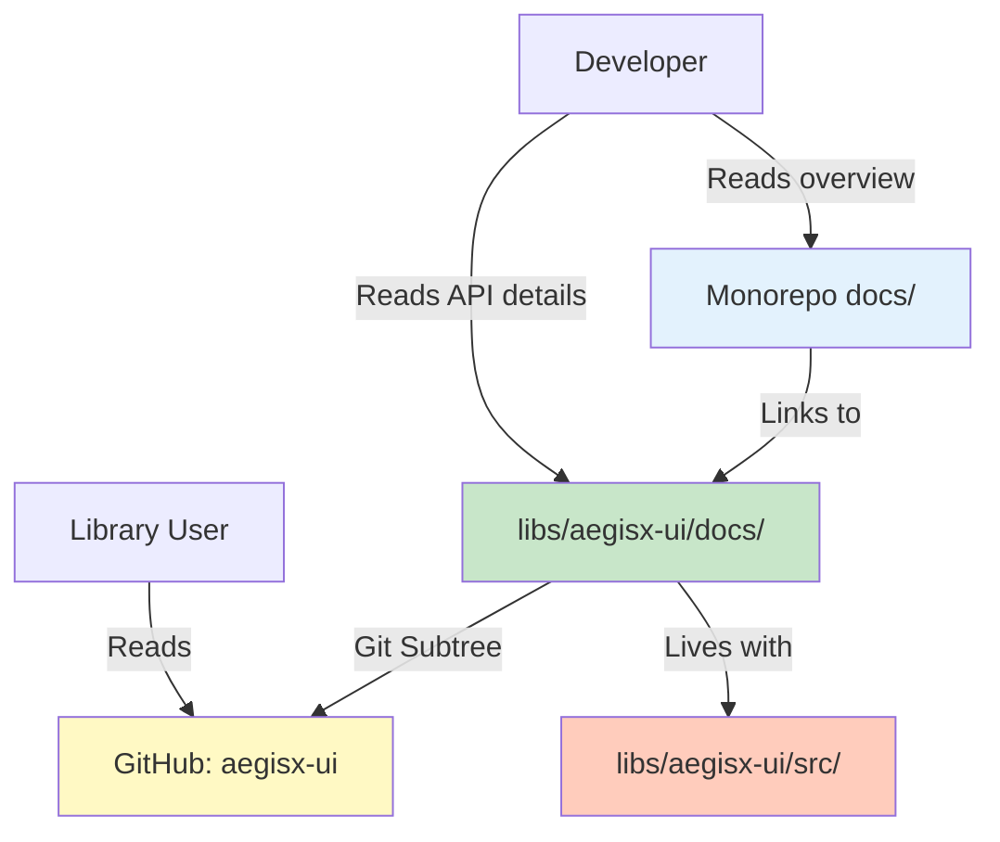

# Design Document

## Overview

This design addresses documentation gaps across three critical areas:

1. **Feature Development Standard** - Complete workflow guide (from 30% to 100%)
2. **aegisx-ui Component Library** - Comprehensive component reference (23+ components)
3. **Backend Architecture** - Advanced repository features documentation

The implementation will ensure aegisx-ui docs live in the library directory (`libs/aegisx-ui/docs/`) for standalone usage while maintaining clear cross-references from monorepo docs.

## Steering Document Alignment

### Technical Standards (tech.md)

**Documentation Standards:**

- Follow Diátaxis framework (Tutorials, How-To Guides, Reference, Explanation)
- Use markdown with consistent formatting
- Include code examples tested against actual implementation
- Version documentation with codebase changes

**Library Architecture:**

- aegisx-ui docs SHALL be self-contained for standalone library usage
- Monorepo docs SHALL link to library docs (not duplicate)
- Follow git subtree sync patterns for library documentation

### Project Structure (structure.md)

**Follows established patterns:**

```
docs/                           # Monorepo documentation
├── guides/development/
│   └── feature-development-standard.md  # Enhanced
├── architecture/
│   └── backend-architecture.md          # Enhanced with UUID, field selection
└── reference/ui/
    └── aegisx-ui-overview.md            # NEW: Links to library docs

libs/aegisx-ui/                 # Library with standalone docs
├── docs/                       # Self-contained documentation
│   ├── README.md
│   ├── THEMING_GUIDE.md        # Existing
│   ├── TOKEN_REFERENCE.md      # Existing
│   ├── component-overview.md   # NEW
│   └── components/             # NEW: Per-component docs
└── src/lib/components/         # Implementation
```

## Code Reuse Analysis

### Existing Components to Leverage

**Documentation Infrastructure:**

- **VitePress setup** (`docs/.vitepress/config.ts`): Leverage for navigation structure
- **Existing doc patterns**: Reuse formatting from `docs/guides/` for consistency
- **Component source code**: Extract TypeScript interfaces for API documentation

**Theming Documentation:**

- **THEMING_GUIDE.md** (594 lines): Already comprehensive, keep as-is
- **TOKEN_REFERENCE.md**: Complete token documentation, no changes needed

### Integration Points

**Git Subtree Sync:**

- `libs/aegisx-ui/` syncs to GitHub: `aegisx-platform/aegisx-ui`
- Use `sync-to-repo.sh` script after documentation updates
- Ensure documentation is part of library package

**Cross-References:**

- Monorepo docs SHALL use relative links: `../../libs/aegisx-ui/docs/components/...`
- Library docs SHALL NOT link to monorepo (must be standalone)

## Architecture

### Modular Design Principles

**Single File Responsibility:**

- Each component doc covers ONE component only
- Feature Development Standard organized by phase (5 separate sections)
- Backend Architecture sections clearly separated by topic

**Component Isolation:**

- Component docs independent (can read calendar.md without reading card.md)
- Cross-references only for related components

**Documentation as Code:**

- Docs live close to implementation (`libs/aegisx-ui/docs/` with `libs/aegisx-ui/src/`)
- Enables documentation updates during code changes
- Git subtree ensures library docs sync to standalone repository



## Components and Interfaces

### Component 1: Feature Development Standard Enhancement

**Purpose:** Transform 66-line outline into comprehensive 500+ line guide with 5 detailed phases

**Structure:**

```markdown
# Feature Development Standard

## Phase 1: Planning & Documentation

### Step 1.1: Create Feature Specification

- [ ] Checklist item with example
- [ ] Tool/command reference

### Step 1.2: Define Requirements

...

## Phase 2: Backend Implementation

### Step 2.1: API Design (API-First)

...

## Phase 3: Frontend Implementation

...

## Phase 4: Integration & Testing

...

## Phase 5: Documentation & Deployment

...

## Appendix

- Templates
- Examples
- Common Pitfalls
```

**Interfaces:**

- Input: Current incomplete standard (66 lines)
- Output: Complete guide with 5 phases, checklists, examples
- Links to: QA Checklist, API-First Standard, Domain Architecture

**Dependencies:**

- Existing QA checklist (`docs/guides/development/qa-checklist.md`)
- API calling standard (`docs/guides/development/api-calling-standard.md`)
- Universal full-stack standard

**Reuses:**

- Domain architecture guide examples
- CRUD generator workflow patterns
- Existing checklist items from QA guide

### Component 2: aegisx-ui Component Reference System

**Purpose:** Create comprehensive documentation for 23+ components with consistent API reference format

**Component Doc Template:**

````markdown
# {Component Name}

## Overview

Brief description and use cases

## Installation & Import

```typescript
import { AxCalendarComponent } from '@aegisx/ui';
```
````

## Basic Usage

```typescript
// Simple example
```

## API Reference

### Inputs

| Name | Type | Default | Description |
| ---- | ---- | ------- | ----------- |

### Outputs

| Name | Type | Description |
| ---- | ---- | ----------- |

### Methods

| Name | Signature | Description |
| ---- | --------- | ----------- |

## Advanced Usage

### Scenario 1

### Scenario 2

## Styling & Theming

- Material tokens
- Custom CSS variables

## Accessibility

- ARIA attributes
- Keyboard navigation

## Related Components

````

**Interfaces:**
- Input: Component TypeScript source code
- Output: Markdown documentation with complete API reference
- Automated: Extract interfaces from TypeScript decorators (@Input, @Output)

**Dependencies:**
- Component source files in `libs/aegisx-ui/src/lib/components/`
- TypeScript interfaces for type information
- Theming guide for styling references

**Reuses:**
- Existing component implementations as single source of truth
- THEMING_GUIDE.md for styling patterns
- Material Design documentation patterns

### Component 3: Backend Architecture Enhancements

**Purpose:** Document advanced BaseRepository features (UUID validation, field selection, multi-sort, audit fields)

**Sections to Add:**

**3.1 UUID Validation Section**
```markdown
## UUID Validation System

### Overview
BaseRepository includes automatic UUID validation...

### Configuration
```typescript
repository.setUUIDValidationConfig({
  strategy: UUIDValidationStrategy.STRICT
});
````

### Strategies

1. STRICT: Throw errors
2. GRACEFUL: Filter invalid UUIDs
3. WARN: Log warnings only

### Common Errors

...

````

**3.2 Field Selection Section**
```markdown
## Field Selection

### Query Parameter
GET /api/users?fields=id,name,email

### Security Considerations
- Only select necessary fields
- Validate field names
- Performance optimization

### Examples
...
````

**Interfaces:**

- Input: Existing backend-architecture.md (2620 lines)
- Output: Same file with 4 new sections (add ~400 lines)
- Position: After "Base Repository Pattern" section

**Dependencies:**

- `apps/api/src/shared/repositories/base.repository.ts` (source of truth)
- `apps/api/src/shared/utils/uuid.utils.ts` (UUID validation implementation)

**Reuses:**

- Existing backend architecture structure
- Code examples from actual repository implementation

### Component 4: Documentation Cross-Reference System

**Purpose:** Link monorepo docs to library docs without duplication

**File: `docs/reference/ui/aegisx-ui-overview.md` (NEW)**

```markdown
# AegisX UI Component Library

## Overview

AegisX UI is a comprehensive Angular component library...

## Quick Start

[Basic example]

## Component Categories

- Data Display: [link to libs/aegisx-ui/docs/components/data-display/]
- Forms: [link to libs/aegisx-ui/docs/components/forms/]
  ...

## Detailed Documentation

For complete API reference, see:

- [Component Documentation](../../libs/aegisx-ui/docs/components/)
- [Theming Guide](../../libs/aegisx-ui/docs/THEMING_GUIDE.md)
- [Token Reference](../../libs/aegisx-ui/docs/TOKEN_REFERENCE.md)
```

**Interfaces:**

- Input: None (new file)
- Output: Navigation hub to library docs
- Links: Relative paths to `libs/aegisx-ui/docs/`

**Dependencies:**

- aegisx-ui component docs (must exist first)

## Data Models

### Documentation Metadata Model

```typescript
interface ComponentDoc {
  name: string; // Component name (e.g., "Calendar")
  selector: string; // HTML selector (e.g., "ax-calendar")
  category: DocCategory; // Category for organization
  inputs: InputDoc[]; // Component inputs
  outputs: OutputDoc[]; // Component outputs
  methods: MethodDoc[]; // Public methods
  examples: CodeExample[]; // Usage examples
  relatedComponents: string[]; // Related component names
}

interface InputDoc {
  name: string;
  type: string;
  defaultValue?: string;
  description: string;
  required: boolean;
}

interface OutputDoc {
  name: string;
  type: string;
  description: string;
}

interface MethodDoc {
  name: string;
  signature: string;
  description: string;
  returnType: string;
}

type DocCategory = 'data-display' | 'forms' | 'feedback' | 'navigation' | 'layout' | 'theme' | 'auth' | 'integrations';
```

### Component Inventory

```yaml
Components (23+):
  data-display:
    - calendar
    - card
    - code-tabs
    - data-display (group)
  forms:
    - input-otp
    - scheduler
    - date-picker
    - popup-edit
    - knob
    - time-slots
  feedback:
    - loading-button
    - skeleton
    - error-state
    - empty-state
  navigation:
    - navigation
    - drawer
    - launcher
  layout:
    - layout
    - gridster
  theme:
    - theme-builder
    - theme-switcher
  auth:
    - auth (group)
  integrations:
    - integrations (group)
```

## Error Handling

### Error Scenarios

**1. Broken Internal Links**

- **Scenario:** Documentation links to non-existent files
- **Handling:** Validate all links during documentation build
- **Prevention:** Use relative paths, verify before commit

**2. Outdated Code Examples**

- **Scenario:** Code examples don't match current API
- **Handling:** Extract examples from actual working code or tests
- **Prevention:** Test examples against current codebase before publishing

**3. Missing Component Documentation**

- **Scenario:** Component exists but no documentation file
- **Handling:** Create component doc using template
- **Prevention:** Checklist in component creation workflow

**4. Git Subtree Sync Failure**

- **Scenario:** aegisx-ui docs don't sync to GitHub
- **Handling:** Manual sync using `sync-to-repo.sh`
- **Prevention:** Verify sync in CI/CD pipeline

**5. Documentation Drift**

- **Scenario:** Docs and code become out of sync over time
- **Handling:** Periodic alignment checks (like this spec)
- **Prevention:** Update docs during code changes, CI validation

## Testing Strategy

### Documentation Validation Testing

**Automated Checks:**

````bash
# Link validation
find docs -name "*.md" -exec markdown-link-check {} \;

# Code example extraction test
# Extract all ```typescript blocks and verify syntax
grep -r "```typescript" docs/ | # extract examples

# Cross-reference validation
# Ensure all component docs exist
````

**Manual Review Checklist:**

- [ ] All code examples copy-paste ready
- [ ] All API references match TypeScript interfaces
- [ ] All links resolve (no 404s)
- [ ] Screenshots/diagrams up to date
- [ ] Consistent formatting across all docs

### Alignment Verification Testing

**Before Documentation:**

- Document current state (already done: 85.8% alignment)

**After Documentation:**

- Re-run alignment check
- Target: 98%+ alignment
- Verify each requirement:
  - Feature Development Standard: Complete 5 phases ✓
  - Component docs: 23+ files exist ✓
  - Backend Architecture: UUID, field selection, multi-sort, audit sections ✓
  - aegisx-ui docs: In libs/aegisx-ui/docs/ ✓
  - Cross-references: Links working ✓

### Integration Testing

**Git Subtree Sync Test:**

```bash
# After completing aegisx-ui docs
cd libs/aegisx-ui
bash sync-to-repo.sh

# Verify on GitHub
# Check: https://github.com/aegisx-platform/aegisx-ui/tree/main/docs
```

**Navigation Test:**

```bash
# Start from monorepo root
cd docs/reference/ui/
# Follow link to aegisx-ui-overview.md
# Follow link to libs/aegisx-ui/docs/components/calendar.md
# Verify: No broken links in chain
```

### User Acceptance Testing

**Developer Experience Test:**

1. New developer onboarding scenario:
   - Start with Feature Development Standard
   - Follow Phase 1 workflow
   - Verify: Can complete Phase 1 without asking questions
2. Component usage scenario:
   - Developer needs to use ax-calendar
   - Reads component-overview.md → components/data-display/calendar.md
   - Verify: Can implement calendar without reading source code
3. Repository feature scenario:
   - Developer needs UUID validation
   - Reads Backend Architecture → UUID Validation section
   - Verify: Can configure UUID validation without trial-and-error

## Implementation Priority

### Phase 1: Foundation (High Priority)

1. Create aegisx-ui documentation structure
2. Complete Feature Development Standard

### Phase 2: Component Docs (Medium Priority)

3. Generate component reference docs (23+ files)
4. Create component-overview.md

### Phase 3: Enhancements (Low Priority)

5. Update Backend Architecture
6. Create cross-reference system

### Phase 4: Validation (Critical)

7. Link validation
8. Alignment verification
9. Git subtree sync test

## File Modifications Summary

**New Files (30+):**

- `libs/aegisx-ui/docs/component-overview.md`
- `libs/aegisx-ui/docs/components/{category}/{component}.md` (23+ files)
- `docs/reference/ui/aegisx-ui-overview.md`

**Modified Files (2):**

- `docs/guides/development/feature-development-standard.md` (66 → 500+ lines)
- `docs/architecture/backend-architecture.md` (+400 lines for 4 sections)

**Moved Files (0):**

- All existing aegisx-ui docs already in correct location

**Total Documentation Size:**

- Current: ~4,500 lines
- After: ~12,000+ lines (167% increase)
- Alignment: 85.8% → 98%+
