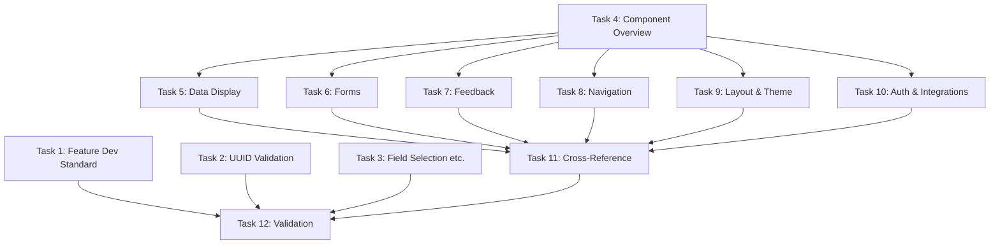

# Tasks Document

## Phase 1: Core Documentation Enhancement

- [x] 1. Complete Feature Development Standard document
  - File: `docs/guides/development/feature-development-standard.md`
  - Expand from 66 lines to 500+ lines with 5 detailed phases
  - Add workflows, checklists, examples, and common pitfalls for each phase
  - Include Claude AI integration points (progress tracking, session logging)
  - Purpose: Provide comprehensive feature development guide
  - _Leverage: `docs/guides/development/qa-checklist.md`, `docs/guides/development/api-calling-standard.md`_
  - _Requirements: 1_
  - _Prompt: Implement the task for spec documentation-improvement, first run spec-workflow-guide to get the workflow guide then implement the task: Role: Technical Writer specializing in developer documentation and workflow design | Task: Complete the Feature Development Standard document following requirement 1 by expanding it from 66 lines to 500+ comprehensive lines covering all 5 phases (Planning & Documentation, Backend Implementation, Frontend Implementation, Integration & Testing, Documentation & Deployment), leveraging existing QA checklist and API-First standard patterns | Restrictions: Do not remove existing content, maintain existing links, ensure all phases have step-by-step workflows with practical examples | Success: Document contains detailed workflows for all 5 phases, each phase includes checklists and examples, Claude AI integration points documented, document follows Diátaxis framework | Instructions: After starting this task, edit tasks.md to mark task 1 as in-progress [-]. Upon completion, use log-implementation tool with detailed artifacts (apiEndpoints, components, functions, etc.), then mark task 1 as completed [x] in tasks.md_

- [x] 2. Update Backend Architecture with UUID Validation section
  - File: `docs/architecture/backend-architecture.md`
  - Add comprehensive UUID Validation section after "Base Repository Pattern"
  - Document smartValidateUUIDs(), UUIDValidationStrategy, configuration methods
  - Include code examples from actual base.repository.ts implementation
  - Purpose: Document advanced UUID validation features
  - _Leverage: `apps/api/src/shared/repositories/base.repository.ts`, `apps/api/src/shared/utils/uuid.utils.ts`_
  - _Requirements: 3_
  - _Prompt: Implement the task for spec documentation-improvement, first run spec-workflow-guide to get the workflow guide then implement the task: Role: Backend Documentation Specialist with expertise in TypeScript and repository patterns | Task: Add UUID Validation section to Backend Architecture following requirement 3, documenting the smartValidateUUIDs function, UUIDValidationStrategy options (STRICT, GRACEFUL, WARN), and configuration methods with examples from base.repository.ts and uuid.utils.ts | Restrictions: Do not modify existing sections, insert after "Base Repository Pattern" section, use actual code examples from implementation | Success: UUID validation section is comprehensive and accurate, includes all strategies with use cases, code examples work and match implementation, common errors and solutions documented | Instructions: After starting, mark task 2 as in-progress [-] in tasks.md. After completion, log implementation with artifacts, then mark completed [x]_

- [x] 3. Update Backend Architecture with Field Selection, Multi-Sort, and Audit Fields sections
  - File: `docs/architecture/backend-architecture.md`
  - Add three sections: Field Selection, Multi-Sort Support, Audit Fields Configuration
  - Document `fields` query param, multi-sort syntax, RepositoryFieldConfig options
  - Include security considerations, performance tips, and practical examples
  - Purpose: Document advanced repository query features
  - _Leverage: `apps/api/src/shared/repositories/base.repository.ts` (methods: list, applyMultipleSort, RepositoryFieldConfig)_
  - _Requirements: 3_
  - _Prompt: Implement the task for spec documentation-improvement, first run spec-workflow-guide to get the workflow guide then implement the task: Role: Backend Documentation Specialist with expertise in API design and database optimization | Task: Add three sections (Field Selection, Multi-Sort Support, Audit Fields Configuration) to Backend Architecture following requirement 3, documenting fields query parameter with security implications, multi-sort syntax (field1:desc,field2:asc), and RepositoryFieldConfig options for created_by/updated_by tracking | Restrictions: Do not modify existing sections, insert after UUID Validation section, provide security warnings for field selection | Success: Three sections added with comprehensive documentation, field selection includes security considerations, multi-sort examples cover complex scenarios, audit fields configuration well-explained with custom field names | Instructions: After starting, mark task 3 as in-progress [-]. After completion, log with artifacts, mark completed [x]_

## Phase 2: aegisx-ui Component Reference System

- [x] 4. Create aegisx-ui Component Overview document
  - File: `libs/aegisx-ui/docs/component-overview.md`
  - Create comprehensive component index organized by category
  - Include component selector, purpose, and link to detailed docs
  - Add quick start guide and navigation to component docs
  - Purpose: Provide component library index and navigation hub
  - _Leverage: Component inventory from design.md, existing `libs/aegisx-ui/docs/THEMING_GUIDE.md` structure_
  - _Requirements: 2, 4_
  - _Prompt: Implement the task for spec documentation-improvement, first run spec-workflow-guide to get the workflow guide then implement the task: Role: Technical Writer specializing in component library documentation | Task: Create component-overview.md following requirements 2 and 4, organizing all 23+ components by category (Data Display, Forms, Feedback, Navigation, Layout, Theme, Auth, Integrations) with selector, purpose, and links to detailed component docs | Restrictions: Must be self-contained for standalone library usage, do not link to monorepo docs, maintain consistency with THEMING_GUIDE.md style | Success: All components listed and categorized correctly, quick start section helps new users, navigation links work, document structure mirrors design.md component inventory | Instructions: After starting, mark task 4 as in-progress [-]. After completion, log with artifacts, mark completed [x]_

- [x] 5. Create Data Display component documentation (4 components)
  - Files: `libs/aegisx-ui/docs/components/data-display/{calendar,card,code-tabs,data-display}.md`
  - Create component docs for: ax-calendar, ax-card, ax-code-tabs, data-display components
  - Use component doc template from design.md (API Reference, Examples, Styling, Accessibility)
  - Extract inputs/outputs from TypeScript source code
  - Purpose: Document data display components with complete API reference
  - _Leverage: `libs/aegisx-ui/src/lib/components/calendar/`, `card/`, `code-tabs/`, `data-display/` source code_
  - _Requirements: 2_
  - _Prompt: Implement the task for spec documentation-improvement, first run spec-workflow-guide to get the workflow guide then implement the task: Role: Frontend Documentation Specialist with Angular component expertise | Task: Create comprehensive documentation for 4 Data Display components (calendar, card, code-tabs, data-display) following requirement 2 and component doc template from design.md, extracting API details from TypeScript source code in libs/aegisx-ui/src/lib/components/ | Restrictions: Must extract inputs/outputs from actual source code, use component doc template exactly, ensure examples are copy-paste ready | Success: 4 component docs created with complete API reference (inputs, outputs, methods), usage examples work without modification, styling customization documented, accessibility considerations included | Instructions: After starting, mark task 5 as in-progress [-]. After completion, log with detailed artifacts including component names and file paths, mark completed [x]_

- [x] 6. Create Forms component documentation (6 components)
  - Files: `libs/aegisx-ui/docs/components/forms/{input-otp,scheduler,date-picker,popup-edit,knob,time-slots}.md`
  - Create component docs for form components
  - Document form integration patterns (FormControl, validation)
  - Include accessibility requirements for form inputs
  - Purpose: Document form components with Angular Forms integration
  - _Leverage: `libs/aegisx-ui/src/lib/components/forms/` source code, Angular Forms patterns_
  - _Requirements: 2_
  - _Prompt: Implement the task for spec documentation-improvement, first run spec-workflow-guide to get the workflow guide then implement the task: Role: Angular Forms Specialist with expertise in form component documentation | Task: Create comprehensive documentation for 6 Forms components (input-otp, scheduler, date-picker, popup-edit, knob, time-slots) following requirement 2, documenting Angular Forms integration patterns (FormControl, validators) with accessibility requirements | Restrictions: Must document FormControl integration, include ARIA attributes, ensure keyboard navigation documented | Success: 6 form component docs created, FormControl integration explained with examples, validation patterns documented, accessibility compliance detailed (ARIA, keyboard nav) | Instructions: After starting, mark task 6 as in-progress [-]. After completion, log with component artifacts, mark completed [x]_

- [x] 7. Create Feedback component documentation (4 components)
  - Files: `libs/aegisx-ui/docs/components/feedback/{loading-button,skeleton,error-state,empty-state}.md`
  - Create component docs for user feedback components
  - Document loading states, error handling patterns
  - Include UX best practices for feedback components
  - Purpose: Document feedback components for user experience
  - _Leverage: `libs/aegisx-ui/src/lib/components/{loading-button,skeleton,error-state,empty-state}/` source code_
  - _Requirements: 2_
  - _Prompt: Implement the task for spec documentation-improvement, first run spec-workflow-guide to get the workflow guide then implement the task: Role: UX-focused Documentation Specialist | Task: Create comprehensive documentation for 4 Feedback components (loading-button, skeleton, error-state, empty-state) following requirement 2, documenting loading states, error handling patterns, and UX best practices for user feedback | Restrictions: Include UX guidelines for when to use each component, document loading state transitions, ensure error messages are user-friendly | Success: 4 feedback component docs created, UX best practices included, loading state patterns explained, error handling examples practical and user-friendly | Instructions: After starting, mark task 7 as in-progress [-]. After completion, log with component artifacts, mark completed [x]_

- [x] 8. Create Navigation component documentation (3 components)
  - Files: `libs/aegisx-ui/docs/components/navigation/{navigation,drawer,launcher}.md`
  - Create component docs for navigation components
  - Document routing integration with Angular Router
  - Include navigation patterns and accessibility requirements
  - Purpose: Document navigation components for application structure
  - _Leverage: `libs/aegisx-ui/src/lib/components/{navigation,drawer,launcher}/` source code, Angular Router integration_
  - _Requirements: 2_
  - _Prompt: Implement the task for spec documentation-improvement, first run spec-workflow-guide to get the workflow guide then implement the task: Role: Angular Navigation Specialist | Task: Create comprehensive documentation for 3 Navigation components (navigation, drawer, launcher) following requirement 2, documenting Angular Router integration, navigation patterns, and accessibility requirements (keyboard nav, focus management) | Restrictions: Must document Router integration, include navigation patterns for different app structures, ensure ARIA navigation landmarks documented | Success: 3 navigation component docs created, Router integration patterns explained, keyboard navigation documented, focus management and ARIA landmarks included | Instructions: After starting, mark task 8 as in-progress [-]. After completion, log with component artifacts, mark completed [x]_

- [x] 9. Create Layout & Theme component documentation (4 components)
  - Files: `libs/aegisx-ui/docs/components/layout/{layout,gridster}.md`, `libs/aegisx-ui/docs/components/theme/{theme-builder,theme-switcher}.md`
  - Create component docs for layout and theming components
  - Document responsive layout patterns and theme customization
  - Link to THEMING_GUIDE.md for detailed theming documentation
  - Purpose: Document layout and theming infrastructure
  - _Leverage: `libs/aegisx-ui/src/lib/components/{layout,gridster,theme-builder,theme-switcher}/` source code, `THEMING_GUIDE.md`_
  - _Requirements: 2_
  - _Prompt: Implement the task for spec documentation-improvement, first run spec-workflow-guide to get the workflow guide then implement the task: Role: UI Architecture Specialist with theming expertise | Task: Create comprehensive documentation for 4 Layout & Theme components (layout, gridster, theme-builder, theme-switcher) following requirement 2, documenting responsive layout patterns, theme customization with cross-references to THEMING_GUIDE.md | Restrictions: Must cross-reference THEMING_GUIDE.md for detailed theming, document responsive breakpoints, ensure grid system explained clearly | Success: 4 component docs created, responsive patterns documented, theme customization linked to THEMING_GUIDE.md, grid system and breakpoints clear | Instructions: After starting, mark task 9 as in-progress [-]. After completion, log with component artifacts, mark completed [x]_

- [x] 10. Create Auth & Integrations component documentation (2+ components)
  - Files: `libs/aegisx-ui/docs/components/auth/*.md`, `libs/aegisx-ui/docs/components/integrations/*.md`
  - Create component docs for authentication and integration components
  - Document security best practices for auth components
  - Include integration patterns with external services
  - Purpose: Document authentication and integration components
  - _Leverage: `libs/aegisx-ui/src/lib/components/{auth,integrations}/` source code_
  - _Requirements: 2_
  - _Prompt: Implement the task for spec documentation-improvement, first run spec-workflow-guide to get the workflow guide then implement the task: Role: Security-focused Documentation Specialist | Task: Create comprehensive documentation for Auth and Integrations components following requirement 2, documenting security best practices for authentication components and integration patterns with external services | Restrictions: Must include security warnings, document token handling safely, ensure integration examples use placeholder credentials | Success: Auth and integrations component docs created, security best practices prominent, token handling documented safely, integration patterns clear with placeholder values | Instructions: After starting, mark task 10 as in-progress [-]. After completion, log with component artifacts, mark completed [x]_

## Phase 3: Cross-Reference & Organization

- [x] 11. Create monorepo cross-reference documentation
  - File: `docs/reference/ui/aegisx-ui-overview.md`
  - Create navigation hub from monorepo to library docs
  - Include quick examples and links to detailed component API
  - Document the relationship between monorepo and library docs
  - Purpose: Provide clear navigation from monorepo to library documentation
  - _Leverage: `libs/aegisx-ui/docs/component-overview.md`_
  - _Requirements: 5_
  - _Prompt: Implement the task for spec documentation-improvement, first run spec-workflow-guide to get the workflow guide then implement the task: Role: Information Architect specializing in documentation structure | Task: Create aegisx-ui-overview.md following requirement 5 as navigation hub from monorepo docs to library docs, providing quick examples and clear links to detailed component API in libs/aegisx-ui/docs/ | Restrictions: Do not duplicate library content, use relative links to library docs, explain documentation organization clearly | Success: Cross-reference doc created with clear navigation, quick examples helpful for overview, links to library docs work correctly, relationship between monorepo and library docs explained | Instructions: After starting, mark task 11 as in-progress [-]. After completion, log with artifacts, mark completed [x]_

## Phase 4: Validation & Quality Assurance

- [x] 12. Validate documentation links and code examples
  - Validate all internal documentation links
  - Test all code examples for syntax and accuracy
  - Verify alignment with current codebase (target: 98%+)
  - Run git subtree sync test for aegisx-ui docs
  - Purpose: Ensure documentation quality and accuracy
  - _Leverage: `markdown-link-check`, TypeScript compiler for code validation, `sync-to-repo.sh`_
  - _Requirements: All_
  - _Prompt: Implement the task for spec documentation-improvement, first run spec-workflow-guide to get the workflow guide then implement the task: Role: QA Engineer specializing in documentation testing | Task: Validate all documentation following all requirements by checking internal links (markdown-link-check), testing code examples for syntax, verifying alignment with codebase (target 98%+), and testing git subtree sync for aegisx-ui docs | Restrictions: Must fix all broken links, ensure all code examples compile, verify actual alignment score, test sync-to-repo.sh successfully | Success: All internal links work (no 404s), all code examples are syntactically correct and tested, alignment verification shows 98%+ (up from 85.8%), git subtree sync test successful for aegisx-ui docs | Instructions: After starting, mark task 12 as in-progress [-]. After completion, log comprehensive validation results including link count, code example count, alignment score, and sync test results, then mark completed [x]_

## Implementation Notes

### Task Dependencies

### Implementation Priority

**High Priority (Complete First):**

- Tasks 1-3: Core documentation (Feature Standard, Backend Architecture)
- Task 4: Component Overview (enables all component tasks)

**Medium Priority (Parallel Execution):**

- Tasks 5-10: Component documentation (can be done in parallel)

**Low Priority (Finalize):**

- Task 11: Cross-references (requires component docs)
- Task 12: Validation (requires all docs complete)

### Success Metrics

- **Documentation Coverage**: 30+ new/updated files
- **Line Count**: From 4,500 to 12,000+ lines
- **Alignment Score**: From 85.8% to 98%+
- **Component Coverage**: 23+ components documented
- **Link Validation**: 100% working links
- **Code Example Validation**: 100% syntax-correct examples
- **Git Subtree Sync**: Successful sync to GitHub

### Testing Strategy

Each task should verify:

1. Content accuracy (matches implementation)
2. Code examples work (tested against current code)
3. Links resolve correctly
4. Formatting consistent (markdown lint)
5. Accessibility guidelines followed (for component docs)

Final validation (Task 12) ensures:

- No broken links across all docs
- All code examples compile and run
- Alignment verification confirms 98%+ score
- Git subtree sync works for aegisx-ui
