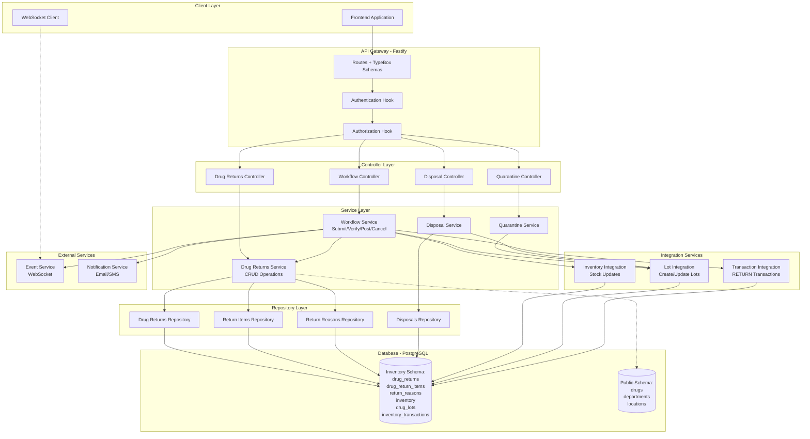
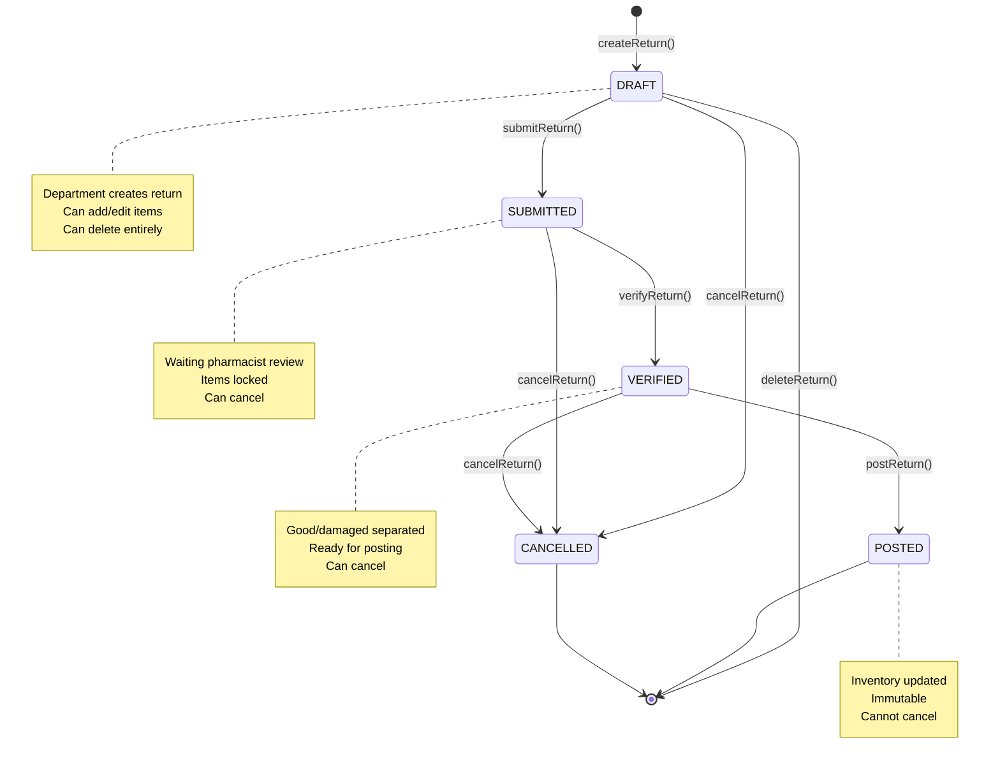

# Design Document - Drug Return Backend API

## Overview

The Drug Return Backend API implements a comprehensive drug return management system for hospital pharmacies, handling the complete return lifecycle from department initiation through pharmacist verification to inventory restocking and disposal management. This API bridges the gap between Distribution and Inventory systems, ensuring complete traceability of returned drugs with proper good/damaged separation.

**System Position in INVS Modern:**

```
Distribution → Drug Return → Inventory
     ↓             ↓             ↓
  Dispense      Return       Restock
   Drugs        Drugs        or Dispose
```

**Key Design Principles:**

- **API-First Development**: Complete specification before implementation following existing procurement/inventory patterns
- **Domain-Driven Design**: Operations domain (`inventory/operations/drug-returns`) with clear bounded contexts
- **Workflow State Machine**: DRAFT → SUBMITTED → VERIFIED → POSTED with validation at each transition
- **Good/Damaged Separation**: Core business logic ensuring only quality drugs return to stock
- **Inventory Integration**: Atomic transactions for RETURN movements with lot traceability
- **Audit Trail**: Immutable transaction log for regulatory compliance
- **Quarantine Management**: Isolated storage for damaged drugs pending disposal

**Architecture Approach:**

- **Repository Pattern**: Clean data access layer extending BaseRepository
- **Service Layer**: Business logic orchestration with workflow services
- **TypeBox Validation**: Type-safe request/response contracts
- **Transaction Management**: Knex transactions for atomic multi-step operations
- **WebSocket Events**: Real-time UI updates for status changes
- **Database Functions**: Complex validation logic in PostgreSQL (optional)

## Steering Document Alignment

### Technical Standards (tech.md)

This design follows AegisX platform standards:

1. **Fastify Framework**
   - All endpoints use Fastify with TypeBox schema validation
   - Routes registered via plugin pattern
   - Dependency injection via `fastify.decorate()`

2. **Layered Architecture**
   - **Routes Layer**: HTTP endpoint definitions with schemas
   - **Controller Layer**: Request/response handling, parameter extraction
   - **Service Layer**: Business logic, workflow orchestration
   - **Repository Layer**: Database operations via Knex/BaseRepository
   - **Database Layer**: PostgreSQL with `inventory` schema

3. **TypeScript Standards**
   - Strict mode enabled, no `any` types
   - Interface-first design for all contracts
   - Type exports from `.types.ts` files
   - Generic types for reusable patterns

4. **BaseRepository Pattern**
   - Extends `BaseRepository<T, CreateDto, UpdateDto>`
   - Automatic pagination, filtering, sorting
   - UUID validation for all ID fields
   - Consistent error handling

5. **Authentication & Authorization**
   - JWT authentication via `fastify.authenticate` hook
   - RBAC via `fastify.verifyPermission` hook
   - Department-level data access restrictions

6. **Error Handling**
   - Custom AppError classes with error codes
   - HTTP status mapping (400, 404, 403, 500)
   - Localized error messages (EN/TH)
   - Structured error responses

7. **Logging & Monitoring**
   - Structured logging with correlation IDs
   - Request/response logging via Fastify
   - Error tracking with stack traces
   - Performance metrics (response times)

8. **WebSocket Events**
   - Real-time updates via EventService
   - CRUD event helpers for automatic broadcasting
   - Room-based events for department filtering

9. **Database Migrations**
   - Knex migration files in `migrations-inventory/`
   - Version-controlled schema changes
   - Rollback support for failed migrations

10. **Testing Standards**
    - Unit tests for services (target: 80% coverage)
    - Integration tests for workflows
    - API endpoint testing with Fastify inject
    - Mock external dependencies

### Project Structure (structure.md)

Implementation follows `inventory/operations` domain organization:

```
apps/api/src/layers/inventory/operations/
├── drug-returns/
│   ├── drug-returns.repository.ts        # Data access layer
│   ├── drug-returns.service.ts           # Business logic (CRUD)
│   ├── drug-returns.controller.ts        # HTTP request handling
│   ├── drug-returns.routes.ts            # Route definitions
│   ├── drug-returns.schemas.ts           # TypeBox schemas
│   ├── drug-returns.types.ts             # TypeScript types
│   ├── drug-returns.plugin.ts            # Fastify plugin
│   ├── index.ts                          # Public exports
│   └── __tests__/
│       ├── drug-returns.repository.spec.ts
│       ├── drug-returns.service.spec.ts
│       └── drug-returns.controller.spec.ts
├── drug-return-items/
│   ├── drug-return-items.repository.ts
│   ├── drug-return-items.service.ts
│   ├── drug-return-items.controller.ts
│   ├── drug-return-items.routes.ts
│   ├── drug-return-items.schemas.ts
│   ├── drug-return-items.types.ts
│   ├── index.ts
│   └── __tests__/
├── drug-return-workflows/
│   ├── submit-return.workflow.ts         # DRAFT → SUBMITTED
│   ├── verify-return.workflow.ts         # SUBMITTED → VERIFIED
│   ├── post-return.workflow.ts           # VERIFIED → POSTED
│   ├── cancel-return.workflow.ts         # Any → CANCELLED
│   ├── workflow.types.ts
│   └── __tests__/
├── return-reasons/
│   ├── return-reasons.repository.ts
│   ├── return-reasons.service.ts
│   ├── return-reasons.controller.ts
│   ├── return-reasons.routes.ts
│   ├── return-reasons.schemas.ts
│   └── index.ts
├── quarantine-management/
│   ├── quarantine.service.ts             # Quarantine operations
│   ├── quarantine.controller.ts
│   ├── quarantine.routes.ts
│   ├── quarantine.schemas.ts
│   └── __tests__/
├── disposal-management/                  # Optional - Phase 5
│   ├── disposals.repository.ts
│   ├── disposals.service.ts
│   ├── disposals.controller.ts
│   ├── disposals.routes.ts
│   ├── disposals.schemas.ts
│   └── __tests__/
└── integrations/
    ├── inventory-integration.service.ts  # Inventory stock updates
    ├── lot-integration.service.ts        # Lot management
    └── transaction-integration.service.ts # Inventory transactions
```

**Database Schema**: `inventory` (same as Inventory API)

**Tables Used**:

- `inventory.drug_returns` (new)
- `inventory.drug_return_items` (new)
- `inventory.return_reasons` (new - master data)
- `inventory.inventory` (existing - update quantities)
- `inventory.drug_lots` (existing - update/create lots)
- `inventory.inventory_transactions` (existing - create RETURN transactions)
- `inventory.locations` (existing - validate return location, quarantine)

**Migration Path**: `apps/api/src/database/migrations-inventory/`

## Code Reuse Analysis

### Existing Components to Leverage

1. **BaseRepository** (`shared/repositories/base.repository.ts`)
   - **Usage**: All repositories extend BaseRepository
   - **Features**:
     - `findById()`, `list()`, `create()`, `update()`, `delete()`
     - Automatic pagination with metadata
     - Filtering and sorting
     - Field selection
     - Search functionality
     - UUID validation
   - **Our Implementation**:
     - `DrugReturnsRepository extends BaseRepository<DrugReturn, CreateDrugReturnDto, UpdateDrugReturnDto>`
     - `DrugReturnItemsRepository extends BaseRepository<DrugReturnItem, CreateReturnItemDto, UpdateReturnItemDto>`
     - `ReturnReasonsRepository extends BaseRepository<ReturnReason, CreateReturnReasonDto, UpdateReturnReasonDto>`

2. **BaseService** (`shared/services/base.service.ts`)
   - **Usage**: All services extend BaseService
   - **Features**:
     - `getById()`, `getList()`, `create()`, `update()`, `delete()`
     - Validation hooks: `validateCreate`, `beforeCreate`, `afterCreate`
     - Error handling with AppError
     - Logging and audit trails
   - **Our Implementation**:
     - `DrugReturnsService extends BaseService` for CRUD operations
     - Separate `DrugReturnWorkflowService` for workflow operations (composition)

3. **EventService** (`shared/websocket/event.service.ts`)
   - **Usage**: Real-time WebSocket notifications
   - **Features**:
     - `emitCRUDEvent()` - Auto-broadcast create/update/delete
     - Room-based events (e.g., department-specific)
     - Structured event payloads
   - **Our Implementation**:
     - Emit events on status changes (SUBMITTED, VERIFIED, POSTED)
     - Department-specific rooms for notifications
     - Real-time UI updates for pending returns list

4. **AppError** (`core/errors/app-error.ts`)
   - **Usage**: Standardized error responses
   - **Error Codes**:
     - `RETURN_NOT_FOUND` (404)
     - `INVALID_STATUS_TRANSITION` (400)
     - `INSUFFICIENT_STOCK` (400)
     - `QUARANTINE_NOT_CONFIGURED` (400)
     - `INVALID_QUANTITY_SEPARATION` (400)
   - **Our Implementation**: Use existing AppError for all business logic errors

5. **TypeBox Base Schemas** (`schemas/base.schemas.ts`)
   - **Usage**: Reusable schema patterns
   - **Schemas**:
     - `PaginationQuerySchema`
     - `SortingQuerySchema`
     - `ApiSuccessResponseSchema<T>`
     - `PaginatedResponseSchema<T>`
     - `UUIDSchema`
     - `DateStringSchema`
   - **Our Implementation**: Extend base schemas for return-specific queries

6. **Authentication Hooks** (`core/auth/hooks/`)
   - **Usage**: JWT validation and RBAC
   - **Hooks**:
     - `fastify.authenticate` - Validates JWT token
     - `fastify.verifyPermission(['pharmacist', 'department_staff'])` - RBAC check
   - **Our Implementation**:
     - All endpoints require authentication
     - Verify/post operations require 'pharmacist' role
     - Create/view operations allow 'department_staff'

7. **Response Helpers** (`core/response/response-helper.ts`)
   - **Usage**: Standardized response formats
   - **Methods**:
     - `reply.paginated(data, pagination)` - Paginated responses
     - `reply.success(data, message)` - Success responses
     - `reply.error(error)` - Error responses
   - **Our Implementation**: Use for all controller responses

8. **Knex Query Builder** (`database/knex.client.ts`)
   - **Usage**: Database queries and transactions
   - **Features**:
     - Transaction support: `knex.transaction(async (trx) => {...})`
     - Query builder: `knex('drug_returns').where(...)`
     - Raw queries: `knex.raw('SELECT ...')`
   - **Our Implementation**:
     - Use transactions for all workflow operations (submit, verify, post)
     - Repository queries via BaseRepository (which uses Knex)

### Existing Components to Extend

1. **Inventory Service** (existing)
   - **Location**: `apps/api/src/layers/inventory/operations/inventory/inventory.service.ts`
   - **Current**: CRUD operations for inventory records
   - **Extension**: Called by DrugReturnWorkflowService to update stock
   - **Integration**: `InventoryIntegrationService` wrapper

2. **Drug Lots Service** (existing)
   - **Location**: `apps/api/src/layers/inventory/operations/drug-lots/drug-lots.service.ts`
   - **Current**: CRUD operations for lot records
   - **Extension**: Called to create/update lots when posting returns
   - **Integration**: `LotIntegrationService` wrapper

3. **Inventory Transactions Service** (existing)
   - **Location**: `apps/api/src/layers/inventory/operations/inventory-transactions/`
   - **Current**: CRUD operations for transaction log
   - **Extension**: Called to create RETURN transactions
   - **Integration**: `TransactionIntegrationService` wrapper

4. **Locations Service** (Master Data)
   - **Location**: `apps/api/src/layers/platform/locations/` (assumed)
   - **Current**: CRUD for locations
   - **Extension**: Validate location_id, find QUARANTINE location
   - **Integration**: Direct service calls

### Integration Points

1. **Inventory Management Integration** (Same Database)
   - **Tables**: `inventory.inventory`, `inventory.drug_lots`, `inventory.inventory_transactions`
   - **Operations**:
     - **Posting Returns**: Update inventory quantities, create/update lots, create transactions
     - **Quarantine**: Create inactive lots in QUARANTINE location
   - **Method**: Direct Knex transactions (no API calls)
   - **Service**: `InventoryIntegrationService`
   - **Error Handling**: Atomic transactions with rollback on failure

2. **Distribution API Integration** (Optional - for validation)
   - **Purpose**: Validate returned lots match distributed lots
   - **Endpoint**: `GET /api/inventory/operations/distributions/items?lotNumber={lot}`
   - **Method**: Service-to-service HTTP call (optional)
   - **Fallback**: Skip validation if Distribution API unavailable

3. **Master Data Tables**
   - **Tables**: `public.drugs`, `public.departments`, `public.locations`
   - **Validation**: Foreign key constraints + service validation
   - **Error Handling**: Return 404 if master data not found

4. **Notification System** (Optional)
   - **Purpose**: Notify stakeholders on workflow transitions
   - **Events**:
     - Return submitted → Notify pharmacy department
     - Return verified → Notify requester
     - Return posted → Notify inventory manager
   - **Method**: EventService WebSocket + optional email service
   - **Fallback**: Continue operation if notification fails

5. **WebSocket Events**
   - **Events**:
     - `drug-return.created` - New return request
     - `drug-return.status.changed` - Status transition
     - `drug-return.posted` - Inventory updated
   - **Rooms**: Department-specific rooms for filtering
   - **Method**: EventService.emitCRUDEvent()

## Architecture

### Overall System Architecture



### Workflow State Machine



### Module Responsibilities

#### 1. Drug Returns Module (CRUD)

**Responsibility**: Manage drug return records (header)

**Components**:

- `DrugReturnsRepository` - Data access
- `DrugReturnsService` - Business logic
- `DrugReturnsController` - HTTP handling
- `DrugReturnsRoutes` - Endpoint definitions

**Operations**:

- Create return (DRAFT)
- List returns with filters
- Get return by ID
- Update return (DRAFT only)
- Delete return (DRAFT only)
- Get return statistics

#### 2. Drug Return Items Module (CRUD)

**Responsibility**: Manage return item records (line items)

**Components**:

- `DrugReturnItemsRepository` - Data access
- `DrugReturnItemsService` - Business logic
- `DrugReturnItemsController` - HTTP handling
- `DrugReturnItemsRoutes` - Endpoint definitions

**Operations**:

- Add items to return (DRAFT only)
- Update item quantities (DRAFT only)
- Remove items (DRAFT only)
- List items for return
- Validate lot numbers

#### 3. Workflow Module

**Responsibility**: Orchestrate return workflow transitions

**Components**:

- `SubmitReturnWorkflow` - DRAFT → SUBMITTED
- `VerifyReturnWorkflow` - SUBMITTED → VERIFIED
- `PostReturnWorkflow` - VERIFIED → POSTED
- `CancelReturnWorkflow` - Any → CANCELLED

**Operations**:

- Submit return for verification
- Verify and separate good/damaged
- Post to inventory (atomic)
- Cancel return

#### 4. Inventory Integration Module

**Responsibility**: Update inventory when returns posted

**Components**:

- `InventoryIntegrationService` - Stock quantity updates
- `LotIntegrationService` - Lot creation/updates
- `TransactionIntegrationService` - RETURN transactions

**Operations**:

- Update/create inventory records
- Update/create drug lots
- Create inventory transactions
- Move damaged to quarantine

#### 5. Quarantine Management Module

**Responsibility**: Manage damaged drugs in quarantine

**Components**:

- `QuarantineService` - Quarantine operations
- `QuarantineController` - HTTP handling
- `QuarantineRoutes` - Endpoints

**Operations**:

- List quarantine stock
- Get quarantine lot details
- Search quarantine by drug/expiry
- Quarantine summary reports

#### 6. Disposal Management Module (Optional - Phase 5)

**Responsibility**: Document drug disposal

**Components**:

- `DisposalsRepository` - Data access
- `DisposalsService` - Business logic
- `DisposalsController` - HTTP handling
- `DisposalsRoutes` - Endpoints

**Operations**:

- Create disposal document
- Assign committee members
- Complete disposal with evidence
- List disposal documents

## Components and Interfaces

### Component 1: DrugReturnsService

**Purpose**: CRUD operations for drug return records

**Extends**: `BaseService<DrugReturn, CreateDrugReturnDto, UpdateDrugReturnDto>`

**Public Methods**:

```typescript
class DrugReturnsService extends BaseService {
  // Inherited from BaseService
  async getById(id: string): Promise<DrugReturn>;
  async getList(query: ListQueryDto): Promise<PaginatedResult<DrugReturn>>;
  async create(dto: CreateDrugReturnDto): Promise<DrugReturn>;
  async update(id: string, dto: UpdateDrugReturnDto): Promise<DrugReturn>;
  async delete(id: string): Promise<void>;

  // Custom methods
  async getReturnWithItems(id: string): Promise<DrugReturnWithItems>;
  async getDepartmentReturns(departmentId: string, query: ListQueryDto): Promise<PaginatedResult<DrugReturn>>;
  async getReturnsByStatus(status: ReturnStatus, query: ListQueryDto): Promise<PaginatedResult<DrugReturn>>;
  async getReturnStatistics(filters: StatisticsFilterDto): Promise<ReturnStatistics>;
}
```

**Dependencies**:

- `DrugReturnsRepository`
- `ReturnItemsRepository`
- `EventService`

**Validation Hooks**:

- `validateCreate`: Check department exists, return reason exists
- `beforeCreate`: Generate return_number, set status=DRAFT, calculate totals
- `afterCreate`: Emit WebSocket event
- `validateUpdate`: Check status is DRAFT
- `beforeUpdate`: Recalculate totals
- `afterUpdate`: Emit WebSocket event

**Reuses**:

- `BaseService` for standard CRUD operations
- `BaseRepository` for database queries
- `AppError` for error handling

### Component 2: DrugReturnWorkflowService

**Purpose**: Orchestrate workflow state transitions

**Dependencies**:

- `DrugReturnsService`
- `DrugReturnItemsService`
- `InventoryIntegrationService`
- `LotIntegrationService`
- `TransactionIntegrationService`
- `EventService`
- Knex transaction manager

**Public Methods**:

```typescript
class DrugReturnWorkflowService {
  async submitReturn(id: string, submittedBy: string): Promise<DrugReturn>;
  async verifyReturn(id: string, dto: VerifyReturnDto, verifiedBy: string): Promise<DrugReturn>;
  async postReturn(id: string, receivedBy: string, userId: string): Promise<PostReturnResult>;
  async cancelReturn(id: string, reason: string, cancelledBy: string): Promise<DrugReturn>;

  // Helper methods
  private validateStatusTransition(currentStatus: ReturnStatus, targetStatus: ReturnStatus): void;
  private validateGoodDamagedQuantities(items: VerifyReturnItemDto[]): void;
  private processGoodQuantities(trx: Knex.Transaction, item: DrugReturnItem): Promise<void>;
  private processDamagedQuantities(trx: Knex.Transaction, item: DrugReturnItem): Promise<void>;
}
```

**Workflow Logic**:

1. **Submit Return** (DRAFT → SUBMITTED):

```typescript
async submitReturn(id: string, submittedBy: string) {
  // 1. Validate current status is DRAFT
  // 2. Validate has at least 1 item
  // 3. Update status to SUBMITTED
  // 4. Record submitted_at timestamp
  // 5. Emit event to pharmacy department
  // 6. Return updated record
}
```

2. **Verify Return** (SUBMITTED → VERIFIED):

```typescript
async verifyReturn(id: string, dto: VerifyReturnDto, verifiedBy: string) {
  return knex.transaction(async (trx) => {
    // 1. Validate current status is SUBMITTED
    // 2. Validate total_quantity = good_quantity + damaged_quantity for each item
    // 3. Update all items with good/damaged quantities
    // 4. Calculate total_amount (good_quantity × unit_cost)
    // 5. Update return status to VERIFIED
    // 6. Record verified_by and verified_at
    // 7. Emit event
    // 8. Return updated record
  })
}
```

3. **Post Return** (VERIFIED → POSTED):

```typescript
async postReturn(id: string, receivedBy: string, userId: string) {
  return knex.transaction(async (trx) => {
    // 1. Validate current status is VERIFIED
    // 2. Get all items with good/damaged quantities

    // For each item with good_quantity > 0:
    //   a. Update/create inventory record (increment quantity)
    //   b. Update/create drug lot (increment quantity, set active)
    //   c. Create RETURN inventory transaction

    // For each item with damaged_quantity > 0:
    //   d. Find QUARANTINE location (throw error if not found)
    //   e. Create inactive lot in QUARANTINE with suffix "-DMG"

    // 3. Update return status to POSTED
    // 4. Record received_by and posted_at
    // 5. Emit event
    // 6. Return posting summary (items restocked, items quarantined)
  })
}
```

4. **Cancel Return** (Any → CANCELLED):

```typescript
async cancelReturn(id: string, reason: string, cancelledBy: string) {
  // 1. Validate current status is not POSTED
  // 2. Update status to CANCELLED
  // 3. Record cancellation_reason, cancelled_by, cancelled_at
  // 4. Emit event
  // 5. Return updated record
}
```

**Reuses**:

- Existing Inventory/Lot/Transaction services
- Knex transactions for atomicity
- EventService for WebSocket notifications

### Component 3: InventoryIntegrationService

**Purpose**: Update inventory stock levels when returns posted

**Public Methods**:

```typescript
class InventoryIntegrationService {
  async updateInventoryFromReturn(trx: Knex.Transaction, drugId: string, locationId: string, quantity: number): Promise<void>;

  async findOrCreateInventory(trx: Knex.Transaction, drugId: string, locationId: string): Promise<Inventory>;

  async incrementQuantity(trx: Knex.Transaction, inventoryId: string, quantity: number): Promise<void>;
}
```

**Dependencies**:

- `InventoryRepository` (existing)
- Knex transaction

**Reuses**: Existing Inventory Service via wrapper pattern

### Component 4: LotIntegrationService

**Purpose**: Create or update drug lots when returns posted

**Public Methods**:

```typescript
class LotIntegrationService {
  async findOrCreateLot(trx: Knex.Transaction, dto: FindOrCreateLotDto): Promise<DrugLot>;

  async incrementLotQuantity(trx: Knex.Transaction, lotId: string, quantity: number): Promise<void>;

  async createQuarantineLot(trx: Knex.Transaction, dto: CreateQuarantineLotDto): Promise<DrugLot>;
}
```

**Dependencies**:

- `DrugLotsRepository` (existing)
- Knex transaction

**Reuses**: Existing Drug Lots Service via wrapper pattern

### Component 5: TransactionIntegrationService

**Purpose**: Create inventory transaction records for audit trail

**Public Methods**:

```typescript
class TransactionIntegrationService {
  async createReturnTransaction(trx: Knex.Transaction, dto: CreateReturnTransactionDto): Promise<InventoryTransaction>;

  async createBatchReturnTransactions(trx: Knex.Transaction, transactions: CreateReturnTransactionDto[]): Promise<InventoryTransaction[]>;
}
```

**Dependencies**:

- `InventoryTransactionsRepository` (existing)
- Knex transaction

**Reuses**: Existing Inventory Transactions Service

### Component 6: QuarantineService

**Purpose**: Manage quarantine stock and reports

**Public Methods**:

```typescript
class QuarantineService {
  async getQuarantineStock(query: ListQueryDto): Promise<PaginatedResult<QuarantineLot>>;
  async getQuarantineLotDetails(lotId: string): Promise<QuarantineLotDetails>;
  async getQuarantineSummary(): Promise<QuarantineSummary>;
  async searchQuarantine(filters: QuarantineFilterDto): Promise<QuarantineLot[]>;

  private async findQuarantineLocation(): Promise<Location>;
}
```

**Dependencies**:

- `DrugLotsRepository`
- `LocationsRepository`

**Reuses**: BaseService patterns for list operations

### Component 7: DisposalsService (Optional - Phase 5)

**Purpose**: Manage disposal documents and committee

**Public Methods**:

```typescript
class DisposalsService {
  async createDisposal(dto: CreateDisposalDto): Promise<Disposal>;
  async assignCommittee(disposalId: string, members: CommitteeMemberDto[]): Promise<void>;
  async completeDisposal(disposalId: string, dto: CompleteDisposalDto): Promise<void>;
  async getDisposalList(query: ListQueryDto): Promise<PaginatedResult<Disposal>>;
}
```

**Dependencies**:

- `DisposalsRepository`
- `LotIntegrationService`
- Knex transaction

## Data Models

### TypeBox Schemas

#### DrugReturn (Header)

```typescript
export const DrugReturnSchema = Type.Object({
  id: Type.String({ format: 'uuid' }),
  return_number: Type.String(), // RET-{YYYY}-{MM}-{###}
  department_id: Type.String({ format: 'uuid' }),
  return_date: Type.String({ format: 'date' }),
  return_reason_id: Type.String({ format: 'uuid' }),
  return_reason_text: Type.Optional(Type.String()), // Custom reason
  status: Type.Union([Type.Literal('DRAFT'), Type.Literal('SUBMITTED'), Type.Literal('VERIFIED'), Type.Literal('POSTED'), Type.Literal('CANCELLED')]),
  total_items: Type.Number({ minimum: 0 }),
  total_amount: Type.Number({ minimum: 0 }),
  verified_by: Type.Optional(Type.String()),
  verified_at: Type.Optional(Type.String({ format: 'date-time' })),
  received_by: Type.Optional(Type.String()),
  posted_at: Type.Optional(Type.String({ format: 'date-time' })),
  action_taken: Type.Optional(Type.String()),
  cancellation_reason: Type.Optional(Type.String()),
  cancelled_by: Type.Optional(Type.String()),
  cancelled_at: Type.Optional(Type.String({ format: 'date-time' })),
  notes: Type.Optional(Type.String()),
  created_at: Type.String({ format: 'date-time' }),
  updated_at: Type.String({ format: 'date-time' }),
});

export type DrugReturn = Static<typeof DrugReturnSchema>;
```

#### DrugReturnItem (Line Item)

```typescript
export const DrugReturnItemSchema = Type.Object({
  id: Type.String({ format: 'uuid' }),
  return_id: Type.String({ format: 'uuid' }),
  drug_id: Type.String({ format: 'uuid' }),
  total_quantity: Type.Number({ minimum: 0 }),
  good_quantity: Type.Number({ minimum: 0, default: 0 }),
  damaged_quantity: Type.Number({ minimum: 0, default: 0 }),
  lot_number: Type.String(),
  expiry_date: Type.String({ format: 'date' }),
  return_type: Type.Union([Type.Literal('PURCHASED'), Type.Literal('FREE')]),
  location_id: Type.String({ format: 'uuid' }), // Return to location
  notes: Type.Optional(Type.String()),
  created_at: Type.String({ format: 'date-time' }),
});

export type DrugReturnItem = Static<typeof DrugReturnItemSchema>;
```

#### ReturnReason (Master Data)

```typescript
export const ReturnReasonSchema = Type.Object({
  id: Type.String({ format: 'uuid' }),
  reason_code: Type.String(),
  reason_name: Type.String(),
  reason_category: Type.Union([Type.Literal('CLINICAL'), Type.Literal('OPERATIONAL'), Type.Literal('QUALITY')]),
  description: Type.Optional(Type.String()),
  is_active: Type.Boolean({ default: true }),
  created_at: Type.String({ format: 'date-time' }),
  updated_at: Type.String({ format: 'date-time' }),
});

export type ReturnReason = Static<typeof ReturnReasonSchema>;
```

#### Create/Update DTOs

```typescript
export const CreateDrugReturnSchema = Type.Object({
  department_id: Type.String({ format: 'uuid' }),
  return_date: Type.Optional(Type.String({ format: 'date' })), // Default: today
  return_reason_id: Type.String({ format: 'uuid' }),
  return_reason_text: Type.Optional(Type.String()),
  notes: Type.Optional(Type.String()),
  items: Type.Array(
    Type.Object({
      drug_id: Type.String({ format: 'uuid' }),
      total_quantity: Type.Number({ minimum: 0 }),
      lot_number: Type.String(),
      expiry_date: Type.String({ format: 'date' }),
      return_type: Type.Union([Type.Literal('PURCHASED'), Type.Literal('FREE')]),
      location_id: Type.String({ format: 'uuid' }),
      notes: Type.Optional(Type.String()),
    }),
    { minItems: 1 },
  ),
});

export const UpdateDrugReturnSchema = Type.Partial(Type.Pick(CreateDrugReturnSchema, ['return_reason_id', 'return_reason_text', 'notes', 'items']));

export const VerifyReturnSchema = Type.Object({
  items: Type.Array(
    Type.Object({
      item_id: Type.String({ format: 'uuid' }),
      good_quantity: Type.Number({ minimum: 0 }),
      damaged_quantity: Type.Number({ minimum: 0 }),
      notes: Type.Optional(Type.String()),
    }),
    { minItems: 1 },
  ),
  verified_by: Type.String(),
});

export const PostReturnSchema = Type.Object({
  received_by: Type.String(),
  action_taken: Type.Optional(Type.String()),
});

export const CancelReturnSchema = Type.Object({
  cancellation_reason: Type.String({ minLength: 10 }),
  cancelled_by: Type.String(),
});
```

#### Response DTOs

```typescript
export const DrugReturnWithItemsSchema = Type.Intersect([
  DrugReturnSchema,
  Type.Object({
    department: DepartmentSchema,
    return_reason: ReturnReasonSchema,
    items: Type.Array(
      Type.Intersect([
        DrugReturnItemSchema,
        Type.Object({
          drug: DrugSchema,
          location: LocationSchema,
        }),
      ]),
    ),
  }),
]);

export const PostReturnResultSchema = Type.Object({
  return: DrugReturnSchema,
  summary: Type.Object({
    items_restocked: Type.Number(),
    items_quarantined: Type.Number(),
    total_good_quantity: Type.Number(),
    total_damaged_quantity: Type.Number(),
    inventory_transactions_created: Type.Number(),
  }),
});

export const ReturnStatisticsSchema = Type.Object({
  total_returns: Type.Number(),
  by_status: Type.Record(Type.String(), Type.Number()),
  total_value: Type.Number(),
  total_items: Type.Number(),
  good_vs_damaged_ratio: Type.Object({
    good_percentage: Type.Number(),
    damaged_percentage: Type.Number(),
  }),
  top_returned_drugs: Type.Array(
    Type.Object({
      drug_id: Type.String(),
      drug_name: Type.String(),
      total_quantity: Type.Number(),
      return_count: Type.Number(),
    }),
    { maxItems: 10 },
  ),
  return_reasons_distribution: Type.Array(
    Type.Object({
      reason_id: Type.String(),
      reason_name: Type.String(),
      count: Type.Number(),
    }),
  ),
});
```

## Error Handling

### Error Scenarios

#### 1. Return Not Found (404)

**Description**: Requested return ID doesn't exist

**Handling**:

```typescript
throw new AppError('RETURN_NOT_FOUND', 'Drug return not found', 404, {
  returnId: id,
});
```

**User Impact**: Error message displayed: "ไม่พบข้อมูลการคืนยา"

#### 2. Invalid Status Transition (400)

**Description**: Attempting invalid state transition (e.g., POST from DRAFT)

**Handling**:

```typescript
throw new AppError('INVALID_STATUS_TRANSITION', `Cannot ${action} return with status ${currentStatus}`, 400, {
  currentStatus,
  attemptedAction: action,
});
```

**User Impact**: Error message: "สถานะไม่ถูกต้องสำหรับการดำเนินการนี้"

#### 3. Invalid Quantity Separation (400)

**Description**: good_quantity + damaged_quantity ≠ total_quantity

**Handling**:

```typescript
throw new AppError('INVALID_QUANTITY_SEPARATION', 'Good quantity + Damaged quantity must equal Total quantity', 400, {
  itemId,
  totalQuantity,
  goodQuantity,
  damagedQuantity,
  calculatedTotal: goodQuantity + damagedQuantity,
});
```

**User Impact**: Error message with details for correction

#### 4. Quarantine Location Not Found (400)

**Description**: QUARANTINE location not configured

**Handling**:

```typescript
throw new AppError('QUARANTINE_NOT_CONFIGURED', 'Quarantine location not found. Please configure QUARANTINE location first.', 400);
```

**User Impact**: Error message: "ไม่พบสถานที่กักกันยา กรุณาตั้งค่า QUARANTINE location"

#### 5. Cannot Edit After Submission (400)

**Description**: Attempting to edit return with status ≠ DRAFT

**Handling**:

```typescript
throw new AppError('CANNOT_EDIT_SUBMITTED_RETURN', 'Cannot edit return after submission', 400, {
  currentStatus,
});
```

**User Impact**: Error message: "ไม่สามารถแก้ไขการคืนยาที่ส่งไปแล้ว"

#### 6. Lot Not Found (404)

**Description**: Lot number doesn't exist in drug_lots table

**Handling**:

```typescript
throw new AppError('LOT_NOT_FOUND', 'Lot number not found for this drug', 404, {
  drugId,
  lotNumber,
});
```

**User Impact**: Error message: "ไม่พบหมายเลข Lot ของยานี้"

#### 7. Database Transaction Failed (500)

**Description**: Knex transaction rollback

**Handling**:

```typescript
try {
  await knex.transaction(async (trx) => {
    // Operations
  });
} catch (error) {
  logger.error('Transaction failed', { error, returnId });
  throw new AppError('TRANSACTION_FAILED', 'Failed to post return to inventory. All changes rolled back.', 500);
}
```

**User Impact**: Error message: "เกิดข้อผิดพลาดในการบันทึกข้อมูล กรุณาลองใหม่อีกครั้ง"

### Error Response Format

All errors follow standard AppError format:

```typescript
{
  "success": false,
  "error": {
    "code": "RETURN_NOT_FOUND",
    "message": "Drug return not found",
    "statusCode": 404,
    "details": {
      "returnId": "123e4567-e89b-12d3-a456-426614174000"
    }
  }
}
```

## Testing Strategy

### Unit Testing

**Test Coverage Target**: 80% minimum

**Components to Test**:

1. **Services** (Priority: High)
   - DrugReturnsService: CRUD operations
   - DrugReturnWorkflowService: All workflow methods
   - InventoryIntegrationService: Stock update logic
   - LotIntegrationService: Lot creation/update logic
   - QuarantineService: Quarantine operations

2. **Repositories** (Priority: Medium)
   - DrugReturnsRepository: Custom queries
   - DrugReturnItemsRepository: Item operations
   - DisposalsRepository: Disposal queries

3. **Validation** (Priority: High)
   - Status transition validation
   - Quantity validation (good + damaged = total)
   - Lot number validation

**Testing Tools**:

- Jest for test runner
- Supertest for API testing
- Fastify inject for route testing
- Mock Knex transactions

**Example Unit Test**:

```typescript
describe('DrugReturnWorkflowService', () => {
  describe('verifyReturn', () => {
    it('should verify return and update quantities', async () => {
      const mockReturn = createMockReturn({ status: 'SUBMITTED' });
      const verifyDto = createMockVerifyDto({
        items: [
          {
            item_id: 'item-1',
            good_quantity: 80,
            damaged_quantity: 20,
          },
        ],
      });

      const result = await service.verifyReturn(mockReturn.id, verifyDto, 'user-1');

      expect(result.status).toBe('VERIFIED');
      expect(result.verified_by).toBe('user-1');
      expect(mockReturnItemsRepo.updateMany).toHaveBeenCalledWith(
        expect.arrayContaining([
          expect.objectContaining({
            good_quantity: 80,
            damaged_quantity: 20,
          }),
        ]),
      );
    });

    it('should throw error if quantities dont match total', async () => {
      const mockReturn = createMockReturn({ status: 'SUBMITTED' });
      const invalidDto = createMockVerifyDto({
        items: [
          {
            item_id: 'item-1',
            good_quantity: 70, // Total should be 100
            damaged_quantity: 20,
          },
        ],
      });

      await expect(service.verifyReturn(mockReturn.id, invalidDto, 'user-1')).rejects.toThrow('INVALID_QUANTITY_SEPARATION');
    });
  });
});
```

### Integration Testing

**Test Coverage**: Critical workflows end-to-end

**Workflows to Test**:

1. **Complete Return Workflow**
   - Create DRAFT → Submit → Verify → Post
   - Validate inventory updated correctly
   - Validate transactions created
   - Validate quarantine lots created

2. **Cancel Workflow**
   - Create → Submit → Cancel
   - Create → Verify → Cancel
   - Validate status updated
   - Validate no inventory changes

3. **Error Scenarios**
   - Invalid status transitions
   - Invalid quantity separations
   - Missing quarantine location
   - Database transaction failures

**Testing Setup**:

- Test database with seeded data
- Knex migrations run before tests
- Cleanup after each test

**Example Integration Test**:

```typescript
describe('Drug Return Workflow - Integration', () => {
  beforeAll(async () => {
    await runMigrations();
    await seedTestData();
  });

  afterEach(async () => {
    await cleanupTestData();
  });

  it('should complete full return workflow and update inventory', async () => {
    // 1. Create return
    const createResponse = await app.inject({
      method: 'POST',
      url: '/api/inventory/operations/drug-returns',
      headers: { authorization: `Bearer ${token}` },
      payload: mockCreateDto,
    });
    expect(createResponse.statusCode).toBe(201);
    const returnId = createResponse.json().data.id;

    // 2. Submit
    const submitResponse = await app.inject({
      method: 'POST',
      url: `/api/inventory/operations/drug-returns/${returnId}/submit`,
      headers: { authorization: `Bearer ${token}` },
    });
    expect(submitResponse.statusCode).toBe(200);
    expect(submitResponse.json().data.status).toBe('SUBMITTED');

    // 3. Verify
    const verifyResponse = await app.inject({
      method: 'POST',
      url: `/api/inventory/operations/drug-returns/${returnId}/verify`,
      headers: { authorization: `Bearer ${token}` },
      payload: mockVerifyDto,
    });
    expect(verifyResponse.statusCode).toBe(200);
    expect(verifyResponse.json().data.status).toBe('VERIFIED');

    // 4. Post
    const postResponse = await app.inject({
      method: 'POST',
      url: `/api/inventory/operations/drug-returns/${returnId}/post`,
      headers: { authorization: `Bearer ${token}` },
      payload: { received_by: 'pharmacist-1' },
    });
    expect(postResponse.statusCode).toBe(200);
    expect(postResponse.json().data.return.status).toBe('POSTED');

    // 5. Verify inventory updated
    const inventory = await knex('inventory.inventory').where({ drug_id: mockDrugId, location_id: mockLocationId }).first();
    expect(inventory.quantity_on_hand).toBe(initialQuantity + goodQuantity);

    // 6. Verify transaction created
    const transactions = await knex('inventory.inventory_transactions').where({ reference_id: returnId, transaction_type: 'RETURN' });
    expect(transactions).toHaveLength(1);

    // 7. Verify quarantine lot created
    const quarantineLots = await knex('inventory.drug_lots').where('lot_number', 'like', '%-DMG');
    expect(quarantineLots).toHaveLength(1);
    expect(quarantineLots[0].quantity_available).toBe(damagedQuantity);
  });
});
```

### End-to-End Testing

**User Scenarios to Test**:

1. **Department Staff Creates Return**
   - Login as department staff
   - Navigate to returns page
   - Create new return
   - Add items with lot numbers
   - Submit for verification
   - View submission confirmation

2. **Pharmacist Verifies Return**
   - Login as pharmacist
   - View pending returns
   - Open return details
   - Inspect items
   - Enter good/damaged quantities
   - Verify return
   - View verification confirmation

3. **Pharmacist Posts Return**
   - View verified returns
   - Select return to post
   - Review posting preview
   - Confirm post
   - View posting summary
   - Verify inventory updated in real-time

4. **Manager Views Reports**
   - Login as manager
   - View return statistics dashboard
   - Filter by date range
   - Export damaged drugs report
   - View quarantine stock

**Testing Tools**:

- Playwright for browser automation
- Accessibility testing (axe-core)
- Visual regression testing
- Performance testing (Lighthouse)

**Example E2E Test** (Playwright):

```typescript
test.describe('Drug Return - Department Staff Flow', () => {
  test('should create and submit return successfully', async ({ page }) => {
    // Login
    await page.goto('/login');
    await page.fill('[data-testid="username"]', 'dept-staff-1');
    await page.fill('[data-testid="password"]', 'password');
    await page.click('[data-testid="login-button"]');

    // Navigate to returns
    await page.click('text=Drug Returns');
    await page.click('text=Create New Return');

    // Fill form
    await page.selectOption('[data-testid="department"]', 'DEPT-001');
    await page.selectOption('[data-testid="return-reason"]', 'REASON-001');

    // Add item
    await page.click('text=Add Item');
    await page.fill('[data-testid="drug-search"]', 'Paracetamol');
    await page.click('text=Paracetamol 500mg');
    await page.fill('[data-testid="lot-number"]', 'LOT-2024-001');
    await page.fill('[data-testid="quantity"]', '100');

    // Submit
    await page.click('[data-testid="submit-button"]');

    // Verify confirmation
    await expect(page.locator('text=Return submitted successfully')).toBeVisible();
    await expect(page.locator('[data-testid="return-status"]')).toHaveText('SUBMITTED');
  });
});
```

### Performance Testing

**Performance Targets**:

- List returns (100 records): < 500ms
- Get return details: < 200ms
- Create return: < 1s
- Verify return: < 1s
- Post return to inventory: < 3s

**Load Testing**:

- 50 concurrent requests
- 1000 requests/minute peak load
- Response time p95 < 2s
- Error rate < 0.1%

**Testing Tools**:

- Artillery for load testing
- New Relic for monitoring
- Lighthouse for frontend performance
