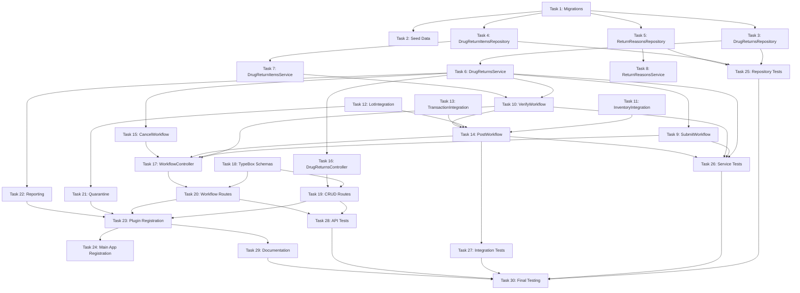

# Tasks Document - Drug Return Backend API

## Overview

This tasks document breaks down the Drug Return Backend API implementation into 30 atomic tasks organized into 5 phases. Each task is designed to be completed independently with clear success criteria and prompts for implementation.

**Total Tasks**: 30
**Estimated Duration**: 4-5 weeks
**Dependencies**: Inventory API (existing), Master Data APIs (existing)

---

## Phase 1: Database Setup & Core Infrastructure (Tasks 1-5)

### Task 1: Create Database Migration Files

- [ ] 1. Create database migration files for Drug Return tables
  - Files:
    - `apps/api/src/database/migrations-inventory/YYYYMMDDHHMMSS_create_drug_returns_tables.ts`
  - Create tables: `drug_returns`, `drug_return_items`, `return_reasons`
  - Add indexes on frequently queried fields (status, department_id, return_date)
  - Add foreign key constraints to drugs, departments, locations
  - Add check constraints (good_quantity + damaged_quantity <= total_quantity)
  - Purpose: Establish database schema for drug returns
  - _Leverage: Existing migration files in migrations-inventory/, BaseRepository UUID handling_
  - _Requirements: Foundation for all requirements_
  - \_Prompt: Implement the task for spec drug-return-backend-api, first run spec-workflow-guide to get the workflow guide then implement the task: Role: Database Engineer specializing in PostgreSQL and schema design | Task: Create comprehensive Knex migration files for drug_returns, drug_return_items, and return_reasons tables in the inventory schema, implementing all fields from design.md with proper indexes, foreign keys, and check constraints | Restrictions: Must use Knex migration format, follow existing migration patterns from migrations-inventory/ folder, use UUID for all ID fields, ensure all foreign keys reference correct tables with ON DELETE/UPDATE rules | \_Leverage: Review existing migrations in apps/api/src/database/migrations-inventory/ for naming and structure patterns, use BaseRepository UUID validation patterns | Success: Migration runs successfully with `pnpm db:migrate`, all tables created with correct columns and data types, indexes created on status/department_id/return_date, foreign keys properly constrained, check constraint validates good+damaged<=total, rollback works correctly | Instructions: After implementation, run spec-status to check progress, edit tasks.md to mark this task as [-] in-progress, then mark as [x] completed after successful implementation and logging with log-implementation tool\_\_

### Task 2: Seed Return Reasons Master Data

- [ ] 2. Create seed data for return_reasons table
  - Files:
    - `apps/api/src/database/seeds/inventory/003_return_reasons.ts`
  - Seed 19 standard return reasons from design.md
  - Categories: CLINICAL (5), OPERATIONAL (8), QUALITY (6)
  - Purpose: Provide master data for return reason selection
  - _Leverage: Existing seed files pattern in seeds/ folder_
  - _Requirements: REQ-6 (List Return Reasons)_
  - _Prompt: Implement the task for spec drug-return-backend-api, first run spec-workflow-guide to get the workflow guide then implement the task: Role: Data Engineer specializing in master data and seeding | Task: Create Knex seed file to populate return_reasons table with 19 standardized return reasons across three categories (CLINICAL: ADR/Treatment change/Contraindication/Allergy/Drug interaction, OPERATIONAL: Excess stock/Patient discharged/Order cancelled/Wrong drug dispensed/Duplicate order/Transfer to another ward/Near expiry/Stock rotation, QUALITY: Expired/Damaged packaging/Contamination/Wrong drug/Quality defect/Recalled by manufacturer) | Restrictions: Must use Knex seed format, follow existing seed patterns, include reason_code, reason_name (TH), reason_category, description fields, set is_active=true for all | \_Leverage: Review existing seed files in apps/api/src/database/seeds/inventory/ for patterns | Success: Seed runs successfully with all 19 reasons inserted, categories correctly assigned, data matches requirements, can be re-run safely (upsert pattern) | Instructions: After implementation, edit tasks.md to mark this task as [-] in-progress, then mark as [x] completed after successful seeding and logging with log-implementation tool_

### Task 3: Create Base Repository for Drug Returns

- [ ] 3. Implement DrugReturnsRepository extending BaseRepository
  - Files:
    - `apps/api/src/layers/inventory/operations/drug-returns/drug-returns.repository.ts`
    - `apps/api/src/layers/inventory/operations/drug-returns/drug-returns.types.ts`
  - Extend BaseRepository with CRUD operations
  - Add custom query methods: `findByDepartment()`, `findByStatus()`, `findWithItems()`
  - Implement UUID validation
  - Purpose: Data access layer for drug returns
  - _Leverage: BaseRepository from shared/repositories/base.repository.ts, existing repository patterns_
  - _Requirements: Foundation for REQ-1, REQ-2_
  - _Prompt: Implement the task for spec drug-return-backend-api, first run spec-workflow-guide to get the workflow guide then implement the task: Role: Backend Developer specializing in repository pattern and Knex ORM | Task: Create DrugReturnsRepository class extending BaseRepository<DrugReturn, CreateDrugReturnDto, UpdateDrugReturnDto> with custom methods findByDepartment(departmentId, query), findByStatus(status, query), and findWithItems(id) that includes joined return items | Restrictions: Must extend BaseRepository, use Knex query builder, implement proper TypeScript types in .types.ts file, follow existing repository patterns, validate all UUIDs | \_Leverage: Study apps/api/src/shared/repositories/base.repository.ts for patterns, review existing inventory repositories for reference, use Knex transaction support | Success: Repository compiles without errors, extends BaseRepository correctly, custom methods return properly typed data, UUID validation works, all queries use parameterized statements to prevent SQL injection | Instructions: After implementation, edit tasks.md to mark this task as [-] in-progress, then mark as [x] completed and log with log-implementation tool including repository methods as artifacts_

### Task 4: Create Base Repository for Drug Return Items

- [ ] 4. Implement DrugReturnItemsRepository extending BaseRepository
  - Files:
    - `apps/api/src/layers/inventory/operations/drug-return-items/drug-return-items.repository.ts`
    - `apps/api/src/layers/inventory/operations/drug-return-items/drug-return-items.types.ts`
  - Extend BaseRepository with CRUD operations
  - Add custom query methods: `findByReturnId()`, `validateLotNumber()`
  - Purpose: Data access layer for return items
  - _Leverage: BaseRepository, DrugReturnsRepository pattern_
  - _Requirements: Foundation for REQ-3, REQ-4_
  - _Prompt: Implement the task for spec drug-return-backend-api, first run spec-workflow-guide to get the workflow guide then implement the task: Role: Backend Developer specializing in ORM and database operations | Task: Create DrugReturnItemsRepository extending BaseRepository with custom methods findByReturnId(returnId) to get all items for a return, and validateLotNumber(drugId, lotNumber) to check if lot exists in drug_lots table | Restrictions: Must follow BaseRepository patterns, implement proper joins for drug and location details, use Knex for queries, validate UUIDs | \_Leverage: Use DrugReturnsRepository as reference, study existing drug_lots table structure | Success: Repository extends BaseRepository correctly, findByReturnId returns items with drug/location details, validateLotNumber accurately checks lot existence, TypeScript types are properly defined | Instructions: After implementation, edit tasks.md to mark as [-], complete and log with artifacts_

### Task 5: Create Repository for Return Reasons

- [ ] 5. Implement ReturnReasonsRepository extending BaseRepository
  - Files:
    - `apps/api/src/layers/inventory/operations/return-reasons/return-reasons.repository.ts`
    - `apps/api/src/layers/inventory/operations/return-reasons/return-reasons.types.ts`
  - Extend BaseRepository for return reasons CRUD
  - Add method: `findByCategory(category)`
  - Purpose: Master data access for return reasons
  - _Leverage: BaseRepository pattern_
  - _Requirements: REQ-6_
  - _Prompt: Implement the task for spec drug-return-backend-api, first run spec-workflow-guide to get the workflow guide then implement the task: Role: Backend Developer | Task: Create ReturnReasonsRepository extending BaseRepository with custom method findByCategory(category) to filter return reasons by CLINICAL/OPERATIONAL/QUALITY category and findActive() to get only active reasons | Restrictions: Must extend BaseRepository, filter on is_active=true by default | \_Leverage: Follow existing repository patterns | Success: Repository provides CRUD operations, category filtering works, returns only active reasons by default | Instructions: Mark task as [-], complete and log with artifacts_

---

## Phase 2: Service Layer & Business Logic (Tasks 6-12)

### Task 6: Create Drug Returns Service (CRUD)

- [ ] 6. Implement DrugReturnsService extending BaseService
  - Files:
    - `apps/api/src/layers/inventory/operations/drug-returns/drug-returns.service.ts`
  - Extend BaseService for CRUD operations
  - Implement validation hooks: `validateCreate`, `beforeCreate`, `afterCreate`
  - Add custom method: `getReturnWithItems(id)`
  - Auto-generate return_number in format RET-{YYYY}-{MM}-{###}
  - Purpose: Business logic layer for drug returns
  - _Leverage: BaseService from shared/services/base.service.ts, DrugReturnsRepository_
  - _Requirements: REQ-1, REQ-2, REQ-3, REQ-4_
  - _Prompt: Implement the task for spec drug-return-backend-api, first run spec-workflow-guide to get the workflow guide then implement the task: Role: Backend Developer specializing in service layer architecture | Task: Create DrugReturnsService extending BaseService implementing validation hooks (validateCreate checks department/reason exist, beforeCreate generates return_number in RET-{YYYY}-{MM}-{###} format and sets status=DRAFT, afterCreate emits WebSocket event), add getReturnWithItems(id) method that returns return with all items and related data | Restrictions: Must extend BaseService, use DrugReturnsRepository, implement all BaseService hooks, validate department_id and return_reason_id exist before create, generate sequential return_number within same year-month | \_Leverage: Study shared/services/base.service.ts for hook patterns, use existing EventService for WebSocket events, check existing inventory services for reference | Success: Service extends BaseService correctly, return_number auto-generated uniquely, validation prevents invalid data, getReturnWithItems returns complete data with items, WebSocket events emitted on create/update | Instructions: Mark task [-], log implementation with service methods as artifacts_

### Task 7: Create Drug Return Items Service

- [ ] 7. Implement DrugReturnItemsService extending BaseService
  - Files:
    - `apps/api/src/layers/inventory/operations/drug-return-items/drug-return-items.service.ts`
  - Extend BaseService for return items CRUD
  - Implement validation: lot number exists, quantities valid
  - Add method: `addItemsToReturn(returnId, items[])`
  - Purpose: Manage return line items
  - _Leverage: BaseService, DrugReturnItemsRepository_
  - _Requirements: REQ-3_
  - _Prompt: Implement the task for spec drug-return-backend-api, first run spec-workflow-guide to get the workflow guide then implement the task: Role: Backend Developer | Task: Create DrugReturnItemsService extending BaseService with validation hooks (validateCreate checks lot_number exists via repository.validateLotNumber(), validates total_quantity > 0), implement addItemsToReturn(returnId, items[]) to batch create items within transaction, ensure good_quantity and damaged_quantity default to 0 | Restrictions: Must validate lot exists before creating item, use Knex transaction for batch operations, prevent negative quantities | \_Leverage: Use DrugReturnItemsRepository, follow BaseService patterns | Success: Service validates lot numbers correctly, addItemsToReturn creates all items atomically, validation prevents invalid data | Instructions: Mark [-], complete and log_

### Task 8: Create Return Reasons Service

- [ ] 8. Implement ReturnReasonsService extending BaseService
  - Files:
    - `apps/api/src/layers/inventory/operations/return-reasons/return-reasons.service.ts`
  - Extend BaseService for return reasons CRUD
  - Add method: `getActiveReasonsByCategory(category?)`
  - Purpose: Master data service for return reasons
  - _Leverage: BaseService, ReturnReasonsRepository_
  - _Requirements: REQ-6_
  - _Prompt: Implement the task for spec drug-return-backend-api, first run spec-workflow-guide to get the workflow guide then implement the task: Role: Backend Developer | Task: Create ReturnReasonsService extending BaseService with method getActiveReasonsByCategory(category?) that returns active return reasons, optionally filtered by category, ordered by reason_name | Restrictions: Must extend BaseService, filter on is_active=true | \_Leverage: Use ReturnReasonsRepository, follow BaseService patterns | Success: Service returns only active reasons, category filtering works, data properly sorted | Instructions: Mark [-], complete and log_

### Task 9: Create Submit Return Workflow Service

- [ ] 9. Implement SubmitReturnWorkflow for DRAFT → SUBMITTED transition
  - Files:
    - `apps/api/src/layers/inventory/operations/drug-return-workflows/submit-return.workflow.ts`
  - Validate current status is DRAFT
  - Validate has at least 1 item
  - Update status to SUBMITTED with timestamp
  - Emit WebSocket event to pharmacy department
  - Purpose: Workflow orchestration for return submission
  - _Leverage: DrugReturnsService, DrugReturnItemsService, EventService_
  - _Requirements: REQ-7_
  - _Prompt: Implement the task for spec drug-return-backend-api, first run spec-workflow-guide to get the workflow guide then implement the task: Role: Backend Developer specializing in workflow orchestration | Task: Create SubmitReturnWorkflow class with async submitReturn(id, submittedBy) method that validates status=DRAFT, checks return has items, updates status to SUBMITTED and records submitted_at timestamp, emits 'drug-return.status.changed' WebSocket event to pharmacy room | Restrictions: Must validate status before transition, throw AppError if invalid status or no items, use Knex transaction for update, emit event only on success | \_Leverage: Use DrugReturnsService.getById() and .update(), DrugReturnItemsService.findByReturnId(), EventService.emit() | Success: Status transition works only from DRAFT, validation prevents submission without items, WebSocket event notifies pharmacy department, transaction ensures atomicity | Instructions: Mark [-], log with workflow logic as artifacts_

### Task 10: Create Verify Return Workflow Service

- [ ] 10. Implement VerifyReturnWorkflow for SUBMITTED → VERIFIED transition
  - Files:
    - `apps/api/src/layers/inventory/operations/drug-return-workflows/verify-return.workflow.ts`
  - Validate current status is SUBMITTED
  - Validate total_quantity = good_quantity + damaged_quantity for all items
  - Update all items with good/damaged quantities
  - Calculate total_amount (good_quantity × unit_cost)
  - Update return status to VERIFIED with verifier info
  - Purpose: Workflow for pharmacist verification and good/damaged separation
  - _Leverage: DrugReturnsService, DrugReturnItemsService, Knex transactions_
  - _Requirements: REQ-8_
  - _Prompt: Implement the task for spec drug-return-backend-api, first run spec-workflow-guide to get the workflow guide then implement the task: Role: Backend Developer with expertise in transaction management | Task: Create VerifyReturnWorkflow with async verifyReturn(id, verifyDto, verifiedBy) that validates status=SUBMITTED, validates for each item that good_quantity + damaged_quantity = total_quantity (throw INVALID_QUANTITY_SEPARATION if not), updates all items, calculates total_amount from good quantities and average cost, updates return status to VERIFIED with verified_by and verified_at, all within Knex transaction | Restrictions: Must use transaction for atomicity, validate quantities before updating, rollback on any validation failure | \_Leverage: Use Knex.transaction(), DrugReturnsService, DrugReturnItemsService, throw AppError for validation errors | Success: Quantities validated correctly, items updated atomically, total_amount calculated accurately, status changes only if all validations pass, transaction rollback on error | Instructions: Mark [-], log with workflow and validation logic as artifacts_

### Task 11: Create Inventory Integration Service

- [ ] 11. Implement InventoryIntegrationService for stock updates
  - Files:
    - `apps/api/src/layers/inventory/operations/integrations/inventory-integration.service.ts`
  - Method: `updateInventoryFromReturn(trx, drugId, locationId, quantity)`
  - Find or create inventory record
  - Increment quantity_on_hand
  - Update last_updated timestamp
  - Purpose: Encapsulate inventory table updates
  - _Leverage: Existing InventoryRepository/Service, Knex transactions_
  - _Requirements: REQ-12_
  - _Prompt: Implement the task for spec drug-return-backend-api, first run spec-workflow-guide to get the workflow guide then implement the task: Role: Integration Engineer specializing in database operations | Task: Create InventoryIntegrationService with methods updateInventoryFromReturn(trx, drugId, locationId, quantity) that finds inventory record by drug_id and location_id or creates if not exists, increments quantity_on_hand by quantity, updates last_updated; and findOrCreateInventory(trx, drugId, locationId) helper method | Restrictions: All methods must accept Knex transaction as first parameter, use upsert pattern for inventory, never commit transaction (caller responsibility) | \_Leverage: Check existing inventory table structure, use Knex upsert capabilities | Success: Inventory quantities update correctly, new records created when needed, methods work within provided transaction, no transaction management inside service | Instructions: Mark [-], log with integration methods as artifacts_

### Task 12: Create Lot Integration Service

- [ ] 12. Implement LotIntegrationService for lot management
  - Files:
    - `apps/api/src/layers/inventory/operations/integrations/lot-integration.service.ts`
  - Method: `findOrCreateLot(trx, dto)` - Find lot by drug/location/lot_number or create
  - Method: `incrementLotQuantity(trx, lotId, quantity)` - Update lot quantity
  - Method: `createQuarantineLot(trx, dto)` - Create inactive lot in QUARANTINE
  - Purpose: Encapsulate drug_lots table operations
  - _Leverage: Existing DrugLotsRepository/Service, Knex transactions_
  - _Requirements: REQ-13, REQ-14_
  - _Prompt: Implement the task for spec drug-return-backend-api, first run spec-workflow-guide to get the workflow guide then implement the task: Role: Integration Engineer | Task: Create LotIntegrationService with methods findOrCreateLot(trx, {drugId, locationId, lotNumber, expiryDate, quantity, unitCost}) that searches for existing lot or creates new one with is_active=true; incrementLotQuantity(trx, lotId, quantity) that increments quantity_available and sets is_active=true; createQuarantineLot(trx, {drugId, lotNumber, expiryDate, quantity, notes}) that creates lot in QUARANTINE location with suffix "-DMG" and is_active=false | Restrictions: Must work within transactions, find QUARANTINE location_id by location_code='QUARANTINE', throw error if not found | \_Leverage: Use existing drug_lots table structure, Locations service to find QUARANTINE | Success: Lots created/updated correctly, quarantine lots properly tagged, methods transactional | Instructions: Mark [-], log with integration methods_

---

## Phase 3: Workflow Completion & Inventory Posting (Tasks 13-18)

### Task 13: Create Transaction Integration Service

- [ ] 13. Implement TransactionIntegrationService for inventory transactions
  - Files:
    - `apps/api/src/layers/inventory/operations/integrations/transaction-integration.service.ts`
  - Method: `createReturnTransaction(trx, dto)` - Create RETURN inventory transaction
  - Method: `createBatchReturnTransactions(trx, transactions[])` - Batch create
  - Purpose: Create audit trail transactions
  - _Leverage: Existing InventoryTransactionsRepository, Knex transactions_
  - _Requirements: REQ-11_
  - _Prompt: Implement the task for spec drug-return-backend-api, first run spec-workflow-guide to get the workflow guide then implement the task: Role: Backend Developer | Task: Create TransactionIntegrationService with createReturnTransaction(trx, {inventoryId, quantity, referenceId, referenceType, notes, createdBy}) that creates inventory_transaction with transaction_type='RETURN', and createBatchReturnTransactions(trx, transactions[]) that batch inserts multiple transactions | Restrictions: Must work within transaction, set transaction_type='RETURN', reference_type='drug_return', include reference_id = return.id | \_Leverage: Use existing inventory_transactions table structure | Success: Transactions created correctly with proper type and references, batch insert works atomically | Instructions: Mark [-], log with methods as artifacts_

### Task 14: Create Post Return Workflow Service

- [ ] 14. Implement PostReturnWorkflow for VERIFIED → POSTED transition
  - Files:
    - `apps/api/src/layers/inventory/operations/drug-return-workflows/post-return.workflow.ts`
  - Validate current status is VERIFIED
  - For each item with good_quantity > 0: update inventory, update/create lot, create transaction
  - For each item with damaged_quantity > 0: create quarantine lot
  - Update return status to POSTED with receiver info
  - Return posting summary
  - Purpose: Complete workflow orchestration for inventory posting
  - _Leverage: InventoryIntegrationService, LotIntegrationService, TransactionIntegrationService, Knex transactions_
  - _Requirements: REQ-9_
  - _Prompt: Implement the task for spec drug-return-backend-api, first run spec-workflow-guide to get the workflow guide then implement the task: Role: Senior Backend Developer specializing in complex workflows and transactions | Task: Create PostReturnWorkflow with async postReturn(id, receivedBy, userId) that validates status=VERIFIED, iterates all items, for good_quantity>0 calls InventoryIntegrationService.updateInventory, LotIntegrationService.findOrCreateLot, TransactionIntegrationService.createReturnTransaction; for damaged_quantity>0 calls LotIntegrationService.createQuarantineLot; updates return status to POSTED with received_by and posted_at; returns summary {itemsRestocked, itemsQuarantined, totalGoodQty, totalDamagedQty, transactionsCreated}; all within single Knex transaction | Restrictions: Must use single transaction for entire operation, rollback on any error, validate QUARANTINE location exists before processing damaged items | \_Leverage: Use all integration services, Knex.transaction(), throw AppError on failures | Success: Complete return posts atomically, inventory updated correctly, lots created/updated, transactions logged, quarantine lots created, status changes only on success, rollback works on error | Instructions: Mark [-], log with complete workflow logic as artifacts_

### Task 15: Create Cancel Return Workflow Service

- [ ] 15. Implement CancelReturnWorkflow for cancellation
  - Files:
    - `apps/api/src/layers/inventory/operations/drug-return-workflows/cancel-return.workflow.ts`
  - Validate current status is not POSTED
  - Update status to CANCELLED with reason and timestamp
  - Emit WebSocket event
  - Purpose: Allow cancellation of returns before posting
  - _Leverage: DrugReturnsService, EventService_
  - _Requirements: REQ-10_
  - _Prompt: Implement the task for spec drug-return-backend-api, first run spec-workflow-guide to get the workflow guide then implement the task: Role: Backend Developer | Task: Create CancelReturnWorkflow with async cancelReturn(id, reason, cancelledBy) that validates status is not POSTED (throw error if POSTED), updates status to CANCELLED with cancellation_reason, cancelled_by, cancelled_at, emits WebSocket event | Restrictions: Must prevent cancellation if already POSTED, require cancellation_reason with minimum 10 characters | \_Leverage: Use DrugReturnsService, EventService, AppError for validation | Success: Cancellation works for DRAFT/SUBMITTED/VERIFIED status, prevents POSTED cancellation, reason recorded, event emitted | Instructions: Mark [-], log with workflow_

### Task 16: Create Controllers for Drug Returns

- [ ] 16. Implement DrugReturnsController with CRUD endpoints
  - Files:
    - `apps/api/src/layers/inventory/operations/drug-returns/drug-returns.controller.ts`
  - Methods: `list()`, `getById()`, `create()`, `update()`, `delete()`
  - Use DrugReturnsService for business logic
  - Return standardized responses with reply helpers
  - Purpose: HTTP request handling for drug returns
  - _Leverage: BaseController pattern, DrugReturnsService, Response helpers_
  - _Requirements: REQ-1, REQ-2, REQ-3, REQ-4, REQ-5_
  - _Prompt: Implement the task for spec drug-return-backend-api, first run spec-workflow-guide to get the workflow guide then implement the task: Role: API Developer specializing in Fastify controllers | Task: Create DrugReturnsController with async methods list(request, reply), getById(request, reply), create(request, reply), update(request, reply), delete(request, reply) that extract parameters from request, call DrugReturnsService methods, return responses using reply.success() or reply.paginated() helpers | Restrictions: Must not contain business logic, only handle request/response, extract and validate parameters, catch errors and return via reply.error() | \_Leverage: Study existing controllers for patterns, use reply helpers from core/response/, call DrugReturnsService | Success: All CRUD operations work via HTTP, proper status codes returned (200, 201, 404, 400), pagination works, errors handled gracefully | Instructions: Mark [-], log with controller methods as artifacts_

### Task 17: Create Controllers for Workflows

- [ ] 17. Implement DrugReturnWorkflowController for workflow endpoints
  - Files:
    - `apps/api/src/layers/inventory/operations/drug-returns/drug-return-workflow.controller.ts`
  - Methods: `submitReturn()`, `verifyReturn()`, `postReturn()`, `cancelReturn()`
  - Use workflow services for orchestration
  - Purpose: HTTP handlers for workflow transitions
  - _Leverage: Workflow services, Response helpers_
  - _Requirements: REQ-7, REQ-8, REQ-9, REQ-10_
  - _Prompt: Implement the task for spec drug-return-backend-api, first run spec-workflow-guide to get the workflow guide then implement the task: Role: API Developer | Task: Create DrugReturnWorkflowController with async methods submitReturn(request, reply) calls SubmitReturnWorkflow, verifyReturn(request, reply) calls VerifyReturnWorkflow, postReturn(request, reply) calls PostReturnWorkflow, cancelReturn(request, reply) calls CancelReturnWorkflow, extract user info from request.user for submittedBy/verifiedBy/receivedBy/cancelledBy | Restrictions: Controllers must not contain business logic, call workflow services only, handle errors properly | \_Leverage: Use workflow services, extract request.user.id for user tracking | Success: Workflow endpoints work correctly, proper HTTP status codes, user tracking works, errors returned as proper responses | Instructions: Mark [-], log with methods_

### Task 18: Create TypeBox Schemas for Validation

- [ ] 18. Implement TypeBox schemas for all endpoints
  - Files:
    - `apps/api/src/layers/inventory/operations/drug-returns/drug-returns.schemas.ts`
  - Create schemas: `CreateDrugReturnSchema`, `UpdateDrugReturnSchema`, `VerifyReturnSchema`, `PostReturnSchema`, `CancelReturnSchema`
  - Add response schemas: `DrugReturnResponseSchema`, `DrugReturnWithItemsSchema`, `PostReturnResultSchema`
  - Purpose: Request/response validation and OpenAPI documentation
  - _Leverage: TypeBox base schemas, existing schema patterns_
  - _Requirements: All endpoints_
  - _Prompt: Implement the task for spec drug-return-backend-api, first run spec-workflow-guide to get the workflow guide then implement the task: Role: TypeScript Developer specializing in schema validation | Task: Create TypeBox schemas for all Drug Return endpoints following design.md data models, include CreateDrugReturnSchema with department_id, return_reason_id, notes, items array; UpdateDrugReturnSchema as partial; VerifyReturnSchema with items[{item_id, good_quantity, damaged_quantity}]; PostReturnSchema with received_by; CancelReturnSchema with cancellation_reason; response schemas DrugReturnResponseSchema, DrugReturnWithItemsSchema (includes nested items/department/reason), PostReturnResultSchema with summary | Restrictions: Must use Type.Object, Type.String with format:'uuid' for IDs, Type.Number with minimum:0 for quantities, validate array minItems:1 for items | \_Leverage: Study TypeBox docs, use base schemas from schemas/base.schemas.ts, reference design.md for field definitions | Success: All schemas compile without errors, validation works correctly, invalid data rejected with clear messages, schemas generate proper OpenAPI docs | Instructions: Mark [-], log with schemas as artifacts_

---

## Phase 4: Routing & Additional Features (Tasks 19-24)

### Task 19: Create Routes for Drug Returns CRUD

- [ ] 19. Implement Fastify routes for Drug Returns CRUD
  - Files:
    - `apps/api/src/layers/inventory/operations/drug-returns/drug-returns.routes.ts`
  - Routes: GET /list, GET /:id, POST /, PUT /:id, DELETE /:id
  - Apply authentication and RBAC hooks
  - Attach TypeBox schemas for validation
  - Purpose: Route registration with middleware
  - _Leverage: Fastify plugin pattern, authentication hooks, TypeBox schemas_
  - _Requirements: REQ-1, REQ-2, REQ-3, REQ-4, REQ-5_
  - _Prompt: Implement the task for spec drug-return-backend-api, first run spec-workflow-guide to get the workflow guide then implement the task: Role: API Developer specializing in Fastify routing | Task: Create drug-returns.routes.ts as async function(fastify, options) that registers routes GET /list with ListQuerySchema, GET /:id with UUIDParamSchema, POST / with CreateDrugReturnSchema, PUT /:id with UpdateDrugReturnSchema, DELETE /:id, all routes use fastify.authenticate hook, POST/PUT/DELETE require verifyPermission(['pharmacist', 'department_staff']), attach schemas for validation and response, call controller methods | Restrictions: Must use Fastify route registration, attach schemas with {schema: {body, response}}, use preValidation hooks for auth/RBAC | \_Leverage: Study existing route files, use authentication hooks from core/auth/, attach TypeBox schemas | Success: All routes registered correctly, authentication works, RBAC enforced, request validation works, OpenAPI docs generated from schemas | Instructions: Mark [-], log with routes as artifacts_

### Task 20: Create Routes for Workflow Endpoints

- [ ] 20. Implement Fastify routes for workflow transitions
  - Files:
    - `apps/api/src/layers/inventory/operations/drug-returns/drug-return-workflow.routes.ts`
  - Routes: POST /:id/submit, POST /:id/verify, POST /:id/post, POST /:id/cancel
  - Apply stricter RBAC (verify/post require 'pharmacist' role)
  - Purpose: Workflow endpoint registration
  - _Leverage: Fastify routing, RBAC hooks, TypeBox schemas_
  - _Requirements: REQ-7, REQ-8, REQ-9, REQ-10_
  - _Prompt: Implement the task for spec drug-return-backend-api, first run spec-workflow-guide to get the workflow guide then implement the task: Role: API Developer | Task: Create drug-return-workflow.routes.ts that registers POST /:id/submit (department_staff allowed), POST /:id/verify with VerifyReturnSchema (pharmacist only), POST /:id/post with PostReturnSchema (pharmacist only), POST /:id/cancel with CancelReturnSchema (department_head or pharmacist), use verifyPermission hook with appropriate roles, attach schemas | Restrictions: Must enforce RBAC correctly, submit allows department_staff, verify/post require pharmacist, cancel requires elevated permission | \_Leverage: Use RBAC hooks, attach TypeBox schemas | Success: Routes work with correct permissions, unauthorized access blocked, schemas validate requests | Instructions: Mark [-], log with routes and RBAC config_

### Task 21: Create Quarantine Management Service & Controller

- [ ] 21. Implement QuarantineService and QuarantineController
  - Files:
    - `apps/api/src/layers/inventory/operations/quarantine-management/quarantine.service.ts`
    - `apps/api/src/layers/inventory/operations/quarantine-management/quarantine.controller.ts`
    - `apps/api/src/layers/inventory/operations/quarantine-management/quarantine.routes.ts`
    - `apps/api/src/layers/inventory/operations/quarantine-management/quarantine.schemas.ts`
  - Service methods: `getQuarantineStock()`, `getQuarantineLotDetails()`, `getQuarantineSummary()`
  - Controller and routes for quarantine endpoints
  - Purpose: View and manage quarantined drugs
  - _Leverage: DrugLotsRepository, LocationsService_
  - _Requirements: REQ-18_
  - _Prompt: Implement the task for spec drug-return-backend-api, first run spec-workflow-guide to get the workflow guide then implement the task: Role: Full-stack Developer | Task: Create QuarantineService with methods getQuarantineStock(query) that finds QUARANTINE location and returns drug_lots where location_id=QUARANTINE.id and is_active=false, getQuarantineLotDetails(lotId), getQuarantineSummary() that counts total items, total quantity, total value; create QuarantineController with corresponding handlers; create routes GET /quarantine, GET /quarantine/:lotId, GET /quarantine/summary; create TypeBox schemas | Restrictions: Must find QUARANTINE location by location_code, filter on is_active=false, include drug details in results | \_Leverage: Use DrugLotsRepository, LocationsService to find QUARANTINE | Success: Quarantine stock retrieved correctly, summary calculations accurate, routes work with auth, schemas validate | Instructions: Mark [-], log with service/controller/routes as artifacts_

### Task 22: Create Return Reporting Endpoints

- [ ] 22. Implement reporting services and endpoints
  - Files:
    - `apps/api/src/layers/inventory/operations/drug-returns/drug-returns-reporting.service.ts`
    - `apps/api/src/layers/inventory/operations/drug-returns/drug-returns-reporting.controller.ts`
    - `apps/api/src/layers/inventory/operations/drug-returns/drug-returns-reporting.routes.ts`
  - Methods: `getDepartmentHistory()`, `getDamagedSummary()`, `getReturnStatistics()`
  - Routes: GET /department/:id/history, GET /damaged-summary, GET /statistics
  - Purpose: Provide reporting and analytics
  - _Leverage: DrugReturnsRepository, complex queries_
  - _Requirements: REQ-16, REQ-17, REQ-19_
  - _Prompt: Implement the task for spec drug-return-backend-api, first run spec-workflow-guide to get the workflow guide then implement the task: Role: Backend Developer specializing in reporting and analytics | Task: Create DrugReturnsReportingService with getDepartmentHistory(departmentId, dateFrom, dateTo) that aggregates returns by department with totals, getDamagedSummary(dateFrom, dateTo) that groups damaged quantities by drug showing total damage and reasons, getReturnStatistics(period) that returns comprehensive stats (total returns by status, total value, good vs damaged ratio, top returned drugs, reason distribution); create controller and routes; create response schemas | Restrictions: Must use efficient queries with aggregations, support date range filtering, return properly structured data for charts/graphs | \_Leverage: Use Knex aggregation functions (sum, count, groupBy), DrugReturnsRepository for base queries | Success: Reports return accurate data, queries perform efficiently, date filtering works, data formatted for frontend consumption | Instructions: Mark [-], log with reporting methods and queries as artifacts_

### Task 23: Create Plugin Registration

- [ ] 23. Implement Fastify plugin to register all Drug Return routes
  - Files:
    - `apps/api/src/layers/inventory/operations/drug-returns/index.ts`
  - Register all route modules as sub-plugins
  - Export plugin for main app registration
  - Purpose: Centralized plugin registration
  - _Leverage: Fastify plugin pattern_
  - _Requirements: All endpoints_
  - _Prompt: Implement the task for spec drug-return-backend-api, first run spec-workflow-guide to get the workflow guide then implement the task: Role: DevOps Engineer specializing in Fastify architecture | Task: Create index.ts that exports default async function(fastify, options) which registers drug-returns.routes, drug-return-workflow.routes, quarantine.routes, drug-returns-reporting.routes as sub-plugins with prefix '/api/inventory/operations/drug-returns', configure plugin metadata {name, version} | Restrictions: Must use fastify.register() for all route modules, use fastify-plugin wrapper if needed, set proper prefix for all routes | \_Leverage: Study existing plugin registration patterns in inventory/operations/ | Success: All routes accessible under correct prefix, plugin loads without errors, routes properly namespaced, OpenAPI docs show all endpoints under correct tag | Instructions: Mark [-], log with plugin structure as artifacts_

### Task 24: Register Plugin in Main Application

- [ ] 24. Register Drug Returns plugin in main server
  - Files:
    - `apps/api/src/bootstrap/plugin.loader.ts` (modify existing)
  - Import and register drug-returns plugin
  - Configure plugin options if needed
  - Purpose: Enable Drug Returns API in main application
  - _Leverage: Existing plugin loader_
  - _Requirements: All endpoints_
  - _Prompt: Implement the task for spec drug-return-backend-api, first run spec-workflow-guide to get the workflow guide then implement the task: Role: DevOps Engineer | Task: Modify apps/api/src/bootstrap/plugin.loader.ts to import drug-returns plugin from layers/inventory/operations/drug-returns/ and register it using await app.register(drugReturnsPlugin, options) in appropriate location (after other inventory plugins) | Restrictions: Must follow existing plugin loading pattern, preserve plugin loading order, don't break existing registrations | \_Leverage: Study existing plugin registrations in plugin.loader.ts | Success: Plugin loads successfully on server start, all routes accessible, no loading errors, OpenAPI docs include Drug Returns endpoints | Instructions: Mark [-], log with registration config_

---

## Phase 5: Testing & Documentation (Tasks 25-30)

### Task 25: Write Unit Tests for Repositories

- [ ] 25. Create unit tests for all repository classes
  - Files:
    - `apps/api/src/layers/inventory/operations/drug-returns/__tests__/drug-returns.repository.spec.ts`
    - `apps/api/src/layers/inventory/operations/drug-return-items/__tests__/drug-return-items.repository.spec.ts`
    - `apps/api/src/layers/inventory/operations/return-reasons/__tests__/return-reasons.repository.spec.ts`
  - Test all custom repository methods
  - Mock Knex queries
  - Purpose: Ensure repository reliability
  - _Leverage: Jest, existing test utilities_
  - _Requirements: All repository methods_
  - _Prompt: Implement the task for spec drug-return-backend-api, first run spec-workflow-guide to get the workflow guide then implement the task: Role: QA Engineer specializing in unit testing | Task: Create Jest unit tests for DrugReturnsRepository testing findByDepartment, findByStatus, findWithItems methods; DrugReturnItemsRepository testing findByReturnId, validateLotNumber; ReturnReasonsRepository testing findByCategory; mock Knex queries using jest.mock, test both success and error scenarios, verify correct SQL generation | Restrictions: Must test in isolation with mocked dependencies, don't hit real database, achieve >80% coverage | \_Leverage: Use Jest, study existing repository tests for patterns | Success: All repository methods tested, queries verified, error handling tested, tests run fast and isolated, >80% coverage | Instructions: Mark [-], log with test files and coverage_

### Task 26: Write Unit Tests for Services and Workflows

- [ ] 26. Create unit tests for service and workflow classes
  - Files:
    - `apps/api/src/layers/inventory/operations/drug-returns/__tests__/drug-returns.service.spec.ts`
    - `apps/api/src/layers/inventory/operations/drug-return-workflows/__tests__/submit-return.workflow.spec.ts`
    - `apps/api/src/layers/inventory/operations/drug-return-workflows/__tests__/verify-return.workflow.spec.ts`
    - `apps/api/src/layers/inventory/operations/drug-return-workflows/__tests__/post-return.workflow.spec.ts`
  - Test business logic and validation
  - Mock repositories and external services
  - Test workflow transitions and error scenarios
  - Purpose: Ensure business logic correctness
  - _Leverage: Jest, mocking frameworks_
  - _Requirements: All service/workflow methods_
  - _Prompt: Implement the task for spec drug-return-backend-api, first run spec-workflow-guide to get the workflow guide then implement the task: Role: QA Engineer | Task: Create Jest unit tests for DrugReturnsService testing CRUD operations and validation hooks (validateCreate, beforeCreate), return_number generation uniqueness, getReturnWithItems data completeness; test all workflow classes testing status transition validation, quantity validation (good+damaged=total), transaction atomicity (mock rollback), error scenarios (invalid status, missing items, quarantine not found); mock all dependencies (repositories, services) | Restrictions: Must mock all external dependencies, test in isolation, verify business logic only, test error paths thoroughly | \_Leverage: Use Jest mocking, test both happy and error paths | Success: All services and workflows tested, validation logic verified, error handling tested, >80% coverage, tests isolated and fast | Instructions: Mark [-], log with test files_

### Task 27: Write Integration Tests for Workflows

- [ ] 27. Create integration tests for complete workflows
  - Files:
    - `apps/api/src/layers/inventory/operations/drug-returns/__tests__/integration/drug-return-workflow.integration.spec.ts`
  - Test complete workflow: Create → Submit → Verify → Post
  - Verify database changes (inventory, lots, transactions)
  - Test rollback scenarios
  - Purpose: Ensure end-to-end workflow correctness
  - _Leverage: Test database, Knex, seed data_
  - _Requirements: Complete workflow (REQ-7, REQ-8, REQ-9)_
  - _Prompt: Implement the task for spec drug-return-backend-api, first run spec-workflow-guide to get the workflow guide then implement the task: Role: QA Engineer specializing in integration testing | Task: Create integration test that runs complete Drug Return workflow against test database: setup test data (drug, department, location, return reason), create return in DRAFT, submit it (verify status=SUBMITTED), verify with good/damaged quantities (verify status=VERIFIED and quantities updated), post to inventory (verify status=POSTED, inventory quantity increased, drug lot created/updated, inventory transaction logged, quarantine lot created if damaged), verify all database changes are correct; test error scenarios (invalid status transition, quantity mismatch, missing quarantine); test transaction rollback on failure | Restrictions: Must use test database, clean up data after each test, verify actual database state, use real Knex transactions | \_Leverage: Setup test database with migrations, use beforeEach/afterEach for cleanup | Success: Complete workflow works end-to-end, all database changes verified, error scenarios handled correctly, rollback works, tests run reliably | Instructions: Mark [-], log with integration tests and scenarios_

### Task 28: Write API Endpoint Tests

- [ ] 28. Create API endpoint tests using Fastify inject
  - Files:
    - `apps/api/src/layers/inventory/operations/drug-returns/__tests__/api/drug-returns-api.spec.ts`
    - `apps/api/src/layers/inventory/operations/drug-returns/__tests__/api/drug-return-workflow-api.spec.ts`
  - Test all HTTP endpoints (CRUD + workflows)
  - Test authentication and authorization
  - Test request validation and error responses
  - Purpose: Ensure API endpoints work correctly
  - _Leverage: Fastify inject, test JWT tokens_
  - _Requirements: All API endpoints_
  - _Prompt: Implement the task for spec drug-return-backend-api, first run spec-workflow-guide to get the workflow guide then implement the task: Role: API Testing Engineer | Task: Create API tests using Fastify inject method to test all Drug Return endpoints GET /list (test pagination, filtering), GET /:id (test 404), POST / (test validation, auth), PUT /:id (test DRAFT only), DELETE /:id, POST /:id/submit, POST /:id/verify (test quantity validation), POST /:id/post (test inventory updates), POST /:id/cancel; test authentication (401 without token), authorization (403 without permission), request validation (400 for invalid data), proper status codes and response formats | Restrictions: Must use Fastify inject for testing, generate JWT tokens for auth tests, verify response structure and status codes, test both success and error cases | \_Leverage: Use Fastify inject, generate test JWT tokens, setup test server instance | Success: All endpoints tested, auth/authz works, validation tested, error responses correct, tests comprehensive | Instructions: Mark [-], log with API test files_

### Task 29: Create API Documentation

- [ ] 29. Generate and verify OpenAPI documentation
  - Files:
    - Verify `http://localhost:{PORT}/documentation` has all Drug Return endpoints
    - Add JSDoc comments to controllers if needed
  - Ensure all endpoints documented with proper descriptions
  - Add example requests/responses
  - Purpose: Provide API documentation for consumers
  - _Leverage: Fastify Swagger plugin, TypeBox schemas_
  - _Requirements: All endpoints_
  - _Prompt: Implement the task for spec drug-return-backend-api, first run spec-workflow-guide to get the workflow guide then implement the task: Role: Technical Writer and API Documentation Specialist | Task: Verify OpenAPI documentation is auto-generated from TypeBox schemas at /documentation endpoint, add JSDoc comments to controller methods with @summary, @description, @tags['Drug Returns'], add example request/response in schemas using examples field, test Swagger UI works and all endpoints are documented with proper descriptions, request/response examples, error codes | Restrictions: Must leverage existing Fastify Swagger setup, don't create separate docs manually, use schema-driven documentation | \_Leverage: TypeBox schemas generate OpenAPI, add JSDoc comments for descriptions | Success: All endpoints visible in Swagger UI, proper descriptions and examples, request/response schemas documented, error codes listed, consumers can understand and test API from docs | Instructions: Mark [-], log with documentation verification_

### Task 30: Final Integration Testing and Cleanup

- [ ] 30. Perform final integration testing and code cleanup
  - Test complete Drug Return feature end-to-end
  - Run all test suites and verify coverage
  - Code review and cleanup (remove console.logs, unused code)
  - Verify error handling throughout
  - Update README if needed
  - Purpose: Ensure feature is production-ready
  - _Leverage: All test suites, linting tools_
  - _Requirements: All requirements_
  - _Prompt: Implement the task for spec drug-return-backend-api, first run spec-workflow-guide to get the workflow guide then implement the task: Role: Senior Developer and QA Lead | Task: Run complete test suite (unit, integration, API tests) and verify >80% coverage, perform manual testing of complete workflow using API client (Postman/Insomnia), test error scenarios (network failures, invalid data, transaction rollbacks), run ESLint and fix any issues, remove console.logs and debug code, verify all error messages are user-friendly and localized, test RBAC permissions thoroughly, verify WebSocket events fire correctly, check database indexes are created, review code for security issues (SQL injection, XSS), update README with API usage examples | Restrictions: Must achieve >80% test coverage, fix all linting errors, verify production readiness, no TODO/FIXME in production code | \_Leverage: Jest coverage reports, ESLint, manual API testing tools | Success: All tests pass, coverage >80%, no linting errors, feature works end-to-end, error handling robust, code clean and documented, production-ready | Instructions: Mark [-], log final implementation summary with complete artifact list and statistics_

---

## Task Dependencies

---

## Implementation Notes

### Critical Success Factors

1. **Transaction Management**: All workflow operations MUST use Knex transactions
2. **Validation**: Validate status transitions before executing workflows
3. **Quantity Validation**: Ensure good_quantity + damaged_quantity = total_quantity
4. **Quarantine Location**: Verify QUARANTINE location exists before posting
5. **Error Handling**: Use AppError with proper error codes
6. **WebSocket Events**: Emit events on all status changes
7. **RBAC**: Enforce role-based permissions correctly
8. **UUID Validation**: Use BaseRepository UUID validation
9. **Test Coverage**: Maintain >80% coverage throughout
10. **Documentation**: Keep OpenAPI docs synchronized with schemas

### Common Pitfalls to Avoid

- ❌ Don't commit transactions inside integration services (caller's responsibility)
- ❌ Don't allow status transitions without validation
- ❌ Don't update inventory without creating transaction records
- ❌ Don't forget to emit WebSocket events
- ❌ Don't hardcode user IDs (use request.user)
- ❌ Don't skip RBAC validation
- ❌ Don't allow decimal precision issues (use proper decimal types)
- ❌ Don't forget to test rollback scenarios
- ❌ Don't expose internal errors to users (use AppError)
- ❌ Don't skip TypeBox schema validation

### Testing Checklist

Before marking spec as complete, verify:

- All 30 tasks completed and tested
- Test coverage >80%
- All API endpoints tested via Fastify inject
- Complete workflow tested end-to-end
- Error scenarios tested (invalid status, quantity mismatch, etc.)
- Transaction rollback tested
- RBAC permissions verified
- WebSocket events verified
- OpenAPI documentation complete
- No linting errors
- Code reviewed and cleaned up
- README updated with usage examples

---

**Spec Status**: Ready for Implementation
**Next Step**: Begin with Task 1 (Create Database Migration Files)
