# Design Document - Drug Return Frontend UI

## Architecture Overview

The Drug Return Frontend UI follows Angular 18+ standalone component architecture with Signals-based reactive state management. The design implements a feature module with lazy loading, smart/dumb component pattern, comprehensive workflow dialogs for the 4-stage return process (Create → Verify → Post → Dispose), and real-time updates via WebSocket.

### High-Level Architecture

```mermaid
graph TB
    subgraph "Drug Return Feature Module"
        Router[Drug Return Router]

        subgraph "Container Components (Smart)"
            ReturnDashboard[ReturnDashboardPage]
            ReturnDetail[ReturnDetailPage]
            CreateReturn[CreateReturnPage]
            VerifyReturn[VerifyReturnPage]
            QuarantineManagement[QuarantineManagementPage]
            ReturnAnalytics[ReturnAnalyticsPage]
        end

        subgraph "Presentation Components (Dumb)"
            ReturnTable[ReturnTableComponent]
            QuickStats[QuickStatsComponent]
            StatusBadge[StatusBadgeComponent]
            ReturnItemsTable[ReturnItemsTableComponent]
            TimelineComponent[AuditTimelineComponent]
            QuarantineLotsTable[QuarantineLotsTableComponent]
            AnalyticsCharts[AnalyticsChartsComponent]
        end

        subgraph "Dialogs (Smart)"
            PostConfirmDialog[PostReturnConfirmationDialog]
            ScheduleDisposalDialog[ScheduleDisposalDialog]
            CompleteDisposalDialog[CompleteDisposalDialog]
            LotPreviewDialog[LotPreviewDialog]
            ReasonManagementDialog[ReasonManagementDialog]
        end

        subgraph "Services"
            DrugReturnApi[DrugReturnApiService]
            DrugReturnState[DrugReturnStateService]
            DrugReturnWS[DrugReturnWebSocketService]
            DisposalApi[DisposalApiService]
        end

        subgraph "Models"
            Interfaces[TypeScript Interfaces]
            Enums[Enums & Constants]
            Validators[Custom Validators]
        end
    end

    Router --> ReturnDashboard
    Router --> ReturnDetail
    Router --> CreateReturn
    Router --> VerifyReturn
    Router --> QuarantineManagement
    Router --> ReturnAnalytics

    ReturnDashboard --> ReturnTable
    ReturnDashboard --> QuickStats

    ReturnDetail --> ReturnItemsTable
    ReturnDetail --> StatusBadge
    ReturnDetail --> TimelineComponent
    ReturnDetail --> PostConfirmDialog

    CreateReturn --> ReturnItemsTable
    VerifyReturn --> ReturnItemsTable

    QuarantineManagement --> QuarantineLotsTable
    QuarantineManagement --> ScheduleDisposalDialog
    QuarantineManagement --> CompleteDisposalDialog

    ReturnAnalytics --> AnalyticsCharts

    ReturnDashboard --> DrugReturnState
    ReturnDetail --> DrugReturnState
    CreateReturn --> DrugReturnState
    VerifyReturn --> DrugReturnState
    QuarantineManagement --> DrugReturnState
    DrugReturnState --> DrugReturnApi
    DrugReturnState --> DisposalApi
    DrugReturnState --> DrugReturnWS

    DrugReturnApi --> Backend[Backend API - 15 Endpoints]
    DisposalApi --> Backend
    DrugReturnWS --> WSServer[WebSocket Server]
```



### Technology Stack

- **Framework**: Angular 18+ (standalone components)
- **State Management**: Angular Signals + RxJS (for async operations)
- **UI Library**: AegisX UI + Angular Material
- **Styling**: TailwindCSS with custom design tokens
- **Forms**: Angular Reactive Forms with custom validators
- **HTTP**: HttpClient with interceptors (auth, error handling)
- **WebSocket**: Custom service with auto-reconnect and heartbeat
- **Routing**: Feature-based lazy loading with route guards
- **Date**: date-fns for formatting and calculations
- **File Upload**: Custom upload service with progress tracking
- **Export**: xlsx library for Excel export, jsPDF for PDF generation
- **Validation**: Real-time quantity validation (total = good + damaged)

---

## Steering Document Alignment

### Technical Standards (tech.md)

This design follows AegisX technical standards:

- **Component Architecture**: Standalone components with dependency injection
- **State Management**: Signals for reactive state, RxJS for async flows
- **API Integration**: TypeBox-validated backend contracts
- **WebSocket Pattern**: Real-time updates with auto-reconnect
- **Error Handling**: Centralized error interceptor + user-friendly messages
- **Form Validation**: Reactive forms with custom validators
- **Styling**: TailwindCSS utility-first approach

### Project Structure (structure.md)

Files will follow project organization:

```
apps/admin/src/app/
├── features/
│   └── drug-returns/
│       ├── pages/
│       │   ├── return-dashboard/
│       │   ├── return-detail/
│       │   ├── create-return/
│       │   ├── verify-return/
│       │   ├── quarantine-management/
│       │   └── return-analytics/
│       ├── components/
│       │   ├── return-table/
│       │   ├── return-items-table/
│       │   ├── quick-stats/
│       │   ├── status-badge/
│       │   ├── audit-timeline/
│       │   ├── quarantine-lots-table/
│       │   └── analytics-charts/
│       ├── dialogs/
│       │   ├── post-confirmation/
│       │   ├── schedule-disposal/
│       │   ├── complete-disposal/
│       │   ├── lot-preview/
│       │   └── reason-management/
│       ├── services/
│       │   ├── drug-return-api.service.ts
│       │   ├── drug-return-state.service.ts
│       │   ├── drug-return-websocket.service.ts
│       │   └── disposal-api.service.ts
│       ├── models/
│       │   ├── drug-return.interface.ts
│       │   ├── drug-return-item.interface.ts
│       │   ├── disposal.interface.ts
│       │   └── enums.ts
│       ├── validators/
│       │   └── quantity-validators.ts
│       └── drug-returns.routes.ts
```

---

## Code Reuse Analysis

### Existing Components to Leverage

- **AegisX UI Components**:
  - `ax-table` - Data tables with sorting, filtering, pagination
  - `ax-button` - Consistent button styling
  - `ax-badge` - Status badges with color variants
  - `ax-dialog` - Modal dialogs
  - `ax-form` - Form layouts
  - `ax-input` - Text inputs with validation
  - `ax-select` - Dropdowns with search
  - `ax-datepicker` - Date selection
  - `ax-kpi-card` - Statistics cards
  - `ax-skeleton` - Loading placeholders
  - `ax-drawer` - Side panels

- **Angular Material Components**:
  - `mat-icon` - Icons
  - `mat-tooltip` - Tooltips
  - `mat-checkbox` - Checkboxes
  - `mat-radio-group` - Radio buttons
  - `mat-slide-toggle` - Toggle switches
  - `MatDialog` - Dialog service

- **Shared Services**:
  - `AuthService` - User authentication and roles
  - `NotificationService` - Toast notifications
  - `ExportService` - Excel/PDF export
  - `AttachmentService` - File upload/download
  - `ErrorHandlerService` - Centralized error handling

### Integration Points

- **Backend API**: All API calls via `drug-return-backend-api` endpoints
- **Inventory Module**: View inventory levels when creating returns
- **Distribution Module**: View distribution history to verify return lots
- **Master Data**: Departments, locations, return reasons
- **Attachment System**: Upload disposal photos
- **WebSocket**: Real-time status updates across all users
- **Notification System**: Email/SMS notifications for workflow events

---

## Component Specifications

### 1. ReturnDashboardPage (Container Component)

**Path**: `apps/admin/src/app/features/drug-returns/pages/return-dashboard/return-dashboard.page.ts`

**Responsibility**: Main dashboard for viewing all returns with filtering, search, and quick stats.

**TypeScript Interface**:

```typescript
@Component({
  selector: 'dr-return-dashboard-page',
  standalone: true,
  imports: [CommonModule, RouterModule, ReturnTableComponent, QuickStatsComponent, AxSelect, AxInput, AxButton, AxDateRangePicker, AxSkeleton],
  templateUrl: './return-dashboard.page.html',
})
export class ReturnDashboardPage implements OnInit, OnDestroy {
  // Signals
  returns = signal<DrugReturn[]>([]);
  quickStats = computed(() => this.calculateStats(this.returns()));

  // Filters
  statusFilter = signal<ReturnStatus | 'ALL'>('ALL');
  departmentFilter = signal<string | null>(null);
  dateRange = signal<{ from: Date | null; to: Date | null }>({ from: null, to: null });
  searchTerm = signal<string>('');
  isLoading = signal<boolean>(false);

  // Filtered returns
  filteredReturns = computed(() => {
    let items = this.returns();
    const status = this.statusFilter();
    const dept = this.departmentFilter();
    const search = this.searchTerm().toLowerCase();
    const dateRange = this.dateRange();

    if (status !== 'ALL') {
      items = items.filter((r) => r.status === status);
    }

    if (dept) {
      items = items.filter((r) => r.departmentId === dept);
    }

    if (search) {
      items = items.filter((r) => r.returnNumber.toLowerCase().includes(search) || r.department?.name.toLowerCase().includes(search));
    }

    if (dateRange.from && dateRange.to) {
      items = items.filter((r) => {
        const returnDate = new Date(r.returnDate);
        return returnDate >= dateRange.from! && returnDate <= dateRange.to!;
      });
    }

    return items;
  });

  // Master data
  departments = signal<Department[]>([]);
  currentUser = signal<User | null>(null);

  constructor(
    private drugReturnState: DrugReturnStateService,
    private router: Router,
    private authService: AuthService,
  ) {}

  ngOnInit(): void {
    this.loadCurrentUser();
    this.loadReturns();
    this.loadMasterData();
    this.subscribeToRealtimeUpdates();
  }

  loadCurrentUser(): void {
    this.currentUser.set(this.authService.currentUser());
  }

  loadReturns(): void {
    this.isLoading.set(true);
    this.drugReturnState.fetchDrugReturns().subscribe({
      next: (data) => {
        this.returns.set(data);
        this.isLoading.set(false);
      },
      error: (err) => {
        this.isLoading.set(false);
        this.handleError(err);
      },
    });
  }

  loadMasterData(): void {
    // Load departments for filter
    this.drugReturnState.fetchDepartments().subscribe({
      next: (data) => this.departments.set(data),
      error: (err) => this.handleError(err),
    });
  }

  subscribeToRealtimeUpdates(): void {
    this.drugReturnState.returnUpdates$.pipe(takeUntilDestroyed(this.destroyRef)).subscribe((update) => {
      this.handleReturnUpdate(update);
    });
  }

  onStatusFilterChange(status: ReturnStatus | 'ALL'): void {
    this.statusFilter.set(status);
  }

  onDepartmentFilterChange(deptId: string | null): void {
    this.departmentFilter.set(deptId);
  }

  onDateRangeChange(range: { from: Date | null; to: Date | null }): void {
    this.dateRange.set(range);
  }

  onSearchChange(term: string): void {
    this.searchTerm.set(term);
  }

  onCreateReturn(): void {
    this.router.navigate(['/drug-returns/create']);
  }

  onViewReturn(drugReturn: DrugReturn): void {
    this.router.navigate(['/drug-returns', drugReturn.id]);
  }

  onExportReport(): void {
    this.drugReturnState.exportReturns(this.filteredReturns());
  }

  private calculateStats(items: DrugReturn[]): QuickStats {
    return {
      total: items.length,
      pendingVerification: items.filter((r) => r.status === 'SUBMITTED').length,
      verifiedToday: items.filter((r) => {
        if (r.status === 'VERIFIED' || r.status === 'POSTED') {
          const verifiedDate = r.verifiedAt ? new Date(r.verifiedAt) : null;
          const today = new Date();
          return verifiedDate && verifiedDate.getDate() === today.getDate() && verifiedDate.getMonth() === today.getMonth() && verifiedDate.getFullYear() === today.getFullYear();
        }
        return false;
      }).length,
      quarantineItems: 0, // Will be fetched separately
    };
  }

  private handleReturnUpdate(update: ReturnUpdateEvent): void {
    if (update.type === 'created') {
      this.returns.update((items) => [update.return, ...items]);
    } else if (update.type === 'updated') {
      this.returns.update((items) => items.map((item) => (item.id === update.return.id ? update.return : item)));
    }
  }

  private handleError(error: any): void {
    // Error handling delegated to ErrorHandlerService
    console.error('Error in ReturnDashboardPage:', error);
  }

  ngOnDestroy(): void {
    // Cleanup handled by takeUntilDestroyed
  }
}
```

**Template Structure**:

```html
<div class="return-dashboard-container p-6">
  <!-- Header -->
  <div class="header-section mb-6 flex items-center justify-between">
    <h1 class="text-2xl font-bold text-gray-900">Drug Returns</h1>
    @if (currentUser()?.hasPermission('drug_return.create')) {
    <ax-button color="primary" (click)="onCreateReturn()">
      <mat-icon>add</mat-icon>
      Create Return
    </ax-button>
    }
  </div>

  <!-- Quick Stats -->
  <dr-quick-stats [stats]="quickStats()" (statClick)="onStatusFilterChange($event)" class="mb-6"></dr-quick-stats>

  <!-- Filters -->
  <div class="filter-section mb-6 grid grid-cols-1 md:grid-cols-4 gap-4">
    <ax-input [(ngModel)]="searchTerm" (ngModelChange)="onSearchChange($event)" placeholder="Search by return number or department..." prefixIcon="search"></ax-input>

    <ax-select [(ngModel)]="statusFilter" (ngModelChange)="onStatusFilterChange($event)" placeholder="All Status">
      <ax-option value="ALL">All Status</ax-option>
      <ax-option value="DRAFT">Draft</ax-option>
      <ax-option value="SUBMITTED">Submitted</ax-option>
      <ax-option value="VERIFIED">Verified</ax-option>
      <ax-option value="POSTED">Posted</ax-option>
      <ax-option value="CANCELLED">Cancelled</ax-option>
    </ax-select>

    <ax-select [(ngModel)]="departmentFilter" (ngModelChange)="onDepartmentFilterChange($event)" placeholder="All Departments">
      <ax-option [value]="null">All Departments</ax-option>
      @for (dept of departments(); track dept.id) {
      <ax-option [value]="dept.id">{{ dept.name }}</ax-option>
      }
    </ax-select>

    <ax-date-range-picker [(ngModel)]="dateRange" (ngModelChange)="onDateRangeChange($event)" placeholder="Select date range"></ax-date-range-picker>
  </div>

  <!-- Return Table -->
  @if (isLoading()) {
  <ax-skeleton rows="10"></ax-skeleton>
  } @else {
  <dr-return-table [returns]="filteredReturns()" [currentUser]="currentUser()" (viewReturn)="onViewReturn($event)"></dr-return-table>
  }

  <!-- Actions -->
  <div class="actions-section mt-6">
    <ax-button variant="outline" (click)="onExportReport()">
      <mat-icon>download</mat-icon>
      Export to Excel
    </ax-button>
  </div>
</div>
```

---

### 2. CreateReturnPage (Container Component)

**Path**: `apps/admin/src/app/features/drug-returns/pages/create-return/create-return.page.ts`

**Responsibility**: Form for creating new drug return request with multiple items.

**TypeScript Interface**:

```typescript
@Component({
  selector: 'dr-create-return-page',
  standalone: true,
  imports: [CommonModule, ReactiveFormsModule, ReturnItemsTableComponent, AxForm, AxInput, AxSelect, AxTextarea, AxDatepicker, AxButton, AxRadioGroup],
  templateUrl: './create-return.page.html',
})
export class CreateReturnPage implements OnInit {
  returnForm: FormGroup;
  itemsFormArray: FormArray;

  // Master data
  departments = signal<Department[]>([]);
  locations = signal<Location[]>([]);
  returnReasons = signal<ReturnReason[]>([]);
  users = signal<User[]>([]);

  // Item selection
  availableDrugs = signal<Drug[]>([]);
  availableLotsForDrug = signal<DrugLot[]>([]);

  isLoading = signal<boolean>(false);
  isSaving = signal<boolean>(false);

  constructor(
    private fb: FormBuilder,
    private drugReturnState: DrugReturnStateService,
    private router: Router,
    private authService: AuthService,
    private notificationService: NotificationService,
  ) {
    this.returnForm = this.createReturnForm();
    this.itemsFormArray = this.returnForm.get('items') as FormArray;
  }

  ngOnInit(): void {
    this.loadMasterData();
    this.prefillDefaults();
  }

  createReturnForm(): FormGroup {
    return this.fb.group({
      departmentId: [null, Validators.required],
      toLocationId: [null, Validators.required],
      returnDate: [new Date(), Validators.required],
      returnBy: [null, Validators.required],
      returnReason: ['', Validators.required],
      notes: [''],
      items: this.fb.array([], Validators.minLength(1)),
    });
  }

  createItemFormGroup(): FormGroup {
    return this.fb.group({
      drugId: [null, Validators.required],
      lotNumber: ['', Validators.required],
      expiryDate: [{ value: null, disabled: true }],
      totalQuantity: [null, [Validators.required, Validators.min(0.01)]],
      unit: [{ value: '', disabled: true }],
      condition: ['GOOD'], // Informational only
      availableQuantity: [{ value: null, disabled: true }],
    });
  }

  loadMasterData(): void {
    this.isLoading.set(true);

    forkJoin({
      departments: this.drugReturnState.fetchDepartments(),
      locations: this.drugReturnState.fetchLocations(),
      returnReasons: this.drugReturnState.fetchReturnReasons(),
      users: this.drugReturnState.fetchUsers(),
    }).subscribe({
      next: (data) => {
        this.departments.set(data.departments);
        this.locations.set(data.locations);
        this.returnReasons.set(data.returnReasons.filter((r) => r.isActive));
        this.users.set(data.users);
        this.isLoading.set(false);
      },
      error: (err) => {
        this.isLoading.set(false);
        this.handleError(err);
      },
    });
  }

  prefillDefaults(): void {
    const currentUser = this.authService.currentUser();
    if (currentUser) {
      this.returnForm.patchValue({
        departmentId: currentUser.departmentId,
        returnBy: currentUser.id,
        returnDate: new Date(),
      });
    }

    // Default to Central Pharmacy
    const centralPharmacy = this.locations().find((l) => l.code === 'CENTRAL_PHARMACY');
    if (centralPharmacy) {
      this.returnForm.patchValue({ toLocationId: centralPharmacy.id });
    }
  }

  onAddItem(): void {
    const itemGroup = this.createItemFormGroup();

    // Watch for drug selection to load lots
    itemGroup.get('drugId')?.valueChanges.subscribe((drugId) => {
      if (drugId) {
        this.loadLotsForDrug(drugId, itemGroup);
      }
    });

    // Watch for lot selection to auto-fill expiry and unit
    itemGroup.get('lotNumber')?.valueChanges.subscribe((lotNumber) => {
      if (lotNumber) {
        this.onLotSelected(lotNumber, itemGroup);
      }
    });

    this.itemsFormArray.push(itemGroup);
  }

  onRemoveItem(index: number): void {
    this.itemsFormArray.removeAt(index);
  }

  loadLotsForDrug(drugId: string, itemGroup: FormGroup): void {
    const departmentId = this.returnForm.get('departmentId')?.value;
    if (!departmentId) {
      this.notificationService.showError('Please select department first');
      return;
    }

    this.drugReturnState.fetchLotsForDrug(drugId, departmentId).subscribe({
      next: (lots) => {
        this.availableLotsForDrug.set(lots);
      },
      error: (err) => this.handleError(err),
    });
  }

  onLotSelected(lotNumber: string, itemGroup: FormGroup): void {
    const lot = this.availableLotsForDrug().find((l) => l.lotNumber === lotNumber);
    if (lot) {
      itemGroup.patchValue({
        expiryDate: lot.expiryDate,
        unit: lot.drug.unit,
        availableQuantity: lot.quantityAvailable,
      });

      // Add validator to ensure return quantity doesn't exceed available
      const qtyControl = itemGroup.get('totalQuantity');
      qtyControl?.setValidators([Validators.required, Validators.min(0.01), Validators.max(lot.quantityAvailable)]);
      qtyControl?.updateValueAndValidity();
    }
  }

  onSaveDraft(): void {
    if (!this.validateForm()) {
      return;
    }

    this.isSaving.set(true);
    const formData = this.returnForm.getRawValue();
    formData.status = 'DRAFT';

    this.drugReturnState.createDrugReturn(formData).subscribe({
      next: (result) => {
        this.isSaving.set(false);
        this.notificationService.showSuccess(`Return draft saved: ${result.returnNumber}`);
        this.router.navigate(['/drug-returns', result.id]);
      },
      error: (err) => {
        this.isSaving.set(false);
        this.handleError(err);
      },
    });
  }

  onSubmitReturn(): void {
    if (!this.validateForm()) {
      return;
    }

    this.isSaving.set(true);
    const formData = this.returnForm.getRawValue();
    formData.status = 'SUBMITTED';

    this.drugReturnState.createDrugReturn(formData).subscribe({
      next: (result) => {
        this.isSaving.set(false);
        this.notificationService.showSuccess(`Return submitted for verification: ${result.returnNumber}`);
        this.router.navigate(['/drug-returns', result.id]);
      },
      error: (err) => {
        this.isSaving.set(false);
        this.handleError(err);
      },
    });
  }

  validateForm(): boolean {
    if (this.returnForm.invalid) {
      this.returnForm.markAllAsTouched();
      this.notificationService.showError('Please fill all required fields');
      return false;
    }

    if (this.itemsFormArray.length === 0) {
      this.notificationService.showError('Please add at least one item');
      return false;
    }

    return true;
  }

  onCancel(): void {
    if (confirm('Discard changes and return to dashboard?')) {
      this.router.navigate(['/drug-returns']);
    }
  }

  private handleError(error: any): void {
    console.error('Error in CreateReturnPage:', error);
  }
}
```

---

### 3. VerifyReturnPage (Container Component)

**Path**: `apps/admin/src/app/features/drug-returns/pages/verify-return/verify-return.page.ts`

**Responsibility**: Pharmacist verification form with good/damaged separation.

**TypeScript Interface**:

```typescript
@Component({
  selector: 'dr-verify-return-page',
  standalone: true,
  imports: [CommonModule, ReactiveFormsModule, ReturnItemsTableComponent, AxForm, AxInput, AxSelect, AxTextarea, AxDatepicker, AxButton],
  templateUrl: './verify-return.page.html',
})
export class VerifyReturnPage implements OnInit {
  returnId = signal<string>('');
  drugReturn = signal<DrugReturn | null>(null);
  verificationForm: FormGroup;
  itemsFormArray: FormArray;

  isLoading = signal<boolean>(false);
  isSaving = signal<boolean>(false);

  // Validation
  totalGoodQuantity = computed(() => {
    return this.itemsFormArray.controls.reduce((sum, control) => {
      return sum + (control.get('goodQuantity')?.value || 0);
    }, 0);
  });

  totalDamagedQuantity = computed(() => {
    return this.itemsFormArray.controls.reduce((sum, control) => {
      return sum + (control.get('damagedQuantity')?.value || 0);
    }, 0);
  });

  constructor(
    private fb: FormBuilder,
    private route: ActivatedRoute,
    private router: Router,
    private drugReturnState: DrugReturnStateService,
    private authService: AuthService,
    private notificationService: NotificationService,
  ) {
    this.verificationForm = this.createVerificationForm();
    this.itemsFormArray = this.verificationForm.get('items') as FormArray;
  }

  ngOnInit(): void {
    this.route.params.subscribe((params) => {
      this.returnId.set(params['id']);
      this.loadReturn();
    });
  }

  createVerificationForm(): FormGroup {
    return this.fb.group({
      verifiedBy: [null, Validators.required],
      verifiedDate: [new Date(), Validators.required],
      verificationNotes: [''],
      items: this.fb.array([]),
    });
  }

  createItemVerificationFormGroup(item: DrugReturnItem): FormGroup {
    const group = this.fb.group({
      itemId: [item.id],
      drugName: [{ value: item.drug.name, disabled: true }],
      lotNumber: [{ value: item.lotNumber, disabled: true }],
      expiryDate: [{ value: item.expiryDate, disabled: true }],
      claimedQuantity: [{ value: item.totalQuantity, disabled: true }],
      actualQuantity: [item.totalQuantity, [Validators.required, Validators.min(0)]],
      goodQuantity: [0, [Validators.required, Validators.min(0)]],
      damagedQuantity: [0, [Validators.required, Validators.min(0)]],
      itemNotes: [''],
    });

    // Real-time validation: good + damaged = actual
    group.get('actualQuantity')?.valueChanges.subscribe((actual) => {
      this.validateQuantities(group);
    });

    group.get('goodQuantity')?.valueChanges.subscribe(() => {
      this.validateQuantities(group);
    });

    group.get('damagedQuantity')?.valueChanges.subscribe(() => {
      this.validateQuantities(group);
    });

    return group;
  }

  validateQuantities(itemGroup: FormGroup): void {
    const actual = itemGroup.get('actualQuantity')?.value || 0;
    const good = itemGroup.get('goodQuantity')?.value || 0;
    const damaged = itemGroup.get('damagedQuantity')?.value || 0;
    const sum = good + damaged;

    const goodControl = itemGroup.get('goodQuantity');
    const damagedControl = itemGroup.get('damagedQuantity');

    if (Math.abs(sum - actual) > 0.001) {
      goodControl?.setErrors({ quantityMismatch: true });
      damagedControl?.setErrors({ quantityMismatch: true });
    } else {
      // Clear quantity mismatch error, but preserve other errors
      const goodErrors = { ...goodControl?.errors };
      const damagedErrors = { ...damagedControl?.errors };
      delete goodErrors?.['quantityMismatch'];
      delete damagedErrors?.['quantityMismatch'];

      goodControl?.setErrors(Object.keys(goodErrors).length > 0 ? goodErrors : null);
      damagedControl?.setErrors(Object.keys(damagedErrors).length > 0 ? damagedErrors : null);
    }
  }

  loadReturn(): void {
    this.isLoading.set(true);
    this.drugReturnState.fetchDrugReturnById(this.returnId()).subscribe({
      next: (data) => {
        this.drugReturn.set(data);

        if (data.status !== 'SUBMITTED') {
          this.notificationService.showError('Only SUBMITTED returns can be verified');
          this.router.navigate(['/drug-returns', data.id]);
          return;
        }

        this.populateForm(data);
        this.isLoading.set(false);
      },
      error: (err) => {
        this.isLoading.set(false);
        this.handleError(err);
      },
    });
  }

  populateForm(drugReturn: DrugReturn): void {
    const currentUser = this.authService.currentUser();
    this.verificationForm.patchValue({
      verifiedBy: currentUser?.id,
      verifiedDate: new Date(),
    });

    // Populate items
    drugReturn.items.forEach((item) => {
      this.itemsFormArray.push(this.createItemVerificationFormGroup(item));
    });
  }

  onRejectReturn(): void {
    const reason = prompt('Enter reason for rejection:');
    if (!reason) {
      return;
    }

    if (confirm('Reject this return and send back to department?')) {
      this.drugReturnState.rejectDrugReturn(this.returnId(), reason).subscribe({
        next: () => {
          this.notificationService.showSuccess('Return rejected');
          this.router.navigate(['/drug-returns']);
        },
        error: (err) => this.handleError(err),
      });
    }
  }

  onSaveProgress(): void {
    if (this.verificationForm.invalid) {
      this.verificationForm.markAllAsTouched();
      this.notificationService.showError('Please fill all required fields');
      return;
    }

    this.isSaving.set(true);
    const formData = this.verificationForm.getRawValue();

    this.drugReturnState.saveVerificationProgress(this.returnId(), formData).subscribe({
      next: () => {
        this.isSaving.set(false);
        this.notificationService.showSuccess('Progress saved');
      },
      error: (err) => {
        this.isSaving.set(false);
        this.handleError(err);
      },
    });
  }

  onCompleteVerification(): void {
    if (!this.validateVerificationForm()) {
      return;
    }

    this.isSaving.set(true);
    const formData = this.verificationForm.getRawValue();

    this.drugReturnState.verifyDrugReturn(this.returnId(), formData).subscribe({
      next: () => {
        this.isSaving.set(false);
        this.notificationService.showSuccess('Verification complete. Return ready to post.');
        this.router.navigate(['/drug-returns', this.returnId()]);
      },
      error: (err) => {
        this.isSaving.set(false);
        this.handleError(err);
      },
    });
  }

  validateVerificationForm(): boolean {
    if (this.verificationForm.invalid) {
      this.verificationForm.markAllAsTouched();
      this.notificationService.showError('Please correct all validation errors');
      return false;
    }

    // Check all items have valid quantities
    for (const control of this.itemsFormArray.controls) {
      const actual = control.get('actualQuantity')?.value || 0;
      const good = control.get('goodQuantity')?.value || 0;
      const damaged = control.get('damagedQuantity')?.value || 0;

      if (Math.abs(good + damaged - actual) > 0.001) {
        this.notificationService.showError('Good + Damaged must equal Actual quantity for all items');
        return false;
      }
    }

    return true;
  }

  private handleError(error: any): void {
    console.error('Error in VerifyReturnPage:', error);
  }
}
```

---

### 4. QuarantineManagementPage (Container Component)

**Path**: `apps/admin/src/app/features/drug-returns/pages/quarantine-management/quarantine-management.page.ts`

**Responsibility**: View and manage quarantine lots, schedule disposals.

**TypeScript Interface**:

```typescript
@Component({
  selector: 'dr-quarantine-management-page',
  standalone: true,
  imports: [CommonModule, QuarantineLotsTableComponent, QuickStatsComponent, ScheduleDisposalDialog, CompleteDisposalDialog, AxSelect, AxButton, AxDateRangePicker, AxCheckbox],
  templateUrl: './quarantine-management.page.html',
})
export class QuarantineManagementPage implements OnInit {
  quarantineLots = signal<QuarantineLot[]>([]);
  selectedLots = signal<Set<string>>(new Set());

  quickStats = computed(() => this.calculateStats(this.quarantineLots()));

  // Filters
  disposalStatusFilter = signal<DisposalStatus | 'ALL'>('ALL');
  dateRange = signal<{ from: Date | null; to: Date | null }>({
    from: null,
    to: null,
  });

  filteredLots = computed(() => {
    let items = this.quarantineLots();
    const status = this.disposalStatusFilter();
    const dateRange = this.dateRange();

    if (status !== 'ALL') {
      items = items.filter((lot) => lot.disposalStatus === status);
    }

    if (dateRange.from && dateRange.to) {
      items = items.filter((lot) => {
        const receivedDate = new Date(lot.receivedDate);
        return receivedDate >= dateRange.from! && receivedDate <= dateRange.to!;
      });
    }

    return items;
  });

  isLoading = signal<boolean>(false);

  constructor(
    private drugReturnState: DrugReturnStateService,
    private dialog: MatDialog,
  ) {}

  ngOnInit(): void {
    this.loadQuarantineLots();
    this.subscribeToRealtimeUpdates();
  }

  loadQuarantineLots(): void {
    this.isLoading.set(true);
    this.drugReturnState.fetchQuarantineLots().subscribe({
      next: (data) => {
        this.quarantineLots.set(data);
        this.isLoading.set(false);
      },
      error: (err) => {
        this.isLoading.set(false);
        this.handleError(err);
      },
    });
  }

  subscribeToRealtimeUpdates(): void {
    this.drugReturnState.quarantineUpdates$.pipe(takeUntilDestroyed(this.destroyRef)).subscribe((update) => {
      this.handleQuarantineUpdate(update);
    });
  }

  onDisposalStatusFilterChange(status: DisposalStatus | 'ALL'): void {
    this.disposalStatusFilter.set(status);
  }

  onDateRangeChange(range: { from: Date | null; to: Date | null }): void {
    this.dateRange.set(range);
  }

  onToggleSelectAll(checked: boolean): void {
    if (checked) {
      const allIds = this.filteredLots().map((lot) => lot.id);
      this.selectedLots.set(new Set(allIds));
    } else {
      this.selectedLots.set(new Set());
    }
  }

  onToggleSelectLot(lotId: string, checked: boolean): void {
    const selected = new Set(this.selectedLots());
    if (checked) {
      selected.add(lotId);
    } else {
      selected.delete(lotId);
    }
    this.selectedLots.set(selected);
  }

  onScheduleDisposal(): void {
    if (this.selectedLots().size === 0) {
      this.notificationService.showError('Please select at least one lot');
      return;
    }

    const dialogRef = this.dialog.open(ScheduleDisposalDialog, {
      width: '800px',
      data: {
        selectedLotIds: Array.from(this.selectedLots()),
        lots: this.quarantineLots().filter((lot) => this.selectedLots().has(lot.id)),
      },
    });

    dialogRef.afterClosed().subscribe((result) => {
      if (result?.success) {
        this.selectedLots.set(new Set());
        this.loadQuarantineLots();
      }
    });
  }

  private calculateStats(lots: QuarantineLot[]): QuarantineStats {
    return {
      totalItems: lots.length,
      totalValue: lots.reduce((sum, lot) => sum + lot.quantity * lot.unitCost, 0),
      pendingDisposal: lots.filter((lot) => lot.disposalStatus === 'PENDING').length,
      disposedThisMonth: lots.filter((lot) => {
        if (lot.disposalStatus === 'COMPLETED' && lot.disposalDate) {
          const disposalDate = new Date(lot.disposalDate);
          const now = new Date();
          return disposalDate.getMonth() === now.getMonth() && disposalDate.getFullYear() === now.getFullYear();
        }
        return false;
      }).length,
    };
  }

  private handleQuarantineUpdate(update: QuarantineUpdateEvent): void {
    this.loadQuarantineLots();
  }

  private handleError(error: any): void {
    console.error('Error in QuarantineManagementPage:', error);
  }
}
```

---

## Data Models and Interfaces

**Path**: `apps/admin/src/app/features/drug-returns/models/`

### drug-return.interface.ts

```typescript
export interface DrugReturn {
  id: string;
  returnNumber: string;
  departmentId: string;
  department?: Department;
  toLocationId: string;
  toLocation?: Location;
  returnDate: Date;
  returnBy: string;
  returnByUser?: User;
  returnReason: string;
  status: ReturnStatus;
  totalItems: number;
  totalAmount: number;
  verifiedBy?: string;
  verifiedByUser?: User;
  verifiedAt?: Date;
  receivedBy?: string;
  receivedByUser?: User;
  actionTaken?: string;
  notes?: string;
  items: DrugReturnItem[];
  createdAt: Date;
  updatedAt: Date;
}

export interface DrugReturnItem {
  id: string;
  returnId: string;
  drugId: string;
  drug: Drug;
  totalQuantity: number;
  goodQuantity: number;
  damagedQuantity: number;
  lotNumber: string;
  expiryDate: Date;
  returnType: 'PURCHASED' | 'FREE';
  locationId: string;
  location?: Location;
  notes?: string;
}

export enum ReturnStatus {
  DRAFT = 'DRAFT',
  SUBMITTED = 'SUBMITTED',
  VERIFIED = 'VERIFIED',
  POSTED = 'POSTED',
  CANCELLED = 'CANCELLED',
}

export interface QuickStats {
  total: number;
  pendingVerification: number;
  verifiedToday: number;
  quarantineItems: number;
}
```

### disposal.interface.ts

```typescript
export interface QuarantineLot {
  id: string;
  drugId: string;
  drug: Drug;
  lotNumber: string;
  quantity: number;
  unitCost: number;
  expiryDate: Date;
  receivedDate: Date;
  daysInQuarantine: number;
  sourceReturnId: string;
  sourceReturn?: DrugReturn;
  disposalStatus: DisposalStatus;
  disposalDate?: Date;
  notes?: string;
}

export enum DisposalStatus {
  PENDING = 'PENDING',
  SCHEDULED = 'SCHEDULED',
  COMPLETED = 'COMPLETED',
}

export interface Disposal {
  id: string;
  disposalDate: Date;
  disposalMethod: string;
  committeeMembers: string[];
  totalItems: number;
  totalQuantity: number;
  notes?: string;
  status: DisposalStatus;
  completedAt?: Date;
  photoEvidence?: string[];
  items: DisposalItem[];
}

export interface DisposalItem {
  id: string;
  disposalId: string;
  lotId: string;
  lot?: QuarantineLot;
  drugId: string;
  drug?: Drug;
  quantityDisposed: number;
  lotNumber: string;
  expiryDate: Date;
}

export interface QuarantineStats {
  totalItems: number;
  totalValue: number;
  pendingDisposal: number;
  disposedThisMonth: number;
}
```

---

## Services

### DrugReturnApiService

**Path**: `apps/admin/src/app/features/drug-returns/services/drug-return-api.service.ts`

**Responsibility**: HTTP API calls to backend.

```typescript
@Injectable({ providedIn: 'root' })
export class DrugReturnApiService {
  private readonly baseUrl = `${environment.apiUrl}/inventory/operations/drug-returns`;

  constructor(private http: HttpClient) {}

  // CRUD
  getDrugReturns(filters?: any): Observable<DrugReturn[]> {
    return this.http.get<DrugReturn[]>(this.baseUrl, { params: filters });
  }

  getDrugReturnById(id: string): Observable<DrugReturn> {
    return this.http.get<DrugReturn>(`${this.baseUrl}/${id}`);
  }

  createDrugReturn(data: CreateDrugReturnDto): Observable<DrugReturn> {
    return this.http.post<DrugReturn>(this.baseUrl, data);
  }

  updateDrugReturn(id: string, data: UpdateDrugReturnDto): Observable<DrugReturn> {
    return this.http.put<DrugReturn>(`${this.baseUrl}/${id}`, data);
  }

  deleteDrugReturn(id: string): Observable<void> {
    return this.http.delete<void>(`${this.baseUrl}/${id}`);
  }

  // Workflows
  submitReturn(id: string): Observable<DrugReturn> {
    return this.http.post<DrugReturn>(`${this.baseUrl}/${id}/submit`, {});
  }

  verifyReturn(id: string, data: VerifyReturnDto): Observable<DrugReturn> {
    return this.http.post<DrugReturn>(`${this.baseUrl}/${id}/verify`, data);
  }

  rejectReturn(id: string, reason: string): Observable<DrugReturn> {
    return this.http.post<DrugReturn>(`${this.baseUrl}/${id}/reject`, { reason });
  }

  postReturn(id: string): Observable<DrugReturn> {
    return this.http.post<DrugReturn>(`${this.baseUrl}/${id}/post`, {});
  }

  // Analytics
  getAnalytics(filters: any): Observable<ReturnAnalytics> {
    return this.http.get<ReturnAnalytics>(`${this.baseUrl}/analytics`, { params: filters });
  }
}
```

### DrugReturnWebSocketService

**Path**: `apps/admin/src/app/features/drug-returns/services/drug-return-websocket.service.ts`

**Responsibility**: Real-time updates via WebSocket.

```typescript
@Injectable({ providedIn: 'root' })
export class DrugReturnWebSocketService {
  private socket: WebSocket | null = null;
  private readonly wsUrl = `${environment.wsUrl}/drug-returns`;

  private returnUpdatesSubject = new Subject<ReturnUpdateEvent>();
  public returnUpdates$ = this.returnUpdatesSubject.asObservable();

  private quarantineUpdatesSubject = new Subject<QuarantineUpdateEvent>();
  public quarantineUpdates$ = this.quarantineUpdatesSubject.asObservable();

  constructor(private authService: AuthService) {
    this.connect();
  }

  connect(): void {
    const token = this.authService.getToken();
    this.socket = new WebSocket(`${this.wsUrl}?token=${token}`);

    this.socket.onmessage = (event) => {
      const message = JSON.parse(event.data);
      this.handleMessage(message);
    };

    this.socket.onerror = (error) => {
      console.error('WebSocket error:', error);
    };

    this.socket.onclose = () => {
      console.log('WebSocket closed. Reconnecting in 5s...');
      setTimeout(() => this.connect(), 5000);
    };
  }

  private handleMessage(message: any): void {
    if (message.type === 'return.created' || message.type === 'return.updated') {
      this.returnUpdatesSubject.next(message);
    } else if (message.type === 'quarantine.updated') {
      this.quarantineUpdatesSubject.next(message);
    }
  }

  disconnect(): void {
    if (this.socket) {
      this.socket.close();
      this.socket = null;
    }
  }
}
```

---

## Routing Configuration

**Path**: `apps/admin/src/app/features/drug-returns/drug-returns.routes.ts`

```typescript
import { Routes } from '@angular/router';
import { AuthGuard } from '@/core/guards/auth.guard';
import { RoleGuard } from '@/core/guards/role.guard';

export const drugReturnsRoutes: Routes = [
  {
    path: '',
    canActivate: [AuthGuard],
    children: [
      {
        path: '',
        loadComponent: () => import('./pages/return-dashboard/return-dashboard.page').then((m) => m.ReturnDashboardPage),
      },
      {
        path: 'create',
        canActivate: [RoleGuard],
        data: { requiredPermission: 'drug_return.create' },
        loadComponent: () => import('./pages/create-return/create-return.page').then((m) => m.CreateReturnPage),
      },
      {
        path: ':id',
        loadComponent: () => import('./pages/return-detail/return-detail.page').then((m) => m.ReturnDetailPage),
      },
      {
        path: ':id/verify',
        canActivate: [RoleGuard],
        data: { requiredPermission: 'drug_return.verify' },
        loadComponent: () => import('./pages/verify-return/verify-return.page').then((m) => m.VerifyReturnPage),
      },
      {
        path: 'quarantine/management',
        canActivate: [RoleGuard],
        data: { requiredPermission: 'drug_return.quarantine.view' },
        loadComponent: () => import('./pages/quarantine-management/quarantine-management.page').then((m) => m.QuarantineManagementPage),
      },
      {
        path: 'analytics',
        canActivate: [RoleGuard],
        data: { requiredPermission: 'drug_return.analytics.view' },
        loadComponent: () => import('./pages/return-analytics/return-analytics.page').then((m) => m.ReturnAnalyticsPage),
      },
    ],
  },
];
```

---

## Error Handling Strategy

### API Error Interceptor

```typescript
@Injectable()
export class DrugReturnErrorInterceptor implements HttpInterceptor {
  constructor(private notificationService: NotificationService) {}

  intercept(req: HttpRequest<any>, next: HttpHandler): Observable<HttpEvent<any>> {
    return next.handle(req).pipe(
      catchError((error: HttpErrorResponse) => {
        if (error.status === 400 && error.error?.validationErrors) {
          // Display field-specific validation errors
          Object.keys(error.error.validationErrors).forEach((field) => {
            this.notificationService.showError(`${field}: ${error.error.validationErrors[field]}`);
          });
        } else if (error.status === 401) {
          this.notificationService.showError('Session expired. Please log in.');
        } else if (error.status === 403) {
          this.notificationService.showError('You do not have permission to perform this action');
        } else if (error.status === 500) {
          this.notificationService.showError('An error occurred. Please try again or contact support.');
        } else {
          this.notificationService.showError(error.error?.message || 'An unexpected error occurred');
        }

        return throwError(() => error);
      }),
    );
  }
}
```

---

## Testing Strategy

### Unit Testing

- **Component Tests**: Test all container and presentation components with Jasmine/Karma
- **Service Tests**: Mock HttpClient for API services, test all methods
- **Validator Tests**: Test custom quantity validators
- **Computed Signal Tests**: Test all computed values

### Integration Testing

- **Form Integration**: Test complete create/verify workflows with mock backend
- **WebSocket Integration**: Test real-time update handling
- **Route Guard Integration**: Test permission-based navigation

### End-to-End Testing

- **Critical Workflows**:
  - Create return → Submit → Verify → Post (full cycle)
  - Quarantine lot disposal workflow
  - Analytics report generation
- **Tools**: Playwright or Cypress
- **Coverage**: All user journeys for Ward Staff and Pharmacist roles

---

## Performance Optimization

### Lazy Loading

- Feature module lazy loaded via Angular router
- Dialog components lazy loaded on-demand

### Virtual Scrolling

- Large tables (>100 rows) use CDK Virtual Scroll

### Signal-Based Reactivity

- Computed signals for derived state (no manual subscriptions)
- Fine-grained reactivity reduces unnecessary re-renders

### WebSocket Optimization

- Auto-reconnect with exponential backoff
- Heartbeat to detect stale connections
- Selective subscriptions based on user role and department

### Image Optimization

- Lazy load disposal photos
- Compress images before upload (client-side)
- Display thumbnails, full size on click

---

## Accessibility (WCAG 2.1 AA Compliance)

### Keyboard Navigation

- All interactive elements keyboard accessible
- Focus indicators visible (outline with theme color)
- Dialogs support Escape key to close

### Screen Reader Support

- ARIA labels on all form inputs
- ARIA live regions for toast notifications
- Table headers properly associated with cells
- Button labels descriptive (not just "Submit")

### Color Contrast

- Status badges meet 4.5:1 contrast ratio
- Error messages use color + icon + text

### Form Accessibility

- Labels associated with inputs via `for` attribute
- Error messages announced to screen readers
- Required fields marked with `aria-required`

---

## Summary

This design document provides a comprehensive architecture for the Drug Return Frontend UI, leveraging AegisX UI components, Angular Material, and TailwindCSS to deliver a modern, accessible, and user-friendly interface. The design emphasizes:

- **Workflow-driven UX**: Clear separation of create, verify, post, and disposal phases
- **Real-time updates**: WebSocket integration for immediate status changes
- **Role-based access**: Proper segregation of duties between ward staff, pharmacists, and committee members
- **Data validation**: Real-time quantity validation (good + damaged = total)
- **Comprehensive error handling**: User-friendly messages with technical details for support
- **Performance optimization**: Lazy loading, virtual scrolling, signal-based reactivity
- **Accessibility compliance**: WCAG 2.1 AA standards for inclusive design

The implementation follows Angular 18+ best practices with standalone components, Signals-based state management, and full integration with the drug-return-backend-api.
