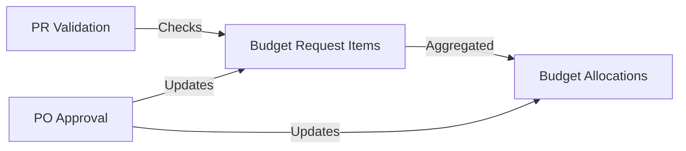

# Item-Level Budget Control Spec - Alignment Review

**Review Date:** December 19, 2025
**Reviewer:** Claude Sonnet 4.5
**Status:** ⚠️ **NEEDS CLARIFICATION**

---

## Executive Summary

The Item-Level Budget Control spec is **mostly aligned** with the current implementation but has **critical assumptions** that need verification and **architectural clarifications** about the two-level budget tracking system.

**Overall Assessment:** 6.5/10 - Needs updates before implementation

---

## Current Implementation Analysis

### 1. Budget Request Flow (As Implemented)

```
┌─────────────────────────────────────────────────────────────┐
│ Step 1: Create Budget Request (DRAFT)                      │
│ - fiscal_year: 2568                                        │
│ - department_id: null (central) or ID (department-specific)│
│ - status: DRAFT                                            │
└─────────────────────────────────────────────────────────────┘
                        ↓
┌─────────────────────────────────────────────────────────────┐
│ Step 2: Add Budget Request Items                           │
│ - item_id (drug/supply reference)                          │
│ - requested_qty, unit_price                                │
│ - Quarterly breakdown: q1_qty, q2_qty, q3_qty, q4_qty     │
│ - Historical data: last_year_qty, etc.                     │
│ - ✅ Purchased tracking fields (added in migration):      │
│   * q1_purchased_qty, q2_purchased_qty, etc.              │
│   * total_purchased_qty, total_purchased_value            │
└─────────────────────────────────────────────────────────────┘
                        ↓
┌─────────────────────────────────────────────────────────────┐
│ Step 3: Submit for Approval                                │
│ - status: SUBMITTED → DEPT_APPROVED → FINANCE_APPROVED    │
└─────────────────────────────────────────────────────────────┘
                        ↓
┌─────────────────────────────────────────────────────────────┐
│ Step 4: Finance Approval Creates Budget Allocations        │
│ ✅ CURRENTLY IMPLEMENTED in approveFinance():              │
│                                                             │
│ For each budget_request_item:                              │
│   - Aggregate by (fiscal_year, budget_id, department_id)  │
│   - Create/Update budget_allocations record               │
│   - Store quarterly budgets (q1_budget, q2_budget, etc.)  │
│   - Initialize spent = 0, remaining = total_budget        │
│                                                             │
│ Structure: ONE allocation per (year, budget type, dept)    │
│ NOT per item! (Aggregate level)                            │
└─────────────────────────────────────────────────────────────┘
```

### 2. Database Schema Reality

#### budget_allocations (Aggregate Level)

```sql
CREATE TABLE inventory.budget_allocations (
  id BIGSERIAL PRIMARY KEY,
  fiscal_year INTEGER NOT NULL,
  budget_id INTEGER NOT NULL,          -- Budget TYPE (e.g., "งบกลาง")
  department_id INTEGER NOT NULL,      -- Department (or 1 for central)
  total_budget DECIMAL(15,2),
  q1_budget DECIMAL(15,2),
  q2_budget DECIMAL(15,2),
  q3_budget DECIMAL(15,2),
  q4_budget DECIMAL(15,2),
  q1_spent DECIMAL(15,2) DEFAULT 0,    -- Updated when PO approved
  q2_spent DECIMAL(15,2) DEFAULT 0,
  q3_spent DECIMAL(15,2) DEFAULT 0,
  q4_spent DECIMAL(15,2) DEFAULT 0,
  total_spent DECIMAL(15,2) DEFAULT 0,
  remaining_budget DECIMAL(15,2),

  -- UNIQUE constraint: One allocation per (year, budget type, department)
  CONSTRAINT budget_allocations_year_budget_dept_key
    UNIQUE (fiscal_year, budget_id, department_id)
);
```

**Key Points:**

- ❌ NO item_id field
- ✅ Aggregate level: one record per budget type per department
- ✅ Quarterly spending tracked
- ⚠️ NOT granular enough for item-level control!

#### budget_request_items (Item Level)

```sql
ALTER TABLE inventory.budget_request_items
  -- Planned quantities (from budget request)
  q1_qty INTEGER,
  q2_qty INTEGER,
  q3_qty INTEGER,
  q4_qty INTEGER,

  -- ✅ Purchased quantities (added Dec 18)
  q1_purchased_qty INTEGER DEFAULT 0,
  q2_purchased_qty INTEGER DEFAULT 0,
  q3_purchased_qty INTEGER DEFAULT 0,
  q4_purchased_qty INTEGER DEFAULT 0,
  total_purchased_qty INTEGER DEFAULT 0,
  total_purchased_value DECIMAL(15,2) DEFAULT 0;
```

**Key Points:**

- ✅ Item-level granularity
- ✅ Purchased tracking fields exist
- ⚠️ NOT updated yet (no PO approval logic found)

---

## Alignment Analysis

### ✅ ALIGNED: Purchased Tracking Fields

**Spec Assumption:**

```sql
-- From spec's check_item_budget_control() function
v_quarter_purchased_qty := CASE
  WHEN p_quarter = 1 THEN v_item.q1_purchased_qty
  WHEN p_quarter = 2 THEN v_item.q2_purchased_qty
  ...
END;
```

**Reality:**

- ✅ Fields exist in budget_request_items (migration 20251218000002)
- ✅ Structure matches spec assumption
- ⚠️ NOT populated yet (need PO approval integration)

**Status:** ALIGNED but incomplete implementation

---

### ⚠️ MISALIGNMENT: Two-Level Budget Tracking

**Spec Assumption:**

- Item-level budget control validates against budget_request_items
- Each item has its own budget and purchased tracking

**Reality:**

- budget_allocations = Aggregate (budget type level)
- budget_request_items = Detailed (item level)

**Architectural Confusion:**

```
Budget Flow (Current):

Budget Request → Budget Allocation
   (Item Level)      (Aggregate Level)

   Item A: 1000 units
   Item B: 500 units     →    Total: 50,000 THB
   Item C: 2000 units         (for budget_id=1, dept=5)

PR Validation:
   Should validate against Item A's budget (1000 units)
   OR against aggregate budget (50,000 THB)?
```

**The Spec Says:**

- Validate at ITEM level (check_item_budget_control uses budget_request_item_id)
- Use q1_purchased_qty from budget_request_items

**Current Implementation:**

- Finance approval aggregates items into budget_allocations
- budget_allocations has NO item_id → cannot track per-item spending

**Status:** ⚠️ ARCHITECTURAL MISMATCH

---

### ❌ CRITICAL GAP: PO Approval → Purchased Qty Update

**Spec Assumption:**

```typescript
// When PO is approved, update budget_request_items.q1_purchased_qty
// This allows check_item_budget_control() to work correctly
```

**Reality:**

- ❌ No code found that updates q1_purchased_qty
- ❌ No PO approval service integration
- ❌ approveFinance() doesn't update purchased quantities

**Missing Flow:**

```
PO Approved
    ↓
❌ UPDATE budget_request_items
   SET q1_purchased_qty = q1_purchased_qty + po_quantity
   WHERE budget_request_item_id = ...
    ↓
❌ UPDATE budget_allocations
   SET q1_spent = q1_spent + po_total_amount
   WHERE ...
```

**Status:** ❌ NOT IMPLEMENTED

---

### ⚠️ DESIGN QUESTION: Budget Allocation vs Item Control

**Current Design:**

```
budget_allocations (Aggregate)
├─ fiscal_year: 2568
├─ budget_id: 1 (งบกลาง)
├─ department_id: 5 (ห้องยา)
├─ total_budget: 1,000,000 THB
└─ remaining_budget: 1,000,000 THB

budget_request_items (Detailed)
├─ Item A: Paracetamol 500mg
│   ├─ requested_qty: 10,000 tablets
│   ├─ q1_qty: 2,500 tablets
│   └─ q1_purchased_qty: 0 (not updated)
├─ Item B: Ibuprofen 400mg
│   ├─ requested_qty: 5,000 tablets
│   └─ q1_qty: 1,250 tablets
└─ Item C: Aspirin 100mg
    └─ ...
```

**Questions:**

1. **Should item-level control validate against:**
   - A) budget_request_items (item budget) ✅ Spec says YES
   - B) budget_allocations (aggregate budget) ❌ Spec says NO

2. **If validating against items, how does budget_allocations fit?**
   - Option 1: budget_allocations is just a summary (read-only view)
   - Option 2: budget_allocations is the source of truth (items reference it)
   - Option 3: Two independent systems (problematic!)

3. **When PR is created, which budget is reserved?**
   - Current code uses budget_reservations (references budget_allocations)
   - Spec assumes validation against budget_request_items
   - Conflict!

**Status:** ⚠️ NEEDS ARCHITECTURAL DECISION

---

### ✅ ALIGNED: Central Budget Pool

**Spec Assumption:**

- Budget requests can be central (department_id = null)
- Item-level control works regardless of central vs department

**Reality:**

- ✅ approveFinance() handles central requests (department_id = null → 1)
- ✅ Uses department_id = 1 for "คลังกลาง/งบรวม"
- ✅ Logging confirms central request handling

**Status:** ✅ FULLY ALIGNED

---

### ⚠️ SPEC ASSUMPTION: Budget Exists Before PR

**Spec Flow:**

```
1. Budget Request approved (budget_request_items exist)
2. Create PR referencing budget_request_item_id
3. check_item_budget_control() validates PR against item budget
```

**Questions:**

1. **Does PR reference budget_request_item_id?**
   - Need to check purchase_request_items schema
   - If YES, flow makes sense
   - If NO, spec needs major revision

2. **Is budget_request_item_id required in PR?**
   - If optional, how does validation work?
   - If required, enforces budget-first workflow

3. **Can PR be created without approved budget?**
   - Current validation unclear
   - Spec assumes budget MUST exist first

**Status:** ⚠️ NEEDS VERIFICATION

---

## Critical Issues Summary

### 🔴 HIGH PRIORITY

1. **PO Approval Integration Missing**
   - q1_purchased_qty fields exist but never updated
   - Item-level budget control depends on this
   - **Action:** Implement PO approval → purchased_qty update

2. **Architectural Mismatch: Allocations vs Items**
   - budget_allocations = aggregate (no item_id)
   - Item-level control = detailed (per item)
   - **Action:** Clarify relationship and update spec

3. **PR → Budget Item Linkage Unclear**
   - Does PR reference budget_request_item_id?
   - If not, how does check_item_budget_control() work?
   - **Action:** Verify PR schema and update spec

### 🟡 MEDIUM PRIORITY

4. **Budget Reservation Flow**
   - Current: reserve_budget() uses budget_allocations
   - Spec: validate against budget_request_items
   - **Action:** Reconcile these two approaches

5. **Finance Approval Logic**
   - Currently creates budget_allocations
   - Spec assumes validation happens later (PR creation)
   - **Action:** Document complete flow

### 🟢 LOW PRIORITY

6. **Dashboard Data Source**
   - Spec shows dashboard using budget_request_items
   - Current allocations are aggregate
   - **Action:** Clarify which table to query

---

## Recommendations

### Immediate Actions (Before Implementation)

1. **✅ Verify PR Schema**

   ```bash
   # Check if purchase_request_items has budget_request_item_id
   grep -r "purchase_request_items" apps/api/src/database/migrations-inventory/
   ```

2. **✅ Document Complete Flow**

   ```
   Budget Request → Finance Approve → Budget Allocations
                                            ↓
   PR Creation → Validate (Item Level) → Reserve Budget
                                            ↓
   PO Approval → Update Purchased Qty → Update Spent
   ```

3. **✅ Update Spec with Architecture Clarification**
   - Add section: "Two-Level Budget Tracking"
   - Explain allocations vs items relationship
   - Show when each is used

4. **✅ Implement Missing PO Integration**
   - Create PO approval hook
   - Update q1_purchased_qty in budget_request_items
   - Update q1_spent in budget_allocations
   - Keep both in sync

### Spec Updates Needed

#### 1. Add Architecture Section

````markdown
## Budget Tracking Architecture

### Two-Level System

1. **Budget Allocations (Aggregate Level)**
   - Purpose: High-level budget tracking per department
   - Granularity: (fiscal_year, budget_type, department)
   - Use Case: Management reporting, overall budget monitoring
   - Updated: When PO approved (spent amounts)

2. **Budget Request Items (Item Level)**
   - Purpose: Detailed item-specific budget and purchased tracking
   - Granularity: Per drug/supply item
   - Use Case: Item-level budget control, variance analysis
   - Updated: When PO approved (purchased quantities)

### Relationship


````

### Data Sync

When PO is approved:

1. Update budget_request_items.q1_purchased_qty (item level)
2. Update budget_allocations.q1_spent (aggregate level)
3. Both must stay in sync

````

#### 2. Add PO Integration Task

Add to tasks.md Phase 2:

```markdown
- [ ] 2.5 Implement PO approval integration
  - File: `apps/api/src/layers/domains/inventory/procurement/purchaseOrders/purchase-orders.service.ts`
  - When PO approved, update budget_request_items.q1_purchased_qty
  - Also update budget_allocations.q1_spent
  - Ensure transaction consistency
  - Purpose: Populate purchased quantities for budget control validation
  - _Leverage: Existing PO approval logic, database transaction patterns
  - _Requirements: Requirement 2 (budget validation depends on purchased data)
````

#### 3. Update Design Document

Add clarification in Component 2 (PostgreSQL Function):

```markdown
**Prerequisites:**

- Budget request must be FINANCE_APPROVED
- budget_request_items must have purchased quantities populated
- PO approval integration must be implemented first

**Data Source:**

- Reads from budget_request_items (NOT budget_allocations)
- Uses item-level purchased quantities
- Validates against item-specific budget
```

---

## Architectural Decision Needed

### Question: Should we maintain two-level tracking?

**Option A: Keep Both (Recommended)**

- budget_allocations = aggregate (fast queries, reporting)
- budget_request_items = detailed (item control, validation)
- Sync via PO approval triggers
- Pros: Best performance, granular control
- Cons: Complexity, must keep in sync

**Option B: Item-Level Only**

- Remove budget_allocations
- Track everything in budget_request_items
- Aggregate on-the-fly for reporting
- Pros: Single source of truth, simpler
- Cons: Slower queries, schema redesign

**Option C: Allocations Only**

- Remove item-level tracking
- Use budget_allocations for all validation
- No per-item control
- Pros: Simpler schema
- Cons: Defeats purpose of item-level control spec

**Recommendation: Option A** - Keep both levels, implement sync mechanism

---

## Next Steps

1. **Verify PR Schema** (30 minutes)
   - Check purchase_request_items for budget_request_item_id
   - Document PR → Budget item linkage

2. **Update Spec** (1 hour)
   - Add two-level architecture section
   - Clarify allocations vs items relationship
   - Add PO integration task

3. **Implement PO Integration** (3 hours)
   - Create PO approval → purchased_qty update
   - Sync with budget_allocations.spent
   - Write tests

4. **Review with Team** (1 hour)
   - Confirm architectural approach
   - Validate assumptions
   - Get approval to proceed

**Total Effort Before Implementation:** ~5.5 hours

---

## Conclusion

The Item-Level Budget Control spec is **conceptually sound** but has **critical gaps** in understanding the current two-level budget tracking architecture. The spec needs updates to:

1. Document the allocations vs items relationship
2. Add PO approval integration
3. Clarify data sync mechanisms
4. Verify PR → budget item linkage

**Recommendation:** ⚠️ **PAUSE implementation** until these clarifications are made and architectural decisions are confirmed.

**Confidence Level:** 6.5/10 - Need answers before proceeding safely
