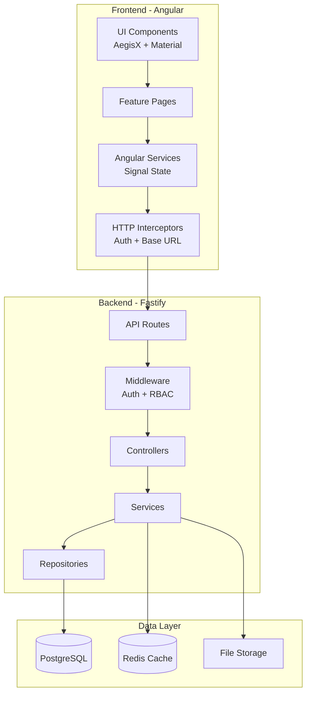
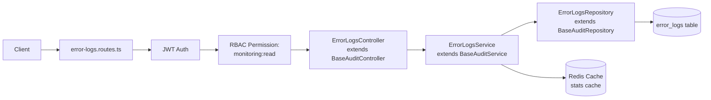
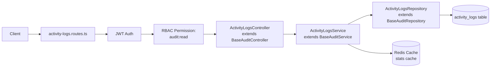
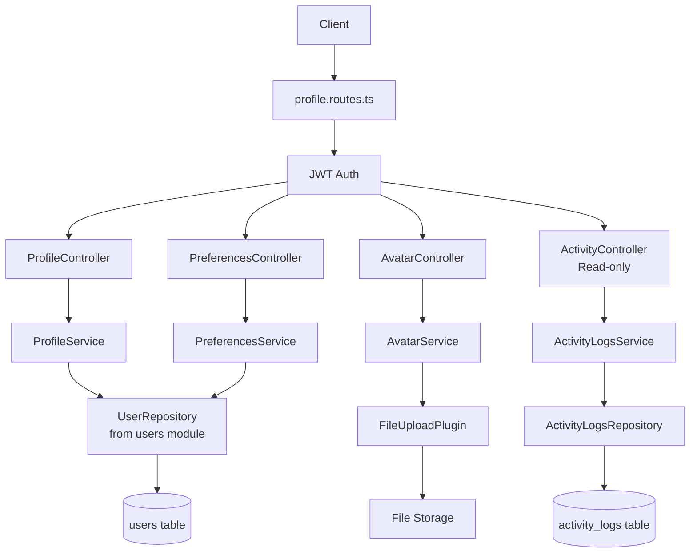
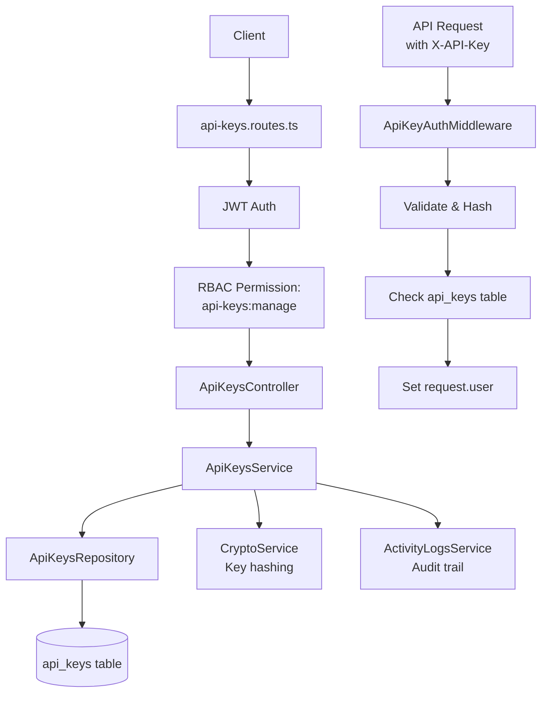

# Design Document: Monitoring & Audit Modules Restoration

## Overview

This design document outlines the technical architecture for restoring four critical backend modules (Error Logs, Activity Logs, User Profile, API Keys) that were deleted during the API Architecture Standardization migration. The design follows the established layer-based architecture, reuses existing base classes extensively, and implements modern UI/UX using AegisX UI, Angular Material, and TailwindCSS.

**Key Design Principles:**

- **Code Reuse First**: Leverage `BaseAuditController`, `BaseAuditService`, `BaseAuditRepository` for audit logs
- **Layer-Based Routing**: Core layer for audit logs (`/api/error-logs`, `/api/activity-logs`), Platform layer for user features (`/api/v1/platform/profile`, `/api/v1/platform/api-keys`)
- **Signal-Based State**: Use Angular Signals for reactive state management
- **Component Library**: Use AegisX UI + Angular Material for consistent UI
- **Type Safety**: TypeBox schemas for all API contracts
- **Test-Driven**: Unit, integration, and E2E tests for all features

---

## Steering Document Alignment

### Technical Standards (tech.md)

**Backend:**

- ✅ Fastify framework with plugin-based architecture
- ✅ TypeBox for schema validation and type generation
- ✅ PostgreSQL with Knex.js query builder
- ✅ Redis for caching (error/activity stats)
- ✅ JWT authentication with RBAC authorization
- ✅ Layer-based routing (Core, Platform, Domains)

**Frontend:**

- ✅ Angular 17+ with standalone components
- ✅ Signals for reactive state management
- ✅ HttpClient with interceptors for API calls
- ✅ Angular Material + AegisX UI component library
- ✅ TailwindCSS for utility-first styling
- ✅ Lazy-loaded feature modules

### Project Structure (structure.md)

**Backend Structure:**

```
apps/api/src/
├── layers/
│   ├── core/
│   │   └── audit/
│   │       ├── base/                  # Reusable base classes ✅
│   │       ├── error-logs/            # NEW MODULE
│   │       │   ├── error-logs.controller.ts
│   │       │   ├── error-logs.service.ts
│   │       │   ├── error-logs.repository.ts
│   │       │   ├── error-logs.routes.ts
│   │       │   ├── error-logs.schemas.ts
│   │       │   ├── error-logs.plugin.ts
│   │       │   └── index.ts
│   │       └── activity-logs/         # NEW MODULE
│   │           ├── activity-logs.controller.ts
│   │           ├── activity-logs.service.ts
│   │           ├── activity-logs.repository.ts
│   │           ├── activity-logs.routes.ts
│   │           ├── activity-logs.schemas.ts
│   │           ├── activity-logs.plugin.ts
│   │           └── index.ts
│   └── platform/
│       ├── user-profile/              # NEW MODULE
│       │   ├── controllers/
│       │   │   ├── profile.controller.ts
│       │   │   ├── avatar.controller.ts
│       │   │   ├── preferences.controller.ts
│       │   │   └── activity.controller.ts
│       │   ├── services/
│       │   │   ├── profile.service.ts
│       │   │   ├── avatar.service.ts
│       │   │   └── preferences.service.ts
│       │   ├── repositories/
│       │   │   └── profile.repository.ts
│       │   ├── routes/
│       │   │   └── profile.routes.ts
│       │   ├── schemas/
│       │   │   └── profile.schemas.ts
│       │   ├── user-profile.plugin.ts
│       │   └── index.ts
│       └── api-keys/                  # NEW MODULE
│           ├── api-keys.controller.ts
│           ├── api-keys.service.ts
│           ├── api-keys.repository.ts
│           ├── api-keys.routes.ts
│           ├── api-keys.schemas.ts
│           ├── api-keys.plugin.ts
│           ├── middleware/
│           │   └── api-key-auth.middleware.ts
│           └── index.ts
```

**Frontend Structure:**

```
apps/web/src/app/
├── core/
│   ├── monitoring/                    # EXISTING (update baseUrl)
│   │   ├── services/
│   │   │   ├── error-logs.service.ts  ✅ Update baseUrl
│   │   │   └── activity-logs.service.ts ✅ Update baseUrl
│   │   ├── models/
│   │   │   └── monitoring.types.ts
│   │   └── pages/
│   │       ├── error-logs/            # NEW PAGES
│   │       │   ├── error-logs-list.page.ts
│   │       │   ├── error-logs-detail.page.ts
│   │       │   └── error-logs.config.ts
│   │       └── activity-logs/         # NEW PAGES
│   │           ├── activity-logs-list.page.ts
│   │           ├── activity-logs-detail.page.ts
│   │           └── activity-logs.config.ts
│   ├── users/                         # EXISTING
│   │   ├── services/
│   │   │   └── user.service.ts        ✅ Add profile methods
│   │   └── pages/
│   │       └── profile/               # NEW PAGES
│   │           ├── profile.page.ts
│   │           ├── profile.config.ts
│   │           └── components/
│   │               ├── profile-info.component.ts
│   │               ├── profile-avatar.component.ts
│   │               ├── profile-preferences.component.ts
│   │               └── profile-activity.component.ts
│   └── api-keys/                      # NEW MODULE
│       ├── services/
│       │   └── api-keys.service.ts    # NEW
│       ├── models/
│       │   └── api-keys.types.ts
│       └── pages/
│           ├── api-keys-list.page.ts
│           ├── api-keys-detail.page.ts
│           └── api-keys.config.ts
└── shared/
    └── components/                    # NEW REUSABLE COMPONENTS
        ├── data-table/
        │   └── data-table.component.ts
        ├── filter-panel/
        │   └── filter-panel.component.ts
        ├── export-button/
        │   └── export-button.component.ts
        └── stats-cards/
            └── stats-cards.component.ts
```

---

## Code Reuse Analysis

### Existing Components to Leverage

**Backend Base Classes (Critical for Audit Logs):**

- **`BaseAuditController`** (`apps/api/src/layers/core/audit/base/base.controller.ts`)
  - Provides: `findAll`, `findById`, `getStats`, `deleteById`, `cleanup`, `export`
  - Will extend for: `ErrorLogsController`, `ActivityLogsController`

- **`BaseAuditService`** (`apps/api/src/layers/core/audit/base/base.service.ts`)
  - Provides: Pagination, filtering, statistics calculation, export formatting
  - Will extend for: `ErrorLogsService`, `ActivityLogsService`

- **`BaseAuditRepository`** (`apps/api/src/layers/core/audit/base/base.repository.ts`)
  - Provides: CRUD operations, query building, date range filters
  - Will extend for: `ErrorLogsRepository`, `ActivityLogsRepository`

**Frontend Services (Already Implemented):**

- **`ErrorLogsService`** (`apps/web/src/app/core/monitoring/services/error-logs.service.ts`)
  - Status: ✅ Fully implemented with Signal-based state
  - Action: Update `baseUrl` from `/error-logs` to `/error-logs` (Core layer)

- **`ActivityLogsService`** (`apps/web/src/app/core/monitoring/services/activity-logs.service.ts`)
  - Status: ✅ Fully implemented with Signal-based state
  - Action: Update `baseUrl` from `/activity-logs` to `/activity-logs` (Core layer)

**File Upload Infrastructure:**

- **`FileUploadPlugin`** (`apps/api/src/layers/platform/file-upload/`)
  - Will use for: Avatar uploads in User Profile
  - Features: Validation, storage, thumbnails, cleanup

**Authentication & Authorization:**

- **JWT Auth Strategies** (`apps/api/src/layers/core/auth/strategies/`)
  - Will use: `authenticate` preValidation hook on all routes
- **RBAC Permissions** (`apps/api/src/layers/platform/rbac/`)
  - Will use: `verifyPermission` hook for authorization checks

**Database Tables (Already Exist):**

- ✅ `error_logs` table (from migration `001_create_monitoring_tables.ts`)
- ✅ `activity_logs` table (from migration `001_create_monitoring_tables.ts`)
- ✅ `users` table with `department_id` (recently added)
- ⚠️ `api_keys` table needs creation (new migration required)

### Integration Points

**Existing Systems:**

1. **Monitoring Module** (`apps/api/src/layers/core/monitoring/`)
   - Integration: Error logs will store errors posted to `/monitoring/client-errors`
   - Flow: Client errors → Monitoring plugin → `error_logs` table → Error Logs module for viewing

2. **Activity Logging Middleware** (`apps/api/src/plugins/activity-logging/`)
   - Integration: Currently disabled, will re-enable and connect to Activity Logs module
   - Flow: User actions → Activity middleware → `activity_logs` table → Activity Logs module for viewing

3. **User Service** (`apps/api/src/layers/platform/users/`)
   - Integration: User Profile will extend Users module
   - Flow: Profile operations → User service → `users` table + avatar storage

4. **Department Integration** (Recent Addition)
   - Integration: User Profile displays and updates `department_id`
   - Flow: Profile page → Department selector → User service → `users.department_id`

---

## Architecture

### System Architecture Overview



### Backend Module Architecture

#### Error Logs Module (Core Layer)

**Route Pattern:** `/api/error-logs/*`



**Class Hierarchy:**

```typescript
BaseAuditController<ErrorLog, ErrorQuery, ErrorStats>
  ↓ extends
ErrorLogsController
  - Minimal code: Just plugin registration
  - Inherits: findAll, findById, getStats, cleanup, export
  - Override: getExportFilename() to return 'error-logs'
```

#### Activity Logs Module (Core Layer)

**Route Pattern:** `/api/activity-logs/*`



**Integration with Activity Middleware:**

```typescript
// Re-enable activity-logging middleware
// apps/api/src/plugins/activity-logging/activity-logging.plugin.ts
// This middleware will automatically log activities to activity_logs table
// Activity Logs module provides READ access to view these logs
```

#### User Profile Module (Platform Layer)

**Route Pattern:** `/api/v1/platform/profile/*`



**Controllers:**

- **ProfileController**: Basic profile CRUD (GET, PUT)
- **AvatarController**: Avatar upload/delete (POST, DELETE)
- **PreferencesController**: User preferences (GET, PUT)
- **ActivityController**: User's activity history (GET, read-only)

**Department Integration:**

```typescript
// Profile includes department_id field
// Frontend displays department selector
// On update, validates department exists and user has access
```

#### API Keys Module (Platform Layer)

**Route Pattern:** `/api/v1/platform/api-keys/*`



**Security Flow:**

1. User creates API key → Generate secure random key
2. Hash key with bcrypt (cost=12)
3. Store hash in database, return plain key ONCE
4. On API request with key → Hash incoming key → Compare with stored hash
5. If valid → Load user + permissions → Continue request

---

### Frontend Architecture

#### State Management Pattern (Signals)

All frontend services use Angular Signals for reactive state:

```typescript
// Pattern used across all services
@Injectable({ providedIn: 'root' })
export class ExampleService {
  private _state = signal<ExampleState>({
    data: [],
    loading: false,
    error: null,
    pagination: null,
  });

  // Read-only state
  readonly state = this._state.asReadonly();
  readonly data = () => this._state().data;
  readonly loading = () => this._state().loading;
  readonly error = () => this._state().error;

  // Mutations
  private updateState(partial: Partial<ExampleState>) {
    this._state.update((current) => ({ ...current, ...partial }));
  }
}
```

#### Component Hierarchy

**Error Logs Feature:**

```
error-logs-list.page.ts (Container)
├── data-table.component.ts (Shared)
│   ├── mat-table (Angular Material)
│   ├── mat-paginator
│   └── mat-sort
├── filter-panel.component.ts (Shared)
│   └── mat-expansion-panel (Angular Material)
├── stats-cards.component.ts (Shared)
│   └── ax-stats-card (AegisX UI)
└── export-button.component.ts (Shared)
    └── ax-button (AegisX UI)

error-logs-detail.page.ts (Container)
├── ax-card (AegisX UI)
├── ax-badge (AegisX UI) - Error level
└── ax-description-list (AegisX UI) - Error details
```

**Activity Logs Feature:**

```
activity-logs-list.page.ts (Container)
├── ax-timeline (AegisX UI) - Activity timeline
├── filter-panel.component.ts (Shared)
├── stats-cards.component.ts (Shared)
└── export-button.component.ts (Shared)

activity-logs-detail.page.ts (Container)
├── ax-card (AegisX UI)
└── ax-description-list (AegisX UI)
```

**User Profile Feature:**

```
profile.page.ts (Container)
├── profile-info.component.ts
│   ├── ax-card (AegisX UI)
│   ├── mat-form-field (Angular Material)
│   ├── mat-input
│   └── mat-select - Department selector
├── profile-avatar.component.ts
│   ├── ax-avatar (AegisX UI)
│   └── File upload with drag-and-drop
├── profile-preferences.component.ts
│   ├── ax-card (AegisX UI)
│   ├── mat-slide-toggle - Theme, notifications
│   └── mat-select - Language
└── profile-activity.component.ts
    └── ax-timeline (AegisX UI) - Recent activities
```

**API Keys Feature:**

```
api-keys-list.page.ts (Container)
├── data-table.component.ts (Shared)
├── ax-badge (AegisX UI) - Key status
└── ax-button (AegisX UI) - Create key

api-keys-detail.page.ts (Container)
├── ax-card (AegisX UI)
├── Key creation wizard (mat-stepper)
│   ├── Step 1: Name
│   ├── Step 2: Permissions (mat-checkbox-group)
│   ├── Step 3: Expiration (mat-datepicker)
│   └── Step 4: Review
├── One-time key display (copyable)
│   └── ax-button - Copy to clipboard
└── Usage chart (Canvas + Chart.js)
```

#### UI Design Tokens

**Color Palette (TailwindCSS + AegisX):**

```typescript
// Error severity colors
error: 'text-red-600 bg-red-50'
warn: 'text-yellow-600 bg-yellow-50'
info: 'text-blue-600 bg-blue-50'

// Status colors
active: 'text-green-600 bg-green-50'
expired: 'text-gray-600 bg-gray-50'
revoked: 'text-red-600 bg-red-50'

// Component variants (AegisX)
ax-button: 'primary' | 'secondary' | 'success' | 'warning' | 'danger'
ax-badge: 'default' | 'primary' | 'success' | 'warning' | 'danger' | 'info'
```

**Spacing Scale:**

```
4px base unit
- xs: 4px (1)
- sm: 8px (2)
- md: 16px (4)
- lg: 24px (6)
- xl: 32px (8)
- 2xl: 48px (12)
```

**Typography:**

```
// Headings
h1: text-3xl font-bold
h2: text-2xl font-semibold
h3: text-xl font-semibold
h4: text-lg font-medium

// Body
body: text-base
small: text-sm
tiny: text-xs
```

---

## Components and Interfaces

### Backend Components

#### 1. ErrorLogsController

**Purpose:** Handle HTTP requests for error logs CRUD operations

**Interfaces:**

```typescript
class ErrorLogsController extends BaseAuditController<ErrorLog, ErrorQuery, ErrorStats, ErrorLogsService> {
  constructor(service: ErrorLogsService) {
    super(service, 'Error log');
  }

  protected getExportFilename(): string {
    return 'error-logs';
  }

  // Inherits from BaseAuditController:
  // - async findAll(request, reply): Promise<void>
  // - async findById(request, reply): Promise<void>
  // - async getStats(request, reply): Promise<void>
  // - async deleteById(request, reply): Promise<void>
  // - async cleanup(request, reply): Promise<void>
  // - async export(request, reply): Promise<void>
}
```

**Dependencies:**

- ErrorLogsService
- BaseAuditController (extends)

**Reuses:** BaseAuditController provides all CRUD endpoints

---

#### 2. ErrorLogsService

**Purpose:** Business logic for error logs operations

**Interfaces:**

```typescript
class ErrorLogsService extends BaseAuditService<ErrorLog, ErrorQuery, ErrorStats, ErrorLogsRepository> {
  constructor(repository: ErrorLogsRepository) {
    super(repository, 'error_logs');
  }

  // Inherits from BaseAuditService:
  // - async findAll(query): Promise<PaginationResult<ErrorLog>>
  // - async findById(id): Promise<ErrorLog | null>
  // - async getStats(query): Promise<ErrorStats>
  // - async deleteById(id): Promise<boolean>
  // - async cleanup(query): Promise<number>
  // - async export(query, options): Promise<string>

  // Custom method:
  async getStatsByLevel(): Promise<ErrorStatsByLevel> {
    // Group errors by level (error, warn, info)
    // Return counts and percentages
  }
}
```

**Dependencies:**

- ErrorLogsRepository
- BaseAuditService (extends)
- Redis (for caching stats)

**Reuses:** BaseAuditService provides pagination, filtering, statistics

---

#### 3. ActivityLogsController

**Purpose:** Handle HTTP requests for activity logs

**Interfaces:**

```typescript
class ActivityLogsController extends BaseAuditController<ActivityLog, ActivityQuery, ActivityStats, ActivityLogsService> {
  constructor(service: ActivityLogsService) {
    super(service, 'Activity log');
  }

  protected getExportFilename(): string {
    return 'activity-logs';
  }

  // Inherits all CRUD from BaseAuditController
}
```

**Dependencies:**

- ActivityLogsService
- BaseAuditController (extends)

**Reuses:** BaseAuditController provides all CRUD endpoints

---

#### 4. ProfileController

**Purpose:** Handle user profile CRUD operations

**Interfaces:**

```typescript
class ProfileController {
  constructor(
    private profileService: ProfileService,
    private userRepository: UserRepository,
  ) {}

  // GET /api/v1/platform/profile
  async getProfile(request, reply): Promise<void> {
    const userId = request.user.id;
    const profile = await this.profileService.getProfile(userId);
    return reply.success(profile);
  }

  // PUT /api/v1/platform/profile
  async updateProfile(request, reply): Promise<void> {
    const userId = request.user.id;
    const data = request.body;
    const profile = await this.profileService.updateProfile(userId, data);
    return reply.success(profile);
  }
}
```

**Dependencies:**

- ProfileService
- UserRepository (from users module)

**Reuses:** User Repository for database access

---

#### 5. AvatarController

**Purpose:** Handle avatar upload/delete

**Interfaces:**

```typescript
class AvatarController {
  constructor(
    private avatarService: AvatarService,
    private fileUploadPlugin: FileUploadPlugin,
  ) {}

  // POST /api/v1/platform/profile/avatar
  async uploadAvatar(request, reply): Promise<void> {
    const userId = request.user.id;
    const file = await request.file(); // Multipart file
    const avatarUrl = await this.avatarService.uploadAvatar(userId, file);
    return reply.success({ avatarUrl });
  }

  // DELETE /api/v1/platform/profile/avatar
  async deleteAvatar(request, reply): Promise<void> {
    const userId = request.user.id;
    await this.avatarService.deleteAvatar(userId);
    return reply.success({ message: 'Avatar deleted' });
  }
}
```

**Dependencies:**

- AvatarService
- FileUploadPlugin (for storage)

**Reuses:** File Upload infrastructure

---

#### 6. ApiKeysController

**Purpose:** Handle API key CRUD and usage tracking

**Interfaces:**

```typescript
class ApiKeysController {
  constructor(
    private apiKeysService: ApiKeysService,
    private apiKeysRepository: ApiKeysRepository,
  ) {}

  // GET /api/v1/platform/api-keys
  async listKeys(request, reply): Promise<void> {
    const userId = request.user.id;
    const keys = await this.apiKeysService.listKeys(userId);
    return reply.success(keys);
  }

  // POST /api/v1/platform/api-keys
  async createKey(request, reply): Promise<void> {
    const userId = request.user.id;
    const { name, permissions, expiresAt } = request.body;
    const { key, keyData } = await this.apiKeysService.createKey(userId, name, permissions, expiresAt);
    // Return plain key only once
    return reply.success({ key, ...keyData });
  }

  // DELETE /api/v1/platform/api-keys/:id
  async revokeKey(request, reply): Promise<void> {
    const userId = request.user.id;
    const keyId = request.params.id;
    await this.apiKeysService.revokeKey(userId, keyId);
    return reply.success({ message: 'API key revoked' });
  }

  // GET /api/v1/platform/api-keys/:id/usage
  async getUsage(request, reply): Promise<void> {
    const keyId = request.params.id;
    const usage = await this.apiKeysService.getUsage(keyId);
    return reply.success(usage);
  }
}
```

**Dependencies:**

- ApiKeysService
- ApiKeysRepository
- CryptoService (for key hashing)
- ActivityLogsService (for audit trail)

**Reuses:** None (standalone module)

---

### Frontend Components

#### 7. ErrorLogsListPage (Container Component)

**Purpose:** Display paginated list of error logs with filters

**Interfaces:**

```typescript
@Component({
  selector: 'app-error-logs-list',
  standalone: true,
  imports: [DataTableComponent, FilterPanelComponent, StatsCardsComponent, ExportButtonComponent, MatTableModule, AegisXModule],
})
export class ErrorLogsListPage implements OnInit {
  private errorLogsService = inject(ErrorLogsService);

  // Signals from service
  errorLogs = this.errorLogsService.errorLogs;
  errorStats = this.errorLogsService.errorStats;
  loading = this.errorLogsService.loading;
  pagination = this.errorLogsService.pagination;

  // Component state
  filters = signal<ErrorLogsQuery>({});

  ngOnInit() {
    this.loadErrorLogs();
    this.loadStats();
  }

  loadErrorLogs() {
    this.errorLogsService.getErrorLogs(this.filters()).subscribe();
  }

  loadStats() {
    this.errorLogsService.getErrorStats().subscribe();
  }

  onFilterChange(filters: ErrorLogsQuery) {
    this.filters.set(filters);
    this.loadErrorLogs();
  }

  onExport(format: 'csv' | 'json') {
    this.errorLogsService.exportLogs(this.filters()).subscribe();
  }

  onDelete(id: string) {
    this.errorLogsService.deleteErrorLog(id).subscribe(() => {
      this.loadErrorLogs();
    });
  }
}
```

**Dependencies:**

- ErrorLogsService (state + API calls)
- DataTableComponent (shared)
- FilterPanelComponent (shared)
- StatsCardsComponent (shared)
- ExportButtonComponent (shared)

**Reuses:** Shared data table, filter panel, stats cards components

---

#### 8. ProfilePage (Container Component)

**Purpose:** User profile management with tabs

**Interfaces:**

```typescript
@Component({
  selector: 'app-profile',
  standalone: true,
  imports: [ProfileInfoComponent, ProfileAvatarComponent, ProfilePreferencesComponent, ProfileActivityComponent, MatTabsModule, AegisXModule],
})
export class ProfilePage implements OnInit {
  private userService = inject(UserService);
  private route = inject(ActivatedRoute);

  // Signals
  profile = signal<UserProfile | null>(null);
  loading = signal(false);
  activeTab = signal(0);

  ngOnInit() {
    this.loadProfile();
  }

  loadProfile() {
    this.loading.set(true);
    this.userService.getProfile().subscribe({
      next: (profile) => {
        this.profile.set(profile);
        this.loading.set(false);
      },
      error: () => this.loading.set(false),
    });
  }

  onProfileUpdate(data: Partial<UserProfile>) {
    this.userService.updateProfile(data).subscribe(() => {
      this.loadProfile();
    });
  }

  onAvatarUpload(file: File) {
    this.userService.uploadAvatar(file).subscribe(() => {
      this.loadProfile();
    });
  }
}
```

**Dependencies:**

- UserService (state + API calls)
- ProfileInfoComponent
- ProfileAvatarComponent
- ProfilePreferencesComponent
- ProfileActivityComponent

**Reuses:** Department selector from existing departments module

---

#### 9. DataTableComponent (Shared/Reusable)

**Purpose:** Reusable data table with sorting, pagination, and actions

**Interfaces:**

```typescript
@Component({
  selector: 'app-data-table',
  standalone: true,
  imports: [MatTableModule, MatPaginatorModule, MatSortModule],
})
export class DataTableComponent<T> {
  @Input() data: T[] = [];
  @Input() columns: TableColumn<T>[] = [];
  @Input() totalItems = 0;
  @Input() pageSize = 25;
  @Input() loading = false;

  @Output() pageChange = new EventEmitter<PageEvent>();
  @Output() sortChange = new EventEmitter<Sort>();
  @Output() rowClick = new EventEmitter<T>();
  @Output() actionClick = new EventEmitter<{ action: string; row: T }>();

  displayedColumns: string[] = [];
  dataSource = new MatTableDataSource<T>();

  ngOnChanges() {
    this.dataSource.data = this.data;
    this.displayedColumns = this.columns.map((col) => col.key);
  }

  onPageChange(event: PageEvent) {
    this.pageChange.emit(event);
  }

  onSortChange(event: Sort) {
    this.sortChange.emit(event);
  }
}

interface TableColumn<T> {
  key: string;
  label: string;
  sortable?: boolean;
  type?: 'text' | 'date' | 'badge' | 'actions';
  formatter?: (value: any, row: T) => string;
}
```

**Dependencies:**

- Angular Material Table, Paginator, Sort

**Reuses:** None (base component)

---

## Data Models

### 1. ErrorLog (Backend)

```typescript
interface ErrorLog {
  id: string; // UUID primary key
  timestamp: Date; // When error occurred
  level: 'error' | 'warn' | 'info';
  message: string; // Error message
  url: string; // URL where error occurred
  user_agent: string; // Browser user agent
  user_id: string | null; // User who encountered error (nullable)
  session_id: string | null; // Session ID
  correlation_id: string; // Request correlation ID
  stack: string | null; // Stack trace
  context: Record<string, any> | null; // Additional context
  type: 'javascript' | 'http' | 'angular' | 'custom' | 'backend' | 'system';
  ip_address: string | null; // Client IP
  referer: string | null; // Referer header
  created_at: Date; // Row creation time
}

interface ErrorQuery {
  page?: number;
  limit?: number;
  level?: 'error' | 'warn' | 'info';
  type?: string;
  user_id?: string;
  from_date?: string; // ISO date
  to_date?: string; // ISO date
  search?: string; // Search in message
}

interface ErrorStats {
  total: number;
  by_level: {
    error: number;
    warn: number;
    info: number;
  };
  by_type: Record<string, number>;
  trend: Array<{ date: string; count: number }>;
}
```

**Database Table:** `error_logs` (already exists)

---

### 2. ActivityLog (Backend)

```typescript
interface ActivityLog {
  id: string; // UUID primary key
  user_id: string; // User who performed action
  action: string; // Action type (e.g., 'user.login', 'profile.update')
  description: string; // Human-readable description
  entity_type: string | null; // Entity affected (e.g., 'user', 'document')
  entity_id: string | null; // Entity ID
  ip_address: string | null; // Client IP
  user_agent: string | null; // Browser user agent
  correlation_id: string; // Request correlation ID
  metadata: Record<string, any> | null; // Additional data
  severity: 'info' | 'warning' | 'error' | 'critical';
  timestamp: Date; // When action occurred
  created_at: Date; // Row creation time
}

interface ActivityQuery {
  page?: number;
  limit?: number;
  user_id?: string;
  action?: string;
  entity_type?: string;
  severity?: 'info' | 'warning' | 'error' | 'critical';
  from_date?: string;
  to_date?: string;
  search?: string;
}

interface ActivityStats {
  total: number;
  by_user: Array<{ user_id: string; count: number }>;
  by_action: Record<string, number>;
  by_severity: Record<string, number>;
  trend: Array<{ date: string; count: number }>;
}
```

**Database Table:** `activity_logs` (already exists)

---

### 3. UserProfile (Backend)

```typescript
interface UserProfile {
  id: string; // UUID (from users table)
  email: string;
  first_name: string;
  last_name: string;
  department_id: string | null; // NEW: Department association
  avatar_url: string | null; // Avatar file URL
  theme: 'light' | 'dark' | 'auto';
  language: 'en' | 'th';
  notifications_enabled: boolean;
  email_notifications: boolean;
  created_at: Date;
  updated_at: Date;
}

interface UpdateProfileRequest {
  first_name?: string;
  last_name?: string;
  department_id?: string | null;
  theme?: 'light' | 'dark' | 'auto';
  language?: 'en' | 'th';
  notifications_enabled?: boolean;
  email_notifications?: boolean;
}
```

**Database Table:** `users` (existing, no changes needed - department_id already added)

---

### 4. ApiKey (Backend)

```typescript
interface ApiKey {
  id: string; // UUID primary key
  user_id: string; // Owner user ID
  name: string; // User-defined name
  key_hash: string; // Bcrypt hash of the key
  key_prefix: string; // First 8 chars for display (e.g., "pk_live_")
  permissions: string[]; // Array of permission strings
  last_used_at: Date | null; // Last usage timestamp
  usage_count: number; // Total request count
  expires_at: Date | null; // Expiration date (nullable)
  revoked: boolean; // Revoked status
  revoked_at: Date | null; // When revoked
  created_at: Date;
  updated_at: Date;
}

interface CreateApiKeyRequest {
  name: string;
  permissions: string[];
  expires_at?: string; // ISO date (optional)
}

interface ApiKeyResponse {
  id: string;
  name: string;
  key_prefix: string;
  permissions: string[];
  expires_at: Date | null;
  created_at: Date;
  // Note: Full key is only returned on creation
}
```

**Database Table:** `api_keys` (NEW - requires migration)

**Migration:**

```sql
CREATE TABLE api_keys (
  id UUID PRIMARY KEY DEFAULT uuid_generate_v4(),
  user_id UUID NOT NULL REFERENCES users(id) ON DELETE CASCADE,
  name VARCHAR(255) NOT NULL,
  key_hash VARCHAR(255) NOT NULL,
  key_prefix VARCHAR(20) NOT NULL,
  permissions TEXT[] NOT NULL DEFAULT '{}',
  last_used_at TIMESTAMP WITH TIME ZONE,
  usage_count INTEGER NOT NULL DEFAULT 0,
  expires_at TIMESTAMP WITH TIME ZONE,
  revoked BOOLEAN NOT NULL DEFAULT FALSE,
  revoked_at TIMESTAMP WITH TIME ZONE,
  created_at TIMESTAMP WITH TIME ZONE DEFAULT NOW(),
  updated_at TIMESTAMP WITH TIME ZONE DEFAULT NOW()
);

CREATE INDEX idx_api_keys_user_id ON api_keys(user_id);
CREATE INDEX idx_api_keys_key_hash ON api_keys(key_hash);
CREATE INDEX idx_api_keys_revoked ON api_keys(revoked) WHERE NOT revoked;
```

---

## API Contracts

### Error Logs API

**Base URL:** `/api/error-logs`

#### GET /api/error-logs

**Description:** List error logs with pagination and filters
**Auth:** Required (JWT)
**Permission:** `monitoring:read`

**Query Parameters:**

```typescript
{
  page?: number;          // Default: 1
  limit?: number;         // Default: 25
  level?: 'error' | 'warn' | 'info';
  type?: string;
  user_id?: string;
  from_date?: string;     // ISO date
  to_date?: string;
  search?: string;
}
```

**Response:**

```typescript
{
  success: true,
  data: ErrorLog[],
  pagination: {
    page: number,
    limit: number,
    total: number,
    totalPages: number,
    hasNext: boolean,
    hasPrev: boolean
  }
}
```

---

#### GET /api/error-logs/stats

**Description:** Get error statistics
**Auth:** Required
**Permission:** `monitoring:read`

**Response:**

```typescript
{
  success: true,
  data: {
    total: number,
    by_level: { error: number, warn: number, info: number },
    by_type: Record<string, number>,
    trend: Array<{ date: string, count: number }>
  }
}
```

---

#### GET /api/error-logs/:id

**Description:** Get single error log details
**Auth:** Required
**Permission:** `monitoring:read`

**Response:**

```typescript
{
  success: true,
  data: ErrorLog
}
```

---

#### DELETE /api/error-logs/:id

**Description:** Delete single error log
**Auth:** Required
**Permission:** `monitoring:write`

**Response:**

```typescript
{
  success: true,
  message: "Error log deleted successfully"
}
```

---

#### DELETE /api/error-logs/cleanup

**Description:** Bulk delete old error logs
**Auth:** Required
**Permission:** `monitoring:write`

**Query Parameters:**

```typescript
{
  days?: number;          // Delete logs older than X days (default: 90)
  level?: string;         // Only delete logs of specific level
}
```

**Response:**

```typescript
{
  success: true,
  data: {
    deletedCount: number
  }
}
```

---

#### GET /api/error-logs/export

**Description:** Export error logs to CSV
**Auth:** Required
**Permission:** `monitoring:read`

**Query Parameters:** Same as list endpoint

**Response:** CSV file download

---

### Activity Logs API

**Base URL:** `/api/activity-logs`

Endpoints mirror Error Logs API structure:

- GET /api/activity-logs
- GET /api/activity-logs/stats
- GET /api/activity-logs/:id
- DELETE /api/activity-logs/cleanup
- GET /api/activity-logs/export

**Permission Required:** `audit:read` (read), `audit:admin` (delete/export)

---

### User Profile API

**Base URL:** `/api/v1/platform/profile`

#### GET /api/v1/platform/profile

**Description:** Get current user's profile
**Auth:** Required

**Response:**

```typescript
{
  success: true,
  data: UserProfile
}
```

---

#### PUT /api/v1/platform/profile

**Description:** Update current user's profile
**Auth:** Required

**Request Body:**

```typescript
{
  first_name?: string,
  last_name?: string,
  department_id?: string | null,
  theme?: 'light' | 'dark' | 'auto',
  language?: 'en' | 'th',
  notifications_enabled?: boolean,
  email_notifications?: boolean
}
```

**Response:**

```typescript
{
  success: true,
  data: UserProfile
}
```

---

#### POST /api/v1/platform/profile/avatar

**Description:** Upload avatar image
**Auth:** Required
**Content-Type:** multipart/form-data

**Request:** File upload (max 5MB, image/\* types)

**Response:**

```typescript
{
  success: true,
  data: {
    avatar_url: string
  }
}
```

---

#### DELETE /api/v1/platform/profile/avatar

**Description:** Delete avatar image
**Auth:** Required

**Response:**

```typescript
{
  success: true,
  message: "Avatar deleted successfully"
}
```

---

#### GET /api/v1/platform/profile/preferences

**Description:** Get user preferences
**Auth:** Required

**Response:**

```typescript
{
  success: true,
  data: {
    theme: 'light' | 'dark' | 'auto',
    language: 'en' | 'th',
    notifications_enabled: boolean,
    email_notifications: boolean
  }
}
```

---

#### PUT /api/v1/platform/profile/preferences

**Description:** Update user preferences
**Auth:** Required

**Request Body:**

```typescript
{
  theme?: 'light' | 'dark' | 'auto',
  language?: 'en' | 'th',
  notifications_enabled?: boolean,
  email_notifications?: boolean
}
```

---

#### GET /api/v1/platform/profile/activity

**Description:** Get user's activity history (read-only)
**Auth:** Required

**Query Parameters:**

```typescript
{
  page?: number,
  limit?: number,
  from_date?: string,
  to_date?: string
}
```

**Response:**

```typescript
{
  success: true,
  data: ActivityLog[],
  pagination: PaginationInfo
}
```

---

### API Keys API

**Base URL:** `/api/v1/platform/api-keys`

#### GET /api/v1/platform/api-keys

**Description:** List user's API keys
**Auth:** Required
**Permission:** `api-keys:manage`

**Response:**

```typescript
{
  success: true,
  data: ApiKeyResponse[]
}
```

---

#### POST /api/v1/platform/api-keys

**Description:** Create new API key
**Auth:** Required
**Permission:** `api-keys:manage`

**Request Body:**

```typescript
{
  name: string,
  permissions: string[],
  expires_at?: string  // ISO date
}
```

**Response:**

```typescript
{
  success: true,
  data: {
    key: string,  // ONLY returned once!
    id: string,
    name: string,
    key_prefix: string,
    permissions: string[],
    expires_at: Date | null,
    created_at: Date
  }
}
```

---

#### GET /api/v1/platform/api-keys/:id

**Description:** Get API key details (without secret)
**Auth:** Required
**Permission:** `api-keys:manage`

**Response:**

```typescript
{
  success: true,
  data: ApiKeyResponse
}
```

---

#### PUT /api/v1/platform/api-keys/:id

**Description:** Update API key (name, permissions, expiration)
**Auth:** Required
**Permission:** `api-keys:manage`

**Request Body:**

```typescript
{
  name?: string,
  permissions?: string[],
  expires_at?: string
}
```

---

#### DELETE /api/v1/platform/api-keys/:id

**Description:** Revoke API key
**Auth:** Required
**Permission:** `api-keys:manage`

**Response:**

```typescript
{
  success: true,
  message: "API key revoked successfully"
}
```

---

#### GET /api/v1/platform/api-keys/:id/usage

**Description:** Get API key usage statistics
**Auth:** Required
**Permission:** `api-keys:manage`

**Response:**

```typescript
{
  success: true,
  data: {
    total_requests: number,
    last_used_at: Date | null,
    requests_by_date: Array<{ date: string, count: number }>
  }
}
```

---

## Error Handling

### Error Scenarios

#### 1. Unauthorized Access (401)

**Scenario:** User attempts to access protected endpoint without valid JWT
**Handling:** Authentication middleware returns 401
**User Impact:** Redirected to login page with "Session expired" message

#### 2. Insufficient Permissions (403)

**Scenario:** User lacks required RBAC permission (e.g., `monitoring:write`)
**Handling:** RBAC middleware returns 403
**User Impact:** Error message "You don't have permission to perform this action"

#### 3. Resource Not Found (404)

**Scenario:** Requested error log/activity log/profile/API key doesn't exist
**Handling:** Controller returns 404
**User Impact:** Error message "Resource not found"

#### 4. Validation Error (400)

**Scenario:** Invalid request data (e.g., invalid date format, missing required fields)
**Handling:** TypeBox validation returns 400 with field-specific errors
**User Impact:** Form shows inline validation errors

#### 5. File Upload Error (400)

**Scenario:** Avatar upload fails (file too large, wrong type)
**Handling:** File upload middleware returns 400
**User Impact:** Error message "File must be an image under 5MB"

#### 6. Database Error (500)

**Scenario:** Database query fails (connection error, constraint violation)
**Handling:** Service catches error, logs it, returns 500
**User Impact:** Generic error message "An error occurred. Please try again."

#### 7. API Key Already Exists (409)

**Scenario:** User tries to create API key with duplicate name
**Handling:** Service checks for duplicate, returns 409
**User Impact:** Error message "An API key with this name already exists"

#### 8. Expired API Key (401)

**Scenario:** Request uses expired API key
**Handling:** API key middleware checks expiration, returns 401
**User Impact:** API request fails with "API key expired" message

---

## Testing Strategy

### Unit Testing

**Backend:**

- **Controllers:** Test request/response handling with mocked services
- **Services:** Test business logic with mocked repositories
- **Repositories:** Test query building with mocked Knex
- **Schemas:** Test TypeBox schema validation with valid/invalid inputs
- **Middleware:** Test authentication and authorization flows

**Target Coverage:** >80%

**Key Test Cases:**

- Error Logs Service:
  - ✅ Pagination with different page sizes
  - ✅ Filtering by level, type, date range
  - ✅ Statistics calculation
  - ✅ Cleanup with retention period
  - ✅ Export to CSV formatting

- API Keys Service:
  - ✅ Key generation with secure randomness
  - ✅ Key hashing and verification
  - ✅ Permission validation
  - ✅ Expiration checking
  - ✅ Revocation flow

**Frontend:**

- **Services:** Test HTTP calls with HttpTestingController
- **Components:** Test rendering and user interactions with ComponentFixture
- **State Management:** Test signal updates and side effects

---

### Integration Testing

**Backend:**

- **API Endpoints:** Test complete request/response flow with test database
- **Authentication:** Test JWT validation and RBAC permissions
- **Database:** Test actual queries against test PostgreSQL instance

**Test Database:** Separate test database with seed data

**Key Integration Tests:**

- Error Logs:
  - ✅ POST error to monitoring → stored in error_logs → GET via error-logs API
  - ✅ Pagination returns correct page data and metadata
  - ✅ Filter combinations work correctly
  - ✅ Export generates valid CSV

- Activity Logs:
  - ✅ User action → Activity middleware logs → GET via activity-logs API
  - ✅ User-specific activity filtering

- User Profile:
  - ✅ Update profile → Department validated → User updated → Profile returned
  - ✅ Upload avatar → File stored → URL returned → Avatar displayed

- API Keys:
  - ✅ Create key → Hash stored → Plain key returned once
  - ✅ Use key in request → Middleware validates → Request authorized
  - ✅ Revoke key → Key invalidated → Subsequent requests fail

---

### End-to-End Testing

**Tool:** Playwright

**Key User Scenarios:**

#### 1. Error Logs Management

```gherkin
Scenario: Admin views and filters error logs
  Given I am logged in as admin
  When I navigate to Error Logs page
  Then I see a list of error logs
  When I filter by level "error"
  Then I see only error-level logs
  When I click on an error log
  Then I see full error details with stack trace
  When I click "Export"
  Then a CSV file is downloaded
```

#### 2. Profile Management

```gherkin
Scenario: User updates profile with department
  Given I am logged in as a user
  When I navigate to Profile page
  And I change my first name to "John"
  And I select department "Engineering"
  And I upload an avatar image
  And I click "Save"
  Then I see a success message
  And my profile is updated
  And my new avatar is displayed
```

#### 3. API Key Creation

```gherkin
Scenario: Developer creates API key
  Given I am logged in as a developer
  When I navigate to API Keys page
  And I click "Create API Key"
  And I enter name "Production API"
  And I select permissions "users:read", "data:read"
  And I set expiration to "90 days"
  And I click "Create"
  Then I see the generated API key once
  And I can copy it to clipboard
  And the key appears in my list with status "Active"
```

#### 4. Activity Log Audit Trail

```gherkin
Scenario: Compliance officer views activity logs
  Given I am logged in as compliance officer
  When I navigate to Activity Logs page
  Then I see recent user activities
  When I filter by user "john@example.com"
  Then I see only John's activities
  When I click on an activity
  Then I see full details including IP and user agent
  When I export to CSV
  Then all filtered activities are exported
```

---

## Performance Optimizations

### Backend

1. **Redis Caching for Statistics**
   - Cache error stats for 5 minutes
   - Cache activity stats for 5 minutes
   - Invalidate on new entries

2. **Database Indexing**
   - `error_logs(timestamp)` - for date range queries
   - `error_logs(level)` - for level filters
   - `error_logs(user_id)` - for user-specific queries
   - `activity_logs(user_id, timestamp)` - for user activity
   - `api_keys(key_hash)` - for key lookup
   - `api_keys(user_id, revoked)` - for user's active keys

3. **Query Optimization**
   - Use pagination to limit result sets
   - Use indexes for all filter columns
   - Avoid N+1 queries with JOIN or batch loading

4. **Response Compression**
   - Enable gzip compression for all JSON responses
   - Reduces payload size by ~70%

### Frontend

1. **Lazy Loading**
   - Load monitoring modules only when accessed
   - Load API keys module only when accessed

2. **Virtual Scrolling**
   - Use CDK virtual scroll for tables with >100 rows
   - Renders only visible rows

3. **Debounced Search**
   - Debounce search input by 300ms
   - Reduces unnecessary API calls

4. **Optimistic Updates**
   - Update UI immediately on profile changes
   - Revert on error

5. **Image Optimization**
   - Resize avatars to 200x200px
   - Convert to WebP format
   - Max file size 200KB

---

## Security Considerations

### Authentication

- All endpoints require JWT authentication
- JWT tokens expire after 24 hours
- Refresh tokens stored in httpOnly cookies

### Authorization

- RBAC permissions checked on every request
- User can only access their own data (profile, API keys, activity)
- Admin permissions required for bulk operations

### Input Validation

- TypeBox schemas validate all inputs
- SQL injection prevented by parameterized queries (Knex)
- XSS prevented by Angular sanitization

### API Key Security

- Keys hashed with bcrypt (cost=12) before storage
- Plain key shown only once at creation
- Rate limiting: 1000 requests/hour per key
- Usage tracked in activity logs

### File Upload Security

- Avatar uploads restricted to image types
- Max file size: 5MB
- Files scanned for malware (if applicable)
- Files stored outside web root

### Sensitive Data

- Error logs may contain sensitive data - restrict access
- Activity logs contain IP addresses - GDPR compliant retention
- API keys grant programmatic access - require user consent

---

## Deployment Strategy

### Phase 1: Backend Development (Week 1)

1. Create error-logs module (Day 1-2)
2. Create activity-logs module (Day 2-3)
3. Create user-profile module (Day 3-4)
4. Create api-keys module (Day 4-5)
5. Integration testing (Day 5)

### Phase 2: Frontend Development (Week 2)

1. Update service baseUrls (Day 1)
2. Create error-logs pages (Day 1-2)
3. Create activity-logs pages (Day 2-3)
4. Create profile page (Day 3-4)
5. Create api-keys pages (Day 4-5)

### Phase 3: Testing & Deployment (Week 2 End)

1. E2E tests (Day 6)
2. Bug fixes (Day 7)
3. Production deployment

### Rollout Plan

1. Deploy backend to staging
2. Run smoke tests
3. Deploy frontend to staging
4. User acceptance testing (UAT)
5. Deploy to production (low-traffic window)
6. Monitor for 24 hours

---

## Migration from Old Modules

### Error Logs

**Old Location:** `apps/api/src/core/error-logs/` (deleted)
**New Location:** `apps/api/src/layers/core/audit/error-logs/`
**Migration:** Re-implement using BaseAuditController (faster than restoring old code)

### Activity Logs

**Old Location:** `apps/api/src/core/user-profile/activity-logs.routes.ts` (deleted)
**New Location:** `apps/api/src/layers/core/audit/activity-logs/`
**Migration:** Re-implement using BaseAuditController

### User Profile

**Old Location:** `apps/api/src/core/user-profile/` (deleted)
**New Location:** `apps/api/src/layers/platform/user-profile/`
**Migration:** Re-implement with department integration

### API Keys

**Old Location:** `apps/api/src/core/api-keys/` (deleted)
**New Location:** `apps/api/src/layers/platform/api-keys/`
**Migration:** Re-implement with enhanced security

**No Data Migration Required:** Database tables already exist and contain data

---

## Dependencies

**Backend:**

- ✅ Fastify 4.x
- ✅ TypeBox
- ✅ Knex.js
- ✅ PostgreSQL
- ✅ Redis
- ✅ bcrypt (for API key hashing)
- ✅ csv-stringify (for CSV export)

**Frontend:**

- ✅ Angular 17+
- ✅ Angular Material 17+
- ✅ AegisX UI 1.x
- ✅ TailwindCSS 3.x
- ✅ RxJS 7.x

**Development:**

- ✅ Vitest (unit tests)
- ✅ Supertest (API tests)
- ✅ Playwright (E2E tests)

---

## Open Questions

1. **API Key Rate Limiting:** Should we implement per-key rate limits or per-user?
   - **Recommendation:** Per-key limits (more granular control)

2. **Error Log Retention:** Default retention period for error logs?
   - **Recommendation:** 90 days (configurable via env variable)

3. **Activity Log Privacy:** Should activity logs be visible to users for their own actions?
   - **Recommendation:** Yes, in profile page (read-only)

4. **API Key Permissions:** Should permissions be hierarchical (e.g., `users:*` grants all user permissions)?
   - **Recommendation:** Yes, support wildcards for admin convenience

5. **Department Validation:** Should we restrict department changes to admins only?
   - **Recommendation:** Allow self-service but require department approval workflow (future enhancement)

---

## Future Enhancements (Out of Scope)

1. **Real-Time Monitoring Dashboard** - Live error/activity charts with WebSocket updates
2. **Advanced Analytics** - Trends, anomaly detection, predictive insights
3. **Email Notifications** - Alert on critical errors or suspicious activities
4. **Export Formats** - Add JSON, Excel, PDF export options
5. **Audit Log Immutability** - Cryptographic signing of audit logs for compliance
6. **API Key Scopes** - Fine-grained permissions (e.g., `users:read:own` vs `users:read:all`)
7. **Multi-Factor Authentication for API Keys** - Require additional verification for sensitive operations
8. **Internationalization** - Multi-language support for UI
9. **Custom Retention Policies** - Per-log-type or per-user retention configuration
10. **Integration with External Services** - Slack, PagerDuty, Jira for alerting and ticketing

---

## Conclusion

This design provides a comprehensive blueprint for restoring the four missing modules (Error Logs, Activity Logs, User Profile, API Keys) with modern UI/UX using AegisX UI, Angular Material, and TailwindCSS. The architecture heavily leverages existing base classes to minimize code duplication, follows the established layer-based routing standard, and includes robust security, testing, and performance considerations.

**Key Success Factors:**

- ✅ Maximum code reuse via base classes
- ✅ Consistent UI/UX across all modules
- ✅ Type-safe API contracts with TypeBox
- ✅ Comprehensive testing strategy
- ✅ Clear migration path from deleted modules
- ✅ Production-ready security and performance

**Next Steps:**

1. Get design approval
2. Break down into granular implementation tasks
3. Begin Phase 1: Backend development
