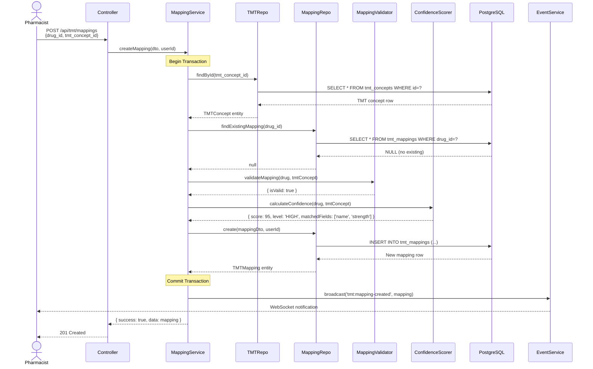
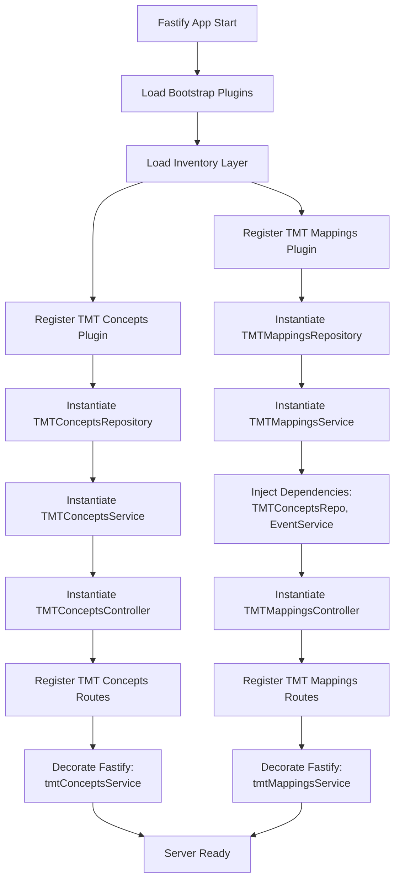

# Design Document: TMT Backend API

## Overview

The TMT Backend API is designed as a modular, maintainable RESTful service following the established AegisX platform patterns. This API provides:

1. **TMT Concepts Management** - Search and browse 76,904 Thai Medical Terminology concepts across 5 hierarchical levels
2. **Drug-to-TMT Mapping** - Create, update, and verify mappings between hospital drugs and TMT codes
3. **Compliance Tracking** - Real-time monitoring of TMT mapping coverage (target ≥95%)
4. **Ministry Export** - Generate DMSIC-compliant reports for Ministry of Public Health

**Design Philosophy:**

- **API-First Development**: TypeBox schemas define all request/response contracts before implementation
- **Domain-Driven Design**: Clear separation between master-data (TMT concepts) and operations (mappings)
- **Modular Architecture**: Plugin-based design for easy testing and maintenance
- **Performance-Optimized**: Redis caching for read-heavy TMT concept lookups

**Technology Stack:**

- **Framework**: Fastify (high-performance Node.js web framework)
- **Database**: PostgreSQL 14+ (`inventory` schema)
- **ORM**: Knex.js with BaseRepository pattern
- **Validation**: TypeBox (compile-time type safety + runtime validation)
- **Caching**: Redis (TMT concepts cache, TTL: 1 hour)
- **Authentication**: JWT with RBAC
- **Documentation**: Auto-generated OpenAPI/Swagger

## Steering Document Alignment

### Technical Standards (tech.md)

**Following Established Backend Patterns:**

1. **Fastify Plugin Pattern** (from `apps/api/src/layers/platform/users/users.plugin.ts`)
   - Plain async function (no `fp()` wrapper for leaf modules)
   - Dependency injection: Repository → Service → Controller
   - Lifecycle hooks for monitoring
   - Decorate Fastify instance for cross-plugin access

2. **TypeBox Schema-First Design** (from `apps/api/src/layers/platform/users/users.routes.ts`)
   - All routes defined with TypeBox schemas
   - Request validation (body, params, querystring)
   - Response type safety (200, 400, 401, 403, 404, 409, 500)
   - Auto-generated OpenAPI documentation via `SchemaRefs`

3. **BaseRepository Pattern** (from `apps/api/src/shared/repositories/base.repository.ts`)
   - Generic CRUD operations (findById, create, update, delete, list)
   - Pagination support (`BaseListQuery`, `PaginatedListResult`)
   - Search functionality across configurable fields
   - UUID validation with `smartValidateUUIDs`
   - Audit fields management (created_at, updated_at, created_by, updated_by)

4. **Authentication & Authorization** (from existing routes)
   - JWT authentication: `fastify.authenticate` preValidation hook
   - RBAC: `fastify.verifyPermission(resource, action)` hook
   - Role-based access control for Finance Manager, Pharmacist, Dept Head, Nurse

### Project Structure (structure.md)

**Following Layer-Based Organization:**

```
apps/api/src/
├── layers/
│   ├── inventory/                    # Inventory domain (NEW)
│   │   ├── master-data/              # TMT concepts (reference data)
│   │   │   └── tmt-concepts/
│   │   │       ├── tmt-concepts.plugin.ts
│   │   │       ├── tmt-concepts.routes.ts
│   │   │       ├── tmt-concepts.controller.ts
│   │   │       ├── tmt-concepts.service.ts
│   │   │       ├── tmt-concepts.repository.ts
│   │   │       ├── tmt-concepts.schemas.ts
│   │   │       └── index.ts
│   │   └── operations/               # TMT mappings (transactional)
│   │       └── tmt-mappings/
│   │           ├── tmt-mappings.plugin.ts
│   │           ├── tmt-mappings.routes.ts
│   │           ├── tmt-mappings.controller.ts
│   │           ├── tmt-mappings.service.ts
│   │           ├── tmt-mappings.repository.ts
│   │           ├── tmt-mappings.schemas.ts
│   │           ├── utils/
│   │           │   ├── confidence-scorer.ts  # AI confidence calculation
│   │           │   └── mapping-validator.ts  # Business rule validation
│   │           └── index.ts
│   ├── platform/                     # Existing platform features
│   └── core/                         # Existing core utilities
└── shared/
    └── repositories/
        └── base.repository.ts        # Reuse existing BaseRepository
```

**Domain Classification Rationale:**

Following `docs/architecture/DOMAIN_ARCHITECTURE_GUIDE.md`:

- **inventory/master-data/tmt-concepts**: TMT concepts are reference data (lookup tables)
  - ✅ Rarely change (Ministry updates quarterly)
  - ✅ Used in dropdown/select (search TMT for mapping)
  - ✅ Referenced by foreign key (`tmt_mappings.tmt_concept_id`)

- **inventory/operations/tmt-mappings**: Drug-TMT mappings are transactional
  - ✅ Created from user actions (pharmacist mapping drugs)
  - ✅ Have status changes (unverified → verified)
  - ✅ Reference master-data (`drug_id`, `tmt_concept_id`)

## Code Reuse Analysis

### Existing Components to Leverage

**1. BaseRepository** (`apps/api/src/shared/repositories/base.repository.ts`)

- **Reuse for**: TMTConceptsRepository, TMTMappingsRepository
- **Provides**:
  - `findById(id)` - Get TMT concept/mapping by ID
  - `list(query)` - Paginated list with search
  - `create(data, userId)` - Insert with audit fields
  - `update(id, data, userId)` - Update with audit fields
  - `delete(id)` - Soft/hard delete
  - UUID validation
  - Pagination metadata generation

**Example Extension:**

```typescript
export class TMTConceptsRepository extends BaseRepository<TMTConcept, CreateTMTConceptDto, UpdateTMTConceptDto> {
  constructor(knex: Knex) {
    super(
      knex,
      'tmt_concepts', // Table name
      ['preferred_term', 'fsn', 'concept_code'], // Search fields
      [], // UUID fields (none for this table)
      { hasCreatedBy: false, hasUpdatedBy: false }, // No audit fields (readonly data)
    );
  }

  // Add custom methods for TMT-specific queries
  async findByLevel(level: TMTLevel): Promise<TMTConcept[]> {
    return this.query().where({ level, is_active: true });
  }

  async getHierarchy(conceptId: bigint): Promise<TMTHierarchy> {
    // Custom query with recursive CTE for parent/child relationships
  }
}
```

**2. TypeBox Schema Patterns** (from `apps/api/src/layers/platform/users/`)

- **Reuse for**: TMT request/response schemas
- **Provides**:
  - `SchemaRefs.UuidParam` - UUID validation for `:id` params
  - `SchemaRefs.Unauthorized` - 401 error response
  - `SchemaRefs.Forbidden` - 403 error response
  - `SchemaRefs.NotFound` - 404 error response
  - `SchemaRefs.ValidationError` - 400/422 error response
  - `SchemaRefs.Conflict` - 409 error response
  - `SchemaRefs.ServerError` - 500 error response

**Example Usage:**

```typescript
// tmt-concepts.schemas.ts
export const TMTConceptSchemas = {
  'list-tmt-concepts-query': Type.Object({
    page: Type.Optional(Type.Integer({ minimum: 1 })),
    limit: Type.Optional(Type.Integer({ minimum: 1, maximum: 100 })),
    search: Type.Optional(Type.String({ minLength: 3 })),
    level: Type.Optional(Type.Enum(TMTLevel)),
  }),
  'list-tmt-concepts-response': Type.Object({
    success: Type.Boolean(),
    data: Type.Array(Type.Ref('TMTConcept')),
    pagination: Type.Ref('PaginationMeta'),
  }),
};
```

**3. Authentication Middleware** (from existing routes)

- **Reuse for**: All TMT endpoints
- **Provides**:
  - `fastify.authenticate` - JWT token validation
  - `fastify.verifyPermission(resource, action)` - RBAC check
- **Usage**: Add to `preValidation` array in routes

**4. EventService** (from WebSocket plugin)

- **Reuse for**: Real-time updates when mappings created/updated
- **Provides**: Broadcast events to connected clients
- **Usage**: `fastify.eventService.broadcast('tmt:mapping-created', data)`

### Integration Points

**1. Existing Database Schema** (`inventory` schema)

- **tmt_concepts table**: Already exists with 76,904 records
- **tmt_relationships table**: Parent-child hierarchy
- **drugs table**: Has `tmt_tpu_id` foreign key (existing mapping field)
- **Integration**: TMT Mappings will create entries linking `drugs.id` to `tmt_concepts.id`

**2. Master Data API** (future integration)

- **Integration Point**: Drugs API will include TMT mapping status
- **Endpoint**: `GET /api/inventory/drugs/:id` will return `tmt_mapping` object
- **Benefit**: Frontend can show TMT code when viewing drug details

**3. Ministry Reporting API** (future integration)

- **Integration Point**: DRUGLIST export will pull TMT code from mappings
- **Query**: Join `drugs` ← `tmt_mappings` ← `tmt_concepts`
- **Benefit**: Automated compliance reporting

**4. Redis Cache** (if available)

- **Integration Point**: Cache TMT concepts for faster search
- **Key Pattern**: `tmt:concepts:{level}:{page}`, `tmt:concept:{id}`
- **TTL**: 1 hour (TMT data rarely changes)

## Architecture

### Overall System Design

The TMT Backend API follows a **3-layer architecture** with clear separation of concerns:

```
┌─────────────────────────────────────────────────────────────┐
│                         Client Layer                        │
│  (Frontend, Postman, other services)                        │
└────────────────────────┬────────────────────────────────────┘
                         │ HTTP/REST
                         ↓
┌─────────────────────────────────────────────────────────────┐
│                    Presentation Layer                       │
│  ┌──────────────┐  ┌─────────────────┐  ┌────────────────┐ │
│  │   Routes     │→ │  Controllers    │→ │  TypeBox       │ │
│  │  (Fastify)   │  │  (HTTP I/O)     │  │  Validation    │ │
│  └──────────────┘  └─────────────────┘  └────────────────┘ │
│         │                   │                      │         │
│         └───────────────────┴──────────────────────┘         │
└────────────────────────┬────────────────────────────────────┘
                         │
                         ↓
┌─────────────────────────────────────────────────────────────┐
│                      Business Layer                         │
│  ┌──────────────────┐  ┌─────────────────────────────────┐ │
│  │    Services      │  │  Business Logic & Rules         │ │
│  │                  │  │  - Mapping validation           │ │
│  │  - TMTService    │  │  - Confidence scoring           │ │
│  │  - MappingService│  │  - Compliance calculation       │ │
│  └──────────────────┘  └─────────────────────────────────┘ │
└────────────────────────┬────────────────────────────────────┘
                         │
                         ↓
┌─────────────────────────────────────────────────────────────┐
│                       Data Layer                            │
│  ┌──────────────────┐  ┌─────────────────────────────────┐ │
│  │  Repositories    │  │  Database Access                │ │
│  │                  │  │  - CRUD operations              │ │
│  │  - TMTConceptRepo│  │  - Complex queries              │ │
│  │  - MappingRepo   │  │  - Transactions                 │ │
│  └────────┬─────────┘  └─────────────────────────────────┘ │
│           │                                                 │
│           └──────────────┐                                  │
└──────────────────────────┼──────────────────────────────────┘
                           │
                           ↓
                  ┌────────────────┐
                  │   PostgreSQL   │
                  │ (inventory DB) │
                  └────────────────┘
```

### Modular Design Principles

**1. Single File Responsibility**

- **Routes**: Only route definitions and schema references (no business logic)
- **Controllers**: Request/response mapping, input extraction, error handling
- **Services**: Business logic, orchestration, validation rules
- **Repositories**: Database queries only (no business logic)
- **Utilities**: Pure functions for specific tasks (confidence scoring, fuzzy search)

**2. Component Isolation**

- Each module (tmt-concepts, tmt-mappings) is self-contained
- No circular dependencies between modules
- Shared utilities in `utils/` folder

**3. Service Layer Separation**

```
┌────────────────────────────────────────────────────┐
│                 TMTConceptsService                 │
│  - searchConcepts(query, filters)                  │
│  - getConceptById(id)                              │
│  - getHierarchy(conceptId)                         │
│  - loadConceptsFromCSV(file)                       │
└────────────────────────────────────────────────────┘
                          ↓ uses
┌────────────────────────────────────────────────────┐
│              TMTConceptsRepository                 │
│  - findById(id)                                    │
│  - list(query)                                     │
│  - findByLevel(level)                              │
│  - getHierarchy(id) // recursive CTE               │
└────────────────────────────────────────────────────┘
```

**4. Utility Modularity**

**Confidence Scorer** (`utils/confidence-scorer.ts`):

```typescript
// Single responsibility: Calculate AI confidence score
export function calculateMappingConfidence(drug: Drug, tmtConcept: TMTConcept): { score: number; level: 'HIGH' | 'MEDIUM' | 'LOW'; matchedFields: string[] } {
  let score = 0;
  const matched: string[] = [];

  // Name similarity (50 points)
  if (similarityScore(drug.generic_name, tmtConcept.preferred_term) > 0.8) {
    score += 50;
    matched.push('name');
  }

  // Strength match (30 points)
  if (drug.strength === tmtConcept.strength) {
    score += 30;
    matched.push('strength');
  }

  // Dosage form match (20 points)
  if (drug.dosage_form === tmtConcept.dosage_form) {
    score += 20;
    matched.push('dosage_form');
  }

  const level = score >= 90 ? 'HIGH' : score >= 70 ? 'MEDIUM' : 'LOW';
  return { score, level, matchedFields: matched };
}
```

**Mapping Validator** (`utils/mapping-validator.ts`):

```typescript
// Single responsibility: Validate mapping business rules
export class MappingValidator {
  static validateMapping(drug: Drug, tmtConcept: TMTConcept): ValidationResult {
    const errors: string[] = [];

    // Rule 1: TMT level must be GP or TP (preferred)
    if (!['GP', 'TP', 'VTM'].includes(tmtConcept.level)) {
      errors.push(`Invalid TMT level: ${tmtConcept.level}. Prefer GP or TP.`);
    }

    // Rule 2: Concept must be active
    if (!tmtConcept.is_active) {
      errors.push('TMT concept is inactive');
    }

    // Rule 3: Drug must be active
    if (!drug.is_active) {
      errors.push('Drug is inactive');
    }

    return { isValid: errors.length === 0, errors };
  }
}
```

### Data Flow Architecture

**Sequence Diagram: Create Drug-TMT Mapping**



### Plugin Registration Flow



## Components and Interfaces

### Component 1: TMT Concepts Module

**Purpose**: Manage TMT concept data (search, browse, hierarchy navigation)

**File Structure**:

```
layers/inventory/master-data/tmt-concepts/
├── tmt-concepts.plugin.ts      # Plugin entry, DI setup
├── tmt-concepts.routes.ts      # Route definitions
├── tmt-concepts.controller.ts  # HTTP handlers
├── tmt-concepts.service.ts     # Business logic
├── tmt-concepts.repository.ts  # Database access
├── tmt-concepts.schemas.ts     # TypeBox schemas
└── index.ts                    # Module exports
```

**Public Interfaces**:

**TMTConceptsService**:

```typescript
class TMTConceptsService {
  // Search TMT concepts with fuzzy matching
  async searchConcepts(query: string, filters: { level?: TMTLevel; limit?: number }): Promise<TMTConcept[]>;

  // Get concept with full details
  async getConceptById(id: bigint): Promise<TMTConcept | null>;

  // Get hierarchical view (parent → current → children)
  async getHierarchy(conceptId: bigint): Promise<TMTHierarchy>;

  // Load concepts from Ministry CSV (admin only)
  async loadConceptsFromCSV(file: Buffer, userId: bigint): Promise<LoadResult>;
}
```

**TMTConceptsRepository** (extends BaseRepository):

```typescript
class TMTConceptsRepository extends BaseRepository<TMTConcept> {
  // Inherited from BaseRepository:
  // - findById(id)
  // - list(query) with pagination
  // - create(data)
  // - update(id, data)
  // - delete(id)

  // Custom TMT-specific queries:
  async findByLevel(level: TMTLevel): Promise<TMTConcept[]>;
  async getHierarchy(conceptId: bigint): Promise<{
    concept: TMTConcept;
    parents: TMTConcept[];
    children: TMTConcept[];
  }>;
  async bulkInsert(concepts: TMTConcept[]): Promise<number>;
}
```

**Dependencies**:

- Knex.js for database queries
- Redis (optional) for caching concepts
- CSV parser for data loading

**Reuses**:

- `BaseRepository` - CRUD operations, pagination
- `SchemaRefs` - Standard error responses
- `fastify.authenticate` - JWT auth

---

### Component 2: TMT Mappings Module

**Purpose**: Create, update, and verify drug-to-TMT mappings

**File Structure**:

```
layers/inventory/operations/tmt-mappings/
├── tmt-mappings.plugin.ts      # Plugin entry, DI setup
├── tmt-mappings.routes.ts      # Route definitions
├── tmt-mappings.controller.ts  # HTTP handlers
├── tmt-mappings.service.ts     # Business logic
├── tmt-mappings.repository.ts  # Database access
├── tmt-mappings.schemas.ts     # TypeBox schemas
├── utils/
│   ├── confidence-scorer.ts    # AI confidence calculation
│   └── mapping-validator.ts    # Business rule validation
└── index.ts                    # Module exports
```

**Public Interfaces**:

**TMTMappingsService**:

```typescript
class TMTMappingsService {
  // Create new drug-TMT mapping with validation
  async createMapping(dto: CreateMappingDto, userId: bigint): Promise<TMTMapping>;

  // Update existing mapping (e.g., change TMT concept)
  async updateMapping(id: bigint, dto: UpdateMappingDto, userId: bigint): Promise<TMTMapping | null>;

  // Delete mapping (soft delete)
  async deleteMapping(id: bigint, userId: bigint): Promise<boolean>;

  // Get mapping for specific drug
  async getMappingByDrugId(drugId: bigint): Promise<TMTMapping | null>;

  // AI-assisted suggestions for unmapped drugs
  async suggestMappings(drugId: bigint): Promise<Array<{ tmtConcept: TMTConcept; confidence: ConfidenceScore }>>;

  // Compliance monitoring
  async getComplianceReport(): Promise<ComplianceReport>;
  async getUnmappedDrugs(): Promise<Drug[]>;

  // Ministry export
  async generateMinistryExport(format: 'CSV' | 'XLSX' | 'JSON'): Promise<Buffer>;
}
```

**TMTMappingsRepository** (extends BaseRepository):

```typescript
class TMTMappingsRepository extends BaseRepository<TMTMapping> {
  // Inherited from BaseRepository:
  // - findById(id)
  // - list(query)
  // - create(data, userId)
  // - update(id, data, userId)
  // - delete(id)

  // Custom mapping-specific queries:
  async findByDrugId(drugId: bigint): Promise<TMTMapping | null>;
  async findUnmappedDrugs(): Promise<Drug[]>;
  async getComplianceStats(): Promise<{
    total: number;
    mapped: number;
    unmapped: number;
    rate: number;
  }>;
  async getMappingsByConfidence(level: 'HIGH' | 'MEDIUM' | 'LOW'): Promise<TMTMapping[]>;
}
```

**Dependencies**:

- `TMTConceptsRepository` - Validate TMT concept exists
- `EventService` - Real-time updates on mapping changes
- `ConfidenceScorer` - Calculate AI confidence scores
- `MappingValidator` - Validate business rules

**Reuses**:

- `BaseRepository` - CRUD + audit trails
- `SchemaRefs` - Standard error responses
- `fastify.authenticate`, `fastify.verifyPermission` - Auth/RBAC

---

### Component 3: Confidence Scorer (Utility)

**Purpose**: Calculate AI confidence score for drug-TMT matching

**File**: `layers/inventory/operations/tmt-mappings/utils/confidence-scorer.ts`

**Interface**:

```typescript
export interface ConfidenceScore {
  score: number; // 0-100
  level: 'HIGH' | 'MEDIUM' | 'LOW'; // HIGH: ≥90, MEDIUM: 70-89, LOW: <70
  matchedFields: string[]; // ['name', 'strength', 'dosage_form']
  breakdown: {
    nameScore: number; // 0-50
    strengthScore: number; // 0-30
    formScore: number; // 0-20
  };
}

export function calculateMappingConfidence(drug: { generic_name: string; strength: string; dosage_form: string }, tmtConcept: { preferred_term: string; strength: string; dosage_form: string }): ConfidenceScore;
```

**Algorithm**:

1. **Name Similarity (50 points)**: Use Levenshtein distance or trigram matching
2. **Strength Match (30 points)**: Exact match (e.g., "500mg" === "500mg")
3. **Dosage Form Match (20 points)**: Exact match (e.g., "Tablet" === "Tablet")

**Dependencies**: None (pure function)

**Reuses**: None (standalone utility)

---

### Component 4: Mapping Validator (Utility)

**Purpose**: Validate business rules for drug-TMT mappings

**File**: `layers/inventory/operations/tmt-mappings/utils/mapping-validator.ts`

**Interface**:

```typescript
export interface ValidationResult {
  isValid: boolean;
  errors: string[];
  warnings: string[];
}

export class MappingValidator {
  static validateMapping(drug: Drug, tmtConcept: TMTConcept): ValidationResult;
  static validateTMTLevel(level: TMTLevel): boolean;
  static checkDuplicateMapping(drugId: bigint, existingMapping: TMTMapping | null): ValidationResult;
}
```

**Validation Rules**:

1. TMT concept must exist and be active
2. Drug must exist and be active
3. TMT level should be GP or TP (warn if VTM or SUBS)
4. No duplicate mapping for same drug
5. Mapping must be verified by pharmacist

**Dependencies**: None (pure functions)

**Reuses**: None

## Data Models

### TMTConcept Model

```typescript
interface TMTConcept {
  id: bigint; // Primary key
  tmt_id: bigint; // Official TMT ID from ministry
  concept_code: string; // Concept code (e.g., "10028536")
  level: TMTLevel; // VTM | GP | GPU | TP | TPU
  fsn: string; // Fully Specified Name (English)
  preferred_term: string; // Preferred term (Thai)
  strength: string | null; // Drug strength (e.g., "500mg")
  dosage_form: string | null; // Dosage form (e.g., "Tablet")
  is_active: boolean; // Active status
  created_at: Date; // Timestamp (DB-managed)
  updated_at: Date; // Timestamp (DB-managed)

  // Relations (populated via joins)
  parent?: TMTConcept; // Parent concept
  children?: TMTConcept[]; // Child concepts
  _count?: {
    children: number;
    drug_mappings: number;
  };
}

enum TMTLevel {
  VTM = 'VTM', // Virtual Therapeutic Moiety
  GP = 'GP', // Generic Product (recommended)
  GPU = 'GPU', // Generic Product with Unit
  TP = 'TP', // Trade Product (recommended)
  TPU = 'TPU', // Trade Product with Unit
}
```

**TypeBox Schema**:

```typescript
export const TMTConceptSchema = Type.Object({
  id: Type.String(), // BigInt as string in JSON
  tmt_id: Type.String(),
  concept_code: Type.String(),
  level: Type.Enum(TMTLevel),
  fsn: Type.String(),
  preferred_term: Type.String(),
  strength: Type.Union([Type.String(), Type.Null()]),
  dosage_form: Type.Union([Type.String(), Type.Null()]),
  is_active: Type.Boolean(),
  created_at: Type.String({ format: 'date-time' }),
  updated_at: Type.String({ format: 'date-time' }),
});
```

---

### TMTMapping Model

```typescript
interface TMTMapping {
  id: bigint; // Primary key
  drug_id: bigint; // FK to drugs table
  tmt_concept_id: bigint; // FK to tmt_concepts table
  tmt_level: TMTLevel; // Mapped TMT level
  mapping_confidence: ConfidenceLevel; // HIGH | MEDIUM | LOW
  confidence_score: number; // 0-100
  matched_fields: string[]; // JSON array: ['name', 'strength']
  is_verified: boolean; // Pharmacist verification flag
  verified_by: bigint | null; // FK to users table
  verified_at: Date | null; // Verification timestamp
  notes: string | null; // Optional notes
  created_at: Date; // Creation timestamp
  updated_at: Date; // Last update timestamp
  created_by: bigint; // FK to users table
  updated_by: bigint | null; // FK to users table

  // Relations (populated via joins)
  drug?: Drug;
  tmt_concept?: TMTConcept;
  verified_by_user?: User;
}

enum ConfidenceLevel {
  HIGH = 'HIGH', // ≥90%
  MEDIUM = 'MEDIUM', // 70-89%
  LOW = 'LOW', // <70%
}
```

**TypeBox Schema**:

```typescript
export const TMTMappingSchema = Type.Object({
  id: Type.String(),
  drug_id: Type.String(),
  tmt_concept_id: Type.String(),
  tmt_level: Type.Enum(TMTLevel),
  mapping_confidence: Type.Enum(ConfidenceLevel),
  confidence_score: Type.Number({ minimum: 0, maximum: 100 }),
  matched_fields: Type.Array(Type.String()),
  is_verified: Type.Boolean(),
  verified_by: Type.Union([Type.String(), Type.Null()]),
  verified_at: Type.Union([Type.String({ format: 'date-time' }), Type.Null()]),
  notes: Type.Union([Type.String(), Type.Null()]),
  created_at: Type.String({ format: 'date-time' }),
  updated_at: Type.String({ format: 'date-time' }),
});
```

---

### ComplianceReport Model

```typescript
interface ComplianceReport {
  summary: {
    total_drugs: number;
    mapped_drugs: number;
    unmapped_drugs: number;
    coverage_percent: number; // (mapped / total) × 100
    is_compliant: boolean; // coverage_percent ≥ 95
  };

  by_confidence: {
    high: number;
    medium: number;
    low: number;
  };

  by_tmt_level: {
    VTM: number;
    GP: number;
    GPU: number;
    TP: number;
    TPU: number;
  };

  top_unmapped_drugs: Array<{
    drug_id: bigint;
    drug_code: string;
    trade_name: string;
    usage_count: number;
    days_unmapped: number;
    priority: 'HIGH' | 'MEDIUM' | 'LOW';
  }>;

  recent_mappings: Array<{
    drug_id: bigint;
    drug_name: string;
    tmt_code: string;
    mapped_at: Date;
    mapped_by: string;
  }>;

  generated_at: Date;
}
```

## Error Handling

### Error Scenarios

**1. TMT Concept Not Found**

- **Scenario**: User requests concept with invalid ID
- **Handling**:
  ```typescript
  if (!concept) {
    throw new NotFoundError({
      code: 'TMT_CONCEPT_NOT_FOUND',
      message: 'ไม่พบรหัส TMT',
      message_en: 'TMT concept not found',
      details: { tmt_concept_id: id },
    });
  }
  ```
- **HTTP Status**: 404
- **User Impact**: Error message displayed, can retry with correct ID

**2. Duplicate Mapping**

- **Scenario**: User tries to map a drug that already has TMT mapping
- **Handling**:
  ```typescript
  const existing = await this.mappingRepo.findByDrugId(dto.drug_id);
  if (existing) {
    throw new ConflictError({
      code: 'MAPPING_EXISTS',
      message: 'ยานี้มีการ map TMT แล้ว',
      message_en: 'Drug already has TMT mapping',
      details: {
        drug_id: dto.drug_id,
        existing_mapping_id: existing.id,
        existing_tmt_code: existing.tmt_concept.concept_code,
      },
      suggestion: 'ใช้ PUT /api/tmt/mappings/:id เพื่ออัปเดตแทน',
    });
  }
  ```
- **HTTP Status**: 409 Conflict
- **User Impact**: Error message + suggestion to update instead

**3. Invalid TMT Level**

- **Scenario**: User selects TMT concept at wrong hierarchy level (e.g., SUBS)
- **Handling**:
  ```typescript
  if (!['VTM', 'GP', 'GPU', 'TP', 'TPU'].includes(concept.level)) {
    throw new ValidationError({
      code: 'INVALID_TMT_LEVEL',
      message: 'ระดับ TMT ไม่ถูกต้อง',
      message_en: 'Invalid TMT level',
      details: {
        current_level: concept.level,
        allowed_levels: ['VTM', 'GP', 'GPU', 'TP', 'TPU'],
      },
    });
  }
  ```
- **HTTP Status**: 400 Bad Request
- **User Impact**: Error message with allowed levels

**4. Unauthorized Access**

- **Scenario**: Nurse tries to create mapping (requires Pharmacist role)
- **Handling**: Via `fastify.verifyPermission` middleware
  ```typescript
  preValidation: [
    fastify.authenticate,
    fastify.verifyPermission('tmt', 'create'), // Checks user.role
  ];
  ```
- **HTTP Status**: 403 Forbidden
- **User Impact**: "คุณไม่มีสิทธิ์ในการดำเนินการนี้ (Pharmacist only)"

**5. Database Transaction Failure**

- **Scenario**: Database error during mapping creation (e.g., network issue)
- **Handling**:
  ```typescript
  try {
    await knex.transaction(async (trx) => {
      // Validate TMT concept exists
      // Check for duplicate
      // Insert mapping
      // Broadcast event
    });
  } catch (error) {
    logger.error('Failed to create mapping', { error, dto });
    throw new ServerError({
      code: 'MAPPING_CREATE_FAILED',
      message: 'ไม่สามารถบันทึกการ map ได้',
      message_en: 'Failed to create mapping',
      details: { error: error.message },
    });
  }
  ```
- **HTTP Status**: 500 Internal Server Error
- **User Impact**: Generic error message, admin notified via logs

**6. CSV Load Validation Failure**

- **Scenario**: Admin uploads invalid CSV file (missing columns, wrong format)
- **Handling**:

  ```typescript
  const requiredColumns = ['TMT_ID', 'CONCEPT_CODE', 'LEVEL', 'FSN', 'PREFERRED_TERM_TH'];
  const missingColumns = requiredColumns.filter((col) => !csvHeaders.includes(col));

  if (missingColumns.length > 0) {
    throw new ValidationError({
      code: 'INVALID_CSV_FORMAT',
      message: 'ไฟล์ CSV ไม่ถูกต้อง',
      message_en: 'Invalid CSV format',
      details: {
        missing_columns: missingColumns,
        required_columns: requiredColumns,
      },
    });
  }
  ```

- **HTTP Status**: 400 Bad Request
- **User Impact**: Error message with missing columns list

## Testing Strategy

### Unit Testing

**Tools**: Jest, @fast​ify/testing

**Approach**:

- Test each component in isolation with mocked dependencies
- Focus on business logic in Services and Utilities
- Aim for ≥80% code coverage

**Key Components to Test**:

**1. TMTConceptsService** (10 tests)

```typescript
describe('TMTConceptsService', () => {
  let service: TMTConceptsService;
  let mockRepo: jest.Mocked<TMTConceptsRepository>;

  beforeEach(() => {
    mockRepo = createMockRepository();
    service = new TMTConceptsService(mockRepo);
  });

  it('should search concepts by name', async () => {
    mockRepo.list.mockResolvedValue({
      data: [mockTMTConcept1, mockTMTConcept2],
      total: 2,
    });

    const result = await service.searchConcepts('Paracetamol', { level: 'GP' });

    expect(result.data).toHaveLength(2);
    expect(mockRepo.list).toHaveBeenCalledWith({
      search: 'Paracetamol',
      level: 'GP',
    });
  });

  it('should throw NotFoundError if concept not found', async () => {
    mockRepo.findById.mockResolvedValue(null);

    await expect(service.getConceptById(999n)).rejects.toThrow(NotFoundError);
  });

  // ... 8 more tests
});
```

**2. TMTMappingsService** (15 tests)

```typescript
describe('TMTMappingsService', () => {
  // Test createMapping validation
  it('should reject duplicate mapping', async () => {
    mockMappingRepo.findByDrugId.mockResolvedValue(existingMapping);

    await expect(service.createMapping(dto, userId)).rejects.toThrow(ConflictError);
  });

  // Test confidence scoring integration
  it('should calculate confidence score on creation', async () => {
    const result = await service.createMapping(dto, userId);

    expect(result.confidence_score).toBeGreaterThan(0);
    expect(result.mapping_confidence).toBe('HIGH');
  });

  // Test compliance calculation
  it('should calculate correct compliance rate', async () => {
    mockMappingRepo.getComplianceStats.mockResolvedValue({
      total: 1000,
      mapped: 950,
      unmapped: 50,
      rate: 95.0,
    });

    const report = await service.getComplianceReport();

    expect(report.summary.is_compliant).toBe(true);
  });

  // ... 12 more tests
});
```

**3. ConfidenceScorer** (8 tests)

```typescript
describe('ConfidenceScorer', () => {
  it('should return HIGH confidence for exact match', () => {
    const drug = { generic_name: 'Paracetamol', strength: '500mg', dosage_form: 'Tablet' };
    const tmt = { preferred_term: 'Paracetamol', strength: '500mg', dosage_form: 'Tablet' };

    const result = calculateMappingConfidence(drug, tmt);

    expect(result.score).toBe(100);
    expect(result.level).toBe('HIGH');
    expect(result.matchedFields).toEqual(['name', 'strength', 'dosage_form']);
  });

  it('should return LOW confidence for name mismatch', () => {
    const drug = { generic_name: 'Aspirin', strength: '100mg', dosage_form: 'Tablet' };
    const tmt = { preferred_term: 'Paracetamol', strength: '100mg', dosage_form: 'Tablet' };

    const result = calculateMappingConfidence(drug, tmt);

    expect(result.score).toBeLessThan(70);
    expect(result.level).toBe('LOW');
  });

  // ... 6 more tests
});
```

**4. MappingValidator** (6 tests)

```typescript
describe('MappingValidator', () => {
  it('should validate TMT level restrictions', () => {
    const result = MappingValidator.validateTMTLevel('SUBS');

    expect(result.isValid).toBe(false);
    expect(result.errors).toContain('Invalid TMT level: SUBS. Prefer GP or TP.');
  });

  // ... 5 more tests
});
```

---

### Integration Testing

**Tools**: Supertest, test database (PostgreSQL)

**Approach**:

- Test full API flows with real database (test schema)
- Test authentication and authorization
- Test error handling and edge cases

**Key Flows to Test**:

**1. TMT Concepts Search Flow** (5 tests)

```typescript
describe('GET /api/tmt/concepts/search', () => {
  it('should search concepts with authentication', async () => {
    const response = await request(app).get('/api/tmt/concepts/search?q=Paracetamol&level=GP').set('Authorization', `Bearer ${pharmacistToken}`);

    expect(response.status).toBe(200);
    expect(response.body.success).toBe(true);
    expect(response.body.data.length).toBeGreaterThan(0);
  });

  it('should return 401 without token', async () => {
    const response = await request(app).get('/api/tmt/concepts/search?q=Paracetamol');

    expect(response.status).toBe(401);
  });

  // ... 3 more tests
});
```

**2. Create Mapping Flow** (8 tests)

```typescript
describe('POST /api/tmt/mappings', () => {
  it('should create mapping with valid data', async () => {
    const response = await request(app).post('/api/tmt/mappings').set('Authorization', `Bearer ${pharmacistToken}`).send({
      drug_id: '123',
      tmt_concept_id: '456',
    });

    expect(response.status).toBe(201);
    expect(response.body.data.is_verified).toBe(true);
    expect(response.body.data.confidence_score).toBeGreaterThan(0);
  });

  it('should reject duplicate mapping', async () => {
    // Create first mapping
    await createMapping(drugId, tmtConceptId);

    // Try to create duplicate
    const response = await request(app).post('/api/tmt/mappings').set('Authorization', `Bearer ${pharmacistToken}`).send({ drug_id: drugId, tmt_concept_id: tmtConceptId });

    expect(response.status).toBe(409);
    expect(response.body.error.code).toBe('MAPPING_EXISTS');
  });

  it('should enforce Pharmacist role', async () => {
    const response = await request(app)
      .post('/api/tmt/mappings')
      .set('Authorization', `Bearer ${nurseToken}`) // Nurse can't create
      .send({ drug_id: '123', tmt_concept_id: '456' });

    expect(response.status).toBe(403);
  });

  // ... 5 more tests
});
```

**3. Compliance Report Flow** (4 tests)

```typescript
describe('GET /api/tmt/coverage-report', () => {
  beforeEach(async () => {
    // Seed test data: 1000 drugs, 950 mapped
    await seedTestData();
  });

  it('should calculate compliance rate correctly', async () => {
    const response = await request(app).get('/api/tmt/coverage-report').set('Authorization', `Bearer ${financeManagerToken}`);

    expect(response.status).toBe(200);
    expect(response.body.data.summary.total_drugs).toBe(1000);
    expect(response.body.data.summary.mapped_drugs).toBe(950);
    expect(response.body.data.summary.coverage_percent).toBe(95.0);
    expect(response.body.data.summary.is_compliant).toBe(true);
  });

  // ... 3 more tests
});
```

---

### End-to-End Testing

**Tools**: Playwright (frontend E2E), Supertest (API E2E)

**Approach**:

- Test complete user scenarios from frontend to database
- Test real-world workflows (pharmacist mapping drugs)
- Test cross-module integration (TMT + Drugs + Users)

**User Scenarios to Test**:

**Scenario 1: Pharmacist Maps Unmapped Drug** (E2E)

```typescript
test('Pharmacist can map unmapped drug to TMT concept', async ({ page }) => {
  // 1. Login as pharmacist
  await page.goto('/login');
  await page.fill('#username', 'pharmacist@hospital.com');
  await page.fill('#password', 'password123');
  await page.click('button[type=submit]');

  // 2. Navigate to TMT Mapping page
  await page.click('text=TMT Mapping');
  await expect(page).toHaveURL('/tmt/mapping');

  // 3. Search for unmapped drug
  await page.fill('#drug-search', 'Paracetamol 500mg');
  await page.click('button:text("Search")');
  await page.click('text=Tylenol 500mg Tablet');

  // 4. System shows TMT search dialog
  await expect(page.locator('.tmt-search-dialog')).toBeVisible();

  // 5. Search TMT concepts
  await page.fill('#tmt-search', 'Paracetamol 500');
  await page.selectOption('#tmt-level', 'GP');

  // 6. System shows AI suggestions
  await expect(page.locator('.suggestion-badge:text("95% HIGH")')).toBeVisible();

  // 7. Select top suggestion
  await page.click('.suggestion-item:first-child');

  // 8. Verify mapping details
  await expect(page.locator('#tmt-code')).toHaveValue('10028536');
  await expect(page.locator('#tmt-level')).toHaveValue('GP');

  // 9. Verify and save
  await page.check('#verify-mapping');
  await page.click('button:text("Save Mapping")');

  // 10. System shows success + updated compliance
  await expect(page.locator('.success-message')).toContainText('✅ Mapped');
  await expect(page.locator('.compliance-rate')).toContainText('96.5%');
});
```

**Scenario 2: Finance Manager Exports Ministry Report** (E2E)

```typescript
test('Finance Manager can export ministry report', async ({ page }) => {
  // 1. Login as finance manager
  await loginAs(page, 'finance@hospital.com');

  // 2. Navigate to Compliance Dashboard
  await page.click('text=TMT Compliance');

  // 3. View compliance summary
  await expect(page.locator('.compliance-rate')).toContainText('96.5%');
  await expect(page.locator('.compliant-badge')).toHaveText('✓ COMPLIANT');

  // 4. Generate ministry export
  await page.click('button:text("Generate Ministry Report")');
  await page.selectOption('#export-format', 'XLSX');
  await page.click('button:text("Download")');

  // 5. Verify download started
  const [download] = await Promise.all([page.waitForEvent('download')]);

  expect(download.suggestedFilename()).toMatch(/DRUGLIST_.*\.xlsx/);
});
```

**Scenario 3: Compliance Tracking Over Time** (Integration)

```typescript
test('System tracks compliance rate changes over time', async () => {
  // 1. Initial state: 561 mapped (47.99%)
  let report = await getTMTComplianceReport(app, token);
  expect(report.summary.coverage_percent).toBe(47.99);

  // 2. Map 100 more drugs
  for (let i = 0; i < 100; i++) {
    await createMapping(app, token, unmappedDrugs[i].id, suggestedTMT[i].id);
  }

  // 3. Check updated compliance
  report = await getTMTComplianceReport(app, token);
  expect(report.summary.mapped_drugs).toBe(661);
  expect(report.summary.coverage_percent).toBeGreaterThan(56);

  // 4. Verify trend data
  const trend = await getTMTComplianceTrend(app, token, { months: 6 });
  expect(trend.data[trend.data.length - 1].rate).toBe(report.summary.coverage_percent);
});
```

**Cross-Module Integration Test**: TMT + Drugs + Users

```typescript
test('TMT mapping reflects in drug details API', async () => {
  // 1. Create mapping
  const mapping = await createMapping(app, pharmacistToken, drugId, tmtConceptId);

  // 2. Fetch drug details (from Drugs API)
  const drugResponse = await request(app).get(`/api/inventory/drugs/${drugId}`).set('Authorization', `Bearer ${pharmacistToken}`);

  // 3. Verify TMT mapping included
  expect(drugResponse.body.data.tmt_mapping).toBeDefined();
  expect(drugResponse.body.data.tmt_mapping.tmt_code).toBe('10028536');
  expect(drugResponse.body.data.tmt_mapping.verified_by.name).toBe('John Pharmacist');
});
```

---

## Summary

This design provides a solid foundation for the TMT Backend API with:

✅ **Modular Architecture**: Clear separation of concerns (Repository → Service → Controller)
✅ **Reusable Components**: Leverages BaseRepository, TypeBox schemas, existing auth
✅ **Domain-Driven Structure**: Proper classification (master-data vs operations)
✅ **Comprehensive Error Handling**: User-friendly Thai/English messages
✅ **Testable Design**: Unit, integration, and E2E test strategies
✅ **Performance Optimized**: Redis caching, pagination, indexed queries
✅ **Ministry Compliant**: Supports DMSIC Standards พ.ศ. 2568 reporting
