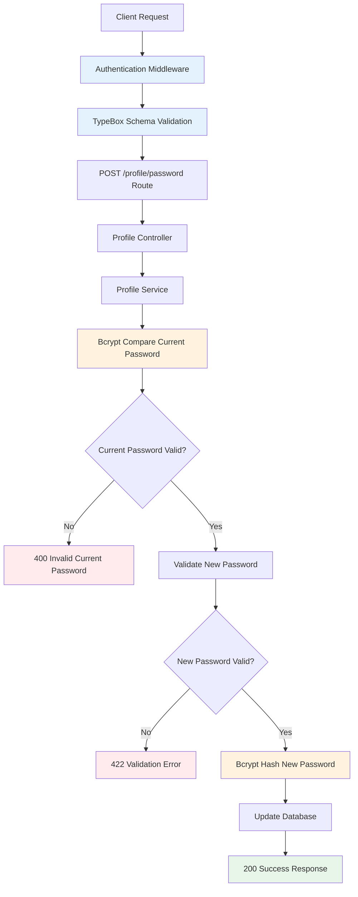

# Design Document

## Overview

This design implements a secure password change endpoint for the User Profile API, completing the API contract and adding comprehensive error handling. The implementation follows the project's established patterns using TypeBox schemas, Fastify routes, and bcrypt password hashing.

**Goals:**

1. Add POST `/api/profile/password` endpoint with secure password handling
2. Complete API contract documentation for all existing endpoints
3. Standardize error response schemas across all user profile endpoints

**Architecture Context:**

- **Layer:** Platform (apps/api/src/layers/platform/user-profile/)
- **Integration:** Extends existing user-profile feature
- **Dependencies:** Existing authentication system, TypeBox schemas, bcrypt hashing

## Steering Document Alignment

### Technical Standards (tech.md)

**API-First Development:**

- Design follows documented API contract in `docs/features/user-profile/api-contracts.md`
- TypeBox schemas define strict validation rules
- All endpoints return standardized response format

**TypeBox Schema Standard:**

- All request/response bodies validated with TypeBox
- Schemas export Static types for TypeScript safety
- Follows pattern: Schema → Type Export → Route → Controller

**Security Standards:**

- JWT authentication via `preValidation: [fastify.authenticate]`
- Password hashing with bcrypt (salt rounds >= 10)
- No passwords in logs or error messages
- Current password verification before allowing change

### Project Structure (structure.md)

**File Organization:**

```
apps/api/src/layers/platform/user-profile/
├── schemas/
│   └── profile.schemas.ts       (Add ChangePasswordSchema)
├── controllers/
│   └── profile.controller.ts    (Add changePassword method)
├── routes/
│   └── profile.routes.ts        (Add POST /password route)
└── services/
    └── profile.service.ts       (Add password change logic)
```

**Documentation:**

```
docs/features/user-profile/
└── api-contracts.md             (Update with missing endpoints)
```

## Code Reuse Analysis

### Existing Components to Leverage

- **ApiSuccessResponseSchema**: Standard success response wrapper
  - Location: `apps/api/src/schemas/base.schemas.ts`
  - Usage: Wrap password change success response

- **Error Response Schemas**: Comprehensive error handling
  - `ValidationErrorResponseSchema` (400) - For validation errors
  - `UnauthorizedResponseSchema` (401) - For auth failures
  - `UnprocessableEntityResponseSchema` (422) - For business rule violations
  - Location: `apps/api/src/schemas/base.schemas.ts`
  - Usage: Add to all user profile endpoint responses

- **Authentication Middleware**: JWT token validation
  - `fastify.authenticate` preValidation hook
  - Location: `apps/api/src/core/auth/strategies/auth.strategies.ts`
  - Usage: Protect password change endpoint

- **Profile Schema Pattern**: Existing TypeBox schemas
  - Location: `apps/api/src/layers/platform/user-profile/schemas/profile.schemas.ts`
  - Pattern: Schema definition → Static type export → Route schema → Controller type
  - Usage: Create ChangePasswordSchema following same pattern

### Integration Points

- **User Database Table**: Existing users table with password field
  - Schema includes: `password_hash` column (bcrypt hashed)
  - No migration needed - using existing column

- **Profile Controller**: Existing controller structure
  - Location: `apps/api/src/layers/platform/user-profile/controllers/profile.controller.ts`
  - Extension: Add `changePassword()` method

- **Profile Routes**: Existing routes registration
  - Location: `apps/api/src/layers/platform/user-profile/routes/profile.routes.ts`
  - Extension: Add POST `/password` route

- **Bcrypt Service**: Existing password hashing utility
  - Likely location: Auth utilities or user service
  - Usage: Hash new password, compare current password

## Architecture

### Modular Design Principles

- **Single File Responsibility**:
  - `profile.schemas.ts` - Schema definitions only
  - `profile.controller.ts` - Request/response handling only
  - `profile.service.ts` - Business logic and data access only
  - `profile.routes.ts` - Route registration only

- **Component Isolation**:
  - Password validation logic isolated in schema
  - Password hashing isolated in service layer
  - Authentication isolated in middleware

- **Service Layer Separation**:
  - **Routes Layer**: Register endpoints, attach schemas
  - **Controller Layer**: Extract request data, call service, format response
  - **Service Layer**: Validate business rules, interact with database
  - **Repository Layer**: Database queries (if exists)



### Request Flow

1. **Client sends request** → POST `/api/profile/password`

   ```json
   {
     "currentPassword": "oldpass123",
     "newPassword": "newpass456",
     "confirmPassword": "newpass456"
   }
   ```

2. **Authentication** → JWT validation via `fastify.authenticate`

3. **Schema Validation** → TypeBox validates:
   - All fields present
   - Minimum lengths
   - Passwords match (custom validation)

4. **Controller** → Extracts user ID from JWT, calls service

5. **Service Layer**:
   - Fetch user from database
   - Compare `currentPassword` with stored hash using bcrypt
   - If invalid → Return 400 error
   - If valid → Hash `newPassword` and update database

6. **Response** → Return success or error

## Components and Interfaces

### Component 1: ChangePasswordSchema (TypeBox Schema)

- **Purpose:** Define and validate password change request structure
- **Location:** `apps/api/src/layers/platform/user-profile/schemas/profile.schemas.ts`
- **Interfaces:**

  ```typescript
  export const ChangePasswordSchema = Type.Object({
    currentPassword: Type.String({ minLength: 1 }),
    newPassword: Type.String({ minLength: 8, maxLength: 128 }),
    confirmPassword: Type.String({ minLength: 8, maxLength: 128 }),
  });

  export type ChangePassword = Static<typeof ChangePasswordSchema>;
  ```

- **Dependencies:** `@sinclair/typebox`
- **Reuses:** TypeBox pattern from existing profile schemas

**Validation Rules:**

- `currentPassword`: Required, non-empty
- `newPassword`: 8-128 characters
- `confirmPassword`: Must match `newPassword` (enforced in service layer)

---

### Component 2: ChangePasswordResponseSchema

- **Purpose:** Define success response structure
- **Location:** `apps/api/src/layers/platform/user-profile/schemas/profile.schemas.ts`
- **Interfaces:**

  ```typescript
  export const ChangePasswordResponseSchema = ApiSuccessResponseSchema(
    Type.Object({
      message: Type.String(),
      changedAt: Type.String({ format: 'date-time' }),
    }),
  );

  export type ChangePasswordResponse = Static<typeof ChangePasswordResponseSchema>;
  ```

- **Dependencies:** `ApiSuccessResponseSchema` from base.schemas.ts
- **Reuses:** Standard response wrapper pattern

**Response Format:**

```json
{
  "success": true,
  "data": {
    "message": "Password changed successfully",
    "changedAt": "2025-12-16T16:00:00Z"
  }
}
```

---

### Component 3: Password Change Route

- **Purpose:** Register POST `/password` endpoint with schemas
- **Location:** `apps/api/src/layers/platform/user-profile/routes/profile.routes.ts`
- **Interfaces:**
  ```typescript
  fastify.post(
    '/password',
    {
      preValidation: [fastify.authenticate],
      schema: {
        description: 'Change user password',
        tags: ['User Profile'],
        summary: 'Change current user password',
        security: [{ bearerAuth: [] }],
        body: ChangePasswordSchema,
        response: {
          200: ChangePasswordResponseSchema,
          400: ValidationErrorResponseSchema,
          401: UnauthorizedResponseSchema,
          422: UnprocessableEntityResponseSchema,
        },
      },
    },
    handler,
  );
  ```
- **Dependencies:**
  - `ChangePasswordSchema`
  - Error response schemas from base.schemas.ts
  - `fastify.authenticate` middleware
- **Reuses:** Existing route registration pattern

---

### Component 4: Profile Controller - changePassword Method

- **Purpose:** Handle password change request/response
- **Location:** `apps/api/src/layers/platform/user-profile/controllers/profile.controller.ts`
- **Interfaces:**

  ```typescript
  async changePassword(
    req: FastifyRequest<{ Body: ChangePassword }>,
    reply: FastifyReply
  ): Promise<void> {
    const userId = req.user.id; // From JWT
    const { currentPassword, newPassword, confirmPassword } = req.body;

    // Delegate to service
    const result = await this.profileService.changePassword(
      userId,
      currentPassword,
      newPassword,
      confirmPassword
    );

    return reply.code(200).send(result);
  }
  ```

- **Dependencies:**
  - ProfileService
  - FastifyRequest, FastifyReply
- **Reuses:** Existing controller pattern

---

### Component 5: Profile Service - changePassword Method

- **Purpose:** Business logic for password change
- **Location:** `apps/api/src/layers/platform/user-profile/services/profile.service.ts`
- **Interfaces:**

  ```typescript
  async changePassword(
    userId: string,
    currentPassword: string,
    newPassword: string,
    confirmPassword: string
  ): Promise<ChangePasswordResponse> {
    // 1. Validate passwords match
    if (newPassword !== confirmPassword) {
      throw new UnprocessableEntityError('Passwords do not match');
    }

    // 2. Fetch user
    const user = await this.userRepository.findById(userId);
    if (!user) {
      throw new NotFoundError('User not found');
    }

    // 3. Verify current password
    const isValid = await bcrypt.compare(currentPassword, user.password_hash);
    if (!isValid) {
      throw new ValidationError('Current password is incorrect');
    }

    // 4. Hash new password
    const newHash = await bcrypt.hash(newPassword, 12); // Salt rounds: 12

    // 5. Update database
    await this.userRepository.updatePassword(userId, newHash);

    // 6. Return success
    return {
      success: true,
      data: {
        message: 'Password changed successfully',
        changedAt: new Date().toISOString(),
      },
    };
  }
  ```

- **Dependencies:**
  - bcrypt
  - UserRepository
  - Custom error classes
- **Reuses:** Existing service pattern, bcrypt hashing

---

### Component 6: API Contract Documentation Updates

- **Purpose:** Document all endpoints including password change
- **Location:** `docs/features/user-profile/api-contracts.md`
- **Content:**
  - Add POST `/api/profile/password` documentation
  - Add GET `/api/profile/activity` documentation
  - Add DELETE `/api/profile` documentation
  - Update all endpoints with complete error schemas

## Data Models

### ChangePassword Request Model

```typescript
{
  currentPassword: string; // Current password (required, non-empty)
  newPassword: string; // New password (8-128 chars)
  confirmPassword: string; // Must match newPassword
}
```

**Validation:**

- `currentPassword`: Required
- `newPassword`: Min 8 characters, max 128
- `confirmPassword`: Must equal `newPassword`
- Current password must match database hash
- New password must meet strength requirements (enforced by length)

### ChangePassword Response Model

```typescript
{
  success: true;
  data: {
    message: string; // "Password changed successfully"
    changedAt: string; // ISO 8601 timestamp
  }
}
```

### Error Response Models

**400 Bad Request - Invalid Current Password:**

```typescript
{
  success: false;
  error: {
    code: 'VALIDATION_ERROR';
    message: 'Current password is incorrect';
    statusCode: 400;
  }
}
```

**422 Unprocessable Entity - Validation Failure:**

```typescript
{
  success: false;
  error: {
    code: 'PASSWORDS_DO_NOT_MATCH';
    message: 'New password and confirm password do not match';
    statusCode: 422;
  }
}
```

**401 Unauthorized:**

```typescript
{
  success: false;
  error: {
    code: 'UNAUTHORIZED';
    message: 'Authentication required';
    statusCode: 401;
  }
}
```

## Error Handling

### Error Scenarios

#### 1. Missing or Invalid JWT Token

- **Handling:** `fastify.authenticate` middleware returns 401
- **Response:** UnauthorizedResponseSchema
- **User Impact:** User redirected to login

#### 2. Schema Validation Failure

- **Handling:** TypeBox validation rejects request before reaching controller
- **Response:** ValidationErrorResponseSchema (400)
- **Examples:**
  - Missing required fields
  - Password too short (< 8 chars)
  - Invalid field types
- **User Impact:** Clear validation message returned

#### 3. Current Password Incorrect

- **Handling:** Service compares current password with hash, throws ValidationError if mismatch
- **Response:** 400 with message "Current password is incorrect"
- **User Impact:** User informed to check current password
- **Security:** No indication whether user exists

#### 4. Passwords Do Not Match

- **Handling:** Service validates `newPassword === confirmPassword`, throws error if mismatch
- **Response:** 422 with message "Passwords do not match"
- **User Impact:** User corrects confirmation password

#### 5. User Not Found

- **Handling:** Service cannot find user by ID from JWT
- **Response:** 404 NotFoundError
- **User Impact:** Rare - indicates data inconsistency, user re-authenticates
- **Note:** Should rarely occur if JWT is valid

#### 6. Database Error

- **Handling:** Service catches database errors, logs, returns generic 500 error
- **Response:** ServerErrorResponseSchema
- **User Impact:** "An unexpected error occurred" message
- **Logging:** Full error logged for debugging

#### 7. Bcrypt Hashing Failure

- **Handling:** Service catches hashing errors, returns 500
- **Response:** ServerErrorResponseSchema
- **User Impact:** Generic error message
- **Logging:** Error logged with context

### Error Response Standardization

All user profile endpoints will be updated to include these error schemas:

```typescript
response: {
  200: SuccessSchema,
  400: ValidationErrorResponseSchema,
  401: UnauthorizedResponseSchema,
  404: NotFoundResponseSchema,          // For :id routes
  422: UnprocessableEntityResponseSchema,
  500: ServerErrorResponseSchema,
}
```

**Endpoints to update:**

- GET `/profile`
- PUT `/profile`
- POST `/avatar`
- DELETE `/avatar`
- GET `/preferences`
- PUT `/preferences`
- GET `/activity` (if documented)
- DELETE `/profile` (if documented)

## Testing Strategy

### Unit Testing

**Test File:** `apps/api/src/layers/platform/user-profile/services/__tests__/profile.service.test.ts`

**Test Cases:**

1. **changePassword - Success**
   - Given: Valid current password, valid new password
   - When: changePassword called
   - Then: Password hash updated in database, success response returned

2. **changePassword - Invalid Current Password**
   - Given: Wrong current password
   - When: changePassword called
   - Then: ValidationError thrown with "Current password is incorrect"

3. **changePassword - Passwords Do Not Match**
   - Given: newPassword !== confirmPassword
   - When: changePassword called
   - Then: UnprocessableEntityError thrown

4. **changePassword - User Not Found**
   - Given: Non-existent user ID
   - When: changePassword called
   - Then: NotFoundError thrown

5. **changePassword - Bcrypt Hashing Success**
   - Given: Valid inputs
   - When: changePassword called
   - Then: bcrypt.hash called with salt rounds = 12

6. **changePassword - Weak Password Rejected by Schema**
   - Given: Password < 8 characters
   - When: Schema validation runs
   - Then: ValidationError thrown before reaching service

**Mocks:**

- Mock UserRepository (findById, updatePassword)
- Mock bcrypt (compare, hash)

---

### Integration Testing

**Test File:** `apps/api/src/layers/platform/user-profile/__tests__/password-change.integration.test.ts`

**Test Cases:**

1. **POST /profile/password - Success (200)**
   - Given: Authenticated user, valid request body
   - When: POST /api/profile/password
   - Then: 200 response, password updated in database

2. **POST /profile/password - Missing Authentication (401)**
   - Given: No JWT token
   - When: POST /api/profile/password
   - Then: 401 UnauthorizedResponse

3. **POST /profile/password - Invalid Current Password (400)**
   - Given: Wrong currentPassword
   - When: POST /api/profile/password
   - Then: 400 ValidationErrorResponse

4. **POST /profile/password - Passwords Do Not Match (422)**
   - Given: newPassword !== confirmPassword
   - When: POST /api/profile/password
   - Then: 422 UnprocessableEntityResponse

5. **POST /profile/password - Password Too Short (400)**
   - Given: newPassword length < 8
   - When: POST /api/profile/password
   - Then: 400 ValidationErrorResponse from TypeBox

6. **POST /profile/password - Missing Required Fields (400)**
   - Given: Missing currentPassword or newPassword
   - When: POST /api/profile/password
   - Then: 400 ValidationErrorResponse

**Setup:**

- Create test user in database
- Generate valid JWT token for test user
- Clean up test data after each test

---

### End-to-End Testing

**Test File:** `apps/api/e2e/__tests__/user-profile-password.e2e.test.ts`

**Test Scenarios:**

1. **Complete Password Change Flow**
   - Given: User logged in via frontend
   - When: User navigates to profile settings, changes password
   - Then: Password updated, user can login with new password

2. **Error Handling Flow**
   - Given: User enters wrong current password
   - When: User submits form
   - Then: Error message displayed, password not changed

3. **Security Validation**
   - Given: User attempts to reuse old password
   - When: User submits form
   - Then: Warning displayed (if implemented) or allowed (if not implemented)

---

### API Contract Validation

**After Implementation:**

Run the **api-contract-validator** skill:

```
"Validate the user-profile API against its contract"
```

**Expected Result:**

- ✅ 100% endpoint coverage (8/8 endpoints documented and implemented)
- ✅ All endpoints have complete error schemas
- ✅ Password change endpoint matches contract exactly

## Security Considerations

### Password Security

1. **Hashing Algorithm:** bcrypt with salt rounds = 12
   - Industry standard for password hashing
   - Resistant to rainbow table attacks
   - Configurable work factor for future-proofing

2. **No Password Exposure:**
   - Passwords never logged
   - Passwords not in error messages
   - Passwords not in response bodies

3. **Current Password Verification:**
   - Must verify current password before allowing change
   - Prevents unauthorized password changes if session stolen

4. **Password Strength:**
   - Minimum 8 characters enforced by schema
   - Consider future: complexity requirements (uppercase, numbers, symbols)

### Authentication & Authorization

1. **JWT Required:**
   - All endpoints protected with `preValidation: [fastify.authenticate]`
   - JWT validates user identity

2. **User Can Only Change Own Password:**
   - User ID extracted from JWT (req.user.id)
   - No admin override without separate endpoint

### Rate Limiting (Future Enhancement)

Consider implementing:

- 5 attempts per hour per user
- Account lockout after repeated failures
- Email notification on password change

**Note:** Out of scope for this spec but recommended for production.

## Performance Considerations

### Bcrypt Performance

- **Bcrypt is CPU-intensive** (intentionally slow for security)
- **Salt rounds = 12** provides good security/performance balance
- **Expected time:** ~200-500ms per hash/compare operation
- **Event loop impact:** Use async bcrypt operations to avoid blocking

**Mitigation:**

- Use `bcrypt.compare()` and `bcrypt.hash()` (async versions)
- Avoid running multiple bcrypt operations in parallel for same request

### Database Queries

- Single query to fetch user: `SELECT * FROM users WHERE id = ?`
- Single query to update password: `UPDATE users SET password_hash = ? WHERE id = ?`
- Both queries use indexed primary key (id) - fast lookups

### Response Time Target

- **Target:** < 500ms for successful password change
- **Breakdown:**
  - JWT validation: ~5ms
  - Schema validation: ~2ms
  - Database fetch: ~10ms
  - Bcrypt compare: ~200ms
  - Bcrypt hash: ~200ms
  - Database update: ~10ms
  - **Total:** ~427ms

## Documentation Updates

### API Contract Updates

**File:** `docs/features/user-profile/api-contracts.md`

**Changes:**

1. **Add POST `/api/profile/password` section:**

   ````markdown
   ### 3. Change Password

   **POST** `/api/profile/password`

   **Authentication:** Required

   **Request Body:**

   ```json
   {
     "currentPassword": "oldpass123",
     "newPassword": "newpass456",
     "confirmPassword": "newpass456"
   }
   ```
   ````

   **Response (200):**

   ```json
   {
     "success": true,
     "data": {
       "message": "Password changed successfully",
       "changedAt": "2025-12-16T16:00:00Z"
     }
   }
   ```

   **Error Responses:**
   - 400: Current password incorrect or validation error
   - 401: Authentication required
   - 422: Passwords do not match
   - 500: Server error

   ```

   ```

2. **Add GET `/api/profile/activity` section:**
   - Document existing endpoint
   - Include pagination parameters
   - Specify response format

3. **Add DELETE `/api/profile` section:**
   - Document account deletion endpoint
   - Include confirmation requirements (if any)
   - Specify response format

4. **Update all existing endpoints with error schemas:**
   - Add 400, 401, 422, 500 error response examples
   - Document error codes and messages

### TypeBox Schema Documentation

Update schema comments in `profile.schemas.ts` with:

- JSDoc descriptions for ChangePasswordSchema
- Usage examples in comments
- Link to API contract documentation

## Implementation Order

### Phase 1: Schema Definitions (Task 1)

1. Add `ChangePasswordSchema` to `profile.schemas.ts`
2. Add `ChangePasswordResponseSchema`
3. Export Static types
4. Add error schemas to existing endpoint responses

**Estimated Effort:** 1 hour

---

### Phase 2: Service Layer (Task 2)

1. Add `changePassword()` method to ProfileService
2. Implement password validation logic
3. Integrate bcrypt for hashing/comparison
4. Add error handling

**Estimated Effort:** 2 hours

---

### Phase 3: Controller & Routes (Task 3)

1. Add `changePassword()` method to ProfileController
2. Add POST `/password` route to `profile.routes.ts`
3. Wire up schemas and authentication
4. Test endpoint manually

**Estimated Effort:** 1.5 hours

---

### Phase 4: Documentation (Task 4)

1. Update `api-contracts.md` with password change endpoint
2. Document GET `/activity` and DELETE `/profile` endpoints
3. Add error response examples to all endpoints
4. Run API contract validator skill to verify

**Estimated Effort:** 1.5 hours

---

### Phase 5: Testing (Optional - may be separate spec)

1. Write unit tests for service
2. Write integration tests for endpoint
3. Write E2E tests for complete flow

**Estimated Effort:** 3 hours

---

**Total Estimated Effort:** 9 hours (without testing), 12 hours (with testing)

## Rollback Plan

If implementation causes issues:

1. **Remove route registration** - Comment out POST `/password` route
2. **Revert schema changes** - Remove ChangePasswordSchema if not yet used
3. **Database rollback** - Not needed (no schema changes)
4. **Documentation rollback** - Revert api-contracts.md changes

**Critical Files to Backup:**

- `profile.routes.ts`
- `profile.schemas.ts`
- `profile.service.ts`
- `api-contracts.md`

## Future Enhancements (Out of Scope)

1. **Password Reset via Email** - Separate feature
2. **Password Strength Meter** - Frontend feature
3. **Password History** - Prevent reuse of last N passwords
4. **Two-Factor Authentication** - Require 2FA on password change
5. **Session Invalidation** - Logout all devices on password change
6. **Rate Limiting** - Prevent brute force attacks
7. **Audit Logging** - Log all password change attempts

## Dependencies & Prerequisites

**Existing:**

- ✅ Fastify server running
- ✅ Authentication system (JWT)
- ✅ User database with password_hash column
- ✅ TypeBox schemas infrastructure
- ✅ Bcrypt library installed

**New:**

- None - all dependencies already exist

## Success Criteria

- ✅ POST `/api/profile/password` endpoint returns 200 for valid requests
- ✅ Endpoint returns 400 for incorrect current password
- ✅ Endpoint returns 422 for password mismatch
- ✅ Endpoint returns 401 for unauthenticated requests
- ✅ Password successfully hashed and updated in database
- ✅ All user profile endpoints have complete error schemas
- ✅ API contract documentation updated and complete
- ✅ API contract validator shows 100% coverage
- ✅ Manual testing confirms correct error handling
- ✅ No security vulnerabilities introduced
