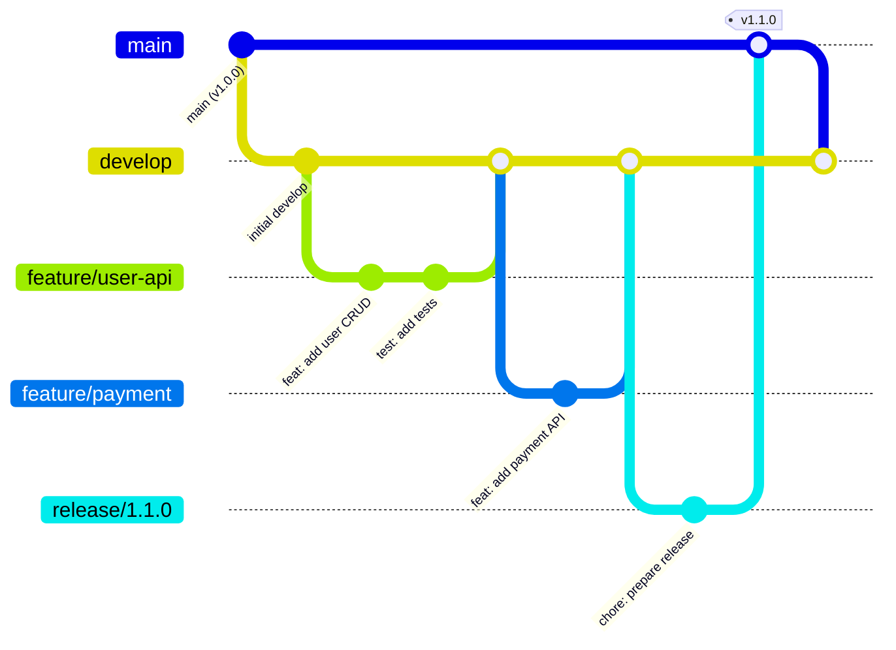

# 🌊 Git Flow & Release Strategy Guide

## 📋 Branch Strategy Overview



## 🔄 Recommended Git Flow

### 1. **Branch Types**

| Branch      | Purpose             | Naming              | Example                 |
| ----------- | ------------------- | ------------------- | ----------------------- |
| `main`      | Production code     | `main`              | -                       |
| `develop`   | Integration branch  | `develop`           | -                       |
| `feature/*` | New features        | `feature/<name>`    | `feature/user-auth`     |
| `fix/*`     | Bug fixes           | `fix/<name>`        | `fix/login-error`       |
| `release/*` | Release preparation | `release/<version>` | `release/1.2.0`         |
| `hotfix/*`  | Emergency fixes     | `hotfix/<name>`     | `hotfix/security-patch` |

### 2. **Environment Mapping**

```yaml
main     → Production  (auto deploy)
develop  → Staging     (auto deploy)
feature/* → Development (manual deploy)
```

## 🚀 Release Flow Options

### Option 1: Simple Flow (Recommended) ✅

```bash
feature/* → develop → main (auto release)
```

**Workflow:**

```bash
# 1. Create feature branch
git checkout -b feature/payment-api
git commit -m "feat: add payment endpoints"
git commit -m "test: add payment tests"

# 2. Merge to develop (PR)
git push origin feature/payment-api
# Create PR to develop → Review → Merge

# 3. Test on staging
# Automatic deploy to staging environment

# 4. Release to production
git checkout main
git merge develop --no-ff
git push origin main
# → Auto version bump & release
```

### Option 2: Release Branch Flow 🎯

```bash
feature/* → develop → release/* → main
```

**Workflow:**

```bash
# 1. Features to develop (same as above)

# 2. Create release branch
git checkout -b release/1.2.0 develop
# Fix bugs, update docs, prepare release

# 3. Merge to main
git checkout main
git merge release/1.2.0 --no-ff
git push origin main
# → Auto create tag & release

# 4. Back-merge to develop
git checkout develop
git merge main
```

### Option 3: GitLab Flow (Simpler) 🌟

```bash
feature/* → main (auto release)
```

**Workflow:**

```bash
# Direct to main (with protection rules)
git checkout -b feature/new-api
git commit -m "feat: add new API"
git push origin feature/new-api
# PR → Review → Merge to main → Auto release
```

## 📝 Automated Release Triggers

### When Release Happens:

1. **Merge to main** = Auto release
   - Analyzes commits since last tag
   - Determines version bump
   - Creates release

2. **Manual trigger** (if needed)
   ```bash
   # GitHub Actions manual workflow
   Actions → Release → Run workflow → Select version type
   ```

## 🎯 Recommended Approach

### **Develop + Main** (Best Balance) ✅

```yaml
Branches:
  main: Production (protected)
  develop: Staging/Integration
  feature/*: Development

Flow: 1. feature/* → develop (PR with review)
  2. develop → staging (auto deploy & test)
  3. develop → main (PR with approval)
  4. main → production (auto release & deploy)
```

**Branch Protection Rules:**

```yaml
main:
  - Require PR reviews (2 approvers)
  - Require status checks (CI/CD pass)
  - Require branches up to date
  - Include administrators
  - No force push

develop:
  - Require PR reviews (1 approver)
  - Require status checks
  - No force push
```

## 🔧 Setup Commands

### Initial Setup

```bash
# Create develop branch
git checkout -b develop
git push -u origin develop

# Set default branch for new PRs
# GitHub → Settings → Branches → Default branch → develop
```

### Daily Workflow

```bash
# 1. Start new feature
git checkout develop
git pull origin develop
git checkout -b feature/awesome-feature

# 2. Work & commit
git add .
git commit -m "feat: add awesome feature"
git commit -m "test: add feature tests"
git commit -m "docs: update API docs"

# 3. Push & create PR
git push -u origin feature/awesome-feature
# → Create PR to develop

# 4. After review & merge to develop
# → Auto deploy to staging
# → Test on staging

# 5. Release to production
# → Create PR from develop to main
# → Approve & merge
# → Auto version, changelog, release, deploy
```

## 📊 Version Strategy

### Automatic Version Bumping:

```yaml
Patch (1.0.0 → 1.0.1):
  - fix: commits only
  - No new features

Minor (1.0.0 → 1.1.0):
  - feat: commits
  - New features, backward compatible

Major (1.0.0 → 2.0.0):
  - feat!: or BREAKING CHANGE
  - Breaking changes
```

### Release Frequency:

```yaml
Continuous Delivery:
  - Release on every main merge
  - Multiple releases per day OK

Scheduled Releases:
  - Weekly: Every Friday
  - Bi-weekly: Every 2 weeks
  - Monthly: First Monday

Feature-based:
  - Release when feature set complete
  - Group related features
```

## 🚨 Hotfix Process

```bash
# 1. Create hotfix from main
git checkout -b hotfix/critical-bug main

# 2. Fix & commit
git commit -m "fix: resolve critical security issue"

# 3. Merge to main (fast)
git checkout main
git merge hotfix/critical-bug
git push origin main
# → Auto patch release

# 4. Merge to develop
git checkout develop
git merge main
```

## 💡 Best Practices

### ✅ DO:

- Keep `develop` stable (always deployable)
- Test on staging before production
- Use meaningful commit messages
- Review all code before merge
- Keep PRs small and focused

### ❌ DON'T:

- Commit directly to main/develop
- Merge without review
- Mix features in one PR
- Skip testing on staging
- Force push to shared branches

## 🎯 Quick Decision Guide

| Team Size | Recommended Flow                    |
| --------- | ----------------------------------- |
| 1-3 devs  | feature → main                      |
| 4-10 devs | feature → develop → main            |
| 10+ devs  | Full git flow with release branches |

| Release Frequency | Recommended Strategy     |
| ----------------- | ------------------------ |
| Multiple per day  | feature → main (CD)      |
| Daily             | feature → develop → main |
| Weekly            | develop → release → main |
| Monthly           | Full git flow            |

## 📋 Summary

**For most teams, I recommend:**

```yaml
Branches: main + develop + feature/*
Flow: feature → develop → main
Release: Automatic on merge to main
Deploy:
  - develop → Staging (auto)
  - main → Production (auto)
```

This gives you:

- ✅ Clean history
- ✅ Staging environment for testing
- ✅ Automated releases
- ✅ Easy rollback
- ✅ Clear process
