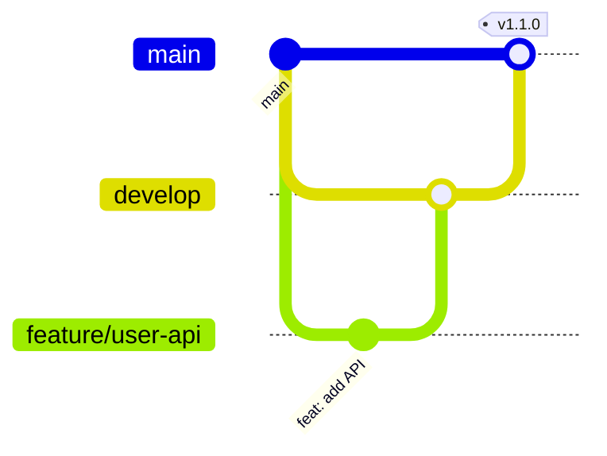

# 🚀 CI/CD & DevOps Summary

## 📋 Quick Overview

เราได้ setup ระบบ CI/CD ที่ครบครันสำหรับ monorepo แล้ว:

### ✅ สิ่งที่ได้

1. **Automated Versioning** - ใช้ conventional commits
2. **Automated CHANGELOG** - Generate จาก commit messages  
3. **GitHub Actions CI/CD** - Test, build, deploy อัตโนมัติ
4. **Docker Multi-stage Builds** - สำหรับทั้ง 3 apps
5. **Multi-environment Deploy** - Staging & Production
6. **GitHub Container Registry** - เก็บ Docker images

## 🌊 Git Flow ที่แนะนำ



### Branch Strategy:
- `main` → Production (Protected)
- `develop` → Staging  
- `feature/*` → Development

### Release Flow:
1. `feature/*` → `develop` (PR + Review)
2. Auto deploy to **Staging**
3. `develop` → `main` (PR + Approval)  
4. Auto **Version + Release + Deploy**

## 📦 Versioning Strategy

### Conventional Commits:
```bash
feat: new feature     → Minor (1.0.0 → 1.1.0)
fix: bug fix         → Patch (1.0.0 → 1.0.1)
feat!: breaking      → Major (1.0.0 → 2.0.0)
```

### Auto-generated:
- ✅ Version bump in package.json
- ✅ CHANGELOG.md with sections
- ✅ Git tag (v1.1.0)
- ✅ GitHub Release with notes

## 🐳 Docker & Monorepo

### Separate Images:
```
ghcr.io/your-org/aegisx-starter/api:v1.1.0
ghcr.io/your-org/aegisx-starter/web:v1.1.0  
ghcr.io/your-org/aegisx-starter/admin:v1.1.0
```

### Build Strategy:
- Build only affected apps
- Multi-stage builds for size
- Security scanning included
- Health checks for all

## 🔄 CI/CD Pipeline

### On Push to Branch:
- **feature/*** → Run tests only
- **develop** → Test + Build + Deploy Staging
- **main** → Test + Build + Version + Release + Deploy Prod

### GitHub Actions Workflows:
```yaml
.github/workflows/
├── ci-cd.yml          # Main pipeline
├── auto-release.yml   # Automated versioning
├── security.yml       # Weekly scans
└── cleanup.yml        # Image cleanup
```

## 🚀 Quick Commands

### Development:
```bash
# Create feature
git checkout -b feature/payment-api
git commit -m "feat: add payment endpoints"
git push origin feature/payment-api
```

### Release:
```bash
# Merge to develop → Auto staging
# Merge to main → Auto production + version
```

### Manual (if needed):
```bash
npm run release        # Interactive
npm run release:minor  # Force minor
npm run release:major  # Force major
```

## 📊 Environments

| Environment | Branch | URL | Deploy |
|-------------|--------|-----|--------|
| Development | feature/* | localhost | Manual |
| Staging | develop | staging.aegisx.com | Auto |
| Production | main | api.aegisx.com | Auto |

## 🔐 Setup Requirements

### GitHub Secrets:
```
GITHUB_TOKEN      # For packages
DATABASE_URL      # PostgreSQL
JWT_SECRET        # Auth secret
REDIS_URL         # Cache
SLACK_WEBHOOK     # Notifications (optional)
```

### First Time:
```bash
# 1. Add secrets in GitHub
# 2. Run husky install
yarn prepare

# 3. That's it! Push code and watch magic happen
```

## 📈 Benefits

- **No Manual Versioning** - อัตโนมัติจาก commits
- **No Manual Changelog** - Generate จาก commits
- **No Manual Deploy** - Push = Deploy
- **Consistent Process** - ทุกคนทำเหมือนกัน
- **Clear History** - รู้ว่าแต่ละ version มีอะไร
- **Easy Rollback** - ย้อน version ได้ง่าย

## 🎯 Next Steps

1. **Add GitHub Secrets**
2. **Start using conventional commits**
3. **Push code** - ระบบจัดการที่เหลือ

---

> 💡 **Tips**: ดู [Git Flow Guide](./GIT-FLOW-RELEASE-GUIDE.md) สำหรับรายละเอียด branch strategy