# 🏗️ CRUD Generator Architecture

> **System design and architectural decisions for the enterprise CRUD generator**

This document outlines the comprehensive architecture of the CRUD Generator system, design patterns, and architectural decisions that enable 100% working code generation.

## 🎯 Architectural Overview

### System Philosophy

The CRUD Generator follows these core architectural principles:

1. **Database-First Design**: Schema drives all code generation
2. **Type Safety**: End-to-end TypeScript integration
3. **Zero Configuration**: Intelligent defaults with optional customization
4. **Template-Driven**: Extensible Handlebars template system
5. **Package-Based Features**: Modular feature sets for different use cases
6. **Production Ready**: Generated code meets enterprise standards

### High-Level Architecture

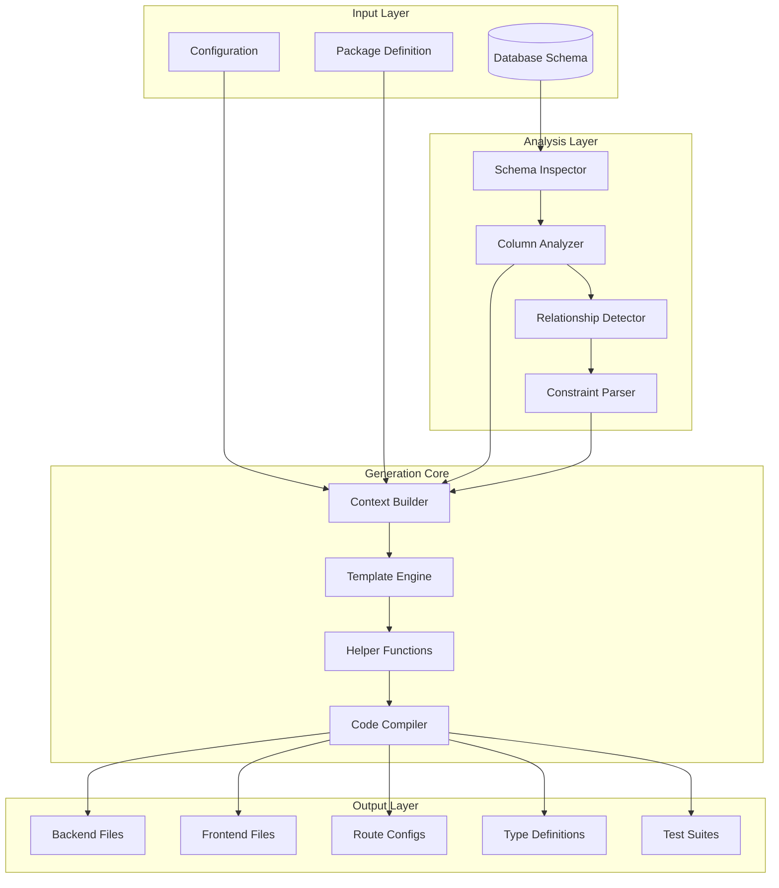

## 🏛️ Core Components

### 1. Schema Inspector

The Schema Inspector analyzes database tables to extract comprehensive metadata:

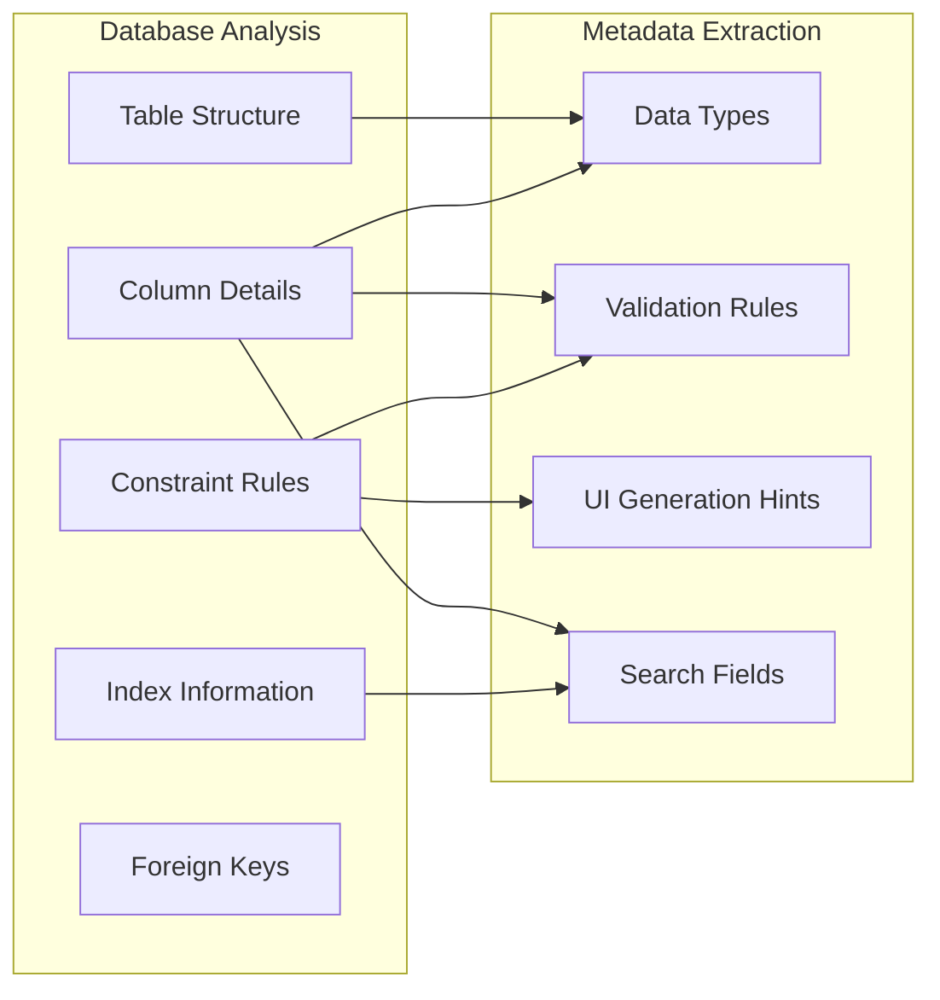

**Key Responsibilities:**

- Extract column definitions and data types
- Parse CHECK constraints for enum values
- Identify foreign key relationships
- Detect searchable and sortable fields
- Generate validation rules from schema

### 2. Context Builder

The Context Builder creates rich template contexts from schema metadata:

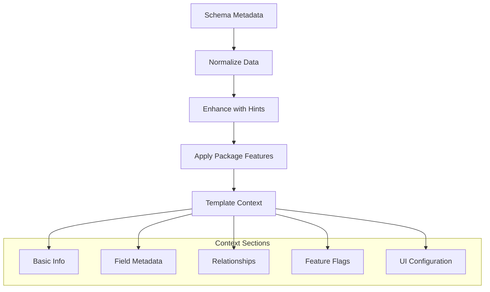

**Context Structure:**

```typescript
interface TemplateContext {
  // Basic module information
  moduleName: string;
  ModuleName: string;
  MODULE_NAME: string;
  tableName: string;

  // Schema analysis
  columns: EnhancedColumn[];
  primaryKey: string;
  searchFields: string[];
  sortableFields: string[];
  uuidFields: string[];

  // Relationships
  belongsTo: Relationship[];
  hasMany: Relationship[];

  // Package features
  package: PackageConfig;
  features: FeatureFlags;

  // UI generation hints
  defaultLabelField: string;
  quickFilters: QuickFilter[];
  constraintFields: ConstraintField[];

  // Template utilities
  helpers: HelperFunctions;
}
```

### 3. Template Engine

The Template Engine uses Handlebars with custom helpers for code generation:

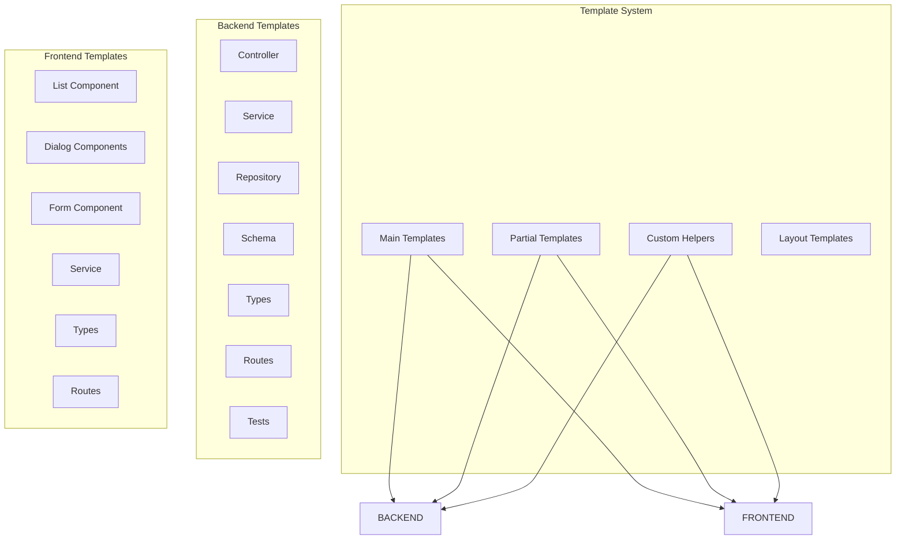

**Template Architecture:**

- **Main Templates**: Complete file templates
- **Partial Templates**: Reusable code snippets
- **Layout Templates**: Common file structures
- **Helper Functions**: Logic for dynamic generation

### 4. Code Compiler

The Code Compiler orchestrates the generation process:

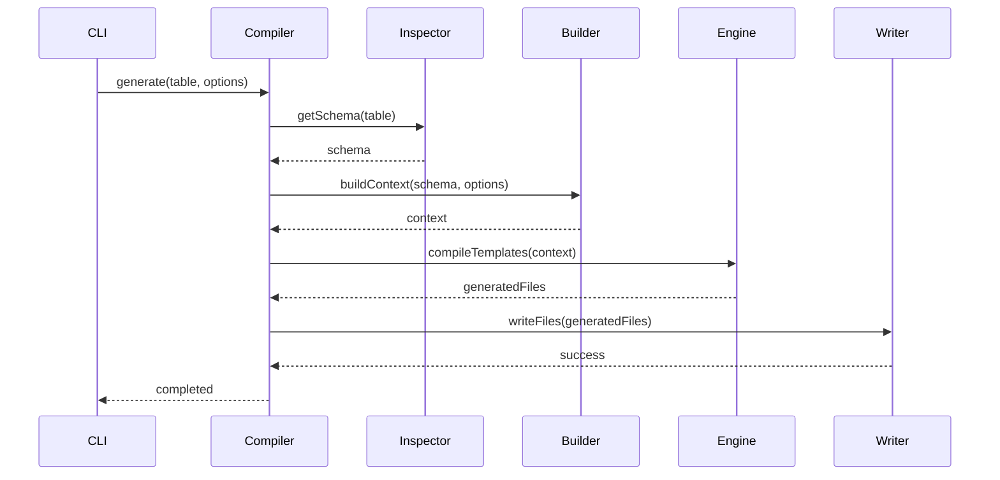

## 🔧 Design Patterns

### 1. Strategy Pattern - Package System

Different packages implement varying feature sets using the Strategy pattern:

```typescript
interface PackageStrategy {
  name: string;
  features: FeatureFlags;
  templates: TemplateOverrides;
  dependencies: Dependencies;

  getEndpoints(): EndpointConfig[];
  getUIFeatures(): UIFeature[];
  customize(context: TemplateContext): TemplateContext;
}

class StandardPackage implements PackageStrategy {
  name = 'standard';
  features = {
    basicCrud: true,
    validation: true,
    bulkOperations: false,
    advancedFiltering: false,
  };

  getEndpoints() {
    return [
      { method: 'POST', path: '/', handler: 'create' },
      { method: 'GET', path: '/:id', handler: 'getById' },
      { method: 'GET', path: '/', handler: 'list' },
      { method: 'PUT', path: '/:id', handler: 'update' },
      { method: 'DELETE', path: '/:id', handler: 'delete' },
    ];
  }
}

class EnhancedPackage implements PackageStrategy {
  name = 'enhanced';
  features = {
    ...new StandardPackage().features,
    bulkOperations: true,
    advancedFiltering: true,
    quickFilters: true,
    exportFunctions: true,
  };

  getEndpoints() {
    return [...new StandardPackage().getEndpoints(), { method: 'GET', path: '/dropdown', handler: 'dropdown' }, { method: 'POST', path: '/bulk', handler: 'bulkCreate' }, { method: 'PUT', path: '/bulk', handler: 'bulkUpdate' }, { method: 'DELETE', path: '/bulk', handler: 'bulkDelete' }, { method: 'POST', path: '/validate', handler: 'validate' }, { method: 'GET', path: '/stats', handler: 'stats' }];
  }
}
```

### 2. Builder Pattern - Context Creation

Context creation uses the Builder pattern for complex object construction:

```typescript
class TemplateContextBuilder {
  private context: Partial<TemplateContext> = {};

  setBasicInfo(tableName: string, moduleName: string): this {
    this.context.tableName = tableName;
    this.context.moduleName = moduleName;
    this.context.ModuleName = pascalCase(moduleName);
    this.context.MODULE_NAME = moduleName.toUpperCase();
    return this;
  }

  setColumns(columns: Column[]): this {
    this.context.columns = columns.map((col) => this.enhanceColumn(col));
    return this;
  }

  setRelationships(relationships: Relationship[]): this {
    this.context.belongsTo = relationships.filter((r) => r.type === 'belongsTo');
    this.context.hasMany = relationships.filter((r) => r.type === 'hasMany');
    return this;
  }

  setPackage(packageStrategy: PackageStrategy): this {
    this.context.package = packageStrategy;
    this.context.features = packageStrategy.features;
    return this;
  }

  setUIHints(): this {
    this.context.defaultLabelField = this.findDefaultLabelField();
    this.context.quickFilters = this.generateQuickFilters();
    this.context.constraintFields = this.generateConstraintFields();
    return this;
  }

  build(): TemplateContext {
    this.validate();
    return this.context as TemplateContext;
  }

  private enhanceColumn(column: Column): EnhancedColumn {
    return {
      ...column,
      jsType: mapDbTypeToJs(column.type),
      tsType: mapDbTypeToTs(column.type),
      validationRules: generateValidationRules(column),
      isId: this.isIdField(column),
      isEnum: this.isEnumField(column),
      formField: this.generateFormField(column),
      filterType: this.generateFilterType(column),
    };
  }
}
```

### 3. Template Method Pattern - Generation Process

The generation process follows the Template Method pattern:

```typescript
abstract class BaseGenerator {
  // Template method defining the algorithm
  async generate(tableName: string, options: GeneratorOptions): Promise<void> {
    const schema = await this.inspectSchema(tableName);
    const context = await this.buildContext(schema, options);
    const files = await this.generateFiles(context);
    await this.writeFiles(files);
    await this.postProcess();
  }

  // Abstract methods implemented by subclasses
  protected abstract buildContext(schema: Schema, options: GeneratorOptions): Promise<TemplateContext>;
  protected abstract generateFiles(context: TemplateContext): Promise<GeneratedFile[]>;

  // Common implementations
  protected async inspectSchema(tableName: string): Promise<Schema> {
    return await this.schemaInspector.analyze(tableName);
  }

  protected async writeFiles(files: GeneratedFile[]): Promise<void> {
    for (const file of files) {
      await this.fileWriter.write(file.path, file.content);
    }
  }

  protected async postProcess(): Promise<void> {
    // Hook for subclasses to override
  }
}

class BackendGenerator extends BaseGenerator {
  protected async buildContext(schema: Schema, options: GeneratorOptions): Promise<TemplateContext> {
    return new BackendContextBuilder().setSchema(schema).setOptions(options).setPackage(options.package).build();
  }

  protected async generateFiles(context: TemplateContext): Promise<GeneratedFile[]> {
    return [await this.generateController(context), await this.generateService(context), await this.generateRepository(context), await this.generateSchemas(context), await this.generateTypes(context), await this.generateRoutes(context), await this.generateTests(context), await this.generateIndex(context)];
  }
}
```

### 4. Factory Pattern - Helper Creation

Helper functions are created using the Factory pattern:

```typescript
class HelperFactory {
  static createForTemplate(templateType: string): HelperRegistry {
    const baseHelpers = this.getBaseHelpers();

    switch (templateType) {
      case 'backend':
        return {
          ...baseHelpers,
          ...this.getBackendHelpers(),
        };

      case 'frontend':
        return {
          ...baseHelpers,
          ...this.getFrontendHelpers(),
        };

      default:
        return baseHelpers;
    }
  }

  private static getBaseHelpers(): HelperRegistry {
    return {
      pascalCase: (str: string) => pascalCase(str),
      camelCase: (str: string) => camelCase(str),
      kebabCase: (str: string) => kebabCase(str),
      pluralize: (str: string) => pluralize(str),
      eq: (a: any, b: any) => a === b,
      ne: (a: any, b: any) => a !== b,
      gt: (a: number, b: number) => a > b,
      lt: (a: number, b: number) => a < b,
    };
  }

  private static getBackendHelpers(): HelperRegistry {
    return {
      generateTypeBoxField: (column: EnhancedColumn) => generateTypeBoxField(column),
      generateValidation: (column: EnhancedColumn) => generateValidation(column),
      getUUIDFields: (columns: EnhancedColumn[]) => columns.filter((c) => c.isId),
      hasEvents: (context: TemplateContext) => context.features.events,
    };
  }

  private static getFrontendHelpers(): HelperRegistry {
    return {
      hasConstraint: (column: EnhancedColumn) => column.constraints?.length > 0,
      getConstraintValues: (column: EnhancedColumn) => extractConstraintValues(column),
      generateQuickFilters: (columns: EnhancedColumn[], max: number) => generateQuickFilters(columns, max),
      shouldShowColumn: (column: EnhancedColumn) => shouldShowInList(column),
      getFormFieldType: (column: EnhancedColumn) => getFormFieldType(column),
    };
  }
}
```

## 🎨 Data Flow Architecture

### Schema Analysis Flow

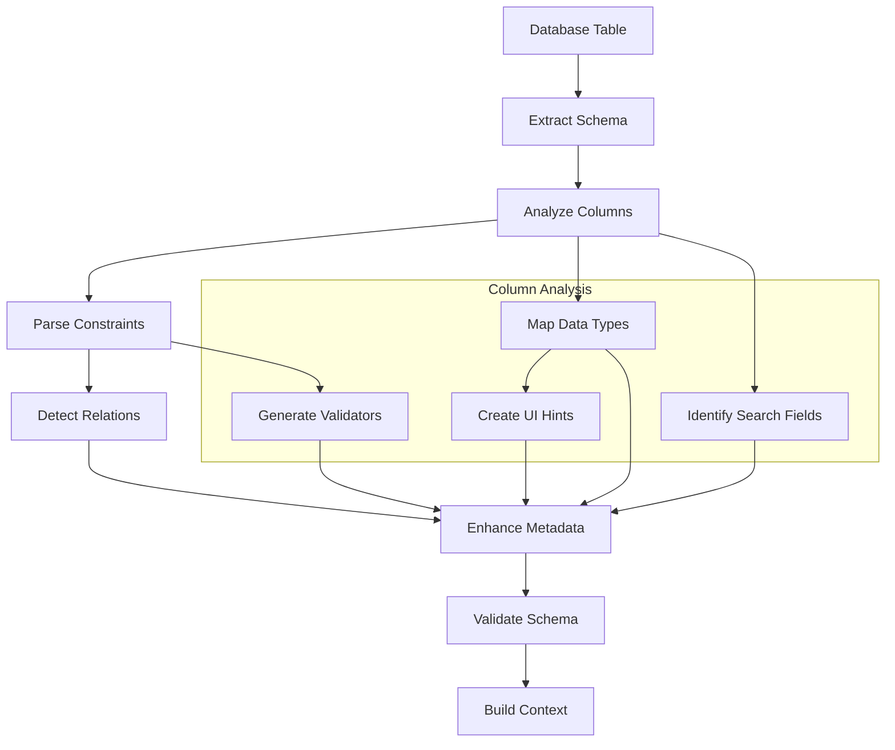

### Template Processing Flow

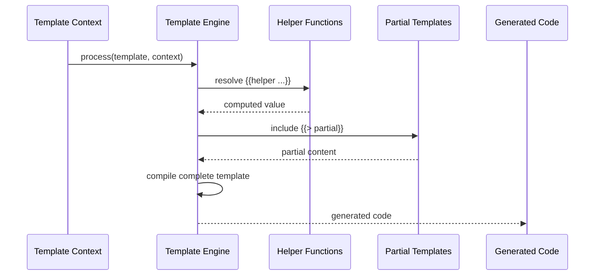

### File Generation Pipeline

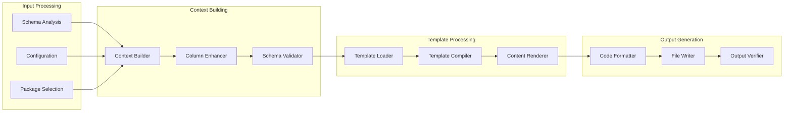

## 🔄 Component Interactions

### Backend Generation Architecture

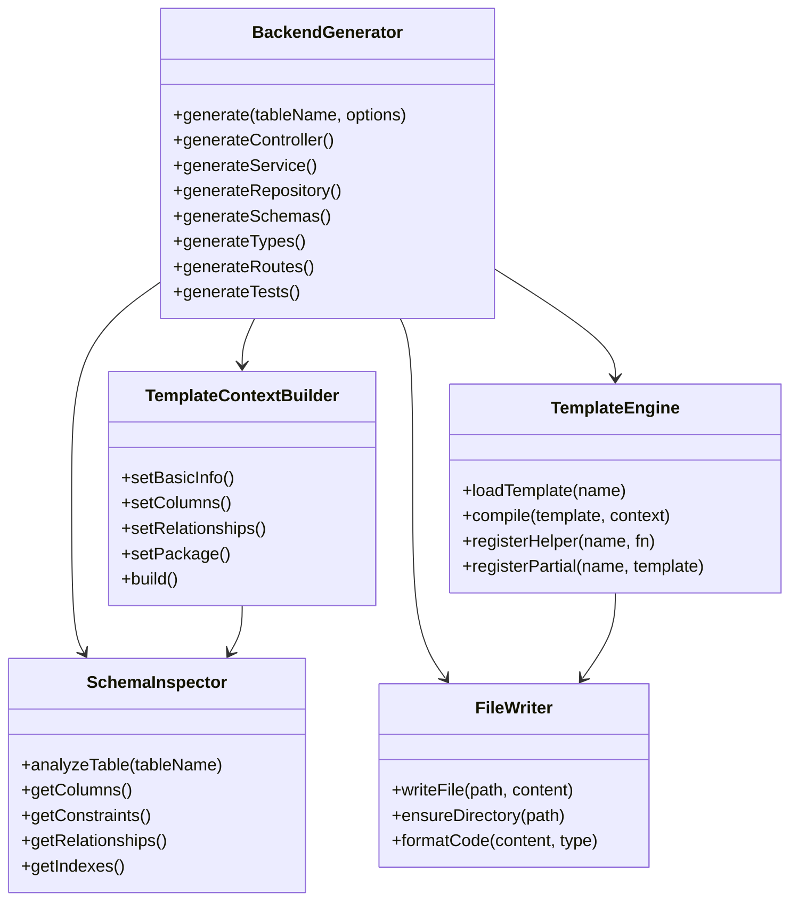

### Frontend Generation Architecture

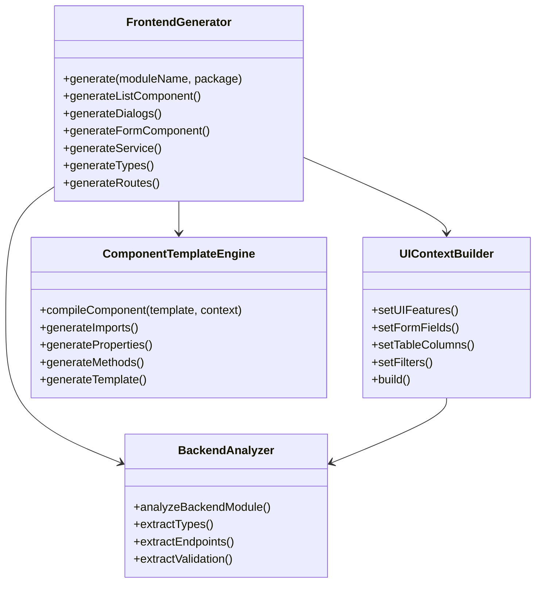

## 🧩 Extension Architecture

### Plugin System

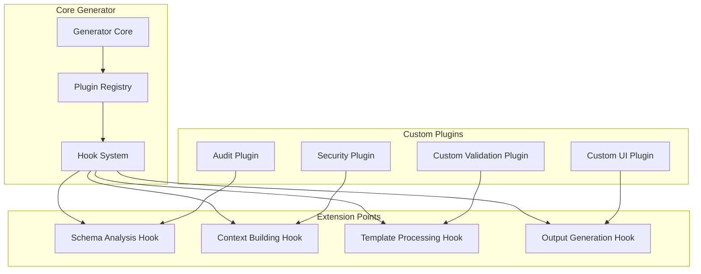

**Plugin Interface:**

```typescript
interface GeneratorPlugin {
  name: string;
  version: string;
  dependencies?: string[];

  // Lifecycle hooks
  onSchemaAnalysis?(schema: Schema): Schema;
  onContextBuilding?(context: TemplateContext): TemplateContext;
  onTemplateProcessing?(template: string, context: TemplateContext): string;
  onOutputGeneration?(files: GeneratedFile[]): GeneratedFile[];

  // Custom helpers
  getHelpers?(): HelperRegistry;

  // Custom templates
  getTemplates?(): TemplateRegistry;
}
```

### Template Customization Architecture

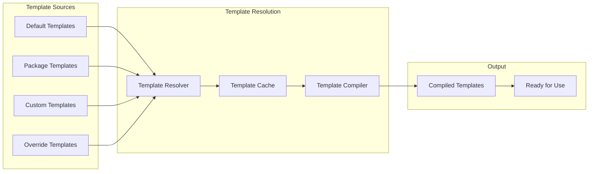

**Template Resolution Priority:**

1. Override templates (highest priority)
2. Custom templates
3. Package-specific templates
4. Default templates (lowest priority)

## 🔒 Security Architecture

### Type Safety System

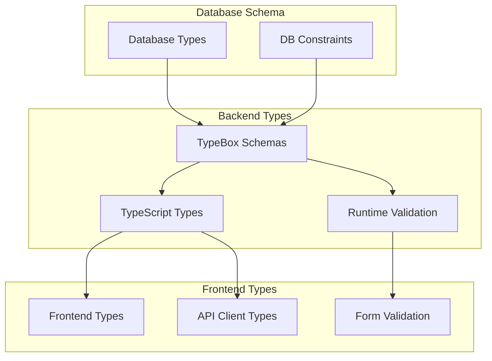

### Input Validation Flow

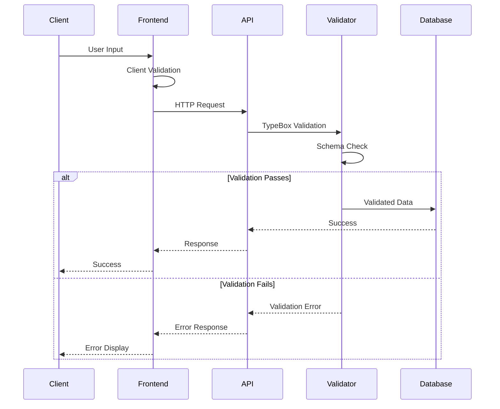

## 📊 Performance Architecture

### Caching Strategy

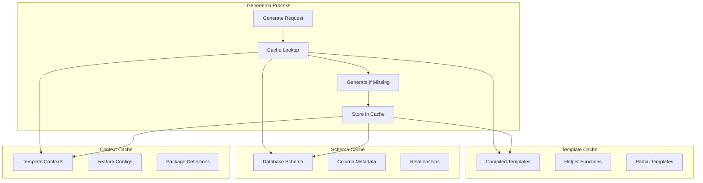

### Optimization Strategies

1. **Template Compilation Caching**: Pre-compile frequently used templates
2. **Schema Analysis Caching**: Cache database schema analysis results
3. **Incremental Generation**: Only regenerate changed files
4. **Parallel Processing**: Generate multiple files concurrently
5. **Memory Management**: Efficient context object creation and cleanup

## 🔄 Scalability Considerations

### Horizontal Scaling

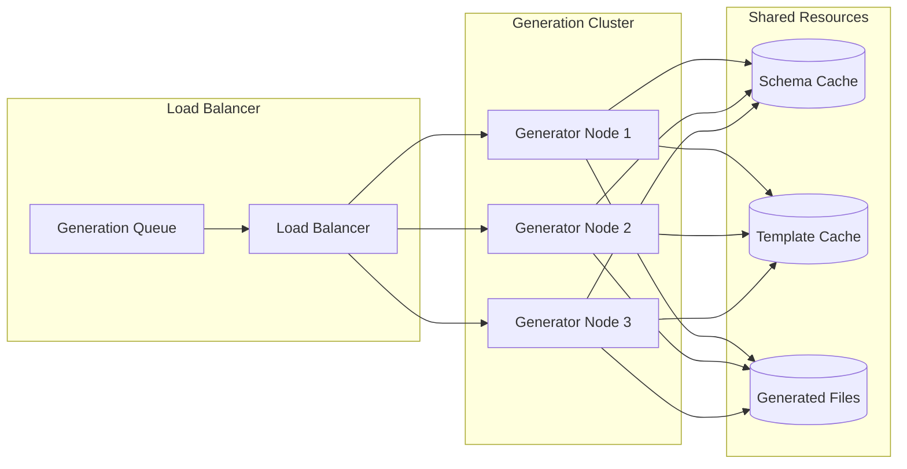

### Vertical Scaling

- **Memory Optimization**: Efficient object creation and garbage collection
- **CPU Optimization**: Parallel template compilation and file generation
- **I/O Optimization**: Batch file operations and async processing
- **Cache Optimization**: Intelligent cache warming and eviction policies

## 🎯 Future Architecture Enhancements

### Planned Improvements

1. **GraphQL Support**: Generate GraphQL schemas and resolvers
2. **Real-time Generation**: WebSocket-based live code generation
3. **Version Management**: Support for API versioning in generated code
4. **Multi-Database Support**: Extend beyond PostgreSQL
5. **Cloud Integration**: Native cloud provider integrations
6. **AI-Assisted Generation**: Machine learning for better code generation

### Extensibility Roadmap

```mermaid
timeline
    title CRUD Generator Evolution

    section Current (v1.0)
        : 100% Working Generation
        : PostgreSQL Support
        : Angular + Fastify
        : TypeBox Integration

    section Near Term (v1.1)
        : GraphQL Support
        : Multi-Database
        : Enhanced UI Components
        : Performance Optimizations

    section Medium Term (v1.2)
        : Real-time Generation
        : Cloud Integration
        : Advanced Analytics
        : Plugin Ecosystem

    section Long Term (v2.0)
        : AI-Assisted Generation
        : Multi-Framework Support
        : Enterprise Integration
        : Advanced Customization
```

---

**The CRUD Generator architecture represents a sophisticated, enterprise-grade code generation system designed for scalability, maintainability, and extensibility.** 🏗️

_This architecture document serves as the foundation for understanding, extending, and maintaining the generator system in enterprise environments._
