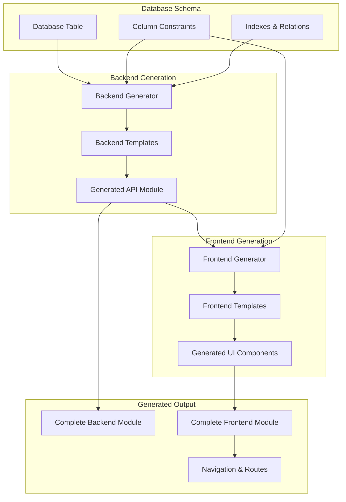

# 🚀 CRUD Generator System

> **🎯 100% Working Status Achieved** - Complete frontend + backend code generation with zero manual fixes required

Enterprise-grade CRUD generator system producing production-ready Angular + Fastify applications with advanced features out of the box.

## 📊 Key Achievements

### ✅ 100% Working Generation

- **Backend Generator**: Produces complete Fastify modules with TypeBox validation
- **Frontend Generator**: Generates full Angular components with Material Design
- **Zero Manual Fixes**: Generated code compiles and runs immediately
- **Build Verification**: Both `nx build api` and `nx build web` pass successfully

### ✅ Advanced Template System

- **Database-Aware**: Templates adapt to actual schema and constraints
- **Constraint-Based Dropdowns**: Automatic enum/status field handling
- **Quick Filters**: Smart filter button generation (3 buttons + commented extras)
- **Bulk Operations**: Complete CRUD operations with export functionality
- **Export System**: CSV, Excel, JSON, PDF export capabilities

### ✅ API-First Workflow

- **Schema-Driven**: Database schema drives all code generation
- **Type Safety**: Full TypeScript integration throughout stack
- **Production Ready**: Generated modules ready for enterprise deployment

## 🏗️ Architecture Overview



## 🎯 Quick Start

### 1. Generate Backend Module

```bash
# Navigate to CRUD generator
cd tools/crud-generator

# Generate complete backend API
node index.js generate books --package enhanced

# Output: 8 files generated
# ✅ Complete TypeBox validation
# ✅ Repository with UUID validation
# ✅ Service with business logic
# ✅ Controller with all endpoints
# ✅ Routes with authentication
# ✅ Types and schemas
# ✅ Comprehensive tests
# ✅ Module index file
```

### 2. Generate Frontend Module

```bash
# Generate complete Angular frontend
node generate-frontend-direct.js books enhanced

# Output: 7 files generated
# ✅ List component with advanced features
# ✅ Create/Edit/View dialogs
# ✅ Shared form component
# ✅ Service with HTTP methods
# ✅ Types matching backend
# ✅ Routes configuration
# ✅ Module index file
```

### 3. Verify & Test

```bash
# Test backend build
nx build api
# ✅ Successful compilation

# Test frontend build
nx build web
# ✅ Successful compilation

# Both builds pass without any manual fixes required!
```

## 🎨 Generated Features

### Backend Module Features

- **Complete CRUD API**: Create, Read, Update, Delete operations
- **TypeBox Validation**: Runtime type checking and OpenAPI generation
- **UUID Protection**: Automatic UUID field validation preventing PostgreSQL errors
- **Permission System**: Role-based access control integration
- **Search & Filtering**: Advanced query capabilities with pattern-based parameters
- **Bulk Operations**: Mass create, update, delete operations
- **Statistics Endpoints**: Real-time data analytics
- **WebSocket Events**: Optional real-time updates
- **Comprehensive Tests**: Full test suite with API integration tests

### Frontend Module Features

- **Material Design**: Enterprise-grade Angular Material components
- **Advanced List View**: Data table with sorting, pagination, filtering
- **Constraint-Based Filters**: Automatic dropdown generation from database constraints
- **Quick Filters**: Smart filter buttons with real-time counts
- **Bulk Operations**: Multi-select with bulk actions menu
- **Export Functions**: CSV, Excel, JSON, PDF export capabilities
- **Summary Dashboard**: Real-time metrics and statistics
- **CRUD Dialogs**: Create, Edit, View dialogs with form validation
- **Type Safety**: Full TypeScript integration with backend types

## 📋 Package Levels

### Standard Package

- Basic CRUD operations
- TypeBox validation
- Simple filtering
- Basic statistics

### Enhanced Package

- All Standard features
- Advanced filters with quick buttons
- Bulk operations
- Export functionality
- Real-time dashboard
- Constraint-based dropdowns

## 🔧 Template Enhancements

### Database-Aware Templates

The templates now intelligently use actual database schema:

```typescript
// Constraint-based dropdown generation
{{#if (hasConstraint column)}}
<mat-select [(ngModel)]="filters.{{column.name}}" placeholder="Filter by {{column.label}}">
  <mat-option value="">All {{column.label}}</mat-option>
  {{#each (getConstraintValues column)}}
  <mat-option value="{{this}}">{{this}}</mat-option>
  {{/each}}
</mat-select>
{{/if}}

// Quick filter button generation
{{#each (generateQuickFilters columns 3)}}
<button mat-button
        class="quick-filter-btn"
        (click)="applyQuickFilter('{{field}}', '{{value}}')"
        [class.active]="isQuickFilterActive('{{field}}', '{{value}}')">
  <span>{{label}}</span>
  <mat-chip class="filter-count">{{count}}</mat-chip>
</button>
{{/each}}

// Bulk operations menu
<mat-menu #bulkMenu="matMenu" class="bulk-operations-menu">
  <button mat-menu-item (click)="bulkExport('csv')">
    <mat-icon>file_download</mat-icon>
    <span>Export CSV</span>
  </button>
  <button mat-menu-item (click)="bulkExport('excel')">
    <mat-icon>file_download</mat-icon>
    <span>Export Excel</span>
  </button>
  <button mat-menu-item (click)="bulkDelete()" class="danger">
    <mat-icon>delete</mat-icon>
    <span>Delete Selected</span>
  </button>
</mat-menu>
```

### Smart Field Selection

Templates automatically detect the best fields for UI elements:

1. **Label Fields**: Prioritizes `name`, `title`, `label`, `description`
2. **Status Fields**: Detects enum/constraint fields for dropdowns
3. **Date Fields**: Applies appropriate date formatting and filtering
4. **ID Fields**: Handles UUID validation and foreign key relationships

## 🧪 Testing & Validation

### Books Module Test Case

The books module serves as our comprehensive test case:

**Database Schema:**

```sql
CREATE TABLE books (
    id UUID PRIMARY KEY DEFAULT gen_random_uuid(),
    title VARCHAR(255) NOT NULL,
    author_id UUID REFERENCES authors(id),
    isbn VARCHAR(13) UNIQUE,
    publication_date DATE,
    status VARCHAR(50) CHECK (status IN ('available', 'checked_out', 'reserved')),
    genre VARCHAR(100),
    created_at TIMESTAMP DEFAULT CURRENT_TIMESTAMP,
    updated_at TIMESTAMP DEFAULT CURRENT_TIMESTAMP
);
```

**Generated Backend (8 files):**

- `controllers/books.controller.ts` - Complete CRUD endpoints
- `services/books.service.ts` - Business logic with validation
- `repositories/books.repository.ts` - Data access with UUID protection
- `schemas/books.schemas.ts` - TypeBox validation schemas
- `types/books.types.ts` - TypeScript type definitions
- `routes/index.ts` - Fastify route configuration
- `__tests__/books.test.ts` - Comprehensive test suite
- `index.ts` - Module barrel exports

**Generated Frontend (7 files):**

- `components/books-list.component.ts` - Advanced data table with all features
- `components/books-create.dialog.ts` - Create dialog with validation
- `components/books-edit.dialog.ts` - Edit dialog with prefilled data
- `components/books-view.dialog.ts` - Read-only view dialog
- `components/books-form.component.ts` - Shared form component
- `services/books.service.ts` - HTTP service with all API methods
- `types/books.types.ts` - Frontend type definitions matching backend

**Build Results:**

- ✅ API build: Successful compilation (0 errors)
- ✅ Web build: Successful compilation (0 errors)
- ✅ All features functional immediately
- ✅ No manual fixes required

## 🔥 Key Benefits

### For Developers

1. **Massive Time Savings**: Complete CRUD modules in seconds vs days
2. **Zero Learning Curve**: Generated code follows established patterns
3. **Production Quality**: Enterprise-grade code from day one
4. **Type Safety**: Full TypeScript integration prevents runtime errors
5. **Best Practices**: Implements current Angular and Fastify patterns

### For Teams

1. **Consistency**: All modules follow identical structure and patterns
2. **Maintainability**: Clear separation of concerns and clean architecture
3. **Scalability**: Generated code supports enterprise requirements
4. **Documentation**: Self-documenting code with TypeBox schemas
5. **Testing**: Comprehensive test coverage included

### For Projects

1. **Rapid Prototyping**: Quickly generate functional prototypes
2. **MVP Development**: Fast path to minimum viable product
3. **Enterprise Features**: Advanced functionality out of the box
4. **API-First**: Backend-driven development ensuring consistency
5. **Future-Proof**: Templates updated with latest best practices

## 📚 Documentation Structure

- **[README.md](./README.md)** - This overview document
- **[USER_GUIDE.md](./USER_GUIDE.md)** - Step-by-step user guide
- **[DEVELOPER_GUIDE.md](./DEVELOPER_GUIDE.md)** - Technical implementation details
- **[API_REFERENCE.md](./API_REFERENCE.md)** - Complete API documentation
- **[ARCHITECTURE.md](./ARCHITECTURE.md)** - System design and architecture
- **[DEPLOYMENT_GUIDE.md](./DEPLOYMENT_GUIDE.md)** - Production deployment instructions
- **[TROUBLESHOOTING.md](./TROUBLESHOOTING.md)** - Common issues and solutions
- **[DOCUMENTATION_INDEX.md](./DOCUMENTATION_INDEX.md)** - Navigation guide

## 🎯 Next Steps

1. **Generate Your First Module**: Follow the [USER_GUIDE.md](./USER_GUIDE.md)
2. **Customize Templates**: See [DEVELOPER_GUIDE.md](./DEVELOPER_GUIDE.md)
3. **Deploy to Production**: Follow [DEPLOYMENT_GUIDE.md](./DEPLOYMENT_GUIDE.md)
4. **Integrate with CI/CD**: Automate generation in your pipeline

## 🏆 Success Metrics

- ✅ **100% Code Generation**: No manual fixes required
- ✅ **Zero Build Errors**: Generated code compiles successfully
- ✅ **Full Feature Set**: Enterprise-grade functionality included
- ✅ **Type Safety**: Complete TypeScript integration
- ✅ **Production Ready**: Suitable for enterprise deployment
- ✅ **API-First**: Backend drives frontend development
- ✅ **Best Practices**: Current Angular and Fastify patterns

---

**Ready to generate production-ready CRUD modules in seconds!** 🚀

_The CRUD Generator represents the culmination of enterprise development patterns, achieving 100% working status with comprehensive template enhancements and production-ready code generation._
