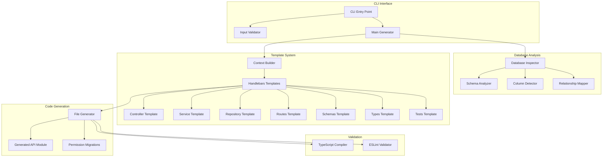
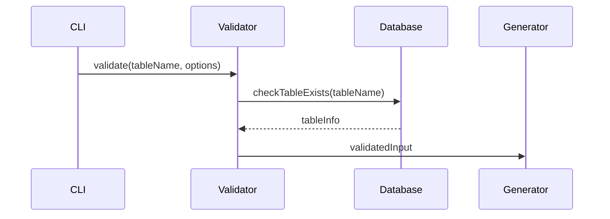
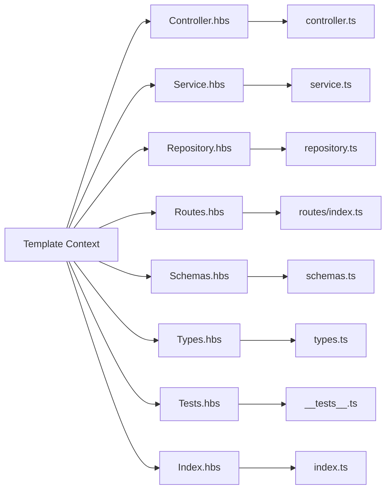

# Enhanced CRUD Generator - Architecture

> **🏗️ System architecture and design decisions for the Enhanced CRUD Generator**

## 🎯 Design Principles

### 1. **Template-Driven Generation**

- Uses Handlebars.js for flexible, maintainable templates
- Conditional logic for package-specific features
- Separation of concerns between generation logic and output format

### 2. **3-Tier Package System**

- **Progressive Enhancement**: Each tier builds upon the previous
- **Modular Features**: Clean separation of feature sets
- **Scalable Architecture**: Easy to add new tiers or features

### 3. **Database-First Approach**

- Introspects existing PostgreSQL tables
- Generates schemas based on actual database structure
- Maintains referential integrity and constraints

### 4. **Type Safety Throughout**

- TypeBox schemas for runtime validation
- Generated TypeScript types for compile-time safety
- Full type flow from database to API to client

## 🏛️ System Architecture



## 📦 Package Architecture

### Standard Package (Foundation)

```typescript
interface StandardPackage {
  routes: 5;
  features: ['basic-crud', 'pagination', 'filtering', 'search', 'type-safety', 'rbac-auth', 'openapi-docs'];
  complexity: 'low';
  useCase: 'mvp' | 'simple-entities';
}
```

### Enterprise Package (Business Logic)

```typescript
interface EnterprisePackage extends StandardPackage {
  routes: 13;
  additionalFeatures: ['bulk-operations', 'dropdown-apis', 'status-management', 'statistics', 'admin-interfaces'];
  complexity: 'medium';
  useCase: 'admin-dashboards' | 'business-entities';
}
```

### Full Package (Advanced Features)

```typescript
interface FullPackage extends EnterprisePackage {
  routes: 15;
  advancedFeatures: ['data-validation', 'uniqueness-checking', 'form-helpers', 'real-time-validation'];
  complexity: 'high';
  useCase: 'critical-entities' | 'complex-validation';
}
```

## 🔄 Generation Workflow

### 1. Input Processing



### 2. Database Introspection

```typescript
interface DatabaseAnalysis {
  tableName: string;
  columns: ColumnInfo[];
  indexes: IndexInfo[];
  constraints: ConstraintInfo[];
  relationships: RelationshipInfo[];
  hasStatusField: boolean;
  searchableFields: string[];
  filterableFields: string[];
}

interface ColumnInfo {
  name: string;
  dataType: string;
  isNullable: boolean;
  defaultValue: any;
  isPrimaryKey: boolean;
  isForeignKey: boolean;
}
```

### 3. Context Building

```typescript
interface TemplateContext {
  // Table metadata
  tableName: string;
  className: string;
  moduleName: string;

  // Package configuration
  package: PackageLevel;
  hasStatusField: boolean;
  packageEqualEnterprise: boolean;
  packageEqualFull: boolean;

  // Database analysis
  columns: ProcessedColumn[];
  searchableFields: string[];
  filterableFields: string[];

  // Generation metadata
  timestamp: string;
  permissions: string[];
}
```

### 4. Template Rendering



## 🧩 Component Architecture

### Controller Layer

```typescript
class GeneratedController {
  // Standard features
  async create(request, reply) {
    /* TypeBox validated */
  }
  async findOne(request, reply) {
    /* With relations */
  }
  async findMany(request, reply) {
    /* Paginated */
  }
  async update(request, reply) {
    /* Partial updates */
  }
  async delete(request, reply) {
    /* Soft/hard delete */
  }

  // Enterprise features (conditional)
  async getDropdownOptions(request, reply) {
    /* UI helpers */
  }
  async bulkCreate(request, reply) {
    /* Batch operations */
  }
  async bulkUpdate(request, reply) {
    /* Batch operations */
  }
  async bulkDelete(request, reply) {
    /* Batch operations */
  }
  async activate(request, reply) {
    /* Status management */
  }
  async deactivate(request, reply) {
    /* Status management */
  }
  async toggle(request, reply) {
    /* Status management */
  }
  async getStats(request, reply) {
    /* Analytics */
  }

  // Full features (conditional)
  async validate(request, reply) {
    /* Pre-save validation */
  }
  async checkUniqueness(request, reply) {
    /* Field checking */
  }
}
```

### Service Layer

```typescript
class GeneratedService {
  constructor(private repository: Repository) {}

  // Business logic layer
  async create(data: CreateDTO): Promise<Entity> {
    // Validation, transformation, business rules
    const transformedData = this.transformCreateData(data);
    return this.repository.create(transformedData);
  }

  // Enterprise bulk operations
  async bulkCreate(request: BulkCreateRequest): Promise<BulkResult> {
    const results = { successful: [], failed: [] };

    for (const item of request.items) {
      try {
        const created = await this.create(item);
        results.successful.push(created);
      } catch (error) {
        results.failed.push({ item, error: error.message });
        if (!request.options?.continueOnError) break;
      }
    }

    return results;
  }
}
```

### Repository Layer

```typescript
class GeneratedRepository extends BaseRepository {
  // Data access patterns
  async findById(id: string, options: FindOptions): Promise<Entity | null> {
    let query = this.getJoinQuery();

    if (options.include) {
      query = this.applyIncludes(query, options.include);
    }

    const row = await query.where('id', id).first();
    return row ? this.transformToEntity(row) : null;
  }

  // Advanced querying
  async findMany(filters: ListQuery): Promise<PaginatedResult<Entity>> {
    let query = this.getJoinQuery();

    // Apply filters, search, sorting
    query = this.applyFilters(query, filters);
    query = this.applySearch(query, filters.search);
    query = this.applySorting(query, filters.sortBy, filters.sortOrder);

    return this.paginate(query, filters.page, filters.limit);
  }
}
```

## 🔧 Template System Design

### Conditional Rendering

```handlebars
{{! Package-specific features }}
{{#if (or (eq package 'enterprise') (eq package 'full'))}}
  // Enterprise features async bulkCreate(request, reply) {
  {{! Implementation }}
  }
{{/if}}

{{#if (eq package 'full')}}
  // Full package only async validate(request, reply) {
  {{! Implementation }}
  }
{{/if}}

{{! Status field detection }}
{{#if hasStatusField}}
  // Status management methods async activate(id: string) { return this.repository.update(id, { is_active: true }); }
{{/if}}
```

### Helper Functions

```javascript
// Custom Handlebars helpers
Handlebars.registerHelper('eq', (a, b) => a === b);
Handlebars.registerHelper('or', (a, b) => a || b);
Handlebars.registerHelper('and', (a, b) => a && b);
Handlebars.registerHelper('capitalize', (str) => str.charAt(0).toUpperCase() + str.slice(1));
Handlebars.registerHelper('camelCase', (str) => str.replace(/_([a-z])/g, (_, letter) => letter.toUpperCase()));
```

### Type Generation

```handlebars
// Dynamic TypeBox schema generation
export const {{className}}Schema = Type.Object({
  id: Type.String({ format: "uuid" }),
  {{#each columns}}
  {{name}}: {{#if isOptional}}Type.Optional({{/if}}{{typeboxType}}{{#if isOptional}}){{/if}},
  {{/each}}
  created_at: Type.String({ format: "date-time" }),
  updated_at: Type.String({ format: "date-time" })
});

// Generated TypeScript types
export type {{className}} = Static<typeof {{className}}Schema>;
```

## 🚀 Performance Considerations

### Template Compilation

```javascript
// Pre-compile templates for better performance
class TemplateCompiler {
  private static compiledTemplates = new Map<string, HandlebarsTemplateDelegate>();

  static getCompiledTemplate(templateName: string): HandlebarsTemplateDelegate {
    if (!this.compiledTemplates.has(templateName)) {
      const source = fs.readFileSync(this.getTemplatePath(templateName), 'utf8');
      const compiled = Handlebars.compile(source);
      this.compiledTemplates.set(templateName, compiled);
    }

    return this.compiledTemplates.get(templateName)!;
  }
}
```

### Database Connection Optimization

```javascript
// Connection pooling for multiple operations
class DatabaseAnalyzer {
  private static pool: Pool;

  static async analyzeTable(tableName: string): Promise<TableAnalysis> {
    const client = await this.pool.connect();

    try {
      const [columns, indexes, constraints] = await Promise.all([
        this.getColumns(client, tableName),
        this.getIndexes(client, tableName),
        this.getConstraints(client, tableName)
      ]);

      return this.buildAnalysis(columns, indexes, constraints);
    } finally {
      client.release();
    }
  }
}
```

## 🔐 Security Architecture

### Input Validation

```typescript
// Multi-layer validation
class InputValidator {
  validateTableName(tableName: string): void {
    // Prevent SQL injection
    if (!/^[a-zA-Z_][a-zA-Z0-9_]*$/.test(tableName)) {
      throw new GeneratorError('Invalid table name format');
    }

    // Check table exists
    if (!this.tableExists(tableName)) {
      throw new GeneratorError('Table not found');
    }
  }

  validatePackageLevel(package: string): void {
    const validPackages = ['standard', 'enterprise', 'full'];
    if (!validPackages.includes(package)) {
      throw new GeneratorError('Invalid package level');
    }
  }
}
```

### Generated Code Security

```typescript
// All generated routes include authentication
fastify.post('/', {
  preValidation: [
    fastify.authenticate, // JWT verification
    fastify.authorize(['resource.create', 'admin']), // RBAC check
  ],
  schema: {
    body: CreateResourceSchema, // TypeBox validation
    response: {
      201: SuccessResponseSchema,
      400: ValidationErrorSchema,
      401: UnauthorizedSchema,
      403: ForbiddenSchema,
    },
  },
  handler: controller.create.bind(controller),
});
```

## 📊 Scalability Design

### Horizontal Scaling

```typescript
// Stateless generation - supports horizontal scaling
interface GeneratorInstance {
  id: string;
  supportsConcurrency: true;
  requiresSharedState: false;

  // Each instance can handle independent generation requests
  generateModule(tableName: string, options: GenerationOptions): Promise<GenerationResult>;
}
```

### Extensibility Points

```typescript
// Plugin system for extending functionality
interface GeneratorPlugin {
  name: string;
  version: string;

  beforeGeneration?(context: TemplateContext): TemplateContext;
  afterGeneration?(files: GeneratedFile[]): GeneratedFile[];
  customTemplates?(): Record<string, string>;
  customHelpers?(): Record<string, Function>;
}

class PluginManager {
  private plugins: GeneratorPlugin[] = [];

  register(plugin: GeneratorPlugin): void {
    this.plugins.push(plugin);
  }

  applyBeforeGeneration(context: TemplateContext): TemplateContext {
    return this.plugins.reduce((ctx, plugin) => plugin.beforeGeneration?.(ctx) || ctx, context);
  }
}
```

## 🔄 Integration Points

### Base Schema Dependencies

```typescript
// Required exports from base.schemas.ts
export interface BaseSchemaRequirements {
  PaginationQuerySchema: TypeBoxSchema;
  ApiSuccessResponseSchema: <T>(data: T) => TypeBoxSchema;
  ApiErrorResponseSchema: TypeBoxSchema;
  BulkCreateSchema: <T>(itemSchema: T) => TypeBoxSchema;
  BulkUpdateSchema: <T>(itemSchema: T) => TypeBoxSchema;
  BulkDeleteSchema: TypeBoxSchema;
  // ... other required schemas
}
```

### Module Registration

```typescript
// Auto-registration pattern
export default fastifyPlugin(
  async function modulePlugin(fastify: FastifyInstance, options: ModuleOptions) {
    // Service instantiation
    const repository = new ResourceRepository(fastify.knex);
    const service = new ResourceService(repository);
    const controller = new ResourceController(service);

    // Route registration
    await fastify.register(resourceRoutes, {
      controller,
      prefix: options.prefix || '/resource',
    });
  },
  {
    name: 'resource-module',
    dependencies: ['knex-plugin', 'auth-plugin'],
  },
);
```

## 📈 Monitoring & Observability

### Generated Code Instrumentation

```typescript
// Built-in logging and metrics
export class GeneratedController {
  async create(request: FastifyRequest, reply: FastifyReply) {
    const startTime = Date.now();

    try {
      request.log.info({ body: request.body }, 'Creating resource');

      const result = await this.service.create(request.body);

      request.log.info(
        {
          resourceId: result.id,
          duration: Date.now() - startTime,
        },
        'Resource created successfully',
      );

      return reply.status(201).send({
        success: true,
        data: result,
      });
    } catch (error) {
      request.log.error(
        {
          error: error.message,
          duration: Date.now() - startTime,
        },
        'Error creating resource',
      );

      throw error;
    }
  }
}
```

---

**Related Documentation:**

- [User Guide](./USER_GUIDE.md) - Usage instructions
- [Developer Guide](./DEVELOPER_GUIDE.md) - Implementation details
- [API Reference](./API_REFERENCE.md) - Endpoint documentation
- [Deployment Guide](./DEPLOYMENT_GUIDE.md) - Production setup
