# 🔄 INVS Modern - End-to-End Workflows

**Complete Business Process Flows Across Systems**

**Version:** 2.4.0
**Last Updated:** 2025-01-22
**Data Status:** 3,152 records migrated (Phase 1-4) 🔓

---

## 📋 Table of Contents

1. [Workflow Overview](#workflow-overview)
2. [Workflow 1: Procurement Cycle](#workflow-1-procurement-cycle)
3. [Workflow 2: Distribution Cycle](#workflow-2-distribution-cycle)
4. [Workflow 3: Ministry Reporting](#workflow-3-ministry-reporting)
5. [Data State Tracking](#data-state-tracking)
6. [Error Handling](#error-handling)

---

## 🎯 Workflow Overview

INVS Modern มี **3 major workflows หลัก** ที่ผ่านหลายระบบ:

| Workflow                  | Systems Involved                                           | Duration          | Complexity  |
| ------------------------- | ---------------------------------------------------------- | ----------------- | ----------- |
| 🛒 **Procurement Cycle**  | 5 systems (Master Data → Budget → Procurement → Inventory) | 7-30 days         | ⭐⭐⭐ High |
| 🏥 **Distribution Cycle** | 3 systems (Inventory → Distribution → Return)              | 1-7 days          | ⭐⭐ Medium |
| 📊 **Ministry Reporting** | All 8 systems → TMT → Export                               | Monthly/Quarterly | ⭐⭐⭐ High |

---

## 🛒 Workflow 1: Procurement Cycle

**Goal:** จัดซื้อยาตามแผนงบประมาณ ตั้งแต่สร้าง PR จนถึงรับของเข้าคลัง

**Systems:** Master Data → Budget Management → Procurement → Inventory

**Duration:** 7-30 days (depends on approval & delivery)

---

### 📊 Complete Procurement Flow

```mermaid
sequenceDiagram
    autonumber
    actor Pharmacist
    participant MD as 🏢 Master Data
    participant Budget as 💰 Budget System
    participant PR as 📋 Purchase Request
    participant PO as 🛒 Purchase Order
    participant Vendor as 🏭 Vendor
    participant Receipt as 📦 Receipt
    participant Inventory as 📦 Inventory

    Note over Pharmacist,Inventory: Phase 1: Planning & Setup

    Pharmacist->>MD: 1. Setup master data
    activate MD
    MD-->>Pharmacist: ✅ Drugs, Companies, Locations ready
    deactivate MD

    Pharmacist->>Budget: 2. Create budget allocation (fiscal year)
    activate Budget
    Budget->>Budget: Allocate Q1-Q4 budget
    Budget-->>Pharmacist: ✅ Budget allocated
    deactivate Budget

    Pharmacist->>Budget: 3. Create budget plan (drug-level)
    activate Budget
    Budget->>Budget: Add drug items + 3-year history
    Budget-->>Pharmacist: ✅ Plan approved
    deactivate Budget

    Note over Pharmacist,Inventory: Phase 2: Purchase Request

    Pharmacist->>PR: 4. Create PR (draft)
    activate PR
    PR->>PR: Add items (generics + quantities)
    PR->>Budget: 5. Check budget availability
    activate Budget
    Budget->>Budget: check_budget_availability()
    Budget-->>PR: ✅ Budget available: ฿500,000
    deactivate Budget

    Pharmacist->>PR: 6. Submit PR
    PR->>Budget: 7. Reserve budget (30 days)
    activate Budget
    Budget->>Budget: reserve_budget()
    Budget->>Budget: Update budget_reservations
    Budget-->>PR: ✅ Budget reserved
    deactivate Budget
    PR->>PR: Status: submitted
    PR-->>Pharmacist: ✅ PR submitted
    deactivate PR

    Note over Pharmacist,Inventory: Phase 3: Purchase Order

    Pharmacist->>PO: 8. Create PO from PR
    activate PO
    PO->>MD: Select trade drugs + vendor
    MD-->>PO: ✅ Drugs & vendor details
    PO->>Budget: 9. Commit budget
    activate Budget
    Budget->>Budget: commit_budget()
    Budget->>Budget: Update Q1-Q4 spent
    Budget->>Budget: Release reservation
    Budget-->>PO: ✅ Budget committed
    deactivate Budget

    Pharmacist->>PO: 10. Send PO to vendor
    PO->>Vendor: Send PO document
    PO->>PO: Status: sent
    PO-->>Pharmacist: ✅ PO sent
    deactivate PO

    Note over Pharmacist,Inventory: Phase 4: Goods Receipt

    Vendor->>Receipt: 11. Deliver goods + invoice
    activate Receipt
    Pharmacist->>Receipt: 12. Create receipt
    Receipt->>PO: Link to PO
    Receipt->>Receipt: Add items + lot numbers + expiry dates
    Receipt->>Receipt: Add inspection committee

    Pharmacist->>Receipt: 13. Verify receipt
    Receipt->>Receipt: Status: verified

    Pharmacist->>Receipt: 14. Post receipt
    Receipt->>Inventory: 15. update_inventory_from_receipt()
    activate Inventory
    Inventory->>Inventory: Create drug_lots
    Inventory->>Inventory: Update inventory.quantity_on_hand
    Inventory->>Inventory: Log inventory_transactions (RECEIVE)
    Inventory-->>Receipt: ✅ Inventory updated
    deactivate Inventory
    Receipt->>PO: Update quantity_received
    Receipt->>Receipt: Status: posted
    Receipt-->>Pharmacist: ✅ Receipt posted
    deactivate Receipt

    Note over Pharmacist,Inventory: ✅ Procurement Complete
```



---

### 📝 Step-by-Step Breakdown

#### **Phase 1: Planning & Setup** (Master Data + Budget)

##### Step 1-2: Master Data Setup

**Tables:** `drugs`, `drug_generics`, `companies`, `locations`, `departments`, `budgets`

```sql
-- Master data should exist
SELECT * FROM drugs WHERE is_active = true;
SELECT * FROM companies WHERE company_type IN ('vendor', 'both');
SELECT * FROM budgets WHERE is_active = true;
```

##### Step 3: Budget Allocation

**Table:** `budget_allocations`
**Action:** จัดสรรงบประมาณรายปี แบ่งเป็น Q1-Q4

```sql
INSERT INTO budget_allocations (
    fiscal_year, budget_id, department_id,
    total_budget, q1_budget, q2_budget, q3_budget, q4_budget,
    remaining_budget, status
) VALUES (
    2025, 1, 2,  -- Pharmacy department, Operational drugs budget
    5000000.00,  -- Total 5M
    1250000.00, 1250000.00, 1250000.00, 1250000.00,  -- Equal Q1-Q4
    5000000.00,  -- All remaining
    'active'
);
```

##### Step 4: Budget Planning (Drug-level)

**Tables:** `budget_plans`, `budget_plan_items`
**Action:** วางแผนระดับยา พร้อมข้อมูลย้อนหลัง 3 ปี

```sql
-- Create plan
INSERT INTO budget_plans (
    fiscal_year, department_id, budget_allocation_id,
    total_planned_budget, q1_planned_budget, q2_planned_budget,
    q3_planned_budget, q4_planned_budget, status
) VALUES (
    2025, 2, 1,
    4800000.00, 1200000.00, 1200000.00, 1200000.00, 1200000.00,
    'approved'
);

-- Add drug items
INSERT INTO budget_plan_items (
    budget_plan_id, item_number, generic_id,
    planned_quantity, estimated_unit_cost, planned_total_cost,
    year1_consumption, year2_consumption, year3_consumption,
    avg_consumption_3_years, q1_quantity, status
) VALUES (
    1, 1, 1,  -- Paracetamol 500mg
    100000, 5.50, 550000.00,
    95000, 98000, 102000,  -- 3-year history
    98333,  -- Average
    25000,  -- Q1
    'approved'
);
```

---

#### **Phase 2: Purchase Request** (Procurement + Budget)

##### Step 5-6: Create & Submit PR

**Tables:** `purchase_requests`, `purchase_request_items`

```sql
-- Create PR
INSERT INTO purchase_requests (
    pr_number, pr_date, department_id, budget_allocation_id,
    requested_amount, urgency, status, requested_by
) VALUES (
    'PR2025-001', '2025-01-22', 2, 1,
    550000.00, 'normal', 'draft', 'John Pharmacist'
);

-- Add items (generics)
INSERT INTO purchase_request_items (
    pr_id, item_number, generic_id, description,
    quantity_requested, estimated_unit_cost, estimated_total_cost,
    justification, status
) VALUES (
    1, 1, 1, 'Paracetamol 500mg tablets',
    100000, 5.50, 550000.00,
    'Based on 3-year average consumption',
    'pending'
);
```

##### Step 7: Check & Reserve Budget

**Function:** `check_budget_availability()` + `reserve_budget()`

```sql
-- Check budget
SELECT * FROM check_budget_availability(
    2025,  -- fiscal_year
    1,     -- budget_type_id
    2,     -- department_id
    550000.00,  -- amount
    1      -- quarter (Q1)
);
-- Returns: (available: true, remaining: 1250000.00)

-- Reserve budget
SELECT reserve_budget(
    1,        -- allocation_id
    1,        -- pr_id
    550000.00, -- amount
    30        -- expires_days
);
-- Returns: reservation_id = 1

-- Update PR status
UPDATE purchase_requests
SET status = 'submitted'
WHERE id = 1;
```

**Database State:**

```sql
-- budget_reservations created
SELECT * FROM budget_reservations WHERE pr_id = 1;
-- reservation_id=1, reserved_amount=550000, expires_date=2025-02-21

-- Remaining budget NOT reduced yet (only reserved)
SELECT remaining_budget FROM budget_allocations WHERE id = 1;
-- Still 5000000.00 (will reduce on PO commit)
```

---

#### **Phase 3: Purchase Order** (Procurement + Budget)

##### Step 8-9: Create PO & Commit Budget

**Tables:** `purchase_orders`, `purchase_order_items`

```sql
-- Create PO
INSERT INTO purchase_orders (
    po_number, vendor_id, po_date, department_id, budget_id,
    status, total_amount, total_items, created_by
) VALUES (
    'PO2025-001', 5, '2025-01-23', 2, 1,  -- Vendor: GPO
    'draft', 0, 0, 1
);

-- Add items (trade drugs now, not generics)
INSERT INTO purchase_order_items (
    po_id, drug_id, quantity_ordered, unit_cost
) VALUES (
    1, 1, 100000, 5.50  -- Paracetamol 500mg (Tylenol)
);

-- Calculate total
UPDATE purchase_orders
SET total_amount = 550000.00, total_items = 1
WHERE id = 1;

-- Commit budget (when PO approved)
SELECT commit_budget(
    1,        -- allocation_id
    1,        -- po_id
    550000.00, -- amount
    1         -- quarter (Q1)
);

-- Update PO status
UPDATE purchase_orders
SET status = 'approved', approved_by = 1
WHERE id = 1;
```

**Database State:**

```sql
-- Budget reservation released
SELECT * FROM budget_reservations WHERE pr_id = 1;
-- status changed to 'committed'

-- Budget actually spent now
SELECT q1_spent, remaining_budget FROM budget_allocations WHERE id = 1;
-- q1_spent = 550000.00, remaining_budget = 4450000.00
```

##### Step 10: Send PO to Vendor

```sql
UPDATE purchase_orders
SET status = 'sent', sent_to_vendor_date = '2025-01-24'
WHERE id = 1;
```

---

#### **Phase 4: Goods Receipt** (Procurement → Inventory)

##### Step 11-12: Vendor Delivers & Create Receipt

**Tables:** `receipts`, `receipt_items`, `receipt_inspectors`

```sql
-- Create receipt
INSERT INTO receipts (
    receipt_number, po_id, receipt_date, delivery_note,
    invoice_number, invoice_date, status,
    received_by, total_items, total_amount
) VALUES (
    'RC2025-001', 1, '2025-01-30', 'DN-001',
    'INV-001', '2025-01-30', 'draft',
    1, 0, 0
);

-- Add items with lot info
INSERT INTO receipt_items (
    receipt_id, drug_id, quantity_received, unit_cost,
    lot_number, expiry_date
) VALUES (
    1, 1, 100000, 5.50,
    'LOT2025-A', '2027-12-31'
);

-- Add inspection committee
INSERT INTO receipt_inspectors (
    receipt_id, inspector_name, inspector_position, inspector_role
) VALUES
    (1, 'Dr. Smith', 'Chief Pharmacist', 'chairman'),
    (1, 'Ms. Jane', 'Senior Pharmacist', 'member'),
    (1, 'Mr. Bob', 'Pharmacist', 'secretary');

-- Update totals
UPDATE receipts
SET total_items = 1, total_amount = 550000.00
WHERE id = 1;
```

##### Step 13-14: Verify & Post Receipt

```sql
-- Verify
UPDATE receipts
SET status = 'verified', verified_by = 2, verified_date = '2025-01-31'
WHERE id = 1;

-- Post to inventory
UPDATE receipts
SET status = 'posted', posted_date = '2025-01-31'
WHERE id = 1;
```

##### Step 15: Auto-update Inventory

**Function:** `update_inventory_from_receipt(receipt_id)`
**Tables:** `inventory`, `drug_lots`, `inventory_transactions`

```sql
-- Function automatically does:

-- 1. Create drug lot
INSERT INTO drug_lots (
    drug_id, location_id, lot_number, expiry_date,
    quantity_available, unit_cost, received_date, receipt_id, is_active
) VALUES (
    1, 1, 'LOT2025-A', '2027-12-31',
    100000, 5.50, '2025-01-30', 1, true
);

-- 2. Update inventory (or insert if not exists)
INSERT INTO inventory (drug_id, location_id, quantity_on_hand, last_cost, last_updated)
VALUES (1, 1, 100000, 5.50, NOW())
ON CONFLICT (drug_id, location_id)
DO UPDATE SET
    quantity_on_hand = inventory.quantity_on_hand + 100000,
    last_cost = 5.50,
    last_updated = NOW();

-- 3. Log transaction
INSERT INTO inventory_transactions (
    inventory_id, transaction_type, quantity, unit_cost,
    reference_id, reference_type, created_by
) VALUES (
    1, 'receive', 100000, 5.50,
    1, 'receipt', 1
);

-- 4. Update PO quantity_received
UPDATE purchase_order_items
SET quantity_received = 100000
WHERE po_id = 1 AND drug_id = 1;
```

**Final Database State:**

```sql
-- Check inventory
SELECT d.drug_code, l.location_name, i.quantity_on_hand
FROM inventory i
JOIN drugs d ON i.drug_id = d.id
JOIN locations l ON i.location_id = l.id;
-- Result: Paracetamol | Main Warehouse | 100000

-- Check lots (FIFO/FEFO)
SELECT lot_number, expiry_date, quantity_available
FROM drug_lots
WHERE drug_id = 1 AND location_id = 1 AND is_active = true
ORDER BY received_date;  -- FIFO
-- Result: LOT2025-A | 2027-12-31 | 100000

-- Check transactions
SELECT transaction_type, quantity, reference_type, created_at
FROM inventory_transactions
WHERE inventory_id = 1
ORDER BY created_at DESC;
-- Result: receive | 100000 | receipt | 2025-01-31
```

---

### ✅ Procurement Cycle Complete

**Summary:**

1. ✅ Budget allocated (Q1-Q4)
2. ✅ Budget planned (drug-level)
3. ✅ PR created & budget reserved
4. ✅ PO created & budget committed
5. ✅ Goods received & verified
6. ✅ Inventory auto-updated with lots
7. ✅ FIFO/FEFO ready for distribution

**Tables Modified:**

- `budget_allocations` ✅ (spent updated)
- `budget_reservations` ✅ (created & committed)
- `purchase_requests` ✅ (submitted)
- `purchase_orders` ✅ (sent)
- `receipts` ✅ (posted)
- `inventory` ✅ (quantity increased)
- `drug_lots` ✅ (lot created)
- `inventory_transactions` ✅ (logged)

---

## 🏥 Workflow 2: Distribution Cycle

**Goal:** จ่ายยาให้หน่วยงาน และรับคืนยา

**Systems:** Inventory → Distribution → Return

**Duration:** 1-7 days

---

### 📊 Distribution Flow

```mermaid
sequenceDiagram
    autonumber
    actor Nurse
    participant Dept as 🏥 Department
    participant Inv as 📦 Inventory
    participant Dist as 🔄 Distribution
    participant Return as ↩️ Return

    Note over Nurse,Return: Phase 1: Drug Distribution

    Nurse->>Dist: 1. Create distribution request
    activate Dist
    Dist->>Dept: Requesting department info
    Dept-->>Dist: Ward A (dept_id=3)

    Dist->>Inv: 2. Check stock availability
    activate Inv
    Inv->>Inv: SELECT quantity_on_hand
    Inv-->>Dist: ✅ Available: 100000 tablets
    deactivate Inv

    Nurse->>Dist: 3. Submit request
    Dist->>Dist: Status: pending
    Dist-->>Nurse: ✅ Request submitted
    deactivate Dist

    Note over Nurse,Return: Pharmacist Approval

    activate Dist
    Dist->>Inv: 4. Get FEFO lots
    activate Inv
    Inv->>Inv: get_fefo_lots(drug_id, location_id, qty)
    Inv-->>Dist: LOT2025-A (expires 2027-12-31)
    deactivate Inv

    Dist->>Dist: 5. Approve distribution
    Dist->>Dist: Status: approved
    Dist->>Dist: Add items with lot info

    Dist->>Inv: 6. Dispense (update inventory)
    activate Inv
    Inv->>Inv: Reduce drug_lots.quantity_available
    Inv->>Inv: Reduce inventory.quantity_on_hand
    Inv->>Inv: Log transaction (ISSUE)
    Inv-->>Dist: ✅ Inventory updated
    deactivate Inv

    Dist->>Dist: Status: dispensed
    Dist-->>Nurse: ✅ Drugs dispensed
    deactivate Dist

    Note over Nurse,Return: Phase 2: Drug Return (7 days later)

    Nurse->>Return: 7. Create return request
    activate Return
    Return->>Return: Reason: Expired / Unused
    Return->>Return: Separate good vs damaged qty
    Return->>Return: Add lot info

    Nurse->>Return: 8. Submit return
    Return->>Return: Status: submitted
    Return-->>Nurse: ✅ Return submitted
    deactivate Return

    Note over Nurse,Return: Pharmacist Verification

    activate Return
    Return->>Inv: 9. Verify & post return
    activate Inv
    Inv->>Inv: Increase inventory (good qty only)
    Inv->>Inv: Log transaction (RETURN)
    Inv->>Inv: Write-off damaged qty
    Inv-->>Return: ✅ Inventory updated
    deactivate Inv
    Return->>Return: Status: posted
    Return-->>Nurse: ✅ Return processed
    deactivate Return

    Note over Nurse,Return: ✅ Distribution Cycle Complete
```



---

### 📝 Distribution Steps

#### Step 1-3: Create Distribution Request

```sql
-- Create distribution
INSERT INTO drug_distributions (
    distribution_number, distribution_date,
    from_location_id, to_location_id, requesting_dept_id,
    requested_by, status
) VALUES (
    'DIST2025-001', '2025-02-05',
    1, 3, 3,  -- From Main Warehouse to Ward A
    'Nurse Sarah', 'pending'
);
```

#### Step 4-6: Approve & Dispense (FEFO)

```sql
-- Get FEFO lots
SELECT * FROM get_fefo_lots(
    1,      -- drug_id (Paracetamol)
    1,      -- location_id (Main Warehouse)
    5000    -- quantity_needed
);
-- Returns: lot_id=1, lot_number='LOT2025-A', expiry_date=2027-12-31, quantity=5000

-- Add items
INSERT INTO drug_distribution_items (
    distribution_id, item_number, drug_id,
    lot_number, quantity_dispensed, unit_cost, total_cost, expiry_date
) VALUES (
    1, 1, 1,
    'LOT2025-A', 5000, 5.50, 27500.00, '2027-12-31'
);

-- Approve
UPDATE drug_distributions
SET status = 'approved', approved_by = 'Pharmacist John'
WHERE id = 1;

-- Dispense (update inventory)
UPDATE drug_lots
SET quantity_available = quantity_available - 5000
WHERE id = 1;

UPDATE inventory
SET quantity_on_hand = quantity_on_hand - 5000, last_updated = NOW()
WHERE drug_id = 1 AND location_id = 1;

INSERT INTO inventory_transactions (
    inventory_id, transaction_type, quantity, unit_cost,
    reference_id, reference_type, created_by
) VALUES (
    1, 'issue', -5000, 5.50,
    1, 'distribution', 1
);

UPDATE drug_distributions
SET status = 'dispensed', dispensed_by = 'Pharmacist John', dispensed_date = '2025-02-05'
WHERE id = 1;
```

---

### 📝 Return Steps

#### Step 7-9: Create & Process Return

```sql
-- Create return
INSERT INTO drug_returns (
    return_number, department_id, return_date, return_reason,
    action_taken, status, received_by
) VALUES (
    'RET2025-001', 3, '2025-02-12', 'Unused drugs',
    'Return to stock', 'draft', 'Pharmacist John'
);

-- Add items (separate good/damaged)
INSERT INTO drug_return_items (
    return_id, drug_id, total_quantity, good_quantity, damaged_quantity,
    lot_number, expiry_date, return_type, location_id
) VALUES (
    1, 1, 1000, 950, 50,  -- 1000 total: 950 good, 50 damaged
    'LOT2025-A', '2027-12-31', 'purchased', 1
);

-- Submit
UPDATE drug_returns
SET status = 'submitted'
WHERE id = 1;

-- Verify & Post
UPDATE drug_returns
SET status = 'verified', verified_by = 'Chief Pharmacist', verified_date = '2025-02-12'
WHERE id = 1;

-- Update inventory (good qty only)
UPDATE drug_lots
SET quantity_available = quantity_available + 950
WHERE lot_number = 'LOT2025-A' AND drug_id = 1;

UPDATE inventory
SET quantity_on_hand = quantity_on_hand + 950, last_updated = NOW()
WHERE drug_id = 1 AND location_id = 1;

INSERT INTO inventory_transactions (
    inventory_id, transaction_type, quantity, unit_cost,
    reference_id, reference_type, notes, created_by
) VALUES (
    1, 'return', 950, 5.50,
    1, 'drug_return', 'Good quantity returned', 1
),
(
    1, 'adjust', -50, 5.50,
    1, 'drug_return', 'Damaged quantity write-off', 1
);

UPDATE drug_returns
SET status = 'posted', posted_date = '2025-02-12'
WHERE id = 1;
```

**Final Inventory State:**

```sql
SELECT quantity_on_hand FROM inventory WHERE drug_id = 1 AND location_id = 1;
-- Result: 95950 (100000 - 5000 + 950)

SELECT quantity_available FROM drug_lots WHERE lot_number = 'LOT2025-A';
-- Result: 95950
```

---

## 📊 Workflow 3: Ministry Reporting

**Goal:** ส่งออกข้อมูล 5 แฟ้มตามมาตรฐานกระทรวงสาธารณสุข

**Systems:** All 8 Systems → TMT Integration → Export Views

**Frequency:** Monthly/Quarterly

---

### 📊 Ministry Reporting Flow

```mermaid
flowchart TD
    Start([📅 Reporting Period<br/>Monthly/Quarterly]) --> Collect

    subgraph "Data Collection"
        Collect[Collect data from all systems]
        Collect --> MD[🏢 Master Data<br/>drugs, departments]
        Collect --> BP[💰 Budget Plans<br/>budget_plan_items]
        Collect --> RC[📦 Receipts<br/>receipts, receipt_items]
        Collect --> DT[🏥 Distributions<br/>drug_distributions]
        Collect --> IV[📦 Inventory<br/>inventory, drug_lots]
    end

    MD --> TMT[🔗 TMT Integration]
    BP --> TMT
    RC --> TMT
    DT --> TMT
    IV --> TMT

    subgraph "TMT Mapping"
        TMT --> MAP1[Map drugs to TMT codes]
        MAP1 --> MAP2[Verify all mappings]
        MAP2 --> MAP3[Check compliance rate]
        MAP3 --> VAL{All drugs<br/>mapped?}
    end

    VAL -->|No| Alert[⚠️ Alert: Unmapped drugs]
    Alert --> Manual[Manual mapping required]
    Manual --> TMT

    VAL -->|Yes| Export

    subgraph "Export Views"
        Export[Generate 5 export files]
        Export --> V1[📄 DRUGLIST<br/>11 fields]
        Export --> V2[📄 PURCHASEPLAN<br/>20 fields]
        Export --> V3[📄 RECEIPT<br/>22 fields]
        Export --> V4[📄 DISTRIBUTION<br/>11 fields]
        Export --> V5[📄 INVENTORY<br/>15 fields]
    end

    V1 --> Validate
    V2 --> Validate
    V3 --> Validate
    V4 --> Validate
    V5 --> Validate

    subgraph "Validation"
        Validate[Validate all 79 fields]
        Validate --> CHK1{Required<br/>fields?}
        CHK1 -->|Missing| Fix[Fix data issues]
        Fix --> Validate
        CHK1 -->|OK| CHK2{Data<br/>format?}
        CHK2 -->|Invalid| Fix
        CHK2 -->|OK| Final
    end

    Final[✅ Export complete<br/>79/79 fields] --> Submit[📤 Submit to Ministry]
    Submit --> End([✅ Reporting Complete])

    style Start fill:#e3f2fd
    style TMT fill:#e0f2f1
    style Export fill:#fff3e0
    style Final fill:#c8e6c9
    style End fill:#c8e6c9
```



---

### 📝 Ministry Export Files

#### 1. DRUGLIST - บัญชีรายการยา (11 fields)

```sql
-- View definition
CREATE VIEW export_druglist AS
SELECT
    d.drug_code AS DRUGCODE,           -- รหัสยา 24 หลัก
    d.trade_name AS DRUGNAME,          -- ชื่อยา
    dg.working_code AS WORKINGCODE,    -- รหัสยาสามัญ 7 หลัก
    d.nlem_status AS NLEM,             -- E/N (Essential/Non-Essential)
    d.drug_status AS STATUS,           -- 1-4 (Active/Discontinued/Special/Removed)
    d.status_changed_date AS STATUSDATE, -- วันที่เปลี่ยนสถานะ
    d.product_category AS PRODUCT_CAT, -- 1-5 (ประเภทผลิตภัณฑ์)
    d.registration_number AS REGNO,    -- เลขทะเบียน อย.
    c.tmt_manufacturer_code AS MFGCODE, -- รหัสผู้ผลิต TMT
    tm.tmt_tp_code AS TMTCODE,         -- รหัส TMT ระดับ TP
    d.nc24_code AS NC24CODE            -- รหัส NC24
FROM drugs d
LEFT JOIN drug_generics dg ON d.generic_id = dg.id
LEFT JOIN companies c ON d.manufacturer_id = c.id
LEFT JOIN tmt_mappings tm ON d.id = tm.drug_id AND tm.tmt_level = 'TP'
WHERE d.is_active = true;

-- Export to CSV
\copy (SELECT * FROM export_druglist) TO '/tmp/DRUGLIST_202501.csv' CSV HEADER;
```

**Sample Output:**

```csv
DRUGCODE,DRUGNAME,WORKINGCODE,NLEM,STATUS,STATUSDATE,PRODUCT_CAT,REGNO,MFGCODE,TMTCODE,NC24CODE
1001000000001001001001,TYLENOL 500MG TAB,1001000,E,1,2025-01-01,1,1A-123,GPO001,TP001,NC24001
```

---

#### 2. PURCHASEPLAN - แผนจัดซื้อ (20 fields)

```sql
CREATE VIEW export_purchase_plan AS
SELECT
    bp.fiscal_year AS YEAR,
    d.dept_code AS DEPTCODE,
    dg.working_code AS WORKINGCODE,
    bpi.planned_quantity AS PLANQTY,
    bpi.estimated_unit_cost AS UNITCOST,
    bpi.planned_total_cost AS TOTALCOST,
    bpi.q1_quantity AS Q1QTY,
    bpi.q2_quantity AS Q2QTY,
    bpi.q3_quantity AS Q3QTY,
    bpi.q4_quantity AS Q4QTY,
    bpi.year1_consumption AS Y1CONSUMPTION,
    bpi.year2_consumption AS Y2CONSUMPTION,
    bpi.year3_consumption AS Y3CONSUMPTION,
    bpi.avg_consumption_3_years AS AVGCONSUMPTION,
    bpi.forecast_method AS FORECASTMETHOD,
    bpi.purchased_quantity AS PURCHASEDQTY,
    bpi.remaining_quantity AS REMAINQTY,
    CASE WHEN bpi.status = 'approved' THEN 'A' ELSE 'P' END AS STATUS,
    bpi.justification AS JUSTIFICATION,
    bpi.notes AS REMARK
FROM budget_plan_items bpi
JOIN budget_plans bp ON bpi.budget_plan_id = bp.id
JOIN departments d ON bp.department_id = d.id
JOIN drug_generics dg ON bpi.generic_id = dg.id
WHERE bp.status = 'approved';
```

---

#### 3. RECEIPT - การรับยา (22 fields)

```sql
CREATE VIEW export_receipt AS
SELECT
    r.receipt_number AS RECEIPTNO,
    r.receipt_date AS RECEIPTDATE,
    po.po_number AS PONO,
    po.po_date AS PODATE,
    c.company_code AS VENDORCODE,
    c.company_name AS VENDORNAME,
    ri.drug_code AS DRUGCODE,
    ri.lot_number AS LOTNO,
    ri.expiry_date AS EXPDATE,
    ri.quantity_received AS QTY,
    ri.unit_cost AS UNITCOST,
    (ri.quantity_received * ri.unit_cost) AS TOTALCOST,
    r.invoice_number AS INVOICENO,
    r.invoice_date AS INVOICEDATE,
    CASE WHEN r.status = 'posted' THEN 'P' ELSE 'D' END AS STATUS,
    r.received_by AS RECEIVEDBY,
    r.verified_by AS VERIFIEDBY,
    r.received_date AS RECEIVEDDATE,
    r.verified_date AS VERIFIEDDATE,
    r.posted_date AS POSTEDDATE,
    po.egp_number AS EGPNO,
    r.notes AS REMARK
FROM receipts r
JOIN purchase_orders po ON r.po_id = po.id
JOIN companies c ON po.vendor_id = c.id
JOIN receipt_items ri ON r.id = ri.receipt_id
JOIN drugs d ON ri.drug_id = d.id
WHERE r.status = 'posted';
```

---

#### 4. DISTRIBUTION - การจ่ายยา (11 fields)

```sql
CREATE VIEW export_distribution AS
SELECT
    dd.distribution_number AS DISTNO,
    dd.distribution_date AS DISTDATE,
    dept.dept_code AS DEPTCODE,
    dept.dept_name AS DEPTNAME,
    dept.consumption_group AS DEPT_TYPE,  -- Ministry field 1-9
    ddi.drug_code AS DRUGCODE,
    ddi.lot_number AS LOTNO,
    ddi.quantity_dispensed AS QTY,
    ddi.unit_cost AS UNITCOST,
    ddi.total_cost AS TOTALCOST,
    dd.notes AS REMARK
FROM drug_distributions dd
JOIN departments dept ON dd.requesting_dept_id = dept.id
JOIN drug_distribution_items ddi ON dd.id = ddi.distribution_id
JOIN drugs d ON ddi.drug_id = d.id
WHERE dd.status = 'completed';
```

---

#### 5. INVENTORY - ยาคงคลัง (15 fields)

```sql
CREATE VIEW export_inventory AS
SELECT
    d.drug_code AS DRUGCODE,
    l.location_code AS LOCCODE,
    l.location_name AS LOCNAME,
    i.quantity_on_hand AS QTY,
    i.average_cost AS AVGCOST,
    (i.quantity_on_hand * i.average_cost) AS TOTALVALUE,
    i.min_level AS MINLEVEL,
    i.max_level AS MAXLEVEL,
    i.reorder_point AS REORDERPOINT,
    dl.lot_number AS LOTNO,
    dl.expiry_date AS EXPDATE,
    dl.quantity_available AS LOTQTY,
    CASE
        WHEN dl.expiry_date <= CURRENT_DATE + INTERVAL '90 days' THEN 'Y'
        ELSE 'N'
    END AS NEAREXPIRY,
    CASE
        WHEN i.quantity_on_hand <= i.reorder_point THEN 'Y'
        ELSE 'N'
    END AS LOWSTOCK,
    i.last_updated AS LASTUPDATE
FROM inventory i
JOIN drugs d ON i.drug_id = d.id
JOIN locations l ON i.location_id = l.id
LEFT JOIN drug_lots dl ON i.drug_id = dl.drug_id AND i.location_id = dl.location_id
WHERE i.quantity_on_hand > 0 OR dl.quantity_available > 0;
```

---

### ✅ Ministry Compliance Checklist

| Export File  | Fields | Status       | Coverage    |
| ------------ | ------ | ------------ | ----------- |
| DRUGLIST     | 11     | ✅ Complete  | 100%        |
| PURCHASEPLAN | 20     | ✅ Complete  | 100%        |
| RECEIPT      | 22     | ✅ Complete  | 100%        |
| DISTRIBUTION | 11     | ✅ Complete  | 100%        |
| INVENTORY    | 15     | ✅ Complete  | 100%        |
| **TOTAL**    | **79** | **✅ Ready** | **100%** 🎉 |

---

## 📈 Data State Tracking

### Budget State Transitions

```
Allocation created → Reserved (PR) → Committed (PO) → Spent (Receipt posted)
```

```sql
-- Track budget state
SELECT
    ba.fiscal_year,
    d.dept_name,
    ba.total_budget,
    ba.total_spent,
    SUM(CASE WHEN br.status = 'active' THEN br.reserved_amount ELSE 0 END) AS total_reserved,
    ba.remaining_budget,
    ROUND((ba.total_spent / ba.total_budget * 100), 2) AS percent_spent
FROM budget_allocations ba
JOIN departments d ON ba.department_id = d.id
LEFT JOIN budget_reservations br ON ba.id = br.allocation_id
GROUP BY ba.id, d.dept_name;
```

---

### Inventory State Transitions

```
Receipt posted → Lot created → Inventory increased → Distribution (FEFO) → Inventory decreased
```

```sql
-- Track inventory movements
SELECT
    d.drug_code,
    it.transaction_type,
    it.quantity,
    it.reference_type,
    it.created_at,
    i.quantity_on_hand AS current_stock
FROM inventory_transactions it
JOIN inventory i ON it.inventory_id = i.id
JOIN drugs d ON i.drug_id = d.id
WHERE i.drug_id = 1
ORDER BY it.created_at DESC;
```

---

### Purchase Order State Transitions

```
Draft → Pending → Approved → Sent → Received → Closed
```

```sql
-- Track PO status
SELECT
    po.po_number,
    po.status,
    po.total_amount,
    COUNT(poi.id) AS total_items,
    SUM(poi.quantity_ordered) AS total_ordered,
    SUM(poi.quantity_received) AS total_received,
    CASE
        WHEN SUM(poi.quantity_ordered) = SUM(poi.quantity_received) THEN 'Complete'
        WHEN SUM(poi.quantity_received) > 0 THEN 'Partial'
        ELSE 'Pending'
    END AS delivery_status
FROM purchase_orders po
JOIN purchase_order_items poi ON po.id = poi.po_id
GROUP BY po.id;
```

---

## ⚠️ Error Handling

### Common Errors & Solutions

#### 1. Budget Insufficient

```sql
-- Error: Budget not available
SELECT * FROM check_budget_availability(2025, 1, 2, 10000000, 1);
-- Returns: (available: false, remaining: 1250000)

-- Solution: Reduce amount or adjust budget allocation
```

#### 2. Stock Not Available

```sql
-- Error: Insufficient stock for distribution
SELECT quantity_on_hand FROM inventory WHERE drug_id = 1 AND location_id = 1;
-- Returns: 100 (but need 5000)

-- Solution: Check other locations or create purchase request
```

#### 3. Lot Expired

```sql
-- Error: Lot expired during FEFO selection
SELECT * FROM get_fefo_lots(1, 1, 1000);
-- Returns: Empty (all lots expired)

-- Solution: Write-off expired lots, create new purchase request
```

#### 4. TMT Mapping Missing

```sql
-- Error: Drug not mapped to TMT
SELECT d.drug_code, tm.tmt_code
FROM drugs d
LEFT JOIN tmt_mappings tm ON d.id = tm.drug_id
WHERE tm.id IS NULL;

-- Solution: Manual TMT mapping required before ministry export
```

---

## 🎯 Key Performance Indicators (KPIs)

### Budget KPIs

```sql
-- Budget utilization rate
SELECT
    fiscal_year,
    ROUND(AVG(total_spent / total_budget * 100), 2) AS avg_utilization_rate
FROM budget_allocations
WHERE status = 'active'
GROUP BY fiscal_year;
```

### Procurement KPIs

```sql
-- Average PR to PO conversion time
SELECT
    AVG(
        EXTRACT(DAY FROM (po.po_date - pr.pr_date))
    ) AS avg_days_pr_to_po
FROM purchase_requests pr
JOIN purchase_orders po ON pr.id = po.id
WHERE pr.converted_to_po = true;

-- Average PO to Receipt time
SELECT
    AVG(
        EXTRACT(DAY FROM (r.receipt_date - po.po_date))
    ) AS avg_days_po_to_receipt
FROM purchase_orders po
JOIN receipts r ON po.id = r.po_id
WHERE r.status = 'posted';
```

### Inventory KPIs

```sql
-- Inventory turnover ratio
SELECT
    d.drug_code,
    SUM(it.quantity) / AVG(i.quantity_on_hand) AS turnover_ratio
FROM inventory_transactions it
JOIN inventory i ON it.inventory_id = i.id
JOIN drugs d ON i.drug_id = d.id
WHERE it.transaction_type = 'issue'
  AND it.created_at >= CURRENT_DATE - INTERVAL '1 year'
GROUP BY d.id, d.drug_code;

-- Stock-out incidents
SELECT
    COUNT(*) AS stockout_count
FROM inventory
WHERE quantity_on_hand = 0;
```

### Ministry Compliance KPIs

```sql
-- TMT mapping compliance rate
SELECT
    COUNT(CASE WHEN tm.id IS NOT NULL THEN 1 END) * 100.0 / COUNT(*) AS mapping_rate
FROM drugs d
LEFT JOIN tmt_mappings tm ON d.id = tm.drug_id AND tm.is_verified = true
WHERE d.is_active = true;
```

---

## 📚 Related Documentation

- [SYSTEM_ARCHITECTURE.md](SYSTEM_ARCHITECTURE.md) - System overview
- [DATABASE_STRUCTURE.md](DATABASE_STRUCTURE.md) - Database schema
- `docs/systems/` - Per-system detailed documentation
- `prisma/functions.sql` - SQL function implementations
- `prisma/views.sql` - View definitions

---

**Built with ❤️ for INVS Modern Team**
**Last Updated:** 2025-01-22 | **Version:** 2.2.0
