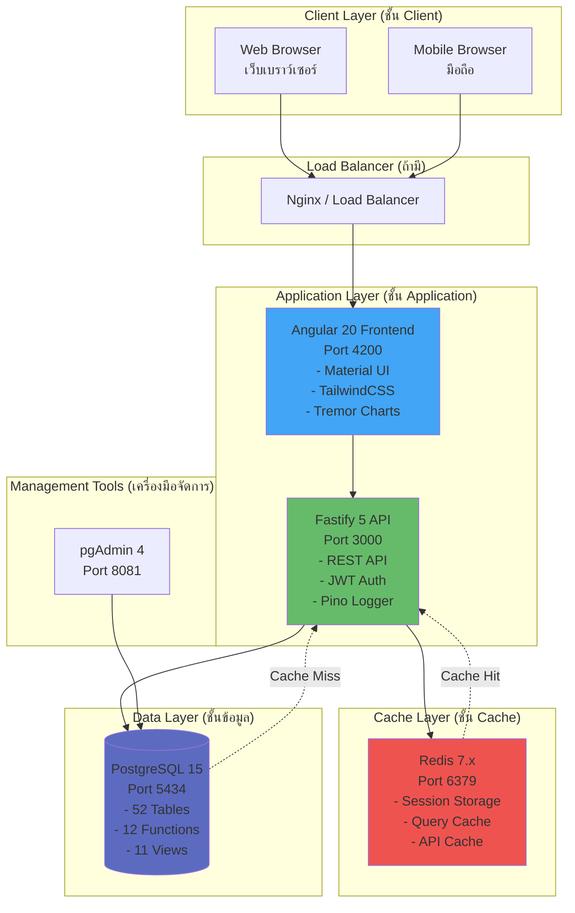
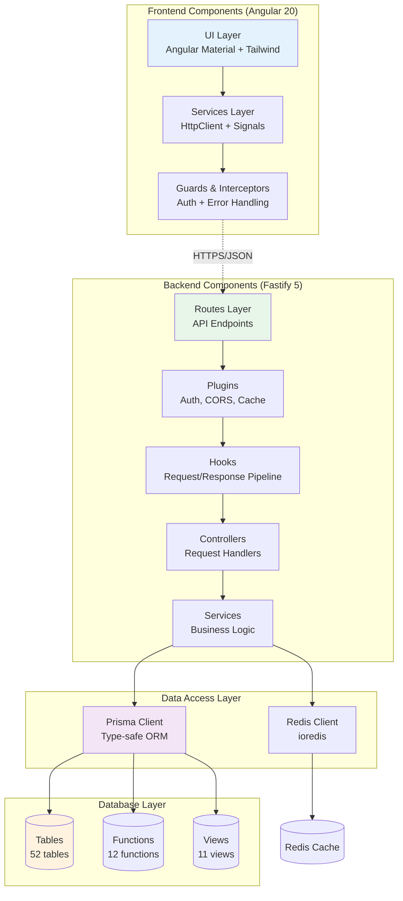
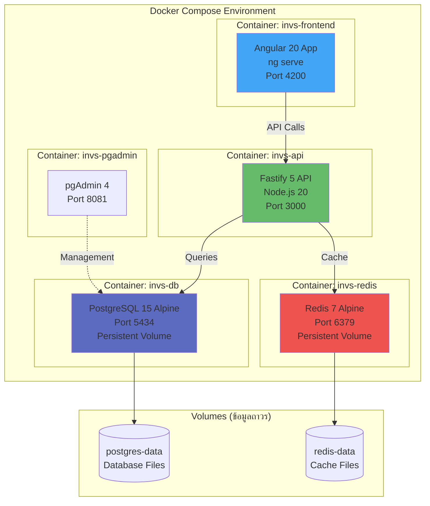
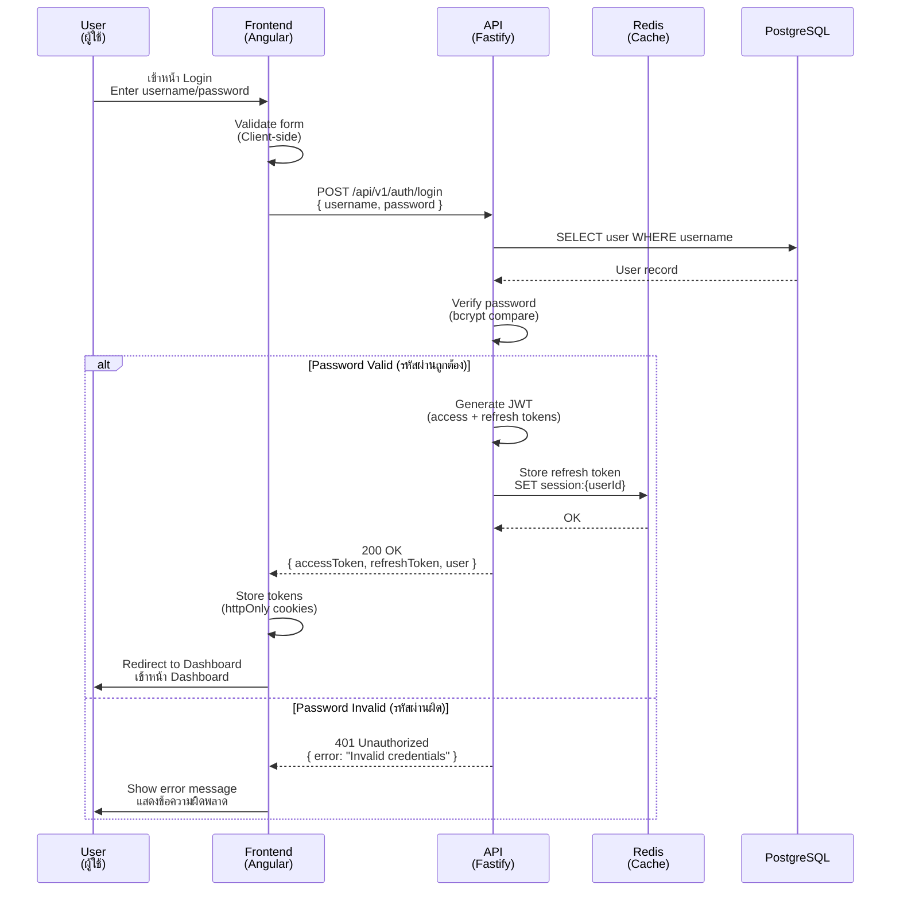
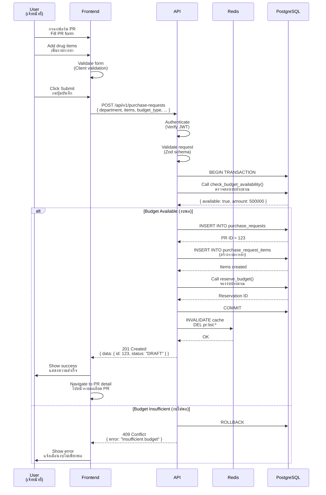
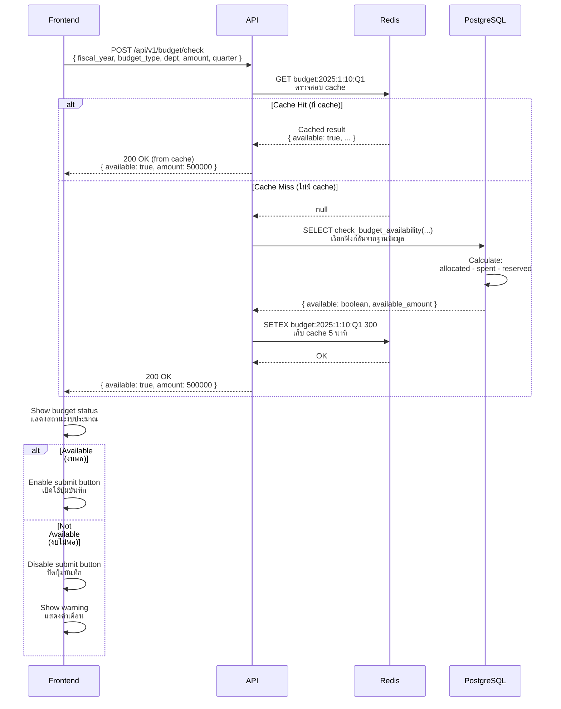
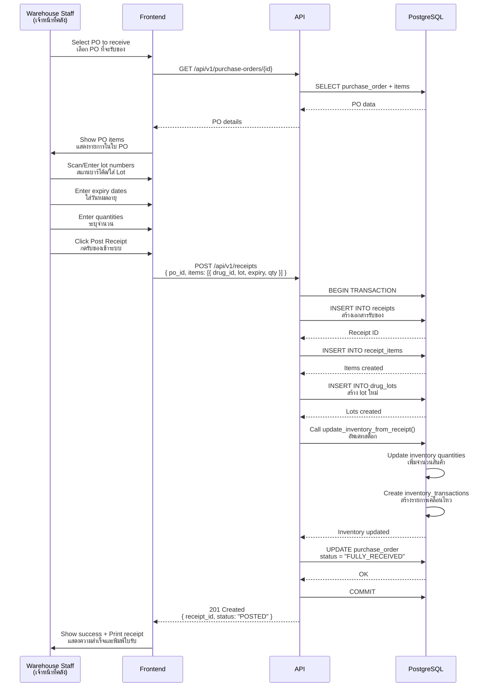
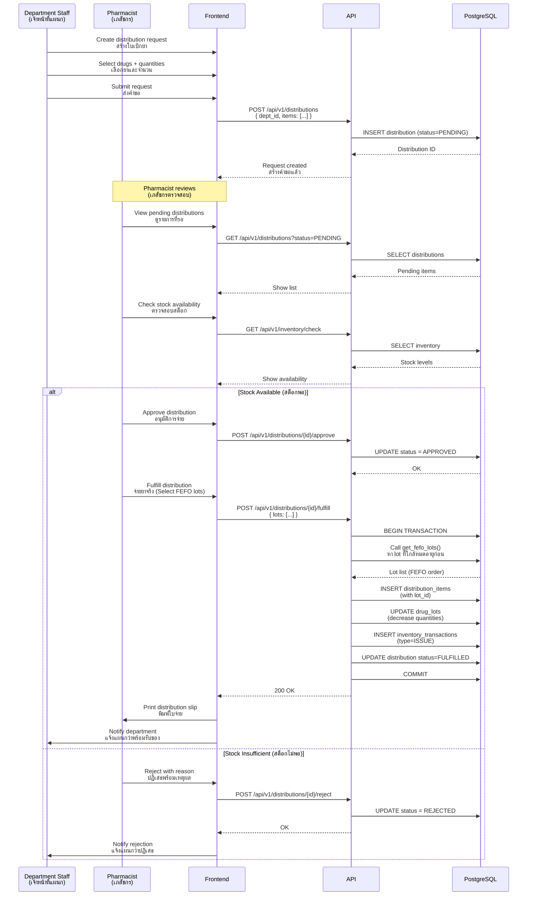

# ⚙️ Technical Requirements Document (TRD)

**Project:** INVS Modern - Hospital Inventory Management System
**Version:** 3.0.0
**Date:** 2025-01-23
**Status:** Production Ready (Database Schema Phase) - Updated Tech Stack

---

## 1. Executive Summary

### 1.1 Technical Overview

INVS Modern is built as a modern, type-safe database-centric application using PostgreSQL 15, Prisma ORM, and TypeScript. The architecture emphasizes data integrity, business logic at the database layer, and comprehensive audit trails.

### 1.2 Current Implementation Status

- ✅ **Database Schema**: 57 tables, 30 enums, 11 views, 12 functions
- ✅ **Data Migration**: ~101,000 records (Phases 1-15 complete)
- ✅ **Ministry Compliance**: 100% (79/79 fields)
- ⏳ **Backend API**: Not started (planned)
- ⏳ **Frontend**: Not started (planned)

### 1.3 Technology Stack

**Database Tier:** (ระดับฐานข้อมูล)

- PostgreSQL 15-alpine - ฐานข้อมูลหลักที่มีความเสถียรสูง
- Prisma ORM 5.x - เครื่องมือจัดการฐานข้อมูลแบบ Type-safe
- Database Functions (Business logic in PL/pgSQL) - ฟังก์ชันธุรกิจในฐานข้อมูล
- Materialized Views - มุมมองข้อมูลสำหรับรายงานและเพิ่มประสิทธิภาพ
- Redis 7.x - In-memory cache สำหรับเพิ่มประสิทธิภาพการเรียกข้อมูล

**Backend API Tier:** (ระดับ API)

- Node.js 20.x LTS - แพลตฟอร์มรันไทม์
- TypeScript 5.x (Strict mode) - ภาษาพัฒนาที่มี Type Safety
- Fastify 5.x - เว็บเฟรมเวิร์คที่มีประสิทธิภาพสูง (Fast & Low Overhead)
- Zod - ตัวตรวจสอบข้อมูลและสร้าง Schema
- JWT (RS256) - ระบบการยืนยันตัวตนด้วย JSON Web Token
- Redis - Session storage & caching layer

**Frontend Tier:** (ระดับ Frontend)

- Angular 20+ - เฟรมเวิร์คสำหรับพัฒนา Web Application
- TypeScript 5.x - ภาษาพัฒนา Frontend
- Angular Material UI - ชุดคอมโพเนนต์ UI ตาม Material Design 3
- TailwindCSS 3.x - Utility-first CSS framework
- Tremor - ชุดคอมโพเนนต์สำหรับ Dashboard และ Charts
- RxJS - Reactive programming สำหรับจัดการ async data

---

## 2. System Architecture

### 2.1 Architecture Style

**Three-Tier Architecture** with emphasis on database-centric design:
**สถาปัตยกรรมแบบ 3 ชั้น** โดยเน้นการออกแบบที่ฐานข้อมูลเป็นศูนย์กลาง

```
┌─────────────────────────────────────────────────┐
│           Frontend (Web Browser)                │
│           ส่วน Frontend (เว็บเบราว์เซอร์)       │
│  Angular 20 + TypeScript + Angular Material     │
│  - Standalone Components                        │
│  - Signals (Reactive State)                     │
│  - Material Design 3 UI                         │
│  - TailwindCSS + Tremor (Charts)                │
└───────────────┬─────────────────────────────────┘
                │ HTTPS/JSON
                │ REST API
┌───────────────▼─────────────────────────────────┐
│           Backend API Server                    │
│           เซิร์ฟเวอร์ API                        │
│  Node.js 20 + Fastify 5 + Prisma                │
│  - JWT Authentication (RS256)                   │
│  - Request Validation (Zod)                     │
│  - Business Logic Orchestration                 │
│  - Error Handling & Logging                     │
│  - Redis Cache Layer                            │
└───────────────┬─────────────────────────────────┘
                │ Prisma Client
                │ Type-safe queries
                │ + Redis Cache
┌───────────────▼─────────────────────────────────┐
│        PostgreSQL Database + Redis Cache        │
│        ฐานข้อมูล PostgreSQL + Redis            │
│  PostgreSQL:                                    │
│  - 57 Tables (Normalized 3NF)                   │
│  - 30 Enums (Type safety)                       │
│  - 12 Functions (Business logic)                │
│  - 11 Views (Reporting)                         │
│  - Audit Triggers                               │
│  Redis:                                         │
│  - Session Storage                              │
│  - Query Result Cache (5-10 min)               │
│  - API Response Cache                           │
└─────────────────────────────────────────────────┘
```

### 2.2 Design Principles

**Database-Centric Design:**

- Critical business logic implemented as database functions
- Data validation at database level (constraints, triggers)
- Atomic transactions ensure consistency
- Views provide denormalized data for reporting

**Type Safety Throughout:**

- Prisma generates TypeScript types from database schema
- Zod validates runtime data at API boundaries
- TypeScript strict mode catches compile-time errors
- No `any` types allowed

**Separation of Concerns:**

- Database: Data integrity and business rules
- Backend: API orchestration and authentication
- Frontend: User interface and experience

### 2.3 System Diagrams

### ไดอะแกรมระบบ

#### 2.3.1 Network Architecture Diagram

#### แผนผังสถาปัตยกรรมเครือข่าย



#### 2.3.2 Component Architecture Diagram

#### แผนผังสถาปัตยกรรมคอมโพเนนต์



#### 2.3.3 Deployment Architecture Diagram

#### แผนผังการติดตั้งระบบ



---

## 3. Database Technical Requirements

### 3.1 Database Server (TR-DB-001)

**PostgreSQL Configuration:**

```
Version: PostgreSQL 15.x
Max Connections: 100
Shared Buffers: 1GB (25% of RAM)
Effective Cache Size: 3GB (75% of RAM)
Work Memory: 10MB
Maintenance Work Memory: 256MB
WAL Level: replica
Max WAL Size: 2GB
Checkpoint Completion Target: 0.9
```

**Container Specifications:**

```yaml
Image: postgres:15-alpine
CPU: 2 cores minimum
RAM: 4GB minimum, 8GB recommended
Storage: 100GB SSD with 1000 IOPS
Network: Private network only
```

**Connection Pooling:**

- Prisma connection pool size: 10-20 connections
- Connection timeout: 10 seconds
- Idle timeout: 600 seconds
- Statement timeout: 30 seconds

**Acceptance Criteria:**

- Database handles 100 concurrent connections
- Query response time <100ms for indexed lookups
- Transaction commit time <50ms
- Backup completion time <30 minutes

### 3.2 Schema Design (TR-DB-002)

**Normalization:**

- All tables in Third Normal Form (3NF)
- No repeating groups
- No transitive dependencies
- Foreign key constraints enforced

**Primary Keys:**

- All tables have `id` as primary key
- Type: SERIAL (auto-increment integer)
- Surrogate keys preferred over natural keys

**Timestamps:**

- All tables have `created_at TIMESTAMP DEFAULT NOW()`
- Mutable tables have `updated_at TIMESTAMP DEFAULT NOW()`
- Update trigger maintains `updated_at` automatically

**Soft Deletes:**

- Critical tables (transactions, audit logs): No deletes allowed
- Master data: `deleted_at TIMESTAMP NULL` for soft delete
- Views filter out soft-deleted records

**Audit Trail:**

- All state changes logged with user ID and timestamp
- Audit log table: `audit_logs (entity_type, entity_id, action, old_value, new_value, user_id, timestamp)`
- Retention: 10 years

**Acceptance Criteria:**

- No orphaned foreign keys (verified by FK constraints)
- No data redundancy (verified by normalization rules)
- All timestamps in UTC timezone
- Audit logs capture 100% of critical operations

### 3.3 Database Functions (TR-DB-003)

**Business Logic Functions (12 implemented):**

**Budget Management Functions:**

```sql
-- Check budget availability
check_budget_availability(
  fiscal_year INT,
  budget_type_id INT,
  department_id INT,
  amount DECIMAL,
  quarter INT
) RETURNS TABLE(available BOOLEAN, available_amount DECIMAL)

-- Reserve budget
reserve_budget(
  allocation_id INT,
  pr_id INT,
  amount DECIMAL,
  expires_days INT DEFAULT 30
) RETURNS INT

-- Commit budget
commit_budget(
  allocation_id INT,
  po_id INT,
  amount DECIMAL,
  quarter INT
) RETURNS BOOLEAN

-- Release reservation
release_budget_reservation(
  reservation_id INT
) RETURNS BOOLEAN
```

**Budget Planning Functions:**

```sql
-- Check drug in budget plan
check_drug_in_budget_plan(
  fiscal_year INT,
  department_id INT,
  generic_id INT,
  requested_qty DECIMAL,
  quarter INT
) RETURNS TABLE(in_plan BOOLEAN, planned_qty DECIMAL, remaining_qty DECIMAL)

-- Update budget plan purchase
update_budget_plan_purchase(
  plan_item_id INT,
  quantity DECIMAL,
  value DECIMAL,
  quarter INT
) RETURNS BOOLEAN
```

**Inventory Functions:**

```sql
-- Get FIFO lots
get_fifo_lots(
  drug_id INT,
  location_id INT,
  quantity_needed DECIMAL
) RETURNS TABLE(lot_id INT, lot_number TEXT, quantity DECIMAL, expiry_date DATE)

-- Get FEFO lots
get_fefo_lots(
  drug_id INT,
  location_id INT,
  quantity_needed DECIMAL
) RETURNS TABLE(lot_id INT, lot_number TEXT, quantity DECIMAL, expiry_date DATE)

-- Update inventory from receipt
update_inventory_from_receipt(
  receipt_id INT
) RETURNS BOOLEAN
```

**Performance Requirements:**

- Budget availability check: <500ms
- Lot selection (FIFO/FEFO): <200ms
- Inventory update: <100ms
- All functions use prepared statements

**Acceptance Criteria:**

- Functions handle edge cases (zero quantity, null inputs)
- Functions roll back on error
- Functions log execution in audit trail
- Unit tests cover 100% of function logic

### 3.4 Database Views (TR-DB-004)

**Reporting Views (11 implemented):**

**Ministry Export Views (5 views):**

```sql
export_druglist          -- 11 fields for drug catalog
export_purchase_plan     -- 20 fields for purchase planning
export_receipt           -- 22 fields for goods receiving
export_distribution      -- 11 fields for distribution
export_inventory         -- 15 fields for stock status
```

**Operational Views (6 views):**

```sql
budget_status_current         -- Real-time budget by department
expiring_drugs                -- Drugs expiring in 30/60/90 days
low_stock_items               -- Items below reorder point
current_stock_summary         -- Stock by location
budget_reservations_active    -- Active reservations
purchase_order_status         -- PO tracking
```

**View Requirements:**

- Views use efficient joins (indexed columns)
- Complex views use materialized views
- Materialized views refresh every 1 hour
- Views respect soft-delete filters

**Acceptance Criteria:**

- View queries return in <1 second for 10,000 rows
- Ministry export views pass validation 100%
- Views include helpful column aliases

### 3.5 Enums and Types (TR-DB-005)

**Enums Implemented (22 enums):**

- `UserRole` - 6 roles (ADMIN, PHARMACIST, PROCUREMENT_OFFICER, DEPARTMENT_STAFF, DIRECTOR, AUDITOR)
- `PrStatus` - 8 states (DRAFT, SUBMITTED, BUDGET_CHECK, BUDGET_RESERVED, APPROVED, REJECTED, CANCELLED, PO_CREATED)
- `PoStatus` - 9 states (DRAFT, PENDING_APPROVAL, APPROVED, SENT, PARTIAL_RECEIVED, FULLY_RECEIVED, COMPLETED, CANCELLED, CLOSED)
- `ReceiptStatus` - 4 states (DRAFT, INSPECTING, APPROVED, POSTED)
- `ReservationStatus` - 4 states (ACTIVE, COMMITTED, RELEASED, EXPIRED)
- `TransactionType` - 5 types (RECEIVE, ISSUE, TRANSFER, ADJUST, RETURN)
- `DistributionStatus` - 4 states (DRAFT, PENDING, APPROVED, FULFILLED)
- `ReturnStatus` - 4 states (DRAFT, INSPECTING, APPROVED, COMPLETED)
- `NlemStatus` - 2 values (E=Essential, N=Non-essential)
- `DrugStatus` - 4 values (1=Active, 2=Inactive, 3=Discontinued, 4=Out of stock)
- `ProductCategory` - 5 values (1=Drug, 2=Supply, 3=Equipment, 4=Chemical, 5=Other)
- `DeptConsumptionGroup` - 9 values (1=OPD, 2=IPD, 3=Emergency, etc.)
- 10 more enums for various classifications

**Enum Requirements:**

- All enums defined in Prisma schema
- Enum values match ministry standards
- Enum changes require migration
- No magic strings in code

**Acceptance Criteria:**

- 100% type safety (no string literals)
- Database constraints enforce enum values
- API returns enum values as strings
- Frontend displays localized enum labels

---

## 4. Backend API Technical Requirements

### 4.1 API Architecture (TR-API-001)

**Framework:** Fastify 5.x (เฟรมเวิร์คที่เน้นความเร็วและประสิทธิภาพ)
**API Style:** RESTful JSON API
**API Version:** v1 (URL prefix: `/api/v1`)

**เหตุผลในการเลือก Fastify 5:**

- ประสิทธิภาพสูงกว่า Express (~30% faster)
- Built-in schema validation (JSON Schema)
- TypeScript support out of the box
- Plugin architecture ที่ยืดหยุ่น
- Async/await first-class support
- Low overhead และ memory footprint ต่ำ

**Directory Structure:** (โครงสร้างไดเรกทอรี)

```
src/
├── app.ts                   # Fastify app setup & plugins
├── server.ts                # Server entry point
├── lib/
│   ├── prisma.ts           # Prisma client singleton
│   ├── redis.ts            # Redis client
│   ├── jwt.ts              # JWT utilities
│   └── logger.ts           # Pino logger (Fastify default)
├── plugins/
│   ├── auth.plugin.ts      # JWT authentication plugin
│   ├── rbac.plugin.ts      # Role-based access control
│   ├── cors.plugin.ts      # CORS configuration
│   └── cache.plugin.ts     # Redis caching plugin
├── hooks/
│   ├── onRequest.hook.ts   # Request logging
│   ├── preHandler.hook.ts  # Validation hooks
│   └── onError.hook.ts     # Error handling hooks
├── routes/
│   ├── auth.routes.ts      # /api/v1/auth
│   ├── drugs.routes.ts     # /api/v1/drugs
│   ├── pr.routes.ts        # /api/v1/purchase-requests
│   ├── po.routes.ts        # /api/v1/purchase-orders
│   ├── inventory.routes.ts # /api/v1/inventory
│   ├── distribution.routes.ts
│   └── reports.routes.ts
├── controllers/
│   └── [entity].controller.ts  # Request handlers
├── services/
│   └── [entity].service.ts     # Business logic
├── schemas/
│   └── [entity].schema.ts      # Zod validation schemas
└── types/
    └── [entity].types.ts        # TypeScript types
```

**Layered Architecture:** (สถาปัตยกรรมแบบแยกชั้น)

- **Routes**: HTTP routing และ request parsing
- **Plugins**: Fastify plugins สำหรับ authentication, caching, CORS
- **Hooks**: Lifecycle hooks สำหรับ validation, logging, error handling
- **Controllers**: Request/response handling (รับ-ส่งข้อมูล)
- **Services**: Business logic orchestration (ตรรกะธุรกิจ)
- **Prisma Client**: Database access (เข้าถึงฐานข้อมูล)
- **Redis Client**: Caching layer (ระบบ cache)

**Fastify-Specific Features:**

- **Plugins**: แบ่งโมดูลด้วย Plugin architecture
- **Hooks**: ใช้ Fastify lifecycle hooks แทน middleware
- **Schema-based Validation**: ใช้ JSON Schema หรือ Zod
- **Serialization**: Auto JSON serialization
- **Decorators**: Request/Reply decorators สำหรับเพิ่ม functionality

**Acceptance Criteria:**

- Clear separation of concerns (แยกหน้าที่ชัดเจน)
- Dependency injection for testability (ทดสอบได้ง่าย)
- No business logic in controllers (ไม่มีตรรกะธุรกิจใน controller)
- All database access via Prisma (เข้าฐานข้อมูลผ่าน Prisma เท่านั้น)
- Redis caching for read-heavy endpoints (ใช้ Redis cache สำหรับ endpoint ที่อ่านข้อมูลบ่อย)

### 4.2 Authentication (TR-API-002)

**JWT Implementation:**

```typescript
interface JWTPayload {
  userId: number;
  username: string;
  role: UserRole;
  departmentId: number | null;
  iat: number; // Issued at
  exp: number; // Expiry
}
```

**Token Configuration:**

- Algorithm: RS256 (asymmetric)
- Access token expiry: 1 hour
- Refresh token expiry: 7 days
- Token storage: httpOnly secure cookie (no localStorage)

**Authentication Flow:**

```
POST /api/v1/auth/login
  ← { username, password }
  → { accessToken, refreshToken, user }

POST /api/v1/auth/refresh
  ← { refreshToken }
  → { accessToken }

POST /api/v1/auth/logout
  → Invalidate refresh token
```

**Password Security:**

- Hashing: bcrypt with cost factor 12
- Minimum length: 8 characters
- Complexity: 1 uppercase, 1 lowercase, 1 number, 1 special char
- Lockout: 5 failed attempts → 15 min lockout

**Acceptance Criteria:**

- All API endpoints require authentication (except /auth/login)
- Expired tokens return 401 Unauthorized
- Failed logins are rate-limited
- Passwords never logged or returned in API

### 4.3 Authorization (TR-API-003)

**Role-Based Access Control (RBAC):**

| Role                    | Permissions                                            |
| ----------------------- | ------------------------------------------------------ |
| **ADMIN**               | Full access to all resources                           |
| **PHARMACIST**          | Manage drugs, inventory, distributions, returns        |
| **PROCUREMENT_OFFICER** | Manage PRs, POs, receipts, vendors                     |
| **DEPARTMENT_STAFF**    | Create distribution requests, view own department data |
| **DIRECTOR**            | Approve PRs/POs, view all reports                      |
| **AUDITOR**             | Read-only access to all data + audit logs              |

**Authorization Middleware:**

```typescript
// Require specific role
requireRole(['ADMIN', 'PHARMACIST']);

// Require own resource or admin
requireOwnershipOrAdmin(resourceId);

// Require department access
requireDepartmentAccess(departmentId);
```

**Acceptance Criteria:**

- Unauthorized access returns 403 Forbidden
- Role checks happen before business logic
- Department-level data isolation enforced
- Audit logs record authorization failures

### 4.4 Request Validation (TR-API-004)

**Validation Library:** Zod

**Validation Strategy:**

- All request bodies validated with Zod schemas
- All query parameters validated
- All path parameters validated
- Validation errors return 400 Bad Request

**Example Validator:**

```typescript
// validators/pr.validator.ts
import { z } from 'zod';

export const createPrSchema = z.object({
  body: z.object({
    department_id: z.number().int().positive(),
    budget_type_id: z.number().int().positive(),
    fiscal_year: z.number().int().min(2020).max(2100),
    quarter: z.number().int().min(1).max(4),
    justification: z.string().min(10).max(500),
    items: z
      .array(
        z.object({
          drug_id: z.number().int().positive(),
          quantity: z.number().positive(),
          unit_price: z.number().positive(),
        }),
      )
      .min(1)
      .max(100),
  }),
});

// Usage in route
router.post('/purchase-requests', authenticate, validate(createPrSchema), prController.create);
```

**Acceptance Criteria:**

- Invalid requests return helpful error messages
- Validation happens before database access
- Zod schemas co-located with TypeScript types
- Validation errors include field-level details

### 4.5 Error Handling (TR-API-005)

**Error Response Format:**

```typescript
interface ErrorResponse {
  error: {
    code: string; // Machine-readable error code
    message: string; // Human-readable message
    details?: any; // Additional error details
    timestamp: string; // ISO 8601 timestamp
    path: string; // Request path
    requestId: string; // Trace ID for debugging
  };
}
```

**Error Types:**

- 400 Bad Request: Validation errors
- 401 Unauthorized: Authentication failure
- 403 Forbidden: Authorization failure
- 404 Not Found: Resource not found
- 409 Conflict: Business rule violation (e.g., budget exceeded)
- 422 Unprocessable Entity: Business logic error
- 500 Internal Server Error: Unexpected errors

**Error Handling Middleware:**

```typescript
app.use((err, req, res, next) => {
  logger.error('Error:', { err, req: { method: req.method, url: req.url } });

  if (err instanceof ZodError) {
    return res.status(400).json({ error: formatZodError(err) });
  }

  if (err instanceof PrismaClientKnownRequestError) {
    return res.status(409).json({ error: formatPrismaError(err) });
  }

  return res.status(500).json({
    error: {
      code: 'INTERNAL_ERROR',
      message: 'An unexpected error occurred',
      timestamp: new Date().toISOString(),
      path: req.path,
      requestId: req.id,
    },
  });
});
```

**Acceptance Criteria:**

- All errors return consistent JSON format
- Stack traces only in development mode
- Errors are logged with context
- Request IDs enable error tracing

### 4.6 API Endpoints (TR-API-006)

**Required Endpoints:**

**Authentication:**

- `POST /api/v1/auth/login` - User login
- `POST /api/v1/auth/logout` - User logout
- `POST /api/v1/auth/refresh` - Refresh access token
- `GET /api/v1/auth/me` - Get current user info

**Drugs:**

- `GET /api/v1/drugs` - List drugs (with search, pagination)
- `GET /api/v1/drugs/:id` - Get drug details
- `POST /api/v1/drugs` - Create drug (PHARMACIST, ADMIN)
- `PUT /api/v1/drugs/:id` - Update drug (PHARMACIST, ADMIN)
- `DELETE /api/v1/drugs/:id` - Delete drug (ADMIN only)
- `GET /api/v1/drugs/:id/lots` - Get drug lots
- `GET /api/v1/drugs/search` - Search drugs (autocomplete)

**Purchase Requests:**

- `GET /api/v1/purchase-requests` - List PRs (filtered by role)
- `GET /api/v1/purchase-requests/:id` - Get PR details
- `POST /api/v1/purchase-requests` - Create PR
- `PUT /api/v1/purchase-requests/:id` - Update PR (DRAFT only)
- `POST /api/v1/purchase-requests/:id/submit` - Submit PR for approval
- `POST /api/v1/purchase-requests/:id/approve` - Approve PR (DIRECTOR)
- `POST /api/v1/purchase-requests/:id/reject` - Reject PR (DIRECTOR)
- `POST /api/v1/purchase-requests/:id/cancel` - Cancel PR
- `GET /api/v1/purchase-requests/:id/budget-check` - Check budget availability

**Purchase Orders:**

- `GET /api/v1/purchase-orders` - List POs
- `GET /api/v1/purchase-orders/:id` - Get PO details
- `POST /api/v1/purchase-orders/:id/approve` - Approve PO
- `POST /api/v1/purchase-orders/:id/send` - Send PO to vendor
- `GET /api/v1/purchase-orders/:id/pdf` - Generate PO PDF

**Inventory:**

- `GET /api/v1/inventory` - List inventory (by location)
- `GET /api/v1/inventory/:drug_id/locations/:location_id` - Get stock level
- `GET /api/v1/inventory/low-stock` - Low stock items
- `GET /api/v1/inventory/expiring` - Expiring drugs
- `POST /api/v1/inventory/adjust` - Stock adjustment (PHARMACIST)
- `GET /api/v1/inventory/transactions` - Transaction history

**Distributions:**

- `GET /api/v1/distributions` - List distribution requests
- `GET /api/v1/distributions/:id` - Get distribution details
- `POST /api/v1/distributions` - Create distribution request
- `POST /api/v1/distributions/:id/approve` - Approve distribution
- `POST /api/v1/distributions/:id/fulfill` - Fulfill distribution

**Reports:**

- `GET /api/v1/reports/budget-status` - Budget status report
- `GET /api/v1/reports/ministry/druglist` - Ministry DRUGLIST export
- `GET /api/v1/reports/ministry/receipt` - Ministry RECEIPT export
- `GET /api/v1/reports/procurement-summary` - Procurement summary
- `GET /api/v1/reports/inventory-valuation` - Inventory valuation

**API Response Format:**

```typescript
// Success response
{
  data: T,              // Response data
  meta?: {              // Optional metadata
    total: number,      // Total records (for pagination)
    page: number,       // Current page
    limit: number,      // Records per page
  }
}

// List response with pagination
GET /api/v1/drugs?page=2&limit=50&search=paracetamol
{
  data: Drug[],
  meta: {
    total: 1169,
    page: 2,
    limit: 50,
    totalPages: 24
  }
}
```

**Acceptance Criteria:**

- All endpoints documented with OpenAPI/Swagger
- Response times <500ms for simple queries
- Pagination for all list endpoints
- Search supports partial matching (ILIKE)
- Filters support common use cases

### 4.7 Performance (TR-API-007)

**Requirements:** (ข้อกำหนดด้านประสิทธิภาพ)

- API response time <500ms (p95) - เวลาตอบสนอง API
- Database query time <200ms (p95) - เวลา query ฐานข้อมูล
- Support 100 concurrent requests - รองรับผู้ใช้พร้อมกัน 100 คน
- Throughput: 1,000 requests per minute - ปริมาณการทำงานต่อนาที
- Connection pooling with 10-20 connections - Pool การเชื่อมต่อฐานข้อมูล

**Optimization Strategies:** (กลยุทธ์เพิ่มประสิทธิภาพ)

**1. Database Optimization:**

- Database indexes on foreign keys and search fields (สร้าง index บน FK และฟิลด์ค้นหา)
- Prisma query optimization (select only needed fields) - เลือกเฉพาะฟิลด์ที่ต้องการ
- Materialized views for complex reports (ใช้ materialized view สำหรับรายงานซับซ้อน)
- Database connection pooling (10-20 connections) - จัดการ connection pool

**2. Redis Caching Strategy:**

```typescript
// Cache configuration
const cacheConfig = {
  // Master data - Cache for 1 hour (ข้อมูลหลัก)
  drugs: { ttl: 3600 },
  drug_generics: { ttl: 3600 },
  companies: { ttl: 3600 },
  departments: { ttl: 3600 },

  // Operational data - Cache for 5 minutes (ข้อมูลปฏิบัติการ)
  inventory: { ttl: 300 },
  budget_status: { ttl: 300 },

  // Reports - Cache for 10 minutes (รายงาน)
  low_stock_report: { ttl: 600 },
  expiring_drugs: { ttl: 600 },

  // Session storage - 1 day (เก็บ session)
  user_session: { ttl: 86400 },
};
```

**3. Fastify-Specific Optimizations:**

- Schema compilation and validation caching
- JSON serialization optimization
- Async/await for non-blocking I/O
- Multipart form handling optimization
- Static file serving via `@fastify/static`

**4. API Response Optimization:**

- Pagination limits (max 100 records per page) - จำกัดจำนวนข้อมูลต่อหน้า
- Field selection (GraphQL-like sparse fieldsets) - เลือกฟิลด์ที่ต้องการ
- Response compression (gzip/brotli) - บีบอัดข้อมูล
- ETags for conditional requests - ใช้ ETag เพื่อลด bandwidth

**5. Redis Caching Implementation:**

```typescript
// Example caching decorator
async function getCachedDrugs(params: DrugSearchParams) {
  const cacheKey = `drugs:${JSON.stringify(params)}`;

  // Try cache first
  const cached = await redis.get(cacheKey);
  if (cached) {
    return JSON.parse(cached);
  }

  // Query database
  const drugs = await prisma.drug.findMany({
    where: params,
  });

  // Store in cache
  await redis.setex(cacheKey, 300, JSON.stringify(drugs));

  return drugs;
}
```

**Monitoring:** (การติดตามและตรวจสอบ)

- Log slow queries (>500ms) - บันทึก query ที่ช้า
- Track API endpoint latencies - ติดตามความเร็ว API
- Monitor database connection pool - ตรวจสอบ connection pool
- Alert on error rate >1% - แจ้งเตือนเมื่อ error เกิน 1%
- Redis cache hit rate monitoring - ตรวจสอบอัตราการใช้ cache

**Acceptance Criteria:**

- Load testing confirms 100 concurrent users
- Slow queries are identified and optimized
- Redis cache hit rate >80% for master data
- API latency dashboard available
- Performance regressions caught in CI/CD

### 4.8 Logging (TR-API-008)

**Logging Library:** Pino (Fastify's default logger - เร็วกว่า Winston ~5x)

**เหตุผลในการเลือก Pino:**

- เร็วกว่า Winston และ Bunyan อย่างมาก
- Asynchronous logging (ไม่ block event loop)
- Low overhead (ใช้ CPU และ memory น้อย)
- Built-in support ใน Fastify
- JSON output โดย default

**Log Levels:** (ระดับการบันทึก Log)

- **fatal**: ข้อผิดพลาดร้ายแรงที่ระบบหยุดทำงาน
- **error**: ข้อผิดพลาดที่ต้องแก้ไขทันที
- **warn**: สถานการณ์เตือน
- **info**: ข้อความข้อมูลทั่วไป
- **debug**: ข้อความสำหรับ debug (เฉพาะ development)
- **trace**: รายละเอียดมากที่สุด (เฉพาะ debugging ลึก)

**Log Format:**

```json
{
  "level": 30,
  "time": 1706001045123,
  "pid": 12345,
  "hostname": "invs-api-01",
  "reqId": "req-abc-123",
  "req": {
    "method": "POST",
    "url": "/api/v1/purchase-requests",
    "remoteAddress": "192.168.1.100"
  },
  "userId": 123,
  "department": "Pharmacy",
  "msg": "PR created successfully",
  "prId": 456,
  "responseTime": 234
}
```

**Pino Configuration:**

```typescript
import pino from 'pino';

const logger = pino({
  level: process.env.LOG_LEVEL || 'info',
  transport:
    process.env.NODE_ENV === 'development'
      ? {
          target: 'pino-pretty', // Pretty print for development
          options: {
            colorize: true,
            translateTime: 'SYS:standard',
            ignore: 'pid,hostname',
          },
        }
      : undefined,
  redact: ['req.headers.authorization', 'password'], // Hide sensitive data
});
```

**What to Log:**

- All API requests (method, path, user, duration)
- Authentication events (login, logout, failed attempts)
- Authorization failures
- Business logic errors
- Database query errors
- Slow queries (>500ms)

**What NOT to Log:**

- Passwords or tokens
- Personal sensitive data
- Full request bodies (only IDs)

**Acceptance Criteria:**

- Logs are JSON formatted for parsing
- Logs include request ID for tracing
- Log rotation: 10 files, 10MB each
- Logs retained for 90 days

### 4.9 Workflow Sequence Diagrams

### ลำดับการทำงานของระบบ (Sequence Diagrams)

#### 4.9.1 User Authentication Flow

#### ลำดับการ Login (การเข้าสู่ระบบ)



#### 4.9.2 Purchase Request Creation Flow

#### ลำดับการสร้างใบขอซื้อ (PR)



#### 4.9.3 Budget Check Flow

#### ลำดับการตรวจสอบงบประมาณ



#### 4.9.4 Goods Receiving Flow

#### ลำดับการรับของ (Receipt)



#### 4.9.5 Drug Distribution Flow

#### ลำดับการจ่ายยาไปแผนก



---

## 5. Frontend Technical Requirements

## ข้อกำหนดทางเทคนิคด้าน Frontend

### 5.1 Frontend Architecture (TR-FE-001)

**Framework:** Angular 20+ with TypeScript
**เฟรมเวิร์ค:** Angular 20+ พร้อม TypeScript
**Build Tool:** Angular CLI + esbuild (faster than Webpack)
**State Management:** RxJS + Signals (Angular's reactive primitives)
**Routing:** Angular Router
**UI Library:** Angular Material UI + TailwindCSS + Tremor

**Angular 20 Key Features:**

- **Standalone Components** - ไม่ต้องใช้ NgModule
- **Signals** - Reactive state management ที่เร็วกว่า RxJS
- **New Control Flow** - @if, @for, @switch แทน *ngIf, *ngFor
- **Deferrable Views** - @defer สำหรับ lazy loading
- **Built-in Control Flow** - ลดการใช้ directives
- **Improved SSR/SSG** - Server-side rendering ที่ดีขึ้น

**Directory Structure:** (โครงสร้างไดเรกทอรี)

```
src/
├── main.ts                     # App entry point
├── app/
│   ├── app.config.ts          # App configuration (standalone)
│   ├── app.routes.ts          # Routing configuration
│   ├── app.component.ts       # Root component
│   │
│   ├── core/
│   │   ├── services/
│   │   │   ├── auth.service.ts        # Authentication
│   │   │   ├── api.service.ts         # HTTP client wrapper
│   │   │   └── error.service.ts       # Error handling
│   │   ├── interceptors/
│   │   │   ├── auth.interceptor.ts    # JWT token
│   │   │   ├── error.interceptor.ts   # Error handling
│   │   │   └── cache.interceptor.ts   # HTTP caching
│   │   ├── guards/
│   │   │   ├── auth.guard.ts          # Route protection
│   │   │   └── role.guard.ts          # RBAC guard
│   │   └── models/
│   │       └── *.model.ts             # Data models
│   │
│   ├── shared/
│   │   ├── components/
│   │   │   ├── data-table/           # Reusable table
│   │   │   ├── status-badge/         # Status display
│   │   │   ├── search-input/         # Search box
│   │   │   └── pagination/           # Pagination
│   │   ├── directives/
│   │   │   └── permission.directive.ts
│   │   ├── pipes/
│   │   │   ├── thai-date.pipe.ts     # Buddhist calendar
│   │   │   └── currency-thb.pipe.ts  # THB formatting
│   │   └── utils/
│   │       ├── formatters.ts
│   │       └── validators.ts
│   │
│   ├── features/
│   │   ├── auth/
│   │   │   ├── login/
│   │   │   │   ├── login.component.ts
│   │   │   │   └── login.component.html
│   │   │   └── auth.routes.ts
│   │   │
│   │   ├── drugs/
│   │   │   ├── drug-list/
│   │   │   ├── drug-detail/
│   │   │   ├── drug-form/
│   │   │   ├── services/
│   │   │   │   └── drug.service.ts
│   │   │   └── drugs.routes.ts
│   │   │
│   │   ├── purchase-requests/
│   │   │   ├── pr-list/
│   │   │   ├── pr-form/          # Multi-step wizard
│   │   │   ├── pr-approval/
│   │   │   ├── services/
│   │   │   │   └── pr.service.ts
│   │   │   └── pr.routes.ts
│   │   │
│   │   ├── inventory/
│   │   ├── distribution/
│   │   └── reports/
│   │
│   └── layout/
│       ├── header/
│       ├── sidebar/
│       └── main-layout/
│
├── assets/
│   ├── i18n/
│   │   ├── th.json                # Thai translations
│   │   └── en.json                # English translations
│   └── styles/
│       ├── material-theme.scss    # Material Design theme
│       └── tailwind.css
│
└── environments/
    ├── environment.ts             # Development config
    └── environment.prod.ts        # Production config
```

**Angular Architecture Patterns:**

- **Smart/Container Components**: Handle business logic (มีตรรกะธุรกิจ)
- **Dumb/Presentational Components**: Pure UI components (แสดงผลเท่านั้น)
- **Services**: Business logic and API calls (ตรรกะธุรกิจและเรียก API)
- **Guards**: Route protection (ป้องกัน route)
- **Interceptors**: HTTP middleware (จัดการ HTTP request/response)
- **Signals**: Reactive state (state แบบ reactive)

**Acceptance Criteria:**

- Component reusability >70% (นำ component กลับมาใช้ได้มากกว่า 70%)
- All components are standalone (ทุก component เป็น standalone)
- Consistent file naming convention (ตั้งชื่อไฟล์ตามมาตรฐาน)
- Clear separation of UI and business logic (แยก UI และตรรกะธุรกิจชัดเจน)
- Type-safe API calls (เรียก API แบบ type-safe)

### 5.2 Data Fetching (TR-FE-002)

**Library:** Angular HttpClient + RxJS
**ไลบรารี:** Angular HttpClient + RxJS (สำหรับเรียก API และจัดการ async data)

**HTTP Configuration:**

```typescript
// app.config.ts
import { ApplicationConfig, provideZoneChangeDetection } from '@angular/core';
import { provideHttpClient, withInterceptors, withFetch } from '@angular/common/http';
import { authInterceptor } from './core/interceptors/auth.interceptor';
import { errorInterceptor } from './core/interceptors/error.interceptor';
import { cacheInterceptor } from './core/interceptors/cache.interceptor';

export const appConfig: ApplicationConfig = {
  providers: [
    provideZoneChangeDetection({ eventCoalescing: true }),
    provideHttpClient(
      withInterceptors([authInterceptor, cacheInterceptor, errorInterceptor]),
      withFetch(), // Use Fetch API instead of XHR
    ),
  ],
};
```

**Example Service with Signals:**

```typescript
// features/drugs/services/drug.service.ts
import { Injectable, signal, computed } from '@angular/core';
import { HttpClient, HttpParams } from '@angular/common/http';
import { toSignal } from '@angular/core/rxjs-interop';
import { Observable, tap, catchError, of } from 'rxjs';

interface DrugSearchParams {
  search?: string;
  page?: number;
  limit?: number;
}

interface Drug {
  id: number;
  name: string;
  generic_name: string;
  // ... other fields
}

@Injectable({ providedIn: 'root' })
export class DrugService {
  private apiUrl = '/api/v1/drugs';

  // Signals for reactive state
  private drugsSignal = signal<Drug[]>([]);
  private loadingSignal = signal<boolean>(false);
  private errorSignal = signal<string | null>(null);

  // Computed signals
  drugs = this.drugsSignal.asReadonly();
  loading = this.loadingSignal.asReadonly();
  error = this.errorSignal.asReadonly();
  drugCount = computed(() => this.drugsSignal().length);

  constructor(private http: HttpClient) {}

  // Get drugs list
  getDrugs(params?: DrugSearchParams): Observable<{ data: Drug[]; meta: any }> {
    this.loadingSignal.set(true);
    this.errorSignal.set(null);

    let httpParams = new HttpParams();
    if (params?.search) httpParams = httpParams.set('search', params.search);
    if (params?.page) httpParams = httpParams.set('page', params.page.toString());
    if (params?.limit) httpParams = httpParams.set('limit', params.limit.toString());

    return this.http.get<{ data: Drug[]; meta: any }>(this.apiUrl, { params: httpParams }).pipe(
      tap((response) => {
        this.drugsSignal.set(response.data);
        this.loadingSignal.set(false);
      }),
      catchError((error) => {
        this.errorSignal.set(error.message);
        this.loadingSignal.set(false);
        return of({ data: [], meta: {} });
      }),
    );
  }

  // Get single drug
  getDrug(id: number): Observable<{ data: Drug }> {
    return this.http.get<{ data: Drug }>(`${this.apiUrl}/${id}`);
  }

  // Create drug
  createDrug(drug: Partial<Drug>): Observable<{ data: Drug }> {
    return this.http.post<{ data: Drug }>(this.apiUrl, drug).pipe(
      tap(() => {
        // Refresh list after create
        this.getDrugs().subscribe();
      }),
    );
  }

  // Update drug
  updateDrug(id: number, drug: Partial<Drug>): Observable<{ data: Drug }> {
    return this.http.put<{ data: Drug }>(`${this.apiUrl}/${id}`, drug).pipe(
      tap(() => {
        // Refresh list after update
        this.getDrugs().subscribe();
      }),
    );
  }

  // Delete drug
  deleteDrug(id: number): Observable<void> {
    return this.http.delete<void>(`${this.apiUrl}/${id}`).pipe(
      tap(() => {
        // Refresh list after delete
        this.getDrugs().subscribe();
      }),
    );
  }
}
```

**Using Service in Component:**

```typescript
// features/drugs/drug-list/drug-list.component.ts
import { Component, OnInit, signal } from '@angular/core';
import { DrugService } from '../services/drug.service';

@Component({
  selector: 'app-drug-list',
  standalone: true,
  templateUrl: './drug-list.component.html',
})
export class DrugListComponent implements OnInit {
  searchTerm = signal('');

  constructor(public drugService: DrugService) {}

  ngOnInit() {
    this.loadDrugs();
  }

  loadDrugs() {
    this.drugService
      .getDrugs({
        search: this.searchTerm(),
        page: 1,
        limit: 50,
      })
      .subscribe();
  }

  onSearch(term: string) {
    this.searchTerm.set(term);
    this.loadDrugs();
  }
}
```

**Template with New Control Flow:**

```html
<!-- drug-list.component.html -->
<div class="p-4">
  <!-- Search -->
  <mat-form-field class="w-full">
    <mat-label>ค้นหายา</mat-label>
    <input matInput [value]="searchTerm()" (input)="onSearch($any($event.target).value)" />
  </mat-form-field>

  <!-- Loading state -->
  @if (drugService.loading()) {
  <mat-spinner diameter="40"></mat-spinner>
  }

  <!-- Error state -->
  @if (drugService.error(); as error) {
  <mat-error>{{ error }}</mat-error>
  }

  <!-- Data -->
  @if (!drugService.loading() && !drugService.error()) {
  <mat-table [dataSource]="drugService.drugs()">
    <!-- Columns -->
  </mat-table>
  }
</div>
```

**Acceptance Criteria:**

- All API calls use HttpClient (ทุก API call ใช้ HttpClient)
- Loading states displayed for all queries (แสดง loading state)
- Error handling with user-friendly messages (จัดการ error และแสดงข้อความที่เข้าใจง่าย)
- Use Signals for reactive state (ใช้ Signals สำหรับ reactive state)
- Interceptors handle authentication and errors (Interceptor จัดการ auth และ error)

### 5.3 Forms (TR-FE-003)

**Library:** Angular Reactive Forms + Custom Validators
**ไลบรารี:** Angular Reactive Forms พร้อม Custom Validators

**Form Implementation:**

```typescript
// features/purchase-requests/pr-form/pr-form.component.ts
import { Component, OnInit, signal } from '@angular/core';
import { FormBuilder, FormGroup, FormArray, Validators, ReactiveFormsModule } from '@angular/forms';
import { MatFormFieldModule } from '@angular/material/form-field';
import { MatInputModule } from '@angular/material/input';
import { MatSelectModule } from '@angular/material/select';
import { MatButtonModule } from '@angular/material/button';
import { MatSnackBar } from '@angular/material/snack-bar';
import { PurchaseRequestService } from '../services/pr.service';

interface PRFormValue {
  department_id: number;
  budget_type_id: number;
  fiscal_year: number;
  quarter: number;
  justification: string;
  items: Array<{
    drug_id: number;
    quantity: number;
    unit_price: number;
  }>;
}

@Component({
  selector: 'app-pr-form',
  standalone: true,
  imports: [ReactiveFormsModule, MatFormFieldModule, MatInputModule, MatSelectModule, MatButtonModule],
  templateUrl: './pr-form.component.html',
})
export class PrFormComponent implements OnInit {
  prForm!: FormGroup;
  submitting = signal(false);

  constructor(
    private fb: FormBuilder,
    private prService: PurchaseRequestService,
    private snackBar: MatSnackBar,
  ) {}

  ngOnInit() {
    this.initForm();
  }

  initForm() {
    this.prForm = this.fb.group({
      department_id: ['', [Validators.required]],
      budget_type_id: ['', [Validators.required]],
      fiscal_year: [2025, [Validators.required, Validators.min(2020), Validators.max(2100)]],
      quarter: ['', [Validators.required, Validators.min(1), Validators.max(4)]],
      justification: ['', [Validators.required, Validators.minLength(10), Validators.maxLength(500)]],
      items: this.fb.array([], [Validators.required, Validators.minLength(1)]),
    });
  }

  // Getter for items FormArray
  get items(): FormArray {
    return this.prForm.get('items') as FormArray;
  }

  // Add item to FormArray
  addItem() {
    const itemGroup = this.fb.group({
      drug_id: ['', [Validators.required]],
      quantity: ['', [Validators.required, Validators.min(1)]],
      unit_price: ['', [Validators.required, Validators.min(0.01)]],
    });
    this.items.push(itemGroup);
  }

  // Remove item from FormArray
  removeItem(index: number) {
    this.items.removeAt(index);
  }

  // Submit form
  onSubmit() {
    if (this.prForm.invalid) {
      // Mark all fields as touched to show validation errors
      this.prForm.markAllAsTouched();
      this.snackBar.open('กรุณากรอกข้อมูลให้ครบถ้วน', 'ปิด', { duration: 3000 });
      return;
    }

    this.submitting.set(true);
    const formValue: PRFormValue = this.prForm.value;

    this.prService.createPR(formValue).subscribe({
      next: (response) => {
        this.snackBar.open('สร้างใบขอซื้อสำเร็จ', 'ปิด', { duration: 3000 });
        this.prForm.reset();
        this.submitting.set(false);
      },
      error: (error) => {
        this.snackBar.open(`เกิดข้อผิดพลาด: ${error.message}`, 'ปิด', { duration: 5000 });
        this.submitting.set(false);
      },
    });
  }

  // Helper method to get field error messages
  getErrorMessage(fieldName: string): string {
    const field = this.prForm.get(fieldName);
    if (!field) return '';

    if (field.hasError('required')) return 'กรุณากรอกข้อมูล';
    if (field.hasError('minlength')) {
      return `ต้องมีอย่างน้อย ${field.errors?.['minlength'].requiredLength} ตัวอักษร`;
    }
    if (field.hasError('min')) {
      return `ค่าต่ำสุดคือ ${field.errors?.['min'].min}`;
    }
    if (field.hasError('max')) {
      return `ค่าสูงสุดคือ ${field.errors?.['max'].max}`;
    }
    return '';
  }
}
```

**Template with Material UI:**

```html
<!-- pr-form.component.html -->
<form [formGroup]="prForm" (ngSubmit)="onSubmit()" class="p-6">
  <h2 class="text-2xl font-bold mb-6">สร้างใบขอซื้อ (Purchase Request)</h2>

  <!-- Basic Info -->
  <div class="grid grid-cols-2 gap-4 mb-4">
    <mat-form-field appearance="outline" class="w-full">
      <mat-label>แผนก (Department)</mat-label>
      <mat-select formControlName="department_id" required>
        <mat-option *ngFor="let dept of departments" [value]="dept.id"> {{dept.name}} </mat-option>
      </mat-select>
      @if (prForm.get('department_id')?.invalid && prForm.get('department_id')?.touched) {
      <mat-error>{{getErrorMessage('department_id')}}</mat-error>
      }
    </mat-form-field>

    <mat-form-field appearance="outline" class="w-full">
      <mat-label>ประเภทงบประมาณ (Budget Type)</mat-label>
      <mat-select formControlName="budget_type_id" required>
        <mat-option *ngFor="let type of budgetTypes" [value]="type.id"> {{type.name}} </mat-option>
      </mat-select>
      @if (prForm.get('budget_type_id')?.invalid && prForm.get('budget_type_id')?.touched) {
      <mat-error>{{getErrorMessage('budget_type_id')}}</mat-error>
      }
    </mat-form-field>
  </div>

  <!-- Items Section -->
  <div class="mb-4">
    <h3 class="text-lg font-semibold mb-2">รายการยา (Items)</h3>

    @for (item of items.controls; track $index) {
    <div [formGroupName]="$index" class="grid grid-cols-4 gap-2 mb-2 items-start">
      <!-- Drug selection -->
      <mat-form-field appearance="outline" class="col-span-2">
        <mat-label>ยา</mat-label>
        <mat-select formControlName="drug_id" required>
          <mat-option *ngFor="let drug of drugs" [value]="drug.id"> {{drug.name}} </mat-option>
        </mat-select>
      </mat-form-field>

      <!-- Quantity -->
      <mat-form-field appearance="outline">
        <mat-label>จำนวน</mat-label>
        <input matInput type="number" formControlName="quantity" required />
      </mat-form-field>

      <!-- Unit Price -->
      <mat-form-field appearance="outline">
        <mat-label>ราคา/หน่วย</mat-label>
        <input matInput type="number" formControlName="unit_price" required />
      </mat-form-field>

      <!-- Remove button -->
      <button mat-icon-button color="warn" type="button" (click)="removeItem($index)" class="mt-2">
        <mat-icon>delete</mat-icon>
      </button>
    </div>
    }

    <button mat-stroked-button type="button" (click)="addItem()" class="mt-2"><mat-icon>add</mat-icon> เพิ่มรายการ</button>
  </div>

  <!-- Justification -->
  <mat-form-field appearance="outline" class="w-full mb-4">
    <mat-label>เหตุผลในการขอซื้อ (Justification)</mat-label>
    <textarea matInput formControlName="justification" rows="4" placeholder="กรุณาระบุเหตุผลในการขอซื้ออย่างน้อย 10 ตัวอักษร"></textarea>
    @if (prForm.get('justification')?.invalid && prForm.get('justification')?.touched) {
    <mat-error>{{getErrorMessage('justification')}}</mat-error>
    }
  </mat-form-field>

  <!-- Submit Buttons -->
  <div class="flex gap-2 justify-end">
    <button mat-stroked-button type="button" routerLink="/purchase-requests">ยกเลิก</button>
    <button mat-raised-button color="primary" type="submit" [disabled]="prForm.invalid || submitting()">
      @if (submitting()) {
      <mat-spinner diameter="20" class="inline-block mr-2"></mat-spinner>
      } บันทึก
    </button>
  </div>
</form>
```

**Form Requirements:** (ข้อกำหนดของฟอร์ม)

- Client-side validation with Validators (ตรวจสอบข้อมูลฝั่ง client)
- Field-level error messages (แสดงข้อความ error แยกแต่ละฟิลด์)
- Disabled submit during API call (ปิดปุ่ม submit ขณะเรียก API)
- Success/error notifications with MatSnackBar (แจ้งเตือนผลลัพธ์)
- Auto-save for long forms (every 30 seconds) - บันทึกอัตโนมัติทุก 30 วินาที
- FormArray for dynamic item lists (ใช้ FormArray สำหรับรายการแบบไดนามิก)

**Acceptance Criteria:**

- All forms use Reactive Forms (ทุกฟอร์มใช้ Reactive Forms)
- Validation errors displayed clearly (แสดง validation error ชัดเจน)
- Forms are accessible (ARIA labels from Material UI) - รองรับ accessibility
- Loading states during submission (แสดง loading ขณะ submit)
- TypeScript types for form values (มี type สำหรับค่าในฟอร์ม)

### 5.4 UI Components (TR-FE-004)

**Component Library:** Angular Material UI + TailwindCSS + Tremor
**ชุดคอมโพเนนต์:** Angular Material UI (Material Design 3) + TailwindCSS + Tremor

**Angular Material Core Components:**

- **Form Controls**: MatFormField, MatInput, MatSelect, MatCheckbox, MatRadio, MatDatepicker, MatAutocomplete
- **Navigation**: MatToolbar, MatSidenav, MatMenu, MatTabs, Breadcrumbs
- **Layout**: MatCard, MatExpansionPanel, MatDivider, MatList
- **Buttons**: MatButton, MatIconButton, MatFab
- **Data Display**: MatTable, MatPaginator, MatSort, MatChip, MatBadge
- **Feedback**: MatDialog, MatSnackBar, MatProgressSpinner, MatProgressBar, MatTooltip
- **Icons**: MatIcon (Material Icons + Custom icons)

**Tremor Components (Dashboard & Charts):**

- **Metrics**: TremorCard, TremorMetric, TremorText
- **Charts**: TremorAreaChart, TremorBarChart, TremorDonutChart, TremorLineChart
- **Data Display**: TremorTable, TremorProgressBar, TremorTracker
- **Layout**: TremorGrid, TremorFlex

**Example Material Theme Configuration:**

```typescript
// material-theme.scss
@use '@angular/material' as mat;

$my-primary: mat.define-palette(mat.$blue-palette, 500);
$my-accent: mat.define-palette(mat.$green-palette, A200);
$my-warn: mat.define-palette(mat.$red-palette);

$my-theme: mat.define-theme((
  color: (
    theme-type: light,
    primary: $my-primary,
    tertiary: $my-accent,
  ),
  typography: (
    brand-family: 'Inter, sans-serif',
    plain-family: 'Inter, sans-serif',
  ),
  density: (
    scale: 0,
  )
));

:root {
  @include mat.all-component-themes($my-theme);
  @include mat.typography-hierarchy($my-theme);
}
```

**Example Component Usage:**

```typescript
// data-table.component.ts
import { Component, ViewChild, signal } from '@angular/core';
import { MatTableModule, MatTableDataSource } from '@angular/material/table';
import { MatPaginatorModule, MatPaginator } from '@angular/material/paginator';
import { MatSortModule, MatSort } from '@angular/material/sort';
import { MatInputModule } from '@angular/material/input';
import { MatFormFieldModule } from '@angular/material/form-field';
import { MatButtonModule } from '@angular/material/button';
import { MatIconModule } from '@angular/material/icon';

@Component({
  selector: 'app-drug-data-table',
  standalone: true,
  imports: [MatTableModule, MatPaginatorModule, MatSortModule, MatInputModule, MatFormFieldModule, MatButtonModule, MatIconModule],
  template: `
    <div class="p-4">
      <!-- Search Input -->
      <mat-form-field class="w-full mb-4">
        <mat-label>ค้นหา</mat-label>
        <input matInput (keyup)="applyFilter($event)" placeholder="ค้นหายา..." />
        <mat-icon matSuffix>search</mat-icon>
      </mat-form-field>

      <!-- Table -->
      <div class="mat-elevation-z2 rounded-lg overflow-hidden">
        <table mat-table [dataSource]="dataSource" matSort class="w-full">
          <!-- ID Column -->
          <ng-container matColumnDef="id">
            <th mat-header-cell *matHeaderCellDef mat-sort-header>รหัส</th>
            <td mat-cell *matCellDef="let drug">{{ drug.id }}</td>
          </ng-container>

          <!-- Name Column -->
          <ng-container matColumnDef="name">
            <th mat-header-cell *matHeaderCellDef mat-sort-header>ชื่อยา</th>
            <td mat-cell *matCellDef="let drug">{{ drug.name }}</td>
          </ng-container>

          <!-- Generic Column -->
          <ng-container matColumnDef="generic">
            <th mat-header-cell *matHeaderCellDef mat-sort-header>ชื่อสามัญ</th>
            <td mat-cell *matCellDef="let drug">{{ drug.generic_name }}</td>
          </ng-container>

          <!-- Actions Column -->
          <ng-container matColumnDef="actions">
            <th mat-header-cell *matHeaderCellDef>จัดการ</th>
            <td mat-cell *matCellDef="let drug">
              <button mat-icon-button [matMenuTriggerFor]="menu">
                <mat-icon>more_vert</mat-icon>
              </button>
              <mat-menu #menu="matMenu">
                <button mat-menu-item (click)="viewDrug(drug)">
                  <mat-icon>visibility</mat-icon>
                  <span>ดูรายละเอียด</span>
                </button>
                <button mat-menu-item (click)="editDrug(drug)">
                  <mat-icon>edit</mat-icon>
                  <span>แก้ไข</span>
                </button>
                <button mat-menu-item (click)="deleteDrug(drug)">
                  <mat-icon>delete</mat-icon>
                  <span>ลบ</span>
                </button>
              </mat-menu>
            </td>
          </ng-container>

          <tr mat-header-row *matHeaderRowDef="displayedColumns"></tr>
          <tr mat-row *matRowDef="let row; columns: displayedColumns"></tr>
        </table>

        <mat-paginator [pageSizeOptions]="[10, 25, 50, 100]" showFirstLastButtons [pageSize]="25"> </mat-paginator>
      </div>
    </div>
  `,
})
export class DrugDataTableComponent {
  displayedColumns = ['id', 'name', 'generic', 'actions'];
  dataSource: MatTableDataSource<any>;

  @ViewChild(MatPaginator) paginator!: MatPaginator;
  @ViewChild(MatSort) sort!: MatSort;

  constructor() {
    this.dataSource = new MatTableDataSource([]);
  }

  ngAfterViewInit() {
    this.dataSource.paginator = this.paginator;
    this.dataSource.sort = this.sort;
  }

  applyFilter(event: Event) {
    const filterValue = (event.target as HTMLInputElement).value;
    this.dataSource.filter = filterValue.trim().toLowerCase();
  }

  viewDrug(drug: any) {
    /* ... */
  }
  editDrug(drug: any) {
    /* ... */
  }
  deleteDrug(drug: any) {
    /* ... */
  }
}
```

**Styling with TailwindCSS:**

- Utility-first CSS classes (class="p-4 mb-2 rounded-lg")
- Custom theme colors matching Material Design
- Responsive breakpoints (sm:, md:, lg:, xl:, 2xl:)
- Grid system (grid, grid-cols-_, gap-_)
- Flexbox utilities (flex, justify-_, items-_)

**Design System:**

- **Colors**: Material Design 3 color palette
- **Typography**: Inter font family, Thai language support
- **Spacing**: 4px base unit (space-1 = 4px)
- **Border Radius**: rounded-sm (2px), rounded (4px), rounded-lg (8px)
- **Shadows**: mat-elevation-z1 to z24
- **Breakpoints**: Mobile-first (sm: 640px, md: 768px, lg: 1024px, xl: 1280px)

**Acceptance Criteria:**

- Consistent design system (ระบบออกแบบที่สม่ำเสมอ)
- Accessible components WCAG 2.1 AA (รองรับ accessibility)
- Responsive on mobile ≥375px width (รองรับมือถือ)
- Loading skeletons for async content (แสดง skeleton ขณะโหลด)
- Thai language support (รองรับภาษาไทย)
- Material Design 3 guidelines (ตามมาตรฐาน Material Design 3)

### 5.5 Internationalization (TR-FE-005)

**Primary Language:** Thai (ภาษาไทย)
**Secondary Language:** English (ภาษาอังกฤษ)

**Library:** @ngx-translate/core or Angular i18n (built-in)

**Translation Structure:**

```json
// assets/i18n/th.json
{
  "common": {
    "save": "บันทึก",
    "cancel": "ยกเลิก",
    "search": "ค้นหา",
    "edit": "แก้ไข",
    "delete": "ลบ",
    "confirm": "ยืนยัน",
    "loading": "กำลังโหลด..."
  },
  "drug": {
    "title": "รายการยา",
    "add": "เพิ่มยา",
    "edit": "แก้ไขยา",
    "delete": "ลบยา",
    "generic_name": "ชื่อสามัญ",
    "trade_name": "ชื่อการค้า"
  },
  "validation": {
    "required": "กรุณากรอกข้อมูล",
    "minLength": "ต้องมีอย่างน้อย {{count}} ตัวอักษร",
    "maxLength": "ต้องไม่เกิน {{count}} ตัวอักษร",
    "min": "ค่าต่ำสุดคือ {{min}}",
    "max": "ค่าสูงสุดคือ {{max}}"
  },
  "date": {
    "buddhist_era": "พ.ศ.",
    "christian_era": "ค.ศ."
  }
}
```

**ngx-translate Configuration:**

```typescript
// app.config.ts
import { HttpClient } from '@angular/common/http';
import { TranslateLoader, TranslateModule } from '@ngx-translate/core';
import { TranslateHttpLoader } from '@ngx-translate/http-loader';

export function HttpLoaderFactory(http: HttpClient) {
  return new TranslateHttpLoader(http, './assets/i18n/', '.json');
}

export const appConfig: ApplicationConfig = {
  providers: [
    provideHttpClient(),
    importProvidersFrom(
      TranslateModule.forRoot({
        defaultLanguage: 'th',
        loader: {
          provide: TranslateLoader,
          useFactory: HttpLoaderFactory,
          deps: [HttpClient],
        },
      }),
    ),
  ],
};
```

**Usage in Components:**

```typescript
// app.component.ts
export class AppComponent {
  constructor(private translate: TranslateService) {
    // Set default language
    translate.setDefaultLang('th');
    translate.use('th');
  }

  switchLanguage(lang: string) {
    this.translate.use(lang);
  }
}
```

```html
<!-- Template -->
<button mat-button>{{ 'common.save' | translate }}</button>
<p>{{ 'validation.minLength' | translate:{ count: 10 } }}</p>
```

**Buddhist Calendar Support:**

```typescript
// pipes/thai-date.pipe.ts
import { Pipe, PipeTransform } from '@angular/core';
import { formatDate } from '@angular/common';

@Pipe({
  name: 'thaiDate',
  standalone: true,
})
export class ThaiDatePipe implements PipeTransform {
  transform(value: Date | string, format: string = 'dd/MM/yyyy'): string {
    if (!value) return '';

    const date = new Date(value);
    const buddhistYear = date.getFullYear() + 543;

    // Format with Buddhist year
    const formatted = formatDate(date, format, 'th-TH');
    return formatted.replace(date.getFullYear().toString(), buddhistYear.toString());
  }
}
```

**Acceptance Criteria:**

- All UI text is translatable (ข้อความทุกอันแปลได้)
- Language switcher in header (สลับภาษาในหัวข้อ)
- Date/number formatting locale-aware (รูปแบบวันที่และตัวเลขตามภาษา)
- Buddhist calendar support for Thai (รองรับปีพุทธศักราชสำหรับภาษาไทย)
- RTL support not required (ไม่ต้องรองรับภาษา Right-to-Left)

### 5.6 Performance (TR-FE-006)

**Requirements:** (ข้อกำหนดประสิทธิภาพ)

- First Contentful Paint (FCP) <1.5 seconds - หน้าแสดงผลครั้งแรก
- Largest Contentful Paint (LCP) <2.5 seconds - เนื้อหาหลักแสดงครบ
- Time to Interactive (TTI) <3.5 seconds - พร้อมใช้งาน
- Cumulative Layout Shift (CLS) <0.1 - ไม่มีการเลื่อนหน้าจอกระทันหัน
- Bundle size <500KB gzipped - ขนาดไฟล์ที่บีบอัดแล้ว

**Angular-Specific Optimizations:**

**1. Lazy Loading & Code Splitting:**

```typescript
// app.routes.ts
export const routes: Routes = [
  {
    path: 'drugs',
    loadComponent: () => import('./features/drugs/drug-list/drug-list.component').then((m) => m.DrugListComponent),
  },
  {
    path: 'purchase-requests',
    loadChildren: () => import('./features/purchase-requests/pr.routes').then((m) => m.PR_ROUTES),
  },
];
```

**2. Deferrable Views (Angular 17+):**

```html
<!-- Lazy load heavy components -->
@defer (on viewport) {
<app-chart-dashboard></app-chart-dashboard>
} @placeholder {
<mat-spinner></mat-spinner>
}
```

**3. OnPush Change Detection:**

```typescript
@Component({
  selector: 'app-drug-list',
  changeDetection: ChangeDetectionStrategy.OnPush, // Optimize change detection
  standalone: true,
})
export class DrugListComponent {}
```

**4. Signals (Better than RxJS for performance):**

```typescript
// Use Signals instead of Observables where possible
drugsSignal = signal<Drug[]>([]);
filteredDrugs = computed(() => this.drugsSignal().filter(/* ... */));
```

**5. Virtual Scrolling:**

```typescript
import { CdkVirtualScrollViewport } from '@angular/cdk/scrolling';

@Component({
  template: `
    <cdk-virtual-scroll-viewport itemSize="50" class="h-96">
      <div *cdkVirtualFor="let drug of drugs">
        {{ drug.name }}
      </div>
    </cdk-virtual-scroll-viewport>
  `
})
```

**6. Image Optimization:**

- Use NgOptimizedImage directive
- WebP format with fallback
- Lazy loading images
- Responsive images with srcset

**7. Build Optimization:**

```json
// angular.json
{
  "optimization": true,
  "buildOptimizer": true,
  "aot": true,
  "sourceMap": false,
  "namedChunks": false
}
```

**Acceptance Criteria:**

- Lighthouse score >90 (คะแนน Lighthouse มากกว่า 90)
- Bundle size analysis shows no large dependencies (ไม่มี dependency ขนาดใหญ่)
- Images are lazy-loaded (รูปภาพโหลดแบบ lazy)
- Virtual scrolling for >100 items (ใช้ virtual scrolling สำหรับรายการมากกว่า 100)
- OnPush change detection strategy (ใช้ OnPush change detection)

### 5.7 Testing (TR-FE-007)

**Testing Stack:** (เครื่องมือทดสอบ)

- Unit: Jasmine + Karma (Angular default) or Jest
- Component Testing: Angular Testing Library
- E2E: Playwright or Cypress

**Test Coverage:**

- Critical user flows: 100% (ฟีเจอร์สำคัญทดสอบครบ 100%)
- Components: 80% (component ทดสอบ 80%)
- Services: 90% (service ทดสอบ 90%)
- Utilities: 90% (utility ทดสอบ 90%)

**Example Unit Test (Jasmine):**

```typescript
// drug-list.component.spec.ts
import { ComponentFixture, TestBed } from '@angular/core/testing';
import { HttpClientTestingModule } from '@angular/common/http/testing';
import { DrugListComponent } from './drug-list.component';
import { DrugService } from '../services/drug.service';
import { of } from 'rxjs';

describe('DrugListComponent', () => {
  let component: DrugListComponent;
  let fixture: ComponentFixture<DrugListComponent>;
  let drugService: jasmine.SpyObj<DrugService>;

  beforeEach(async () => {
    const drugServiceSpy = jasmine.createSpyObj('DrugService', ['getDrugs']);

    await TestBed.configureTestingModule({
      imports: [DrugListComponent, HttpClientTestingModule],
      providers: [{ provide: DrugService, useValue: drugServiceSpy }],
    }).compileComponents();

    fixture = TestBed.createComponent(DrugListComponent);
    component = fixture.componentInstance;
    drugService = TestBed.inject(DrugService) as jasmine.SpyObj<DrugService>;
  });

  it('should create', () => {
    expect(component).toBeTruthy();
  });

  it('should load drugs on init', () => {
    const mockDrugs = [
      { id: 1, name: 'Paracetamol', generic_name: 'Paracetamol' },
      { id: 2, name: 'Ibuprofen', generic_name: 'Ibuprofen' },
    ];

    drugService.getDrugs.and.returnValue(of({ data: mockDrugs, meta: {} }));

    component.ngOnInit();

    expect(drugService.getDrugs).toHaveBeenCalled();
    expect(component.drugService.drugs().length).toBe(2);
  });

  it('should filter drugs on search', () => {
    component.onSearch('para');

    expect(component.searchTerm()).toBe('para');
    expect(drugService.getDrugs).toHaveBeenCalledWith(jasmine.objectContaining({ search: 'para' }));
  });
});
```

**Example E2E Test (Playwright):**

```typescript
// e2e/purchase-request.spec.ts
import { test, expect } from '@playwright/test';

test.describe('Purchase Request Flow', () => {
  test('should create a new purchase request', async ({ page }) => {
    // Login
    await page.goto('/login');
    await page.fill('input[name="username"]', 'test_user');
    await page.fill('input[name="password"]', 'password');
    await page.click('button[type="submit"]');

    // Navigate to PR form
    await page.goto('/purchase-requests/new');

    // Fill form
    await page.selectOption('mat-select[formControlName="department_id"]', '1');
    await page.selectOption('mat-select[formControlName="budget_type_id"]', '1');
    await page.fill('input[formControlName="fiscal_year"]', '2025');
    await page.selectOption('mat-select[formControlName="quarter"]', '1');

    // Add item
    await page.click('button:has-text("เพิ่มรายการ")');
    await page.selectOption('mat-select[formControlName="drug_id"]', '1');
    await page.fill('input[formControlName="quantity"]', '100');
    await page.fill('input[formControlName="unit_price"]', '50');

    // Fill justification
    await page.fill('textarea[formControlName="justification"]', 'ขอซื้อยาเพื่อใช้ในแผนก');

    // Submit
    await page.click('button[type="submit"]');

    // Verify success
    await expect(page.locator('mat-snack-bar-container')).toContainText('สร้างใบขอซื้อสำเร็จ');
  });
});
```

**Service Test Example:**

```typescript
// drug.service.spec.ts
import { TestBed } from '@angular/core/testing';
import { HttpClientTestingModule, HttpTestingController } from '@angular/common/http/testing';
import { DrugService } from './drug.service';

describe('DrugService', () => {
  let service: DrugService;
  let httpMock: HttpTestingController;

  beforeEach(() => {
    TestBed.configureTestingModule({
      imports: [HttpClientTestingModule],
      providers: [DrugService],
    });
    service = TestBed.inject(DrugService);
    httpMock = TestBed.inject(HttpTestingController);
  });

  afterEach(() => {
    httpMock.verify();
  });

  it('should fetch drugs', () => {
    const mockResponse = {
      data: [{ id: 1, name: 'Paracetamol' }],
      meta: { total: 1 },
    };

    service.getDrugs().subscribe((response) => {
      expect(response.data.length).toBe(1);
      expect(response.data[0].name).toBe('Paracetamol');
    });

    const req = httpMock.expectOne('/api/v1/drugs');
    expect(req.request.method).toBe('GET');
    req.flush(mockResponse);
  });
});
```

**Acceptance Criteria:**

- All PRs require passing tests (ทุก PR ต้องผ่านการทดสอบ)
- E2E tests cover critical workflows (E2E ครอบคลุม workflow สำคัญ)
- CI runs tests on every commit (CI ทดสอบทุกครั้งที่ commit)
- Test coverage reports available (มีรายงาน test coverage)

---

## 6. Infrastructure Requirements

### 6.1 Development Environment (TR-INF-001)

**Docker Compose Setup:**

```yaml
services:
  # PostgreSQL Database (ฐานข้อมูลหลัก)
  db:
    image: postgres:15-alpine
    container_name: invs-db
    ports: ['5434:5432']
    volumes:
      - postgres-data:/var/lib/postgresql/data
    environment:
      POSTGRES_USER: invs_user
      POSTGRES_PASSWORD: invs123
      POSTGRES_DB: invs_modern
    healthcheck:
      test: ['CMD-SHELL', 'pg_isready -U invs_user -d invs_modern']
      interval: 10s
      timeout: 5s
      retries: 5

  # Redis Cache (แคชและ session storage)
  redis:
    image: redis:7-alpine
    container_name: invs-redis
    ports: ['6379:6379']
    command: redis-server --appendonly yes --requirepass invs123
    volumes:
      - redis-data:/data
    healthcheck:
      test: ['CMD', 'redis-cli', '--raw', 'incr', 'ping']
      interval: 10s
      timeout: 3s
      retries: 5

  # pgAdmin (Database management UI)
  pgadmin:
    image: dpage/pgadmin4
    container_name: invs-pgadmin
    ports: ['8081:80']
    environment:
      PGADMIN_DEFAULT_EMAIL: admin@invs.com
      PGADMIN_DEFAULT_PASSWORD: invs123
    depends_on:
      - db

  # Backend API (Fastify 5)
  api:
    build:
      context: ./backend
      dockerfile: Dockerfile
    container_name: invs-api
    ports: ['3000:3000']
    environment:
      NODE_ENV: development
      DATABASE_URL: postgresql://invs_user:invs123@db:5432/invs_modern
      REDIS_URL: redis://:invs123@redis:6379
      JWT_SECRET: your-secret-key
      PORT: 3000
    depends_on:
      db:
        condition: service_healthy
      redis:
        condition: service_healthy
    volumes:
      - ./backend:/app
      - /app/node_modules

  # Frontend (Angular 20)
  frontend:
    build:
      context: ./frontend
      dockerfile: Dockerfile
    container_name: invs-frontend
    ports: ['4200:4200']
    environment:
      API_URL: http://localhost:3000/api/v1
    depends_on:
      - api
    volumes:
      - ./frontend:/app
      - /app/node_modules

volumes:
  postgres-data:
  redis-data:
```

**Backend Dockerfile:**

```dockerfile
# backend/Dockerfile
FROM node:20-alpine

WORKDIR /app

# Install dependencies
COPY package*.json ./
RUN npm ci --only=production

# Copy source code
COPY . .

# Generate Prisma client
RUN npx prisma generate

# Build TypeScript
RUN npm run build

EXPOSE 3000

CMD ["npm", "start"]
```

**Frontend Dockerfile:**

```dockerfile
# frontend/Dockerfile
FROM node:20-alpine

WORKDIR /app

# Install Angular CLI globally
RUN npm install -g @angular/cli@20

# Install dependencies
COPY package*.json ./
RUN npm ci

# Copy source code
COPY . .

EXPOSE 4200

# Run Angular dev server
CMD ["ng", "serve", "--host", "0.0.0.0", "--poll=2000"]
```

**Developer Machine Requirements:**

- OS: macOS, Linux, or Windows with WSL2
- CPU: 4 cores minimum
- RAM: 8GB minimum
- Storage: 20GB free space
- Node.js: v20.x LTS
- Docker: v24.x
- Git: v2.x

**Acceptance Criteria:**

- New developer setup in <30 minutes
- README has step-by-step setup guide
- Docker containers start without errors
- `npm run dev` works after setup

### 6.2 CI/CD Pipeline (TR-INF-002)

**CI Tool:** GitHub Actions

**Pipeline Stages:**

```yaml
stages:
  - lint # ESLint + Prettier
  - test # Unit tests + E2E tests
  - build # TypeScript compilation
  - deploy # Deploy to staging/production
```

**Checks Required:**

- All tests pass
- Lint errors: 0
- Test coverage >80%
- Build succeeds
- No security vulnerabilities (npm audit)

**Deployment:**

- Push to `develop` → Deploy to staging
- Push to `main` → Deploy to production (manual approval)

**Acceptance Criteria:**

- CI runs on every PR
- Failed checks block merge
- Deployment takes <10 minutes
- Rollback capability in <5 minutes

### 6.3 Monitoring (TR-INF-003)

**Application Monitoring:**

- Winston logs → File system
- Error tracking: Sentry (optional)
- API metrics: Prometheus (optional)
- Uptime monitoring: UptimeRobot (optional)

**Database Monitoring:**

- PostgreSQL logs
- Slow query log (>500ms)
- Connection pool metrics
- Database size growth

**Alerts:**

- API error rate >1%
- Database connection failures
- Disk space <10GB free
- CPU usage >80% for 5 minutes

**Acceptance Criteria:**

- Logs are searchable
- Alerts sent to IT team within 5 minutes
- Dashboards show key metrics

### 6.4 Backup and Recovery (TR-INF-004)

**Database Backup:**

- Full backup: Daily at 02:00 AM
- Incremental backup: Every 4 hours
- Retention: 30 days online, 1 year archived
- Backup location: Network storage + cloud backup

**Backup Script:**

```bash
#!/bin/bash
# Daily full backup
pg_dump -U invs_user -h localhost -p 5434 invs_modern | \
  gzip > /backups/invs_$(date +%Y%m%d).sql.gz

# Keep last 30 days
find /backups -name "invs_*.sql.gz" -mtime +30 -delete
```

**Recovery Testing:**

- Monthly restore test
- RTO (Recovery Time Objective): <4 hours
- RPO (Recovery Point Objective): <1 hour

**Acceptance Criteria:**

- Backups run without failures
- Restore tested successfully monthly
- Backup files verified (not corrupted)
- Off-site backup confirmed

---

## 7. Security Requirements

### 7.1 Authentication Security (TR-SEC-001)

**Requirements:**

- JWT tokens with RS256 algorithm
- Access tokens: 1 hour expiry
- Refresh tokens: 7 days expiry, single use
- Token blacklist for logout
- HTTPS only (TLS 1.3)
- httpOnly secure cookies

**Password Policy:**

- Minimum 8 characters
- Complexity: 1 uppercase, 1 lowercase, 1 number, 1 special
- bcrypt hashing (cost factor 12)
- Password history (last 5 passwords)
- Password expiry: 90 days (for privileged users)

**Acceptance Criteria:**

- Tokens cannot be forged
- Expired tokens rejected
- Passwords never transmitted in plain text
- Session hijacking prevented

### 7.2 Authorization Security (TR-SEC-002)

**Requirements:**

- Role-based access control (RBAC)
- Principle of least privilege
- Department-level data isolation
- Audit trail for all access attempts

**Implementation:**

- Check authorization on every request
- Verify resource ownership
- Log failed authorization attempts
- Rate limit by user (100 requests/minute)

**Acceptance Criteria:**

- Users cannot access unauthorized resources
- SQL injection prevented (Prisma parameterized queries)
- IDOR (Insecure Direct Object Reference) prevented
- Authorization tests pass

### 7.3 Data Security (TR-SEC-003)

**Encryption:**

- In transit: TLS 1.3
- At rest: Database encryption (LUKS or database-level)
- Sensitive fields: Additional encryption (AES-256)

**Data Masking:**

- Logs mask sensitive data (passwords, tokens)
- Non-production environments use anonymized data
- PII (Personal Identifiable Information) handling per PDPA

**Acceptance Criteria:**

- All traffic over HTTPS
- Database backups encrypted
- Sensitive data not logged
- Data breach risk minimized

### 7.4 API Security (TR-SEC-004)

**Requirements:**

- Input validation (Zod)
- Output encoding (prevent XSS)
- CSRF protection (tokens)
- CORS configuration (whitelist origins)
- Rate limiting (100 req/min per user, 1000 req/min global)
- SQL injection prevention (Prisma ORM)

**Security Headers:**

```
Content-Security-Policy: default-src 'self'
X-Frame-Options: DENY
X-Content-Type-Options: nosniff
Strict-Transport-Security: max-age=31536000
```

**Acceptance Criteria:**

- OWASP Top 10 vulnerabilities addressed
- Security headers present
- Penetration test shows no critical issues
- Rate limiting prevents DoS

---

## 8. Integration Requirements

### 8.1 HIS Integration (TR-INT-001)

**Integration Point:** Hospital Information System (HIS)

**Data Exchange:**

- **From HIS to INVS:**
  - Patient prescriptions (for distribution)
  - Department master data
  - User authentication (SSO)
- **From INVS to HIS:**
  - Drug dispensing records
  - Drug availability status
  - Drug pricing information

**Integration Method:**

- Primary: REST API
- Fallback: HL7 v2.x messages
- Frequency: Real-time for prescriptions, daily for master data

**Acceptance Criteria:**

- 99% message delivery success
- <5 seconds latency for prescription sync
- Error handling and retry logic
- Data reconciliation daily

### 8.2 e-GP Integration (TR-INT-002)

**Integration Point:** e-Government Procurement (e-GP) system

**Data Exchange:**

- **To e-GP:**
  - Purchase plans (annual)
  - Purchase orders (>500,000 THB)
- **From e-GP:**
  - Tender results
  - Approved vendor list

**Integration Method:**

- API: REST or SOAP (per e-GP specification)
- File: CSV upload/download
- Frequency: As needed

**Acceptance Criteria:**

- Successful data submission to e-GP
- Compliance with e-GP data format
- Audit trail of submissions

### 8.3 Ministry Reporting (TR-INT-003)

**Integration Point:** Ministry of Public Health reporting portal

**Reports:**

- DRUGLIST: Drug catalog (quarterly)
- PURCHASEPLAN: Purchase planning (annual)
- RECEIPT: Goods receiving (monthly)
- DISTRIBUTION: Distribution records (monthly)
- INVENTORY: Stock status (monthly)

**Format:** CSV with ministry-specified columns

**Acceptance Criteria:**

- 100% validation pass rate
- All 79 required fields populated
- Timely submission (within deadlines)

---

## 9. Testing Requirements

### 9.1 Unit Testing (TR-TEST-001)

**Framework:** Vitest (backend), Jest/Vitest (frontend)
**Coverage Target:** 80% overall

**Test Coverage:**

- Database functions: 100%
- API services: 80%
- API controllers: 70%
- React components: 80%
- Utility functions: 90%

**Example Test:**

```typescript
describe('Budget Service', () => {
  it('checks budget availability correctly', async () => {
    const result = await budgetService.checkAvailability({
      fiscalYear: 2025,
      budgetTypeId: 1,
      departmentId: 1,
      amount: 100000,
      quarter: 1,
    });
    expect(result.available).toBe(true);
  });
});
```

**Acceptance Criteria:**

- All new code has unit tests
- Tests run in <30 seconds
- Tests are deterministic (no flaky tests)

### 9.2 Integration Testing (TR-TEST-002)

**Scope:** API endpoints with database

**Test Database:**

- Separate test database
- Reset before each test suite
- Seed with test data

**Example Test:**

```typescript
describe('POST /api/v1/purchase-requests', () => {
  it('creates PR successfully', async () => {
    const response = await request(app).post('/api/v1/purchase-requests').set('Authorization', `Bearer ${testToken}`).send(prData);

    expect(response.status).toBe(201);
    expect(response.body.data.status).toBe('DRAFT');
  });

  it('rejects PR without authentication', async () => {
    const response = await request(app).post('/api/v1/purchase-requests').send(prData);

    expect(response.status).toBe(401);
  });
});
```

**Acceptance Criteria:**

- Critical endpoints have integration tests
- Tests cover happy path + error cases
- Tests run in <2 minutes

### 9.3 E2E Testing (TR-TEST-003)

**Framework:** Playwright

**Critical Flows:**

1. User login → Create PR → Submit → Approve → Create PO
2. Receive goods → Inspect → Post to inventory
3. Create distribution request → Approve → Fulfill
4. View budget status → Check available budget
5. Generate ministry report → Export CSV

**Test Environment:**

- Staging environment
- Test data reset daily
- Run nightly

**Acceptance Criteria:**

- All critical flows have E2E tests
- Tests run in <10 minutes
- Tests pass consistently (>95% success rate)

### 9.4 Performance Testing (TR-TEST-004)

**Tool:** k6 or Apache JMeter

**Scenarios:**

- Baseline: 10 concurrent users, 1 hour
- Load: 100 concurrent users, 30 minutes
- Stress: 200 concurrent users, 10 minutes
- Spike: 0→100→0 users over 5 minutes

**Performance Targets:**

- API response time (p95): <500ms
- Database query time (p95): <200ms
- Error rate: <1%
- Throughput: >1,000 requests/minute

**Acceptance Criteria:**

- Performance tests run weekly
- Regressions detected and fixed
- System scales to 100 concurrent users

### 9.5 Security Testing (TR-TEST-005)

**Automated Security Scanning:**

- Dependency vulnerabilities: `npm audit`
- SAST: SonarQube or similar
- Container scanning: Trivy

**Manual Security Testing:**

- Penetration testing: Annual
- Code review: Every PR
- Security checklist: Pre-deployment

**Acceptance Criteria:**

- No critical vulnerabilities
- High/medium vulnerabilities fixed within 30 days
- Security review passed

---

## 10. Documentation Requirements

### 10.1 Technical Documentation (TR-DOC-001)

**Required Documents:**

- ✅ Business Requirements Document (BRD.md)
- ✅ Technical Requirements Document (TRD.md) [This document]
- ✅ Database Design Document (DATABASE_DESIGN.md)
- ✅ System Architecture (SYSTEM_ARCHITECTURE.md)
- API Documentation (OpenAPI/Swagger)
- Deployment Guide
- Operations Manual

**Acceptance Criteria:**

- All documents versioned in Git
- Documents reviewed quarterly
- Documents updated with changes

### 10.2 API Documentation (TR-DOC-002)

**Format:** OpenAPI 3.0 (Swagger)

**Required Sections:**

- Authentication
- All endpoints with examples
- Request/response schemas
- Error codes and messages
- Rate limiting information

**Tools:**

- Generate from code: `@nestjs/swagger` or `tsoa`
- Interactive docs: Swagger UI
- API testing: Postman collection

**Acceptance Criteria:**

- API docs always in sync with code
- Examples are working and tested
- Interactive docs available at `/api/docs`

### 10.3 Code Documentation (TR-DOC-003)

**Standards:**

- JSDoc comments for all public functions
- README in each module directory
- Code examples in comments
- Complex logic explained

**Example:**

```typescript
/**
 * Checks if sufficient budget is available for a purchase request.
 *
 * @param fiscalYear - The fiscal year (e.g., 2025)
 * @param budgetTypeId - ID of budget type (1-6)
 * @param departmentId - ID of requesting department
 * @param amount - Requested amount in THB
 * @param quarter - Quarter (1-4)
 * @returns Promise resolving to budget availability result
 *
 * @throws {PrismaClientKnownRequestError} If database query fails
 * @throws {BusinessRuleError} If budget allocation not found
 *
 * @example
 * const result = await checkBudgetAvailability(2025, 1, 10, 100000, 1);
 * if (result.available) {
 *   // Proceed with PR creation
 * }
 */
async function checkBudgetAvailability(...) {
  // Implementation
}
```

**Acceptance Criteria:**

- All exported functions documented
- Complex algorithms explained
- API contracts clear

### 10.4 User Documentation (TR-DOC-004)

**Required:**

- User Manual (Thai + English)
- Quick Start Guide
- Video tutorials (screencasts)
- FAQ
- Training materials

**Delivery:**

- Online help system in app
- Downloadable PDF
- Video hosting (YouTube)

**Acceptance Criteria:**

- Non-technical users can follow guides
- Videos <5 minutes each
- Documentation covers all features

---

## 11. Acceptance Criteria

### 11.1 Database Acceptance

- ✅ 52 tables created and seeded
- ✅ 22 enums defined
- ✅ 11 views created
- ✅ 12 functions implemented
- ✅ 3,152 records migrated
- ✅ 100% ministry compliance (79/79 fields)
- ⏳ Backup/restore tested
- ⏳ Performance benchmarks met

### 11.2 Backend API Acceptance

- ⏳ All required endpoints implemented
- ⏳ Authentication and authorization working
- ⏳ API documentation complete
- ⏳ Unit test coverage >80%
- ⏳ Integration tests pass
- ⏳ Performance targets met
- ⏳ Security review passed

### 11.3 Frontend Acceptance

- ⏳ All pages implemented
- ⏳ Responsive design (mobile + desktop)
- ⏳ Thai language support
- ⏳ Forms validated
- ⏳ Loading states displayed
- ⏳ Error handling graceful
- ⏳ Lighthouse score >90

### 11.4 Integration Acceptance

- ⏳ HIS integration working
- ⏳ e-GP integration working
- ⏳ Ministry reports generate correctly
- ⏳ Data synchronization verified

### 11.5 UAT Acceptance

- ⏳ All user stories tested
- ⏳ Critical bugs fixed
- ⏳ User feedback addressed
- ⏳ Training completed
- ⏳ User acceptance sign-off

---

## 12. Appendices

### Appendix A: Technology Decisions

### ภาคผนวก A: การตัดสินใจเลือกเทคโนโลยี

| Decision (หัวข้อ)        | Technology (เทคโนโลยี)  | Rationale (เหตุผล)                                                                                                                                                                                                           |
| ------------------------ | ----------------------- | ---------------------------------------------------------------------------------------------------------------------------------------------------------------------------------------------------------------------------- |
| **Database (ฐานข้อมูล)** | PostgreSQL 15-alpine    | - Hospital IT standard (มาตรฐาน IT โรงพยาบาล)<br>- ACID compliance (การันตีความถูกต้อง)<br>- JSON support (รองรับ JSON native)<br>- Excellent performance (ประสิทธิภาพสูง)                                                   |
| **Cache (แคช)**          | Redis 7.x               | - In-memory speed (เร็วมากเพราะอยู่ใน memory)<br>- Session storage (เก็บ session)<br>- Pub/Sub support (รองรับ real-time)<br>- Simple key-value operations                                                                   |
| **ORM**                  | Prisma 5.x              | - Type safety (ปลอดภัยด้วย TypeScript types)<br>- Great DX (ประสบการณ์นักพัฒนาดีเยี่ยม)<br>- Auto-migrations (สร้าง migration อัตโนมัติ)<br>- Schema-first approach                                                          |
| **Language (ภาษา)**      | TypeScript 5.x          | - Type safety reduces bugs (ลดข้อผิดพลาด)<br>- Great tooling (เครื่องมือดีเยี่ยม)<br>- Better IDE support (รองรับ autocomplete)<br>- Industry standard                                                                       |
| **Backend Framework**    | Fastify 5.x             | - **30% faster than Express** (เร็วกว่า Express 30%)<br>- Low overhead (ใช้ทรัพยากรน้อย)<br>- Built-in schema validation<br>- TypeScript first-class support<br>- Plugin architecture (สถาปัตยกรรม plugin)                   |
| **Backend Logger**       | Pino                    | - **5x faster than Winston** (เร็วกว่า Winston 5 เท่า)<br>- Asynchronous logging (ไม่ block event loop)<br>- Low CPU overhead<br>- Fastify default logger                                                                    |
| **Frontend Framework**   | Angular 20+             | - **Enterprise-grade** (เหมาะกับองค์กรใหญ่)<br>- Complete solution (ไม่ต้องหา library เพิ่ม)<br>- Strong TypeScript support<br>- Signals for reactive state<br>- Material Design 3 built-in<br>- Large community (ชุมชนใหญ่) |
| **UI Library**           | Angular Material UI     | - Material Design 3 standard<br>- Accessibility built-in (รองรับ WCAG)<br>- Complete component set<br>- Thai language support<br>- Well-documented                                                                           |
| **CSS Framework**        | TailwindCSS 3.x         | - Utility-first approach<br>- Small bundle size<br>- Highly customizable<br>- Responsive by default<br>- Works well with Angular Material                                                                                    |
| **Charts & Dashboard**   | Tremor                  | - Beautiful out-of-the-box<br>- Designed for dashboards<br>- Responsive charts<br>- Easy to use<br>- Tailwind-based                                                                                                          |
| **Validation**           | Zod                     | - Type-safe validation (ตรวจสอบแบบ type-safe)<br>- Integrates with TypeScript<br>- Runtime + compile-time safety<br>- Works with both backend and frontend                                                                   |
| **Testing (Backend)**    | Vitest + Supertest      | - Fast (เร็วมาก)<br>- Modern API<br>- Great TypeScript support<br>- Compatible with Jest                                                                                                                                     |
| **Testing (Frontend)**   | Jasmine + Karma / Jest  | - Angular default (Jasmine+Karma)<br>- Jest alternative (เร็วกว่า)<br>- Great mocking support<br>- Component testing                                                                                                         |
| **E2E Testing**          | Playwright              | - Fast and reliable<br>- Multi-browser support<br>- Great DX<br>- Auto-wait (ไม่ต้องเขียน wait)                                                                                                                              |
| **Containerization**     | Docker + Docker Compose | - Easy local development<br>- Consistent environments<br>- Simple deployment<br>- Industry standard                                                                                                                          |

**Key Technology Changes from Default:**

- ✅ **Frontend**: Angular 20 instead of React (Enterprise-grade, complete solution)
- ✅ **Backend Framework**: Fastify 5 instead of Express (30% faster, better TypeScript)
- ✅ **Caching**: Redis 7 added (Session storage, performance boost)
- ✅ **Logger**: Pino instead of Winston (5x faster, async)
- ✅ **UI**: Angular Material instead of shadcn/ui (Material Design 3, enterprise-ready)

### Appendix B: Related Documents

- **BRD.md** - Business Requirements Document
- **DATABASE_DESIGN.md** - Database schema and ERD
- **SYSTEM_ARCHITECTURE.md** - System architecture overview
- **PROJECT_STATUS.md** - Current project status

### Appendix C: Change History

### ภาคผนวก C: ประวัติการเปลี่ยนแปลง

| Version   | Date           | Author          | Changes                                                                                                                                                                                                                                                                                                                                                                                |
| --------- | -------------- | --------------- | -------------------------------------------------------------------------------------------------------------------------------------------------------------------------------------------------------------------------------------------------------------------------------------------------------------------------------------------------------------------------------------- |
| 1.0.0     | 2025-01-01     | Project Team    | Initial draft (เอกสารฉบับแรก)                                                                                                                                                                                                                                                                                                                                                          |
| 2.0.0     | 2025-01-10     | Project Team    | Post-migration update (อัพเดทหลัง migrate ข้อมูล)                                                                                                                                                                                                                                                                                                                                      |
| 2.4.0     | 2025-01-22     | Claude Code     | Complete TRD with technical specs (เพิ่ม spec ทางเทคนิคครบถ้วน)                                                                                                                                                                                                                                                                                                                        |
| **3.0.0** | **2025-01-23** | **Claude Code** | **Major tech stack update:** (อัพเดทเทคโนโลยีหลัก)<br>- Frontend: Angular 20 (was React)<br>- Backend: Fastify 5 (was Express)<br>- Cache: Added Redis 7.x<br>- Logger: Pino (was Winston)<br>- UI: Angular Material + TailwindCSS + Tremor<br>- Added Thai language details throughout (เพิ่มรายละเอียดภาษาไทย)<br>- Updated Docker Compose with Redis<br>- Updated all code examples |

---

**End of Technical Requirements Document**
