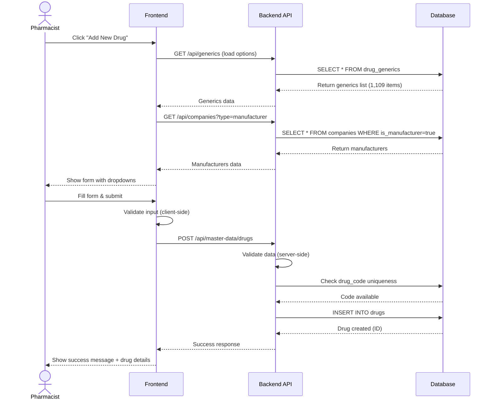

# 🏢 Master Data Management System

**Foundation data for all systems**

**Priority:** ⭐⭐⭐ สูงสุด
**Tables:** 16 tables (9 core + 3 drug info + 4 lookup tables) ⭐
**Status:** ✅ Production Ready
**Ministry Compliance:** ✅ 100%
**Data:** 81,353 records migrated (Phase 1-8 COMPLETE) 🚀

---

## 📋 Overview

Master Data System เป็นระบบจัดการข้อมูลพื้นฐานที่ระบบอื่นๆ ทั้งหมดต้องใช้:

### 5 กลุ่มข้อมูลหลัก

1. **🏥 Organization Data** (3 tables)
   - `locations` - สถานที่จัดเก็บยา (warehouse, pharmacy, ward, emergency)
   - `departments` - หน่วยงาน (with budget codes & hierarchy)
   - `bank` - ธนาคาร (for company payment info)

2. **💰 Budget Structure** (3 tables)
   - `budget_types` - ประเภทงบประมาณ (operational, investment, emergency)
   - `budget_categories` - หมวดค่าใช้จ่าย (with accounting codes)
   - `budgets` - งบประมาณ (combination of type + category)

3. **💊 Drug & Company Data** (3 tables)
   - `drug_generics` - ยาสามัญ (1,109 records, 97.6% with FK mapping) 🔓
   - `drugs` - ยาการค้า (1,169 records, 47.99% with TMT) 🔓
   - `companies` - ผู้ผลิต/จำหน่าย (vendors & manufacturers)

4. **🧪 Drug Information Support** (3 tables)
   - `drug_components` - ส่วนประกอบยา/API (736 records for allergy checking) 🔓
   - `drug_focus_lists` - รายการยาพิเศษ/ควบคุม (92 pending)
   - `drug_pack_ratios` - อัตราส่วนหีบห่อตาม vendor (1,641 pending)

5. **📚 Lookup Tables** (4 tables) ⭐ NEW (Phase 5)
   - `dosage_forms` - รูปแบบยา (107 records: TAB, CAP, INJ, etc.) 🔓
   - `drug_units` - หน่วยยา (88 records: mg, ml, unit, IU, etc.) 🔓
   - `adjustment_reasons` - เหตุผลปรับปรุงสต็อก (10 records) 🔓
   - `return_actions` - การจัดการยาคืน/ทำลาย (8 records) 🔓

---

## 🔗 System Dependencies

### Master Data ให้ข้อมูลแก่ระบบอื่น:

```
Master Data
    ├─→ Budget Management (budget types, departments)
    ├─→ Procurement (drugs, companies, departments)
    ├─→ Inventory (drugs, locations)
    ├─→ Distribution (departments, locations)
    ├─→ TMT Integration (drugs mapping)
    └─→ Ministry Reporting (all master data)
```

**Reverse Dependency:** ⚠️ ไม่มีระบบอื่นที่ Master Data ต้องพึ่งพา

---

## 🔄 Main Workflow: Add New Drug

**ภาพรวม workflow หลักของระบบ - การเพิ่มยาใหม่เข้าระบบ**



**สำหรับ workflow ละเอียดเพิ่มเติม**: ดู [WORKFLOWS.md](WORKFLOWS.md)

---

## 🎯 Key Features

### ✅ Ministry Compliance (v2.2.0) 🎉

**New fields for 100% DMSIC Standards compliance:**

| Field                 | Location    | Purpose                        | Values                                                  |
| --------------------- | ----------- | ------------------------------ | ------------------------------------------------------- |
| `nlem_status`         | drugs       | สถานะยาในบัญชียาหลักแห่งชาติ   | E (ในบัญชี), N (นอกบัญชี)                               |
| `drug_status`         | drugs       | สถานะการใช้งานยา               | 1 (ใช้งาน), 2 (ตัดแต่มีเหลือ), 3 (เฉพาะราย), 4 (ตัดหมด) |
| `product_category`    | drugs       | ประเภทผลิตภัณฑ์                | 1-5 (ยาปัจจุบัน/สมุนไพร, ทะเบียน/โรงพยาบาล)             |
| `status_changed_date` | drugs       | วันที่เปลี่ยนสถานะ             | Date                                                    |
| `consumption_group`   | departments | กลุ่มหน่วยงานตามรูปแบบการใช้ยา | 1-9 (OPD/IPD mix, etc.)                                 |

### ✅ Data Integrity

- **Hierarchical Support:**
  - Locations can have parent-child relationships
  - Departments can have parent-child relationships

- **Unique Constraints:**
  - All codes are unique (location_code, dept_code, drug_code, etc.)
  - Drug codes follow specific formats (working_code = 7 chars, drug_code = 24 chars)

- **Soft Delete:**
  - All tables have `is_active` flag
  - Deleted items are marked inactive, not physically removed

---

## 📂 Documentation Files

| File                             | Description                                        |
| -------------------------------- | -------------------------------------------------- |
| **README.md**                    | This file - Overview of Master Data system         |
| **[SCHEMA.md](SCHEMA.md)**       | Database schema: 9 tables with ER diagrams         |
| **[WORKFLOWS.md](WORKFLOWS.md)** | Business workflows: CRUD, Bulk Import, Search      |
| **api/**                         | OpenAPI specs (will be auto-generated from AegisX) |

---

## 🎯 Quick Start

### 1. Setup Master Data

```bash
# Seed initial data
npm run db:seed

# Verify data
npm run db:studio  # Open Prisma Studio at http://localhost:5555
```

### 2. Check Data Integrity

```sql
-- Count records
SELECT 'Locations' AS entity, COUNT(*) AS count FROM locations
UNION ALL
SELECT 'Departments', COUNT(*) FROM departments
UNION ALL
SELECT 'Companies', COUNT(*) FROM companies
UNION ALL
SELECT 'Drug Generics', COUNT(*) FROM drug_generics
UNION ALL
SELECT 'Drugs', COUNT(*) FROM drugs;

-- Check ministry compliance fields
SELECT
    COUNT(*) AS total_drugs,
    COUNT(nlem_status) AS with_nlem,
    COUNT(drug_status) AS with_status,
    COUNT(product_category) AS with_category
FROM drugs
WHERE is_active = true;
```

### 3. Test CRUD Operations

```typescript
import { prisma } from './lib/prisma';

// Create location
const location = await prisma.location.create({
  data: {
    locationCode: 'WH001',
    locationName: 'Main Warehouse',
    locationType: 'WAREHOUSE',
    responsiblePerson: 'John Doe',
    isActive: true,
  },
});

// Find active drugs
const drugs = await prisma.drug.findMany({
  where: { isActive: true },
  include: {
    generic: true,
    manufacturer: true,
  },
  orderBy: { tradeName: 'asc' },
});
```

---

## 🔗 Related Documentation

### Global Documentation

- **[SYSTEM_ARCHITECTURE.md](../../SYSTEM_ARCHITECTURE.md)** - Overview of all 8 systems
- **[DATABASE_STRUCTURE.md](../../DATABASE_STRUCTURE.md)** - Complete database schema (44 tables)
- **[END_TO_END_WORKFLOWS.md](../../END_TO_END_WORKFLOWS.md)** - Cross-system workflows

### Per-System Documentation

- **[SCHEMA.md](SCHEMA.md)** - Detailed schema of this system's 9 tables
- **[WORKFLOWS.md](WORKFLOWS.md)** - CRUD, Bulk Import, Search workflows

### Technical Reference

- **`prisma/schema.prisma`** - Source schema definition
- **`prisma/seed.ts`** - Seed data script
- **AegisX Swagger UI** - http://127.0.0.1:3383/documentation (when running)

---

## 📈 Next Steps

1. ✅ **Read** [SCHEMA.md](SCHEMA.md) - Understand table structure
2. ✅ **Read** [WORKFLOWS.md](WORKFLOWS.md) - Understand business processes
3. ⏳ **Implement** AegisX APIs - Auto-generate CRUD endpoints
4. ⏳ **Test** via Swagger UI - Test all endpoints
5. ⏳ **Export** OpenAPI spec to `api/openapi.yaml`

---

**Built with ❤️ for INVS Modern Team**
**Last Updated:** 2025-01-28 | **Version:** 2.6.0
