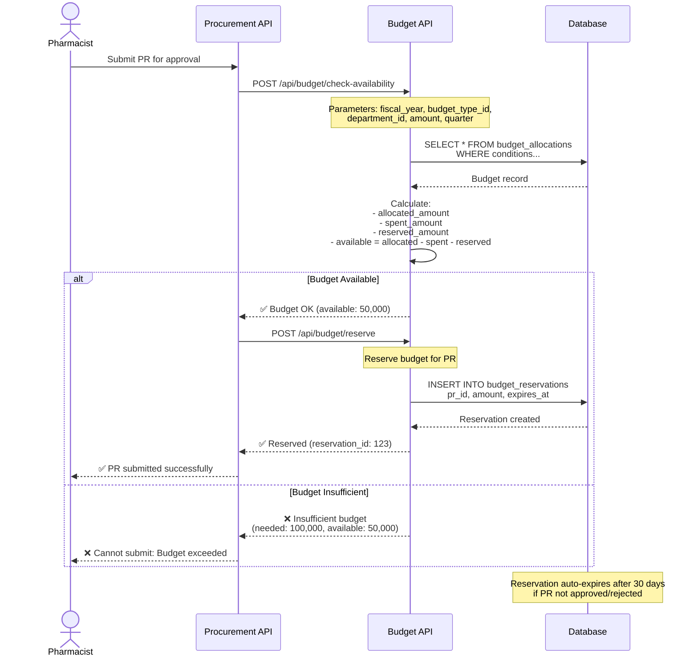

# 💰 Budget Management System

**Real-time budget control and planning**

**Priority:** ⭐⭐⭐ สูง
**Tables:** 4 tables
**Status:** ✅ Production Ready
**Functions:** 6 database functions
**Version:** 2.6.0
**Last Updated:** 2025-01-28

---

## 📋 Overview

Budget Management System จัดการงบประมาณแบบครบวงจร:

### 4 โมดูลหลัก

1. **💵 Budget Allocation** (1 table)
   - `budget_allocations` - จัดสรรงบประจำปี แบ่งตามไตรมาส (Q1-Q4)
   - Real-time tracking: spent, remaining, utilization %

2. **📋 Budget Planning** (2 tables)
   - `budget_plans` - หัวข้อแผนงบประมาณ
   - `budget_plan_items` - วางแผนระดับยา พร้อมข้อมูล 3 ปีย้อนหลัง

3. **🔒 Budget Reservation** (1 table)
   - `budget_reservations` - จองงบชั่วคราวสำหรับ PR
   - Auto-expire after 30 days

4. **📊 Budget Control** (6 functions)
   - Check availability, Reserve, Commit, Release
   - Check drug in plan, Update purchased amounts

---

## 🔗 System Dependencies

### Budget Management ให้ข้อมูลแก่:

```
Budget Management
    ├─→ Procurement (check budget, reserve, commit)
    ├─→ Ministry Reporting (budget plan export)
    └─→ Dashboard (budget monitoring)
```

### Budget Management ใช้ข้อมูลจาก:

```
Master Data → Budget Management
    ├─ budgets (budget types)
    ├─ departments (budget owners)
    └─ drug_generics (for planning)
```

---

## 🔄 Main Workflow: Budget Check & Reservation

**ภาพรวม workflow หลักของระบบ - การตรวจสอบและจองงบประมาณเมื่อสร้าง PR**



**สำหรับ workflow ละเอียดเพิ่มเติม**: ดู [WORKFLOWS.md](WORKFLOWS.md)

---

## 🎯 Key Features

### ✅ Quarterly Budget Control

**Real-time budget tracking:**

- แบ่งงบเป็น 4 ไตรมาส (Q1-Q4)
- ติดตามการใช้จ่ายแบบ real-time
- Alert เมื่อใช้งบ > 80%

### ✅ Drug-level Budget Planning

**Historical data analysis:**

- ข้อมูลการใช้ย้อนหลัง 3 ปี
- วางแผนปริมาณรายไตรมาส
- ติดตามจำนวนที่ซื้อจริง vs แผน

### ✅ Budget Reservation

**Temporary budget hold:**

- จองงบเมื่อสร้าง PR
- Auto-expire after 30 days
- Release เมื่อ PR approved/rejected

### ✅ Automatic Budget Commitment

**Smart budget deduction:**

- ตัดงบเมื่อ PO approved เท่านั้น
- ตัดจากไตรมาสที่ถูกต้อง
- Transaction atomic (all or nothing)

---

## 📂 Documentation Files

| File                             | Description                                             |
| -------------------------------- | ------------------------------------------------------- |
| **README.md**                    | This file - Overview of Budget Management system        |
| **[SCHEMA.md](SCHEMA.md)**       | Database schema: 4 tables + ER diagrams + 6 functions   |
| **[WORKFLOWS.md](WORKFLOWS.md)** | Business workflows: 5 major flows with Mermaid diagrams |
| **api/**                         | OpenAPI specs (will be auto-generated from AegisX)      |

---

## 🎯 Quick Start

### 1. Create Budget Allocation

```typescript
import { prisma } from './lib/prisma';

// Allocate budget for Pharmacy Dept (FY 2025)
const allocation = await prisma.budgetAllocation.create({
  data: {
    fiscal_year: 2025,
    budget_id: 1, // OP001 - ยาและเวชภัณฑ์
    department_id: 2, // Pharmacy
    total_budget: 10000000.0,
    q1_budget: 2500000.0,
    q2_budget: 2500000.0,
    q3_budget: 2500000.0,
    q4_budget: 2500000.0,
    remaining_budget: 10000000.0,
  },
});
```

### 2. Check Budget Availability

```sql
-- Check if 500k budget available for Q2
SELECT * FROM check_budget_availability(
    2025,      -- fiscal_year
    1,         -- budget_type_id
    2,         -- department_id
    500000.00, -- amount
    2          -- quarter (Q2)
);
-- Returns: (available: true, remaining: 2000000.00)
```

### 3. Reserve Budget for PR

```typescript
// When creating Purchase Request
const reservation = await prisma.$queryRaw`
  SELECT reserve_budget(
    ${allocationId}::BIGINT,
    ${prId}::BIGINT,
    ${amount},
    30::INT  -- expires in 30 days
  )
`;
```

### 4. Monitor Budget Status

```typescript
// Get budget status for Pharmacy Dept (FY 2025)
const status = await prisma.budgetAllocation.findFirst({
  where: {
    fiscal_year: 2025,
    department_id: 2,
    is_active: true,
  },
  include: {
    budget: {
      include: {
        budgetType: true,
        budgetCategory: true,
      },
    },
    department: true,
  },
});

console.log({
  total_budget: status.total_budget,
  total_spent: status.total_spent,
  remaining: status.remaining_budget,
  utilization: ((status.total_spent / status.total_budget) * 100).toFixed(2) + '%',
});
```

---

## 🔗 Related Documentation

### Global Documentation

- **[SYSTEM_ARCHITECTURE.md](../../SYSTEM_ARCHITECTURE.md)** - Overview of all 8 systems
- **[DATABASE_STRUCTURE.md](../../DATABASE_STRUCTURE.md)** - Complete database schema (44 tables)
- **[END_TO_END_WORKFLOWS.md](../../END_TO_END_WORKFLOWS.md)** - Cross-system workflows

### Per-System Documentation

- **[SCHEMA.md](SCHEMA.md)** - Detailed schema of this system's 4 tables + 6 functions
- **[WORKFLOWS.md](WORKFLOWS.md)** - 5 business workflows: Allocation, Planning, Reservation, Commitment, Monitoring

### Technical Reference

- **`prisma/schema.prisma`** - Source schema definition
- **`prisma/functions.sql`** - 6 budget functions
- **AegisX Swagger UI** - http://127.0.0.1:3383/documentation (when running)

---

## 📈 Next Steps

1. ✅ **Read** [SCHEMA.md](SCHEMA.md) - Understand 4 tables + 6 functions
2. ✅ **Read** [WORKFLOWS.md](WORKFLOWS.md) - Understand 5 business workflows
3. ⏳ **Implement** AegisX APIs - Budget control endpoints
4. ⏳ **Test** Budget Functions - Test check, reserve, commit
5. ⏳ **Integrate** with Procurement - Connect PR → Budget

---

**Built with ❤️ for INVS Modern Team**
**Last Updated:** 2025-01-28 | **Version:** 2.6.0
