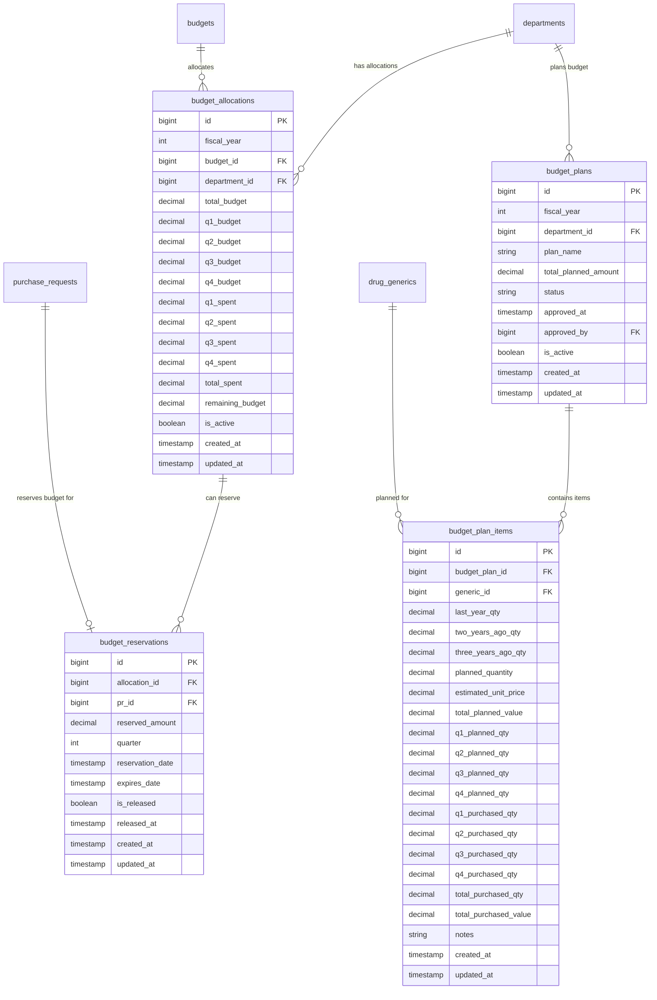

# 💰 Budget Management - Database Schema

**System:** Budget Management
**Tables:** 4 tables
**Version:** 2.6.0
**Last Updated:** 2025-01-28

---

## 📊 Table Overview

| Table                 | Records     | Purpose                                                  |
| --------------------- | ----------- | -------------------------------------------------------- |
| `budget_allocations`  | 0 (pending) | Annual budget allocation by department & quarter (Q1-Q4) |
| `budget_plans`        | **3**       | Budget planning headers (fiscal year + department)       |
| `budget_plan_items`   | **1,710**   | Drug-level budget planning with 3-year historical data   |
| `budget_reservations` | 0 (pending) | Temporary budget reservations for pending PRs            |

---

## 🗺️ Entity Relationship Diagram



---

## 📋 Table Details

### 1. budget_allocations - Annual Budget Allocation

**Purpose:** จัดสรรงบประมาณประจำปี แบ่งตามไตรมาส (Q1-Q4)

```sql
CREATE TABLE budget_allocations (
    id BIGSERIAL PRIMARY KEY,
    fiscal_year INT NOT NULL,
    budget_id BIGINT REFERENCES budgets(id) NOT NULL,
    department_id BIGINT REFERENCES departments(id) NOT NULL,

    -- Total allocation
    total_budget DECIMAL(15,2) NOT NULL,

    -- Quarterly breakdown
    q1_budget DECIMAL(15,2) NOT NULL DEFAULT 0,
    q2_budget DECIMAL(15,2) NOT NULL DEFAULT 0,
    q3_budget DECIMAL(15,2) NOT NULL DEFAULT 0,
    q4_budget DECIMAL(15,2) NOT NULL DEFAULT 0,

    -- Quarterly spending
    q1_spent DECIMAL(15,2) NOT NULL DEFAULT 0,
    q2_spent DECIMAL(15,2) NOT NULL DEFAULT 0,
    q3_spent DECIMAL(15,2) NOT NULL DEFAULT 0,
    q4_spent DECIMAL(15,2) NOT NULL DEFAULT 0,

    -- Calculated fields
    total_spent DECIMAL(15,2) NOT NULL DEFAULT 0,
    remaining_budget DECIMAL(15,2) NOT NULL DEFAULT 0,

    is_active BOOLEAN DEFAULT true,
    created_at TIMESTAMP DEFAULT NOW(),
    updated_at TIMESTAMP DEFAULT NOW(),

    UNIQUE(fiscal_year, budget_id, department_id),
    CHECK(q1_budget + q2_budget + q3_budget + q4_budget = total_budget),
    CHECK(remaining_budget = total_budget - total_spent)
);
```

**Key Features:**

- **Quarterly Breakdown:** Q1-Q4 for granular budget control
- **Auto-calculation:** `total_spent` and `remaining_budget` auto-updated
- **Unique Constraint:** One allocation per (year, budget, department)
- **Check Constraint:** Quarterly budgets must sum to total

**Example Data:**

```typescript
{
  fiscal_year: 2025,
  budget_id: 1, // OP001 - ยาและเวชภัณฑ์
  department_id: 2, // Pharmacy
  total_budget: 10000000.00,
  q1_budget: 2500000.00,
  q2_budget: 2500000.00,
  q3_budget: 2500000.00,
  q4_budget: 2500000.00,
  q1_spent: 1800000.00,
  remaining_budget: 8200000.00
}
```

---

### 2. budget_plans - Budget Planning Header

**Purpose:** หัวข้อแผนงบประมาณ (Header table)

```sql
CREATE TABLE budget_plans (
    id BIGSERIAL PRIMARY KEY,
    fiscal_year INT NOT NULL,
    department_id BIGINT REFERENCES departments(id) NOT NULL,
    plan_name VARCHAR(200),
    total_planned_amount DECIMAL(15,2) DEFAULT 0,
    status budget_plan_status_enum NOT NULL DEFAULT 'DRAFT',
    approved_at TIMESTAMP,
    approved_by BIGINT REFERENCES users(id),
    is_active BOOLEAN DEFAULT true,
    created_at TIMESTAMP DEFAULT NOW(),
    updated_at TIMESTAMP DEFAULT NOW(),

    UNIQUE(fiscal_year, department_id)
);
```

**Enums:**

```typescript
enum BudgetPlanStatus {
  DRAFT       // แบบร่าง - กำลังวางแผน
  SUBMITTED   // ส่งอนุมัติแล้ว
  APPROVED    // อนุมัติแล้ว
  REJECTED    // ปฏิเสธ
  REVISED     // แก้ไข
}
```

**Key Features:**

- **One Plan per Year/Dept:** Unique constraint prevents duplicates
- **Approval Workflow:** Draft → Submitted → Approved
- **Total Calculation:** Sum from `budget_plan_items`

**Example Data:**

```typescript
{
  id: 1,
  fiscal_year: 2025,
  department_id: 2,
  plan_name: "แผนจัดซื้อยาประจำปี 2025 - ห้องยา",
  total_planned_amount: 8500000.00,
  status: "APPROVED",
  approved_at: "2024-12-15T10:30:00Z",
  approved_by: 5
}
```

---

### 3. budget_plan_items - Drug-level Budget Planning ⭐

**Purpose:** วางแผนระดับยาแต่ละตัว พร้อมข้อมูล 3 ปีย้อนหลัง

```sql
CREATE TABLE budget_plan_items (
    id BIGSERIAL PRIMARY KEY,
    budget_plan_id BIGINT REFERENCES budget_plans(id) ON DELETE CASCADE NOT NULL,
    generic_id BIGINT REFERENCES drug_generics(id) NOT NULL,

    -- Historical consumption (3 years)
    last_year_qty DECIMAL(10,2) DEFAULT 0,
    two_years_ago_qty DECIMAL(10,2) DEFAULT 0,
    three_years_ago_qty DECIMAL(10,2) DEFAULT 0,

    -- Current year planning
    planned_quantity DECIMAL(10,2) NOT NULL,
    estimated_unit_price DECIMAL(10,2) NOT NULL,
    total_planned_value DECIMAL(15,2) NOT NULL,

    -- Quarterly breakdown
    q1_planned_qty DECIMAL(10,2) DEFAULT 0,
    q2_planned_qty DECIMAL(10,2) DEFAULT 0,
    q3_planned_qty DECIMAL(10,2) DEFAULT 0,
    q4_planned_qty DECIMAL(10,2) DEFAULT 0,

    -- Purchase tracking
    q1_purchased_qty DECIMAL(10,2) DEFAULT 0,
    q2_purchased_qty DECIMAL(10,2) DEFAULT 0,
    q3_purchased_qty DECIMAL(10,2) DEFAULT 0,
    q4_purchased_qty DECIMAL(10,2) DEFAULT 0,
    total_purchased_qty DECIMAL(10,2) DEFAULT 0,
    total_purchased_value DECIMAL(15,2) DEFAULT 0,

    notes TEXT,
    created_at TIMESTAMP DEFAULT NOW(),
    updated_at TIMESTAMP DEFAULT NOW(),

    UNIQUE(budget_plan_id, generic_id),
    CHECK(q1_planned_qty + q2_planned_qty + q3_planned_qty + q4_planned_qty = planned_quantity),
    CHECK(total_planned_value = planned_quantity * estimated_unit_price)
);
```

**Key Features:**

- **3-Year History:** Track consumption patterns
- **Quarterly Planning:** Q1-Q4 breakdown
- **Purchase Tracking:** Monitor actual vs planned
- **Auto-calculation:** Total value = qty × price

**Example Data:**

```typescript
{
  budget_plan_id: 1,
  generic_id: 101, // Paracetamol 500mg
  last_year_qty: 50000,      // ปีที่แล้ว
  two_years_ago_qty: 48000,   // 2 ปีที่แล้ว
  three_years_ago_qty: 45000, // 3 ปีที่แล้ว
  planned_quantity: 52000,    // แผนปีนี้
  estimated_unit_price: 2.50,
  total_planned_value: 130000.00,
  q1_planned_qty: 13000,
  q2_planned_qty: 13000,
  q3_planned_qty: 13000,
  q4_planned_qty: 13000,
  q1_purchased_qty: 13500,    // ซื้อแล้ว Q1
  total_purchased_qty: 13500
}
```

---

### 4. budget_reservations - Budget Reservation

**Purpose:** จองงบประมาณชั่วคราวสำหรับ PR (ยังไม่อนุมัติ)

```sql
CREATE TABLE budget_reservations (
    id BIGSERIAL PRIMARY KEY,
    allocation_id BIGINT REFERENCES budget_allocations(id) NOT NULL,
    pr_id BIGINT REFERENCES purchase_requests(id) NOT NULL,
    reserved_amount DECIMAL(15,2) NOT NULL,
    quarter INT NOT NULL CHECK(quarter BETWEEN 1 AND 4),
    reservation_date TIMESTAMP DEFAULT NOW(),
    expires_date TIMESTAMP NOT NULL,
    is_released BOOLEAN DEFAULT false,
    released_at TIMESTAMP,
    created_at TIMESTAMP DEFAULT NOW(),
    updated_at TIMESTAMP DEFAULT NOW(),

    UNIQUE(pr_id)
);
```

**Key Features:**

- **Temporary Hold:** Reserve budget before PR approval
- **Expiration:** Auto-release after N days
- **One Reservation per PR:** Prevents double-booking
- **Quarter-specific:** Track which quarter to deduct from

**Lifecycle:**

```
1. Create PR → Reserve budget (30 days)
2. Approve PR → Create PO → Commit budget → Release reservation
3. Reject PR → Release reservation
4. Expired (30 days) → Auto-release reservation
```

**Example Data:**

```typescript
{
  allocation_id: 1,
  pr_id: 123,
  reserved_amount: 150000.00,
  quarter: 2,
  reservation_date: "2025-04-01T09:00:00Z",
  expires_date: "2025-05-01T09:00:00Z", // 30 days later
  is_released: false
}
```

---

## 🔗 Cross-System Integration

### 1. Master Data System

**Uses:**

- `budgets` - Budget type combinations
- `departments` - Budget ownership
- `drug_generics` - For budget planning

### 2. Procurement System

**Uses:**

- `budget_allocations` - Check available budget
- `budget_reservations` - Reserve when creating PR
- `budget_plan_items` - Validate PR against plan

**Workflow:**

```
PR Created → Reserve Budget → PR Approved → PO Created → Commit Budget
```

### 3. Ministry Reporting

**Uses:**

- `budget_plan_items` - For PURCHASEPLAN export (20 fields)

---

## 🔍 Common Queries

### Check budget availability for current quarter

```sql
SELECT
    ba.id,
    d.dept_name,
    bt.type_name,
    CASE
        WHEN EXTRACT(QUARTER FROM CURRENT_DATE) = 1 THEN ba.q1_budget - ba.q1_spent
        WHEN EXTRACT(QUARTER FROM CURRENT_DATE) = 2 THEN ba.q2_budget - ba.q2_spent
        WHEN EXTRACT(QUARTER FROM CURRENT_DATE) = 3 THEN ba.q3_budget - ba.q3_spent
        ELSE ba.q4_budget - ba.q4_spent
    END AS current_quarter_remaining
FROM budget_allocations ba
JOIN departments d ON ba.department_id = d.id
JOIN budgets b ON ba.budget_id = b.id
JOIN budget_types bt ON b.budget_type_id = bt.id
WHERE ba.fiscal_year = 2025
  AND ba.is_active = true;
```

### Get drug-level budget plan with purchase tracking

```sql
SELECT
    dg.working_code,
    dg.generic_name,
    bpi.planned_quantity,
    bpi.total_purchased_qty,
    bpi.planned_quantity - bpi.total_purchased_qty AS remaining_qty,
    bpi.total_planned_value,
    bpi.total_purchased_value,
    ROUND((bpi.total_purchased_qty / bpi.planned_quantity * 100), 2) AS percent_purchased
FROM budget_plan_items bpi
JOIN budget_plans bp ON bpi.budget_plan_id = bp.id
JOIN drug_generics dg ON bpi.generic_id = dg.id
WHERE bp.fiscal_year = 2025
  AND bp.department_id = 2
  AND bp.status = 'APPROVED'
ORDER BY dg.working_code;
```

### Active budget reservations (expiring soon)

```sql
SELECT
    d.dept_name,
    pr.pr_number,
    br.reserved_amount,
    br.expires_date,
    br.expires_date - CURRENT_DATE AS days_until_expiry
FROM budget_reservations br
JOIN budget_allocations ba ON br.allocation_id = ba.id
JOIN departments d ON ba.department_id = d.id
JOIN purchase_requests pr ON br.pr_id = pr.id
WHERE br.is_released = false
  AND br.expires_date > CURRENT_DATE
ORDER BY br.expires_date ASC;
```

---

## 📊 Database Functions

### 1. check_budget_availability()

**Purpose:** ตรวจสอบงบประมาณคงเหลือ

```sql
check_budget_availability(
    fiscal_year INT,
    budget_type_id BIGINT,
    department_id BIGINT,
    amount DECIMAL,
    quarter INT
) RETURNS TABLE(available BOOLEAN, remaining DECIMAL)
```

**Usage:**

```sql
SELECT * FROM check_budget_availability(2025, 1, 2, 500000.00, 2);
```

---

### 2. reserve_budget()

**Purpose:** จองงบประมาณสำหรับ PR

```sql
reserve_budget(
    allocation_id BIGINT,
    pr_id BIGINT,
    amount DECIMAL,
    expires_days INT DEFAULT 30
) RETURNS BIGINT  -- Returns reservation_id
```

**Usage:**

```sql
SELECT reserve_budget(1, 123, 150000.00, 30);
```

---

### 3. commit_budget()

**Purpose:** ตัดงบประมาณจริงเมื่ออนุมัติ PO

```sql
commit_budget(
    allocation_id BIGINT,
    po_id BIGINT,
    amount DECIMAL,
    quarter INT
) RETURNS BOOLEAN
```

**Usage:**

```sql
SELECT commit_budget(1, 456, 150000.00, 2);
```

---

### 4. release_budget_reservation()

**Purpose:** ปลดล็อคงบประมาณที่จองไว้

```sql
release_budget_reservation(
    reservation_id BIGINT
) RETURNS BOOLEAN
```

---

### 5. check_drug_in_budget_plan()

**Purpose:** ตรวจสอบว่ายาอยู่ในแผนหรือไม่

```sql
check_drug_in_budget_plan(
    fiscal_year INT,
    department_id BIGINT,
    generic_id BIGINT,
    requested_qty DECIMAL,
    quarter INT
) RETURNS TABLE(in_plan BOOLEAN, remaining_qty DECIMAL)
```

---

### 6. update_budget_plan_purchase()

**Purpose:** อัปเดตจำนวนที่ซื้อแล้วในแผน

```sql
update_budget_plan_purchase(
    plan_item_id BIGINT,
    quantity DECIMAL,
    value DECIMAL,
    quarter INT
) RETURNS BOOLEAN
```

---

## ✅ Validation Rules Summary

| Table                 | Key Validation                                                          |
| --------------------- | ----------------------------------------------------------------------- |
| `budget_allocations`  | Quarterly budgets must sum to total; remaining = total - spent          |
| `budget_plans`        | One plan per (fiscal_year, department)                                  |
| `budget_plan_items`   | Planned quantity must match quarterly breakdown; unique (plan, generic) |
| `budget_reservations` | One reservation per PR; quarter must be 1-4; expiration date required   |

---

## 🚨 Business Rules

### Budget Allocation

1. ต้องแบ่งงบเป็น 4 ไตรมาส (Q1-Q4)
2. ผลรวม Q1+Q2+Q3+Q4 = Total Budget
3. ไม่สามารถจัดสรรซ้ำ (year, budget, department)

### Budget Planning

1. แผนต้องอนุมัติก่อนใช้งาน
2. ยาแต่ละตัวต้องมีข้อมูล 3 ปีย้อนหลัง (ถ้ามี)
3. แผนต้องระบุปริมาณรายไตรมาส

### Budget Reservation

1. จองงบได้สูงสุด 30 วัน (default)
2. หากเกินกำหนดจะถูก auto-release
3. PR ที่ reject ต้อง release งบทันที

### Budget Commitment

1. ตัดงบเมื่อ PO approved เท่านั้น
2. ต้องระบุไตรมาสที่ต้องการตัด
3. ต้อง release reservation ด้วย

---

**Related Documentation:**

- [README.md](README.md) - System overview
- [WORKFLOWS.md](WORKFLOWS.md) - Business workflows
- [../../DATABASE_STRUCTURE.md](../../DATABASE_STRUCTURE.md) - Complete 52-table schema

**Last Updated:** 2025-01-28 | **Version:** 2.6.0
