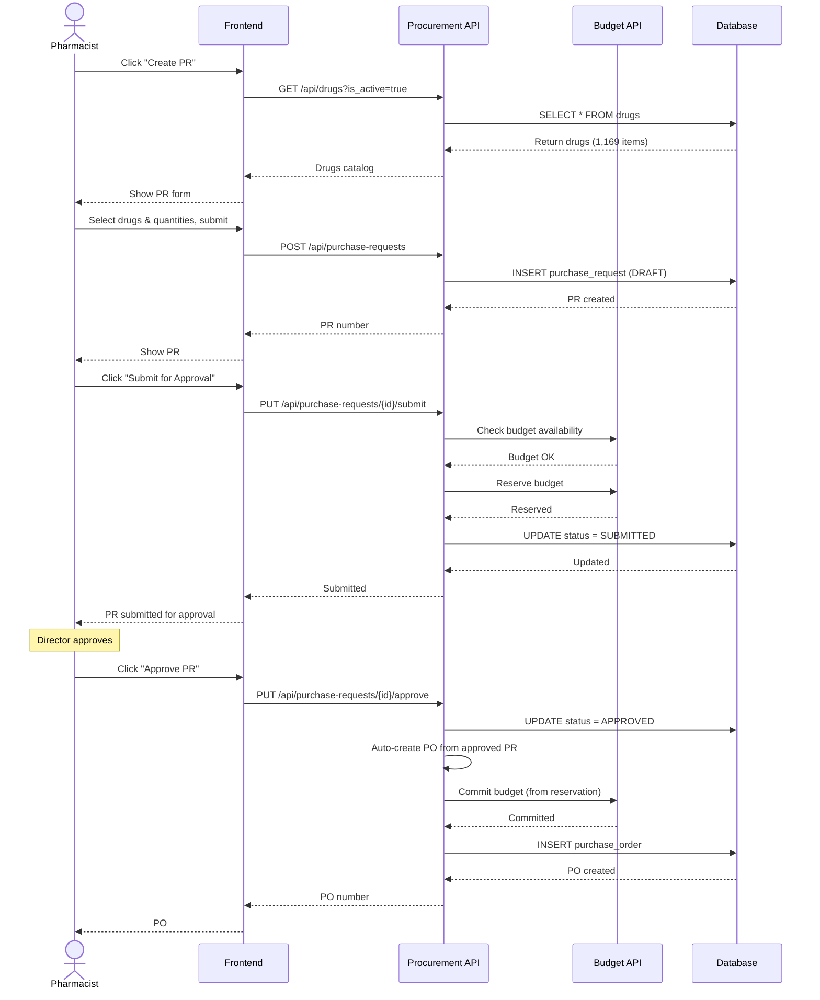

# 🛒 Procurement System

**Complete procurement cycle from contract to receipt**

**Priority:** ⭐⭐⭐ สูง
**Tables:** 15 tables (12 core + 3 procurement methods) ⭐
**Status:** ✅ Production Ready
**Version:** 2.6.0
**Last Updated:** 2025-01-28
**Workflows:** 4 major processes
**Data:** 57 records migrated (Phase 1) ⭐

---

## 📋 Overview

Procurement System จัดการวงจรการจัดซื้อแบบครบวงจร:

### 6 โมดูลหลัก

1. **📄 Contracts & Pricing** (2 tables)
   - `contracts` - สัญญาจัดซื้อกับ vendor
   - `contract_items` - รายการยาพร้อมราคาตามสัญญา
   - Annual and spot contracts

2. **📝 Purchase Request (PR)** (2 tables)
   - `purchase_requests` - ใบขอซื้อพร้อม workflow
   - `purchase_request_items` - รายการยาที่ขอซื้อ
   - Budget reservation and validation

3. **🛍️ Purchase Order (PO)** (2 tables)
   - `purchase_orders` - ใบสั่งซื้อส่งให้ vendor
   - `purchase_order_items` - รายการในใบสั่งซื้อ
   - Automatic budget commitment

4. **📦 Goods Receipt (GR)** (3 tables)
   - `receipts` - ใบรับของพร้อมคณะกรรมการ
   - `receipt_items` - รายการที่รับพร้อม lot/expiry
   - `receipt_inspectors` - บันทึกคณะกรรมการตรวจรับ
   - FIFO lot tracking integration

5. **💰 Supporting Documents** (3 tables)
   - `approval_documents` - เอกสารอนุมัติ PO
   - `payment_documents` - เอกสารการจ่ายเงิน
   - `payment_attachments` - เอกสารแนบการจ่ายเงิน

6. **🏷️ Procurement Master Data** (3 tables) ⭐ NEW (Phase 1)
   - `purchase_methods` - วิธีการจัดซื้อ (18 records: e-bidding, สอบราคา, etc.) ⭐
   - `purchase_types` - ประเภทการซื้อ (20 records: ซื้อเอง, ซื้อร่วม, VMI, etc.) ⭐
   - `purchase_order_reasons` - เหตุผลการแก้ไข/ยกเลิก PO (2 records) ⭐ Phase 3

---

## 🔗 System Dependencies

### Procurement ให้ข้อมูลแก่:

```
Procurement
    ├─→ Inventory (receipts → stock updates)
    ├─→ Budget Management (commitments, actual spending)
    ├─→ Payments (payment processing)
    └─→ Ministry Reporting (purchase & receipt exports)
```

### Procurement ใช้ข้อมูลจาก:

```
Master Data → Procurement
    ├─ departments (requesters)
    ├─ companies (vendors)
    ├─ drug_generics (catalog)
    └─ drugs (trade items)

Budget Management → Procurement
    ├─ budget_allocations (check availability)
    ├─ budget_reservations (reserve for PR)
    └─ budget_plans (validate against plan)
```

---

## 🔄 Main Workflow: Create Purchase Request → PO

**ภาพรวม workflow หลักของระบบ - การสร้างใบขอซื้อและอนุมัติเป็นใบสั่งซื้อ**



**สำหรับ workflow ละเอียดเพิ่มเติม**: ดู [WORKFLOWS.md](WORKFLOWS.md)

---

## 🎯 Key Features

### ✅ Complete Procurement Workflow

**From planning to receipt:**

- Contract management with agreed pricing
- PR creation with budget validation
- PO generation and vendor communication
- GR with inspection committee records
- Payment tracking and documentation

### ✅ Budget Integration

**Real-time budget control:**

- Check budget availability before PR approval
- Reserve budget when PR is approved
- Commit budget when PO is finalized
- Release reservation if PR is cancelled
- Quarter-based budget tracking

### ✅ Multi-level Approval

**Approval workflow:**

- Department head approval for PR
- Budget validation by Finance
- Director approval for high-value items
- Complete audit trail with timestamps

### ✅ Contract-based Pricing

**Price control:**

- Annual contracts with agreed prices
- Spot purchase support
- Price variance tracking
- Vendor performance monitoring

### ✅ FIFO Lot Tracking

**Complete traceability:**

- Lot number and expiry date recording
- FIFO integration with Inventory system
- Batch tracking from receipt to dispensing
- Expiry date alerts

---

## 📂 Documentation Files

| File                             | Description                                                  |
| -------------------------------- | ------------------------------------------------------------ |
| **README.md**                    | This file - Overview of Procurement system                   |
| **[SCHEMA.md](SCHEMA.md)**       | Database schema: 12 tables + ER diagrams + relationships     |
| **[WORKFLOWS.md](WORKFLOWS.md)** | Business workflows: 4 major flows (PR, PO, Receipt, Payment) |
| **api/**                         | OpenAPI specs (will be auto-generated from AegisX)           |

---

## 🎯 Quick Start

### 1. Create Purchase Request (PR)

```typescript
import { prisma } from './lib/prisma';

// Check budget first
const budgetCheck = await prisma.$queryRaw`
  SELECT * FROM check_budget_availability(
    2025,      -- fiscal_year
    1,         -- budget_type_id
    2,         -- department_id (Pharmacy)
    21500.00,  -- amount
    2          -- quarter (Q2)
  )
`;

if (!budgetCheck[0].available) {
  throw new Error('Insufficient budget');
}

// Create PR with items
const pr = await prisma.$transaction(async (tx) => {
  const request = await tx.purchaseRequest.create({
    data: {
      pr_number: 'PR-2025-04-001',
      request_date: new Date('2025-04-01'),
      required_date: new Date('2025-04-30'),
      department_id: 2, // Pharmacy
      budget_id: 1, // OP001
      fiscal_year: 2025,
      purpose: 'ยาสำหรับผู้ป่วยนอก Q2/2025',
      status: 'DRAFT',
      total_amount: 21500.0,
    },
  });

  // Add items
  await tx.purchaseRequestItem.createMany({
    data: [
      {
        pr_id: request.id,
        generic_id: 1, // Paracetamol
        requested_quantity: 1000,
        unit: 'TABLET',
        estimated_price: 0.5,
        estimated_amount: 500.0,
        purpose: 'ยาลดไข้',
        quarter: 2,
      },
      {
        pr_id: request.id,
        generic_id: 2, // Ibuprofen
        requested_quantity: 500,
        unit: 'TABLET',
        estimated_price: 2.0,
        estimated_amount: 1000.0,
        purpose: 'ยาแก้ปวด',
        quarter: 2,
      },
    ],
  });

  // Reserve budget
  const reservation = await tx.budgetReservation.create({
    data: {
      allocation_id: budgetCheck[0].allocation_id,
      pr_id: request.id,
      reserved_amount: 21500.0,
      quarter: 2,
      expires_date: new Date(Date.now() + 30 * 24 * 60 * 60 * 1000),
    },
  });

  return { request, reservation };
});

console.log('PR created:', pr.request.pr_number);
```

### 2. Approve PR and Create PO

```typescript
// Approve PR
const approvedPr = await prisma.purchaseRequest.update({
  where: { id: prId },
  data: {
    status: 'APPROVED',
    approved_by: userId,
    approved_at: new Date(),
    approved_total: 21500.0,
  },
});

// Create Purchase Order
const po = await prisma.purchaseOrder.create({
  data: {
    po_number: 'PO-2025-04-001',
    po_date: new Date('2025-04-05'),
    company_id: 1, // GPO
    pr_id: prId,
    fiscal_year: 2025,
    delivery_location_id: 1, // Main Warehouse
    payment_term: 30,
    status: 'PENDING',
    total_amount: 21500.0,
  },
});

// Create PO items from PR items
const prItems = await prisma.purchaseRequestItem.findMany({
  where: { pr_id: prId },
});

await prisma.purchaseOrderItem.createMany({
  data: prItems.map((item) => ({
    po_id: po.id,
    generic_id: item.generic_id,
    ordered_quantity: item.requested_quantity,
    unit_price: item.estimated_price,
    amount: item.estimated_amount,
  })),
});

console.log('PO created:', po.po_number);
```

### 3. Receive Goods (GR)

```typescript
// Create receipt
const receipt = await prisma.$transaction(async (tx) => {
  const gr = await tx.receipt.create({
    data: {
      receipt_number: 'GR-2025-04-001',
      receipt_date: new Date('2025-04-15'),
      po_id: poId,
      company_id: 1,
      location_id: 1,
      invoice_number: 'INV-GPO-2025-123',
      status: 'PENDING',
      total_amount: 21500.0,
    },
  });

  // Add receipt items with lot info
  await tx.receiptItem.createMany({
    data: [
      {
        receipt_id: gr.id,
        generic_id: 1,
        lot_number: 'LOT-PCM-2025-A',
        expiry_date: new Date('2027-04-01'),
        received_quantity: 1000,
        unit_price: 0.5,
        amount: 500.0,
      },
    ],
  });

  // Add inspectors
  await tx.receiptInspector.createMany({
    data: [
      {
        receipt_id: gr.id,
        user_id: inspector1Id,
        role: 'CHAIRMAN',
        signed_at: new Date(),
      },
      {
        receipt_id: gr.id,
        user_id: inspector2Id,
        role: 'MEMBER',
        signed_at: new Date(),
      },
    ],
  });

  return gr;
});

console.log('Receipt created:', receipt.receipt_number);
```

### 4. Monitor Procurement Status

```typescript
// Get all pending PRs for department
const pendingPrs = await prisma.purchaseRequest.findMany({
  where: {
    department_id: 2,
    status: 'PENDING',
  },
  include: {
    department: true,
    items: {
      include: {
        generic: true,
      },
    },
    budgetReservation: true,
  },
  orderBy: {
    request_date: 'desc',
  },
});

// Get all active POs
const activePOs = await prisma.purchaseOrder.findMany({
  where: {
    status: { in: ['APPROVED', 'SENT'] },
  },
  include: {
    company: true,
    items: {
      include: {
        generic: true,
      },
    },
  },
});

// Get receipt summary
const receiptSummary = await prisma.receipt.groupBy({
  by: ['status'],
  _count: true,
  _sum: {
    total_amount: true,
  },
  where: {
    receipt_date: {
      gte: new Date('2025-01-01'),
      lte: new Date('2025-12-31'),
    },
  },
});

console.log({
  pendingPrs: pendingPrs.length,
  activePOs: activePOs.length,
  receiptSummary,
});
```

---

## 🔗 Related Documentation

### Global Documentation

- **[SYSTEM_ARCHITECTURE.md](../../SYSTEM_ARCHITECTURE.md)** - Overview of all 8 systems
- **[DATABASE_STRUCTURE.md](../../DATABASE_STRUCTURE.md)** - Complete database schema (44 tables)
- **[END_TO_END_WORKFLOWS.md](../../END_TO_END_WORKFLOWS.md)** - Cross-system workflows

### Per-System Documentation

- **[SCHEMA.md](SCHEMA.md)** - Detailed schema of this system's 12 tables + relationships
- **[WORKFLOWS.md](WORKFLOWS.md)** - 4 business workflows: PR, PO, Receipt, Payment

### Related Systems

- **[Budget Management](../02-budget-management/README.md)** - Budget control and validation
- **[Inventory](../04-inventory/README.md)** - Stock management and FIFO/FEFO
- **[Master Data](../01-master-data/README.md)** - Departments, companies, drugs

### Technical Reference

- **`prisma/schema.prisma`** - Source schema definition
- **`prisma/functions.sql`** - Budget and inventory functions
- **AegisX Swagger UI** - http://127.0.0.1:3383/documentation (when running)

---

## 📈 Next Steps

1. ✅ **Read** [SCHEMA.md](SCHEMA.md) - Understand 12 tables + relationships
2. ✅ **Read** [WORKFLOWS.md](WORKFLOWS.md) - Understand 4 business workflows
3. ⏳ **Implement** AegisX APIs - Procurement endpoints
4. ⏳ **Test** Budget Integration - Test PR → Budget flow
5. ⏳ **Test** Inventory Integration - Test Receipt → Stock update
6. ⏳ **Integrate** with Frontend - Build PR/PO/GR screens

---

**Built with ❤️ for INVS Modern Team**
**Last Updated:** 2025-01-28 | **Version:** 2.6.0
