# 🛒 Procurement - Database Schema

**System:** Procurement Management
**Tables:** 15 tables (12 core + 3 procurement methods) ⭐
**Version:** 2.6.0
**Last Updated:** 2025-01-28
**Data Migrated:** 57 records (Phase 1) ⭐

---

## 📖 Table of Contents

### Core Tables

1. [Contracts & Items](#1-contracts--contract-items) - สัญญาจัดซื้อ
2. [Purchase Requests](#2-purchase-requests--items) - ใบขอซื้อ
3. [Purchase Orders](#3-purchase-orders--items) - ใบสั่งซื้อ
4. [Receipts](#4-receipts--items) - ใบรับของ
5. [Supporting Documents](#5-supporting-documents) - เอกสารประกอบ
6. [Procurement Master Data](#6-procurement-master-data) ⭐ NEW (Phase 1 & 3)

### Reference

- [ER Diagram](#-entity-relationship-diagram)
- [Table Overview](#-table-overview)
- [Cross-System Integration](#-cross-system-integration)
- [Common Queries](#-common-queries)
- [Validation Rules](#-validation-rules-summary)
- [Business Rules](#-business-rules)

---

## 📊 Table Overview

### Core Workflow Tables (12 tables)

| Table                    | Records      | Purpose                                    |
| ------------------------ | ------------ | ------------------------------------------ |
| `contracts`              | 50-200       | Purchase contracts with vendors            |
| `contract_items`         | 500-2,000    | Drug items in contracts with agreed prices |
| `purchase_requests`      | 500-2,000    | Purchase request workflow (Draft→Approved) |
| `purchase_request_items` | 2,000-10,000 | Items requested in PRs                     |
| `purchase_orders`        | 500-2,000    | Purchase orders sent to vendors            |
| `purchase_order_items`   | 2,000-10,000 | Items in POs                               |
| `receipts`               | 500-2,000    | Goods receiving documents                  |
| `receipt_items`          | 2,000-10,000 | Items received with lot info               |
| `receipt_inspectors`     | 1,000-5,000  | Inspector records for receipts             |
| `approval_documents`     | 500-2,000    | PO approval documents                      |
| `payment_documents`      | 500-2,000    | Payment vouchers                           |
| `payment_attachments`    | 1,000-5,000  | Payment document attachments               |

### Procurement Master Data (3 tables) ⭐ NEW

| Table                    | Records | Purpose                                         | Phase      |
| ------------------------ | ------- | ----------------------------------------------- | ---------- |
| `purchase_methods`       | 18      | วิธีการจัดซื้อ (e-bidding, สอบราคา, etc.) 🔓    | ⭐ Phase 1 |
| `purchase_types`         | 20      | ประเภทการซื้อ (ซื้อเอง, ซื้อร่วม, VMI, etc.) 🔓 | ⭐ Phase 1 |
| `purchase_order_reasons` | 2       | เหตุผลการแก้ไข/ยกเลิก PO 🔓                     | ⭐ Phase 3 |

**Total:** 15 tables

---

## 🗺️ Entity Relationship Diagram

```mermaid
erDiagram
    %% Contracts
    companies ||--o{ contracts : "vendor"
    contracts ||--o{ contract_items : "contains"
    drug_generics ||--o{ contract_items : "item"

    %% Purchase Requests
    departments ||--o{ purchase_requests : "requests"
    users ||--o{ purchase_requests : "created by"
    budgets ||--o{ purchase_requests : "uses budget"
    budget_reservations ||--o| purchase_requests : "reserves for"

    purchase_requests ||--o{ purchase_request_items : "contains"
    drug_generics ||--o{ purchase_request_items : "item"

    %% Purchase Orders
    purchase_requests ||--o| purchase_orders : "creates"
    companies ||--o{ purchase_orders : "vendor"
    contracts ||--o{ purchase_orders : "uses contract"

    purchase_orders ||--o{ purchase_order_items : "contains"
    purchase_request_items ||--o| purchase_order_items : "from PR"
    drug_generics ||--o{ purchase_order_items : "item"

    purchase_orders ||--o{ approval_documents : "approved by"

    %% Receipts
    purchase_orders ||--o{ receipts : "receives"
    locations ||--o{ receipts : "receives at"

    receipts ||--o{ receipt_items : "contains"
    purchase_order_items ||--o| receipt_items : "from PO"
    drug_generics ||--o{ receipt_items : "item"
    drug_lots ||--o| receipt_items : "creates lot"

    receipts ||--o{ receipt_inspectors : "inspected by"
    users ||--o{ receipt_inspectors : "inspector"

    %% Payments
    receipts ||--o{ payment_documents : "paid for"
    payment_documents ||--o{ payment_attachments : "has attachments"

    %% Table Definitions
    contracts {
        bigint id PK
        string contract_number UK
        enum contract_type
        bigint vendor_id FK
        date start_date
        date end_date
        decimal total_value
        decimal remaining_value
        string fiscal_year
        enum status
        string egp_number
        string project_number
        boolean is_active
        timestamp created_at
        timestamp updated_at
    }

    contract_items {
        bigint id PK
        bigint contract_id FK
        bigint generic_id FK
        decimal agreed_unit_price
        decimal quantity_limit
        decimal quantity_used
        string notes
        timestamp created_at
        timestamp updated_at
    }

    purchase_requests {
        bigint id PK
        string pr_number UK
        bigint department_id FK
        bigint budget_id FK
        int fiscal_year
        date request_date
        date required_date
        bigint requested_by FK
        decimal total_amount
        enum status
        enum priority
        string purpose
        bigint approved_by FK
        timestamp approved_at
        bigint rejected_by FK
        timestamp rejected_at
        string rejection_reason
        boolean is_active
        timestamp created_at
        timestamp updated_at
    }

    purchase_request_items {
        bigint id PK
        bigint pr_id FK
        bigint generic_id FK
        decimal quantity
        string unit
        decimal estimated_unit_price
        decimal estimated_total
        string specification
        string notes
        timestamp created_at
        timestamp updated_at
    }

    purchase_orders {
        bigint id PK
        string po_number UK
        bigint pr_id FK
        bigint vendor_id FK
        bigint contract_id FK
        date po_date
        date delivery_date
        decimal total_amount
        decimal vat_amount
        decimal grand_total
        enum status
        enum payment_terms
        string shipping_address
        string billing_address
        string notes
        bigint created_by FK
        bigint approved_by FK
        timestamp approved_at
        boolean is_active
        timestamp created_at
        timestamp updated_at
    }

    purchase_order_items {
        bigint id PK
        bigint po_id FK
        bigint pr_item_id FK
        bigint generic_id FK
        decimal quantity
        string unit
        decimal unit_price
        decimal discount_percent
        decimal discount_amount
        decimal total_price
        string notes
        timestamp created_at
        timestamp updated_at
    }

    receipts {
        bigint id PK
        string receipt_number UK
        bigint po_id FK
        bigint location_id FK
        date receipt_date
        string delivery_note_number
        string invoice_number
        date invoice_date
        enum status
        decimal total_amount
        string notes
        bigint received_by FK
        bigint inspected_by FK
        timestamp inspected_at
        boolean is_active
        timestamp created_at
        timestamp updated_at
    }

    receipt_items {
        bigint id PK
        bigint receipt_id FK
        bigint po_item_id FK
        bigint generic_id FK
        decimal quantity_ordered
        decimal quantity_received
        decimal quantity_accepted
        decimal quantity_rejected
        string rejection_reason
        decimal unit_price
        decimal total_price
        string lot_number
        date manufacture_date
        date expiry_date
        string notes
        timestamp created_at
        timestamp updated_at
    }

    receipt_inspectors {
        bigint id PK
        bigint receipt_id FK
        bigint inspector_id FK
        string inspector_role
        timestamp inspected_at
        string notes
        timestamp created_at
    }

    approval_documents {
        bigint id PK
        bigint po_id FK
        string document_number UK
        enum document_type
        bigint approved_by FK
        timestamp approved_at
        string file_path
        string notes
        timestamp created_at
    }

    payment_documents {
        bigint id PK
        bigint receipt_id FK
        string payment_number UK
        date payment_date
        decimal payment_amount
        enum payment_method
        string reference_number
        string notes
        bigint paid_by FK
        timestamp paid_at
        timestamp created_at
        timestamp updated_at
    }

    payment_attachments {
        bigint id PK
        bigint payment_id FK
        string file_name
        string file_path
        string file_type
        bigint file_size
        string description
        timestamp created_at
    }
```



---

## 1. Contracts & Contract Items

### contracts - Purchase Contracts

**Purpose:** สัญญาจัดซื้อกับผู้ขาย (ราคากลาง)

```sql
CREATE TABLE contracts (
    id BIGSERIAL PRIMARY KEY,
    contract_number VARCHAR(50) UNIQUE NOT NULL,
    contract_type contract_type_enum NOT NULL,
    vendor_id BIGINT REFERENCES companies(id) NOT NULL,
    start_date DATE NOT NULL,
    end_date DATE NOT NULL,
    total_value DECIMAL(15,2) NOT NULL,
    remaining_value DECIMAL(15,2) NOT NULL,
    fiscal_year VARCHAR(4) NOT NULL,
    status contract_status_enum DEFAULT 'DRAFT',
    egp_number VARCHAR(50),       -- เลขที่ระบบ e-GP
    project_number VARCHAR(50),   -- เลขโครงการ
    is_active BOOLEAN DEFAULT true,
    created_at TIMESTAMP DEFAULT NOW(),
    updated_at TIMESTAMP DEFAULT NOW(),

    CHECK(end_date >= start_date),
    CHECK(remaining_value <= total_value)
);
```

**Enums:**

```typescript
enum ContractType {
  FRAMEWORK      // สัญญาซื้อขายกลาง
  SPECIFIC       // สัญญาเฉพาะ
  ANNUAL         // สัญญาประจำปี
}

enum ContractStatus {
  DRAFT          // แบบร่าง
  ACTIVE         // ใช้งาน
  EXPIRED        // หมดอายุ
  TERMINATED     // ยกเลิก
}
```

**Key Features:**

- **Price Agreement:** ราคาตกลงไว้ล่วงหน้า
- **Value Tracking:** ติดตามมูลค่าคงเหลือ
- **e-GP Integration:** เชื่อมต่อระบบ e-Government Procurement

---

### contract_items - Contract Line Items

**Purpose:** รายการยาในสัญญา พร้อมราคาตกลง

```sql
CREATE TABLE contract_items (
    id BIGSERIAL PRIMARY KEY,
    contract_id BIGINT REFERENCES contracts(id) ON DELETE CASCADE NOT NULL,
    generic_id BIGINT REFERENCES drug_generics(id) NOT NULL,
    agreed_unit_price DECIMAL(10,2) NOT NULL,
    quantity_limit DECIMAL(10,2),      -- จำนวนสูงสุดที่ซื้อได้
    quantity_used DECIMAL(10,2) DEFAULT 0,
    notes TEXT,
    created_at TIMESTAMP DEFAULT NOW(),
    updated_at TIMESTAMP DEFAULT NOW(),

    UNIQUE(contract_id, generic_id),
    CHECK(agreed_unit_price > 0),
    CHECK(quantity_used <= quantity_limit)
);
```

**Example Data:**

```typescript
{
  contract_id: 1,
  generic_id: 101,  // Paracetamol 500mg
  agreed_unit_price: 2.45,
  quantity_limit: 100000,
  quantity_used: 25000
}
```

---

## 2. Purchase Requests & Items

### purchase_requests - Purchase Request Workflow

**Purpose:** ใบขอซื้อ (PR) พร้อม approval workflow

```sql
CREATE TABLE purchase_requests (
    id BIGSERIAL PRIMARY KEY,
    pr_number VARCHAR(50) UNIQUE NOT NULL,
    department_id BIGINT REFERENCES departments(id) NOT NULL,
    budget_id BIGINT REFERENCES budgets(id) NOT NULL,
    fiscal_year INT NOT NULL,
    request_date DATE DEFAULT CURRENT_DATE,
    required_date DATE NOT NULL,
    requested_by BIGINT REFERENCES users(id) NOT NULL,
    total_amount DECIMAL(15,2) NOT NULL,
    status pr_status_enum DEFAULT 'DRAFT',
    priority pr_priority_enum DEFAULT 'NORMAL',
    purpose TEXT,

    -- Approval tracking
    approved_by BIGINT REFERENCES users(id),
    approved_at TIMESTAMP,
    rejected_by BIGINT REFERENCES users(id),
    rejected_at TIMESTAMP,
    rejection_reason TEXT,

    is_active BOOLEAN DEFAULT true,
    created_at TIMESTAMP DEFAULT NOW(),
    updated_at TIMESTAMP DEFAULT NOW(),

    CHECK(required_date >= request_date)
);
```

**Enums:**

```typescript
enum PRStatus {
  DRAFT          // แบบร่าง
  SUBMITTED      // ส่งอนุมัติแล้ว
  APPROVED       // อนุมัติ
  REJECTED       // ปฏิเสธ
  CANCELLED      // ยกเลิก
  CONVERTED      // แปลงเป็น PO แล้ว
}

enum PRPriority {
  URGENT         // ด่วนมาก
  HIGH           // สูง
  NORMAL         // ปกติ
  LOW            // ต่ำ
}
```

**Workflow:**

```
DRAFT → SUBMITTED → APPROVED → CONVERTED (to PO)
              ↓
           REJECTED
```

---

### purchase_request_items - PR Line Items

**Purpose:** รายการยาที่ขอซื้อ

```sql
CREATE TABLE purchase_request_items (
    id BIGSERIAL PRIMARY KEY,
    pr_id BIGINT REFERENCES purchase_requests(id) ON DELETE CASCADE NOT NULL,
    generic_id BIGINT REFERENCES drug_generics(id) NOT NULL,
    quantity DECIMAL(10,2) NOT NULL,
    unit VARCHAR(20) NOT NULL,
    estimated_unit_price DECIMAL(10,2) NOT NULL,
    estimated_total DECIMAL(15,2) NOT NULL,
    specification TEXT,
    notes TEXT,
    created_at TIMESTAMP DEFAULT NOW(),
    updated_at TIMESTAMP DEFAULT NOW(),

    CHECK(quantity > 0),
    CHECK(estimated_unit_price > 0),
    CHECK(estimated_total = quantity * estimated_unit_price)
);
```

**Example Data:**

```typescript
{
  pr_id: 1,
  generic_id: 101,
  quantity: 5000,
  unit: "TAB",
  estimated_unit_price: 2.50,
  estimated_total: 12500.00,
  specification: "ยี่ห้อที่กระทรวงรับรอง"
}
```

---

## 3. Purchase Orders & Items

### purchase_orders - Purchase Orders

**Purpose:** ใบสั่งซื้อส่งให้ผู้ขาย

```sql
CREATE TABLE purchase_orders (
    id BIGSERIAL PRIMARY KEY,
    po_number VARCHAR(50) UNIQUE NOT NULL,
    pr_id BIGINT REFERENCES purchase_requests(id) NOT NULL,
    vendor_id BIGINT REFERENCES companies(id) NOT NULL,
    contract_id BIGINT REFERENCES contracts(id),
    po_date DATE DEFAULT CURRENT_DATE,
    delivery_date DATE NOT NULL,

    -- Amounts
    total_amount DECIMAL(15,2) NOT NULL,
    vat_amount DECIMAL(15,2) DEFAULT 0,
    grand_total DECIMAL(15,2) NOT NULL,

    status po_status_enum DEFAULT 'DRAFT',
    payment_terms payment_terms_enum DEFAULT 'NET30',

    -- Addresses
    shipping_address TEXT,
    billing_address TEXT,
    notes TEXT,

    -- Tracking
    created_by BIGINT REFERENCES users(id) NOT NULL,
    approved_by BIGINT REFERENCES users(id),
    approved_at TIMESTAMP,

    is_active BOOLEAN DEFAULT true,
    created_at TIMESTAMP DEFAULT NOW(),
    updated_at TIMESTAMP DEFAULT NOW(),

    CHECK(delivery_date >= po_date),
    CHECK(grand_total = total_amount + vat_amount)
);
```

**Enums:**

```typescript
enum POStatus {
  DRAFT          // แบบร่าง
  PENDING        // รออนุมัติ
  APPROVED       // อนุมัติแล้ว
  SENT           // ส่งให้ผู้ขายแล้ว
  PARTIAL        // รับของบางส่วน
  COMPLETED      // รับของครบ
  CANCELLED      // ยกเลิก
}

enum PaymentTerms {
  NET15          // ชำระใน 15 วัน
  NET30          // ชำระใน 30 วัน
  NET45          // ชำระใน 45 วัน
  NET60          // ชำระใน 60 วัน
  IMMEDIATE      // ชำระทันที
  COD            // เก็บเงินปลายทาง
}
```

---

### purchase_order_items - PO Line Items

**Purpose:** รายการยาในใบสั่งซื้อ

```sql
CREATE TABLE purchase_order_items (
    id BIGSERIAL PRIMARY KEY,
    po_id BIGINT REFERENCES purchase_orders(id) ON DELETE CASCADE NOT NULL,
    pr_item_id BIGINT REFERENCES purchase_request_items(id),
    generic_id BIGINT REFERENCES drug_generics(id) NOT NULL,
    quantity DECIMAL(10,2) NOT NULL,
    unit VARCHAR(20) NOT NULL,
    unit_price DECIMAL(10,2) NOT NULL,
    discount_percent DECIMAL(5,2) DEFAULT 0,
    discount_amount DECIMAL(10,2) DEFAULT 0,
    total_price DECIMAL(15,2) NOT NULL,
    notes TEXT,
    created_at TIMESTAMP DEFAULT NOW(),
    updated_at TIMESTAMP DEFAULT NOW(),

    CHECK(quantity > 0),
    CHECK(unit_price > 0),
    CHECK(discount_percent BETWEEN 0 AND 100),
    CHECK(total_price = (quantity * unit_price) - discount_amount)
);
```

---

## 4. Receipts & Items

### receipts - Goods Receiving

**Purpose:** ใบรับของ (GR) พร้อมการตรวจสอบ

```sql
CREATE TABLE receipts (
    id BIGSERIAL PRIMARY KEY,
    receipt_number VARCHAR(50) UNIQUE NOT NULL,
    po_id BIGINT REFERENCES purchase_orders(id) NOT NULL,
    location_id BIGINT REFERENCES locations(id) NOT NULL,
    receipt_date DATE DEFAULT CURRENT_DATE,

    -- Vendor documents
    delivery_note_number VARCHAR(50),
    invoice_number VARCHAR(50),
    invoice_date DATE,

    status receipt_status_enum DEFAULT 'DRAFT',
    total_amount DECIMAL(15,2),
    notes TEXT,

    -- Personnel
    received_by BIGINT REFERENCES users(id) NOT NULL,
    inspected_by BIGINT REFERENCES users(id),
    inspected_at TIMESTAMP,

    is_active BOOLEAN DEFAULT true,
    created_at TIMESTAMP DEFAULT NOW(),
    updated_at TIMESTAMP DEFAULT NOW()
);
```

**Enums:**

```typescript
enum ReceiptStatus {
  DRAFT          // แบบร่าง
  INSPECTING     // กำลังตรวจสอบ
  ACCEPTED       // ตรวจรับแล้ว
  PARTIAL        // รับบางส่วน
  REJECTED       // ไม่รับ
  POSTED         // บันทึกเข้าสต๊อกแล้ว
}
```

---

### receipt_items - Receipt Line Items

**Purpose:** รายการยาที่รับ พร้อมข้อมูล lot

```sql
CREATE TABLE receipt_items (
    id BIGSERIAL PRIMARY KEY,
    receipt_id BIGINT REFERENCES receipts(id) ON DELETE CASCADE NOT NULL,
    po_item_id BIGINT REFERENCES purchase_order_items(id) NOT NULL,
    generic_id BIGINT REFERENCES drug_generics(id) NOT NULL,

    -- Quantities
    quantity_ordered DECIMAL(10,2) NOT NULL,
    quantity_received DECIMAL(10,2) NOT NULL,
    quantity_accepted DECIMAL(10,2) NOT NULL,
    quantity_rejected DECIMAL(10,2) DEFAULT 0,
    rejection_reason TEXT,

    -- Pricing
    unit_price DECIMAL(10,2) NOT NULL,
    total_price DECIMAL(15,2) NOT NULL,

    -- Lot tracking (FIFO/FEFO)
    lot_number VARCHAR(50) NOT NULL,
    manufacture_date DATE,
    expiry_date DATE NOT NULL,

    notes TEXT,
    created_at TIMESTAMP DEFAULT NOW(),
    updated_at TIMESTAMP DEFAULT NOW(),

    CHECK(quantity_received > 0),
    CHECK(quantity_accepted + quantity_rejected = quantity_received),
    CHECK(expiry_date > manufacture_date),
    CHECK(total_price = quantity_accepted * unit_price)
);
```

**Key Features:**

- **Lot Tracking:** บันทึก lot number, expiry date
- **Acceptance/Rejection:** แยกของที่รับ/ไม่รับ
- **Auto-create Drug Lots:** เมื่อ post จะสร้าง drug_lots อัตโนมัติ

---

### receipt_inspectors - Inspector Records

**Purpose:** บันทึกผู้ตรวจรับ (กรรมการตรวจรับ)

```sql
CREATE TABLE receipt_inspectors (
    id BIGSERIAL PRIMARY KEY,
    receipt_id BIGINT REFERENCES receipts(id) ON DELETE CASCADE NOT NULL,
    inspector_id BIGINT REFERENCES users(id) NOT NULL,
    inspector_role VARCHAR(50),  -- ประธาน, กรรมการ, เลขานุการ
    inspected_at TIMESTAMP DEFAULT NOW(),
    notes TEXT,
    created_at TIMESTAMP DEFAULT NOW()
);
```

**Example Data:**

```typescript
{
  receipt_id: 1,
  inspector_id: 10,
  inspector_role: "ประธานกรรมการ",
  inspected_at: "2025-04-20T10:30:00Z"
}
```

---

## 5. Supporting Documents

### approval_documents - PO Approval Documents

**Purpose:** เอกสารอนุมัติใบสั่งซื้อ

```sql
CREATE TABLE approval_documents (
    id BIGSERIAL PRIMARY KEY,
    po_id BIGINT REFERENCES purchase_orders(id) ON DELETE CASCADE NOT NULL,
    document_number VARCHAR(50) UNIQUE NOT NULL,
    document_type approval_doc_type_enum NOT NULL,
    approved_by BIGINT REFERENCES users(id) NOT NULL,
    approved_at TIMESTAMP DEFAULT NOW(),
    file_path TEXT,
    notes TEXT,
    created_at TIMESTAMP DEFAULT NOW()
);
```

**Enums:**

```typescript
enum ApprovalDocType {
  DIRECTOR_APPROVAL      // อนุมัติผู้อำนวยการ
  COMMITTEE_APPROVAL     // อนุมัติคณะกรรมการ
  BOARD_APPROVAL         // อนุมัติคณะกรรมการบริหาร
  SPECIAL_APPROVAL       // อนุมัติพิเศษ
}
```

---

### payment_documents - Payment Vouchers

**Purpose:** เอกสารการชำระเงิน

```sql
CREATE TABLE payment_documents (
    id BIGSERIAL PRIMARY KEY,
    receipt_id BIGINT REFERENCES receipts(id) NOT NULL,
    payment_number VARCHAR(50) UNIQUE NOT NULL,
    payment_date DATE DEFAULT CURRENT_DATE,
    payment_amount DECIMAL(15,2) NOT NULL,
    payment_method payment_method_enum NOT NULL,
    reference_number VARCHAR(50),  -- เลขที่เช็ค, transfer ref
    notes TEXT,
    paid_by BIGINT REFERENCES users(id) NOT NULL,
    paid_at TIMESTAMP DEFAULT NOW(),
    created_at TIMESTAMP DEFAULT NOW(),
    updated_at TIMESTAMP DEFAULT NOW(),

    CHECK(payment_amount > 0)
);
```

**Enums:**

```typescript
enum PaymentMethod {
  CASH           // เงินสด
  CHEQUE         // เช็ค
  TRANSFER       // โอนเงิน
  CREDIT_CARD    // บัตรเครดิต
}
```

---

### payment_attachments - Payment Attachments

**Purpose:** ไฟล์แนบเอกสารการชำระเงิน

```sql
CREATE TABLE payment_attachments (
    id BIGSERIAL PRIMARY KEY,
    payment_id BIGINT REFERENCES payment_documents(id) ON DELETE CASCADE NOT NULL,
    file_name VARCHAR(255) NOT NULL,
    file_path TEXT NOT NULL,
    file_type VARCHAR(50),
    file_size BIGINT,
    description TEXT,
    created_at TIMESTAMP DEFAULT NOW()
);
```

---

## 🔗 Cross-System Integration

### 1. Master Data System

**Uses:**

- `companies` - Vendors
- `drug_generics` - Items to purchase
- `departments` - Requesting departments
- `budgets` - Budget types
- `locations` - Receiving locations

### 2. Budget Management System

**Integration:**

```
PR Created → Reserve Budget
PR Approved → Keep Reservation
PO Created → Keep Reservation
PO Approved → Commit Budget + Release Reservation
```

### 3. Inventory System

**Integration:**

```
Receipt Posted → Create Drug Lots → Update Inventory
```

### 4. Ministry Reporting

**Exports:**

- **RECEIPT:** 22 fields from receipts + receipt_items
- **PURCHASEPLAN:** 20 fields from budget_plans (reference)

---

## 🔍 Common Queries

### Get PR with approval status

```sql
SELECT
    pr.pr_number,
    d.dept_name,
    pr.total_amount,
    pr.status,
    pr.request_date,
    u1.username AS requested_by_name,
    u2.username AS approved_by_name,
    pr.approved_at
FROM purchase_requests pr
JOIN departments d ON pr.department_id = d.id
JOIN users u1 ON pr.requested_by = u1.id
LEFT JOIN users u2 ON pr.approved_by = u2.id
WHERE pr.fiscal_year = 2025
  AND pr.is_active = true
ORDER BY pr.request_date DESC;
```

### Get PO with vendor and contract

```sql
SELECT
    po.po_number,
    pr.pr_number,
    c.company_name AS vendor,
    ct.contract_number,
    po.po_date,
    po.delivery_date,
    po.grand_total,
    po.status
FROM purchase_orders po
JOIN purchase_requests pr ON po.pr_id = pr.id
JOIN companies c ON po.vendor_id = c.id
LEFT JOIN contracts ct ON po.contract_id = ct.id
WHERE po.status IN ('APPROVED', 'SENT')
ORDER BY po.po_date DESC;
```

### Track receipt to inventory

```sql
SELECT
    r.receipt_number,
    r.receipt_date,
    ri.lot_number,
    ri.expiry_date,
    dg.working_code,
    dg.generic_name,
    ri.quantity_accepted,
    l.location_name,
    r.status
FROM receipts r
JOIN receipt_items ri ON r.id = ri.receipt_id
JOIN drug_generics dg ON ri.generic_id = dg.id
JOIN locations l ON r.location_id = l.id
WHERE r.receipt_date >= '2025-01-01'
  AND r.status = 'POSTED'
ORDER BY r.receipt_date DESC;
```

---

## ✅ Validation Rules Summary

| Table                    | Key Validation                                                |
| ------------------------ | ------------------------------------------------------------- |
| `contracts`              | end_date >= start_date; remaining <= total                    |
| `contract_items`         | Unique (contract, generic); price > 0; used <= limit          |
| `purchase_requests`      | required_date >= request_date                                 |
| `purchase_request_items` | quantity > 0; total = qty × price                             |
| `purchase_orders`        | delivery_date >= po_date; grand_total = total + vat           |
| `purchase_order_items`   | quantity > 0; discount 0-100%; total = qty × price - discount |
| `receipts`               | Must reference valid PO and location                          |
| `receipt_items`          | accepted + rejected = received; expiry > manufacture          |
| `approval_documents`     | Unique document_number                                        |
| `payment_documents`      | payment_amount > 0                                            |

---

## 🚨 Business Rules

### Purchase Request

1. ต้องเช็คงบประมาณก่อนสร้าง PR
2. PR ต้องผ่านการอนุมัติก่อนแปลงเป็น PO
3. PR ที่ reject ต้อง release budget reservation

### Purchase Order

1. PO ต้องอ้างอิง PR ที่ approved แล้ว
2. PO > 100,000 บาท ต้องมี approval document
3. PO ต้องส่งให้ผู้ขายภายใน 3 วันหลัง approved

### Receipts

1. รับของได้ไม่เกินจำนวนที่สั่ง (PO)
2. ต้องมีกรรมการตรวจรับอย่างน้อย 3 คน
3. ของที่ reject ต้องระบุเหตุผล
4. Receipt posted แล้วต้องสร้าง drug_lots

### Payments

1. จ่ายเงินได้เมื่อ receipt status = POSTED
2. จำนวนเงินต้องตรงกับ receipt amount
3. ต้องแนบหลักฐานการจ่ายเงิน

---

**Related Documentation:**

- [README.md](README.md) - System overview
- [WORKFLOWS.md](WORKFLOWS.md) - Business workflows
- [../../DATABASE_STRUCTURE.md](../../DATABASE_STRUCTURE.md) - Complete 44-table schema

**Last Updated:** 2025-01-28 | **Version:** 2.6.0
