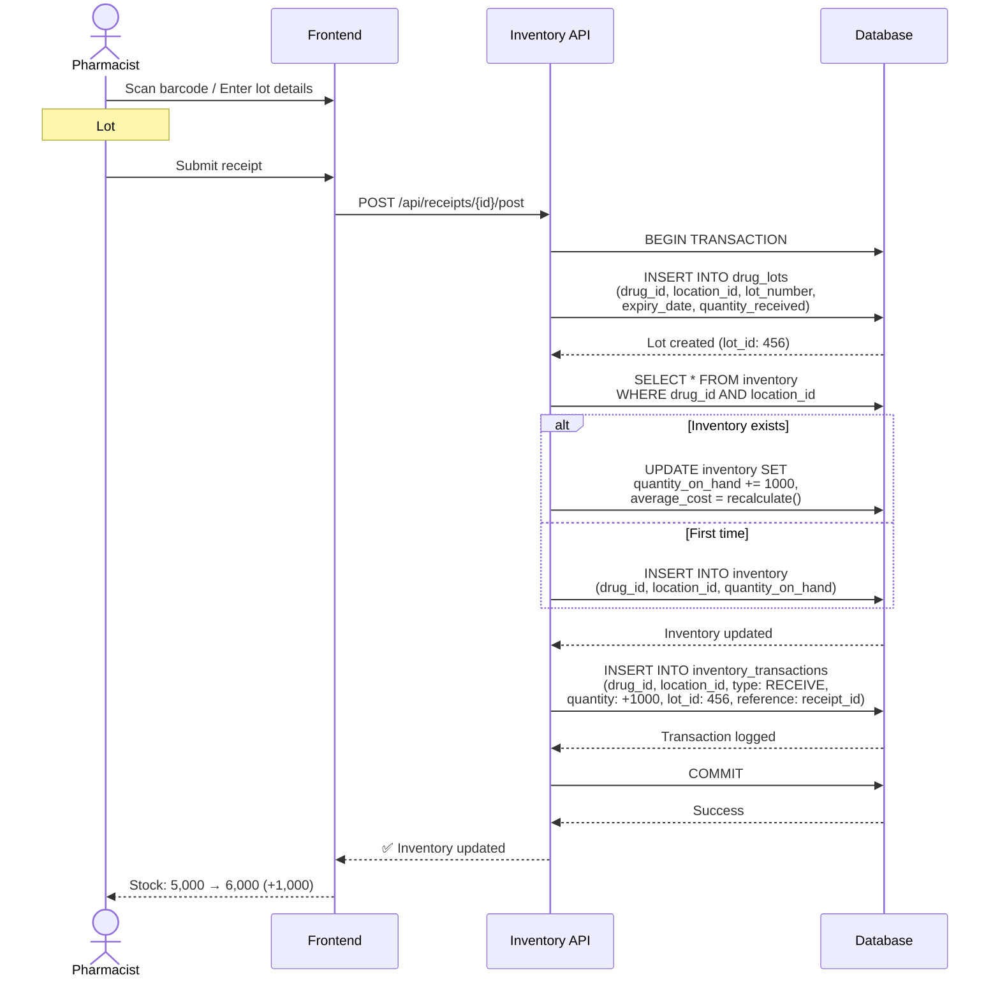

# 📦 Inventory System

**Real-time stock management with FIFO/FEFO tracking**

**Priority:** ⭐⭐⭐ สูงสุด
**Tables:** 3 tables
**Functions:** 3 functions
**Status:** ✅ Production Ready
**Version:** 2.6.0
**Last Updated:** 2025-01-28
**Workflows:** 5 major processes

---

## 📋 Overview

Inventory System จัดการสต็อกยาแบบ Real-time:

### 3 โมดูลหลัก

1. **📊 Stock Levels** (1 table: inventory)
   - Multi-location stock tracking
   - Min/Max/Reorder point management
   - Real-time quantity updates
   - Average cost and last cost tracking

2. **🏷️ Lot Tracking** (1 table: drug_lots)
   - FIFO (First In First Out) management
   - FEFO (First Expire First Out) management
   - Lot number and expiry date tracking
   - Complete traceability from receipt to dispensing

3. **📝 Audit Trail** (1 table: inventory_transactions)
   - Immutable transaction log
   - All stock movements recorded
   - Complete reference tracking
   - User and timestamp tracking

### 3 Database Functions

1. **get_fifo_lots()** - Get lots in FIFO order (oldest first)
2. **get_fefo_lots()** - Get lots in FEFO order (expiring first)
3. **update_inventory_from_receipt()** - Auto-update inventory from receipt

---

## 🔗 System Dependencies

### Inventory ให้ข้อมูลแก่:

```
Inventory
    ├─→ Distribution (stock availability, FIFO/FEFO lots)
    ├─→ Procurement (reorder points, low stock alerts)
    ├─→ Ministry Reporting (export_inventory view - 15 fields)
    └─→ Dashboard (stock levels, expiring drugs)
```

### Inventory ใช้ข้อมูลจาก:

```
Procurement → Inventory
    └─ receipts → create lots, update stock

Master Data → Inventory
    ├─ drugs → what to stock
    └─ locations → where to stock

Distribution → Inventory
    └─ drug_distributions → reduce stock (FIFO/FEFO)

Drug Return → Inventory
    └─ drug_returns → increase stock
```

---

## 🔄 Main Workflow: Receive Goods & Update Inventory

**ภาพรวม workflow หลักของระบบ - การรับยาเข้าคลังและอัพเดท stock แบบ FIFO**



**สำหรับ workflow ละเอียดเพิ่มเติม**: ดู [WORKFLOWS.md](WORKFLOWS.md)

---

## 🎯 Key Features

### ✅ Real-time Stock Tracking

**Multi-location inventory:**

- Track stock at Warehouse, Pharmacy, Ward, Emergency, etc.
- Independent min/max/reorder points per location
- Real-time quantity updates on all transactions
- Automatic low stock alerts

### ✅ FIFO/FEFO Management

**Complete lot traceability:**

- **FIFO (First In First Out)** - Dispense oldest lots first
- **FEFO (First Expire First Out)** - Dispense expiring lots first
- Lot number tracking from receipt to dispensing
- Expiry date enforcement (block dispensing 30 days before expiry)

### ✅ Intelligent Reorder Points

**Smart replenishment:**

- Reorder Point = (Avg Daily Usage × Lead Time) + Safety Stock
- Automatic alerts when stock ≤ reorder point
- Historical usage analysis (90 days)
- Configurable lead times per vendor

### ✅ Cost Management

**Accurate inventory valuation:**

- **Average Cost** - Weighted average for COGS calculation
- **Last Cost** - Most recent purchase price
- Automatic cost updates on receipt posting
- Inventory valuation reports

### ✅ Complete Audit Trail

**Full traceability:**

- Every stock movement recorded
- Immutable transaction log (no edits/deletes)
- Reference to source documents (receipt, distribution, etc.)
- User and timestamp tracking

### ✅ Expiry Management

**Prevent expired drug dispensing:**

- Daily expiry checks (180/90/30 days alerts)
- Automatic quarantine of expired lots
- Expiry reports for proactive management
- Block dispensing 30 days before expiry

---

## 📂 Documentation Files

| File                             | Description                                                                          |
| -------------------------------- | ------------------------------------------------------------------------------------ |
| **README.md**                    | This file - Overview of Inventory system                                             |
| **[SCHEMA.md](SCHEMA.md)**       | Database schema: 3 tables + 3 functions + ER diagrams                                |
| **[WORKFLOWS.md](WORKFLOWS.md)** | Business workflows: 5 major flows (Receipt, FIFO/FEFO, Transfer, Adjustment, Expiry) |
| **api/**                         | OpenAPI specs (will be auto-generated from AegisX)                                   |

---

## 🎯 Quick Start

### 1. Check Stock Availability

```typescript
import { prisma } from './lib/prisma';

// Check if drug is available at location
const stock = await prisma.inventory.findUnique({
  where: {
    drug_id_location_id: {
      drug_id: 1, // Paracetamol
      location_id: 2, // Central Pharmacy
    },
  },
  include: {
    drug: {
      include: {
        generic: true,
      },
    },
    location: true,
  },
});

if (stock && stock.quantity_on_hand >= requestedQuantity) {
  console.log('Stock available:', stock.quantity_on_hand);
} else {
  console.log('Insufficient stock');
}
```

### 2. Get FIFO Lots for Dispensing

```typescript
// Get lots in FIFO order (oldest first)
const fifoLots = await prisma.$queryRaw`
  SELECT * FROM get_fifo_lots(
    ${drugId}::BIGINT,
    ${locationId}::BIGINT,
    ${quantityNeeded}::DECIMAL
  )
`;

console.log('FIFO lots to dispense:', fifoLots);
// Returns: [
//   { lot_id: 15, lot_number: 'LOT-PCM-2024-A', quantity: 500, unit_cost: 0.50 },
//   { lot_id: 23, lot_number: 'LOT-PCM-2025-B', quantity: 500, unit_cost: 0.55 }
// ]
```

### 3. Get FEFO Lots (Expiring First)

```typescript
// Get lots in FEFO order (expiring soonest first)
const fefoLots = await prisma.$queryRaw`
  SELECT * FROM get_fefo_lots(
    ${drugId}::BIGINT,
    ${locationId}::BIGINT,
    ${quantityNeeded}::DECIMAL
  )
`;

console.log('FEFO lots to dispense:', fefoLots);
// Returns: [
//   { lot_id: 18, lot_number: 'LOT-IBU-2025-A', expiry_date: '2025-06-30', quantity: 300 },
//   { lot_id: 22, lot_number: 'LOT-IBU-2025-B', expiry_date: '2025-12-31', quantity: 200 }
// ]
```

### 4. Post Receipt to Inventory

```typescript
// When receipt is posted in Procurement
const result = await prisma.$queryRaw`
  SELECT update_inventory_from_receipt(${receiptId}::BIGINT)
`;

// This function automatically:
// 1. Creates/updates inventory records
// 2. Creates drug lots with expiry dates
// 3. Updates average_cost and last_cost
// 4. Creates RECEIVE transactions
```

### 5. Transfer Stock Between Locations

```typescript
async function transferStock(drugId: bigint, fromLocationId: bigint, toLocationId: bigint, quantity: number, userId: bigint) {
  return await prisma.$transaction(async (tx) => {
    // 1. Check source stock
    const sourceInventory = await tx.inventory.findUnique({
      where: {
        drug_id_location_id: {
          drug_id: drugId,
          location_id: fromLocationId,
        },
      },
    });

    if (!sourceInventory || sourceInventory.quantity_on_hand < quantity) {
      throw new Error('Insufficient stock at source location');
    }

    // 2. Get FIFO lots
    const lots = await tx.$queryRaw`
      SELECT * FROM get_fifo_lots(${drugId}, ${fromLocationId}, ${quantity})
    `;

    // 3. Deduct from source
    await tx.inventory.update({
      where: { id: sourceInventory.id },
      data: {
        quantity_on_hand: { decrement: quantity },
        last_updated: new Date(),
      },
    });

    // 4. Add to destination
    let destInventory = await tx.inventory.findUnique({
      where: {
        drug_id_location_id: {
          drug_id: drugId,
          location_id: toLocationId,
        },
      },
    });

    if (!destInventory) {
      destInventory = await tx.inventory.create({
        data: {
          drug_id: drugId,
          location_id: toLocationId,
          quantity_on_hand: quantity,
          average_cost: sourceInventory.average_cost,
          last_cost: sourceInventory.last_cost,
        },
      });
    } else {
      await tx.inventory.update({
        where: { id: destInventory.id },
        data: {
          quantity_on_hand: { increment: quantity },
        },
      });
    }

    // 5. Create transaction records
    await tx.inventoryTransaction.createMany({
      data: [
        {
          inventory_id: sourceInventory.id,
          transaction_type: 'TRANSFER',
          quantity: -quantity,
          reference_id: destInventory.id,
          reference_type: 'transfer_out',
          created_by: userId,
        },
        {
          inventory_id: destInventory.id,
          transaction_type: 'TRANSFER',
          quantity: quantity,
          reference_id: sourceInventory.id,
          reference_type: 'transfer_in',
          created_by: userId,
        },
      ],
    });

    return { sourceInventory, destInventory };
  });
}
```

### 6. Check Low Stock Items

```typescript
// Get items below reorder point
const lowStock = await prisma.inventory.findMany({
  where: {
    quantity_on_hand: {
      lte: prisma.raw('reorder_point'),
    },
    location_id: 2, // Central Pharmacy
  },
  include: {
    drug: {
      include: {
        generic: true,
      },
    },
    location: true,
  },
  orderBy: {
    quantity_on_hand: 'asc',
  },
});

console.log(`Found ${lowStock.length} items below reorder point`);
```

### 7. Check Expiring Drugs

```typescript
// Get drugs expiring in next 90 days
const expiringLots = await prisma.drugLot.findMany({
  where: {
    expiry_date: {
      lte: new Date(Date.now() + 90 * 24 * 60 * 60 * 1000),
    },
    quantity_available: {
      gt: 0,
    },
    is_active: true,
  },
  include: {
    drug: {
      include: {
        generic: true,
      },
    },
    location: true,
  },
  orderBy: {
    expiry_date: 'asc',
  },
});

console.log('Expiring drugs:', expiringLots.length);
```

### 8. Stock Adjustment (Physical Count)

```typescript
async function adjustStock(drugId: bigint, locationId: bigint, countedQuantity: number, reason: string, userId: bigint) {
  return await prisma.$transaction(async (tx) => {
    const inventory = await tx.inventory.findUnique({
      where: {
        drug_id_location_id: {
          drug_id: drugId,
          location_id: locationId,
        },
      },
    });

    if (!inventory) {
      throw new Error('Inventory record not found');
    }

    const systemQty = inventory.quantity_on_hand;
    const variance = countedQuantity - systemQty;

    if (variance === 0) {
      return { inventory, variance: 0, adjusted: false };
    }

    // Update inventory
    const updatedInventory = await tx.inventory.update({
      where: { id: inventory.id },
      data: {
        quantity_on_hand: countedQuantity,
        last_updated: new Date(),
      },
    });

    // Create adjustment transaction
    await tx.inventoryTransaction.create({
      data: {
        inventory_id: inventory.id,
        transaction_type: 'ADJUST',
        quantity: variance,
        unit_cost: inventory.average_cost,
        reference_type: 'physical_count',
        notes: `Physical count: System=${systemQty}, Counted=${countedQuantity}, Variance=${variance}. Reason: ${reason}`,
        created_by: userId,
      },
    });

    return { inventory: updatedInventory, variance, adjusted: true };
  });
}
```

---

## 🔗 Related Documentation

### Global Documentation

- **[SYSTEM_ARCHITECTURE.md](../../SYSTEM_ARCHITECTURE.md)** - Overview of all 8 systems
- **[DATABASE_STRUCTURE.md](../../DATABASE_STRUCTURE.md)** - Complete database schema (44 tables)
- **[END_TO_END_WORKFLOWS.md](../../END_TO_END_WORKFLOWS.md)** - Cross-system workflows

### Per-System Documentation

- **[SCHEMA.md](SCHEMA.md)** - Detailed schema of this system's 3 tables + 3 functions
- **[WORKFLOWS.md](WORKFLOWS.md)** - 5 business workflows: Receipt, FIFO/FEFO, Transfer, Adjustment, Expiry

### Related Systems

- **[Procurement](../03-procurement/README.md)** - Receipt → Inventory integration
- **[Distribution](../05-distribution/README.md)** - Inventory → Distribution flow
- **[Master Data](../01-master-data/README.md)** - Drugs and locations

### Technical Reference

- **`prisma/schema.prisma`** - Source schema definition
- **`prisma/functions.sql`** - FIFO/FEFO and receipt functions
- **`prisma/views.sql`** - low_stock_items, expiring_drugs views
- **AegisX Swagger UI** - http://127.0.0.1:3383/documentation (when running)

---

## 📈 Next Steps

1. ✅ **Read** [SCHEMA.md](SCHEMA.md) - Understand 3 tables + 3 functions
2. ✅ **Read** [WORKFLOWS.md](WORKFLOWS.md) - Understand 5 business workflows
3. ⏳ **Implement** AegisX APIs - Inventory endpoints
4. ⏳ **Test** FIFO/FEFO Logic - Test lot dispensing
5. ⏳ **Test** Receipt Integration - Test receipt → inventory flow
6. ⏳ **Integrate** with Distribution - Test FIFO/FEFO dispensing
7. ⏳ **Setup** Expiry Alerts - Configure daily expiry checks

---

**Built with ❤️ for INVS Modern Team**
**Last Updated:** 2025-01-28 | **Version:** 2.6.0
