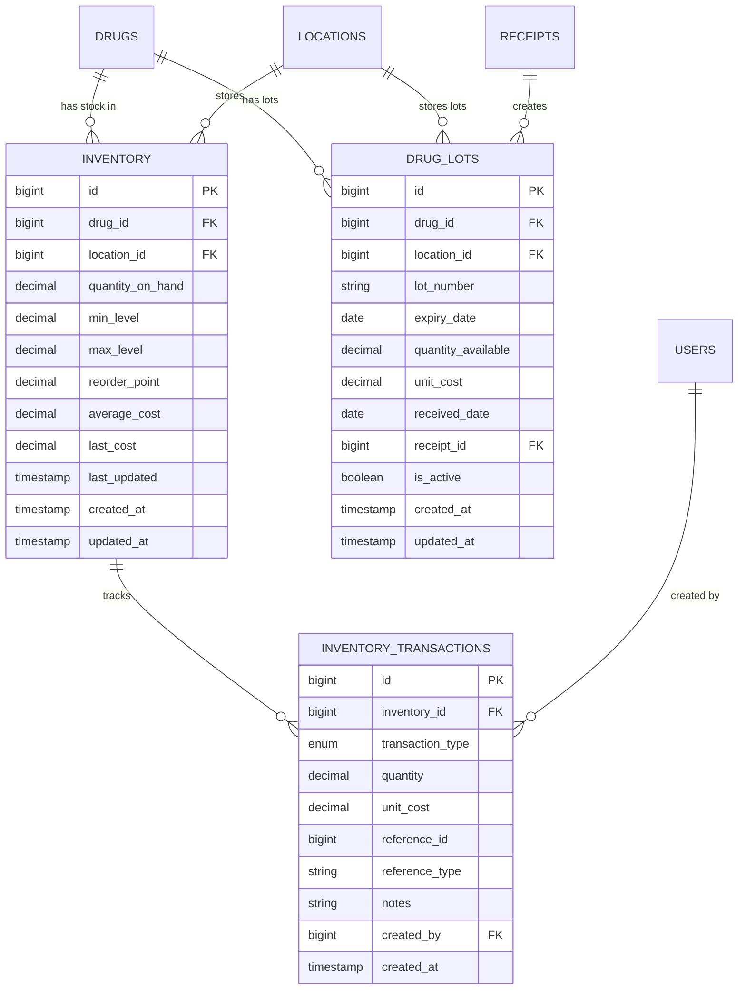

# 📦 Inventory - Database Schema

**System:** Inventory Management
**Tables:** 3 tables
**Functions:** 3 functions
**Version:** 2.6.0
**Last Updated:** 2025-01-28

---

## 📖 Table of Contents

### Core Tables

1. [Inventory](#1-inventory) - สต็อกคงคลัง
2. [Drug Lots](#2-drug_lots) - ล็อตยา FIFO/FEFO
3. [Inventory Transactions](#3-inventory_transactions) - ประวัติการเคลื่อนไหว

### Database Functions

4. [FIFO/FEFO Functions](#-database-functions) - get_fifo_lots, get_fefo_lots, update_inventory_from_receipt

### Reference

- [ER Diagram](#-entity-relationship-diagram)
- [Table Overview](#-table-overview)
- [Cross-System Integration](#-cross-system-integration)
- [Common Queries](#-common-queries)
- [Business Rules](#-business-rules)

---

## 📊 Table Overview

| Table                    | Records     | Purpose                                                    |
| ------------------------ | ----------- | ---------------------------------------------------------- |
| `inventory`              | **7,105**   | Stock levels per drug/location with min/max/reorder points |
| `drug_lots`              | **6,033**   | FIFO/FEFO lot tracking with expiry dates                   |
| `inventory_transactions` | 0 (pending) | Complete audit trail of all inventory movements            |

---

## 🗺️ Entity Relationship Diagram



**Color Legend:**

- 🟢 Green: Inventory tables
- 🔵 Blue: Master Data (drugs, locations)
- 🟡 Yellow: Procurement (receipts)
- 🟣 Purple: System (users)

---

## 📋 Detailed Table Definitions

### 1. inventory

**Purpose:** Track stock levels for each drug at each location

| Column             | Type          | Constraints                         | Description                               |
| ------------------ | ------------- | ----------------------------------- | ----------------------------------------- |
| `id`               | BIGINT        | PK, AUTO_INCREMENT                  | Primary key                               |
| `drug_id`          | BIGINT        | FK → drugs(id), NOT NULL            | Which drug                                |
| `location_id`      | BIGINT        | FK → locations(id), NOT NULL        | Which storage location                    |
| `quantity_on_hand` | DECIMAL(15,3) | NOT NULL, DEFAULT 0                 | Current stock quantity                    |
| `min_level`        | DECIMAL(15,3) |                                     | Minimum stock level (alert threshold)     |
| `max_level`        | DECIMAL(15,3) |                                     | Maximum stock level (overstock threshold) |
| `reorder_point`    | DECIMAL(15,3) |                                     | Reorder point (when to purchase)          |
| `average_cost`     | DECIMAL(15,4) |                                     | Weighted average cost                     |
| `last_cost`        | DECIMAL(15,4) |                                     | Most recent purchase cost                 |
| `last_updated`     | TIMESTAMP     |                                     | Last stock movement timestamp             |
| `created_at`       | TIMESTAMP     | DEFAULT CURRENT_TIMESTAMP           |                                           |
| `updated_at`       | TIMESTAMP     | DEFAULT CURRENT_TIMESTAMP ON UPDATE |                                           |

**Unique Constraints:**

- `UNIQUE(drug_id, location_id)` - One inventory record per drug per location

**Indexes:**

```sql
CREATE INDEX idx_inventory_drug ON inventory(drug_id);
CREATE INDEX idx_inventory_location ON inventory(location_id);
CREATE INDEX idx_inventory_reorder ON inventory(reorder_point)
    WHERE quantity_on_hand <= reorder_point;
```

**Business Rules:**

- `quantity_on_hand >= 0` (no negative stock)
- `min_level < reorder_point < max_level` (if all specified)
- `average_cost` recalculated on each RECEIVE transaction
- `last_cost` updated from most recent receipt

---

### 2. drug_lots

**Purpose:** Track drug lots with expiry dates for FIFO/FEFO management

| Column               | Type          | Constraints                         | Description                |
| -------------------- | ------------- | ----------------------------------- | -------------------------- |
| `id`                 | BIGINT        | PK, AUTO_INCREMENT                  | Primary key                |
| `drug_id`            | BIGINT        | FK → drugs(id), NOT NULL            | Which drug                 |
| `location_id`        | BIGINT        | FK → locations(id), NOT NULL        | Storage location           |
| `lot_number`         | VARCHAR(50)   | NOT NULL                            | Manufacturer lot number    |
| `expiry_date`        | DATE          | NOT NULL                            | Expiration date            |
| `quantity_available` | DECIMAL(15,3) | NOT NULL, DEFAULT 0                 | Remaining quantity in lot  |
| `unit_cost`          | DECIMAL(15,4) | NOT NULL                            | Cost per unit for this lot |
| `received_date`      | DATE          | NOT NULL                            | Date lot was received      |
| `receipt_id`         | BIGINT        | FK → receipts(id)                   | Source receipt             |
| `is_active`          | BOOLEAN       | DEFAULT TRUE                        | FALSE when lot depleted    |
| `created_at`         | TIMESTAMP     | DEFAULT CURRENT_TIMESTAMP           |                            |
| `updated_at`         | TIMESTAMP     | DEFAULT CURRENT_TIMESTAMP ON UPDATE |                            |

**Unique Constraints:**

- `UNIQUE(drug_id, location_id, lot_number)` - One lot per drug per location

**Indexes:**

```sql
CREATE INDEX idx_drug_lots_drug ON drug_lots(drug_id);
CREATE INDEX idx_drug_lots_location ON drug_lots(location_id);
CREATE INDEX idx_drug_lots_expiry ON drug_lots(expiry_date)
    WHERE is_active = TRUE;
CREATE INDEX idx_drug_lots_fifo ON drug_lots(drug_id, location_id, received_date)
    WHERE quantity_available > 0;
CREATE INDEX idx_drug_lots_fefo ON drug_lots(drug_id, location_id, expiry_date)
    WHERE quantity_available > 0;
```

**Business Rules:**

- `quantity_available >= 0`
- `expiry_date > received_date`
- `is_active = FALSE` when `quantity_available = 0`
- Used by FIFO (First In First Out) dispensing
- Used by FEFO (First Expire First Out) dispensing

---

### 3. inventory_transactions

**Purpose:** Complete audit trail of all inventory movements

| Column             | Type          | Constraints                  | Description                                     |
| ------------------ | ------------- | ---------------------------- | ----------------------------------------------- |
| `id`               | BIGINT        | PK, AUTO_INCREMENT           | Primary key                                     |
| `inventory_id`     | BIGINT        | FK → inventory(id), NOT NULL | Which inventory record                          |
| `transaction_type` | ENUM          | NOT NULL                     | RECEIVE, ISSUE, TRANSFER, ADJUST, RETURN        |
| `quantity`         | DECIMAL(15,3) | NOT NULL                     | Quantity moved (+ or -)                         |
| `unit_cost`        | DECIMAL(15,4) |                              | Cost per unit (for costing)                     |
| `reference_id`     | BIGINT        |                              | ID of source document                           |
| `reference_type`   | VARCHAR(50)   |                              | Type: receipt, distribution, return, adjustment |
| `notes`            | TEXT          |                              | Transaction notes/reason                        |
| `created_by`       | BIGINT        | FK → users(id)               | User who created transaction                    |
| `created_at`       | TIMESTAMP     | DEFAULT CURRENT_TIMESTAMP    | Transaction timestamp                           |

**Indexes:**

```sql
CREATE INDEX idx_inv_trans_inventory ON inventory_transactions(inventory_id);
CREATE INDEX idx_inv_trans_type ON inventory_transactions(transaction_type);
CREATE INDEX idx_inv_trans_reference ON inventory_transactions(reference_id, reference_type);
CREATE INDEX idx_inv_trans_created ON inventory_transactions(created_at DESC);
CREATE INDEX idx_inv_trans_user ON inventory_transactions(created_by);
```

**Transaction Types:**

| Type       | Description                 | Quantity | Reference Type |
| ---------- | --------------------------- | -------- | -------------- |
| `RECEIVE`  | รับเข้า from receipt        | +        | receipt        |
| `ISSUE`    | เบิกออก to department       | -        | distribution   |
| `TRANSFER` | โอนระหว่าง location         | +/-      | transfer       |
| `ADJUST`   | ปรับปรุง (count adjustment) | +/-      | adjustment     |
| `RETURN`   | รับคืน from department      | +        | return         |

**Business Rules:**

- Immutable (no updates/deletes) - audit trail integrity
- `quantity` can be positive or negative depending on transaction type
- `reference_id` + `reference_type` must exist
- Automatically created by system workflows (receipt posting, distribution, etc.)

---

## 🔧 Database Functions

### 1. get_fifo_lots()

**Purpose:** Get drug lots in FIFO order (oldest received first)

```sql
CREATE FUNCTION get_fifo_lots(
    p_drug_id BIGINT,
    p_location_id BIGINT,
    p_quantity_needed DECIMAL(15,3)
)
RETURNS TABLE(
    lot_id BIGINT,
    lot_number VARCHAR(50),
    quantity DECIMAL(15,3),
    unit_cost DECIMAL(15,4)
)
```

**Logic:**

1. Find all active lots for drug/location
2. Order by `received_date ASC` (oldest first)
3. Return lots until `p_quantity_needed` is fulfilled

**Example:**

```sql
-- Get lots for dispensing 1000 tablets of Paracetamol from Central Pharmacy
SELECT * FROM get_fifo_lots(1, 2, 1000.000);

-- Returns:
-- lot_id | lot_number      | quantity | unit_cost
-- -------|-----------------|----------|----------
-- 15     | LOT-PCM-2024-A  | 500.000  | 0.50
-- 23     | LOT-PCM-2025-B  | 500.000  | 0.55
```

---

### 2. get_fefo_lots()

**Purpose:** Get drug lots in FEFO order (expiring first)

```sql
CREATE FUNCTION get_fefo_lots(
    p_drug_id BIGINT,
    p_location_id BIGINT,
    p_quantity_needed DECIMAL(15,3)
)
RETURNS TABLE(
    lot_id BIGINT,
    lot_number VARCHAR(50),
    expiry_date DATE,
    quantity DECIMAL(15,3)
)
```

**Logic:**

1. Find all active lots for drug/location
2. Order by `expiry_date ASC` (expires soonest first)
3. Return lots until `p_quantity_needed` is fulfilled

**Example:**

```sql
-- Get lots expiring soonest for 500 tablets
SELECT * FROM get_fefo_lots(2, 2, 500.000);

-- Returns:
-- lot_id | lot_number     | expiry_date | quantity
-- -------|----------------|-------------|----------
-- 18     | LOT-IBU-2025-A | 2025-06-30  | 300.000
-- 22     | LOT-IBU-2025-B | 2025-12-31  | 200.000
```

---

### 3. update_inventory_from_receipt()

**Purpose:** Automatically update inventory when receipt is posted

```sql
CREATE FUNCTION update_inventory_from_receipt(
    p_receipt_id BIGINT
)
RETURNS BOOLEAN
```

**Logic:**

1. Get all items from receipt
2. For each item:
   - Create/update `inventory` record (increase quantity_on_hand)
   - Create `drug_lots` record
   - Create `inventory_transactions` record (type: RECEIVE)
   - Update average_cost and last_cost
3. Return TRUE if successful

**Example:**

```sql
-- Post receipt GR-2025-04-001 to inventory
SELECT update_inventory_from_receipt(123);

-- Result: TRUE
-- Creates:
-- - inventory update: quantity_on_hand += received_quantity
-- - drug_lots: new lot with expiry date
-- - inventory_transactions: RECEIVE transaction
```

**Atomic Transaction:** All operations succeed or all fail

---

## 🔗 Cross-System Integration

### Inventory receives data from:

```
Procurement → Inventory
    └─ receipts → update inventory, create lots, add transactions

Distribution → Inventory
    └─ drug_distributions → reduce inventory, track FIFO/FEFO

Drug Return → Inventory
    └─ drug_returns → increase inventory, separate good/damaged

Master Data → Inventory
    ├─ drugs → what to stock
    └─ locations → where to stock
```

### Inventory provides data to:

```
Inventory → Procurement
    └─ reorder points → trigger PR creation

Inventory → Distribution
    └─ quantity_on_hand → check availability

Inventory → Ministry Reporting
    └─ export_inventory view → 15 fields for ministry

Inventory → Dashboard
    ├─ low_stock_items view → alerts
    └─ expiring_drugs view → expiry alerts
```

---

## 💡 Common Queries

### Check Stock Availability

```typescript
// Check if drug is available at location
const stock = await prisma.inventory.findUnique({
  where: {
    drug_id_location_id: {
      drug_id: 1,
      location_id: 2,
    },
  },
  include: {
    drug: true,
    location: true,
  },
});

if (stock && stock.quantity_on_hand >= requestedQty) {
  console.log('Stock available:', stock.quantity_on_hand);
} else {
  console.log('Insufficient stock');
}
```

### Get Low Stock Items

```typescript
// Items below reorder point
const lowStock = await prisma.inventory.findMany({
  where: {
    quantity_on_hand: {
      lte: prisma.raw('reorder_point'),
    },
    location_id: 2, // Central Pharmacy
  },
  include: {
    drug: {
      include: {
        generic: true,
      },
    },
  },
  orderBy: {
    quantity_on_hand: 'asc',
  },
});
```

### Get Expiring Drugs (Next 90 Days)

```typescript
// Drugs expiring in next 90 days
const expiringLots = await prisma.drugLot.findMany({
  where: {
    expiry_date: {
      lte: new Date(Date.now() + 90 * 24 * 60 * 60 * 1000),
    },
    quantity_available: {
      gt: 0,
    },
    is_active: true,
  },
  include: {
    drug: {
      include: {
        generic: true,
      },
    },
    location: true,
  },
  orderBy: {
    expiry_date: 'asc',
  },
});
```

### Get FIFO Lots for Dispensing

```sql
-- Use database function for FIFO dispensing
SELECT * FROM get_fifo_lots(
    1,          -- drug_id (Paracetamol)
    2,          -- location_id (Central Pharmacy)
    1000.000    -- quantity_needed
);
```

### Inventory Movement History

```typescript
// Get all transactions for a drug
const history = await prisma.inventoryTransaction.findMany({
  where: {
    inventory: {
      drug_id: 1,
      location_id: 2,
    },
  },
  include: {
    inventory: {
      include: {
        drug: true,
      },
    },
    createdBy: {
      select: {
        username: true,
      },
    },
  },
  orderBy: {
    created_at: 'desc',
  },
  take: 100,
});
```

### Stock Valuation

```typescript
// Calculate total inventory value by location
const valuation = await prisma.$queryRaw`
  SELECT
    l.location_name,
    COUNT(DISTINCT i.drug_id) as drug_count,
    SUM(i.quantity_on_hand) as total_quantity,
    SUM(i.quantity_on_hand * i.average_cost) as total_value
  FROM inventory i
  JOIN locations l ON i.location_id = l.id
  WHERE i.quantity_on_hand > 0
  GROUP BY l.id, l.location_name
  ORDER BY total_value DESC
`;
```

---

## 📏 Business Rules

### Stock Movement Rules

1. **No Negative Stock**
   - `quantity_on_hand` cannot be negative
   - ISSUE transactions blocked if insufficient quantity

2. **FIFO/FEFO Enforcement**
   - FIFO: Dispense oldest received lots first
   - FEFO: Dispense lots expiring soonest first
   - Configurable per drug category

3. **Lot Tracking**
   - All receipts create new lot records
   - All distributions must reference specific lots
   - Lot quantities updated atomically

4. **Expiry Management**
   - Alert 180 days before expiry
   - Block dispensing 30 days before expiry (configurable)
   - Separate expired stock to quarantine location

### Reorder Point Logic

```
Reorder Point = (Average Daily Usage × Lead Time) + Safety Stock

Where:
- Average Daily Usage = Last 90 days consumption / 90
- Lead Time = Vendor delivery time (days)
- Safety Stock = Min level or 10% of average monthly usage
```

### Cost Calculation

**Average Cost (Weighted Average):**

```
New Average Cost = (Old Quantity × Old Cost + Received Quantity × New Cost)
                   / (Old Quantity + Received Quantity)
```

**Last Cost:**

- Simply the unit cost from most recent receipt

### Transaction Audit Trail

- **Immutable:** Transactions cannot be edited or deleted
- **Complete:** Every stock movement must have transaction record
- **Traceable:** reference_id + reference_type links to source document
- **Timestamped:** Exact timestamp of each movement

---

## 🎯 Validation Rules Summary

| Rule                       | Description                                 | Enforcement                             |
| -------------------------- | ------------------------------------------- | --------------------------------------- |
| **Unique Stock**           | One inventory record per drug/location      | Database unique constraint              |
| **Positive Quantity**      | quantity_on_hand >= 0                       | Application logic + check constraint    |
| **Valid Lot Number**       | Lot number must be unique per drug/location | Database unique constraint              |
| **Future Expiry**          | expiry_date > received_date                 | Check constraint                        |
| **FIFO Order**             | Dispense oldest lots first                  | Application logic using get_fifo_lots() |
| **FEFO Order**             | Dispense expiring lots first                | Application logic using get_fefo_lots() |
| **Reorder Alert**          | Alert when quantity <= reorder_point        | View: low_stock_items                   |
| **Expiry Alert**           | Alert 180 days before expiry                | View: expiring_drugs                    |
| **Immutable Transactions** | No updates/deletes allowed                  | Database trigger                        |
| **Reference Integrity**    | reference_id must exist                     | Foreign key constraints                 |

---

## 🔍 Related Documentation

### System Documentation

- **[README.md](README.md)** - Inventory system overview
- **[WORKFLOWS.md](WORKFLOWS.md)** - Stock management workflows

### Global Documentation

- **[SYSTEM_ARCHITECTURE.md](../../SYSTEM_ARCHITECTURE.md)** - All 8 systems
- **[DATABASE_STRUCTURE.md](../../DATABASE_STRUCTURE.md)** - Complete database schema
- **[END_TO_END_WORKFLOWS.md](../../END_TO_END_WORKFLOWS.md)** - Cross-system flows

### Related Systems

- **[Procurement](../03-procurement/SCHEMA.md)** - Receipt → Inventory integration
- **[Distribution](../05-distribution/SCHEMA.md)** - Inventory → Distribution flow
- **[Master Data](../01-master-data/SCHEMA.md)** - Drugs and locations

### Technical Reference

- **`prisma/schema.prisma`** - Source schema definition (lines 200-250)
- **`prisma/functions.sql`** - FIFO/FEFO functions (lines 350-450)
- **`prisma/views.sql`** - low_stock_items, expiring_drugs views

---

**Built with ❤️ for INVS Modern Team**
**Last Updated:** 2025-01-28 | **Version:** 2.6.0
