# 🏥 Distribution System

**Department drug dispensing with FIFO/FEFO tracking**

**Priority:** ⭐⭐⭐ สูง
**Tables:** 3 tables (2 core + 1 distribution type) ⭐
**Status:** ✅ Production Ready
**Version:** 2.6.0
**Last Updated:** 2025-01-28
**Workflows:** 4 major processes
**Data:** 2 distribution types (Phase 3) ⭐

---

## 📋 Overview

Distribution System จัดการการเบิกจ่ายยาให้แผนกต่างๆ:

### Main Features

1. **📝 Distribution Request** (drug_distributions)
   - Departments (Ward, OPD, ICU, etc.) request drugs from Pharmacy
   - Multi-level approval workflow
   - Stock availability validation
   - Status tracking: PENDING → APPROVED → DISPENSED → COMPLETED

2. **💊 Drug Dispensing** (drug_distribution_items)
   - FIFO/FEFO lot selection (automatic from Inventory)
   - Lot number and expiry date tracking
   - Real-time inventory deduction
   - Complete audit trail

3. **🏷️ Distribution Types** (distribution_types) ⭐ NEW (Phase 3)
   - จ่ายถาวร (Permanent distribution)
   - ยืม-คืน (Loan-return)
   - 2 standard types for tracking

4. **📊 Usage Tracking**
   - Department drug consumption reports
   - Monthly/yearly usage analysis
   - Ministry compliance export (11 fields)
   - Cost center allocation

---

## 📊 Main Workflow: Request and Dispense Drugs

**Workflow:** Department requests drugs → Pharmacy dispenses with FIFO/FEFO → Inventory updated

```mermaid
sequenceDiagram
    actor Dept as Department Staff
    participant UI as Frontend
    participant API as Backend API
    participant DB as Database
    participant Inv as Inventory System

    Note over Dept,Inv: 1. Create Distribution Request

    Dept->>UI: Create distribution request
    UI->>API: POST /api/distributions
    API->>DB: Check stock availability
    DB-->>API: Available stock: 1,000 tablets

    alt Stock Available
        API->>DB: Create distribution (PENDING)
        API->>Inv: Call get_fifo_lots() to preview lots
        Inv-->>API: Lot#2024-001 (800), Lot#2024-002 (200)
        API-->>UI: Distribution created (DIST-2025-001)
        UI-->>Dept: Show distribution with lot preview
    else Stock Insufficient
        API-->>UI: Error: Insufficient stock
        UI-->>Dept: Cannot create - out of stock
    end

    Note over Dept,Inv: 2. Supervisor Approves

    Dept->>UI: Submit for approval
    UI->>API: POST /api/distributions/{id}/approve
    API->>DB: Re-check stock (prevent overselling)
    DB-->>API: Stock OK
    API->>DB: Update status → APPROVED
    DB-->>API: Distribution approved
    API-->>UI: Approval success
    UI-->>Dept: Approved - ready for dispensing

    Note over Dept,Inv: 3. Pharmacist Dispenses (FIFO/FEFO)

    Dept->>UI: Request dispensing
    UI->>API: POST /api/distributions/{id}/dispense
    API->>Inv: get_fifo_lots(drug, location, qty)
    Inv-->>API: FIFO lots: [Lot#2024-001, Lot#2024-002]

    loop For each lot
        API->>DB: Deduct from drug_lots
        API->>DB: Update inventory.quantity_on_hand
        API->>DB: Create ISSUE transaction
    end

    API->>DB: Update status → DISPENSED
    DB-->>API: Dispensing complete
    API-->>UI: Success with lot details
    UI-->>Dept: Dispensed - ready for pickup

    Note over Dept,Inv: 4. Department Receives

    Dept->>UI: Confirm receipt
    UI->>API: POST /api/distributions/{id}/complete
    API->>DB: Update status → COMPLETED
    DB-->>API: Distribution completed
    API-->>UI: Success
    UI-->>Dept: Completed - drugs received

    Note over Dept,Inv: Result: Drugs dispensed with full traceability
```



**Key Points:**

1. **Stock Validation** - Checked before creation and before approval
2. **FIFO/FEFO** - Automatic lot selection using `get_fifo_lots()` function
3. **Atomic Updates** - All inventory changes in single transaction
4. **Audit Trail** - ISSUE transaction logged with lot numbers
5. **Department Receipt** - Complete workflow with confirmation

---

## 🔗 System Dependencies

### Distribution ให้ข้อมูลแก่:

```
Distribution
    ├─→ Ministry Reporting (export_distribution view - 11 fields)
    ├─→ Budget Management (department consumption tracking)
    └─→ Dashboard (usage reports, alerts)
```

### Distribution ใช้ข้อมูลจาก:

```
Inventory → Distribution
    ├─ inventory → check stock availability
    ├─ drug_lots → FIFO/FEFO lot selection
    └─ get_fifo_lots() function

Master Data → Distribution
    ├─ locations → from/to locations (Pharmacy, Ward, OPD)
    ├─ departments → requesting department
    └─ drugs → what to dispense
```

---

## 🎯 Key Features

### ✅ Complete Distribution Workflow

**From request to receipt:**

- Department creates distribution request
- Supervisor approves (with stock validation)
- Pharmacist dispenses using FIFO/FEFO
- Department receives and confirms
- Automatic inventory deduction

### ✅ FIFO/FEFO Integration

**Automatic lot selection:**

- Uses Inventory system's get_fifo_lots() function
- Oldest lots dispensed first (FIFO)
- Or expiring lots first (FEFO - configurable)
- Lot and expiry date recorded for audit

### ✅ Multi-level Approval

**Approval workflow:**

- Requester creates distribution (PENDING)
- Supervisor approves (checks policy & stock)
- Pharmacist dispenses (updates inventory)
- Department receives (COMPLETED)

### ✅ Real-time Stock Control

**Stock validation:**

- Check availability before creating request
- Re-check before approval (prevent overselling)
- Atomic inventory deduction on dispensing
- ISSUE transaction in inventory_transactions

### ✅ Department Usage Tracking

**Consumption analysis:**

- Track which drugs each department uses
- Monthly/yearly usage reports
- Cost center allocation
- Ministry compliance reporting

---

## 📂 Documentation Files

| File                             | Description                                                                |
| -------------------------------- | -------------------------------------------------------------------------- |
| **README.md**                    | This file - Overview of Distribution system                                |
| **[SCHEMA.md](SCHEMA.md)**       | Database schema: 2 tables + ER diagrams + status flow                      |
| **[WORKFLOWS.md](WORKFLOWS.md)** | Business workflows: 4 major flows (Request, Approval, Dispensing, Receipt) |
| **api/**                         | OpenAPI specs (will be auto-generated from AegisX)                         |

---

## 🎯 Quick Start

### 1. Create Distribution Request

```typescript
import { prisma } from './lib/prisma';

async function createDistributionRequest(data: { requesting_dept_id: bigint; requested_by: string; from_location_id: bigint; items: Array<{ drug_id: bigint; quantity: number }> }) {
  return await prisma.$transaction(async (tx) => {
    // 1. Check stock availability
    for (const item of data.items) {
      const inventory = await tx.inventory.findUnique({
        where: {
          drug_id_location_id: {
            drug_id: item.drug_id,
            location_id: data.from_location_id,
          },
        },
      });

      if (!inventory || inventory.quantity_on_hand < item.quantity) {
        throw new Error(`Insufficient stock for drug ${item.drug_id}`);
      }
    }

    // 2. Generate distribution number
    const distributionNumber = `DIST-2025-04-001`; // Use auto-increment logic

    // 3. Get FIFO lots for each item (preview)
    const enrichedItems = await Promise.all(
      data.items.map(async (item) => {
        const lots = await tx.$queryRaw`
          SELECT * FROM get_fifo_lots(
            ${item.drug_id}::BIGINT,
            ${data.from_location_id}::BIGINT,
            ${item.quantity}::DECIMAL
          )
          LIMIT 1
        `;

        const lot = lots[0];
        return {
          drug_id: item.drug_id,
          quantity_dispensed: item.quantity,
          lot_number: lot.lot_number,
          unit_cost: lot.unit_cost,
          expiry_date: lot.expiry_date,
        };
      }),
    );

    // 4. Create distribution
    const distribution = await tx.drugDistribution.create({
      data: {
        distribution_number: distributionNumber,
        distribution_date: new Date(),
        from_location_id: data.from_location_id,
        requesting_dept_id: data.requesting_dept_id,
        requested_by: data.requested_by,
        status: 'PENDING',
        total_items: data.items.length,
        total_amount: enrichedItems.reduce((sum, item) => sum + item.quantity_dispensed * item.unit_cost, 0),
      },
    });

    // 5. Create items
    await tx.drugDistributionItem.createMany({
      data: enrichedItems.map((item, index) => ({
        distribution_id: distribution.id,
        item_number: index + 1,
        ...item,
      })),
    });

    return distribution;
  });
}

// Example usage:
const distribution = await createDistributionRequest({
  requesting_dept_id: 3n, // Nursing Department
  requested_by: 'Nurse Jane',
  from_location_id: 2n, // Central Pharmacy
  items: [
    { drug_id: 1n, quantity: 1000 }, // Paracetamol
    { drug_id: 2n, quantity: 500 }, // Ibuprofen
  ],
});
```

### 2. Approve Distribution

```typescript
async function approveDistribution(distributionId: bigint, approvedBy: string) {
  return await prisma.$transaction(async (tx) => {
    const distribution = await tx.drugDistribution.findUnique({
      where: { id: distributionId },
      include: { items: true },
    });

    if (distribution.status !== 'PENDING') {
      throw new Error('Distribution must be PENDING');
    }

    // Re-check stock availability
    for (const item of distribution.items) {
      const inventory = await tx.inventory.findUnique({
        where: {
          drug_id_location_id: {
            drug_id: item.drug_id,
            location_id: distribution.from_location_id,
          },
        },
      });

      if (!inventory || inventory.quantity_on_hand < item.quantity_dispensed) {
        throw new Error(`Stock changed - insufficient for drug ${item.drug_id}`);
      }
    }

    // Approve
    return await tx.drugDistribution.update({
      where: { id: distributionId },
      data: {
        status: 'APPROVED',
        approved_by: approvedBy,
        updated_at: new Date(),
      },
    });
  });
}
```

### 3. Dispense Drugs (with FIFO/FEFO)

```typescript
async function dispenseDistribution(distributionId: bigint, dispensedBy: string, userId: bigint) {
  return await prisma.$transaction(async (tx) => {
    const distribution = await tx.drugDistribution.findUnique({
      where: { id: distributionId },
      include: {
        items: true,
        requestingDept: true,
      },
    });

    if (distribution.status !== 'APPROVED') {
      throw new Error('Distribution must be APPROVED');
    }

    // Process each item
    for (const item of distribution.items) {
      // 1. Get FIFO lots
      const fifoLots = await tx.$queryRaw`
        SELECT * FROM get_fifo_lots(
          ${item.drug_id}::BIGINT,
          ${distribution.from_location_id}::BIGINT,
          ${item.quantity_dispensed}::DECIMAL
        )
      `;

      // 2. Deduct from lots
      let remaining = item.quantity_dispensed;
      for (const lot of fifoLots) {
        const deductQty = Math.min(lot.quantity, remaining);

        await tx.drugLot.update({
          where: { id: lot.lot_id },
          data: { quantity_available: { decrement: deductQty } },
        });

        remaining -= deductQty;
        if (remaining <= 0) break;
      }

      // 3. Update inventory
      await tx.inventory.update({
        where: {
          drug_id_location_id: {
            drug_id: item.drug_id,
            location_id: distribution.from_location_id,
          },
        },
        data: {
          quantity_on_hand: { decrement: item.quantity_dispensed },
          last_updated: new Date(),
        },
      });

      // 4. Create ISSUE transaction
      const inventory = await tx.inventory.findUnique({
        where: {
          drug_id_location_id: {
            drug_id: item.drug_id,
            location_id: distribution.from_location_id,
          },
        },
      });

      await tx.inventoryTransaction.create({
        data: {
          inventory_id: inventory.id,
          transaction_type: 'ISSUE',
          quantity: -item.quantity_dispensed,
          unit_cost: item.unit_cost,
          reference_id: distribution.id,
          reference_type: 'distribution',
          notes: `Distribution ${distribution.distribution_number} to ${distribution.requestingDept.dept_name}`,
          created_by: userId,
        },
      });
    }

    // 5. Update status
    return await tx.drugDistribution.update({
      where: { id: distributionId },
      data: {
        status: 'DISPENSED',
        dispensed_by: dispensedBy,
        updated_at: new Date(),
      },
    });
  });
}
```

### 4. Complete Distribution (Department Receipt)

```typescript
// Department confirms receipt
const completed = await prisma.drugDistribution.update({
  where: { id: distributionId },
  data: {
    status: 'COMPLETED',
    notes: 'Received by Ward Nurse',
    updated_at: new Date(),
  },
});
```

### 5. Get Distribution History by Department

```typescript
// Get all distributions for Nursing Department (last 30 days)
const history = await prisma.drugDistribution.findMany({
  where: {
    requesting_dept_id: 3n,
    distribution_date: {
      gte: new Date(Date.now() - 30 * 24 * 60 * 60 * 1000),
    },
  },
  include: {
    items: {
      include: {
        drug: {
          include: {
            generic: true,
          },
        },
      },
    },
    fromLocation: true,
    requestingDept: true,
  },
  orderBy: {
    distribution_date: 'desc',
  },
});

console.log(`Found ${history.length} distributions for Nursing Department`);
```

### 6. Department Usage Report

```typescript
// Monthly drug usage by department
const usageReport = await prisma.$queryRaw`
  SELECT
    dept.dept_name,
    d.trade_name,
    dg.generic_name,
    SUM(ddi.quantity_dispensed) as total_dispensed,
    SUM(ddi.quantity_dispensed * ddi.unit_cost) as total_value,
    COUNT(DISTINCT dd.id) as distribution_count
  FROM drug_distributions dd
  JOIN drug_distribution_items ddi ON dd.id = ddi.distribution_id
  JOIN departments dept ON dd.requesting_dept_id = dept.id
  JOIN drugs d ON ddi.drug_id = d.id
  JOIN drug_generics dg ON d.generic_id = dg.id
  WHERE dd.status IN ('DISPENSED', 'COMPLETED')
    AND dd.distribution_date >= DATE_TRUNC('month', CURRENT_DATE)
  GROUP BY dept.dept_name, d.trade_name, dg.generic_name
  ORDER BY total_value DESC
`;

console.log('Top drug usage:', usageReport);
```

---

## 🔗 Related Documentation

### Global Documentation

- **[SYSTEM_ARCHITECTURE.md](../../SYSTEM_ARCHITECTURE.md)** - Overview of all 8 systems
- **[DATABASE_STRUCTURE.md](../../DATABASE_STRUCTURE.md)** - Complete database schema (44 tables)
- **[END_TO_END_WORKFLOWS.md](../../END_TO_END_WORKFLOWS.md)** - Cross-system workflows

### Per-System Documentation

- **[SCHEMA.md](SCHEMA.md)** - Detailed schema of this system's 2 tables
- **[WORKFLOWS.md](WORKFLOWS.md)** - 4 business workflows: Request, Approval, Dispensing, Receipt

### Related Systems

- **[Inventory](../04-inventory/README.md)** - Stock management and FIFO/FEFO
- **[Master Data](../01-master-data/README.md)** - Locations, departments, drugs
- **[Budget Management](../02-budget-management/README.md)** - Department budget tracking

### Technical Reference

- **`prisma/schema.prisma`** - Source schema definition
- **`prisma/views.sql`** - export_distribution view (ministry compliance)
- **AegisX Swagger UI** - http://127.0.0.1:3383/documentation (when running)

---

## 📈 Next Steps

1. ✅ **Read** [SCHEMA.md](SCHEMA.md) - Understand 2 tables + status flow
2. ✅ **Read** [WORKFLOWS.md](WORKFLOWS.md) - Understand 4 business workflows
3. ⏳ **Implement** AegisX APIs - Distribution endpoints
4. ⏳ **Test** FIFO/FEFO Integration - Test lot selection from Inventory
5. ⏳ **Test** Approval Workflow - Test status transitions
6. ⏳ **Setup** Department Reports - Monthly usage reports
7. ⏳ **Integrate** with Frontend - Build distribution request screens

---

**Built with ❤️ for INVS Modern Team**
**Last Updated:** 2025-01-28 | **Version:** 2.6.0
