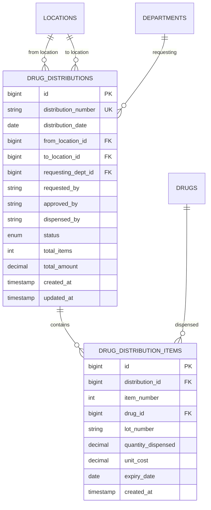
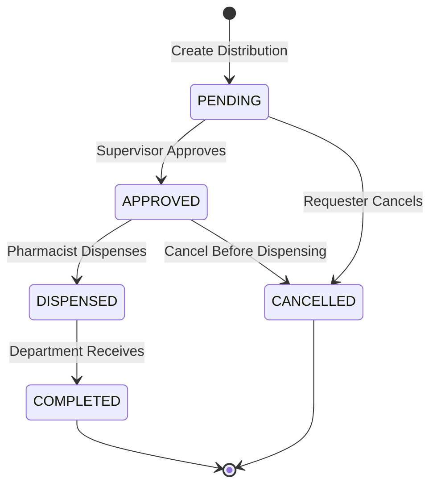

# 🏥 Distribution - Database Schema

**System:** Distribution Management
**Tables:** 3 tables (2 core + 1 distribution type) ⭐
**Version:** 2.6.0
**Last Updated:** 2025-01-28
**Data Migrated:** 2 distribution types (Phase 3) ⭐

---

## 📖 Table of Contents

### Core Tables

1. [Drug Distributions](#1-drug_distributions) - ใบเบิกยา
2. [Drug Distribution Items](#2-drug_distribution_items) - รายการยาที่เบิก
3. [Distribution Types](#3-distribution_types) ⭐ NEW (Phase 3) - ประเภทการจ่าย

### Reference

- [ER Diagram](#-entity-relationship-diagram)
- [Table Overview](#-table-overview)
- [Status Flow](#-status-workflow)
- [Cross-System Integration](#-cross-system-integration)
- [Common Queries](#-common-queries)
- [Business Rules](#-business-rules)

---

## 📊 Table Overview

| Table                     | Records       | Purpose                                                   |
| ------------------------- | ------------- | --------------------------------------------------------- |
| `drug_distributions`      | 2,000-10,000  | Distribution requests from departments (wards, OPD, etc.) |
| `drug_distribution_items` | 10,000-50,000 | Drug items dispensed with lot tracking                    |

---

## 🗺️ Entity Relationship Diagram



**Color Legend:**

- 🟢 Green: Distribution tables
- 🔵 Blue: Master Data (locations, departments, drugs)
- 🟡 Yellow: Inventory (stock deduction via FIFO/FEFO)

---

## 📋 Detailed Table Definitions

### 1. drug_distributions

**Purpose:** Track distribution requests from departments to dispense drugs

| Column                | Type          | Constraints                         | Description                                        |
| --------------------- | ------------- | ----------------------------------- | -------------------------------------------------- |
| `id`                  | BIGINT        | PK, AUTO_INCREMENT                  | Primary key                                        |
| `distribution_number` | VARCHAR(50)   | UNIQUE, NOT NULL                    | Running number (e.g., DIST-2025-04-001)            |
| `distribution_date`   | DATE          | NOT NULL                            | Date of distribution                               |
| `from_location_id`    | BIGINT        | FK → locations(id), NOT NULL        | Source location (e.g., Central Pharmacy)           |
| `to_location_id`      | BIGINT        | FK → locations(id)                  | Destination location (e.g., Ward, OPD)             |
| `requesting_dept_id`  | BIGINT        | FK → departments(id), NOT NULL      | Requesting department                              |
| `requested_by`        | VARCHAR(100)  |                                     | Name of requester                                  |
| `approved_by`         | VARCHAR(100)  |                                     | Name of approver                                   |
| `dispensed_by`        | VARCHAR(100)  |                                     | Name of pharmacist who dispensed                   |
| `status`              | ENUM          | NOT NULL, DEFAULT 'PENDING'         | pending, approved, dispensed, completed, cancelled |
| `total_items`         | INT           | DEFAULT 0                           | Total number of items                              |
| `total_amount`        | DECIMAL(15,2) | DEFAULT 0                           | Total value of distribution                        |
| `created_at`          | TIMESTAMP     | DEFAULT CURRENT_TIMESTAMP           |                                                    |
| `updated_at`          | TIMESTAMP     | DEFAULT CURRENT_TIMESTAMP ON UPDATE |                                                    |

**Unique Constraints:**

- `UNIQUE(distribution_number)` - Each distribution has unique number

**Indexes:**

```sql
CREATE INDEX idx_dist_number ON drug_distributions(distribution_number);
CREATE INDEX idx_dist_date ON drug_distributions(distribution_date);
CREATE INDEX idx_dist_from_location ON drug_distributions(from_location_id);
CREATE INDEX idx_dist_to_location ON drug_distributions(to_location_id);
CREATE INDEX idx_dist_dept ON drug_distributions(requesting_dept_id);
CREATE INDEX idx_dist_status ON drug_distributions(status);
CREATE INDEX idx_dist_created ON drug_distributions(created_at DESC);
```

**Status Values:**

- `PENDING` - Created, awaiting approval
- `APPROVED` - Approved by supervisor
- `DISPENSED` - Drugs dispensed by pharmacist
- `COMPLETED` - Received by department
- `CANCELLED` - Cancelled before dispensing

**Business Rules:**

- `distribution_number` format: DIST-{YYYY}-{MM}-{###}
- `from_location_id` typically Pharmacy locations
- `to_location_id` optional (can be NULL for department pickup)
- `total_items` auto-calculated from items count
- `total_amount` auto-calculated from items

---

### 2. drug_distribution_items

**Purpose:** Track individual drug items dispensed with lot information

| Column               | Type          | Constraints                           | Description                           |
| -------------------- | ------------- | ------------------------------------- | ------------------------------------- |
| `id`                 | BIGINT        | PK, AUTO_INCREMENT                    | Primary key                           |
| `distribution_id`    | BIGINT        | FK → drug_distributions(id), NOT NULL | Parent distribution                   |
| `item_number`        | INT           | NOT NULL                              | Line number (1, 2, 3...)              |
| `drug_id`            | BIGINT        | FK → drugs(id), NOT NULL              | Which drug                            |
| `lot_number`         | VARCHAR(50)   | NOT NULL                              | Lot number dispensed (from FIFO/FEFO) |
| `quantity_dispensed` | DECIMAL(15,3) | NOT NULL                              | Quantity dispensed                    |
| `unit_cost`          | DECIMAL(15,4) | NOT NULL                              | Cost per unit (for valuation)         |
| `expiry_date`        | DATE          | NOT NULL                              | Expiry date of lot                    |
| `created_at`         | TIMESTAMP     | DEFAULT CURRENT_TIMESTAMP             |                                       |

**Unique Constraints:**

- `UNIQUE(distribution_id, item_number)` - Unique line numbers within distribution

**Indexes:**

```sql
CREATE INDEX idx_dist_items_distribution ON drug_distribution_items(distribution_id);
CREATE INDEX idx_dist_items_drug ON drug_distribution_items(drug_id);
CREATE INDEX idx_dist_items_lot ON drug_distribution_items(lot_number);
CREATE INDEX idx_dist_items_expiry ON drug_distribution_items(expiry_date);
```

**Business Rules:**

- `lot_number` must match a lot in `drug_lots` table
- `quantity_dispensed` deducted from inventory using FIFO/FEFO
- `expiry_date` copied from drug lot for audit trail
- Cannot edit items after distribution is DISPENSED
- `item_number` starts from 1 for each distribution

---

## 🔄 Status Workflow



**State Transitions:**

| From      | To        | Trigger                  | Actions                                           |
| --------- | --------- | ------------------------ | ------------------------------------------------- |
| -         | PENDING   | Create distribution      | Create record with items                          |
| PENDING   | APPROVED  | Supervisor approves      | Check stock availability                          |
| PENDING   | CANCELLED | Requester cancels        | No inventory changes                              |
| APPROVED  | DISPENSED | Pharmacist dispenses     | Deduct inventory (FIFO/FEFO), Create transactions |
| APPROVED  | CANCELLED | Cancel before dispensing | No inventory changes                              |
| DISPENSED | COMPLETED | Department receives      | Complete the distribution                         |

---

## 🔗 Cross-System Integration

### Distribution receives data from:

```
Inventory → Distribution
    ├─ inventory → check stock availability
    └─ drug_lots → FIFO/FEFO lot selection

Master Data → Distribution
    ├─ locations → from/to locations
    ├─ departments → requesting department
    └─ drugs → what to dispense

Budget Management → Distribution (optional)
    └─ budget_allocations → track department drug usage
```

### Distribution provides data to:

```
Distribution → Inventory
    └─ drug_distribution_items → reduce stock (ISSUE transaction)

Distribution → Ministry Reporting
    └─ export_distribution view → 11 fields for ministry

Distribution → Dashboard
    ├─ Distribution reports by department
    └─ Usage analysis by drug
```

---

## 💡 Common Queries

### Create Distribution Request

```typescript
// Create distribution from Ward to Central Pharmacy
const distribution = await prisma.$transaction(async (tx) => {
  // 1. Create distribution header
  const dist = await tx.drugDistribution.create({
    data: {
      distribution_number: 'DIST-2025-04-001',
      distribution_date: new Date('2025-04-15'),
      from_location_id: 2, // Central Pharmacy
      requesting_dept_id: 3, // Nursing Department
      requested_by: 'Nurse Jane',
      status: 'PENDING',
      total_items: 2,
      total_amount: 1500.0,
    },
  });

  // 2. Add items
  await tx.drugDistributionItem.createMany({
    data: [
      {
        distribution_id: dist.id,
        item_number: 1,
        drug_id: 1,
        lot_number: 'LOT-PCM-2025-A',
        quantity_dispensed: 1000,
        unit_cost: 0.5,
        expiry_date: new Date('2027-04-01'),
      },
      {
        distribution_id: dist.id,
        item_number: 2,
        drug_id: 2,
        lot_number: 'LOT-IBU-2025-B',
        quantity_dispensed: 500,
        unit_cost: 2.0,
        expiry_date: new Date('2026-12-31'),
      },
    ],
  });

  return dist;
});
```

### Approve Distribution

```typescript
// Supervisor approves distribution
const approved = await prisma.drugDistribution.update({
  where: { id: distributionId },
  data: {
    status: 'APPROVED',
    approved_by: 'Supervisor John',
    updated_at: new Date(),
  },
});
```

### Dispense Drugs (with FIFO/FEFO)

```typescript
async function dispenseDistribution(distributionId: bigint, userId: bigint) {
  return await prisma.$transaction(async (tx) => {
    // 1. Get distribution with items
    const distribution = await tx.drugDistribution.findUnique({
      where: { id: distributionId },
      include: {
        items: true,
        fromLocation: true,
      },
    });

    if (distribution.status !== 'APPROVED') {
      throw new Error('Distribution must be APPROVED before dispensing');
    }

    // 2. For each item, deduct from inventory using FIFO/FEFO
    for (const item of distribution.items) {
      // Get FIFO lots
      const fifoLots = await tx.$queryRaw`
        SELECT * FROM get_fifo_lots(
          ${item.drug_id}::BIGINT,
          ${distribution.from_location_id}::BIGINT,
          ${item.quantity_dispensed}::DECIMAL
        )
      `;

      // Deduct from lots
      for (const lot of fifoLots) {
        await tx.drugLot.update({
          where: { id: lot.lot_id },
          data: {
            quantity_available: { decrement: lot.quantity },
          },
        });
      }

      // Update inventory
      await tx.inventory.update({
        where: {
          drug_id_location_id: {
            drug_id: item.drug_id,
            location_id: distribution.from_location_id,
          },
        },
        data: {
          quantity_on_hand: { decrement: item.quantity_dispensed },
          last_updated: new Date(),
        },
      });

      // Create transaction
      const inventory = await tx.inventory.findUnique({
        where: {
          drug_id_location_id: {
            drug_id: item.drug_id,
            location_id: distribution.from_location_id,
          },
        },
      });

      await tx.inventoryTransaction.create({
        data: {
          inventory_id: inventory.id,
          transaction_type: 'ISSUE',
          quantity: -item.quantity_dispensed,
          unit_cost: item.unit_cost,
          reference_id: distribution.id,
          reference_type: 'distribution',
          notes: `Distribution ${distribution.distribution_number} to ${distribution.requestingDept.dept_name}`,
          created_by: userId,
        },
      });
    }

    // 3. Update distribution status
    await tx.drugDistribution.update({
      where: { id: distributionId },
      data: {
        status: 'DISPENSED',
        dispensed_by: 'Pharmacist Sarah',
        updated_at: new Date(),
      },
    });
  });
}
```

### Get Distribution History by Department

```typescript
// Get all distributions for a department (last 30 days)
const history = await prisma.drugDistribution.findMany({
  where: {
    requesting_dept_id: 3, // Nursing
    distribution_date: {
      gte: new Date(Date.now() - 30 * 24 * 60 * 60 * 1000),
    },
  },
  include: {
    items: {
      include: {
        drug: {
          include: {
            generic: true,
          },
        },
      },
    },
    fromLocation: true,
    toLocation: true,
    requestingDept: true,
  },
  orderBy: {
    distribution_date: 'desc',
  },
});
```

### Department Drug Usage Report

```typescript
// Summarize drug usage by department (monthly)
const usage = await prisma.$queryRaw`
  SELECT
    dept.dept_name,
    d.trade_name,
    dg.generic_name,
    SUM(ddi.quantity_dispensed) as total_dispensed,
    SUM(ddi.quantity_dispensed * ddi.unit_cost) as total_value,
    COUNT(DISTINCT dd.id) as distribution_count
  FROM drug_distributions dd
  JOIN drug_distribution_items ddi ON dd.id = ddi.distribution_id
  JOIN departments dept ON dd.requesting_dept_id = dept.id
  JOIN drugs d ON ddi.drug_id = d.id
  JOIN drug_generics dg ON d.generic_id = dg.id
  WHERE dd.status = 'COMPLETED'
    AND dd.distribution_date >= DATE_TRUNC('month', CURRENT_DATE)
  GROUP BY dept.dept_name, d.trade_name, dg.generic_name
  ORDER BY total_value DESC
`;
```

---

## 📏 Business Rules

### Distribution Rules

1. **Stock Availability Check**
   - Must check inventory before approving distribution
   - Cannot approve if insufficient stock
   - Use FIFO/FEFO for lot selection

2. **Department Restrictions**
   - Only authorized requesters can create distributions
   - Supervisor approval required before dispensing
   - Cannot edit after DISPENSED status

3. **Lot Tracking**
   - Must record specific lot numbers dispensed
   - Expiry dates must be recorded for audit
   - FIFO (oldest first) or FEFO (expiring first) enforced

4. **Status Flow**
   - Must follow: PENDING → APPROVED → DISPENSED → COMPLETED
   - Can cancel only in PENDING or APPROVED status
   - Cannot reverse DISPENSED (use Drug Return instead)

5. **Inventory Integration**
   - Inventory deducted only when status = DISPENSED
   - Creates ISSUE transaction in inventory_transactions
   - Updates both inventory and drug_lots tables

### Ministry Compliance

**export_distribution View (11 fields):**

```sql
CREATE VIEW export_distribution AS
SELECT
    dd.distribution_number AS DISTNO,
    dd.distribution_date AS DISTDATE,
    dept.dept_code AS DEPTCODE,
    dept.consumption_group AS DEPT_TYPE,  -- 1-9 consumption group
    d.drug_code AS DRUGCODE,
    ddi.quantity_dispensed AS QTY,
    ddi.unit_cost AS UNITCOST,
    ddi.lot_number AS LOTNO,
    ddi.expiry_date AS EXPDATE,
    (ddi.quantity_dispensed * ddi.unit_cost) AS AMOUNT,
    dd.dispensed_by AS DISPENSER
FROM drug_distributions dd
JOIN drug_distribution_items ddi ON dd.id = ddi.distribution_id
JOIN departments dept ON dd.requesting_dept_id = dept.id
JOIN drugs d ON ddi.drug_id = d.id
WHERE dd.status IN ('DISPENSED', 'COMPLETED');
```

---

## 🎯 Validation Rules Summary

| Rule                           | Description                              | Enforcement                          |
| ------------------------------ | ---------------------------------------- | ------------------------------------ |
| **Unique Distribution Number** | No duplicate distribution numbers        | Database unique constraint           |
| **Stock Availability**         | Must have sufficient stock               | Application logic before approval    |
| **Valid Locations**            | from_location and to_location must exist | Foreign key constraints              |
| **Status Flow**                | Must follow defined status flow          | Application logic                    |
| **Lot Validity**               | Lot number must exist in drug_lots       | Application validation               |
| **Positive Quantity**          | quantity_dispensed > 0                   | Check constraint                     |
| **FIFO/FEFO**                  | Use get_fifo_lots or get_fefo_lots       | Application logic using DB functions |
| **Immutable Dispensed**        | Cannot edit after DISPENSED              | Application logic                    |

---

## 🔍 Related Documentation

### System Documentation

- **[README.md](README.md)** - Distribution system overview
- **[WORKFLOWS.md](WORKFLOWS.md)** - Distribution workflows

### Global Documentation

- **[SYSTEM_ARCHITECTURE.md](../../SYSTEM_ARCHITECTURE.md)** - All 8 systems
- **[DATABASE_STRUCTURE.md](../../DATABASE_STRUCTURE.md)** - Complete database schema
- **[END_TO_END_WORKFLOWS.md](../../END_TO_END_WORKFLOWS.md)** - Cross-system flows

### Related Systems

- **[Inventory](../04-inventory/SCHEMA.md)** - Stock management and FIFO/FEFO
- **[Master Data](../01-master-data/SCHEMA.md)** - Locations, departments, drugs

### Technical Reference

- **`prisma/schema.prisma`** - Source schema definition
- **`prisma/views.sql`** - export_distribution view
- **AegisX Swagger UI** - http://127.0.0.1:3383/documentation

---

**Built with ❤️ for INVS Modern Team**
**Last Updated:** 2025-01-28 | **Version:** 2.6.0
