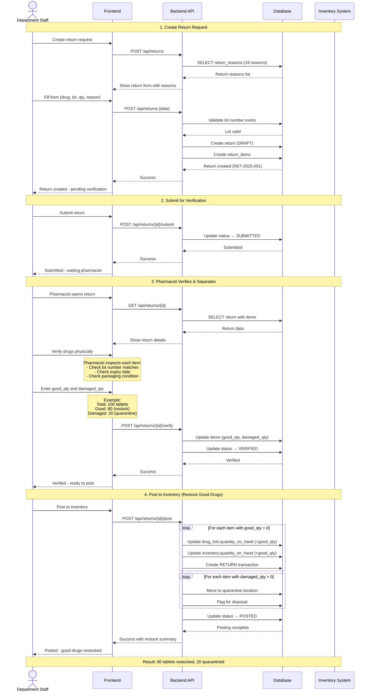

# 🔄 Drug Return System

**Department drug returns with good/damaged separation**

**Priority:** ⭐⭐ ปานกลาง
**Tables:** 3 tables (2 core + 1 return reasons) ⭐
**Status:** ✅ Production Ready
**Version:** 2.6.0
**Last Updated:** 2025-01-28
**Workflows:** 4 major processes
**Data:** 19 return reasons (Phase 1) ⭐

---

## 📋 Overview

Drug Return System จัดการการรับคืนยาจากแผนก:

### Main Features

1. **📝 Return Request** (drug_returns)
   - Departments return unused, excess, or expired drugs
   - Return reasons documented (19 standard reasons)
   - Status tracking: DRAFT → SUBMITTED → VERIFIED → POSTED
   - Complete audit trail

2. **🔍 Verification & Separation** (drug_return_items)
   - Pharmacist verifies returned drugs
   - Separate good vs. damaged quantities
   - Good quantity → restock to pharmacy
   - Damaged quantity → quarantine for disposal
   - Lot number and expiry tracking

3. **🏷️ Return Reasons** (return_reasons) ⭐ NEW (Phase 1)
   - 19 standardized return reasons
   - Categories: Clinical (ADR, Treatment change)
   - Categories: Operational (Excess, Dispensing error)
   - Categories: Quality (Expired, Damaged, Wrong drug)
   - Complete tracking for quality management

4. **📦 Inventory Integration**
   - Good drugs automatically restocked
   - RETURN transaction in inventory_transactions
   - Damaged drugs moved to quarantine location
   - Complete traceability from distribution to return

5. **🗑️ Disposal Management** (Optional)
   - Committee-based disposal process
   - Destruction method documentation
   - Photo evidence requirement
   - Witness signatures

---

## 🔗 System Dependencies

### Drug Return ให้ข้อมูลแก่:

```
Drug Return
    ├─→ Inventory (good quantity → RETURN transaction)
    ├─→ Dashboard (return reports, damaged analysis)
    └─→ Disposal (quarantined drugs)
```

### Drug Return ใช้ข้อมูลจาก:

```
Distribution → Drug Return
    └─ drug_distribution_items → original lot numbers

Inventory → Drug Return
    └─ drug_lots → validate lot numbers, update quantities

Master Data → Drug Return
    ├─ departments → returning department
    ├─ drugs → what is returned
    └─ locations → return to location (Pharmacy, Quarantine)
```

---

## 📊 Main Workflow: Return and Restock Drugs

**Workflow:** Department returns drugs → Pharmacist verifies and separates → Good drugs restocked



**Key Points:**

1. **Return Reasons** - 19 standardized reasons (Clinical, Operational, Quality)
2. **Good/Damaged Separation** - Pharmacist verifies and splits quantity
3. **Good Drugs Restocked** - Automatically added back to inventory
4. **Damaged Drugs Quarantined** - Moved to quarantine location for disposal
5. **Audit Trail** - RETURN transaction logged with reason and quantities

---

## 🎯 Key Features

### ✅ Good/Damaged Separation

**Pharmacist verification:**

- Inspect returned drugs physically
- Separate good condition vs. damaged/expired
- `total_quantity = good_quantity + damaged_quantity`
- Only good quantity restocked to pharmacy
- Damaged moved to quarantine

### ✅ Complete Status Workflow

**From draft to posted:**

- Department creates return (DRAFT)
- Department submits (SUBMITTED)
- Pharmacist verifies and separates (VERIFIED)
- System posts to inventory (POSTED)
- Cannot edit after POSTED

### ✅ Lot Traceability

**Complete tracking:**

- Lot number must match original distribution
- Expiry date validation
- Cannot return more than distributed
- Audit trail from distribution → return → restock

### ✅ Return Types

**Two types of returns:**

- **PURCHASED** - Drugs bought by hospital (can restock if good)
- **FREE** - Free samples or donations (usually dispose)

### ✅ Disposal Management

**Controlled disposal:**

- Committee of 3+ members required
- Photo evidence mandatory
- Destruction method documented (Incinerate, Chemical, Return to Vendor)
- Witness signatures

---

## 📂 Documentation Files

| File                             | Description                                                        |
| -------------------------------- | ------------------------------------------------------------------ |
| **README.md**                    | This file - Overview of Drug Return system                         |
| **[SCHEMA.md](SCHEMA.md)**       | Database schema: 2 tables + ER diagrams + status flow              |
| **[WORKFLOWS.md](WORKFLOWS.md)** | Business workflows: 4 major flows (Create, Verify, Post, Disposal) |
| **api/**                         | OpenAPI specs (will be auto-generated from AegisX)                 |

---

## 🎯 Quick Start

### 1. Create Return Request

```typescript
import { prisma } from './lib/prisma';

async function createDrugReturn(data: {
  department_id: bigint;
  return_reason: string;
  items: Array<{
    drug_id: bigint;
    total_quantity: number;
    lot_number: string;
    expiry_date: Date;
    return_type: 'PURCHASED' | 'FREE';
    location_id: bigint;
  }>;
}) {
  return await prisma.$transaction(async (tx) => {
    // Generate return number
    const returnNumber = 'RET-2025-04-001'; // Auto-increment logic

    // Create return
    const ret = await tx.drugReturn.create({
      data: {
        return_number: returnNumber,
        department_id: data.department_id,
        return_date: new Date(),
        return_reason: data.return_reason,
        status: 'DRAFT',
        total_items: data.items.length,
      },
    });

    // Add items
    await tx.drugReturnItem.createMany({
      data: data.items.map((item) => ({
        return_id: ret.id,
        drug_id: item.drug_id,
        total_quantity: item.total_quantity,
        good_quantity: 0, // Set during verification
        damaged_quantity: 0,
        lot_number: item.lot_number,
        expiry_date: item.expiry_date,
        return_type: item.return_type,
        location_id: item.location_id,
      })),
    });

    return ret;
  });
}

// Example usage:
const drugReturn = await createDrugReturn({
  department_id: 3n, // Nursing Department
  return_reason: 'Excess stock - patient discharged',
  items: [
    {
      drug_id: 1n,
      total_quantity: 500,
      lot_number: 'LOT-PCM-2025-A',
      expiry_date: new Date('2027-04-01'),
      return_type: 'PURCHASED',
      location_id: 2n,
    },
  ],
});
```

### 2. Submit Return

```typescript
// Department submits return for verification
const submitted = await prisma.drugReturn.update({
  where: { id: returnId },
  data: {
    status: 'SUBMITTED',
    updated_at: new Date(),
  },
});
```

### 3. Verify and Separate Good/Damaged

```typescript
async function verifyDrugReturn(
  returnId: bigint,
  verifiedBy: string,
  itemSeparation: Array<{
    item_id: bigint;
    good_quantity: number;
    damaged_quantity: number;
  }>,
) {
  return await prisma.$transaction(async (tx) => {
    const ret = await tx.drugReturn.findUnique({
      where: { id: returnId },
      include: { items: true },
    });

    if (ret.status !== 'SUBMITTED') {
      throw new Error('Return must be SUBMITTED to verify');
    }

    // Update each item with good/damaged quantities
    for (const sep of itemSeparation) {
      const item = ret.items.find((i) => i.id === sep.item_id);

      // Validate
      if (sep.good_quantity + sep.damaged_quantity !== item.total_quantity) {
        throw new Error('Good + Damaged must equal Total');
      }

      await tx.drugReturnItem.update({
        where: { id: sep.item_id },
        data: {
          good_quantity: sep.good_quantity,
          damaged_quantity: sep.damaged_quantity,
        },
      });
    }

    // Update return status
    return await tx.drugReturn.update({
      where: { id: returnId },
      data: {
        status: 'VERIFIED',
        verified_by: verifiedBy,
        updated_at: new Date(),
      },
    });
  });
}

// Example: 450 good, 50 damaged
const verified = await verifyDrugReturn(returnId, 'Pharmacist Sarah', [
  {
    item_id: itemId,
    good_quantity: 450, // Good condition
    damaged_quantity: 50, // Damaged packaging
  },
]);
```

### 4. Post to Inventory

```typescript
async function postDrugReturn(returnId: bigint, receivedBy: string, userId: bigint) {
  return await prisma.$transaction(async (tx) => {
    const ret = await tx.drugReturn.findUnique({
      where: { id: returnId },
      include: { items: true, department: true },
    });

    if (ret.status !== 'VERIFIED') {
      throw new Error('Return must be VERIFIED before posting');
    }

    // Process each item
    for (const item of ret.items) {
      // Add good quantity to inventory
      if (item.good_quantity > 0) {
        const inventory = await tx.inventory.findUnique({
          where: {
            drug_id_location_id: {
              drug_id: item.drug_id,
              location_id: item.location_id,
            },
          },
        });

        await tx.inventory.update({
          where: { id: inventory.id },
          data: {
            quantity_on_hand: { increment: item.good_quantity },
            last_updated: new Date(),
          },
        });

        // Update lot
        await tx.drugLot.updateMany({
          where: {
            drug_id: item.drug_id,
            location_id: item.location_id,
            lot_number: item.lot_number,
          },
          data: {
            quantity_available: { increment: item.good_quantity },
          },
        });

        // Create RETURN transaction
        await tx.inventoryTransaction.create({
          data: {
            inventory_id: inventory.id,
            transaction_type: 'RETURN',
            quantity: item.good_quantity,
            reference_id: ret.id,
            reference_type: 'drug_return',
            notes: `Return from ${ret.department.dept_name}`,
            created_by: userId,
          },
        });
      }

      // Move damaged to quarantine
      if (item.damaged_quantity > 0) {
        const quarantine = await tx.location.findFirst({
          where: { location_code: 'QUARANTINE' },
        });

        await tx.drugLot.create({
          data: {
            drug_id: item.drug_id,
            location_id: quarantine.id,
            lot_number: `${item.lot_number}-DMG`,
            expiry_date: item.expiry_date,
            quantity_available: item.damaged_quantity,
            unit_cost: 0,
            received_date: ret.return_date,
            is_active: false, // Inactive - for disposal
          },
        });
      }
    }

    // Update return status
    return await tx.drugReturn.update({
      where: { id: returnId },
      data: {
        status: 'POSTED',
        received_by: receivedBy,
        action_taken: 'Good restocked, damaged quarantined',
        updated_at: new Date(),
      },
    });
  });
}
```

### 5. Get Return History by Department

```typescript
// Get all returns from a department (last 90 days)
const history = await prisma.drugReturn.findMany({
  where: {
    department_id: 3n, // Nursing
    return_date: {
      gte: new Date(Date.now() - 90 * 24 * 60 * 60 * 1000),
    },
  },
  include: {
    items: {
      include: {
        drug: {
          include: {
            generic: true,
          },
        },
      },
    },
    department: true,
  },
  orderBy: {
    return_date: 'desc',
  },
});

console.log(`Found ${history.length} returns from Nursing Department`);
```

---

## 🔗 Related Documentation

### Global Documentation

- **[SYSTEM_ARCHITECTURE.md](../../SYSTEM_ARCHITECTURE.md)** - Overview of all 8 systems
- **[DATABASE_STRUCTURE.md](../../DATABASE_STRUCTURE.md)** - Complete database schema (44 tables)
- **[END_TO_END_WORKFLOWS.md](../../END_TO_END_WORKFLOWS.md)** - Cross-system workflows

### Per-System Documentation

- **[SCHEMA.md](SCHEMA.md)** - Detailed schema of this system's 2 tables + status flow
- **[WORKFLOWS.md](WORKFLOWS.md)** - 4 business workflows: Create, Verify, Post, Disposal

### Related Systems

- **[Distribution](../05-distribution/README.md)** - Original distribution tracking
- **[Inventory](../04-inventory/README.md)** - RETURN transaction and stock update
- **[Master Data](../01-master-data/README.md)** - Departments, drugs, locations

### Technical Reference

- **`prisma/schema.prisma`** - Source schema definition
- **AegisX Swagger UI** - http://127.0.0.1:3383/documentation (when running)

---

## 📈 Next Steps

1. ✅ **Read** [SCHEMA.md](SCHEMA.md) - Understand 2 tables + status flow
2. ✅ **Read** [WORKFLOWS.md](WORKFLOWS.md) - Understand 4 business workflows
3. ⏳ **Implement** AegisX APIs - Drug Return endpoints
4. ⏳ **Test** Good/Damaged Separation - Test verification logic
5. ⏳ **Test** Inventory Integration - Test RETURN transaction
6. ⏳ **Setup** Disposal Process - Configure quarantine and disposal workflow
7. ⏳ **Integrate** with Frontend - Build return request screens

---

**Built with ❤️ for INVS Modern Team**
**Last Updated:** 2025-01-28 | **Version:** 2.6.0
