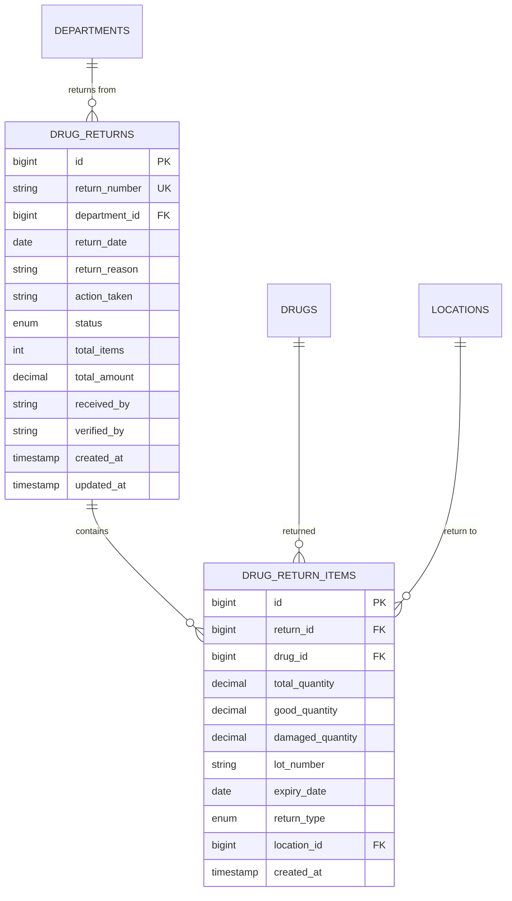
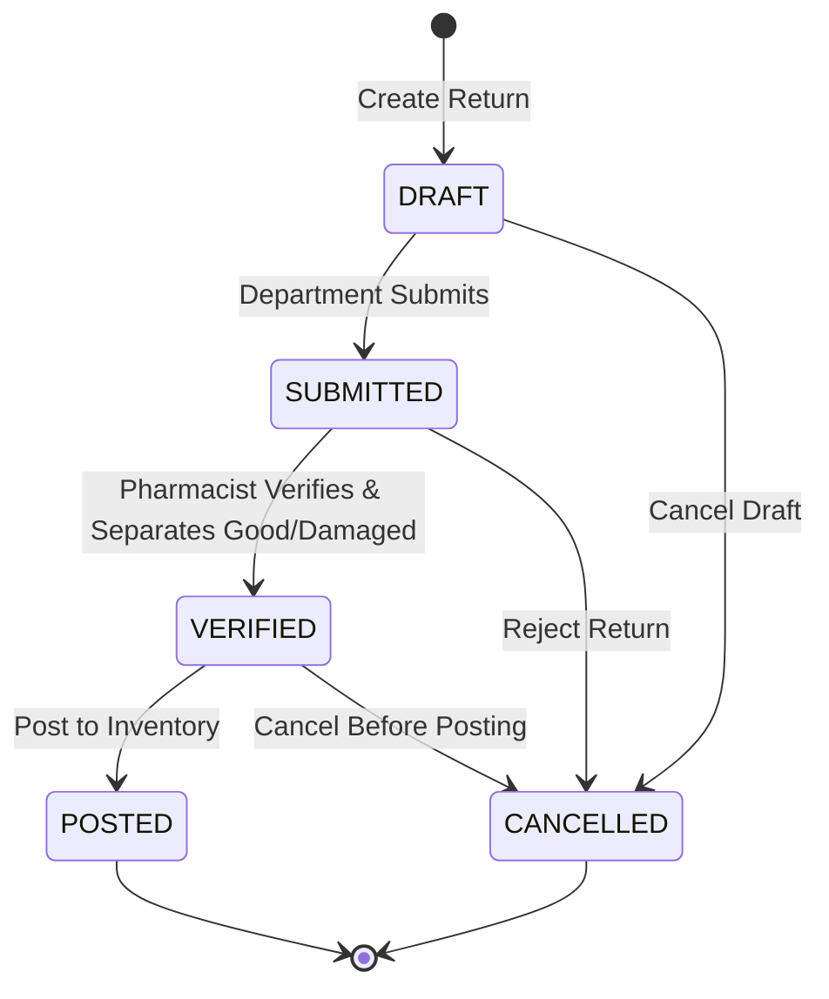

# 🔄 Drug Return - Database Schema

**System:** Drug Return Management
**Tables:** 3 tables (2 core + 1 return reasons) ⭐
**Version:** 2.6.0
**Last Updated:** 2025-01-28
**Data Migrated:** 19 return reasons (Phase 1) ⭐

---

## 📖 Table of Contents

### Core Tables

1. [Drug Returns](#1-drug_returns) - ใบรับคืนยา
2. [Drug Return Items](#2-drug_return_items) - รายการยาที่รับคืน
3. [Return Reasons](#3-return_reasons) ⭐ NEW (Phase 1) - เหตุผลการคืนยา

### Reference

- [ER Diagram](#-entity-relationship-diagram)
- [Table Overview](#-table-overview)
- [Status Flow](#-status-workflow)
- [Cross-System Integration](#-cross-system-integration)
- [Common Queries](#-common-queries)
- [Business Rules](#-business-rules)

---

## 📊 Table Overview

| Table               | Records      | Purpose                                                 |
| ------------------- | ------------ | ------------------------------------------------------- |
| `drug_returns`      | 500-2,000    | Drug returns from departments (good/damaged separation) |
| `drug_return_items` | 2,000-10,000 | Drug items returned with lot tracking and condition     |

---

## 🗺️ Entity Relationship Diagram



**Color Legend:**

- 🟢 Green: Drug Return tables
- 🔵 Blue: Master Data (departments, drugs, locations)
- 🟡 Yellow: Inventory (stock adjustment via RETURN transaction)

---

## 📋 Detailed Table Definitions

### 1. drug_returns

**Purpose:** Track drug returns from departments (unused, expired, damaged)

| Column          | Type          | Constraints                         | Description                                           |
| --------------- | ------------- | ----------------------------------- | ----------------------------------------------------- |
| `id`            | BIGINT        | PK, AUTO_INCREMENT                  | Primary key                                           |
| `return_number` | VARCHAR(50)   | UNIQUE, NOT NULL                    | Running number (e.g., RET-2025-04-001)                |
| `department_id` | BIGINT        | FK → departments(id), NOT NULL      | Returning department                                  |
| `return_date`   | DATE          | NOT NULL                            | Date of return                                        |
| `return_reason` | TEXT          |                                     | Reason for return (expired, wrong drug, excess, etc.) |
| `action_taken`  | TEXT          |                                     | Action taken (restock, dispose, return to vendor)     |
| `status`        | ENUM          | NOT NULL, DEFAULT 'DRAFT'           | draft, submitted, verified, posted, cancelled         |
| `total_items`   | INT           | DEFAULT 0                           | Total number of items                                 |
| `total_amount`  | DECIMAL(15,2) | DEFAULT 0                           | Total value of returned drugs                         |
| `received_by`   | VARCHAR(100)  |                                     | Name of pharmacist who received                       |
| `verified_by`   | VARCHAR(100)  |                                     | Name of supervisor who verified                       |
| `created_at`    | TIMESTAMP     | DEFAULT CURRENT_TIMESTAMP           |                                                       |
| `updated_at`    | TIMESTAMP     | DEFAULT CURRENT_TIMESTAMP ON UPDATE |                                                       |

**Unique Constraints:**

- `UNIQUE(return_number)` - Each return has unique number

**Indexes:**

```sql
CREATE INDEX idx_return_number ON drug_returns(return_number);
CREATE INDEX idx_return_date ON drug_returns(return_date);
CREATE INDEX idx_return_dept ON drug_returns(department_id);
CREATE INDEX idx_return_status ON drug_returns(status);
CREATE INDEX idx_return_created ON drug_returns(created_at DESC);
```

**Status Values:**

- `DRAFT` - Created, not yet submitted
- `SUBMITTED` - Submitted by department
- `VERIFIED` - Verified by pharmacist (good/damaged separated)
- `POSTED` - Posted to inventory
- `CANCELLED` - Cancelled before posting

**Business Rules:**

- `return_number` format: RET-{YYYY}-{MM}-{###}
- `total_items` auto-calculated from items count
- `total_amount` auto-calculated from items (good quantity only)
- Cannot edit after POSTED status

---

### 2. drug_return_items

**Purpose:** Track individual drug items returned with good/damaged separation

| Column             | Type          | Constraints                     | Description                            |
| ------------------ | ------------- | ------------------------------- | -------------------------------------- |
| `id`               | BIGINT        | PK, AUTO_INCREMENT              | Primary key                            |
| `return_id`        | BIGINT        | FK → drug_returns(id), NOT NULL | Parent return                          |
| `drug_id`          | BIGINT        | FK → drugs(id), NOT NULL        | Which drug                             |
| `total_quantity`   | DECIMAL(15,3) | NOT NULL                        | Total quantity returned                |
| `good_quantity`    | DECIMAL(15,3) | NOT NULL, DEFAULT 0             | Quantity in good condition (restock)   |
| `damaged_quantity` | DECIMAL(15,3) | NOT NULL, DEFAULT 0             | Quantity damaged/expired (dispose)     |
| `lot_number`       | VARCHAR(50)   | NOT NULL                        | Lot number of returned drug            |
| `expiry_date`      | DATE          | NOT NULL                        | Expiry date of lot                     |
| `return_type`      | ENUM          | NOT NULL                        | PURCHASED, FREE                        |
| `location_id`      | BIGINT        | FK → locations(id), NOT NULL    | Where to return (Pharmacy, Quarantine) |
| `created_at`       | TIMESTAMP     | DEFAULT CURRENT_TIMESTAMP       |                                        |

**Indexes:**

```sql
CREATE INDEX idx_return_items_return ON drug_return_items(return_id);
CREATE INDEX idx_return_items_drug ON drug_return_items(drug_id);
CREATE INDEX idx_return_items_lot ON drug_return_items(lot_number);
CREATE INDEX idx_return_items_type ON drug_return_items(return_type);
CREATE INDEX idx_return_items_location ON drug_return_items(location_id);
```

**Return Types:**

- `PURCHASED` - ยาที่ซื้อมา (can restock if good)
- `FREE` - ยาแจกฟรี (usually dispose)

**Business Rules:**

- `total_quantity = good_quantity + damaged_quantity`
- `good_quantity` → restock to inventory (RETURN transaction)
- `damaged_quantity` → move to quarantine/disposal
- Cannot edit after return is POSTED
- Lot number must match original distribution lot

---

## 🔄 Status Workflow



**State Transitions:**

| From      | To        | Trigger               | Actions                                                |
| --------- | --------- | --------------------- | ------------------------------------------------------ |
| -         | DRAFT     | Create return         | Create record with items                               |
| DRAFT     | SUBMITTED | Department submits    | Ready for verification                                 |
| DRAFT     | CANCELLED | Cancel draft          | No inventory changes                                   |
| SUBMITTED | VERIFIED  | Pharmacist verifies   | Separate good/damaged quantities                       |
| SUBMITTED | CANCELLED | Reject return         | No inventory changes                                   |
| VERIFIED  | POSTED    | Post to inventory     | Add good quantity to stock, Move damaged to quarantine |
| VERIFIED  | CANCELLED | Cancel before posting | No inventory changes                                   |

---

## 🔗 Cross-System Integration

### Drug Return receives data from:

```
Distribution → Drug Return
    └─ drug_distribution_items → original lot numbers

Master Data → Drug Return
    ├─ departments → returning department
    ├─ drugs → what is returned
    └─ locations → where to return (Pharmacy, Quarantine)

Inventory → Drug Return
    └─ drug_lots → validate lot numbers
```

### Drug Return provides data to:

```
Drug Return → Inventory
    ├─ good_quantity → increase stock (RETURN transaction)
    └─ damaged_quantity → move to quarantine

Drug Return → Dashboard
    ├─ Return reports by department
    └─ Damaged drug analysis
```

---

## 💡 Common Queries

### Create Drug Return

```typescript
// Department returns unused/expired drugs
const drugReturn = await prisma.$transaction(async (tx) => {
  // 1. Generate return number
  const returnNumber = 'RET-2025-04-001'; // Auto-increment logic

  // 2. Create return header
  const ret = await tx.drugReturn.create({
    data: {
      return_number: returnNumber,
      department_id: 3n, // Nursing Department
      return_date: new Date(),
      return_reason: 'Excess stock from last month',
      status: 'DRAFT',
      total_items: 2,
    },
  });

  // 3. Add return items
  await tx.drugReturnItem.createMany({
    data: [
      {
        return_id: ret.id,
        drug_id: 1n,
        total_quantity: 500,
        good_quantity: 0, // Will be set during verification
        damaged_quantity: 0,
        lot_number: 'LOT-PCM-2025-A',
        expiry_date: new Date('2027-04-01'),
        return_type: 'PURCHASED',
        location_id: 2n, // Central Pharmacy
      },
      {
        return_id: ret.id,
        drug_id: 2n,
        total_quantity: 200,
        good_quantity: 0,
        damaged_quantity: 0,
        lot_number: 'LOT-IBU-2025-B',
        expiry_date: new Date('2026-12-31'),
        return_type: 'PURCHASED',
        location_id: 2n,
      },
    ],
  });

  return ret;
});
```

### Submit Return

```typescript
// Department submits return for verification
const submitted = await prisma.drugReturn.update({
  where: { id: returnId },
  data: {
    status: 'SUBMITTED',
    updated_at: new Date(),
  },
});
```

### Verify and Separate Good/Damaged

```typescript
// Pharmacist verifies return and separates good/damaged
async function verifyDrugReturn(
  returnId: bigint,
  verifiedBy: string,
  itemSeparation: Array<{
    item_id: bigint;
    good_quantity: number;
    damaged_quantity: number;
  }>,
) {
  return await prisma.$transaction(async (tx) => {
    // 1. Get return
    const ret = await tx.drugReturn.findUnique({
      where: { id: returnId },
      include: { items: true },
    });

    if (ret.status !== 'SUBMITTED') {
      throw new Error('Return must be SUBMITTED to verify');
    }

    // 2. Update each item with good/damaged quantities
    for (const sep of itemSeparation) {
      const item = ret.items.find((i) => i.id === sep.item_id);

      if (!item) {
        throw new Error(`Item ${sep.item_id} not found`);
      }

      if (sep.good_quantity + sep.damaged_quantity !== item.total_quantity) {
        throw new Error(`Good + Damaged must equal Total for item ${sep.item_id}`);
      }

      await tx.drugReturnItem.update({
        where: { id: sep.item_id },
        data: {
          good_quantity: sep.good_quantity,
          damaged_quantity: sep.damaged_quantity,
        },
      });
    }

    // 3. Calculate total amount (good quantity only)
    const totalAmount = await tx.drugReturnItem.aggregate({
      where: { return_id: returnId },
      _sum: {
        good_quantity: true,
      },
    });

    // Get average cost for valuation
    const itemsWithCost = await tx.drugReturnItem.findMany({
      where: { return_id: returnId },
      include: {
        drug: true,
      },
    });

    const total = itemsWithCost.reduce((sum, item) => {
      // Use inventory average cost
      return sum + item.good_quantity * (item.drug.average_cost || 0);
    }, 0);

    // 4. Update return status
    const verified = await tx.drugReturn.update({
      where: { id: returnId },
      data: {
        status: 'VERIFIED',
        verified_by: verifiedBy,
        total_amount: total,
        updated_at: new Date(),
      },
    });

    return verified;
  });
}
```

### Post Return to Inventory

```typescript
async function postDrugReturn(returnId: bigint, receivedBy: string, userId: bigint) {
  return await prisma.$transaction(async (tx) => {
    // 1. Get return with items
    const ret = await tx.drugReturn.findUnique({
      where: { id: returnId },
      include: {
        items: true,
        department: true,
      },
    });

    if (ret.status !== 'VERIFIED') {
      throw new Error('Return must be VERIFIED before posting');
    }

    // 2. Process each item
    for (const item of ret.items) {
      // 2.1 Add good quantity back to inventory
      if (item.good_quantity > 0) {
        // Update inventory
        const inventory = await tx.inventory.findUnique({
          where: {
            drug_id_location_id: {
              drug_id: item.drug_id,
              location_id: item.location_id,
            },
          },
        });

        if (!inventory) {
          // Create inventory if doesn't exist
          await tx.inventory.create({
            data: {
              drug_id: item.drug_id,
              location_id: item.location_id,
              quantity_on_hand: item.good_quantity,
              average_cost: 0,
              last_cost: 0,
            },
          });
        } else {
          await tx.inventory.update({
            where: { id: inventory.id },
            data: {
              quantity_on_hand: { increment: item.good_quantity },
              last_updated: new Date(),
            },
          });
        }

        // Create lot (if doesn't exist)
        const existingLot = await tx.drugLot.findFirst({
          where: {
            drug_id: item.drug_id,
            location_id: item.location_id,
            lot_number: item.lot_number,
          },
        });

        if (existingLot) {
          await tx.drugLot.update({
            where: { id: existingLot.id },
            data: {
              quantity_available: { increment: item.good_quantity },
              is_active: true,
            },
          });
        } else {
          await tx.drugLot.create({
            data: {
              drug_id: item.drug_id,
              location_id: item.location_id,
              lot_number: item.lot_number,
              expiry_date: item.expiry_date,
              quantity_available: item.good_quantity,
              unit_cost: 0, // Use inventory average cost
              received_date: ret.return_date,
              is_active: true,
            },
          });
        }

        // Create RETURN transaction
        const inv = await tx.inventory.findUnique({
          where: {
            drug_id_location_id: {
              drug_id: item.drug_id,
              location_id: item.location_id,
            },
          },
        });

        await tx.inventoryTransaction.create({
          data: {
            inventory_id: inv!.id,
            transaction_type: 'RETURN',
            quantity: item.good_quantity,
            reference_id: ret.id,
            reference_type: 'drug_return',
            notes: `Return from ${ret.department.dept_name}, Lot: ${item.lot_number}, Good: ${item.good_quantity}`,
            created_by: userId,
          },
        });
      }

      // 2.2 Move damaged quantity to quarantine
      if (item.damaged_quantity > 0) {
        const quarantine = await tx.location.findFirst({
          where: { location_code: 'QUARANTINE' },
        });

        if (quarantine) {
          // Create quarantine lot
          await tx.drugLot.create({
            data: {
              drug_id: item.drug_id,
              location_id: quarantine.id,
              lot_number: item.lot_number + '-DMG',
              expiry_date: item.expiry_date,
              quantity_available: item.damaged_quantity,
              unit_cost: 0,
              received_date: ret.return_date,
              is_active: false, // Inactive - for disposal
              notes: `Damaged return from ${ret.department.dept_name}`,
            },
          });
        }
      }
    }

    // 3. Update return status
    const posted = await tx.drugReturn.update({
      where: { id: returnId },
      data: {
        status: 'POSTED',
        received_by: receivedBy,
        updated_at: new Date(),
      },
    });

    return posted;
  });
}
```

### Get Return History by Department

```typescript
// Get all returns from a department
const history = await prisma.drugReturn.findMany({
  where: {
    department_id: 3n, // Nursing
    return_date: {
      gte: new Date(Date.now() - 90 * 24 * 60 * 60 * 1000), // Last 90 days
    },
  },
  include: {
    items: {
      include: {
        drug: {
          include: {
            generic: true,
          },
        },
      },
    },
    department: true,
  },
  orderBy: {
    return_date: 'desc',
  },
});
```

---

## 📏 Business Rules

### Return Rules

1. **Good/Damaged Separation**
   - Pharmacist must verify and separate during VERIFIED status
   - `total_quantity = good_quantity + damaged_quantity`
   - Only `good_quantity` restocked to inventory
   - `damaged_quantity` moved to quarantine

2. **Lot Validation**
   - Lot number must exist in original distribution
   - Cannot return more than distributed
   - Expiry date must match original lot

3. **Return Types**
   - `PURCHASED` - Can restock if good condition
   - `FREE` - Usually dispose (policy dependent)

4. **Status Flow**
   - DRAFT → SUBMITTED → VERIFIED → POSTED
   - Can cancel before POSTED
   - Cannot edit after POSTED

5. **Inventory Integration**
   - Stock added only when status = POSTED
   - Creates RETURN transaction in inventory_transactions
   - Updates both inventory and drug_lots tables
   - Damaged items moved to quarantine location

### Action Taken Options

Common actions after return:

- **Restock** - Good condition drugs returned to pharmacy
- **Dispose** - Expired/damaged drugs destroyed
- **Return to Vendor** - Wrong drug or quality issue
- **Quarantine** - Pending investigation

---

## 🎯 Validation Rules Summary

| Rule                     | Description                       | Enforcement                |
| ------------------------ | --------------------------------- | -------------------------- |
| **Unique Return Number** | No duplicate return numbers       | Database unique constraint |
| **Quantity Balance**     | total_quantity = good + damaged   | Application validation     |
| **Lot Validation**       | Lot must exist in distribution    | Application validation     |
| **Status Flow**          | Must follow defined status flow   | Application logic          |
| **Good vs Damaged**      | Must separate during verification | Application logic + UI     |
| **Positive Quantities**  | All quantities >= 0               | Check constraint           |
| **Immutable Posted**     | Cannot edit after POSTED          | Application logic          |

---

## 🔍 Related Documentation

### System Documentation

- **[README.md](README.md)** - Drug Return system overview
- **[WORKFLOWS.md](WORKFLOWS.md)** - Drug Return workflows

### Global Documentation

- **[SYSTEM_ARCHITECTURE.md](../../SYSTEM_ARCHITECTURE.md)** - All 8 systems
- **[DATABASE_STRUCTURE.md](../../DATABASE_STRUCTURE.md)** - Complete database schema
- **[END_TO_END_WORKFLOWS.md](../../END_TO_END_WORKFLOWS.md)** - Cross-system flows

### Related Systems

- **[Distribution](../05-distribution/SCHEMA.md)** - Original distribution tracking
- **[Inventory](../04-inventory/SCHEMA.md)** - Stock management and RETURN transactions
- **[Master Data](../01-master-data/SCHEMA.md)** - Departments, drugs, locations

### Technical Reference

- **`prisma/schema.prisma`** - Source schema definition
- **AegisX Swagger UI** - http://127.0.0.1:3383/documentation

---

**Built with ❤️ for INVS Modern Team**
**Last Updated:** 2025-01-28 | **Version:** 2.6.0
