# 🔗 TMT Integration System

**Thai Medical Terminology (TMT) for Ministry Compliance**

**Priority:** ⭐⭐⭐ สูง (Ministry Requirement)
**Tables:** 3 tables (core TMT system)
**TMT Concepts:** 76,904 loaded (Phase 7) 🔓 ⭐
**Drug Mappings:** 561 drugs (47.99% coverage) (Phase 8) 🔓 ⭐
**Status:** ✅ Production Ready
**Workflows:** 3 major processes
**Version:** 2.6.0
**Last Updated:** 2025-01-28

---

## 📋 Overview

TMT Integration System จัดการการเชื่อมต่อกับมาตรฐาน Thai Medical Terminology:

### 2 โมดูลหลัก ⭐ (Phase 7-8)

1. **📚 TMT Concepts** (1 table) - Phase 7 🔓
   - `tmt_concepts` - **76,904 TMT concepts** (5 levels)
   - Complete hierarchy: VTM → GP → GPU → TP → TPU
   - FSN (Fully Specified Name) + Preferred Term
   - Strength and dosage form information
   - Active/inactive status tracking

2. **🔗 Drug-to-TMT Mapping** (2 tables) - Phase 8 🔓
   - `drugs.tmt_tpu_id` - Direct FK to TPU level
   - **561 drugs mapped** (47.99% coverage)
   - **608 drugs unmapped** (hospital-prepared or no TMTID)
   - One-to-one mapping at TPU level
   - Ministry reporting ready

---

## 🎯 Key Features

### ✅ 76,904 TMT Concepts Loaded (Phase 7) ⭐

**5-Level Hierarchy:**

```
VTM (สารออกฤทธิ์) → GP (ยาสามัญ+รูปแบบ) → GPU (ยาสามัญ+หน่วย)
                  → TP (ยาการค้า) → TPU (ยาการค้า+หน่วย)
```

**Distribution by Level:**

- VTM: 2,691 concepts (สารออกฤทธิ์)
- GP: 7,991 concepts (ยาสามัญ + รูปแบบ)
- GPU: 9,835 concepts (ยาสามัญ + หน่วย)
- TP: 27,360 concepts (ยาการค้า)
- TPU: 29,027 concepts (ยาการค้า + หน่วย)

### ✅ Drug-to-TMT Mapping

**Pharmacist-verified mapping:**

- Search TMT by drug name/strength
- AI-suggested matches with confidence score
- One-to-one mapping per drug
- Preferred at GP (Generic Product) level

### ✅ Ministry Compliance

**100% DMSIC Standards:**

- TMT code in DRUGLIST export (field 10)
- Compliance rate tracking
- Unmapped drugs alerts
- Quarterly ministry reports

### ✅ HIS Integration

**Hospital Information System:**

- HIS drug master mapping
- NC24 code support (legacy)
- Mapping status tracking
- Usage statistics

---

## 🔗 System Dependencies

### TMT Integration ให้ข้อมูลแก่:

```
TMT Integration
    ├─→ Ministry Reporting (TMT code in DRUGLIST)
    ├─→ Dashboard (compliance rate, unmapped alerts)
    └─→ Drug Master (TMT code reference)
```

### TMT Integration ใช้ข้อมูลจาก:

```
Master Data → TMT Integration
    ├─ drug_generics → map to TMT
    └─ drugs → map to TMT

Distribution → TMT Integration
    └─ usage → tmt_usage_stats

Ministry → TMT Integration
    └─ TMT data updates (CSV download)
```

---

## 🔄 Main Workflow: Map Drug to TMT Concept

**ภาพรวม workflow หลักของระบบ - การ map ยาไปยัง TMT concept**

```mermaid
sequenceDiagram
    actor User as Pharmacist
    participant UI as Frontend
    participant API as TMT API
    participant DB as Database

    %% Search for unmapped drugs
    User->>UI: Open "TMT Mapping" page
    UI->>API: GET /api/drugs?tmt_mapped=false
    API->>DB: SELECT * FROM drugs<br/>LEFT JOIN tmt_mappings<br/>WHERE tmt_code IS NULL
    DB-->>API: Unmapped drugs (e.g., 150 drugs)
    API-->>UI: Unmapped drugs list
    UI-->>User: Show list with mapping status

    %% Search TMT for a drug
    User->>UI: Click "Map" on Paracetamol 500mg
    UI->>UI: Show TMT search dialog
    User->>UI: Search TMT: "Paracetamol 500"

    UI->>API: GET /api/tmt/search?q=Paracetamol+500
    API->>DB: SELECT * FROM tmt_concepts<br/>WHERE term_thai ILIKE '%Paracetamol%'<br/>AND level = 'GP'
    DB-->>API: TMT matches (25,991 concepts searched)
    API-->>UI: Suggested matches with confidence

    %% Map drug to TMT
    User->>UI: Select TMT: "10028536 - PARACETAMOL 500 MG"
    UI->>API: POST /api/tmt/map
    Note over API: {<br/>  drug_id: 123,<br/>  tmt_code: "10028536",<br/>  mapped_by: "user123"<br/>}

    API->>DB: INSERT INTO tmt_mappings<br/>(drug_id, tmt_code, confidence: 100)
    DB-->>API: Mapping created
    API->>DB: UPDATE drugs SET tmt_code = '10028536'
    DB-->>API: Drug updated
    API-->>UI: ✅ Mapping saved
    UI-->>User: ✅ Mapped (149 remaining)

    Note over User,DB: Target: >= 95% drugs mapped<br/>for Ministry compliance
```



**สำหรับ workflow ละเอียดเพิ่มเติม**: ดู [WORKFLOWS.md](WORKFLOWS.md)

---

## 📂 Documentation Files

| File                             | Description                                                      |
| -------------------------------- | ---------------------------------------------------------------- |
| **README.md**                    | This file - Overview of TMT Integration                          |
| **[SCHEMA.md](SCHEMA.md)**       | Database schema: 10 tables + TMT hierarchy + 25,991 concepts     |
| **[WORKFLOWS.md](WORKFLOWS.md)** | Business workflows: 3 major flows (Loading, Mapping, Compliance) |
| **api/**                         | OpenAPI specs (will be auto-generated from AegisX)               |

---

## 🎯 Quick Start

### 1. Load TMT Concepts (Initial Setup)

```typescript
// Load 25,991 TMT concepts from ministry CSV
const count = await loadTMTConcepts('./data/tmt_concepts.csv');
console.log(`Loaded ${count} TMT concepts`);
// Output: Loaded 25991 TMT concepts
```

### 2. Search TMT Concepts

```typescript
// Search for Paracetamol at GP level
const matches = await prisma.tmtConcept.findMany({
  where: {
    preferred_term: { contains: 'Paracetamol', mode: 'insensitive' },
    level: 'GP',
    is_active: true,
  },
  take: 10,
});

console.log(`Found ${matches.length} matches`);
```

### 3. Map Drug to TMT

```typescript
// Map Paracetamol 500mg to TMT
const mapping = await prisma.tmtMapping.create({
  data: {
    generic_id: 1n,
    tmt_concept_id: 12345n, // TMT concept ID
    tmt_level: 'GP',
    is_verified: true,
    verified_by: userId,
  },
});
```

### 4. Check Compliance Rate

```typescript
const total = await prisma.drug.count({ where: { is_active: true } });
const mapped = await prisma.drug.count({
  where: {
    is_active: true,
    tmtMappings: { some: { is_verified: true } },
  },
});

const rate = (mapped / total) * 100;
console.log(`TMT Compliance: ${rate.toFixed(2)}%`);
// Target: >= 95%
```

### 5. Get Unmapped Drugs

```typescript
const unmapped = await prisma.drug.findMany({
  where: {
    is_active: true,
    tmtMappings: { none: {} },
  },
  include: {
    generic: true,
  },
  take: 20,
});

console.log(`Found ${unmapped.length} unmapped drugs - action required!`);
```

---

## 🔗 Related Documentation

### Global Documentation

- **[SYSTEM_ARCHITECTURE.md](../../SYSTEM_ARCHITECTURE.md)** - Overview of all 8 systems
- **[DATABASE_STRUCTURE.md](../../DATABASE_STRUCTURE.md)** - Complete database schema (44 tables)
- **[END_TO_END_WORKFLOWS.md](../../END_TO_END_WORKFLOWS.md)** - Cross-system workflows

### Per-System Documentation

- **[SCHEMA.md](SCHEMA.md)** - Detailed schema of this system's 10 tables + 25,991 concepts
- **[WORKFLOWS.md](WORKFLOWS.md)** - 3 business workflows: TMT Loading, Mapping, Compliance

### Related Systems

- **[Master Data](../01-master-data/README.md)** - Drug generics and drugs
- **[Distribution](../05-distribution/README.md)** - Usage tracking

### Technical Reference

- **`prisma/schema.prisma`** - Source schema definition
- **`scripts/tmt/`** - TMT import scripts
- **AegisX Swagger UI** - http://127.0.0.1:3383/documentation (when running)

---

## 📈 Next Steps

1. ✅ **Read** [SCHEMA.md](SCHEMA.md) - Understand TMT concepts + hierarchy
2. ✅ **Read** [WORKFLOWS.md](WORKFLOWS.md) - Understand 3 business workflows
3. ✅ **Load** TMT Data - 76,904 concepts loaded (Phase 7) ⭐
4. ✅ **Map** Drugs - 561 drugs mapped to TMT TPU (Phase 8) ⭐
5. ⏳ **Improve** Coverage - Map remaining 608 drugs (52.01%)
6. ⏳ **Integrate** HIS - Map HIS drug master
7. ⏳ **Report** Ministry - Generate quarterly DRUGLIST reports

---

**Built with ❤️ for INVS Modern Team**
**Last Updated:** 2025-01-28 | **Version:** 2.6.0
