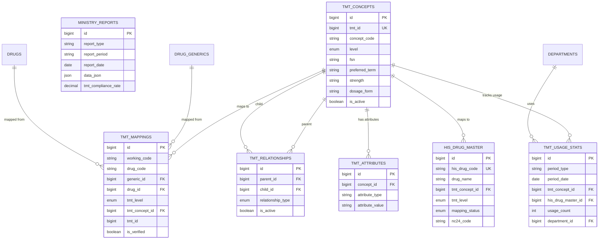

# 🔗 TMT Integration - Database Schema

**System:** Thai Medical Terminology (TMT) Integration
**Tables:** 1 core table + 1 FK relationship
**TMT Concepts:** 76,904 concepts loaded (Phase 7) 🔓 ⭐
**Drug Mappings:** 561 drugs (47.99%) (Phase 8) 🔓 ⭐
**Version:** 2.6.0
**Last Updated:** 2025-01-28

---

## 📖 Table of Contents

### Core Tables (Phase 7-8) ⭐

1. [TMT Concepts](#1-tmt_concepts) - 76,904 TMT concepts (5 levels)
2. [Drug-TMT Mapping](#2-drug-tmt-mapping) - drugs.tmt_tpu_id FK (561 mapped)

### Reference

- [ER Diagram](#-entity-relationship-diagram)
- [TMT Hierarchy](#-tmt-hierarchy)
- [Cross-System Integration](#-cross-system-integration)
- [Common Queries](#-common-queries)
- [Ministry Compliance](#-ministry-compliance)

---

## 📊 Table Overview (Phase 7-8) ⭐

| Table              | Records           | Purpose                                      |
| ------------------ | ----------------- | -------------------------------------------- |
| `tmt_concepts`     | **76,904** 🔓     | Thai Medical Terminology concepts (5 levels) |
| `drugs.tmt_tpu_id` | **561 mapped** 🔓 | FK to TMT TPU level (47.99% coverage)        |

**Level Distribution:**

- VTM: 2,691 concepts (สารออกฤทธิ์)
- GP: 7,991 concepts (ยาสามัญ + รูปแบบ)
- GPU: 9,835 concepts (ยาสามัญ + หน่วย)
- TP: 27,360 concepts (ยาการค้า)
- TPU: 29,027 concepts (ยาการค้า + หน่วย)

---

## 🗺️ Entity Relationship Diagram



---

## 📋 Detailed Table Definitions

### 1. tmt_concepts

**Purpose:** Store 25,991 Thai Medical Terminology concepts (10 hierarchy levels)

| Column           | Type         | Description                                       |
| ---------------- | ------------ | ------------------------------------------------- |
| `id`             | BIGINT PK    | Primary key                                       |
| `tmt_id`         | BIGINT UK    | Official TMT ID from ministry                     |
| `concept_code`   | VARCHAR(50)  | Concept code                                      |
| `level`          | ENUM         | SUBS, VTM, GP, TP, GPU, TPU, GPP, TPP, GP_F, GP_X |
| `fsn`            | TEXT         | Fully Specified Name (English)                    |
| `preferred_term` | TEXT         | Preferred term (Thai)                             |
| `strength`       | VARCHAR(100) | Drug strength                                     |
| `dosage_form`    | VARCHAR(100) | Dosage form                                       |
| `is_active`      | BOOLEAN      | Active status                                     |

**TMT Levels (10 levels):**

- `SUBS` - Substance (วัตถุออกฤทธิ์)
- `VTM` - Virtual Therapeutic Moiety
- `GP` - Generic Product
- `TP` - Trade Product
- `GPU` - Generic Product with Unit
- `TPU` - Trade Product with Unit
- `GPP` - Generic Product Pack
- `TPP` - Trade Product Pack
- `GP_F` - Generic Product Form
- `GP_X` - Generic Product Extended

---

### 2. tmt_relationships

**Purpose:** Parent-child hierarchy relationships between TMT concepts

| Column              | Type      | Description                    |
| ------------------- | --------- | ------------------------------ |
| `id`                | BIGINT PK | Primary key                    |
| `parent_id`         | BIGINT FK | Parent concept                 |
| `child_id`          | BIGINT FK | Child concept                  |
| `relationship_type` | ENUM      | IS_A, HAS_INGREDIENT, HAS_FORM |
| `is_active`         | BOOLEAN   | Active status                  |

---

### 3. tmt_mappings

**Purpose:** Map hospital drugs to TMT concepts for ministry compliance

| Column           | Type        | Description            |
| ---------------- | ----------- | ---------------------- |
| `id`             | BIGINT PK   | Primary key            |
| `working_code`   | VARCHAR(50) | Hospital working code  |
| `drug_code`      | VARCHAR(50) | Hospital drug code     |
| `generic_id`     | BIGINT FK   | Generic drug ID        |
| `drug_id`        | BIGINT FK   | Trade drug ID          |
| `tmt_level`      | ENUM        | Which TMT level mapped |
| `tmt_concept_id` | BIGINT FK   | TMT concept            |
| `tmt_id`         | BIGINT      | TMT ID                 |
| `is_verified`    | BOOLEAN     | Verified by pharmacist |

---

### 4. tmt_attributes

**Purpose:** Additional attributes for TMT concepts

| Column            | Type         | Description                     |
| ----------------- | ------------ | ------------------------------- |
| `id`              | BIGINT PK    | Primary key                     |
| `concept_id`      | BIGINT FK    | TMT concept                     |
| `attribute_type`  | VARCHAR(100) | Attribute type (ATC, INN, etc.) |
| `attribute_value` | TEXT         | Attribute value                 |

---

### 5. tmt_manufacturers

**Purpose:** TMT-standard manufacturer codes

| Column              | Type           | Description           |
| ------------------- | -------------- | --------------------- |
| `id`                | BIGINT PK      | Primary key           |
| `manufacturer_code` | VARCHAR(50) UK | TMT manufacturer code |
| `manufacturer_name` | VARCHAR(255)   | Manufacturer name     |
| `is_active`         | BOOLEAN        | Active status         |

---

### 6. tmt_dosage_forms

**Purpose:** TMT-standard dosage form codes (87 forms)

| Column      | Type           | Description      |
| ----------- | -------------- | ---------------- |
| `id`        | BIGINT PK      | Primary key      |
| `form_code` | VARCHAR(50) UK | TMT form code    |
| `form_name` | VARCHAR(255)   | Form name (Thai) |
| `is_active` | BOOLEAN        | Active status    |

**Examples:** TABLET, CAPSULE, INJECTION, SOLUTION, SUSPENSION, etc.

---

### 7. tmt_units

**Purpose:** TMT-standard unit codes with conversion factors

| Column              | Type           | Description             |
| ------------------- | -------------- | ----------------------- |
| `id`                | BIGINT PK      | Primary key             |
| `unit_code`         | VARCHAR(50) UK | TMT unit code           |
| `unit_name`         | VARCHAR(100)   | Unit name               |
| `conversion_factor` | DECIMAL(15,6)  | Conversion to base unit |

**Examples:** MG, G, ML, L, TABLET, VIAL, etc.

---

### 8. his_drug_master

**Purpose:** HIS (Hospital Information System) drug master data integration

| Column           | Type           | Description                         |
| ---------------- | -------------- | ----------------------------------- |
| `id`             | BIGINT PK      | Primary key                         |
| `his_drug_code`  | VARCHAR(50) UK | HIS drug code                       |
| `drug_name`      | VARCHAR(255)   | Drug name in HIS                    |
| `tmt_concept_id` | BIGINT FK      | Mapped TMT concept                  |
| `tmt_level`      | ENUM           | TMT level                           |
| `mapping_status` | ENUM           | MAPPED, UNMAPPED, PENDING, VERIFIED |
| `nc24_code`      | VARCHAR(50)    | NC24 code (old standard)            |

---

### 9. tmt_usage_stats

**Purpose:** Track TMT usage for compliance reporting

| Column               | Type        | Description                    |
| -------------------- | ----------- | ------------------------------ |
| `id`                 | BIGINT PK   | Primary key                    |
| `period_type`        | VARCHAR(20) | daily, weekly, monthly, yearly |
| `period_date`        | DATE        | Period start date              |
| `tmt_concept_id`     | BIGINT FK   | TMT concept                    |
| `his_drug_master_id` | BIGINT FK   | HIS drug                       |
| `usage_count`        | INT         | Usage count                    |
| `department_id`      | BIGINT FK   | Department                     |

---

### 10. ministry_reports

**Purpose:** Store generated ministry compliance reports

| Column                | Type         | Description                 |
| --------------------- | ------------ | --------------------------- |
| `id`                  | BIGINT PK    | Primary key                 |
| `report_type`         | VARCHAR(50)  | DRUGLIST, USAGE, COMPLIANCE |
| `report_period`       | VARCHAR(50)  | 2025-Q1, 2025-M01, etc.     |
| `report_date`         | DATE         | Report generation date      |
| `data_json`           | JSON         | Report data (79 fields)     |
| `tmt_compliance_rate` | DECIMAL(5,2) | % drugs with TMT mapping    |

---

## 🌳 TMT Hierarchy

**10-Level Hierarchy:**

```
SUBS (Substance)
  ↓
VTM (Virtual Therapeutic Moiety)
  ↓
GP (Generic Product)
  ↓
TP (Trade Product)
  ↓
GPU (Generic Product with Unit)
  ↓
TPU (Trade Product with Unit)
  ↓
GPP (Generic Product Pack)
  ↓
TPP (Trade Product Pack)
  ↓
GP-F (Generic Product Form)
  ↓
GP-X (Generic Product Extended)
```

**Example Hierarchy:**

```
SUBS: Paracetamol
  └─ VTM: Paracetamol
      └─ GP: Paracetamol 500mg
          ├─ TP: Tylenol 500mg
          └─ TP: Sara 500mg
              └─ TPU: Sara 500mg Tablet
                  └─ TPP: Sara 500mg Tablet x 10
```

---

## 🔗 Cross-System Integration

### TMT Integration receives data from:

```
Master Data → TMT Integration
    ├─ drug_generics → map to TMT
    └─ drugs → map to TMT

Distribution → TMT Integration
    └─ drug_distributions → track usage

Ministry Reporting → TMT Integration
    └─ export requirements
```

### TMT Integration provides data to:

```
TMT Integration → Ministry Reporting
    ├─ tmt_mappings → DRUGLIST export
    ├─ tmt_usage_stats → USAGE reports
    └─ ministry_reports → compliance rate

TMT Integration → Dashboard
    └─ compliance_rate → unmapped drugs alert
```

---

## 💡 Common Queries

### Load TMT Concepts

```typescript
// Import 25,991 TMT concepts from CSV
async function loadTMTConcepts(csvFile: string) {
  const concepts = await parseCsvFile(csvFile);

  await prisma.tmtConcept.createMany({
    data: concepts.map((row) => ({
      tmt_id: parseInt(row.tmt_id),
      concept_code: row.concept_code,
      level: row.level as TMTLevel,
      fsn: row.fsn,
      preferred_term: row.preferred_term_th,
      strength: row.strength,
      dosage_form: row.dosage_form,
      is_active: true,
    })),
    skipDuplicates: true,
  });

  console.log(`Loaded ${concepts.length} TMT concepts`);
}
```

### Map Drug to TMT

```typescript
// Map hospital drug to TMT concept
async function mapDrugToTMT(data: { generic_id?: bigint; drug_id?: bigint; tmt_concept_id: bigint; verified_by: bigint }) {
  // Get drug info
  const drug = data.drug_id ? await prisma.drug.findUnique({ where: { id: data.drug_id } }) : await prisma.drugGeneric.findUnique({ where: { id: data.generic_id } });

  // Get TMT concept
  const tmtConcept = await prisma.tmtConcept.findUnique({
    where: { id: data.tmt_concept_id },
  });

  // Create mapping
  const mapping = await prisma.tmtMapping.create({
    data: {
      working_code: drug.working_code || '',
      drug_code: drug.drug_code || '',
      generic_id: data.generic_id,
      drug_id: data.drug_id,
      tmt_level: tmtConcept.level,
      tmt_concept_id: data.tmt_concept_id,
      tmt_id: tmtConcept.tmt_id,
      is_verified: true,
      verified_by: data.verified_by,
    },
  });

  return mapping;
}
```

### Check TMT Compliance Rate

```typescript
// Calculate TMT compliance rate
async function calculateTMTCompliance() {
  const totalDrugs = await prisma.drug.count({
    where: { is_active: true },
  });

  const mappedDrugs = await prisma.tmtMapping.count({
    where: {
      is_verified: true,
      drug: { is_active: true },
    },
  });

  const complianceRate = (mappedDrugs / totalDrugs) * 100;

  console.log({
    total_drugs: totalDrugs,
    mapped_drugs: mappedDrugs,
    compliance_rate: complianceRate.toFixed(2) + '%',
  });

  return complianceRate;
}
```

### Get Unmapped Drugs

```typescript
// Get drugs without TMT mapping
const unmappedDrugs = await prisma.drug.findMany({
  where: {
    is_active: true,
    tmtMappings: {
      none: {},
    },
  },
  include: {
    generic: true,
    company: true,
  },
  orderBy: {
    trade_name: 'asc',
  },
});

console.log(`Found ${unmappedDrugs.length} unmapped drugs`);
```

### Track TMT Usage

```typescript
// Record daily TMT usage
async function recordDailyTMTUsage() {
  const today = new Date();

  // Get today's distributions
  const distributions = await prisma.drugDistribution.findMany({
    where: {
      distribution_date: today,
      status: 'COMPLETED',
    },
    include: {
      items: {
        include: {
          drug: {
            include: {
              tmtMappings: true,
            },
          },
        },
      },
      requestingDept: true,
    },
  });

  // Aggregate usage by TMT concept
  const usageMap = new Map<bigint, number>();

  for (const dist of distributions) {
    for (const item of dist.items) {
      const mapping = item.drug.tmtMappings[0];
      if (mapping) {
        const current = usageMap.get(mapping.tmt_concept_id) || 0;
        usageMap.set(mapping.tmt_concept_id, current + 1);
      }
    }
  }

  // Save usage stats
  const stats = Array.from(usageMap.entries()).map(([tmt_concept_id, count]) => ({
    period_type: 'daily',
    period_date: today,
    tmt_concept_id,
    usage_count: count,
  }));

  await prisma.tmtUsageStat.createMany({ data: stats });

  console.log(`Recorded ${stats.length} TMT usage stats`);
}
```

---

## 📏 Ministry Compliance

### Required TMT Mapping

**Ministry requires:**

- All active drugs must have TMT mapping
- Mapping must be at appropriate level (usually GP or TP)
- Verified by qualified pharmacist
- Updated when drug changes

### DRUGLIST Export (11 fields)

```sql
-- export_druglist view includes TMT code
SELECT
    d.drug_code AS DRUGCODE,
    d.trade_name AS DRUGNAME,
    dg.working_code AS WORKINGCODE,
    tm.tmt_id AS TMTCODE,          -- TMT code (required)
    tm.tmt_level AS TMTLEVEL,      -- TMT level
    d.nlem_status AS NLEM,
    d.drug_status AS STATUS,
    -- ... (11 fields total)
FROM drugs d
LEFT JOIN drug_generics dg ON d.generic_id = dg.id
LEFT JOIN tmt_mappings tm ON d.id = tm.drug_id;
```

### Compliance Monitoring

```typescript
// Generate compliance report
async function generateComplianceReport(period: string) {
  const compliance = await calculateTMTCompliance();

  const unmapped = await prisma.drug.count({
    where: {
      is_active: true,
      tmtMappings: { none: {} },
    },
  });

  const report = await prisma.ministryReport.create({
    data: {
      report_type: 'COMPLIANCE',
      report_period: period,
      report_date: new Date(),
      tmt_compliance_rate: compliance,
      data_json: {
        total_active_drugs: await prisma.drug.count({ where: { is_active: true } }),
        mapped_drugs: await prisma.tmtMapping.count({ where: { is_verified: true } }),
        unmapped_drugs: unmapped,
        compliance_rate: compliance,
      },
    },
  });

  return report;
}
```

---

## 🔍 Related Documentation

### System Documentation

- **[README.md](README.md)** - TMT Integration overview
- **[WORKFLOWS.md](WORKFLOWS.md)** - TMT workflows

### Global Documentation

- **[SYSTEM_ARCHITECTURE.md](../../SYSTEM_ARCHITECTURE.md)** - All 8 systems
- **[DATABASE_STRUCTURE.md](../../DATABASE_STRUCTURE.md)** - Complete database schema
- **[END_TO_END_WORKFLOWS.md](../../END_TO_END_WORKFLOWS.md)** - Cross-system flows

### Related Systems

- **[Master Data](../01-master-data/SCHEMA.md)** - Drug generics and drugs
- **[Distribution](../05-distribution/SCHEMA.md)** - Usage tracking

### Technical Reference

- **`prisma/schema.prisma`** - Source schema definition
- **`scripts/tmt/`** - TMT import scripts
- **AegisX Swagger UI** - http://127.0.0.1:3383/documentation

---

**Built with ❤️ for INVS Modern Team**
**Last Updated:** 2025-01-28 | **Version:** 2.6.0
