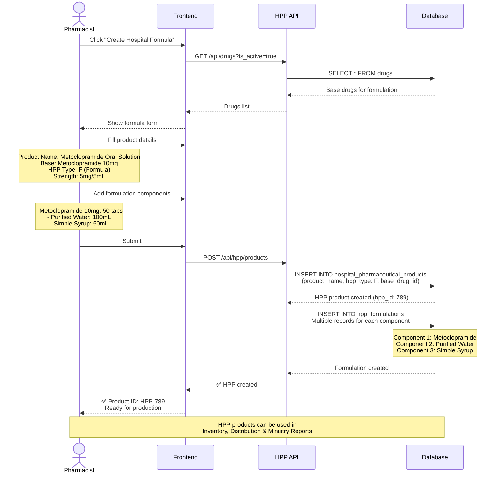

# 🏥 Hospital Pharmaceutical Products (HPP) System

**Hospital-Made Pharmaceutical Products Management**

**Priority:** ⭐⭐ ปานกลาง (Cost Reduction & Quality Control)
**Tables:** 2 tables
**HPP Types:** 5 types (R, M, F, X, OHPP)
**Status:** ✅ Production Ready
**Version:** 2.6.0
**Last Updated:** 2025-01-28
**Workflows:** 4 major processes

---

## 📋 Overview

Hospital Pharmaceutical Products (HPP) System จัดการยาที่ผลิต/ปรับปรุงโดยโรงพยาบาล:

### 5 ประเภท HPP

1. **R - Repackaged (บรรจุใหม่)**
   - บรรจุยาจากบรรจุภัณฑ์ขนาดใหญ่เป็นขนาดเล็ก
   - Example: ยาเม็ดขวด 1,000 เม็ด → Blister pack 10 เม็ด

2. **M - Modified (ดัดแปลง)**
   - ดัดแปลงผลิตภัณฑ์การค้า (แบ่งเม็ด, ละลายแคปซูล)
   - Example: ยา 500mg แบ่งครึ่งเป็น 250mg

3. **F - Formula (สูตรโรงพยาบาล)**
   - สูตรตำรับมาตรฐานของโรงพยาบาล
   - Example: Metoclopramide Oral Solution 5mg/5mL
   - Requires: Formulation components documentation

4. **X - Extemporaneous (ผสมตามสั่ง)**
   - ผสมยาเฉพาะรายผู้ป่วย (custom dose)
   - Example: Pediatric suspension ปรับความแรงตามอายุ
   - Patient-specific compounding

5. **OHPP - Outsourced (จ้างผลิตภายนอก)**
   - สูตรโรงพยาบาลที่จ้างบริษัทผลิต
   - Example: Large-scale production of hospital formula

---

## 🎯 Key Features

### ✅ Complete HPP Lifecycle Management

**Product Creation:**

- 5 HPP types with specific workflows
- Type-specific validation rules
- Ministry compliance (TMT mapping)
- Formula documentation (for F type)

**Formulation Management:**

- Component tracking (active, excipient, preservative)
- Ratio calculation and validation
- Preparation method documentation
- Stability data management

**Quality Control:**

- Pharmacist verification
- Safety checks (e.g., splitting coated tablets)
- Beyond-use date calculation
- Batch documentation

### ✅ Integration with Other Systems

```
Master Data → HPP
    ├─ drug_generics → base generic
    └─ drugs → base trade drug

HPP → Inventory
    └─ hpp products in stock

HPP → Distribution
    └─ dispense hpp products

HPP → Ministry Reporting
    └─ hpp product list with TMT codes
```

---

## 🔗 System Dependencies

### HPP System ให้ข้อมูลแก่:

```
HPP System
    ├─→ Inventory (HPP stock levels)
    ├─→ Distribution (dispense HPP products)
    ├─→ Ministry Reporting (HPP product list)
    └─→ Dashboard (HPP production stats)
```

### HPP System ใช้ข้อมูลจาก:

```
Master Data → HPP
    ├─ drug_generics → map to generic
    ├─ drugs → map to trade drug
    └─ companies → manufacturers

Procurement → HPP
    └─ raw materials for compounding

TMT Integration → HPP
    └─ TMT codes for HPP products
```

---

## 🔄 Main Workflow: Create Hospital Formula Product

**ภาพรวม workflow หลักของระบบ - การสร้างยาสูตรโรงพยาบาล (Type F)**



**สำหรับ workflow ละเอียดเพิ่มเติม**: ดู [WORKFLOWS.md](WORKFLOWS.md)

---

## 📂 Documentation Files

| File                             | Description                                             |
| -------------------------------- | ------------------------------------------------------- |
| **README.md**                    | This file - Overview of HPP System                      |
| **[SCHEMA.md](SCHEMA.md)**       | Database schema: 2 tables + 5 HPP types + ER diagrams   |
| **[WORKFLOWS.md](WORKFLOWS.md)** | Business workflows: 4 major flows (R, M, F, X creation) |
| **api/**                         | OpenAPI specs (will be auto-generated from AegisX)      |

---

## 🎯 Quick Start

### 1. Create Repackaged Product (HPP-R)

```typescript
// Repackage bulk drug into smaller units
const repackaged = await prisma.hospitalPharmaceuticalProduct.create({
  data: {
    hpp_code: 'HPP-R-001',
    hpp_type: 'R',
    product_name: 'Paracetamol 500mg Blister Pack x10',
    drug_id: 1n, // Base bulk drug
    is_outsourced: false,
    is_active: true,
  },
});

console.log(`Created repackaged product: ${repackaged.hpp_code}`);
```

### 2. Create Hospital Formula (HPP-F) with Components

```typescript
// Create hospital-developed formula
const formula = await prisma.$transaction(async (tx) => {
  // Create HPP product
  const hpp = await tx.hospitalPharmaceuticalProduct.create({
    data: {
      hpp_code: 'HPP-F-001',
      hpp_type: 'F',
      product_name: 'Metoclopramide Oral Solution 5mg/5mL',
      generic_id: 10n,
      is_outsourced: false,
      is_active: true,
    },
  });

  // Add formulation components
  await tx.hppFormulation.createMany({
    data: [
      {
        hpp_id: hpp.id,
        component_type: 'ACTIVE',
        component_name: 'Metoclopramide HCl',
        component_strength: '5mg/5mL',
        component_ratio: 0.01, // 1%
      },
      {
        hpp_id: hpp.id,
        component_type: 'EXCIPIENT',
        component_name: 'Syrup Simple',
        component_ratio: 0.88, // 88%
      },
      {
        hpp_id: hpp.id,
        component_type: 'PRESERVATIVE',
        component_name: 'Sodium Benzoate',
        component_strength: '0.1%',
        component_ratio: 0.001, // 0.1%
      },
      {
        hpp_id: hpp.id,
        component_type: 'SOLVENT',
        component_name: 'Purified Water',
        component_ratio: 0.109, // 10.9%
      },
    ],
  });

  return hpp;
});

console.log(`Created formula with ${formula.id} components`);
```

### 3. Create Modified Product (HPP-M)

```typescript
// Split tablet to create adjusted dose
const modified = await prisma.hospitalPharmaceuticalProduct.create({
  data: {
    hpp_code: 'HPP-M-001',
    hpp_type: 'M',
    product_name: 'Paracetamol 250mg (Split Tablet)',
    base_product_id: 5n, // Original product to modify
    drug_id: 1n,
    generic_id: 1n,
    is_outsourced: false,
    is_active: true,
  },
});

console.log(`Created modified product: ${modified.product_name}`);
```

### 4. Get HPP Product with Formulation

```typescript
const product = await prisma.hospitalPharmaceuticalProduct.findUnique({
  where: { hpp_code: 'HPP-F-001' },
  include: {
    formulations: true,
    generic: true,
    drug: true,
    base_product: true,
  },
});

if (product) {
  console.log(`Product: ${product.product_name}`);
  console.log(`Type: ${product.hpp_type}`);
  console.log(`Components: ${product.formulations.length}`);

  // List formulation
  product.formulations.forEach((comp) => {
    console.log(`  - ${comp.component_type}: ${comp.component_name} (${(comp.component_ratio * 100).toFixed(1)}%)`);
  });
}
```

### 5. Search HPP Products by Type

```typescript
// Get all active hospital formulas
const formulas = await prisma.hospitalPharmaceuticalProduct.findMany({
  where: {
    hpp_type: 'F',
    is_active: true,
  },
  include: {
    formulations: true,
    generic: true,
  },
  orderBy: {
    created_at: 'desc',
  },
});

console.log(`Found ${formulas.length} hospital formulas`);
```

### 6. Validate Formulation Ratio

```typescript
// Check if formulation ratios sum to 1.0 (100%)
async function validateFormulation(hppId: bigint) {
  const components = await prisma.hppFormulation.findMany({
    where: { hpp_id: hppId },
  });

  const totalRatio = components.reduce((sum, c) => sum + c.component_ratio, 0);
  const hasActive = components.some((c) => c.component_type === 'ACTIVE');

  if (!hasActive) {
    throw new Error('At least 1 ACTIVE component required');
  }

  if (Math.abs(totalRatio - 1.0) > 0.001) {
    throw new Error(`Total ratio must equal 1.0, got ${totalRatio.toFixed(4)}`);
  }

  return { valid: true, totalRatio };
}
```

---

## 📊 HPP Product Statistics

### Get HPP Product Counts by Type

```typescript
const stats = await prisma.hospitalPharmaceuticalProduct.groupBy({
  by: ['hpp_type', 'is_active'],
  _count: {
    id: true,
  },
});

console.log('HPP Product Statistics:');
stats.forEach((stat) => {
  console.log(`  ${stat.hpp_type} (${stat.is_active ? 'Active' : 'Inactive'}): ${stat._count.id}`);
});

// Expected output:
// HPP Product Statistics:
//   R (Active): 25
//   M (Active): 10
//   F (Active): 15
//   X (Active): 5
//   OHPP (Active): 3
```

### Get Most Used Components

```typescript
const popularComponents = await prisma.hppFormulation.groupBy({
  by: ['component_name', 'component_type'],
  _count: {
    id: true,
  },
  orderBy: {
    _count: {
      id: 'desc',
    },
  },
  take: 10,
});

console.log('Most Used Components:');
popularComponents.forEach((comp) => {
  console.log(`  ${comp.component_name} (${comp.component_type}): ${comp._count.id} formulas`);
});
```

---

## 🏥 HPP Type Selection Guide

### When to Use Each Type:

#### R - Repackaged

**Use When:**

- ✅ Bulk drug needs smaller packaging
- ✅ Original drug is stable in new package
- ✅ No modification to drug itself

**Don't Use:**

- ❌ Drug requires special storage
- ❌ Repackaging affects stability

#### M - Modified

**Use When:**

- ✅ Commercial product needs dose adjustment
- ✅ Tablet has score line (safe to split)
- ✅ Not enteric-coated/controlled-release

**Don't Use:**

- ❌ Controlled/sustained release products
- ❌ Enteric-coated tablets
- ❌ Modification affects efficacy

#### F - Formula

**Use When:**

- ✅ Standard hospital preparation
- ✅ Regularly prepared product
- ✅ Formula is documented and approved

**Requirements:**

- ✅ Hospital committee approval
- ✅ Stability data available
- ✅ Preparation method documented

#### X - Extemporaneous

**Use When:**

- ✅ Patient-specific dosing needed
- ✅ Commercial product unavailable
- ✅ One-time or rare preparation

**Requirements:**

- ✅ Pharmacist approval
- ✅ Prescription on file
- ✅ Beyond-use date determined

#### OHPP - Outsourced

**Use When:**

- ✅ Large-scale production needed
- ✅ Hospital lacks production capacity
- ✅ Cost-effective to outsource

**Requirements:**

- ✅ Contractor has valid license
- ✅ GMP certification
- ✅ Quality control documentation

---

## 📏 Business Rules

### General Rules

1. **Unique HPP Code**
   - Format: `HPP-{TYPE}-{###}`
   - Example: HPP-R-001, HPP-F-012
   - Must be unique across all HPP products

2. **Type-Specific Requirements**
   - **R**: Must have `drug_id` (base drug)
   - **M**: Must have `base_product_id` (original product)
   - **F**: Must have formulation components + `generic_id`
   - **X**: Patient-specific, may include `patient_id`/`prescription_id`
   - **OHPP**: Must have `is_outsourced = TRUE` + contractor info

3. **Formulation Components (F type only)**
   - At least 1 ACTIVE component required
   - `component_ratio` total should = 1.0 (100%)
   - All components must be documented
   - Preparation method must be specified

4. **Ministry Compliance**
   - HPP products must have TMT code mapping
   - Formula must be approved by hospital committee
   - Outsourced products need contractor license
   - Documentation required per type

5. **Quality Control**
   - Pharmacist verification required
   - Safety checks for modification
   - Beyond-use date calculation
   - Batch documentation for formulas

---

## 🔗 Related Documentation

### Global Documentation

- **[SYSTEM_ARCHITECTURE.md](../../SYSTEM_ARCHITECTURE.md)** - Overview of all 8 systems
- **[DATABASE_STRUCTURE.md](../../DATABASE_STRUCTURE.md)** - Complete database schema (44 tables)
- **[END_TO_END_WORKFLOWS.md](../../END_TO_END_WORKFLOWS.md)** - Cross-system workflows

### Per-System Documentation

- **[SCHEMA.md](SCHEMA.md)** - Detailed schema of this system's 2 tables + 5 HPP types
- **[WORKFLOWS.md](WORKFLOWS.md)** - 4 business workflows: R, M, F, X creation

### Related Systems

- **[Master Data](../01-master-data/README.md)** - Drug generics and drugs
- **[Inventory](../04-inventory/README.md)** - HPP stock management
- **[Distribution](../05-distribution/README.md)** - Dispense HPP products
- **[TMT Integration](../07-tmt-integration/README.md)** - TMT code mapping

### Technical Reference

- **`prisma/schema.prisma`** - Source schema definition
- **AegisX Swagger UI** - http://127.0.0.1:3383/documentation (when running)

---

## 📈 Next Steps

1. ✅ **Read** [SCHEMA.md](SCHEMA.md) - Understand 2 tables + 5 HPP types
2. ✅ **Read** [WORKFLOWS.md](WORKFLOWS.md) - Understand 4 business workflows
3. ⏳ **Setup** HPP Product catalog - Create initial R, F types
4. ⏳ **Document** Hospital formulas - Add standard formulations
5. ⏳ **Train** Staff - Pharmacist training on HPP creation
6. ⏳ **Integrate** Inventory - Link HPP products to stock
7. ⏳ **Map** TMT Codes - Ensure ministry compliance

---

**Built with ❤️ for INVS Modern Team**
**Last Updated:** 2025-01-28 | **Version:** 2.6.0
