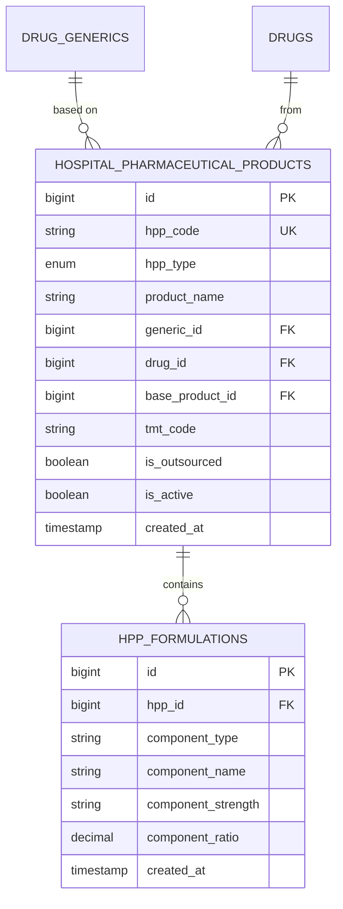

# 🏥 HPP System - Database Schema

**System:** Hospital Pharmaceutical Products (HPP)
**Tables:** 2 tables
**Version:** 2.6.0
**Last Updated:** 2025-01-28

---

## 📖 Table of Contents

### Core Tables

1. [Hospital Pharmaceutical Products](#1-hospital_pharmaceutical_products) - HPP products
2. [HPP Formulations](#2-hpp_formulations) - Product formulations

### Reference

- [ER Diagram](#-entity-relationship-diagram)
- [HPP Types](#-hpp-types)
- [Cross-System Integration](#-cross-system-integration)
- [Common Queries](#-common-queries)

---

## 📊 Table Overview

| Table                              | Records   | Purpose                                                       |
| ---------------------------------- | --------- | ------------------------------------------------------------- |
| `hospital_pharmaceutical_products` | 100-500   | Hospital-made products (repackaged, modified, formula, mixed) |
| `hpp_formulations`                 | 200-2,000 | Product formulation components                                |

---

## 🗺️ Entity Relationship Diagram



---

## 📋 Detailed Table Definitions

### 1. hospital_pharmaceutical_products

**Purpose:** Track hospital-made pharmaceutical products

| Column            | Type         | Constraints                               | Description                          |
| ----------------- | ------------ | ----------------------------------------- | ------------------------------------ |
| `id`              | BIGINT       | PK, AUTO_INCREMENT                        | Primary key                          |
| `hpp_code`        | VARCHAR(50)  | UNIQUE, NOT NULL                          | HPP code (e.g., HPP-R-001)           |
| `hpp_type`        | ENUM         | NOT NULL                                  | R, M, F, X, OHPP                     |
| `product_name`    | VARCHAR(255) | NOT NULL                                  | Product name                         |
| `generic_id`      | BIGINT       | FK → drug_generics(id)                    | Base generic drug                    |
| `drug_id`         | BIGINT       | FK → drugs(id)                            | Base trade drug                      |
| `base_product_id` | BIGINT       | FK → hospital_pharmaceutical_products(id) | Original product (for modifications) |
| `tmt_code`        | VARCHAR(50)  |                                           | TMT code if mapped                   |
| `is_outsourced`   | BOOLEAN      | DEFAULT FALSE                             | TRUE for OHPP type                   |
| `is_active`       | BOOLEAN      | DEFAULT TRUE                              | Active status                        |
| `created_at`      | TIMESTAMP    | DEFAULT CURRENT_TIMESTAMP                 |                                      |
| `updated_at`      | TIMESTAMP    | DEFAULT CURRENT_TIMESTAMP ON UPDATE       |                                      |

**Indexes:**

```sql
CREATE INDEX idx_hpp_code ON hospital_pharmaceutical_products(hpp_code);
CREATE INDEX idx_hpp_type ON hospital_pharmaceutical_products(hpp_type);
CREATE INDEX idx_hpp_generic ON hospital_pharmaceutical_products(generic_id);
CREATE INDEX idx_hpp_active ON hospital_pharmaceutical_products(is_active);
```

---

### 2. hpp_formulations

**Purpose:** Store formulation components for HPP products

| Column               | Type          | Constraints                                         | Description                           |
| -------------------- | ------------- | --------------------------------------------------- | ------------------------------------- |
| `id`                 | BIGINT        | PK, AUTO_INCREMENT                                  | Primary key                           |
| `hpp_id`             | BIGINT        | FK → hospital_pharmaceutical_products(id), NOT NULL | Parent HPP product                    |
| `component_type`     | VARCHAR(50)   | NOT NULL                                            | ACTIVE, EXCIPIENT, PRESERVATIVE, etc. |
| `component_name`     | VARCHAR(255)  | NOT NULL                                            | Component name                        |
| `component_strength` | VARCHAR(100)  |                                                     | Strength/concentration                |
| `component_ratio`    | DECIMAL(10,4) |                                                     | Ratio or percentage                   |
| `created_at`         | TIMESTAMP     | DEFAULT CURRENT_TIMESTAMP                           |                                       |

**Indexes:**

```sql
CREATE INDEX idx_formulation_hpp ON hpp_formulations(hpp_id);
CREATE INDEX idx_formulation_type ON hpp_formulations(component_type);
```

---

## 🏥 HPP Types

### R - Repackaged (บรรจุใหม่)

**Purpose:** Repackage bulk drugs into smaller units

**Example:**

- Original: Paracetamol 500mg Bottle of 1,000 tablets
- HPP: Paracetamol 500mg Blister pack of 10 tablets

```typescript
const repackaged = {
  hpp_code: 'HPP-R-001',
  hpp_type: 'R',
  product_name: 'Paracetamol 500mg Blister x10',
  drug_id: 1n, // Original bulk drug
  is_outsourced: false,
};
```

---

### M - Modified (ดัดแปลง)

**Purpose:** Modified commercial products (e.g., split tablets, dissolve capsules)

**Example:**

- Original: Paracetamol 500mg tablet
- HPP: Paracetamol 250mg (half tablet)

```typescript
const modified = {
  hpp_code: 'HPP-M-001',
  hpp_type: 'M',
  product_name: 'Paracetamol 250mg (Split Tablet)',
  base_product_id: 1n, // Original product
  is_outsourced: false,
};
```

---

### F - Hospital Formula (สูตรโรงพยาบาล)

**Purpose:** Hospital-developed formulas (standard preparation)

**Example:** Metoclopramide Oral Solution 5mg/5mL

```typescript
const formula = {
  hpp_code: 'HPP-F-001',
  hpp_type: 'F',
  product_name: 'Metoclopramide Oral Solution 5mg/5mL',
  generic_id: 10n,
  is_outsourced: false,
};

// Add formulation components
const components = [
  {
    hpp_id: formula.id,
    component_type: 'ACTIVE',
    component_name: 'Metoclopramide HCl',
    component_strength: '5mg/5mL',
    component_ratio: 1.0,
  },
  {
    hpp_id: formula.id,
    component_type: 'EXCIPIENT',
    component_name: 'Syrup Simple',
    component_ratio: 0.8,
  },
  {
    hpp_id: formula.id,
    component_type: 'PRESERVATIVE',
    component_name: 'Sodium Benzoate',
    component_ratio: 0.01,
  },
];
```

---

### X - Extemporaneous (ผสมตามสั่ง)

**Purpose:** Patient-specific compounding (custom dose/formulation)

**Example:** Pediatric dose adjustment

```typescript
const extemp = {
  hpp_code: 'HPP-X-001',
  hpp_type: 'X',
  product_name: 'Amoxicillin Suspension 125mg/5mL (Custom)',
  generic_id: 3n,
  is_outsourced: false,
};
```

---

### OHPP - Outsourced (จ้างผลิตภายนอก)

**Purpose:** Hospital formula manufactured by external contractor

**Example:** Large-scale production of hospital formula

```typescript
const outsourced = {
  hpp_code: 'HPP-O-001',
  hpp_type: 'OHPP',
  product_name: 'Hospital Chlorhexidine Solution 2% (Contracted)',
  generic_id: 15n,
  is_outsourced: true,
};
```

---

## 🔗 Cross-System Integration

### HPP receives data from:

```
Master Data → HPP
    ├─ drug_generics → base generic
    └─ drugs → base trade drug

Procurement → HPP
    └─ component sourcing
```

### HPP provides data to:

```
HPP → Inventory
    └─ hpp products in stock

HPP → Distribution
    └─ dispense hpp products

HPP → Ministry Reporting
    └─ hpp product list
```

---

## 💡 Common Queries

### Create Repackaged Product

```typescript
const repackaged = await prisma.hospitalPharmaceuticalProduct.create({
  data: {
    hpp_code: 'HPP-R-001',
    hpp_type: 'R',
    product_name: 'Paracetamol 500mg Blister x10',
    drug_id: 1n,
    is_outsourced: false,
    is_active: true,
  },
});
```

### Create Hospital Formula with Components

```typescript
const formula = await prisma.$transaction(async (tx) => {
  // Create HPP product
  const hpp = await tx.hospitalPharmaceuticalProduct.create({
    data: {
      hpp_code: 'HPP-F-001',
      hpp_type: 'F',
      product_name: 'Metoclopramide Oral Solution 5mg/5mL',
      generic_id: 10n,
      is_outsourced: false,
      is_active: true,
    },
  });

  // Add formulation components
  await tx.hppFormulation.createMany({
    data: [
      {
        hpp_id: hpp.id,
        component_type: 'ACTIVE',
        component_name: 'Metoclopramide HCl',
        component_strength: '5mg/5mL',
        component_ratio: 1.0,
      },
      {
        hpp_id: hpp.id,
        component_type: 'EXCIPIENT',
        component_name: 'Syrup Simple',
        component_ratio: 0.8,
      },
    ],
  });

  return hpp;
});
```

### Get All Active HPP Products by Type

```typescript
const repackagedProducts = await prisma.hospitalPharmaceuticalProduct.findMany({
  where: {
    hpp_type: 'R',
    is_active: true,
  },
  include: {
    generic: true,
    drug: true,
  },
});
```

### Get HPP Product with Formulation

```typescript
const product = await prisma.hospitalPharmaceuticalProduct.findUnique({
  where: { hpp_code: 'HPP-F-001' },
  include: {
    formulations: true,
    generic: true,
  },
});

console.log(`${product.product_name} contains ${product.formulations.length} components`);
```

---

## 📏 Business Rules

### HPP Product Rules

1. **Unique HPP Code**
   - Format: HPP-{TYPE}-{###}
   - Example: HPP-R-001, HPP-F-012

2. **Type-Specific Requirements**
   - **R (Repackaged)**: Must have `drug_id`
   - **M (Modified)**: Must have `base_product_id`
   - **F (Formula)**: Must have formulation components
   - **X (Extemp)**: Patient-specific, may not be stored
   - **OHPP**: Must have `is_outsourced = TRUE`

3. **Formulation Components**
   - At least 1 ACTIVE component required
   - component_ratio total should = 1.0 (100%)
   - All components must be documented

4. **Ministry Compliance**
   - HPP products must have TMT mapping
   - Formula must be approved by hospital committee
   - Outsourced products need contractor license

---

## 🔍 Related Documentation

### System Documentation

- **[README.md](README.md)** - HPP System overview
- **[WORKFLOWS.md](WORKFLOWS.md)** - HPP workflows

### Global Documentation

- **[SYSTEM_ARCHITECTURE.md](../../SYSTEM_ARCHITECTURE.md)** - All 8 systems
- **[DATABASE_STRUCTURE.md](../../DATABASE_STRUCTURE.md)** - Complete database schema

### Related Systems

- **[Master Data](../01-master-data/SCHEMA.md)** - Drug generics and drugs
- **[Inventory](../04-inventory/SCHEMA.md)** - HPP stock management

---

**Built with ❤️ for INVS Modern Team**
**Last Updated:** 2025-01-28 | **Version:** 2.6.0
