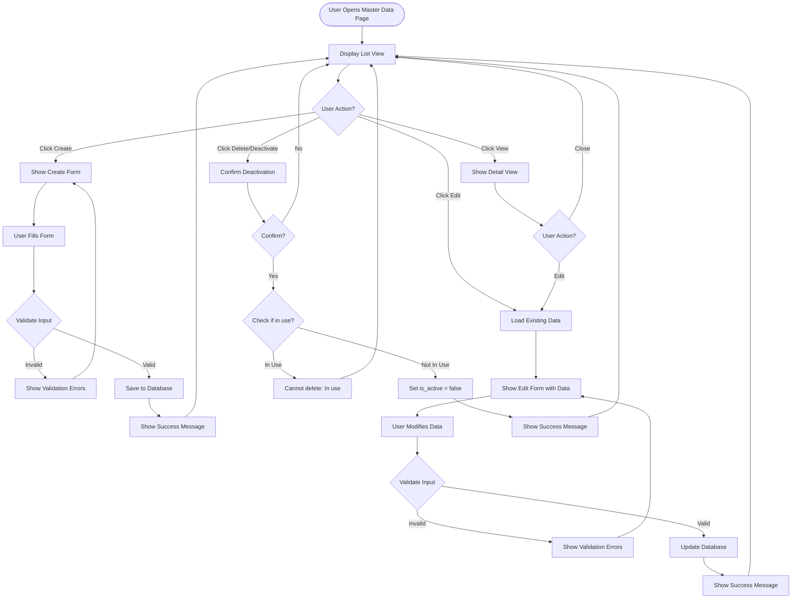
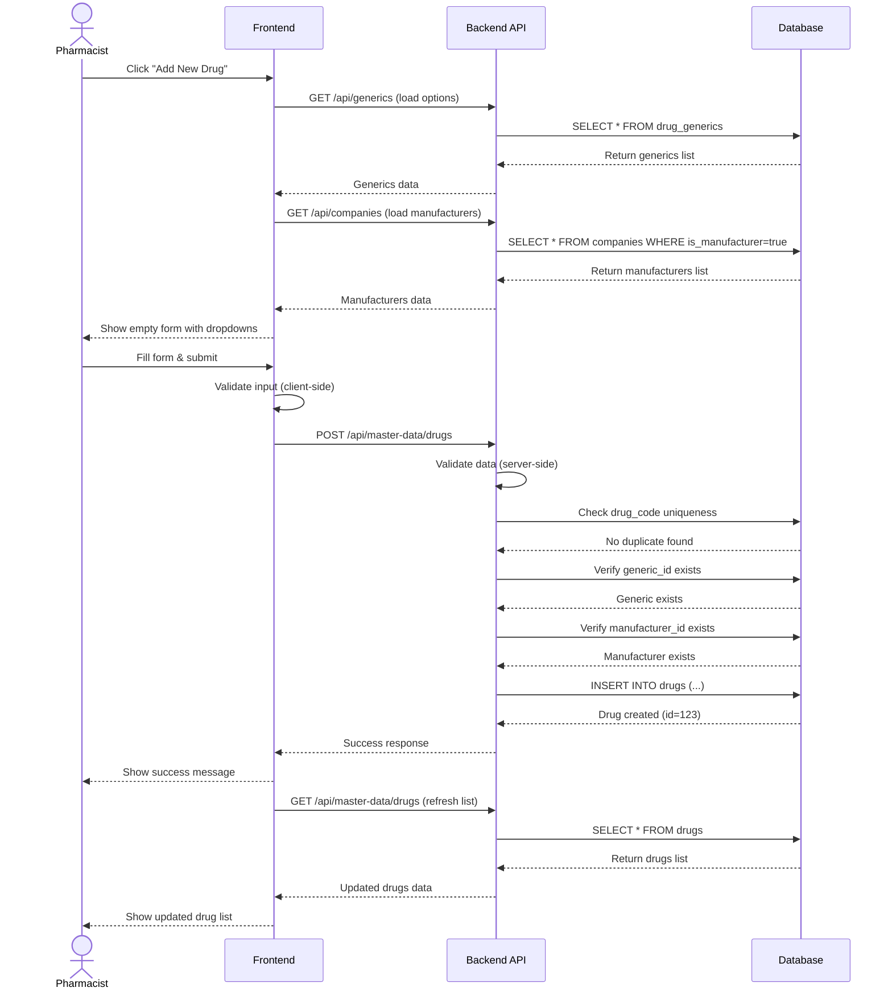
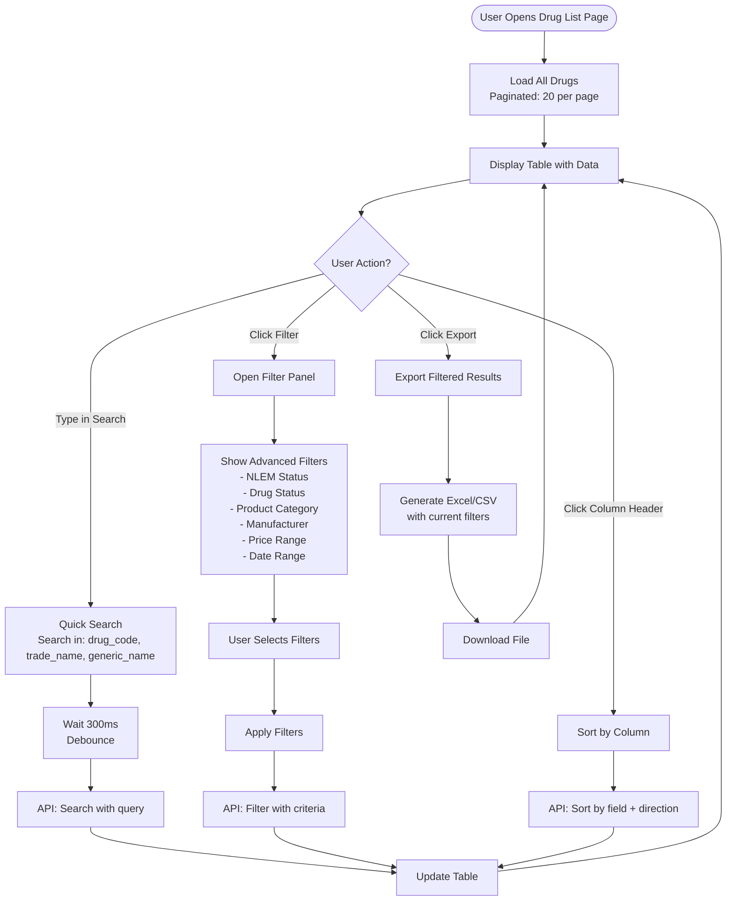

```mermaid
flowchart TD
    Start([User Opens Bulk Import Page]) --> Download[Download Template File]
    Download --> Fill[User Fills Data in Excel]
    Fill --> Upload[Upload Filled File]
    Upload --> ValidateFile{Validate File Format}

    ValidateFile -->|Wrong Format| ErrorFormat[Show Error: Invalid file format]
    ErrorFormat --> Upload

    ValidateFile -->|Correct Format| Parse[Parse Excel Data]
    Parse --> ValidateRows[Validate Each Row]
    ValidateRows --> CheckErrors{Has Errors?}

    CheckErrors -->|All Invalid| ShowAllErrors[Show All Errors<br/>No valid rows]
    ShowAllErrors --> DownloadError1{Download Error Report?}
    DownloadError1 -->|Yes| GenReport1[Generate Error Excel]
    GenReport1 --> Upload
    DownloadError1 -->|No| Upload

    CheckErrors -->|Some Invalid| ShowPreview[Show Preview Table<br/>Valid rows: Green<br/>Invalid rows: Red]
    ShowPreview --> UserDecision{User Decision}

    UserDecision -->|Download Errors| GenReport2[Generate Error Excel<br/>with issue descriptions]
    GenReport2 --> Upload

    UserDecision -->|Import Valid Only| ConfirmImport[Confirm Import<br/>Show count: X valid, Y invalid]

    UserDecision -->|Cancel| End1([End])

    CheckErrors -->|All Valid| ShowAllValid[Show Preview<br/>All rows valid]
    ShowAllValid --> ConfirmImport

    ConfirmImport --> UserConfirm{Confirm?}
    UserConfirm -->|No| End2([End])
    UserConfirm -->|Yes| StartImport[Start Import Process]

    StartImport --> ImportLoop[Import Each Row in Transaction]
    ImportLoop --> Progress[Show Progress Bar<br/>X of Y imported]
    Progress --> Complete{All Done?}
    Complete -->|No| ImportLoop
    Complete -->|Yes| ShowSummary[Show Summary<br/>✅ Imported: X<br/>❌ Failed: Y<br/>⏭️ Skipped: Z]
    ShowSummary --> End3([End])
```

# 🔄 Master Data - Business Workflows

**System:** Master Data Management
**Version:** 2.6.0
**Last Updated:** 2025-01-28

---

## 📋 Overview

This document describes the **3 core workflows** for Master Data Management:

1. **CRUD Operations** - Create, Read, Update, Delete master data
2. **Bulk Import** - Import large datasets from Excel/CSV
3. **Search & Filter** - Advanced search and filtering

---

## Workflow 1: CRUD Operations

### 🎯 User Stories

**Create:** As a pharmacist, I want to add a new drug so it's available for purchase
**Read:** As a pharmacist, I want to view drug details to verify information
**Update:** As a pharmacist, I want to update drug price when it changes
**Delete:** As a pharmacist, I want to deactivate discontinued drugs

---

### 📊 Process Flow



---

### 🔄 Sequence Diagram



---

### 📝 Step-by-Step: Create New Drug

#### Step 1: Open Create Form

**User Action:** Click "Add New Drug" button

**System Response:**

- Display empty form with all required fields
- Load dropdown options (generics, manufacturers)
- Set default values (is_active = true, product_category = CATEGORY_1)

#### Step 2: Fill Form Data

**User Fills:**

```typescript
{
  drug_code: "123456789012345678901234", // 24 chars
  trade_name: "Tylenol 500mg",
  generic_id: 1, // Select from dropdown (drug_generics)
  manufacturer_id: 5, // Select from dropdown (companies)
  tmt_tpu_id: 100234, // Optional: Select from TMT search ⭐ NEW
  nlem_status: "E", // Radio: Essential / Non-Essential
  drug_status: "STATUS_1", // Dropdown: Active
  product_category: "CATEGORY_1", // Dropdown
  unit_price: 2.50,
  package_size: 100,
  package_unit: "TAB"
}
```

**Phase 8 Enhancement:** ⭐

- Added optional `tmt_tpu_id` field for TMT integration
- TMT search dialog with 76,904 concepts available
- 47.99% of existing drugs already mapped

#### Step 3: Client-side Validation

**Checks:**

- ✅ `drug_code` is exactly 24 characters
- ✅ `trade_name` is not empty
- ✅ `generic_id` is selected
- ✅ `manufacturer_id` is selected
- ✅ All ministry fields are filled
- ✅ `unit_price` is positive number

**If Invalid:**

- Show red error messages below fields
- Prevent form submission
- Keep user data (don't clear form)

#### Step 4: Server-side Validation

**API:** `POST /api/master-data/drugs`

**Additional Checks:**

```typescript
// Check drug_code uniqueness
const existing = await prisma.drug.findUnique({
  where: { drug_code: data.drug_code },
});
if (existing) {
  return error('Drug code already exists');
}

// Check generic exists
const generic = await prisma.drugGeneric.findUnique({
  where: { id: data.generic_id },
});
if (!generic || !generic.is_active) {
  return error('Invalid generic drug');
}

// Check manufacturer exists
const manufacturer = await prisma.company.findUnique({
  where: { id: data.manufacturer_id },
});
if (!manufacturer || !manufacturer.is_active || !manufacturer.is_manufacturer) {
  return error('Invalid manufacturer');
}
```

#### Step 5: Save to Database

```typescript
const drug = await prisma.drug.create({
  data: {
    drug_code: data.drug_code,
    trade_name: data.trade_name,
    generic_id: data.generic_id,
    manufacturer_id: data.manufacturer_id,
    nlem_status: data.nlem_status,
    drug_status: data.drug_status,
    product_category: data.product_category,
    status_changed_date: new Date(), // Auto-set on create
    unit_price: data.unit_price,
    package_size: data.package_size,
    package_unit: data.package_unit,
    is_active: true,
  },
  include: {
    generic: true,
    manufacturer: true,
  },
});
```

#### Step 6: Show Success

**System Response:**

- Show success toast: "Drug created successfully"
- Close create form
- Refresh list view with new drug at top
- Highlight new row for 3 seconds

---

### 📝 Step-by-Step: Update Existing Drug

#### Step 1: Load Existing Data

**User Action:** Click "Edit" button on drug row

**API:** `GET /api/master-data/drugs/{id}`

```typescript
const drug = await prisma.drug.findUnique({
  where: { id: drugId },
  include: {
    generic: true,
    manufacturer: true,
  },
});
```

#### Step 2: Pre-fill Form

**System Response:**

- Show edit form with all fields filled
- Disable `drug_code` field (cannot change primary identifier)
- Show current generic and manufacturer names
- Show all ministry compliance fields

#### Step 3: User Modifies Data

**Common Updates:**

- Price change: `unit_price: 2.50 → 3.00`
- Status change: `drug_status: STATUS_1 → STATUS_2`
- Deactivate: `is_active: true → false`

**Auto-update on Status Change:**

```typescript
// If drug_status changed, update status_changed_date
if (newData.drug_status !== oldData.drug_status) {
  newData.status_changed_date = new Date();
}
```

#### Step 4: Validation

**Same as Create, plus:**

- Check for active inventory (if deactivating)
- Check for pending purchase orders

#### Step 5: Update Database

```typescript
const updated = await prisma.drug.update({
  where: { id: drugId },
  data: {
    trade_name: data.trade_name,
    nlem_status: data.nlem_status,
    drug_status: data.drug_status,
    product_category: data.product_category,
    status_changed_date: data.status_changed_date,
    unit_price: data.unit_price,
    is_active: data.is_active,
    updated_at: new Date(),
  },
});
```

---

### 📝 Step-by-Step: Soft Delete (Deactivate)

#### Step 1: Check Usage

**Before Deactivating:**

```typescript
// Check if drug has inventory
const inventory = await prisma.inventory.findMany({
  where: {
    drug_id: drugId,
    quantity_on_hand: { gt: 0 },
  },
});

if (inventory.length > 0) {
  return warning('Cannot deactivate: Drug has inventory in stock');
}

// Check if drug has pending POs
const pendingPOs = await prisma.purchaseOrderItem.findMany({
  where: {
    drug_id: drugId,
    purchase_order: {
      status: { in: ['DRAFT', 'PENDING', 'APPROVED'] },
    },
  },
});

if (pendingPOs.length > 0) {
  return warning('Cannot deactivate: Drug has pending purchase orders');
}
```

#### Step 2: Soft Delete

```typescript
const deactivated = await prisma.drug.update({
  where: { id: drugId },
  data: {
    is_active: false,
    drug_status: 'STATUS_4', // Completely discontinued
    status_changed_date: new Date(),
    updated_at: new Date(),
  },
});
```

**Note:** Data is never physically deleted - always use `is_active = false`

---

## Workflow 2: Bulk Import

### 🎯 User Story

As a pharmacist, I want to import 500 drugs from an Excel file so I can quickly populate the system without manual entry.

---

### 📊 Process Flow



---

### 📝 Step-by-Step: Bulk Drug Import

#### Step 1: Download Template

**User Action:** Click "Download Excel Template"

**System Response:**

- Generate Excel file with:
  - **Headers** (Row 1): Column names in Thai + English
  - **Example Data** (Row 2-3): Sample valid rows
  - **Data Validation**: Dropdowns for enum fields
  - **Instructions Sheet**: Field descriptions and rules

**Template Structure:**

```
| drug_code (24 chars) | trade_name | working_code (7 chars) | manufacturer_code | tmt_tpu_id | nlem_status | drug_status | product_category | unit_price |
|---------------------|------------|----------------------|------------------|-----------|-------------|-------------|-----------------|-----------|
| 123456789012345678901234 | Tylenol 500mg | 0001001 | PFIZER | 100234 | E | STATUS_1 | CATEGORY_1 | 2.50 |
| 234567890123456789012345 | Advil 400mg | 0001002 | ZUELLIG | 100567 | E | STATUS_1 | CATEGORY_1 | 3.00 |
```

**Phase 8 Enhancement:** ⭐

- Added optional `tmt_tpu_id` column for TMT integration
- Provide TMT lookup sheet with 76,904 concepts
- Column can be left empty if TMT code unknown

#### Step 2: User Fills Data

**User Actions:**

1. Open template in Excel
2. Delete example rows (keep header)
3. Fill actual data (500 rows)
4. Save file

**Common Mistakes to Prevent:**

- Drug code not 24 chars → Add note in template
- Working code not found → Provide lookup sheet
- Invalid manufacturer code → Provide valid codes sheet

#### Step 3: Upload File

**User Action:** Click "Upload File" and select filled Excel

**API:** `POST /api/master-data/drugs/bulk-import`

**Request:** `multipart/form-data`

```typescript
{
  file: File, // Excel file
  options: {
    skipInvalid: boolean, // Import only valid rows
    updateExisting: boolean // Update if drug_code exists
  }
}
```

#### Step 4: Validate File Format

**Checks:**

```typescript
// Check file type
if (!file.name.endsWith('.xlsx') && !file.name.endsWith('.xls')) {
  return error('Invalid file format. Please upload Excel file (.xlsx)');
}

// Check file size (max 10MB)
if (file.size > 10 * 1024 * 1024) {
  return error('File too large. Maximum 10MB.');
}

// Parse Excel
const workbook = XLSX.read(file, { type: 'buffer' });
const sheet = workbook.Sheets[workbook.SheetNames[0]];
const data = XLSX.utils.sheet_to_json(sheet);

// Check required columns
const requiredCols = ['drug_code', 'trade_name', 'working_code', 'manufacturer_code', 'nlem_status', 'drug_status', 'product_category'];
const headers = Object.keys(data[0] || {});
const missing = requiredCols.filter((col) => !headers.includes(col));

if (missing.length > 0) {
  return error(`Missing required columns: ${missing.join(', ')}`);
}
```

#### Step 5: Validate Each Row

**For Each Row:**

```typescript
const validationResults = await Promise.all(
  data.map(async (row, index) => {
    const errors = [];

    // 1. Check drug_code length
    if (row.drug_code?.length !== 24) {
      errors.push('Drug code must be exactly 24 characters');
    }

    // 2. Check drug_code uniqueness (if not updating)
    if (!options.updateExisting) {
      const exists = await prisma.drug.findUnique({
        where: { drug_code: row.drug_code },
      });
      if (exists) {
        errors.push('Drug code already exists');
      }
    }

    // 3. Check working_code exists
    const generic = await prisma.drugGeneric.findUnique({
      where: { working_code: row.working_code },
    });
    if (!generic) {
      errors.push('Working code not found in drug_generics');
    }

    // 4. Check manufacturer_code exists
    const manufacturer = await prisma.company.findUnique({
      where: { company_code: row.manufacturer_code },
    });
    if (!manufacturer || !manufacturer.is_manufacturer) {
      errors.push('Invalid manufacturer code');
    }

    // 5. Check enum values
    if (!['E', 'N'].includes(row.nlem_status)) {
      errors.push('nlem_status must be E or N');
    }
    if (!['STATUS_1', 'STATUS_2', 'STATUS_3', 'STATUS_4'].includes(row.drug_status)) {
      errors.push('Invalid drug_status');
    }
    if (!['CATEGORY_1', 'CATEGORY_2', 'CATEGORY_3', 'CATEGORY_4', 'CATEGORY_5'].includes(row.product_category)) {
      errors.push('Invalid product_category');
    }

    // 6. Check price is positive
    if (row.unit_price && row.unit_price <= 0) {
      errors.push('Price must be positive');
    }

    return {
      row: index + 2, // Excel row (1-indexed + header)
      data: row,
      valid: errors.length === 0,
      errors: errors,
      generic_id: generic?.id,
      manufacturer_id: manufacturer?.id,
    };
  }),
);
```

#### Step 6: Show Preview

**System Response:**

```typescript
{
  total: 500,
  valid: 487,
  invalid: 13,
  results: [
    {
      row: 2,
      data: { drug_code: "...", trade_name: "..." },
      valid: true,
      errors: []
    },
    {
      row: 15,
      data: { drug_code: "12345", trade_name: "..." },
      valid: false,
      errors: ["Drug code must be exactly 24 characters"]
    },
    // ... more results
  ]
}
```

**UI Display:**

- **Green rows:** Valid, ready to import
- **Red rows:** Invalid, will be skipped
- **Yellow badge:** "13 errors found"
- **Buttons:**
  - "Download Error Report" → Excel with only error rows + error descriptions
  - "Import Valid Only (487 rows)" → Proceed with import
  - "Cancel" → Go back

#### Step 7: Import Valid Rows

**User Confirms:** "Import Valid Only"

**API:** `POST /api/master-data/drugs/bulk-import/confirm`

**Process:**

```typescript
const results = await prisma.$transaction(async (tx) => {
  const imported = [];
  const failed = [];

  for (const item of validRows) {
    try {
      const drug = await tx.drug.create({
        data: {
          drug_code: item.data.drug_code,
          trade_name: item.data.trade_name,
          generic_id: item.generic_id,
          manufacturer_id: item.manufacturer_id,
          nlem_status: item.data.nlem_status,
          drug_status: item.data.drug_status,
          product_category: item.data.product_category,
          status_changed_date: new Date(),
          unit_price: item.data.unit_price,
          is_active: true,
        },
      });
      imported.push({ row: item.row, id: drug.id });
    } catch (error) {
      failed.push({ row: item.row, error: error.message });
    }
  }

  return { imported, failed };
});
```

**Note:** Uses transaction for atomicity - if any error occurs, all imports are rolled back

#### Step 8: Show Summary

**System Response:**

```
✅ Import Complete!

📊 Summary:
- Total rows in file: 500
- Valid rows: 487
- Invalid rows (skipped): 13
- Successfully imported: 487
- Failed to import: 0

⏱️ Duration: 12.5 seconds
```

**Optional:** Download full import log (CSV with all results)

---

## Workflow 3: Search & Filter

### 🎯 User Story

As a pharmacist, I want to search and filter drugs by multiple criteria so I can quickly find specific drugs.

---

### 📊 Process Flow



---

### 📝 Step-by-Step: Advanced Search & Filter

#### Step 1: Initial Load

**User Opens Page**

**API:** `GET /api/master-data/drugs?page=1&limit=20`

**Default Query:**

```typescript
const drugs = await prisma.drug.findMany({
  where: { is_active: true },
  include: {
    generic: true,
    manufacturer: true,
  },
  orderBy: { created_at: 'desc' },
  skip: 0,
  take: 20,
});

const total = await prisma.drug.count({
  where: { is_active: true },
});

return {
  data: drugs,
  pagination: {
    page: 1,
    limit: 20,
    total: total,
    totalPages: Math.ceil(total / 20),
  },
};
```

#### Step 2: Quick Search

**User Types:** "paracetamol"

**Debounced API (300ms delay):** `GET /api/master-data/drugs?search=paracetamol`

**Query:**

```typescript
const drugs = await prisma.drug.findMany({
  where: {
    is_active: true,
    OR: [{ drug_code: { contains: search, mode: 'insensitive' } }, { trade_name: { contains: search, mode: 'insensitive' } }, { generic: { generic_name: { contains: search, mode: 'insensitive' } } }, { generic: { working_code: { contains: search, mode: 'insensitive' } } }],
  },
  include: {
    generic: true,
    manufacturer: true,
  },
  orderBy: { trade_name: 'asc' },
});
```

**Result:** All drugs matching "paracetamol" in any searchable field

#### Step 3: Advanced Filters

**User Opens Filter Panel**

**Available Filters:**

```typescript
interface DrugFilter {
  nlem_status?: 'E' | 'N';
  drug_status?: 'STATUS_1' | 'STATUS_2' | 'STATUS_3' | 'STATUS_4';
  product_category?: 'CATEGORY_1' | 'CATEGORY_2' | 'CATEGORY_3' | 'CATEGORY_4' | 'CATEGORY_5';
  manufacturer_id?: number;
  price_min?: number;
  price_max?: number;
  date_from?: Date;
  date_to?: Date;
}
```

**User Selects:**

- NLEM Status: Essential (E)
- Drug Status: Active (STATUS_1)
- Manufacturer: Pfizer
- Price Range: 0 - 100 THB

**API:** `GET /api/master-data/drugs?nlem_status=E&drug_status=STATUS_1&manufacturer_id=5&price_min=0&price_max=100`

**Query:**

```typescript
const where = {
  is_active: true,
  nlem_status: 'E',
  drug_status: 'STATUS_1',
  manufacturer_id: 5,
  unit_price: {
    gte: 0,
    lte: 100,
  },
};

const drugs = await prisma.drug.findMany({
  where,
  include: {
    generic: true,
    manufacturer: true,
  },
  orderBy: { trade_name: 'asc' },
});
```

#### Step 4: Sorting

**User Clicks:** "Price" column header

**API:** `GET /api/master-data/drugs?sortBy=unit_price&sortOrder=asc`

**Query:**

```typescript
const drugs = await prisma.drug.findMany({
  where: { is_active: true },
  include: {
    generic: true,
    manufacturer: true,
  },
  orderBy: { unit_price: 'asc' }, // or 'desc'
});
```

**Click Again:** Toggle to descending

#### Step 5: Export Filtered Results

**User Clicks:** "Export to Excel"

**API:** `GET /api/master-data/drugs/export?format=xlsx&filters=...`

**Process:**

```typescript
// Get filtered data (no pagination)
const drugs = await prisma.drug.findMany({
  where: applyFilters(filters),
  include: {
    generic: true,
    manufacturer: true,
  },
  orderBy: { trade_name: 'asc' },
});

// Generate Excel
const data = drugs.map((d) => ({
  'Drug Code': d.drug_code,
  'Trade Name': d.trade_name,
  'Generic Name': d.generic.generic_name,
  'Working Code': d.generic.working_code,
  Manufacturer: d.manufacturer.company_name,
  'NLEM Status': d.nlem_status === 'E' ? 'Essential' : 'Non-Essential',
  'Drug Status': d.drug_status,
  'Product Category': d.product_category,
  Price: d.unit_price,
  Status: d.is_active ? 'Active' : 'Inactive',
}));

const workbook = XLSX.utils.book_new();
const worksheet = XLSX.utils.json_to_sheet(data);
XLSX.utils.book_append_sheet(workbook, worksheet, 'Drugs');
const buffer = XLSX.write(workbook, { type: 'buffer', bookType: 'xlsx' });

return {
  filename: `drugs_export_${new Date().toISOString()}.xlsx`,
  data: buffer,
};
```

---

## 🔌 API Summary

### CRUD Operations

```typescript
// List with pagination & filters
GET    /api/master-data/drugs
       ?page=1&limit=20
       &search=paracetamol
       &nlem_status=E
       &drug_status=STATUS_1
       &sortBy=trade_name&sortOrder=asc

// Get single drug
GET    /api/master-data/drugs/:id

// Create drug
POST   /api/master-data/drugs
       Body: { drug_code, trade_name, ... }

// Update drug
PUT    /api/master-data/drugs/:id
       Body: { trade_name, unit_price, ... }

// Soft delete (deactivate)
DELETE /api/master-data/drugs/:id
       Sets is_active = false
```

### Bulk Operations

```typescript
// Download import template
GET    /api/master-data/drugs/bulk-import/template

// Upload and validate file
POST   /api/master-data/drugs/bulk-import/validate
       Body: multipart/form-data { file: File }
       Response: { total, valid, invalid, results[] }

// Confirm import
POST   /api/master-data/drugs/bulk-import/confirm
       Body: { validRows[], options }
```

### Export

```typescript
// Export filtered results
GET    /api/master-data/drugs/export
       ?format=xlsx|csv
       &filters=...
```

### Utilities

```typescript
// Get dropdown options
GET    /api/master-data/drugs/dropdown
       Response: { label, value }[]

// Check drug_code uniqueness
GET    /api/master-data/drugs/check/drug_code/:code
       Response: { available: boolean }

// Pre-save validation
POST   /api/master-data/drugs/validate
       Body: { drug_code, trade_name, ... }
       Response: { valid: boolean, errors: string[] }
```

---

## ✅ Validation Summary

### Field Validation Rules

| Field                 | Required | Format        | Validation                                    |
| --------------------- | -------- | ------------- | --------------------------------------------- |
| `drug_code`           | Yes      | String(24)    | Exactly 24 chars, unique                      |
| `trade_name`          | Yes      | String(200)   | Not empty                                     |
| `generic_id`          | Yes      | Integer       | Must exist in drug_generics                   |
| `manufacturer_id`     | Yes      | Integer       | Must exist in companies, must be manufacturer |
| `nlem_status`         | Yes      | Enum          | E or N                                        |
| `drug_status`         | Yes      | Enum          | STATUS_1 to STATUS_4                          |
| `product_category`    | Yes      | Enum          | CATEGORY_1 to CATEGORY_5                      |
| `status_changed_date` | Auto     | Date          | Auto-set when drug_status changes             |
| `unit_price`          | No       | Decimal(10,2) | Positive number if provided                   |
| `is_active`           | Yes      | Boolean       | Default true                                  |

---

## 🚨 Error Handling

### Common Errors

| Error Code             | Scenario                 | Message                                   | User Action               |
| ---------------------- | ------------------------ | ----------------------------------------- | ------------------------- |
| `DUPLICATE_CODE`       | Drug code exists         | "Drug code already exists"                | Use different code        |
| `INVALID_LENGTH`       | Wrong code length        | "Drug code must be exactly 24 characters" | Pad/trim code             |
| `INVALID_GENERIC`      | Generic not found        | "Invalid generic drug"                    | Select valid generic      |
| `INVALID_MANUFACTURER` | Company not manufacturer | "Invalid manufacturer"                    | Select valid manufacturer |
| `INVALID_ENUM`         | Wrong enum value         | "Invalid drug status"                     | Use valid status          |
| `IN_USE`               | Cannot delete            | "Cannot deactivate: Drug has inventory"   | Check inventory first     |
| `REQUIRED_FIELD`       | Missing required field   | "Field 'nlem_status' is required"         | Fill all required fields  |

---

**Related Documentation:**

- [README.md](README.md) - System overview
- [SCHEMA.md](SCHEMA.md) - Database schema
- [../../END_TO_END_WORKFLOWS.md](../../END_TO_END_WORKFLOWS.md) - Cross-system workflows

**Last Updated:** 2025-01-28 | **Version:** 2.6.0
