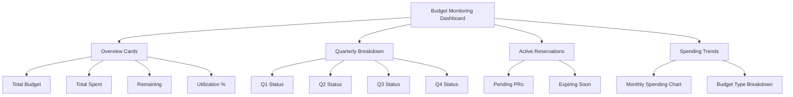
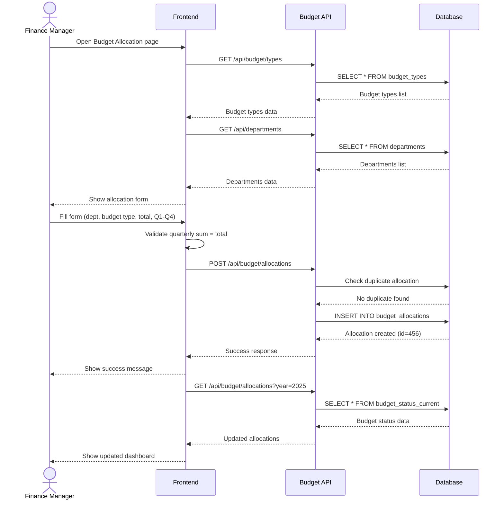

```mermaid
flowchart TD
    Start([Finance Manager Opens Budget Allocation]) --> CheckYear{Fiscal Year Selected?}

    CheckYear -->|No| SelectYear[Select Fiscal Year: 2025]
    SelectYear --> LoadBudgets[Load Available Budget Types]

    CheckYear -->|Yes| LoadBudgets

    LoadBudgets --> SelectDept[Select Department]
    SelectDept --> SelectBudgetType[Select Budget Type]
    SelectBudgetType --> EnterTotal[Enter Total Budget Amount]

    EnterTotal --> DistributeQuarters[Distribute to Quarters]

    DistributeQuarters --> DistributeMethod{Distribution Method?}
    DistributeMethod -->|Equal| AutoEqual[Auto-fill: 25% each quarter]
    DistributeMethod -->|Custom| ManualEntry[Manual entry per quarter]

    AutoEqual --> ValidateSum{Q1+Q2+Q3+Q4 = Total?}
    ManualEntry --> ValidateSum

    ValidateSum -->|No| ShowError[❌ Show Error: Sum must equal total]
    ShowError --> DistributeQuarters

    ValidateSum -->|Yes| CheckDuplicate{Allocation exists?}

    CheckDuplicate -->|Yes| ShowDuplicateError[❌ Error: Allocation already exists]
    ShowDuplicateError --> End1([End])

    CheckDuplicate -->|No| Preview[Show Preview with Summary]
    Preview --> UserConfirm{Confirm?}

    UserConfirm -->|No| End2([End])
    UserConfirm -->|Yes| SaveAllocation[Save to Database]

    SaveAllocation --> Success[✅ Show Success Message]
    Success --> RefreshList[Refresh Allocation List]
    RefreshList --> End3([End])
```

```mermaid
flowchart TD
    Start([Pharmacist Opens Budget Planning]) --> SelectYear[Select Fiscal Year: 2025]
    SelectYear --> CheckPlan{Plan exists?}

    CheckPlan -->|Yes| LoadPlan[Load Existing Plan]
    CheckPlan -->|No| CreateNew[Create New Plan]

    LoadPlan --> ViewItems[View Plan Items]
    CreateNew --> EnterName[Enter Plan Name]
    EnterName --> ViewItems

    ViewItems --> UserAction{User Action?}

    UserAction -->|Add Drug| SearchDrug[Search Generic Drug]
    SearchDrug --> SelectDrug[Select Drug from List]
    SelectDrug --> ShowHistory[Show 3-Year Historical Data]

    ShowHistory --> EnterPlan[Enter Planned Quantity & Price]
    EnterPlan --> DistributeQ[Distribute to Q1-Q4]
    DistributeQ --> ValidatePlan{Valid?}

    ValidatePlan -->|No| ShowPlanError[Show Error]
    ShowPlanError --> EnterPlan

    ValidatePlan -->|Yes| SaveItem[Save Plan Item]
    SaveItem --> UpdateTotal[Update Plan Total]
    UpdateTotal --> ViewItems

    UserAction -->|Edit Drug| EditItem[Load Item]
    EditItem --> EnterPlan

    UserAction -->|Delete Drug| ConfirmDelete{Confirm Delete?}
    ConfirmDelete -->|Yes| DeleteItem[Delete Item]
    DeleteItem --> UpdateTotal
    ConfirmDelete -->|No| ViewItems

    UserAction -->|Submit for Approval| ValidateComplete{All items valid?}
    ValidateComplete -->|No| ShowValidationError[Show validation errors]
    ShowValidationError --> ViewItems

    ValidateComplete -->|Yes| SubmitApproval[Submit to Manager]
    SubmitApproval --> ChangeStatus[Status: DRAFT → SUBMITTED]
    ChangeStatus --> NotifyManager[Notify Manager]
    NotifyManager --> End1([End])

    UserAction -->|Close| End2([End])
```

```mermaid
flowchart TD
    Start([User Creates Purchase Request]) --> EnterPR[Enter PR Details]
    EnterPR --> SelectDrugs[Select Drugs & Quantities]
    SelectDrugs --> CalcTotal[Calculate Total Amount]

    CalcTotal --> CheckBudget[Call: check_budget_availability]

    CheckBudget --> BudgetAvail{Budget Available?}

    BudgetAvail -->|No| ShowInsufficient[❌ Insufficient Budget]
    ShowInsufficient --> ShowDetails[Show: Requested, Available, Shortage]
    ShowDetails --> End1([Cannot Create PR])

    BudgetAvail -->|Yes| CheckPlan[Check if drugs in budget plan]

    CheckPlan --> PlanCheck{In plan?}
    PlanCheck -->|No| WarnNotInPlan[⚠️ Warning: Not in budget plan]
    WarnNotInPlan --> UserDecide{Continue anyway?}
    UserDecide -->|No| End2([Cancel])
    UserDecide -->|Yes| SavePR

    PlanCheck -->|Yes| SavePR[Save PR as DRAFT]

    SavePR --> ReserveBudget[Call: reserve_budget]
    ReserveBudget --> CreateReservation[Create Reservation Record]
    CreateReservation --> SetExpiry[Set Expiry: +30 days]

    SetExpiry --> UpdatePR[Update PR with reservation_id]
    UpdatePR --> Success[✅ Success: Budget Reserved]
    Success --> End3([End])
```

```mermaid
flowchart TD
    Start([PO Approval Process]) --> POApproved{PO Approved?}

    POApproved -->|No| End1([End])
    POApproved -->|Yes| GetPR[Get Related PR]

    GetPR --> GetReservation[Get Budget Reservation]
    GetReservation --> CheckReservation{Reservation exists?}

    CheckReservation -->|No| ErrorNoReserv[❌ Error: No reservation found]
    ErrorNoReserv --> End2([End])

    CheckReservation -->|Yes| GetAllocation[Get Budget Allocation]
    GetAllocation --> CommitBudget[Call: commit_budget]

    CommitBudget --> UpdateQuarter[Update Quarterly Spending]
    UpdateQuarter --> UpdateTotal[Update Total Spent]
    UpdateTotal --> CalcRemaining[Calculate Remaining]

    CalcRemaining --> ReleaseReservation[Release Reservation]
    ReleaseReservation --> UpdatePlanPurchase[Update Budget Plan Purchased Qty]

    UpdatePlanPurchase --> Success[✅ Budget Committed]
    Success --> CheckThreshold{Spending > 80%?}

    CheckThreshold -->|Yes| SendAlert[Send Alert to Manager]
    SendAlert --> End3([End])
    CheckThreshold -->|No| End3
```

# 💰 Budget Management - Business Workflows

**System:** Budget Management
**Version:** 2.6.0
**Last Updated:** 2025-01-28

---

## 📖 Table of Contents

### Core Workflows

1. [Budget Allocation](#workflow-1-budget-allocation) - จัดสรรงบประมาณประจำปี
2. [Budget Planning with Drugs](#workflow-2-budget-planning-with-drugs) - วางแผนระดับยา
3. [Budget Reservation](#workflow-3-budget-reservation) - จองงบสำหรับ PR
4. [Budget Commitment](#workflow-4-budget-commitment) - ตัดงบเมื่อ PO approved
5. [Budget Monitoring](#workflow-5-budget-monitoring) - ติดตามงบประมาณ

### Additional Information

- [API Summary](#api-summary)
- [Database Functions](#database-functions)
- [Business Rules](#business-rules)
- [Error Handling](#error-handling)

---

## Workflow 1: Budget Allocation

### 🎯 User Story

> **As a** finance manager
> **I want to** allocate annual budget to departments by quarter
> **So that** each department has budget to use throughout the year

**Acceptance Criteria:**

- ✅ Can set total budget and divide into Q1-Q4
- ✅ Can allocate to multiple departments
- ✅ Quarterly budgets must sum to total
- ✅ Can track spending per quarter
- ✅ Can see remaining budget in real-time

---

### 📊 Process Flow



---

### 📝 Step-by-Step: Create Budget Allocation

#### Step 1: Select Fiscal Year and Department

**User Action:**

- Select fiscal year: 2025
- Select department: "Pharmacy Department"
- Select budget type: "OP001 - ยาและเวชภัณฑ์"

**System Response:**

- Check if allocation already exists
- Load previous year data (if any) for reference

#### Step 2: Enter Total Budget

**User Input:**

```typescript
{
  fiscal_year: 2025,
  department_id: 2,
  budget_id: 1,
  total_budget: 10000000.00  // 10 million baht
}
```

**System Validation:**

- Total budget must be positive
- Budget type must be active
- Department must be active

#### Step 3: Distribute to Quarters

**Option A: Equal Distribution (Auto)**

```typescript
// Click "Auto-fill Equal"
q1_budget: 2500000.0; // 25%
q2_budget: 2500000.0; // 25%
q3_budget: 2500000.0; // 25%
q4_budget: 2500000.0; // 25%
```

**Option B: Custom Distribution (Manual)**

```typescript
// Manual entry based on seasonal needs
q1_budget: 3000000.0; // 30% - High demand in Jan-Mar
q2_budget: 2500000.0; // 25%
q3_budget: 2500000.0; // 25%
q4_budget: 2000000.0; // 20% - Lower demand in Oct-Dec
```

#### Step 4: Validation

**Client-side Checks:**

```typescript
// Validate sum
const sum = q1_budget + q2_budget + q3_budget + q4_budget;
if (sum !== total_budget) {
  return error(`Sum (${sum}) must equal total (${total_budget})`);
}

// Validate positive amounts
if (q1_budget <= 0 || q2_budget <= 0 || q3_budget <= 0 || q4_budget <= 0) {
  return error('All quarterly budgets must be positive');
}
```

**Server-side Checks:**

```typescript
// Check duplicate
const existing = await prisma.budgetAllocation.findFirst({
  where: {
    fiscal_year: 2025,
    budget_id: 1,
    department_id: 2,
  },
});

if (existing) {
  return error('Budget allocation already exists for this year/budget/department');
}
```

#### Step 5: Save to Database

```typescript
const allocation = await prisma.budgetAllocation.create({
  data: {
    fiscal_year: 2025,
    budget_id: 1,
    department_id: 2,
    total_budget: 10000000.0,
    q1_budget: 2500000.0,
    q2_budget: 2500000.0,
    q3_budget: 2500000.0,
    q4_budget: 2500000.0,
    q1_spent: 0,
    q2_spent: 0,
    q3_spent: 0,
    q4_spent: 0,
    total_spent: 0,
    remaining_budget: 10000000.0,
    is_active: true,
  },
  include: {
    budget: {
      include: {
        budgetType: true,
        budgetCategory: true,
      },
    },
    department: true,
  },
});
```

#### Step 6: Success Response

**System Response:**

```
✅ Budget Allocation Created Successfully!

Department: Pharmacy Department
Budget Type: OP001 - ยาและเวชภัณฑ์
Fiscal Year: 2025
Total Budget: 10,000,000.00 บาท

Quarterly Breakdown:
- Q1 (Jan-Mar): 2,500,000.00 บาท
- Q2 (Apr-Jun): 2,500,000.00 บาท
- Q3 (Jul-Sep): 2,500,000.00 บาท
- Q4 (Oct-Dec): 2,500,000.00 บาท
```

---

## Workflow 2: Budget Planning with Drugs

### 🎯 User Story

> **As a** pharmacist
> **I want to** create drug-level budget plan with historical data
> **So that** I can plan purchases based on past consumption patterns

**Acceptance Criteria:**

- ✅ Can see 3-year historical consumption
- ✅ Can plan quantity per drug (generic level)
- ✅ Can set estimated unit price
- ✅ Can distribute plan to quarters (Q1-Q4)
- ✅ Can track actual vs planned purchases
- ✅ Plan requires approval before use

---

### 📊 Process Flow



---

### 📝 Step-by-Step: Create Drug-level Budget Plan

#### Step 1: Create Plan Header

**User Input:**

```typescript
{
  fiscal_year: 2025,
  department_id: 2,
  plan_name: "แผนจัดซื้อยาประจำปี 2025 - ห้องยา"
}
```

**System Action:**

```typescript
const plan = await prisma.budgetPlan.create({
  data: {
    fiscal_year: 2025,
    department_id: 2,
    plan_name: 'แผนจัดซื้อยาประจำปี 2025 - ห้องยา',
    total_planned_amount: 0,
    status: 'DRAFT',
    is_active: true,
  },
});
```

#### Step 2: Add Drug to Plan

**User Action:** Search for "Paracetamol"

**System Response - Show Historical Data:**

```typescript
{
  generic_id: 101,
  working_code: "0001001",
  generic_name: "Paracetamol 500mg TAB",

  // 3-year historical consumption
  history: {
    year_2024: 50000,  // Last year
    year_2023: 48000,  // 2 years ago
    year_2022: 45000   // 3 years ago
  },

  // Average & suggestion
  average_consumption: 47667,
  suggested_quantity: 52000  // +10% buffer
}
```

#### Step 3: Enter Plan Details

**User Input:**

```typescript
{
  planned_quantity: 52000,
  estimated_unit_price: 2.50,

  // Quarterly distribution
  q1_planned_qty: 13000,
  q2_planned_qty: 13000,
  q3_planned_qty: 13000,
  q4_planned_qty: 13000
}
```

**Auto-calculation:**

```typescript
total_planned_value = planned_quantity * estimated_unit_price
                    = 52000 * 2.50
                    = 130000.00
```

**Validation:**

```typescript
// Check sum
if (q1 + q2 + q3 + q4 !== planned_quantity) {
  return error('Quarterly sum must equal planned quantity');
}
```

#### Step 4: Save Plan Item

```typescript
const planItem = await prisma.budgetPlanItem.create({
  data: {
    budget_plan_id: plan.id,
    generic_id: 101,

    // Historical data
    last_year_qty: 50000,
    two_years_ago_qty: 48000,
    three_years_ago_qty: 45000,

    // Current plan
    planned_quantity: 52000,
    estimated_unit_price: 2.5,
    total_planned_value: 130000.0,

    // Quarterly breakdown
    q1_planned_qty: 13000,
    q2_planned_qty: 13000,
    q3_planned_qty: 13000,
    q4_planned_qty: 13000,

    // Purchase tracking (initially 0)
    q1_purchased_qty: 0,
    total_purchased_qty: 0,
    total_purchased_value: 0,
  },
});

// Update plan total
await prisma.budgetPlan.update({
  where: { id: plan.id },
  data: {
    total_planned_amount: {
      increment: 130000.0,
    },
  },
});
```

#### Step 5: Submit for Approval

**User Action:** Click "Submit for Approval"

**System Validation:**

```typescript
// Check all items are valid
const items = await prisma.budgetPlanItem.findMany({
  where: { budget_plan_id: plan.id },
});

if (items.length === 0) {
  return error('Plan must have at least one item');
}

// Check all items have valid quantities
const invalidItems = items.filter((item) => item.planned_quantity <= 0 || item.estimated_unit_price <= 0 || item.q1_planned_qty + item.q2_planned_qty + item.q3_planned_qty + item.q4_planned_qty !== item.planned_quantity);

if (invalidItems.length > 0) {
  return error(`Found ${invalidItems.length} invalid items`);
}
```

**Submit:**

```typescript
await prisma.budgetPlan.update({
  where: { id: plan.id },
  data: {
    status: 'SUBMITTED',
    updated_at: new Date(),
  },
});

// Send notification to manager
await sendNotification({
  to: managerId,
  subject: 'New Budget Plan Pending Approval',
  message: `Budget plan for ${department.name} (FY ${fiscal_year}) is waiting for your approval`,
});
```

---

## Workflow 3: Budget Reservation

### 🎯 User Story

> **As a** department staff
> **I want to** reserve budget when creating PR
> **So that** budget is held until PR is approved or rejected

**Acceptance Criteria:**

- ✅ Budget is reserved when PR is created
- ✅ Reservation expires after 30 days (configurable)
- ✅ Released when PR is approved/rejected
- ✅ Cannot create PR if budget insufficient
- ✅ Reservation shows in budget monitoring

---

### 📊 Process Flow



---

### 📝 Step-by-Step: Reserve Budget for PR

#### Step 1: Create Purchase Request

**User Input:**

```typescript
{
  department_id: 2,
  requested_by: 10,
  request_date: "2025-04-15",
  fiscal_year: 2025,
  budget_id: 1,
  items: [
    {
      generic_id: 101,  // Paracetamol
      quantity: 5000,
      estimated_unit_price: 2.50,
      estimated_total: 12500.00
    },
    {
      generic_id: 102,  // Ibuprofen
      quantity: 3000,
      estimated_unit_price: 3.00,
      estimated_total: 9000.00
    }
  ],
  total_amount: 21500.00
}
```

#### Step 2: Check Budget Availability

**System Action:**

```typescript
// Determine current quarter
const currentDate = new Date("2025-04-15");
const quarter = Math.ceil(currentDate.getMonth() / 3);  // Q2

// Call function
const budgetCheck = await prisma.$queryRaw`
  SELECT * FROM check_budget_availability(
    2025::INT,      -- fiscal_year
    1::BIGINT,      -- budget_type_id
    2::BIGINT,      -- department_id
    21500.00,       -- amount
    ${quarter}::INT -- quarter
  )
`;

// Result:
{
  available: true,
  remaining: 678500.00  // After reservation
}
```

**If Insufficient:**

```typescript
{
  available: false,
  remaining: 15000.00,  // Only 15k available
  requested: 21500.00,
  shortage: 6500.00
}

// Show error to user
return error(`Insufficient budget. Available: 15,000.00, Requested: 21,500.00, Short: 6,500.00`);
```

#### Step 3: Check Budget Plan (Optional)

```typescript
// Check each drug in PR
for (const item of prItems) {
  const planCheck = await prisma.$queryRaw`
    SELECT * FROM check_drug_in_budget_plan(
      2025::INT,
      2::BIGINT,
      ${item.generic_id}::BIGINT,
      ${item.quantity},
      ${quarter}::INT
    )
  `;

  if (!planCheck.in_plan) {
    warnings.push(`Drug ${item.generic_name} not in budget plan`);
  }
}

// Show warnings to user (but allow to continue)
```

#### Step 4: Save PR and Reserve Budget

```typescript
// Transaction to ensure atomicity
await prisma.$transaction(async (tx) => {
  // 1. Create PR
  const pr = await tx.purchaseRequest.create({
    data: {
      pr_number: 'PR-2025-04-001',
      department_id: 2,
      budget_id: 1,
      fiscal_year: 2025,
      requested_by: 10,
      request_date: '2025-04-15',
      total_amount: 21500.0,
      status: 'DRAFT',
    },
  });

  // 2. Create PR items
  await tx.purchaseRequestItem.createMany({
    data: prItems.map((item) => ({
      pr_id: pr.id,
      ...item,
    })),
  });

  // 3. Get allocation
  const allocation = await tx.budgetAllocation.findFirst({
    where: {
      fiscal_year: 2025,
      budget_id: 1,
      department_id: 2,
    },
  });

  // 4. Reserve budget
  const reservation = await tx.budgetReservation.create({
    data: {
      allocation_id: allocation.id,
      pr_id: pr.id,
      reserved_amount: 21500.0,
      quarter: quarter,
      reservation_date: new Date(),
      expires_date: new Date(Date.now() + 30 * 24 * 60 * 60 * 1000), // +30 days
      is_released: false,
    },
  });

  // 5. Update PR with reservation
  await tx.purchaseRequest.update({
    where: { id: pr.id },
    data: { reservation_id: reservation.id },
  });

  return { pr, reservation };
});
```

#### Step 5: Success Response

```
✅ Purchase Request Created & Budget Reserved

PR Number: PR-2025-04-001
Total Amount: 21,500.00 บาท
Budget Reserved: 21,500.00 บาท
Reservation Expires: 2025-05-15 (30 days)

⚠️ Please submit for approval before expiry date.
If not approved within 30 days, budget will be auto-released.
```

---

## Workflow 4: Budget Commitment

### 🎯 User Story

> **As a** system
> **I want to** commit budget when PO is approved
> **So that** budget is actually deducted and reservation is released

**Acceptance Criteria:**

- ✅ Budget committed only when PO approved
- ✅ Amount deducted from correct quarter
- ✅ Reservation released automatically
- ✅ Allocation spending updated
- ✅ Transaction is atomic (all or nothing)

---

### 📊 Process Flow



---

### 📝 Step-by-Step: Commit Budget

#### Step 1: PO Approved Event

**Trigger:** Purchase Order status changed to "APPROVED"

```typescript
// PO approval handler
async function handlePOApproval(poId: number) {
  const po = await prisma.purchaseOrder.findUnique({
    where: { id: poId },
    include: {
      purchaseRequest: {
        include: {
          budgetReservation: {
            include: {
              allocation: true,
            },
          },
          items: {
            include: {
              generic: true,
            },
          },
        },
      },
    },
  });

  if (!po.purchaseRequest?.budgetReservation) {
    throw new Error('No budget reservation found for this PO');
  }

  // Continue to commit budget...
}
```

#### Step 2: Determine Quarter

```typescript
const poDate = new Date(po.po_date);
const quarter = Math.ceil((poDate.getMonth() + 1) / 3); // 1-4
```

#### Step 3: Commit Budget

```typescript
await prisma.$transaction(async (tx) => {
  const reservation = po.purchaseRequest.budgetReservation;
  const allocation = reservation.allocation;

  // 1. Update quarterly spending
  const quarterField = `q${quarter}_spent`;
  await tx.budgetAllocation.update({
    where: { id: allocation.id },
    data: {
      [quarterField]: {
        increment: po.total_amount,
      },
      total_spent: {
        increment: po.total_amount,
      },
      remaining_budget: {
        decrement: po.total_amount,
      },
      updated_at: new Date(),
    },
  });

  // 2. Release reservation
  await tx.budgetReservation.update({
    where: { id: reservation.id },
    data: {
      is_released: true,
      released_at: new Date(),
    },
  });

  // 3. Update budget plan purchased quantities
  for (const item of po.purchaseRequest.items) {
    // Find plan item
    const planItem = await tx.budgetPlanItem.findFirst({
      where: {
        budget_plan: {
          fiscal_year: allocation.fiscal_year,
          department_id: allocation.department_id,
        },
        generic_id: item.generic_id,
      },
    });

    if (planItem) {
      const qtyField = `q${quarter}_purchased_qty`;
      await tx.budgetPlanItem.update({
        where: { id: planItem.id },
        data: {
          [qtyField]: {
            increment: item.quantity,
          },
          total_purchased_qty: {
            increment: item.quantity,
          },
          total_purchased_value: {
            increment: item.total_price,
          },
        },
      });
    }
  }

  // 4. Record budget transaction log
  await tx.budgetTransaction.create({
    data: {
      allocation_id: allocation.id,
      po_id: po.id,
      transaction_type: 'COMMITMENT',
      amount: po.total_amount,
      quarter: quarter,
      transaction_date: new Date(),
    },
  });
});
```

#### Step 4: Check Budget Threshold

```typescript
// Reload allocation to get updated values
const updatedAllocation = await prisma.budgetAllocation.findUnique({
  where: { id: allocation.id },
});

const utilizationPercent = (updatedAllocation.total_spent / updatedAllocation.total_budget) * 100;

if (utilizationPercent >= 80) {
  // Send alert
  await sendAlert({
    to: financeManagerId,
    subject: 'Budget Alert: High Utilization',
    message: `Department ${dept.name} has used ${utilizationPercent.toFixed(2)}% of annual budget`,
    severity: utilizationPercent >= 90 ? 'HIGH' : 'MEDIUM',
  });
}
```

#### Step 5: Success Response

```
✅ Budget Committed Successfully

PO Number: PO-2025-04-002
Amount: 21,500.00 บาท
Quarter: Q2
Reservation Released: Yes

Updated Budget Status:
- Q2 Spent: 1,821,500.00 / 2,500,000.00
- Q2 Remaining: 678,500.00 (27.14%)
- Annual Spent: 3,321,500.00 / 10,000,000.00 (33.22%)
```

---

## Workflow 5: Budget Monitoring

### 🎯 User Story

> **As a** finance manager
> **I want to** monitor budget utilization in real-time
> **So that** I can prevent overspending and optimize budget allocation

**Acceptance Criteria:**

- ✅ Can view budget by department, quarter, year
- ✅ Can see spent vs remaining
- ✅ Can see active reservations
- ✅ Can see utilization percentage
- ✅ Can export budget reports
- ✅ Get alerts when utilization > 80%

---

### 📊 Dashboard View



---

### 📝 Step-by-Step: View Budget Dashboard

#### Step 1: Load Budget Summary

**API:** `GET /api/budget/dashboard/:fiscalYear/:departmentId`

**Query:**

```typescript
const summary = await prisma.budgetAllocation.findMany({
  where: {
    fiscal_year: 2025,
    department_id: 2,
    is_active: true,
  },
  include: {
    budget: {
      include: {
        budgetType: true,
        budgetCategory: true,
      },
    },
    department: true,
  },
});

// Calculate totals
const totals = summary.reduce(
  (acc, item) => ({
    total_budget: acc.total_budget + item.total_budget,
    total_spent: acc.total_spent + item.total_spent,
    remaining: acc.remaining + item.remaining_budget,
  }),
  { total_budget: 0, total_spent: 0, remaining: 0 },
);

const utilization = (totals.total_spent / totals.total_budget) * 100;
```

**Response:**

```typescript
{
  fiscal_year: 2025,
  department: "Pharmacy Department",
  summary: {
    total_budget: 10000000.00,
    total_spent: 3321500.00,
    remaining: 6678500.00,
    utilization_percent: 33.22
  },
  by_budget_type: [
    {
      budget_type: "OP001 - ยาและเวชภัณฑ์",
      allocated: 10000000.00,
      spent: 3321500.00,
      remaining: 6678500.00,
      percent: 33.22
    }
  ],
  quarterly: {
    q1: { budget: 2500000.00, spent: 1500000.00, remaining: 1000000.00, percent: 60.00 },
    q2: { budget: 2500000.00, spent: 1821500.00, remaining: 678500.00, percent: 72.86 },
    q3: { budget: 2500000.00, spent: 0, remaining: 2500000.00, percent: 0 },
    q4: { budget: 2500000.00, spent: 0, remaining: 2500000.00, percent: 0 }
  }
}
```

#### Step 2: Show Active Reservations

**Query:**

```typescript
const activeReservations = await prisma.budgetReservation.findMany({
  where: {
    allocation: {
      fiscal_year: 2025,
      department_id: 2,
    },
    is_released: false,
    expires_date: {
      gt: new Date(), // Not expired yet
    },
  },
  include: {
    purchaseRequest: true,
    allocation: {
      include: {
        budget: {
          include: { budgetType: true },
        },
      },
    },
  },
  orderBy: {
    expires_date: 'asc',
  },
});
```

**Display:**

```
Active Budget Reservations (5):

1. PR-2025-04-001 | 21,500.00 บาท | Expires: 2025-05-15 (15 days left)
2. PR-2025-04-003 | 45,000.00 บาท | Expires: 2025-05-18 (18 days left)
3. PR-2025-04-005 | 12,800.00 บาท | Expires: 2025-05-20 (20 days left)

Total Reserved: 79,300.00 บาท
```

#### Step 3: Show Spending Trends

**Query:**

```typescript
// Monthly spending for past 12 months
const monthlySpending = await prisma.$queryRaw`
  SELECT
    DATE_TRUNC('month', bt.transaction_date) AS month,
    SUM(bt.amount) AS total_spent
  FROM budget_transactions bt
  JOIN budget_allocations ba ON bt.allocation_id = ba.id
  WHERE ba.department_id = 2
    AND bt.transaction_date >= CURRENT_DATE - INTERVAL '12 months'
  GROUP BY DATE_TRUNC('month', bt.transaction_date)
  ORDER BY month ASC
`;
```

**Chart Data:**

```typescript
[
  { month: '2024-05', amount: 850000.0 },
  { month: '2024-06', amount: 920000.0 },
  { month: '2024-07', amount: 780000.0 },
  // ... more months
  { month: '2025-04', amount: 1150000.0 },
];
```

---

## API Summary

### Budget Allocation

```typescript
// List allocations
GET    /api/budget/allocations?fiscalYear=2025&departmentId=2

// Create allocation
POST   /api/budget/allocations
Body: { fiscal_year, budget_id, department_id, total_budget, q1_budget, ... }

// Update allocation
PUT    /api/budget/allocations/:id

// Get allocation details
GET    /api/budget/allocations/:id
```

### Budget Planning

```typescript
// List plans
GET    /api/budget/plans?fiscalYear=2025&departmentId=2

// Create plan
POST   /api/budget/plans
Body: { fiscal_year, department_id, plan_name }

// Add item to plan
POST   /api/budget/plans/:planId/items
Body: { generic_id, planned_quantity, estimated_unit_price, ... }

// Submit for approval
POST   /api/budget/plans/:planId/submit

// Approve plan
POST   /api/budget/plans/:planId/approve
```

### Budget Reservation

```typescript
// Check availability
POST   /api/budget/check-availability
Body: { fiscal_year, budget_type_id, department_id, amount, quarter }

// Create reservation (when creating PR)
POST   /api/budget/reserve
Body: { allocation_id, pr_id, amount, quarter, expires_days }

// Release reservation
POST   /api/budget/reservations/:id/release
```

### Budget Monitoring

```typescript
// Dashboard summary
GET    /api/budget/dashboard/:fiscalYear/:departmentId

// Budget status
GET    /api/budget/status/:fiscalYear/:departmentId

// Active reservations
GET    /api/budget/reservations/active?departmentId=2

// Spending trends
GET    /api/budget/trends/:fiscalYear/:departmentId
```

---

## Database Functions

### 1. check_budget_availability()

```sql
SELECT * FROM check_budget_availability(
    2025::INT,      -- fiscal_year
    1::BIGINT,      -- budget_type_id
    2::BIGINT,      -- department_id
    100000.00,      -- amount
    2::INT          -- quarter
);
-- Returns: (available BOOLEAN, remaining DECIMAL)
```

### 2. reserve_budget()

```sql
SELECT reserve_budget(
    1::BIGINT,      -- allocation_id
    123::BIGINT,    -- pr_id
    100000.00,      -- amount
    30::INT         -- expires_days
);
-- Returns: reservation_id
```

### 3. commit_budget()

```sql
SELECT commit_budget(
    1::BIGINT,      -- allocation_id
    456::BIGINT,    -- po_id
    100000.00,      -- amount
    2::INT          -- quarter
);
-- Returns: success BOOLEAN
```

### 4. release_budget_reservation()

```sql
SELECT release_budget_reservation(789::BIGINT);
-- Returns: success BOOLEAN
```

### 5. check_drug_in_budget_plan()

```sql
SELECT * FROM check_drug_in_budget_plan(
    2025::INT,      -- fiscal_year
    2::BIGINT,      -- department_id
    101::BIGINT,    -- generic_id
    5000.00,        -- requested_qty
    2::INT          -- quarter
);
-- Returns: (in_plan BOOLEAN, remaining_qty DECIMAL)
```

### 6. update_budget_plan_purchase()

```sql
SELECT update_budget_plan_purchase(
    123::BIGINT,    -- plan_item_id
    5000.00,        -- quantity
    12500.00,       -- value
    2::INT          -- quarter
);
-- Returns: success BOOLEAN
```

---

## Business Rules

### Budget Allocation

1. ต้องแบ่งงบเป็น 4 ไตรมาส (Q1-Q4)
2. ผลรวม Q1+Q2+Q3+Q4 = Total Budget
3. ไม่สามารถจัดสรรซ้ำ (year, budget, department)
4. งบประมาณต้องเป็นจำนวนบวก

### Budget Planning

1. แผนต้องอนุมัติก่อนใช้งาน (DRAFT → SUBMITTED → APPROVED)
2. ยาแต่ละตัวต้องมีข้อมูล 3 ปีย้อนหลัง (ถ้ามี)
3. แผนต้องระบุปริมาณรายไตรมาส
4. ปริมาณรายไตรมาสต้องรวมเท่ากับแผนทั้งปี

### Budget Reservation

1. จองงบได้สูงสุด 30 วัน (configurable)
2. หากเกินกำหนดจะถูก auto-release
3. PR ที่ reject ต้อง release งบทันที
4. หนึ่ง PR มีได้แค่หนึ่ง reservation

### Budget Commitment

1. ตัดงบเมื่อ PO approved เท่านั้น
2. ต้องระบุไตรมาสที่ต้องการตัด
3. ต้อง release reservation พร้อมกัน
4. Transaction ต้อง atomic (all or nothing)

### Budget Monitoring

1. Alert เมื่อใช้งบ > 80%
2. Alert critical เมื่อใช้งบ > 90%
3. ไม่สามารถใช้งบเกินจัดสรร (hard limit)

---

## Error Handling

### Common Errors

| Error Code             | Scenario            | Message                                           | Action                                  |
| ---------------------- | ------------------- | ------------------------------------------------- | --------------------------------------- |
| `INSUFFICIENT_BUDGET`  | งบไม่พอ             | "Insufficient budget. Available: X, Requested: Y" | Request more budget or reduce PR amount |
| `DUPLICATE_ALLOCATION` | จัดสรรซ้ำ           | "Budget allocation already exists"                | Update existing allocation              |
| `INVALID_QUARTER_SUM`  | รวมไตรมาสไม่ถูก     | "Quarterly budgets must sum to total"             | Adjust quarterly amounts                |
| `RESERVATION_EXPIRED`  | Reservation หมดอายุ | "Budget reservation has expired"                  | Create new PR                           |
| `NO_RESERVATION`       | ไม่มี reservation   | "No budget reservation found for this PR"         | Cannot commit budget                    |
| `PLAN_NOT_APPROVED`    | แผนยังไม่อนุมัติ    | "Budget plan must be approved first"              | Submit plan for approval                |
| `NOT_IN_PLAN`          | ยาไม่อยู่ในแผน      | "Drug not in budget plan (WARNING)"               | Proceed with caution or add to plan     |

---

**Related Documentation:**

- [README.md](README.md) - System overview
- [SCHEMA.md](SCHEMA.md) - Database schema
- [../../END_TO_END_WORKFLOWS.md](../../END_TO_END_WORKFLOWS.md) - Cross-system workflows

**Last Updated:** 2025-01-28 | **Version:** 2.6.0

---

## 🔄 Sequence Diagram: Budget Allocation



---

**Related Documentation:**

- [README.md](README.md) - System overview
- [SCHEMA.md](SCHEMA.md) - Database schema
- [../../END_TO_END_WORKFLOWS.md](../../END_TO_END_WORKFLOWS.md) - Cross-system workflows

**Last Updated:** 2025-01-28 | **Version:** 2.6.0
