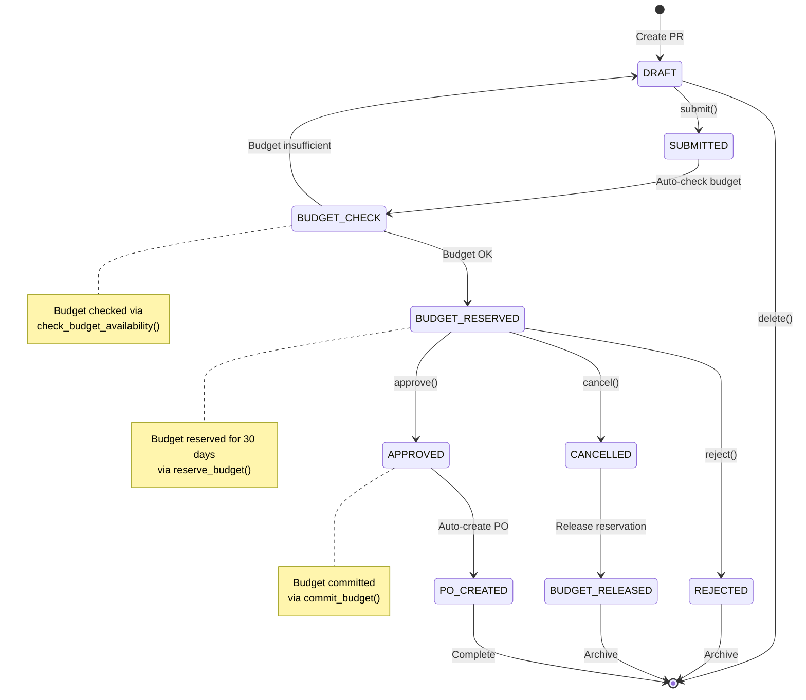
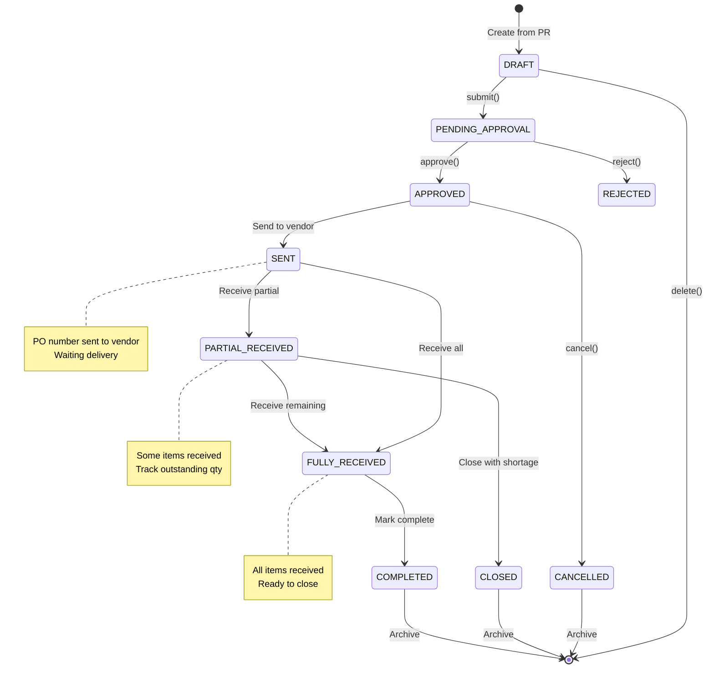
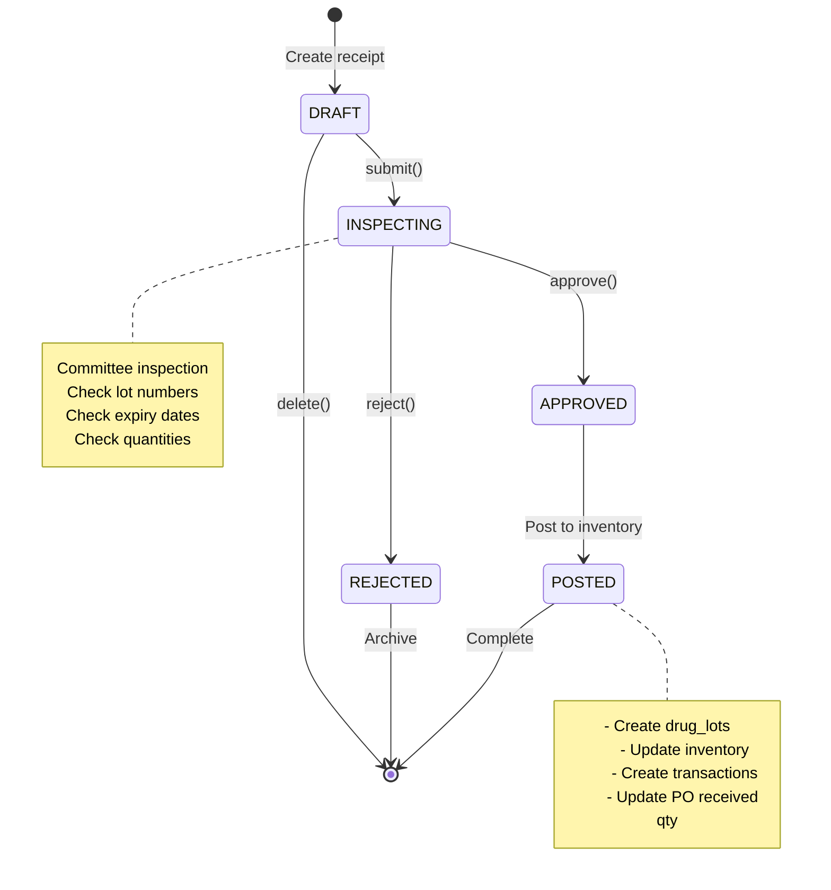

# 🔄 Procurement - State Diagrams

**System:** Procurement Management
**Version:** 2.6.0
**Last Updated:** 2025-01-28

---

## 📋 Overview

This document shows **state machine diagrams** for all procurement workflows - showing how entities transition through different states.

**State diagrams included:**

1. [Purchase Request States](#1-purchase-request-states)
2. [Purchase Order States](#2-purchase-order-states)
3. [Receipt States](#3-receipt-states)
4. [Budget Reservation Lifecycle](#4-budget-reservation-lifecycle)

---

## 1. Purchase Request States

**Entity:** `purchase_requests`
**Status Field:** `status` (enum: `PrStatus`)



### State Descriptions

| State               | Description             | Can Transition To             | Actions              |
| ------------------- | ----------------------- | ----------------------------- | -------------------- |
| **DRAFT**           | Initial state, editable | SUBMITTED, Deleted            | User can edit        |
| **SUBMITTED**       | Submitted for approval  | BUDGET_CHECK                  | Auto budget check    |
| **BUDGET_CHECK**    | Checking budget         | BUDGET_RESERVED, DRAFT        | System checks budget |
| **BUDGET_RESERVED** | Budget reserved         | APPROVED, REJECTED, CANCELLED | Waiting approval     |
| **APPROVED**        | Approved by director    | PO_CREATED                    | Auto-create PO       |
| **REJECTED**        | Rejected                | Archive                       | No further action    |
| **CANCELLED**       | Cancelled by user       | BUDGET_RELEASED               | Release budget       |
| **PO_CREATED**      | PO created              | Complete                      | PR complete          |

---

## 2. Purchase Order States

**Entity:** `purchase_orders`
**Status Field:** `status` (enum: `PoStatus`)



### PO State Descriptions

| State                | Description          | Can Transition To                | Actions                |
| -------------------- | -------------------- | -------------------------------- | ---------------------- |
| **DRAFT**            | Auto-created from PR | PENDING_APPROVAL, Deleted        | Review before approval |
| **PENDING_APPROVAL** | Waiting approval     | APPROVED, REJECTED               | Director approval      |
| **APPROVED**         | Approved PO          | SENT, CANCELLED                  | Budget committed       |
| **SENT**             | Sent to vendor       | PARTIAL_RECEIVED, FULLY_RECEIVED | Waiting delivery       |
| **PARTIAL_RECEIVED** | Partial receipt      | FULLY_RECEIVED, CLOSED           | Track outstanding      |
| **FULLY_RECEIVED**   | All items received   | COMPLETED                        | Ready to close         |
| **COMPLETED**        | PO complete          | Archive                          | Final state            |
| **CANCELLED**        | PO cancelled         | Archive                          | Budget released        |
| **REJECTED**         | PO rejected          | Archive                          | Budget released        |
| **CLOSED**           | Closed with shortage | Archive                          | Final state            |

---

## 3. Receipt States

**Entity:** `receipts`
**Status Field:** `status` (enum: `ReceiptStatus`)



### Receipt State Descriptions

| State          | Description         | Can Transition To   | Actions               |
| -------------- | ------------------- | ------------------- | --------------------- |
| **DRAFT**      | Initial receipt     | INSPECTING, Deleted | Enter lot/expiry info |
| **INSPECTING** | Committee review    | APPROVED, REJECTED  | Quality check         |
| **APPROVED**   | Inspection passed   | POSTED              | Ready to post         |
| **POSTED**     | Posted to inventory | Complete            | Inventory updated     |
| **REJECTED**   | Inspection failed   | Archive             | Contact vendor        |

---

## 4. Budget Reservation Lifecycle

**Entity:** `budget_reservations`
**Status Field:** `status` (enum: `ReservationStatus`)

```mermaid
stateDiagram-v2
    [*] --> ACTIVE: PR submitted & budget reserved

    ACTIVE --> COMMITTED: PR approved → PO created
    ACTIVE --> RELEASED: PR rejected/cancelled
    ACTIVE --> EXPIRED: 30 days passed

    COMMITTED --> [*]: Budget used
    RELEASED --> [*]: Budget returned
    EXPIRED --> [*]: Auto-release budget

    note right of ACTIVE
        Reservation holds budget
        for max 30 days
    end note

    note right of COMMITTED
        Budget moved from
        reserved → spent
    end note

    note right of EXPIRED
        Auto-expire after 30 days
        if PR not approved
    end note
```



### Budget Reservation States

| State         | Description          | Duration    | Actions         |
| ------------- | -------------------- | ----------- | --------------- |
| **ACTIVE**    | Budget reserved      | Max 30 days | Held for PR     |
| **COMMITTED** | Budget committed     | Permanent   | Moved to spent  |
| **RELEASED**  | Reservation released | N/A         | Budget returned |
| **EXPIRED**   | Reservation expired  | N/A         | Auto-release    |

---

## 🔄 Cross-Workflow State Dependencies

### PR → PO → Receipt Flow

```
PR: DRAFT → SUBMITTED → APPROVED → PO_CREATED
                 ↓
PO: DRAFT → APPROVED → SENT → PARTIAL_RECEIVED → FULLY_RECEIVED → COMPLETED
                                        ↓
Receipt: DRAFT → INSPECTING → APPROVED → POSTED
                                           ↓
Inventory: quantity_on_hand updated
          drug_lots created
          inventory_transactions logged
```

### Budget Lifecycle Through Procurement

```
Budget: allocated_amount (Beginning of year)
            ↓
PR submitted → reserve_budget()
            ↓
Budget: reserved_amount += PR.total
            ↓
PR approved → commit_budget()
            ↓
Budget: reserved_amount -= PR.total
        spent_amount += PO.total
            ↓
Budget: available = allocated - reserved - spent
```

---

## 📝 Notes

### State Transition Rules

1. **No Backward Transitions**
   - States only move forward (except cancellation)
   - Cannot revert APPROVED → DRAFT

2. **Atomic State Changes**
   - State changes happen in transactions
   - Includes all related updates (budget, inventory, etc.)

3. **Audit Trail**
   - All state changes logged with:
     - User ID
     - Timestamp
     - Reason (for REJECTED/CANCELLED)

4. **Side Effects**
   - State changes trigger database functions:
     - `reserve_budget()` on PR SUBMITTED
     - `commit_budget()` on PR APPROVED
     - `release_budget()` on PR CANCELLED/REJECTED
     - `update_inventory_from_receipt()` on Receipt POSTED

### Common Patterns

**Happy Path (PR → PO → Receipt):**

```
DRAFT → SUBMITTED → APPROVED → PO_CREATED →
PO:SENT → FULLY_RECEIVED → COMPLETED →
Receipt:POSTED
```

**Cancellation Path:**

```
DRAFT → SUBMITTED → CANCELLED → BUDGET_RELEASED
```

**Rejection Path:**

```
DRAFT → SUBMITTED → REJECTED → Archive
```

---

## 🔗 Related Documentation

- **[README.md](README.md)** - Overview & main sequence diagrams
- **[WORKFLOWS.md](WORKFLOWS.md)** - Detailed workflow descriptions
- **[SCHEMA.md](SCHEMA.md)** - Database schema & tables

---

**Generated**: 2025-01-22
**Author**: Claude Code
**Version**: 2.4.0
