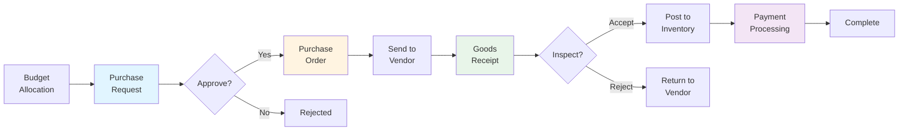

```mermaid
flowchart TD
    Start([Staff Opens PR Form]) --> SelectDept[Select Department]
    SelectDept --> SelectBudget[Select Budget Type]
    SelectBudget --> AddItems[Add Drug Items]

    AddItems --> SelectDrug[Search & Select Drug]
    SelectDrug --> EnterQty[Enter Quantity & Price]
    EnterQty --> AddMore{Add More Items?}
    AddMore -->|Yes| SelectDrug
    AddMore -->|No| CalcTotal[Calculate Total Amount]

    CalcTotal --> CheckBudget[Check Budget Availability]
    CheckBudget --> BudgetOK{Budget Available?}

    BudgetOK -->|No| ShowInsufficient[❌ Insufficient Budget]
    ShowInsufficient --> Options{User Choice}
    Options -->|Reduce Amount| AddItems
    Options -->|Cancel| End1([End])

    BudgetOK -->|Yes| CheckPlan[Check Budget Plan]
    CheckPlan --> InPlan{Drugs in Plan?}
    InPlan -->|No| WarnNotInPlan[⚠️ Warning: Not in plan]
    WarnNotInPlan --> UserDecide{Continue?}
    UserDecide -->|No| End2([Cancel])
    UserDecide -->|Yes| SaveDraft

    InPlan -->|Yes| SaveDraft[Save as DRAFT]
    SaveDraft --> ReserveBudget[Reserve Budget<br/>Expires: 30 days]
    ReserveBudget --> Success[✅ PR Created]

    Success --> NextAction{Next Action?}
    NextAction -->|Submit| SubmitApproval[Submit for Approval<br/>Status: SUBMITTED]
    NextAction -->|Save| End3([End - DRAFT])

    SubmitApproval --> NotifyManager[Notify Manager]
    NotifyManager --> WaitApproval[Wait for Approval]

    WaitApproval --> ManagerAction{Manager Decision}
    ManagerAction -->|Approve| Approved[Status: APPROVED]
    ManagerAction -->|Reject| Rejected[Status: REJECTED]

    Approved --> KeepReservation[Keep Budget Reservation]
    KeepReservation --> ReadyPO[Ready for PO]
    ReadyPO --> End4([End])

    Rejected --> ReleaseBudget[Release Budget Reservation]
    ReleaseBudget --> NotifyStaff[Notify Staff with Reason]
    NotifyStaff --> End5([End])
```

```mermaid
flowchart TD
    Start([Open Approved PR]) --> CheckPR{PR Status?}
    CheckPR -->|Not APPROVED| Error1[❌ Cannot create PO]
    CheckPR -->|APPROVED| SelectVendor[Select Vendor]

    SelectVendor --> CheckContract{Has Contract?}
    CheckContract -->|Yes| LoadContract[Load Contract Items]
    CheckContract -->|No| ManualPrice[Enter Prices Manually]

    LoadContract --> ApplyPrices[Apply Contract Prices]
    ApplyPrices --> ReviewItems[Review Items & Prices]
    ManualPrice --> ReviewItems

    ReviewItems --> EditItems{Edit Items?}
    EditItems -->|Yes| ModifyQty[Modify Qty/Price]
    ModifyQty --> ReviewItems
    EditItems -->|No| EnterTerms[Enter Delivery & Payment Terms]

    EnterTerms --> CalcVAT[Calculate VAT]
    CalcVAT --> CalcGrandTotal[Grand Total = Amount + VAT]

    CalcGrandTotal --> SavePO[Save PO as DRAFT]
    SavePO --> Success[✅ PO Created]

    Success --> NextAction{Next Action?}
    NextAction -->|Submit| SubmitPO[Submit for Approval<br/>Status: PENDING]
    NextAction -->|Save| End1([End - DRAFT])

    SubmitPO --> CheckAmount{Amount > 100k?}
    CheckAmount -->|Yes| RequireDoc[Require Approval Document]
    CheckAmount -->|No| ManagerApprove

    RequireDoc --> UploadDoc[Upload Approval Doc]
    UploadDoc --> ManagerApprove[Manager Approves]

    ManagerApprove --> CommitBudget[Commit Budget]
    CommitBudget --> ReleasReserv[Release Reservation]
    ReleasReserv --> POApproved[Status: APPROVED]

    POApproved --> SendVendor[Send PO to Vendor]
    SendVendor --> POSent[Status: SENT]
    POSent --> End2([End])
```

```mermaid
flowchart TD
    Start([Vendor Delivers Goods]) --> SelectPO[Select PO Number]
    SelectPO --> LoadPO[Load PO Items]
    LoadPO --> CreateReceipt[Create New Receipt]

    CreateReceipt --> EnterDocs[Enter Delivery Note & Invoice]
    EnterDocs --> InspectItems[Inspect Each Item]

    InspectItems --> CheckQty{Quantity Correct?}
    CheckQty -->|No| RecordDiff[Record Difference]
    CheckQty -->|Yes| CheckQuality{Quality OK?}

    RecordDiff --> CheckQuality
    CheckQuality -->|No| RejectQty[Set Rejected Qty + Reason]
    CheckQuality -->|Yes| AcceptQty[Set Accepted Qty]

    RejectQty --> EnterLot[Enter Lot Info]
    AcceptQty --> EnterLot

    EnterLot --> LotNumber[Lot Number]
    LotNumber --> MfgDate[Manufacture Date]
    MfgDate --> ExpDate[Expiry Date]
    ExpDate --> CheckExpiry{Expiry > 6 months?}

    CheckExpiry -->|No| WarnShortExpiry[⚠️ Warning: Short expiry]
    WarnShortExpiry --> Confirm{Accept anyway?}
    Confirm -->|No| RejectQty
    Confirm -->|Yes| MoreItems

    CheckExpiry -->|Yes| MoreItems{More Items?}
    MoreItems -->|Yes| InspectItems
    MoreItems -->|No| AddInspectors[Add Inspectors]

    AddInspectors --> Inspector1[ประธานกรรมการ]
    Inspector1 --> Inspector2[กรรมการ]
    Inspector2 --> Inspector3[เลขานุการ]
    Inspector3 --> CheckMin{>= 3 inspectors?}

    CheckMin -->|No| ErrorInspectors[❌ Need 3+ inspectors]
    ErrorInspectors --> AddInspectors

    CheckMin -->|Yes| SaveReceipt[Save Receipt]
    SaveReceipt --> ReviewReceipt[Review & Confirm]

    ReviewReceipt --> UserAction{Next Action?}
    UserAction -->|Save Draft| End1([End - DRAFT])
    UserAction -->|Post| ValidatePost{All items inspected?}

    ValidatePost -->|No| ErrorNotReady[❌ Cannot post]
    ErrorNotReady --> ReviewReceipt

    ValidatePost -->|Yes| PostReceipt[Post Receipt]
    PostReceipt --> CreateLots[Create Drug Lots]
    CreateLots --> UpdateInventory[Update Inventory]
    UpdateInventory --> UpdatePO[Update PO Status]

    UpdatePO --> Complete[✅ Receipt Complete]
    Complete --> End2([End])
```

```mermaid
flowchart TD
    Start([Finance Opens Payment]) --> ListReceipts[List Posted Receipts<br/>Status: POSTED]
    ListReceipts --> SelectReceipt[Select Receipt to Pay]

    SelectReceipt --> LoadAmount[Load Receipt Amount]
    LoadAmount --> EnterPayment[Enter Payment Details]

    EnterPayment --> PayDate[Payment Date]
    PayDate --> PayMethod[Payment Method]
    PayMethod --> PaymentType{Payment Type?}

    PaymentType -->|Cheque| ChequeNum[Enter Cheque Number]
    PaymentType -->|Transfer| TransferRef[Enter Transfer Reference]
    PaymentType -->|Cash| NoRef[No Reference]

    ChequeNum --> UploadEvidence
    TransferRef --> UploadEvidence
    NoRef --> UploadEvidence[Upload Evidence]

    UploadEvidence --> Attach1[Attach Invoice Copy]
    Attach1 --> Attach2[Attach Receipt Copy]
    Attach2 --> Attach3[Attach Payment Slip]
    Attach3 --> CheckAttach{>= 1 attachment?}

    CheckAttach -->|No| ErrorNoAttach[❌ Need evidence]
    ErrorNoAttach --> UploadEvidence

    CheckAttach -->|Yes| ReviewPayment[Review Payment]
    ReviewPayment --> ConfirmPay{Confirm?}

    ConfirmPay -->|No| End1([Cancel])
    ConfirmPay -->|Yes| ProcessPayment[Process Payment]

    ProcessPayment --> SavePayment[Save Payment Record]
    SavePayment --> UpdateReceipt[Update Receipt: PAID]
    UpdateReceipt --> NotifyAccounting[Notify Accounting]
    NotifyAccounting --> Complete[✅ Payment Complete]
    Complete --> End2([End])
```

# 🛒 Procurement - Business Workflows

**System:** Procurement Management
**Version:** 2.6.0
**Last Updated:** 2025-01-28

---

## 📖 Table of Contents

### Core Workflows

1. [Purchase Request (PR)](#workflow-1-purchase-request-pr) - สร้างและอนุมัติใบขอซื้อ
2. [Purchase Order (PO)](#workflow-2-purchase-order-po) - สร้างและส่งใบสั่งซื้อ
3. [Goods Receipt (GR)](#workflow-3-goods-receipt-gr) - รับและตรวจสอบของ
4. [Payment Processing](#workflow-4-payment-processing) - จ่ายเงินผู้ขาย

### Additional Information

- [Complete Procurement Cycle](#complete-procurement-cycle)
- [API Summary](#api-summary)
- [Business Rules](#business-rules)
- [Error Handling](#error-handling)

---

## Complete Procurement Cycle

### End-to-End Flow



### Timeline Example

```
Day 1:  Create PR → Submit for Approval
Day 2:  Manager Approves PR
Day 3:  Create PO → Send to Vendor
Day 10: Vendor Delivers → Create Receipt
Day 11: Inspect & Accept → Post to Inventory
Day 40: Payment (NET30 terms)
```

---

## Workflow 1: Purchase Request (PR)

### 🎯 User Story

> **As a** department staff
> **I want to** create purchase request for drugs
> **So that** I can get approval to buy necessary items

**Acceptance Criteria:**

- ✅ Can select drugs from master data
- ✅ System checks budget availability
- ✅ System reserves budget when PR created
- ✅ Can submit for approval
- ✅ Can track approval status
- ✅ Budget released if rejected

---

### 📊 Process Flow



---

### 📝 Step-by-Step: Create Purchase Request

#### Step 1: Initialize PR

**User Input:**

```typescript
{
  department_id: 2,        // Pharmacy
  budget_id: 1,            // OP001 - ยาและเวชภัณฑ์
  fiscal_year: 2025,
  request_date: "2025-04-15",
  required_date: "2025-05-01",
  purpose: "ซื้อยาประจำเดือนพฤษภาคม ตามแผนงบประมาณ"
}
```

#### Step 2: Add Items to PR

**Search and Add Drug:**

```typescript
// Search "Paracetamol"
const drugs = await prisma.drugGeneric.findMany({
  where: {
    OR: [{ working_code: { contains: search } }, { generic_name: { contains: search } }],
    is_active: true,
  },
});

// Add item
const item = {
  generic_id: 101,
  quantity: 5000,
  unit: 'TAB',
  estimated_unit_price: 2.5,
  estimated_total: 12500.0,
  specification: 'ยี่ห้อที่กระทรวงรับรอง',
};
```

**Add Multiple Items:**

```typescript
const items = [
  {
    generic_id: 101, // Paracetamol
    quantity: 5000,
    unit: 'TAB',
    estimated_unit_price: 2.5,
    estimated_total: 12500.0,
  },
  {
    generic_id: 102, // Ibuprofen
    quantity: 3000,
    unit: 'TAB',
    estimated_unit_price: 3.0,
    estimated_total: 9000.0,
  },
];

const total_amount = items.reduce((sum, item) => sum + item.estimated_total, 0);
// = 21,500.00
```

#### Step 3: Check Budget Availability

**API Call:**

```typescript
const quarter = Math.ceil(new Date('2025-04-15').getMonth() / 3); // Q2

const budgetCheck = await prisma.$queryRaw`
  SELECT * FROM check_budget_availability(
    2025::INT,
    1::BIGINT,
    2::BIGINT,
    21500.00,
    ${quarter}::INT
  )
`;

if (!budgetCheck.available) {
  return error({
    message: 'Insufficient budget',
    available: budgetCheck.remaining,
    requested: 21500.0,
    shortage: 21500.0 - budgetCheck.remaining,
  });
}
```

#### Step 4: Check Budget Plan (Optional Warning)

```typescript
for (const item of items) {
  const planCheck = await prisma.$queryRaw`
    SELECT * FROM check_drug_in_budget_plan(
      2025::INT,
      2::BIGINT,
      ${item.generic_id}::BIGINT,
      ${item.quantity},
      ${quarter}::INT
    )
  `;

  if (!planCheck.in_plan) {
    warnings.push({
      drug: item.generic_name,
      message: 'Not in budget plan',
    });
  }
}

// Show warnings but allow to continue
```

#### Step 5: Save PR and Reserve Budget

```typescript
await prisma.$transaction(async (tx) => {
  // 1. Create PR
  const pr = await tx.purchaseRequest.create({
    data: {
      pr_number: generatePRNumber(), // "PR-2025-04-001"
      department_id: 2,
      budget_id: 1,
      fiscal_year: 2025,
      request_date: '2025-04-15',
      required_date: '2025-05-01',
      requested_by: currentUserId,
      total_amount: 21500.0,
      status: 'DRAFT',
      priority: 'NORMAL',
      purpose: 'ซื้อยาประจำเดือนพฤษภาคม',
    },
  });

  // 2. Create PR items
  await tx.purchaseRequestItem.createMany({
    data: items.map((item) => ({
      pr_id: pr.id,
      ...item,
    })),
  });

  // 3. Reserve budget
  const allocation = await tx.budgetAllocation.findFirst({
    where: {
      fiscal_year: 2025,
      budget_id: 1,
      department_id: 2,
    },
  });

  const reservation = await tx.budgetReservation.create({
    data: {
      allocation_id: allocation.id,
      pr_id: pr.id,
      reserved_amount: 21500.0,
      quarter: quarter,
      reservation_date: new Date(),
      expires_date: new Date(Date.now() + 30 * 24 * 60 * 60 * 1000),
      is_released: false,
    },
  });

  return { pr, reservation };
});
```

#### Step 6: Submit for Approval

```typescript
// Update PR status
await prisma.purchaseRequest.update({
  where: { id: pr.id },
  data: {
    status: 'SUBMITTED',
    updated_at: new Date(),
  },
});

// Notify manager
await sendNotification({
  to: managerId,
  subject: 'New PR Pending Approval',
  message: `PR ${pr.pr_number} from ${dept.name} (${pr.total_amount} บาท)`,
  link: `/procurement/pr/${pr.id}`,
});
```

#### Step 7: Manager Approval

**Approve:**

```typescript
await prisma.purchaseRequest.update({
  where: { id: pr.id },
  data: {
    status: 'APPROVED',
    approved_by: managerId,
    approved_at: new Date(),
  },
});

// Notify staff
await sendNotification({
  to: pr.requested_by,
  subject: 'PR Approved',
  message: `Your PR ${pr.pr_number} has been approved`,
});
```

**Reject:**

```typescript
await prisma.$transaction(async (tx) => {
  // 1. Update PR
  await tx.purchaseRequest.update({
    where: { id: pr.id },
    data: {
      status: 'REJECTED',
      rejected_by: managerId,
      rejected_at: new Date(),
      rejection_reason: 'งบประมาณไม่เพียงพอสำหรับไตรมาสนี้',
    },
  });

  // 2. Release budget reservation
  await tx.budgetReservation.updateMany({
    where: { pr_id: pr.id },
    data: {
      is_released: true,
      released_at: new Date(),
    },
  });
});

// Notify staff
await sendNotification({
  to: pr.requested_by,
  subject: 'PR Rejected',
  message: `Your PR ${pr.pr_number} was rejected: ${rejection_reason}`,
});
```

---

## Workflow 2: Purchase Order (PO)

### 🎯 User Story

> **As a** procurement officer
> **I want to** create purchase order from approved PR
> **So that** I can send order to vendor

**Acceptance Criteria:**

- ✅ Can only create PO from approved PR
- ✅ Can select vendor and contract
- ✅ System applies contract prices (if available)
- ✅ Can add VAT calculation
- ✅ PO requires approval before sending
- ✅ Budget committed when PO approved

---

### 📊 Process Flow



---

### 📝 Step-by-Step: Create Purchase Order

#### Step 1: Load Approved PR

```typescript
const pr = await prisma.purchaseRequest.findUnique({
  where: { id: prId },
  include: {
    items: {
      include: {
        generic: true,
      },
    },
    department: true,
    budget: true,
  },
});

if (pr.status !== 'APPROVED') {
  throw new Error('Can only create PO from approved PR');
}
```

#### Step 2: Select Vendor and Contract

```typescript
// List vendors who can supply these drugs
const vendors = await prisma.company.findMany({
  where: {
    is_vendor: true,
    is_active: true,
    // Has contract for these drugs
    contracts: {
      some: {
        status: 'ACTIVE',
        contract_items: {
          some: {
            generic_id: {
              in: pr.items.map((item) => item.generic_id),
            },
          },
        },
      },
    },
  },
});

// Select vendor
const selectedVendor = vendors[0];

// Get active contract
const contract = await prisma.contract.findFirst({
  where: {
    vendor_id: selectedVendor.id,
    status: 'ACTIVE',
    start_date: { lte: new Date() },
    end_date: { gte: new Date() },
  },
  include: {
    contract_items: true,
  },
});
```

#### Step 3: Apply Contract Prices

```typescript
const poItems = pr.items.map((prItem) => {
  // Find contract price
  const contractItem = contract?.contract_items.find((ci) => ci.generic_id === prItem.generic_id);

  const unit_price = contractItem?.agreed_unit_price || prItem.estimated_unit_price;
  const total_price = prItem.quantity * unit_price;

  return {
    pr_item_id: prItem.id,
    generic_id: prItem.generic_id,
    quantity: prItem.quantity,
    unit: prItem.unit,
    unit_price: unit_price,
    discount_percent: 0,
    discount_amount: 0,
    total_price: total_price,
  };
});

const total_amount = poItems.reduce((sum, item) => sum + item.total_price, 0);
```

#### Step 4: Calculate VAT and Grand Total

```typescript
const VAT_RATE = 0.07; // 7%

const vat_amount = total_amount * VAT_RATE;
const grand_total = total_amount + vat_amount;
```

#### Step 5: Create PO

```typescript
await prisma.$transaction(async (tx) => {
  // 1. Create PO
  const po = await tx.purchaseOrder.create({
    data: {
      po_number: generatePONumber(), // "PO-2025-04-002"
      pr_id: pr.id,
      vendor_id: selectedVendor.id,
      contract_id: contract?.id,
      po_date: new Date(),
      delivery_date: new Date(Date.now() + 14 * 24 * 60 * 60 * 1000), // +14 days
      total_amount: total_amount,
      vat_amount: vat_amount,
      grand_total: grand_total,
      status: 'DRAFT',
      payment_terms: 'NET30',
      shipping_address: 'คลังยาโรงพยาบาน...',
      created_by: currentUserId,
    },
  });

  // 2. Create PO items
  await tx.purchaseOrderItem.createMany({
    data: poItems.map((item) => ({
      po_id: po.id,
      ...item,
    })),
  });

  return po;
});
```

#### Step 6: Submit for Approval

```typescript
await prisma.purchaseOrder.update({
  where: { id: po.id },
  data: {
    status: 'PENDING',
  },
});

// If amount > 100,000 → require approval document
if (po.grand_total > 100000) {
  return {
    message: 'PO requires approval document (amount > 100,000)',
    requires_document: true,
  };
}
```

#### Step 7: PO Approval

```typescript
await prisma.$transaction(async (tx) => {
  // 1. Approve PO
  await tx.purchaseOrder.update({
    where: { id: po.id },
    data: {
      status: 'APPROVED',
      approved_by: managerId,
      approved_at: new Date(),
    },
  });

  // 2. Commit budget (from Budget Management function)
  const quarter = Math.ceil((new Date().getMonth() + 1) / 3);
  await tx.$executeRaw`
    SELECT commit_budget(
      ${allocation.id}::BIGINT,
      ${po.id}::BIGINT,
      ${po.grand_total},
      ${quarter}::INT
    )
  `;

  // 3. Release budget reservation
  await tx.budgetReservation.updateMany({
    where: { pr_id: po.pr_id },
    data: {
      is_released: true,
      released_at: new Date(),
    },
  });

  // 4. Update PR status
  await tx.purchaseRequest.update({
    where: { id: po.pr_id },
    data: { status: 'CONVERTED' },
  });
});
```

#### Step 8: Send to Vendor

```typescript
await prisma.purchaseOrder.update({
  where: { id: po.id },
  data: {
    status: 'SENT',
  },
});

// Generate PO PDF and send email to vendor
await sendPOToVendor(po);
```

---

## Workflow 3: Goods Receipt (GR)

### 🎯 User Story

> **As a** warehouse staff
> **I want to** receive and inspect goods from vendor
> **So that** I can accept quality items and update inventory

**Acceptance Criteria:**

- ✅ Can receive partial deliveries
- ✅ Can inspect and accept/reject items
- ✅ Must record lot number and expiry date
- ✅ Requires inspector committee (3+ members)
- ✅ Posted receipts create drug lots automatically
- ✅ Posted receipts update inventory

---

### 📊 Process Flow



---

### 📝 Step-by-Step: Goods Receipt

#### Step 1: Create Receipt from PO

```typescript
const po = await prisma.purchaseOrder.findUnique({
  where: { po_number: 'PO-2025-04-002' },
  include: {
    items: {
      include: {
        generic: true,
      },
    },
    vendor: true,
  },
});

if (po.status !== 'SENT') {
  throw new Error('Can only receive from SENT PO');
}
```

#### Step 2: Enter Receipt Header

```typescript
const receipt = await prisma.receipt.create({
  data: {
    receipt_number: generateReceiptNumber(), // "GR-2025-04-010"
    po_id: po.id,
    location_id: 1, // Main Warehouse
    receipt_date: new Date(),
    delivery_note_number: 'DN-12345',
    invoice_number: 'INV-2025-0100',
    invoice_date: '2025-04-20',
    status: 'DRAFT',
    received_by: currentUserId,
  },
});
```

#### Step 3: Inspect and Record Items

```typescript
// For each PO item
for (const poItem of po.items) {
  const inspection = {
    quantity_ordered: poItem.quantity,
    quantity_received: 5000, // Actual received
    quantity_accepted: 4950, // Accepted (good quality)
    quantity_rejected: 50, // Rejected (damaged)
    rejection_reason: 'บรรจุภัณฑ์เสียหาย 50 เม็ด',
  };

  // Enter lot information
  const lotInfo = {
    lot_number: 'LOT-2025-A123',
    manufacture_date: '2024-12-01',
    expiry_date: '2027-11-30', // 3 years shelf life
  };

  // Check expiry warning
  const monthsUntilExpiry = getMonthsDiff(new Date(), lotInfo.expiry_date);
  if (monthsUntilExpiry < 6) {
    warnings.push({
      item: poItem.generic.generic_name,
      message: `Short expiry: ${monthsUntilExpiry} months remaining`,
      expiry_date: lotInfo.expiry_date,
    });
  }

  // Create receipt item
  await prisma.receiptItem.create({
    data: {
      receipt_id: receipt.id,
      po_item_id: poItem.id,
      generic_id: poItem.generic_id,
      ...inspection,
      unit_price: poItem.unit_price,
      total_price: inspection.quantity_accepted * poItem.unit_price,
      ...lotInfo,
    },
  });
}
```

#### Step 4: Add Inspectors (Committee)

```typescript
const inspectors = [
  {
    receipt_id: receipt.id,
    inspector_id: 10,
    inspector_role: 'ประธานกรรมการ',
    inspected_at: new Date(),
  },
  {
    receipt_id: receipt.id,
    inspector_id: 11,
    inspector_role: 'กรรมการ',
    inspected_at: new Date(),
  },
  {
    receipt_id: receipt.id,
    inspector_id: 12,
    inspector_role: 'เลขานุการ',
    inspected_at: new Date(),
  },
];

await prisma.receiptInspector.createMany({
  data: inspectors,
});

// Update receipt
await prisma.receipt.update({
  where: { id: receipt.id },
  data: {
    inspected_by: 10, // ประธาน
    inspected_at: new Date(),
  },
});
```

#### Step 5: Post Receipt

```typescript
await prisma.$transaction(async (tx) => {
  // 1. Update receipt status
  await tx.receipt.update({
    where: { id: receipt.id },
    data: {
      status: 'POSTED',
    },
  });

  // 2. Create drug lots
  const receiptItems = await tx.receiptItem.findMany({
    where: { receipt_id: receipt.id },
    include: { generic: true },
  });

  for (const item of receiptItems) {
    if (item.quantity_accepted > 0) {
      await tx.drugLot.create({
        data: {
          lot_number: item.lot_number,
          drug_id: item.generic.drugs[0].id, // Get first trade drug
          location_id: receipt.location_id,
          quantity: item.quantity_accepted,
          quantity_remaining: item.quantity_accepted,
          unit_cost: item.unit_price,
          manufacture_date: item.manufacture_date,
          expiry_date: item.expiry_date,
          received_date: receipt.receipt_date,
          receipt_id: receipt.id,
        },
      });
    }
  }

  // 3. Update inventory
  for (const item of receiptItems) {
    if (item.quantity_accepted > 0) {
      // Upsert inventory
      await tx.inventory.upsert({
        where: {
          drug_id_location_id: {
            drug_id: item.generic.drugs[0].id,
            location_id: receipt.location_id,
          },
        },
        create: {
          drug_id: item.generic.drugs[0].id,
          location_id: receipt.location_id,
          quantity_on_hand: item.quantity_accepted,
          unit_cost: item.unit_price,
          last_updated: new Date(),
        },
        update: {
          quantity_on_hand: {
            increment: item.quantity_accepted,
          },
          last_updated: new Date(),
        },
      });

      // Create transaction
      await tx.inventoryTransaction.create({
        data: {
          drug_id: item.generic.drugs[0].id,
          location_id: receipt.location_id,
          transaction_type: 'RECEIVE',
          quantity: item.quantity_accepted,
          unit_cost: item.unit_price,
          reference_type: 'RECEIPT',
          reference_id: receipt.id,
          transaction_date: receipt.receipt_date,
          performed_by: receipt.received_by,
        },
      });
    }
  }

  // 4. Update PO status
  const allReceived = await checkIfPOCompletelyReceived(po.id);
  await tx.purchaseOrder.update({
    where: { id: po.id },
    data: {
      status: allReceived ? 'COMPLETED' : 'PARTIAL',
    },
  });
});
```

---

## Workflow 4: Payment Processing

### 🎯 User Story

> **As a** finance officer
> **I want to** process payment to vendor
> **So that** we can fulfill payment obligations

**Acceptance Criteria:**

- ✅ Can only pay for posted receipts
- ✅ Payment amount matches receipt amount
- ✅ Must attach payment evidence
- ✅ Supports multiple payment methods
- ✅ Records payment reference number

---

### 📊 Process Flow



---

### 📝 Step-by-Step: Payment Processing

#### Step 1: Select Receipt to Pay

```typescript
const postedReceipts = await prisma.receipt.findMany({
  where: {
    status: 'POSTED',
    // Not yet paid
    payment_documents: {
      none: {},
    },
  },
  include: {
    purchaseOrder: {
      include: {
        vendor: true,
      },
    },
  },
  orderBy: {
    receipt_date: 'asc',
  },
});
```

#### Step 2: Create Payment Document

```typescript
const payment = await prisma.paymentDocument.create({
  data: {
    receipt_id: receipt.id,
    payment_number: generatePaymentNumber(), // "PAY-2025-04-050"
    payment_date: new Date(),
    payment_amount: receipt.total_amount,
    payment_method: 'TRANSFER',
    reference_number: 'TRF-20250420-001',
    notes: 'ชำระเงินตามใบสั่งซื้อ PO-2025-04-002',
    paid_by: currentUserId,
    paid_at: new Date(),
  },
});
```

#### Step 3: Attach Evidence Files

```typescript
const attachments = [
  {
    payment_id: payment.id,
    file_name: 'invoice_INV-2025-0100.pdf',
    file_path: '/uploads/payments/2025/04/invoice_001.pdf',
    file_type: 'application/pdf',
    file_size: 245678,
    description: 'ใบแจ้งหนี้จากผู้ขาย',
  },
  {
    payment_id: payment.id,
    file_name: 'transfer_slip.jpg',
    file_path: '/uploads/payments/2025/04/slip_001.jpg',
    file_type: 'image/jpeg',
    file_size: 128456,
    description: 'หลักฐานการโอนเงิน',
  },
];

await prisma.paymentAttachment.createMany({
  data: attachments,
});
```

#### Step 4: Complete Payment

```typescript
await prisma.$transaction(async (tx) => {
  // 1. Payment already created above

  // 2. Update receipt
  await tx.receipt.update({
    where: { id: receipt.id },
    data: {
      status: 'ACCEPTED', // or create new status 'PAID'
    },
  });

  // 3. Notify accounting
  await sendNotification({
    to: accountingDeptId,
    subject: 'Payment Completed',
    message: `Payment ${payment.payment_number} completed for ${receipt.receipt_number}`,
    amount: payment.payment_amount,
  });
});
```

---

## API Summary

### Purchase Requests

```typescript
GET    /api/procurement/pr                    // List PRs
POST   /api/procurement/pr                    // Create PR
GET    /api/procurement/pr/:id                // Get PR details
PUT    /api/procurement/pr/:id                // Update PR
DELETE /api/procurement/pr/:id                // Cancel PR

POST   /api/procurement/pr/:id/submit        // Submit for approval
POST   /api/procurement/pr/:id/approve       // Approve PR
POST   /api/procurement/pr/:id/reject        // Reject PR
```

### Purchase Orders

```typescript
GET    /api/procurement/po                    // List POs
POST   /api/procurement/po                    // Create PO from PR
GET    /api/procurement/po/:id                // Get PO details
PUT    /api/procurement/po/:id                // Update PO

POST   /api/procurement/po/:id/approve       // Approve PO
POST   /api/procurement/po/:id/send          // Send to vendor
POST   /api/procurement/po/:id/cancel        // Cancel PO
```

### Receipts

```typescript
GET    /api/procurement/receipt               // List receipts
POST   /api/procurement/receipt               // Create receipt
GET    /api/procurement/receipt/:id           // Get receipt details
PUT    /api/procurement/receipt/:id           // Update receipt

POST   /api/procurement/receipt/:id/post     // Post to inventory
GET    /api/procurement/receipt/:id/lots     // Get created lots
```

### Payments

```typescript
GET    /api/procurement/payment               // List payments
POST   /api/procurement/payment               // Create payment
GET    /api/procurement/payment/:id           // Get payment details

POST   /api/procurement/payment/:id/attach   // Upload attachment
GET    /api/procurement/payment/:id/attachments // List attachments
```

---

## Business Rules

### Purchase Request

1. ต้องเช็คงบประมาณก่อนสร้าง
2. ต้อง reserve งบทันทีที่สร้าง
3. Reservation expire ใน 30 วัน
4. PR ที่ reject ต้อง release งบทันที
5. ยาควรอยู่ใน budget plan (warning)

### Purchase Order

1. สร้างได้จาก PR ที่ approved เท่านั้น
2. ใช้ราคาตามสัญญา (ถ้ามี)
3. PO > 100,000 ต้องมี approval document
4. ต้องส่งให้ผู้ขายภายใน 3 วัน
5. Commit งบเมื่อ PO approved

### Receipts

1. รับได้ไม่เกิน PO quantity
2. ต้องมีกรรมการตรวจรับ >= 3 คน
3. ต้องบันทึก lot number และ expiry date
4. ของที่ reject ต้องระบุเหตุผล
5. Post แล้วต้องสร้าง drug_lots

### Payments

1. จ่ายได้เมื่อ receipt posted แล้ว
2. จำนวนเงินต้องตรงกับ receipt
3. ต้องแนบหลักฐานการจ่ายเงิน
4. ปฏิบัติตาม payment terms (NET30, etc.)

---

## Error Handling

### Common Errors

| Error Code                 | Scenario                         | Message                        | Action                       |
| -------------------------- | -------------------------------- | ------------------------------ | ---------------------------- |
| `INSUFFICIENT_BUDGET`      | งบไม่พอ                          | "Insufficient budget"          | ลดจำนวน หรือ ขออนุมัติพิเศษ  |
| `PR_NOT_APPROVED`          | สร้าง PO จาก PR ที่ยังไม่อนุมัติ | "PR not approved"              | รออนุมัติ PR ก่อน            |
| `CONTRACT_EXPIRED`         | สัญญาหมดอายุ                     | "Contract expired"             | ใช้ราคาตลาด หรือ ทำสัญญาใหม่ |
| `EXCEED_PO_QUANTITY`       | รับของเกิน PO                    | "Received quantity exceeds PO" | ตรวจสอบความถูกต้อง           |
| `SHORT_EXPIRY`             | ยาใกล้หมดอายุ                    | "Expiry < 6 months"            | ตัดสินใจรับหรือไม่รับ        |
| `INSUFFICIENT_INSPECTORS`  | กรรมการไม่ครบ                    | "Need 3+ inspectors"           | เพิ่มกรรมการ                 |
| `RECEIPT_NOT_POSTED`       | จ่ายเงินก่อน post                | "Receipt not posted"           | Post receipt ก่อน            |
| `MISSING_PAYMENT_EVIDENCE` | ไม่มีหลักฐาน                     | "No payment evidence"          | แนบหลักฐาน                   |

---

**Related Documentation:**

- [README.md](README.md) - System overview
- [SCHEMA.md](SCHEMA.md) - Database schema (12 tables)
- [../../END_TO_END_WORKFLOWS.md](../../END_TO_END_WORKFLOWS.md) - Cross-system workflows

**Last Updated:** 2025-01-28 | **Version:** 2.6.0

---

## 🔄 Sequence Diagram: Purchase Request → PO → Receipt

```mermaid
sequenceDiagram
    actor User as Pharmacist
    participant UI as Frontend
    participant API as Procurement API
    participant BudgetAPI as Budget API
    participant DB as Database

    %% Create PR
    User->>UI: Create Purchase Request
    UI->>API: GET /api/generics
    API->>DB: SELECT * FROM drug_generics
    DB-->>API: Generics list
    API-->>UI: Generics data

    User->>UI: Add items & submit PR
    UI->>BudgetAPI: POST /budget/check-availability
    BudgetAPI->>DB: check_budget_availability()
    DB-->>BudgetAPI: Budget available ✓
    BudgetAPI-->>UI: Budget check passed

    UI->>API: POST /api/purchase-requests
    API->>DB: INSERT INTO purchase_requests
    DB-->>API: PR created (PR-2025-125)
    API->>BudgetAPI: POST /budget/reserve
    BudgetAPI->>DB: reserve_budget()
    DB-->>BudgetAPI: Budget reserved
    API-->>UI: PR created successfully
    UI-->>User: Show success

    %% Approve PR
    User->>UI: Approve PR
    UI->>API: POST /api/purchase-requests/:id/approve
    API->>DB: UPDATE purchase_requests SET status='APPROVED'
    DB-->>API: PR approved
    API-->>UI: Approval successful

    %% Create PO
    User->>UI: Create PO from PR
    UI->>API: POST /api/purchase-orders
    API->>DB: INSERT INTO purchase_orders
    DB-->>API: PO created (PO-2025-046)
    API->>BudgetAPI: POST /budget/commit
    BudgetAPI->>DB: commit_budget()
    DB-->>BudgetAPI: Budget committed
    API-->>UI: PO created

    %% Goods Receipt
    User->>UI: Record receipt
    UI->>API: POST /api/receipts
    API->>DB: INSERT INTO receipts
    DB-->>API: Receipt created
    API->>DB: INSERT INTO drug_lots (lot, expiry)
    DB-->>API: Lots created
    API->>DB: update_inventory_from_receipt()
    DB-->>API: Inventory updated
    API-->>UI: Receipt posted
    UI-->>User: Receipt complete
```


