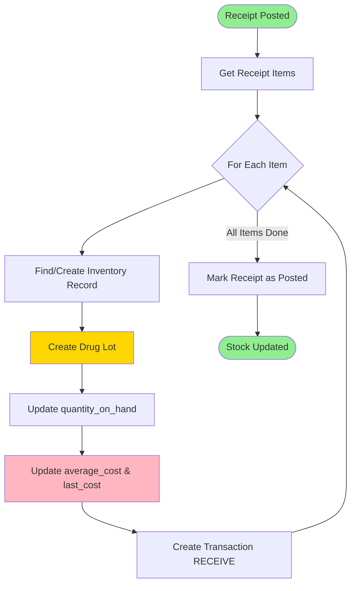
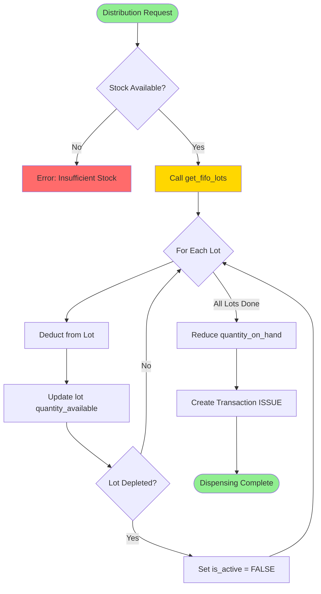
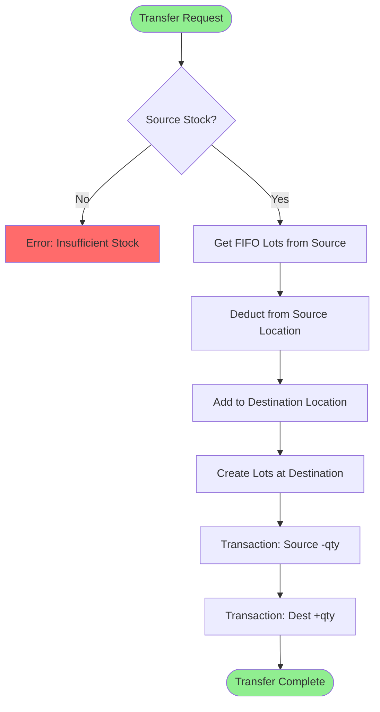
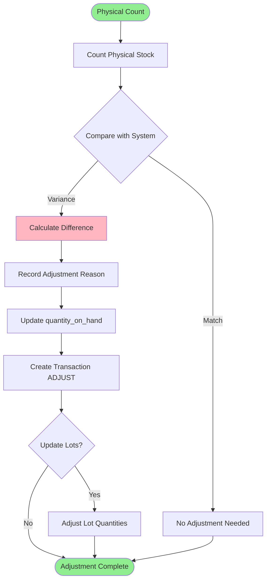
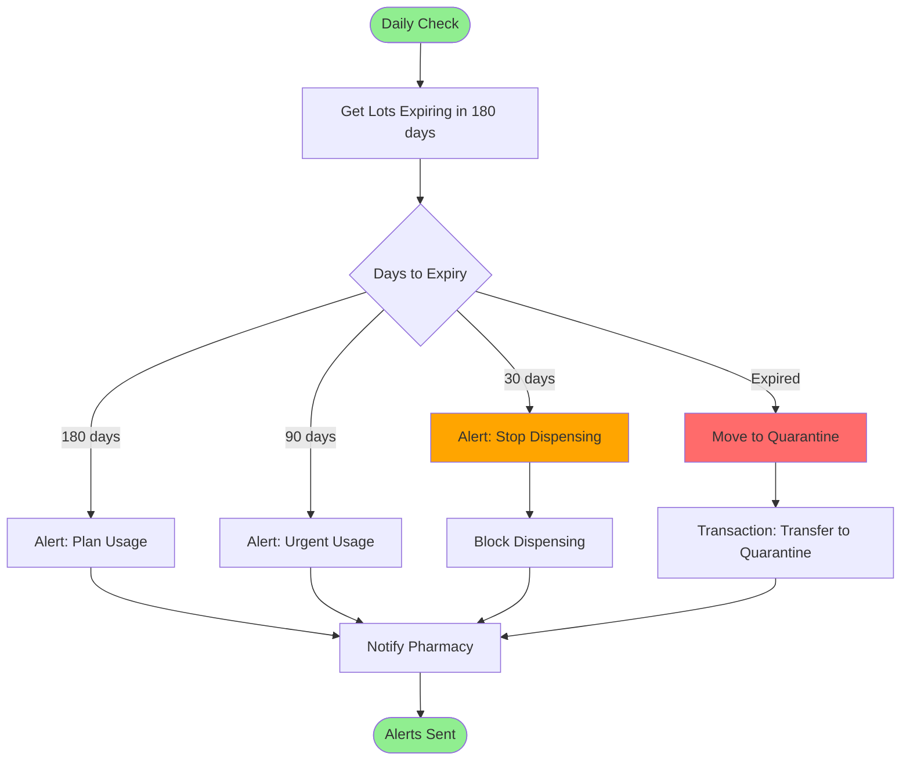
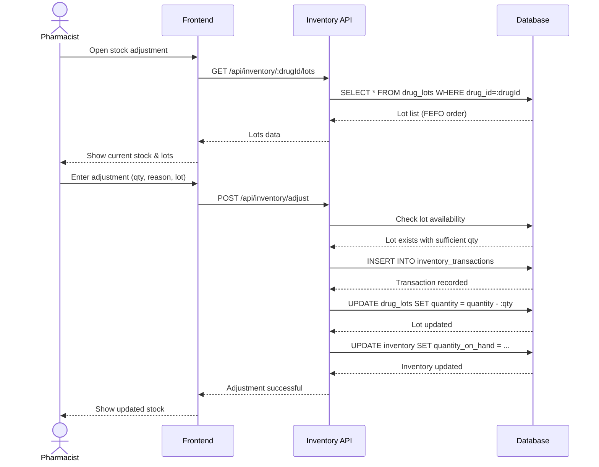

# 📦 Inventory - Business Workflows

**System:** Inventory Management
**Workflows:** 5 major processes
**Version:** 2.6.0
**Last Updated:** 2025-01-28

---

## 📖 Table of Contents

### Core Workflows

1. [Stock Receipt from Procurement](#1-stock-receipt-from-procurement) - รับเข้าจาก Procurement
2. [FIFO/FEFO Dispensing](#2-fifofefo-dispensing) - เบิกออกแบบ FIFO/FEFO
3. [Stock Transfer](#3-stock-transfer) - โอนระหว่าง location
4. [Stock Adjustment](#4-stock-adjustment) - ปรับปรุงสต็อก
5. [Expiry Management](#5-expiry-management) - จัดการยาหมดอายุ

### Reference

- [API Summary](#-api-summary)
- [Business Rules](#-business-rules)
- [Error Handling](#-error-handling)

---

## 1. Stock Receipt from Procurement

**Trigger:** Procurement posts receipt (GR) to inventory

### Workflow Diagram



### Step-by-Step Process

#### Step 1: Receipt is Posted

User posts receipt in Procurement system:

```typescript
// In Procurement: Post receipt
const receipt = await prisma.receipt.update({
  where: { id: receiptId },
  data: {
    status: 'POSTED',
    posted_at: new Date(),
    posted_by: userId,
  },
});

// Trigger inventory update
const result = await prisma.$queryRaw`
  SELECT update_inventory_from_receipt(${receiptId})
`;
```

#### Step 2: Process Each Receipt Item

```typescript
// Function: update_inventory_from_receipt()
async function updateInventoryFromReceipt(receiptId: bigint) {
  return await prisma.$transaction(async (tx) => {
    // 1. Get receipt with items
    const receipt = await tx.receipt.findUnique({
      where: { id: receiptId },
      include: {
        items: true,
        location: true,
      },
    });

    // 2. Process each item
    for (const item of receipt.items) {
      // 3. Find or create inventory record
      let inventory = await tx.inventory.findUnique({
        where: {
          drug_id_location_id: {
            drug_id: item.drug_id,
            location_id: receipt.location_id,
          },
        },
      });

      if (!inventory) {
        inventory = await tx.inventory.create({
          data: {
            drug_id: item.drug_id,
            location_id: receipt.location_id,
            quantity_on_hand: 0,
            average_cost: 0,
            last_cost: 0,
          },
        });
      }

      // 4. Create drug lot
      const drugLot = await tx.drugLot.create({
        data: {
          drug_id: item.drug_id,
          location_id: receipt.location_id,
          lot_number: item.lot_number,
          expiry_date: item.expiry_date,
          quantity_available: item.received_quantity,
          unit_cost: item.unit_price,
          received_date: receipt.receipt_date,
          receipt_id: receipt.id,
          is_active: true,
        },
      });

      // 5. Calculate new average cost
      const oldQty = inventory.quantity_on_hand;
      const oldCost = inventory.average_cost;
      const newQty = item.received_quantity;
      const newCost = item.unit_price;

      const totalQty = oldQty + newQty;
      const newAvgCost = totalQty > 0 ? (oldQty * oldCost + newQty * newCost) / totalQty : newCost;

      // 6. Update inventory
      await tx.inventory.update({
        where: { id: inventory.id },
        data: {
          quantity_on_hand: { increment: newQty },
          average_cost: newAvgCost,
          last_cost: newCost,
          last_updated: new Date(),
        },
      });

      // 7. Create transaction record
      await tx.inventoryTransaction.create({
        data: {
          inventory_id: inventory.id,
          transaction_type: 'RECEIVE',
          quantity: newQty,
          unit_cost: newCost,
          reference_id: receipt.id,
          reference_type: 'receipt',
          notes: `Received from ${receipt.company.company_name}, Lot: ${item.lot_number}`,
          created_by: receipt.posted_by,
        },
      });
    }

    return true;
  });
}
```

---

## 2. FIFO/FEFO Dispensing

**Trigger:** Distribution request to department

### FIFO (First In First Out)



### FEFO (First Expire First Out)

**Same as FIFO but uses `get_fefo_lots()` instead - dispenses lots expiring soonest first**

### Implementation

#### Step 1: Check Stock Availability

```typescript
// Check if enough stock exists
const inventory = await prisma.inventory.findUnique({
  where: {
    drug_id_location_id: {
      drug_id: requestedDrugId,
      location_id: fromLocationId,
    },
  },
});

if (!inventory || inventory.quantity_on_hand < requestedQuantity) {
  throw new Error('Insufficient stock');
}
```

#### Step 2: Get Lots in FIFO Order

```typescript
// Use database function to get FIFO lots
const fifoLots = await prisma.$queryRaw<FIFOLot[]>`
  SELECT * FROM get_fifo_lots(
    ${requestedDrugId}::BIGINT,
    ${fromLocationId}::BIGINT,
    ${requestedQuantity}::DECIMAL
  )
`;

// OR for FEFO:
const fefoLots = await prisma.$queryRaw<FEFOLot[]>`
  SELECT * FROM get_fefo_lots(
    ${requestedDrugId}::BIGINT,
    ${fromLocationId}::BIGINT,
    ${requestedQuantity}::DECIMAL
  )
`;
```

#### Step 3: Deduct from Each Lot

```typescript
async function dispenseFIFO(drugId: bigint, locationId: bigint, quantity: number, distributionId: bigint) {
  return await prisma.$transaction(async (tx) => {
    // 1. Get FIFO lots
    const lots = await tx.$queryRaw`
      SELECT * FROM get_fifo_lots(${drugId}, ${locationId}, ${quantity})
    `;

    let remaining = quantity;
    const dispensedLots = [];

    // 2. Deduct from each lot
    for (const lot of lots) {
      const deductQty = Math.min(lot.quantity, remaining);

      // Update lot quantity
      const updatedLot = await tx.drugLot.update({
        where: { id: lot.lot_id },
        data: {
          quantity_available: { decrement: deductQty },
        },
      });

      // Deactivate if depleted
      if (updatedLot.quantity_available === 0) {
        await tx.drugLot.update({
          where: { id: lot.lot_id },
          data: { is_active: false },
        });
      }

      dispensedLots.push({
        lot_id: lot.lot_id,
        lot_number: lot.lot_number,
        quantity: deductQty,
        unit_cost: lot.unit_cost,
      });

      remaining -= deductQty;
      if (remaining <= 0) break;
    }

    // 3. Update inventory
    const inventory = await tx.inventory.update({
      where: {
        drug_id_location_id: {
          drug_id: drugId,
          location_id: locationId,
        },
      },
      data: {
        quantity_on_hand: { decrement: quantity },
        last_updated: new Date(),
      },
    });

    // 4. Create transaction
    await tx.inventoryTransaction.create({
      data: {
        inventory_id: inventory.id,
        transaction_type: 'ISSUE',
        quantity: -quantity, // Negative for issue
        reference_id: distributionId,
        reference_type: 'distribution',
        notes: `FIFO dispensing: ${dispensedLots.length} lots`,
        created_by: userId,
      },
    });

    return { inventory, dispensedLots };
  });
}
```

---

## 3. Stock Transfer

**Trigger:** Transfer drugs between locations (Warehouse → Pharmacy, Pharmacy → Ward)

### Workflow Diagram



### Implementation

```typescript
async function transferStock(drugId: bigint, fromLocationId: bigint, toLocationId: bigint, quantity: number, userId: bigint) {
  return await prisma.$transaction(async (tx) => {
    // 1. Check source stock
    const sourceInventory = await tx.inventory.findUnique({
      where: {
        drug_id_location_id: {
          drug_id: drugId,
          location_id: fromLocationId,
        },
      },
    });

    if (!sourceInventory || sourceInventory.quantity_on_hand < quantity) {
      throw new Error('Insufficient stock at source location');
    }

    // 2. Get FIFO lots from source
    const lots = await tx.$queryRaw`
      SELECT * FROM get_fifo_lots(${drugId}, ${fromLocationId}, ${quantity})
    `;

    // 3. Deduct from source
    for (const lot of lots) {
      const deductQty = Math.min(lot.quantity, quantity);

      await tx.drugLot.update({
        where: { id: lot.lot_id },
        data: {
          quantity_available: { decrement: deductQty },
        },
      });

      // Create lot at destination
      await tx.drugLot.create({
        data: {
          drug_id: drugId,
          location_id: toLocationId,
          lot_number: lot.lot_number,
          expiry_date: lot.expiry_date,
          quantity_available: deductQty,
          unit_cost: lot.unit_cost,
          received_date: new Date(),
          is_active: true,
        },
      });
    }

    // 4. Update source inventory
    await tx.inventory.update({
      where: { id: sourceInventory.id },
      data: {
        quantity_on_hand: { decrement: quantity },
        last_updated: new Date(),
      },
    });

    // 5. Create/update destination inventory
    let destInventory = await tx.inventory.findUnique({
      where: {
        drug_id_location_id: {
          drug_id: drugId,
          location_id: toLocationId,
        },
      },
    });

    if (!destInventory) {
      destInventory = await tx.inventory.create({
        data: {
          drug_id: drugId,
          location_id: toLocationId,
          quantity_on_hand: quantity,
          average_cost: sourceInventory.average_cost,
          last_cost: sourceInventory.last_cost,
        },
      });
    } else {
      await tx.inventory.update({
        where: { id: destInventory.id },
        data: {
          quantity_on_hand: { increment: quantity },
          last_updated: new Date(),
        },
      });
    }

    // 6. Create transaction records
    await tx.inventoryTransaction.create({
      data: {
        inventory_id: sourceInventory.id,
        transaction_type: 'TRANSFER',
        quantity: -quantity,
        reference_id: destInventory.id,
        reference_type: 'transfer_out',
        notes: `Transfer to location ${toLocationId}`,
        created_by: userId,
      },
    });

    await tx.inventoryTransaction.create({
      data: {
        inventory_id: destInventory.id,
        transaction_type: 'TRANSFER',
        quantity: quantity,
        reference_id: sourceInventory.id,
        reference_type: 'transfer_in',
        notes: `Transfer from location ${fromLocationId}`,
        created_by: userId,
      },
    });

    return { sourceInventory, destInventory };
  });
}
```

---

## 4. Stock Adjustment

**Trigger:** Physical count finds discrepancy

### Workflow Diagram



### Implementation

```typescript
async function adjustStock(drugId: bigint, locationId: bigint, countedQuantity: number, reason: string, userId: bigint) {
  return await prisma.$transaction(async (tx) => {
    // 1. Get current inventory
    const inventory = await tx.inventory.findUnique({
      where: {
        drug_id_location_id: {
          drug_id: drugId,
          location_id: locationId,
        },
      },
    });

    if (!inventory) {
      throw new Error('Inventory record not found');
    }

    // 2. Calculate variance
    const systemQty = inventory.quantity_on_hand;
    const variance = countedQuantity - systemQty;

    if (variance === 0) {
      return { inventory, variance: 0, adjusted: false };
    }

    // 3. Update inventory
    const updatedInventory = await tx.inventory.update({
      where: { id: inventory.id },
      data: {
        quantity_on_hand: countedQuantity,
        last_updated: new Date(),
      },
    });

    // 4. Create adjustment transaction
    await tx.inventoryTransaction.create({
      data: {
        inventory_id: inventory.id,
        transaction_type: 'ADJUST',
        quantity: variance,
        unit_cost: inventory.average_cost,
        reference_type: 'physical_count',
        notes: `Physical count adjustment: ${reason}\nSystem: ${systemQty}, Counted: ${countedQuantity}, Variance: ${variance}`,
        created_by: userId,
      },
    });

    // 5. Optional: Adjust lot quantities proportionally
    if (variance !== 0) {
      const lots = await tx.drugLot.findMany({
        where: {
          drug_id: drugId,
          location_id: locationId,
          is_active: true,
          quantity_available: { gt: 0 },
        },
        orderBy: { received_date: 'asc' },
      });

      const totalLotQty = lots.reduce((sum, lot) => sum + lot.quantity_available, 0);

      if (totalLotQty > 0) {
        for (const lot of lots) {
          const proportion = lot.quantity_available / totalLotQty;
          const lotAdjustment = variance * proportion;

          await tx.drugLot.update({
            where: { id: lot.id },
            data: {
              quantity_available: Math.max(0, lot.quantity_available + lotAdjustment),
            },
          });
        }
      }
    }

    return { inventory: updatedInventory, variance, adjusted: true };
  });
}
```

---

## 5. Expiry Management

**Trigger:** Scheduled job checks expiring drugs daily

### Workflow Diagram



### Implementation

#### Step 1: Daily Expiry Check (Scheduled Job)

```typescript
// Run daily at 8:00 AM
async function checkExpiringDrugs() {
  const today = new Date();

  // 1. Get expiring lots (180 days)
  const expiring180 = await prisma.drugLot.findMany({
    where: {
      expiry_date: {
        lte: new Date(today.getTime() + 180 * 24 * 60 * 60 * 1000),
        gt: new Date(today.getTime() + 90 * 24 * 60 * 60 * 1000),
      },
      quantity_available: { gt: 0 },
      is_active: true,
    },
    include: {
      drug: {
        include: {
          generic: true,
        },
      },
      location: true,
    },
  });

  // 2. Get expiring lots (90 days)
  const expiring90 = await prisma.drugLot.findMany({
    where: {
      expiry_date: {
        lte: new Date(today.getTime() + 90 * 24 * 60 * 60 * 1000),
        gt: new Date(today.getTime() + 30 * 24 * 60 * 60 * 1000),
      },
      quantity_available: { gt: 0 },
      is_active: true,
    },
    include: {
      drug: { include: { generic: true } },
      location: true,
    },
  });

  // 3. Get expiring lots (30 days) - URGENT
  const expiring30 = await prisma.drugLot.findMany({
    where: {
      expiry_date: {
        lte: new Date(today.getTime() + 30 * 24 * 60 * 60 * 1000),
        gt: today,
      },
      quantity_available: { gt: 0 },
      is_active: true,
    },
    include: {
      drug: { include: { generic: true } },
      location: true,
    },
  });

  // 4. Get expired lots
  const expired = await prisma.drugLot.findMany({
    where: {
      expiry_date: { lte: today },
      quantity_available: { gt: 0 },
      is_active: true,
    },
    include: {
      drug: { include: { generic: true } },
      location: true,
    },
  });

  // 5. Send alerts
  await sendExpiryAlerts({
    expiring180,
    expiring90,
    expiring30,
    expired,
  });

  // 6. Handle expired drugs
  for (const lot of expired) {
    await moveToQuarantine(lot.id);
  }
}
```

#### Step 2: Move Expired Drugs to Quarantine

```typescript
async function moveToQuarantine(lotId: bigint) {
  return await prisma.$transaction(async (tx) => {
    const lot = await tx.drugLot.findUnique({
      where: { id: lotId },
      include: { location: true },
    });

    if (!lot) return;

    // 1. Find quarantine location
    const quarantine = await tx.location.findFirst({
      where: { location_code: 'QUARANTINE' },
    });

    if (!quarantine) {
      throw new Error('Quarantine location not configured');
    }

    // 2. Transfer to quarantine
    await transferStock(lot.drug_id, lot.location_id, quarantine.id, lot.quantity_available, SYSTEM_USER_ID);

    // 3. Mark lot as expired
    await tx.drugLot.update({
      where: { id: lotId },
      data: {
        is_active: false,
        notes: `Expired on ${lot.expiry_date}. Moved to quarantine.`,
      },
    });

    // 4. Create alert
    await tx.systemAlert.create({
      data: {
        alert_type: 'DRUG_EXPIRED',
        severity: 'HIGH',
        message: `Drug expired: ${lot.drug.trade_name}, Lot: ${lot.lot_number}, Qty: ${lot.quantity_available}`,
        reference_id: lotId,
        reference_type: 'drug_lot',
      },
    });
  });
}
```

#### Step 3: Generate Expiry Report

```typescript
async function generateExpiryReport(daysAhead: number = 180) {
  const expiryDate = new Date(Date.now() + daysAhead * 24 * 60 * 60 * 1000);

  const report = await prisma.drugLot.groupBy({
    by: ['drug_id', 'location_id'],
    where: {
      expiry_date: { lte: expiryDate },
      quantity_available: { gt: 0 },
      is_active: true,
    },
    _sum: {
      quantity_available: true,
    },
    _min: {
      expiry_date: true,
    },
    _count: {
      id: true,
    },
  });

  // Enrich with drug details
  const detailedReport = await Promise.all(
    report.map(async (item) => {
      const drug = await prisma.drug.findUnique({
        where: { id: item.drug_id },
        include: { generic: true },
      });

      const location = await prisma.location.findUnique({
        where: { id: item.location_id },
      });

      return {
        drug: drug?.trade_name,
        generic: drug?.generic.generic_name,
        location: location?.location_name,
        total_quantity: item._sum.quantity_available,
        earliest_expiry: item._min.expiry_date,
        lot_count: item._count.id,
        days_to_expiry: Math.ceil((item._min.expiry_date.getTime() - Date.now()) / (24 * 60 * 60 * 1000)),
      };
    }),
  );

  return detailedReport.sort((a, b) => a.days_to_expiry - b.days_to_expiry);
}
```

---

## 📡 API Summary

### Stock Receipt

- `POST /api/receipts/:id/post` - Post receipt to inventory
- `GET /api/inventory/lots/:drugId/:locationId` - Get all lots for drug/location

### FIFO/FEFO Dispensing

- `POST /api/distributions` - Create distribution (auto FIFO/FEFO)
- `GET /api/inventory/fifo-lots` - Get FIFO lots for preview
- `GET /api/inventory/fefo-lots` - Get FEFO lots for preview

### Stock Transfer

- `POST /api/inventory/transfers` - Transfer between locations
- `GET /api/inventory/transfers` - List transfer history
- `GET /api/inventory/transfers/:id` - Get transfer details

### Stock Adjustment

- `POST /api/inventory/adjustments` - Create adjustment
- `GET /api/inventory/adjustments` - List adjustments
- `GET /api/inventory/count-sheets` - Generate count sheets

### Expiry Management

- `GET /api/inventory/expiring` - Get expiring drugs (with days parameter)
- `POST /api/inventory/quarantine/:lotId` - Move to quarantine
- `GET /api/inventory/expired-report` - Generate expiry report

---

## 📏 Business Rules

### Stock Movement Rules

1. **No Negative Stock**
   - All ISSUE transactions must check availability first
   - Transaction fails if insufficient quantity

2. **FIFO/FEFO Enforcement**
   - System automatically selects lots using database functions
   - Cannot manually override lot selection (audit requirement)

3. **Expiry Blocking**
   - Lots within 30 days of expiry cannot be dispensed
   - Must be moved to quarantine or returned to vendor

4. **Transfer Rules**
   - Can only transfer between valid locations
   - Lot information preserved during transfer
   - Both source and destination transactions created

5. **Adjustment Approval**
   - Adjustments > 10% require supervisor approval
   - Reason must be documented
   - Photo evidence recommended

### Cost Calculation

**Average Cost:**

```
New Avg Cost = (Old Qty × Old Cost + New Qty × New Cost) / Total Qty
```

**Used for:**

- Inventory valuation
- Cost of goods sold (COGS)
- Profitability analysis

---

## 🚨 Error Handling

### Common Errors

| Error                  | Cause                        | Solution                                 |
| ---------------------- | ---------------------------- | ---------------------------------------- |
| `INSUFFICIENT_STOCK`   | quantity_on_hand < requested | Check availability first                 |
| `LOT_NOT_FOUND`        | Invalid lot_id               | Verify lot exists and is active          |
| `EXPIRED_LOT`          | Lot past expiry date         | Use FEFO to dispense expiring lots first |
| `NEGATIVE_STOCK`       | Calculation error            | Rollback transaction, check logic        |
| `DUPLICATE_LOT`        | Same lot_number exists       | Check existing lots before creating      |
| `INVALID_LOCATION`     | Location doesn't exist       | Validate location_id                     |
| `ADJUSTMENT_TOO_LARGE` | Variance > 10%               | Require supervisor approval              |

### Error Response Format

```json
{
  "error": "INSUFFICIENT_STOCK",
  "message": "Insufficient stock for drug Paracetamol at Central Pharmacy",
  "details": {
    "drug_id": 1,
    "location_id": 2,
    "requested": 1000,
    "available": 500
  }
}
```

---

## 🔍 Related Documentation

### System Documentation

- **[README.md](README.md)** - Inventory system overview
- **[SCHEMA.md](SCHEMA.md)** - Database schema with 3 tables

### Global Documentation

- **[SYSTEM_ARCHITECTURE.md](../../SYSTEM_ARCHITECTURE.md)** - All 8 systems
- **[END_TO_END_WORKFLOWS.md](../../END_TO_END_WORKFLOWS.md)** - Cross-system flows

### Related Systems

- **[Procurement](../03-procurement/WORKFLOWS.md)** - Receipt posting
- **[Distribution](../05-distribution/WORKFLOWS.md)** - FIFO/FEFO dispensing

---

**Built with ❤️ for INVS Modern Team**
**Last Updated:** 2025-01-28 | **Version:** 2.6.0

---

## 🔄 Sequence Diagram: Stock Adjustment


