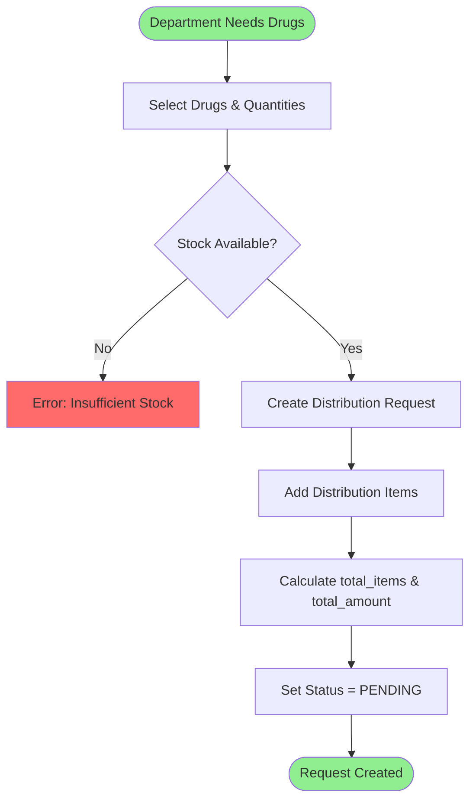
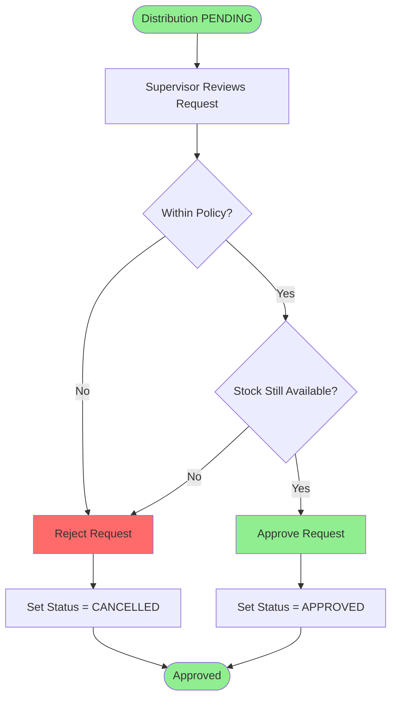
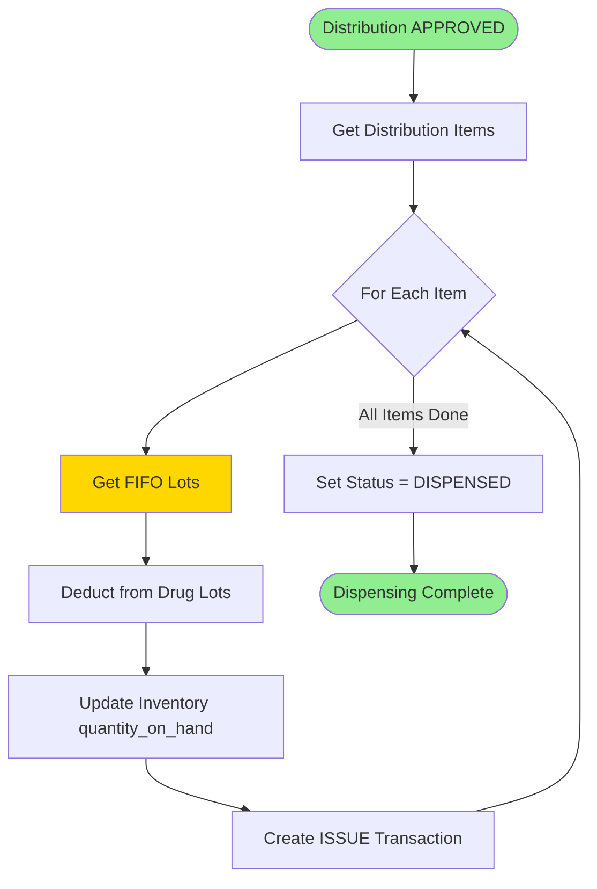
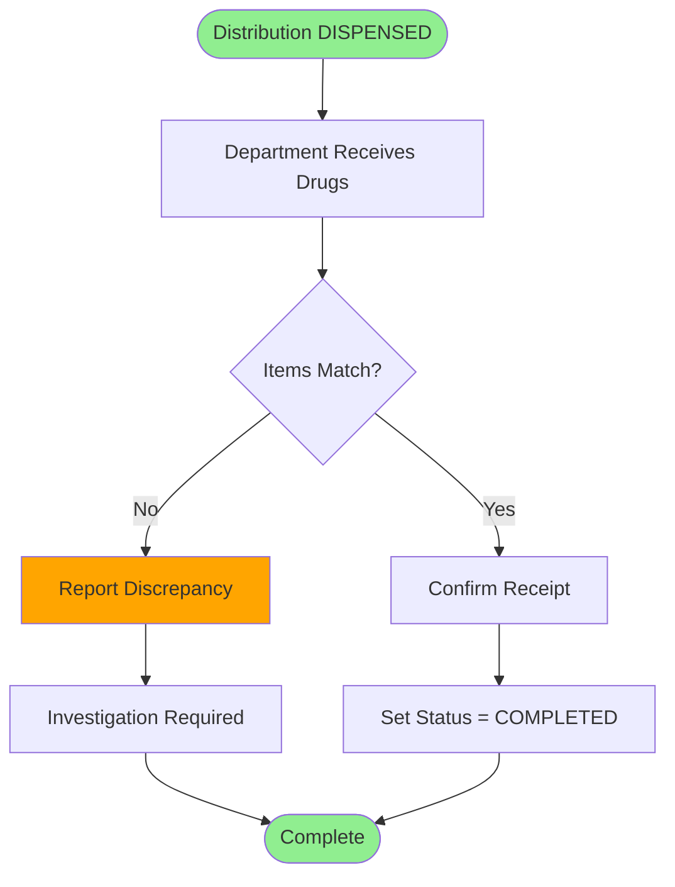
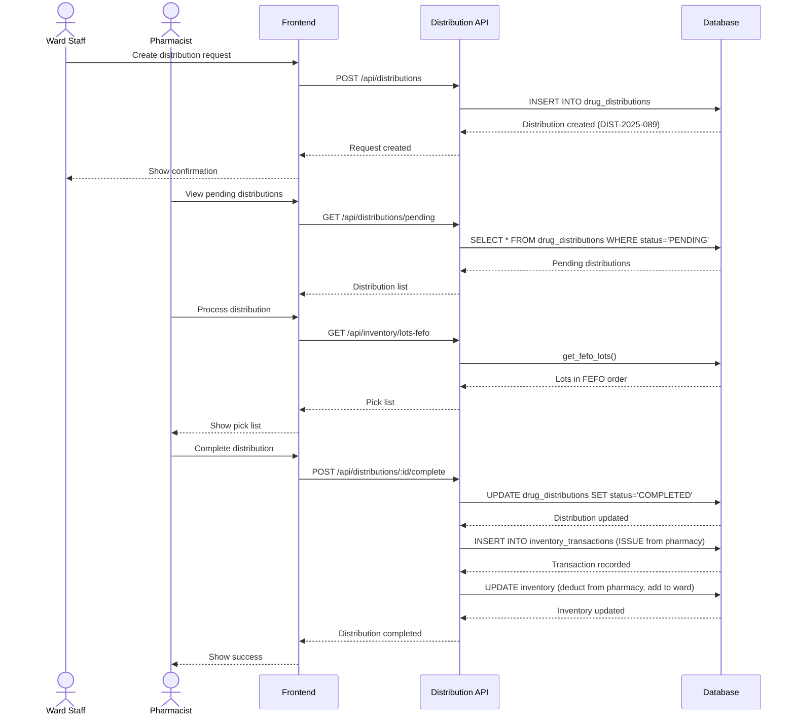

# 🏥 Distribution - Business Workflows

**System:** Distribution Management
**Workflows:** 4 major processes
**Version:** 2.6.0
**Last Updated:** 2025-01-28

---

## 📖 Table of Contents

### Core Workflows

1. [Distribution Request Creation](#1-distribution-request-creation) - สร้างใบเบิกยา
2. [Approval Process](#2-approval-process) - อนุมัติใบเบิก
3. [Drug Dispensing (FIFO/FEFO)](#3-drug-dispensing-fifofefo) - จ่ายยา
4. [Department Receipt](#4-department-receipt) - แผนกรับยา

### Reference

- [API Summary](#-api-summary)
- [Business Rules](#-business-rules)
- [Error Handling](#-error-handling)

---

## 1. Distribution Request Creation

**Trigger:** Department (Ward, OPD, etc.) needs drugs from Pharmacy

### Workflow Diagram



### Step-by-Step Process

#### Step 1: Check Stock Availability

```typescript
// Check if drugs are available at pharmacy
async function checkStockForDistribution(drugRequests: { drug_id: bigint; quantity: number }[], fromLocationId: bigint) {
  for (const req of drugRequests) {
    const inventory = await prisma.inventory.findUnique({
      where: {
        drug_id_location_id: {
          drug_id: req.drug_id,
          location_id: fromLocationId,
        },
      },
    });

    if (!inventory || inventory.quantity_on_hand < req.quantity) {
      throw new Error(`Insufficient stock for drug ${req.drug_id}. ` + `Available: ${inventory?.quantity_on_hand || 0}, ` + `Requested: ${req.quantity}`);
    }
  }

  return true;
}
```

#### Step 2: Create Distribution Request

```typescript
async function createDistributionRequest(data: {
  requesting_dept_id: bigint;
  requested_by: string;
  from_location_id: bigint;
  to_location_id?: bigint;
  items: Array<{
    drug_id: bigint;
    quantity: number;
  }>;
}) {
  return await prisma.$transaction(async (tx) => {
    // 1. Check stock availability
    await checkStockForDistribution(data.items, data.from_location_id);

    // 2. Generate distribution number
    const today = new Date();
    const year = today.getFullYear();
    const month = String(today.getMonth() + 1).padStart(2, '0');

    const lastDist = await tx.drugDistribution.findFirst({
      where: {
        distribution_number: {
          startsWith: `DIST-${year}-${month}`,
        },
      },
      orderBy: { distribution_number: 'desc' },
    });

    const nextNum = lastDist ? parseInt(lastDist.distribution_number.split('-')[3]) + 1 : 1;

    const distributionNumber = `DIST-${year}-${month}-${String(nextNum).padStart(3, '0')}`;

    // 3. Get lot and cost info for each item
    const enrichedItems = await Promise.all(
      data.items.map(async (item) => {
        // Get FIFO lot for preview
        const fifoLots = await tx.$queryRaw<any[]>`
          SELECT * FROM get_fifo_lots(
            ${item.drug_id}::BIGINT,
            ${data.from_location_id}::BIGINT,
            ${item.quantity}::DECIMAL
          )
          LIMIT 1
        `;

        const lot = fifoLots[0];

        return {
          drug_id: item.drug_id,
          quantity_dispensed: item.quantity,
          lot_number: lot.lot_number,
          unit_cost: lot.unit_cost,
          expiry_date: lot.expiry_date || new Date(),
        };
      }),
    );

    // 4. Calculate totals
    const totalItems = enrichedItems.length;
    const totalAmount = enrichedItems.reduce((sum, item) => sum + item.quantity_dispensed * item.unit_cost, 0);

    // 5. Create distribution
    const distribution = await tx.drugDistribution.create({
      data: {
        distribution_number: distributionNumber,
        distribution_date: new Date(),
        from_location_id: data.from_location_id,
        to_location_id: data.to_location_id,
        requesting_dept_id: data.requesting_dept_id,
        requested_by: data.requested_by,
        status: 'PENDING',
        total_items: totalItems,
        total_amount: totalAmount,
      },
    });

    // 6. Create distribution items
    await tx.drugDistributionItem.createMany({
      data: enrichedItems.map((item, index) => ({
        distribution_id: distribution.id,
        item_number: index + 1,
        ...item,
      })),
    });

    return distribution;
  });
}

// Example usage:
const distribution = await createDistributionRequest({
  requesting_dept_id: 3n, // Nursing Department
  requested_by: 'Nurse Jane',
  from_location_id: 2n, // Central Pharmacy
  to_location_id: 4n, // ICU
  items: [
    { drug_id: 1n, quantity: 1000 }, // Paracetamol 1000 tablets
    { drug_id: 2n, quantity: 500 }, // Ibuprofen 500 tablets
  ],
});
```

---

## 2. Approval Process

**Trigger:** Supervisor reviews and approves distribution request

### Workflow Diagram



### Implementation

#### Approve Distribution

```typescript
async function approveDistribution(distributionId: bigint, approvedBy: string) {
  return await prisma.$transaction(async (tx) => {
    // 1. Get distribution with items
    const distribution = await tx.drugDistribution.findUnique({
      where: { id: distributionId },
      include: {
        items: true,
        fromLocation: true,
      },
    });

    if (!distribution) {
      throw new Error('Distribution not found');
    }

    if (distribution.status !== 'PENDING') {
      throw new Error('Distribution must be PENDING to approve');
    }

    // 2. Re-check stock availability (in case stock changed)
    await checkStockForDistribution(
      distribution.items.map((item) => ({
        drug_id: item.drug_id,
        quantity: item.quantity_dispensed,
      })),
      distribution.from_location_id,
    );

    // 3. Approve
    const approved = await tx.drugDistribution.update({
      where: { id: distributionId },
      data: {
        status: 'APPROVED',
        approved_by: approvedBy,
        updated_at: new Date(),
      },
    });

    return approved;
  });
}
```

#### Reject/Cancel Distribution

```typescript
async function cancelDistribution(distributionId: bigint, reason: string) {
  const cancelled = await prisma.drugDistribution.update({
    where: { id: distributionId },
    data: {
      status: 'CANCELLED',
      notes: reason,
      updated_at: new Date(),
    },
  });

  return cancelled;
}
```

---

## 3. Drug Dispensing (FIFO/FEFO)

**Trigger:** Pharmacist dispenses drugs to department

### Workflow Diagram



### Implementation

```typescript
async function dispenseDistribution(distributionId: bigint, dispensedBy: string, userId: bigint) {
  return await prisma.$transaction(async (tx) => {
    // 1. Get distribution
    const distribution = await tx.drugDistribution.findUnique({
      where: { id: distributionId },
      include: {
        items: {
          include: {
            drug: {
              include: {
                generic: true,
              },
            },
          },
        },
        requestingDept: true,
      },
    });

    if (!distribution) {
      throw new Error('Distribution not found');
    }

    if (distribution.status !== 'APPROVED') {
      throw new Error('Distribution must be APPROVED before dispensing');
    }

    // 2. Process each item
    for (const item of distribution.items) {
      // 2.1 Get FIFO lots
      const fifoLots = await tx.$queryRaw<any[]>`
        SELECT * FROM get_fifo_lots(
          ${item.drug_id}::BIGINT,
          ${distribution.from_location_id}::BIGINT,
          ${item.quantity_dispensed}::DECIMAL
        )
      `;

      if (!fifoLots || fifoLots.length === 0) {
        throw new Error(`No available lots for drug ${item.drug.trade_name}`);
      }

      // 2.2 Deduct from each lot
      let remainingQty = item.quantity_dispensed;

      for (const lot of fifoLots) {
        const deductQty = Math.min(lot.quantity, remainingQty);

        // Update lot quantity
        await tx.drugLot.update({
          where: { id: lot.lot_id },
          data: {
            quantity_available: { decrement: deductQty },
          },
        });

        // Check if lot is depleted
        const updatedLot = await tx.drugLot.findUnique({
          where: { id: lot.lot_id },
        });

        if (updatedLot && updatedLot.quantity_available === 0) {
          await tx.drugLot.update({
            where: { id: lot.lot_id },
            data: { is_active: false },
          });
        }

        remainingQty -= deductQty;
        if (remainingQty <= 0) break;
      }

      // 2.3 Update inventory
      await tx.inventory.update({
        where: {
          drug_id_location_id: {
            drug_id: item.drug_id,
            location_id: distribution.from_location_id,
          },
        },
        data: {
          quantity_on_hand: { decrement: item.quantity_dispensed },
          last_updated: new Date(),
        },
      });

      // 2.4 Create inventory transaction
      const inventory = await tx.inventory.findUnique({
        where: {
          drug_id_location_id: {
            drug_id: item.drug_id,
            location_id: distribution.from_location_id,
          },
        },
      });

      await tx.inventoryTransaction.create({
        data: {
          inventory_id: inventory!.id,
          transaction_type: 'ISSUE',
          quantity: -item.quantity_dispensed,
          unit_cost: item.unit_cost,
          reference_id: distribution.id,
          reference_type: 'distribution',
          notes: `Distribution ${distribution.distribution_number} to ${distribution.requestingDept.dept_name}`,
          created_by: userId,
        },
      });
    }

    // 3. Update distribution status
    const dispensed = await tx.drugDistribution.update({
      where: { id: distributionId },
      data: {
        status: 'DISPENSED',
        dispensed_by: dispensedBy,
        updated_at: new Date(),
      },
    });

    return dispensed;
  });
}

// Example usage:
const dispensed = await dispenseDistribution(distributionId, 'Pharmacist Sarah', userId);
```

---

## 4. Department Receipt

**Trigger:** Department receives drugs from pharmacy

### Workflow Diagram



### Implementation

```typescript
async function completeDistribution(distributionId: bigint, receivedBy: string, notes?: string) {
  const completed = await prisma.drugDistribution.update({
    where: { id: distributionId },
    data: {
      status: 'COMPLETED',
      notes: notes || `Received by ${receivedBy}`,
      updated_at: new Date(),
    },
  });

  return completed;
}

// Report discrepancy if items don't match
async function reportDistributionDiscrepancy(
  distributionId: bigint,
  discrepancy: {
    item_number: number;
    expected_quantity: number;
    received_quantity: number;
    reason: string;
  },
) {
  // Log discrepancy
  await prisma.distributionDiscrepancy.create({
    data: {
      distribution_id: distributionId,
      item_number: discrepancy.item_number,
      expected_quantity: discrepancy.expected_quantity,
      received_quantity: discrepancy.received_quantity,
      variance: discrepancy.received_quantity - discrepancy.expected_quantity,
      reason: discrepancy.reason,
      reported_at: new Date(),
    },
  });

  // Update distribution status to require investigation
  await prisma.drugDistribution.update({
    where: { id: distributionId },
    data: {
      status: 'PENDING_INVESTIGATION',
      notes: `Discrepancy reported: ${discrepancy.reason}`,
      updated_at: new Date(),
    },
  });
}
```

---

## 📡 API Summary

### Distribution Request

- `POST /api/distributions` - Create distribution request
- `GET /api/distributions` - List distributions
- `GET /api/distributions/:id` - Get distribution details
- `PUT /api/distributions/:id` - Update distribution (PENDING only)
- `DELETE /api/distributions/:id` - Cancel distribution (PENDING only)

### Approval

- `POST /api/distributions/:id/approve` - Approve distribution
- `POST /api/distributions/:id/reject` - Reject distribution

### Dispensing

- `POST /api/distributions/:id/dispense` - Dispense drugs (APPROVED → DISPENSED)
- `GET /api/distributions/:id/preview-lots` - Preview FIFO lots before dispensing

### Receipt

- `POST /api/distributions/:id/complete` - Mark as completed (received by department)
- `POST /api/distributions/:id/report-discrepancy` - Report discrepancy

### Reports

- `GET /api/distributions/department/:deptId` - Distribution history by department
- `GET /api/distributions/drug/:drugId` - Usage history by drug
- `GET /api/distributions/summary` - Monthly/yearly summary

---

## 📏 Business Rules

### Distribution Rules

1. **Stock Availability**
   - Must check stock before creating distribution
   - Re-check stock before approval (in case stock changed)
   - Cannot dispense if stock becomes insufficient

2. **FIFO/FEFO Enforcement**
   - Always use get_fifo_lots() or get_fefo_lots()
   - Cannot manually select lots (audit requirement)
   - Lot information recorded in distribution_items

3. **Status Flow**
   - PENDING → APPROVED → DISPENSED → COMPLETED
   - Can cancel only in PENDING or APPROVED status
   - Cannot edit after DISPENSED

4. **Department Limits (Optional)**
   - Daily/weekly distribution limits per department
   - High-cost drug approval requirements
   - Controlled substance tracking

5. **Inventory Integration**
   - Stock deducted only when status = DISPENSED
   - Creates ISSUE transaction in inventory_transactions
   - Updates both inventory and drug_lots tables

### Ministry Compliance

**export_distribution View Fields:**

1. DISTNO - Distribution number
2. DISTDATE - Distribution date
3. DEPTCODE - Department code
4. DEPT_TYPE - Department consumption group (1-9)
5. DRUGCODE - Drug code
6. QTY - Quantity dispensed
7. UNITCOST - Unit cost
8. LOTNO - Lot number
9. EXPDATE - Expiry date
10. AMOUNT - Total amount
11. DISPENSER - Pharmacist name

---

## 🚨 Error Handling

### Common Errors

| Error                       | Cause                                 | Solution                                              |
| --------------------------- | ------------------------------------- | ----------------------------------------------------- |
| `INSUFFICIENT_STOCK`        | Stock < requested quantity            | Check inventory, reduce quantity, or wait for receipt |
| `INVALID_STATUS`            | Wrong status for operation            | Check current status and allowed transitions          |
| `NO_FIFO_LOTS`              | No available lots for drug            | Check drug_lots, ensure active lots exist             |
| `ALREADY_DISPENSED`         | Trying to edit dispensed distribution | Cannot edit, create new distribution or use return    |
| `DEPARTMENT_LIMIT_EXCEEDED` | Over department daily/weekly limit    | Review policy, get special approval                   |
| `DISTRIBUTION_NOT_FOUND`    | Invalid distribution ID               | Verify ID exists                                      |

### Error Response Format

```json
{
  "error": "INSUFFICIENT_STOCK",
  "message": "Insufficient stock for Paracetamol at Central Pharmacy",
  "details": {
    "drug_id": 1,
    "drug_name": "Paracetamol 500mg",
    "location_id": 2,
    "location_name": "Central Pharmacy",
    "requested": 1000,
    "available": 500
  }
}
```

---

## 🔍 Related Documentation

### System Documentation

- **[README.md](README.md)** - Distribution system overview
- **[SCHEMA.md](SCHEMA.md)** - Database schema with 2 tables

### Global Documentation

- **[SYSTEM_ARCHITECTURE.md](../../SYSTEM_ARCHITECTURE.md)** - All 8 systems
- **[END_TO_END_WORKFLOWS.md](../../END_TO_END_WORKFLOWS.md)** - Cross-system flows

### Related Systems

- **[Inventory](../04-inventory/WORKFLOWS.md)** - FIFO/FEFO lot selection
- **[Master Data](../01-master-data/README.md)** - Locations and departments

---

**Built with ❤️ for INVS Modern Team**
**Last Updated:** 2025-01-28 | **Version:** 2.6.0

---

## 🔄 Sequence Diagram: Drug Distribution


