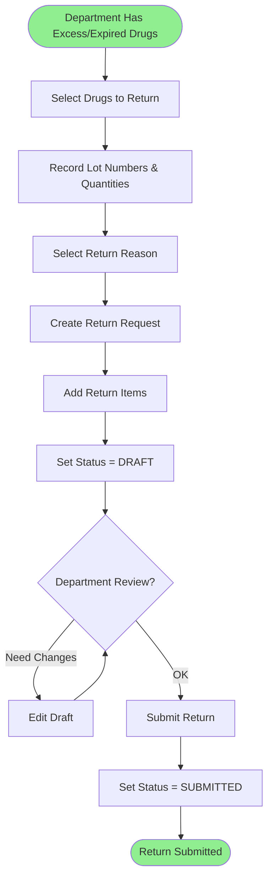
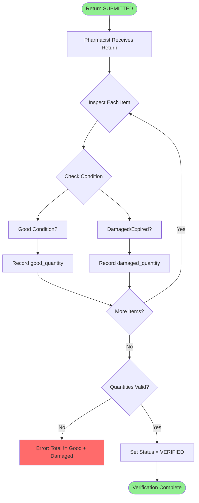
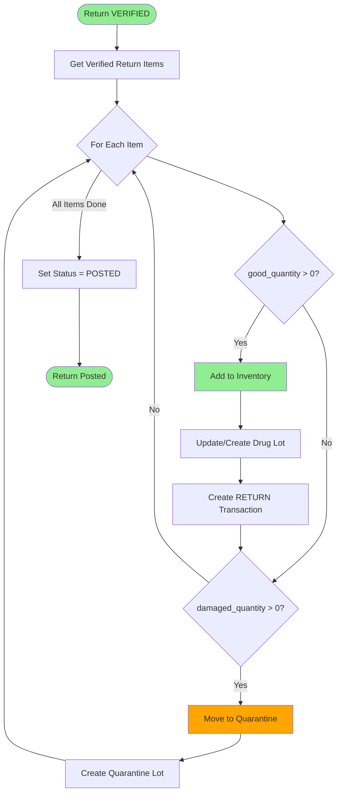
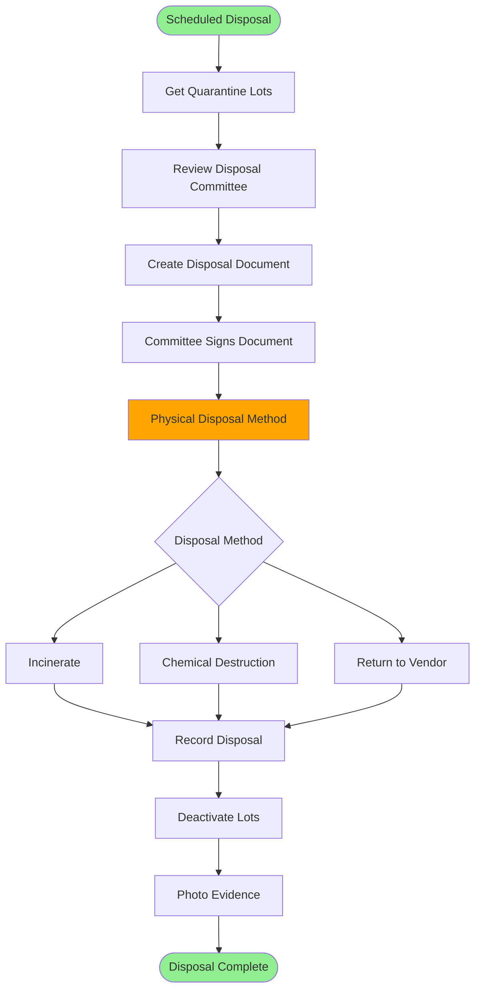
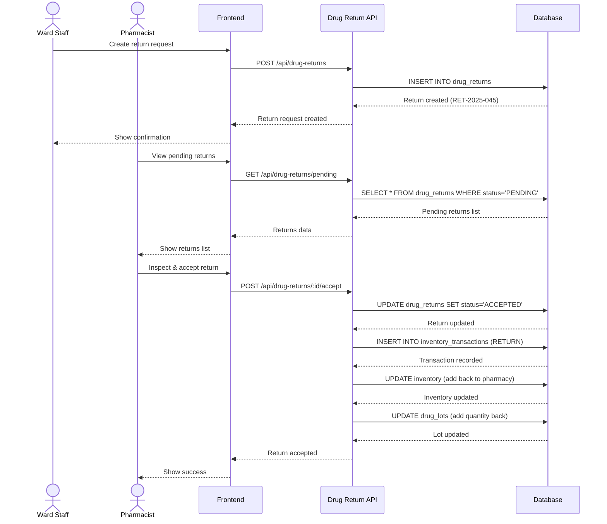

# 🔄 Drug Return - Business Workflows

**System:** Drug Return Management
**Workflows:** 4 major processes
**Version:** 2.6.0
**Last Updated:** 2025-01-28

---

## 📖 Table of Contents

### Core Workflows

1. [Create Return Request](#1-create-return-request) - สร้างใบรับคืน
2. [Verification & Separation](#2-verification--separation) - ตรวจสอบและแยกของดี/เสีย
3. [Post to Inventory](#3-post-to-inventory) - บันทึกเข้าระบบ
4. [Damaged Drug Disposal](#4-damaged-drug-disposal) - จัดการยาเสีย

### Reference

- [API Summary](#-api-summary)
- [Business Rules](#-business-rules)
- [Error Handling](#-error-handling)

---

## 1. Create Return Request

**Trigger:** Department wants to return unused, excess, or expired drugs

### Workflow Diagram



### Step-by-Step Process

#### Step 1: Create Return Request

```typescript
async function createDrugReturn(data: {
  department_id: bigint;
  return_reason: string;
  items: Array<{
    drug_id: bigint;
    total_quantity: number;
    lot_number: string;
    expiry_date: Date;
    return_type: 'PURCHASED' | 'FREE';
    location_id: bigint;
  }>;
}) {
  return await prisma.$transaction(async (tx) => {
    // 1. Generate return number
    const today = new Date();
    const year = today.getFullYear();
    const month = String(today.getMonth() + 1).padStart(2, '0');

    const lastReturn = await tx.drugReturn.findFirst({
      where: {
        return_number: {
          startsWith: `RET-${year}-${month}`,
        },
      },
      orderBy: { return_number: 'desc' },
    });

    const nextNum = lastReturn ? parseInt(lastReturn.return_number.split('-')[3]) + 1 : 1;

    const returnNumber = `RET-${year}-${month}-${String(nextNum).padStart(3, '0')}`;

    // 2. Create return header
    const ret = await tx.drugReturn.create({
      data: {
        return_number: returnNumber,
        department_id: data.department_id,
        return_date: new Date(),
        return_reason: data.return_reason,
        status: 'DRAFT',
        total_items: data.items.length,
      },
    });

    // 3. Create return items
    await tx.drugReturnItem.createMany({
      data: data.items.map((item) => ({
        return_id: ret.id,
        drug_id: item.drug_id,
        total_quantity: item.total_quantity,
        good_quantity: 0, // Will be set during verification
        damaged_quantity: 0,
        lot_number: item.lot_number,
        expiry_date: item.expiry_date,
        return_type: item.return_type,
        location_id: item.location_id,
      })),
    });

    return ret;
  });
}

// Example usage:
const drugReturn = await createDrugReturn({
  department_id: 3n, // Nursing Department
  return_reason: 'Excess stock - patient discharged',
  items: [
    {
      drug_id: 1n,
      total_quantity: 500,
      lot_number: 'LOT-PCM-2025-A',
      expiry_date: new Date('2027-04-01'),
      return_type: 'PURCHASED',
      location_id: 2n, // Central Pharmacy
    },
    {
      drug_id: 2n,
      total_quantity: 200,
      lot_number: 'LOT-IBU-2024-Z',
      expiry_date: new Date('2025-03-31'), // Expiring soon
      return_type: 'PURCHASED',
      location_id: 2n,
    },
  ],
});
```

#### Step 2: Submit Return

```typescript
// Department submits return for verification
const submitted = await prisma.drugReturn.update({
  where: { id: returnId },
  data: {
    status: 'SUBMITTED',
    updated_at: new Date(),
  },
});
```

---

## 2. Verification & Separation

**Trigger:** Pharmacist verifies returned drugs and separates good/damaged

### Workflow Diagram



### Implementation

```typescript
async function verifyDrugReturn(
  returnId: bigint,
  verifiedBy: string,
  itemSeparation: Array<{
    item_id: bigint;
    good_quantity: number;
    damaged_quantity: number;
    notes?: string;
  }>,
) {
  return await prisma.$transaction(async (tx) => {
    // 1. Get return
    const ret = await tx.drugReturn.findUnique({
      where: { id: returnId },
      include: { items: true },
    });

    if (!ret) {
      throw new Error('Return not found');
    }

    if (ret.status !== 'SUBMITTED') {
      throw new Error('Return must be SUBMITTED to verify');
    }

    // 2. Validate and update each item
    for (const sep of itemSeparation) {
      const item = ret.items.find((i) => i.id === sep.item_id);

      if (!item) {
        throw new Error(`Item ${sep.item_id} not found in return`);
      }

      // Validate quantities
      const calculatedTotal = sep.good_quantity + sep.damaged_quantity;
      if (Math.abs(calculatedTotal - item.total_quantity) > 0.001) {
        throw new Error(`Item ${sep.item_id}: Good (${sep.good_quantity}) + ` + `Damaged (${sep.damaged_quantity}) = ${calculatedTotal} ` + `must equal Total (${item.total_quantity})`);
      }

      // Update item
      await tx.drugReturnItem.update({
        where: { id: sep.item_id },
        data: {
          good_quantity: sep.good_quantity,
          damaged_quantity: sep.damaged_quantity,
          notes: sep.notes,
        },
      });
    }

    // 3. Calculate total value (good quantity only)
    const itemsWithDrugs = await tx.drugReturnItem.findMany({
      where: { return_id: returnId },
      include: {
        drug: true,
      },
    });

    const totalValue = itemsWithDrugs.reduce((sum, item) => {
      // Get average cost from inventory
      const avgCost = 0; // TODO: Get from inventory
      return sum + item.good_quantity * avgCost;
    }, 0);

    // 4. Update return status
    const verified = await tx.drugReturn.update({
      where: { id: returnId },
      data: {
        status: 'VERIFIED',
        verified_by: verifiedBy,
        total_amount: totalValue,
        updated_at: new Date(),
      },
    });

    return verified;
  });
}

// Example usage:
const verified = await verifyDrugReturn(returnId, 'Pharmacist Sarah', [
  {
    item_id: item1Id,
    good_quantity: 450, // Good condition
    damaged_quantity: 50, // Damaged packaging
    notes: '50 tablets damaged packaging',
  },
  {
    item_id: item2Id,
    good_quantity: 0, // All expired
    damaged_quantity: 200,
    notes: 'Expired - dispose',
  },
]);
```

---

## 3. Post to Inventory

**Trigger:** Verified return is posted to update inventory

### Workflow Diagram



### Implementation

```typescript
async function postDrugReturn(returnId: bigint, receivedBy: string, userId: bigint) {
  return await prisma.$transaction(async (tx) => {
    // 1. Get return with items
    const ret = await tx.drugReturn.findUnique({
      where: { id: returnId },
      include: {
        items: {
          include: {
            drug: true,
          },
        },
        department: true,
      },
    });

    if (!ret) {
      throw new Error('Return not found');
    }

    if (ret.status !== 'VERIFIED') {
      throw new Error('Return must be VERIFIED before posting');
    }

    // 2. Process each item
    for (const item of ret.items) {
      // 2.1 Process GOOD quantity
      if (item.good_quantity > 0) {
        // Find or create inventory
        let inventory = await tx.inventory.findUnique({
          where: {
            drug_id_location_id: {
              drug_id: item.drug_id,
              location_id: item.location_id,
            },
          },
        });

        if (!inventory) {
          inventory = await tx.inventory.create({
            data: {
              drug_id: item.drug_id,
              location_id: item.location_id,
              quantity_on_hand: item.good_quantity,
              average_cost: 0,
              last_cost: 0,
              last_updated: new Date(),
            },
          });
        } else {
          await tx.inventory.update({
            where: { id: inventory.id },
            data: {
              quantity_on_hand: { increment: item.good_quantity },
              last_updated: new Date(),
            },
          });
        }

        // Find or create lot
        let lot = await tx.drugLot.findFirst({
          where: {
            drug_id: item.drug_id,
            location_id: item.location_id,
            lot_number: item.lot_number,
          },
        });

        if (lot) {
          // Update existing lot
          await tx.drugLot.update({
            where: { id: lot.id },
            data: {
              quantity_available: { increment: item.good_quantity },
              is_active: true,
            },
          });
        } else {
          // Create new lot
          await tx.drugLot.create({
            data: {
              drug_id: item.drug_id,
              location_id: item.location_id,
              lot_number: item.lot_number,
              expiry_date: item.expiry_date,
              quantity_available: item.good_quantity,
              unit_cost: 0, // Use inventory average cost
              received_date: ret.return_date,
              is_active: true,
            },
          });
        }

        // Create RETURN transaction
        await tx.inventoryTransaction.create({
          data: {
            inventory_id: inventory.id,
            transaction_type: 'RETURN',
            quantity: item.good_quantity,
            reference_id: ret.id,
            reference_type: 'drug_return',
            notes: `Return from ${ret.department.dept_name}, ` + `Lot: ${item.lot_number}, Good: ${item.good_quantity}`,
            created_by: userId,
          },
        });
      }

      // 2.2 Process DAMAGED quantity
      if (item.damaged_quantity > 0) {
        const quarantine = await tx.location.findFirst({
          where: { location_code: 'QUARANTINE' },
        });

        if (!quarantine) {
          throw new Error('Quarantine location not configured');
        }

        // Create quarantine lot (inactive - for disposal)
        await tx.drugLot.create({
          data: {
            drug_id: item.drug_id,
            location_id: quarantine.id,
            lot_number: `${item.lot_number}-DMG`,
            expiry_date: item.expiry_date,
            quantity_available: item.damaged_quantity,
            unit_cost: 0,
            received_date: ret.return_date,
            is_active: false, // Inactive - pending disposal
            notes: `Damaged return from ${ret.department.dept_name}. ` + `Reason: ${ret.return_reason}`,
          },
        });
      }
    }

    // 3. Update return status
    const posted = await tx.drugReturn.update({
      where: { id: returnId },
      data: {
        status: 'POSTED',
        received_by: receivedBy,
        action_taken: 'Good quantity restocked, damaged moved to quarantine',
        updated_at: new Date(),
      },
    });

    return posted;
  });
}

// Example usage:
const posted = await postDrugReturn(returnId, 'Pharmacist Sarah', userId);
```

---

## 4. Damaged Drug Disposal

**Trigger:** Periodic disposal of damaged/expired drugs in quarantine

### Workflow Diagram



### Implementation

```typescript
async function createDisposalDocument(data: { quarantine_lot_ids: bigint[]; disposal_method: string; committee_members: string[]; notes: string }) {
  return await prisma.$transaction(async (tx) => {
    // 1. Get quarantine lots
    const lots = await tx.drugLot.findMany({
      where: {
        id: { in: data.quarantine_lot_ids },
        is_active: false, // Quarantine lots
      },
      include: {
        drug: {
          include: {
            generic: true,
          },
        },
        location: true,
      },
    });

    // 2. Create disposal document
    const disposal = await tx.drugDisposal.create({
      data: {
        disposal_date: new Date(),
        disposal_method: data.disposal_method,
        committee_members: data.committee_members.join(', '),
        total_items: lots.length,
        total_quantity: lots.reduce((sum, lot) => sum + lot.quantity_available, 0),
        notes: data.notes,
        status: 'PENDING',
      },
    });

    // 3. Link lots to disposal
    await tx.drugDisposalItem.createMany({
      data: lots.map((lot) => ({
        disposal_id: disposal.id,
        lot_id: lot.id,
        drug_id: lot.drug_id,
        quantity_disposed: lot.quantity_available,
        lot_number: lot.lot_number,
        expiry_date: lot.expiry_date,
      })),
    });

    return disposal;
  });
}

// Mark disposal as completed
async function completeDisposal(disposalId: bigint, photoUrls: string[]) {
  return await prisma.$transaction(async (tx) => {
    // 1. Get disposal with lots
    const disposal = await tx.drugDisposal.findUnique({
      where: { id: disposalId },
      include: {
        items: true,
      },
    });

    // 2. Deactivate all lots
    for (const item of disposal.items) {
      await tx.drugLot.update({
        where: { id: item.lot_id },
        data: {
          quantity_available: 0,
          is_active: false,
          notes: `Disposed: ${disposal.disposal_method}`,
        },
      });
    }

    // 3. Update disposal status
    await tx.drugDisposal.update({
      where: { id: disposalId },
      data: {
        status: 'COMPLETED',
        completed_at: new Date(),
        photo_evidence: photoUrls.join(','),
      },
    });
  });
}
```

---

## 📡 API Summary

### Return Request

- POST /api/drug-returns - Create return request
- GET /api/drug-returns - List returns (with filters)
- GET /api/drug-returns/:id - Get return details
- PUT /api/drug-returns/:id - Update return (DRAFT only)
- DELETE /api/drug-returns/:id - Cancel return (before POSTED)

### Verification

- POST /api/drug-returns/:id/submit - Submit return (DRAFT → SUBMITTED)
- POST /api/drug-returns/:id/verify - Verify and separate good/damaged

### Posting

- POST /api/drug-returns/:id/post - Post to inventory (VERIFIED → POSTED)

### Reports

- GET /api/drug-returns/department/:deptId - Return history by department
- GET /api/drug-returns/damaged - Damaged drugs summary
- GET /api/drug-returns/quarantine - Current quarantine stock

### Disposal

- POST /api/drug-disposals - Create disposal document
- POST /api/drug-disposals/:id/complete - Mark disposal complete
- GET /api/drug-disposals - List disposal documents

---

## 📏 Business Rules

### Return Rules

1. **Good/Damaged Separation**
   - Must separate during VERIFIED status
   - `total_quantity = good_quantity + damaged_quantity`
   - Only good quantity restocked
   - Damaged moved to quarantine

2. **Lot Validation**
   - Lot number must match original distribution
   - Cannot return more than distributed
   - Expiry date validation

3. **Return Types**
   - **PURCHASED**: Can restock if good
   - **FREE**: Usually dispose (policy dependent)

4. **Status Flow**
   - DRAFT → SUBMITTED → VERIFIED → POSTED
   - Can cancel before POSTED
   - Cannot edit after POSTED

5. **Disposal Requirements**
   - Committee of 3+ members
   - Photo evidence required
   - Destruction method documented
   - Witness signatures

---

## 🚨 Error Handling

### Common Errors

| Error                    | Cause                        | Solution                                     |
| ------------------------ | ---------------------------- | -------------------------------------------- |
| `INVALID_TOTAL_QUANTITY` | good + damaged ≠ total       | Re-verify quantities during separation       |
| `INVALID_STATUS`         | Wrong status for operation   | Check current status and allowed transitions |
| `LOT_NOT_FOUND`          | Invalid lot number           | Verify lot exists in distributions           |
| `ALREADY_POSTED`         | Trying to edit posted return | Cannot edit, create new return               |
| `QUARANTINE_NOT_FOUND`   | Quarantine location missing  | Configure QUARANTINE location                |

### Error Response Format

```json
{
  "error": "INVALID_TOTAL_QUANTITY",
  "message": "Good quantity + Damaged quantity must equal Total quantity",
  "details": {
    "item_id": 123,
    "total_quantity": 500,
    "good_quantity": 450,
    "damaged_quantity": 30,
    "calculated_total": 480
  }
}
```

---

## 🔍 Related Documentation

### System Documentation

- **[README.md](README.md)** - Drug Return system overview
- **[SCHEMA.md](SCHEMA.md)** - Database schema with 2 tables

### Global Documentation

- **[SYSTEM_ARCHITECTURE.md](../../SYSTEM_ARCHITECTURE.md)** - All 8 systems
- **[END_TO_END_WORKFLOWS.md](../../END_TO_END_WORKFLOWS.md)** - Cross-system flows

### Related Systems

- **[Distribution](../05-distribution/WORKFLOWS.md)** - Original distribution tracking
- **[Inventory](../04-inventory/WORKFLOWS.md)** - RETURN transaction and stock update

---

**Built with ❤️ for INVS Modern Team**
**Last Updated:** 2025-01-28 | **Version:** 2.6.0

---

## 🔄 Sequence Diagram: Drug Return Process


