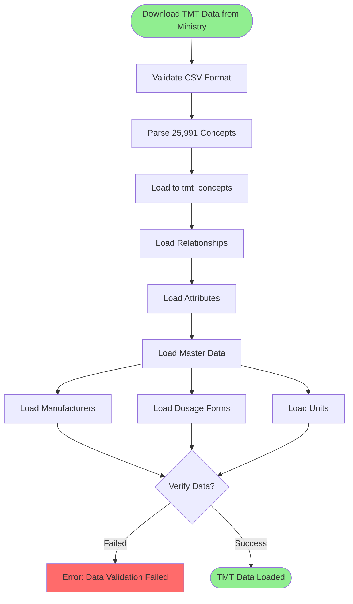
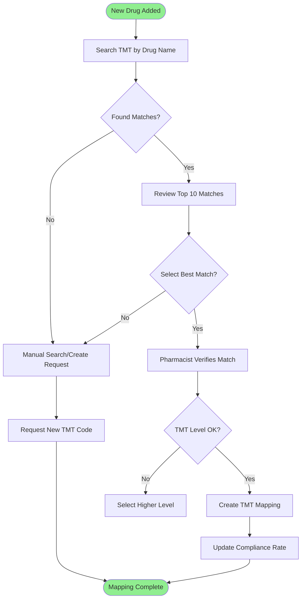
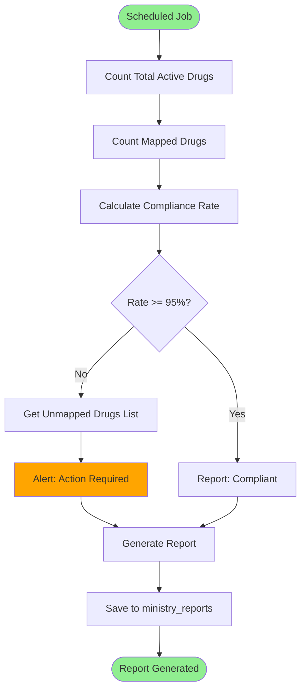
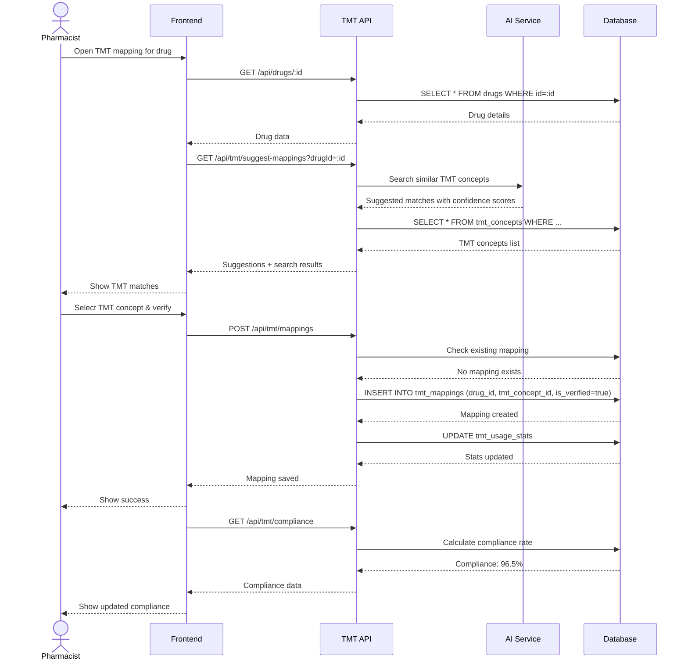

# 🔗 TMT Integration - Business Workflows

**System:** Thai Medical Terminology (TMT) Integration
**Workflows:** 3 major processes
**Version:** 2.6.0
**Last Updated:** 2025-01-28

---

## 📖 Table of Contents

### Core Workflows

1. [TMT Data Loading](#1-tmt-data-loading) - Load 25,991 TMT concepts
2. [Drug-to-TMT Mapping](#2-drug-to-tmt-mapping) - Map drugs to TMT
3. [Compliance Monitoring](#3-compliance-monitoring) - Track compliance rate

### Reference

- [API Summary](#-api-summary)
- [Business Rules](#-business-rules)
- [Error Handling](#-error-handling)

---

## 1. TMT Data Loading

**Trigger:** Initial setup or TMT updates from ministry

### Workflow Diagram



### Step-by-Step Process

#### Step 1: Download TMT Data

**Source:** Ministry of Public Health (MOPH) website

```bash
# Download TMT CSV files
wget https://tmt.moph.go.th/tmt_concepts.csv
wget https://tmt.moph.go.th/tmt_relationships.csv
wget https://tmt.moph.go.th/tmt_attributes.csv
```

#### Step 2: Load TMT Concepts

```typescript
import { parse } from 'csv-parse/sync';
import { readFileSync } from 'fs';

async function loadTMTConcepts(csvFilePath: string) {
  // Read CSV file
  const csvContent = readFileSync(csvFilePath, 'utf-8');

  // Parse CSV
  const records = parse(csvContent, {
    columns: true,
    skip_empty_lines: true,
  });

  console.log(`Parsed ${records.length} TMT concepts`);

  // Batch insert (1000 per batch)
  const batchSize = 1000;
  let inserted = 0;

  for (let i = 0; i < records.length; i += batchSize) {
    const batch = records.slice(i, i + batchSize);

    await prisma.tmtConcept.createMany({
      data: batch.map((row: any) => ({
        tmt_id: parseInt(row.TMT_ID),
        concept_code: row.CONCEPT_CODE,
        level: row.LEVEL as TMTLevel,
        fsn: row.FSN,
        preferred_term: row.PREFERRED_TERM_TH,
        strength: row.STRENGTH,
        dosage_form: row.DOSAGE_FORM,
        is_active: row.IS_ACTIVE === 'Y',
      })),
      skipDuplicates: true,
    });

    inserted += batch.length;
    console.log(`Inserted ${inserted}/${records.length} concepts`);
  }

  return inserted;
}

// Usage:
const count = await loadTMTConcepts('./data/tmt_concepts.csv');
console.log(`Loaded ${count} TMT concepts successfully`);
```

#### Step 3: Load Relationships

```typescript
async function loadTMTRelationships(csvFilePath: string) {
  const csvContent = readFileSync(csvFilePath, 'utf-8');
  const records = parse(csvContent, { columns: true });

  const batchSize = 5000;
  let inserted = 0;

  for (let i = 0; i < records.length; i += batchSize) {
    const batch = records.slice(i, i + batchSize);

    // Find parent and child concepts by TMT_ID
    const relationships = [];

    for (const row of batch) {
      const parent = await prisma.tmtConcept.findUnique({
        where: { tmt_id: parseInt(row.PARENT_TMT_ID) },
      });

      const child = await prisma.tmtConcept.findUnique({
        where: { tmt_id: parseInt(row.CHILD_TMT_ID) },
      });

      if (parent && child) {
        relationships.push({
          parent_id: parent.id,
          child_id: child.id,
          relationship_type: row.RELATIONSHIP_TYPE,
          is_active: true,
        });
      }
    }

    await prisma.tmtRelationship.createMany({
      data: relationships,
      skipDuplicates: true,
    });

    inserted += relationships.length;
    console.log(`Inserted ${inserted} relationships`);
  }

  return inserted;
}
```

#### Step 4: Load Master Data

```typescript
// Load manufacturers
async function loadTMTManufacturers(csvFilePath: string) {
  const records = parse(readFileSync(csvFilePath, 'utf-8'), { columns: true });

  await prisma.tmtManufacturer.createMany({
    data: records.map((row: any) => ({
      manufacturer_code: row.MANUFACTURER_CODE,
      manufacturer_name: row.MANUFACTURER_NAME,
      is_active: true,
    })),
    skipDuplicates: true,
  });
}

// Load dosage forms (87 forms)
async function loadTMTDosageForms(csvFilePath: string) {
  const records = parse(readFileSync(csvFilePath, 'utf-8'), { columns: true });

  await prisma.tmtDosageForm.createMany({
    data: records.map((row: any) => ({
      form_code: row.FORM_CODE,
      form_name: row.FORM_NAME_TH,
      is_active: true,
    })),
    skipDuplicates: true,
  });
}

// Load units
async function loadTMTUnits(csvFilePath: string) {
  const records = parse(readFileSync(csvFilePath, 'utf-8'), { columns: true });

  await prisma.tmtUnit.createMany({
    data: records.map((row: any) => ({
      unit_code: row.UNIT_CODE,
      unit_name: row.UNIT_NAME,
      conversion_factor: parseFloat(row.CONVERSION_FACTOR || '1.0'),
    })),
    skipDuplicates: true,
  });
}
```

---

## 2. Drug-to-TMT Mapping

**Trigger:** Pharmacist maps hospital drugs to TMT concepts

### Workflow Diagram



### Implementation

#### Step 1: Search TMT Concepts

```typescript
async function searchTMTConcepts(query: string, level?: TMTLevel) {
  // Fuzzy search by preferred term or FSN
  const results = await prisma.tmtConcept.findMany({
    where: {
      AND: [
        {
          OR: [{ preferred_term: { contains: query, mode: 'insensitive' } }, { fsn: { contains: query, mode: 'insensitive' } }, { concept_code: { contains: query } }],
        },
        level ? { level } : {},
        { is_active: true },
      ],
    },
    take: 10,
    orderBy: {
      preferred_term: 'asc',
    },
  });

  return results;
}

// Example: Search for Paracetamol
const matches = await searchTMTConcepts('Paracetamol', 'GP');
console.log(`Found ${matches.length} matches`);
```

#### Step 2: Create Drug-to-TMT Mapping

```typescript
async function createDrugTMTMapping(data: { generic_id?: bigint; drug_id?: bigint; tmt_concept_id: bigint; verified_by_user_id: bigint }) {
  return await prisma.$transaction(async (tx) => {
    // Get drug info
    let drug;
    if (data.drug_id) {
      drug = await tx.drug.findUnique({
        where: { id: data.drug_id },
        include: { generic: true },
      });
    } else {
      drug = await tx.drugGeneric.findUnique({
        where: { id: data.generic_id },
      });
    }

    // Get TMT concept
    const tmtConcept = await tx.tmtConcept.findUnique({
      where: { id: data.tmt_concept_id },
    });

    if (!tmtConcept) {
      throw new Error('TMT concept not found');
    }

    // Check if mapping already exists
    const existing = await tx.tmtMapping.findFirst({
      where: {
        OR: [{ generic_id: data.generic_id }, { drug_id: data.drug_id }],
      },
    });

    if (existing) {
      throw new Error('Mapping already exists for this drug');
    }

    // Create mapping
    const mapping = await tx.tmtMapping.create({
      data: {
        working_code: drug.working_code || '',
        drug_code: drug.drug_code || '',
        generic_id: data.generic_id,
        drug_id: data.drug_id,
        tmt_level: tmtConcept.level,
        tmt_concept_id: data.tmt_concept_id,
        tmt_id: tmtConcept.tmt_id,
        is_verified: true,
        verified_by: data.verified_by_user_id,
        verified_at: new Date(),
      },
    });

    return { mapping, tmtConcept };
  });
}

// Example: Map Paracetamol 500mg
const mapping = await createDrugTMTMapping({
  generic_id: 1n, // Paracetamol
  tmt_concept_id: 12345n, // TMT concept for Paracetamol 500mg GP
  verified_by_user_id: userId,
});
```

#### Step 3: Batch Mapping (AI-assisted)

```typescript
// Auto-suggest TMT mappings for unmapped drugs
async function suggestTMTMappings() {
  // Get unmapped drugs
  const unmappedDrugs = await prisma.drug.findMany({
    where: {
      is_active: true,
      tmtMappings: { none: {} },
    },
    include: {
      generic: true,
    },
    take: 100,
  });

  const suggestions = [];

  for (const drug of unmappedDrugs) {
    // Search TMT by generic name + strength
    const query = `${drug.generic.generic_name} ${drug.strength}`.trim();
    const matches = await searchTMTConcepts(query, 'GP');

    if (matches.length > 0) {
      suggestions.push({
        drug_id: drug.id,
        drug_name: drug.trade_name,
        suggested_tmt: matches[0], // Top match
        confidence: calculateConfidence(drug, matches[0]), // 0-100%
      });
    }
  }

  return suggestions;
}

// Calculate confidence score
function calculateConfidence(drug: any, tmtConcept: any): number {
  let score = 0;

  // Name similarity (50 points)
  if (tmtConcept.preferred_term.includes(drug.generic.generic_name)) {
    score += 50;
  }

  // Strength match (30 points)
  if (drug.strength && tmtConcept.strength === drug.strength) {
    score += 30;
  }

  // Dosage form match (20 points)
  if (drug.dosage_form && tmtConcept.dosage_form === drug.dosage_form) {
    score += 20;
  }

  return score;
}
```

---

## 3. Compliance Monitoring

**Trigger:** Daily/weekly compliance check

### Workflow Diagram



### Implementation

#### Step 1: Calculate Compliance Rate

```typescript
async function calculateTMTCompliance() {
  // Count active drugs
  const totalDrugs = await prisma.drug.count({
    where: { is_active: true },
  });

  // Count mapped drugs
  const mappedDrugs = await prisma.drug.count({
    where: {
      is_active: true,
      tmtMappings: {
        some: {
          is_verified: true,
        },
      },
    },
  });

  // Calculate rate
  const complianceRate = totalDrugs > 0 ? (mappedDrugs / totalDrugs) * 100 : 0;

  return {
    total_drugs: totalDrugs,
    mapped_drugs: mappedDrugs,
    unmapped_drugs: totalDrugs - mappedDrugs,
    compliance_rate: parseFloat(complianceRate.toFixed(2)),
  };
}
```

#### Step 2: Get Unmapped Drugs

```typescript
async function getUnmappedDrugs() {
  const unmapped = await prisma.drug.findMany({
    where: {
      is_active: true,
      tmtMappings: { none: {} },
    },
    include: {
      generic: true,
      company: true,
    },
    orderBy: {
      created_at: 'desc',
    },
  });

  return unmapped.map((drug) => ({
    drug_id: drug.id,
    drug_code: drug.drug_code,
    trade_name: drug.trade_name,
    generic_name: drug.generic.generic_name,
    strength: drug.strength,
    dosage_form: drug.dosage_form,
    manufacturer: drug.company.company_name,
    days_unmapped: Math.floor((Date.now() - drug.created_at.getTime()) / (24 * 60 * 60 * 1000)),
  }));
}
```

#### Step 3: Generate Compliance Report

```typescript
async function generateComplianceReport(period: string) {
  const compliance = await calculateTMTCompliance();
  const unmapped = await getUnmappedDrugs();

  // Create report
  const report = await prisma.ministryReport.create({
    data: {
      report_type: 'TMT_COMPLIANCE',
      report_period: period,
      report_date: new Date(),
      tmt_compliance_rate: compliance.compliance_rate,
      data_json: {
        ...compliance,
        unmapped_drugs: unmapped.slice(0, 100), // Top 100
        generated_at: new Date().toISOString(),
      },
    },
  });

  // Send alert if compliance < 95%
  if (compliance.compliance_rate < 95) {
    await sendComplianceAlert({
      compliance_rate: compliance.compliance_rate,
      unmapped_count: compliance.unmapped_drugs,
      unmapped_list: unmapped.slice(0, 20), // Top 20 for email
    });
  }

  return report;
}
```

---

## 📡 API Summary

### TMT Data Management

- POST /api/tmt/load-concepts - Load TMT concepts from CSV
- POST /api/tmt/load-relationships - Load relationships
- GET /api/tmt/concepts - Search TMT concepts
- GET /api/tmt/concepts/:id - Get concept details
- GET /api/tmt/hierarchy/:id - Get concept hierarchy

### Drug Mapping

- POST /api/tmt/mappings - Create drug-to-TMT mapping
- GET /api/tmt/mappings - List mappings
- GET /api/tmt/mappings/drug/:drugId - Get mappings for drug
- PUT /api/tmt/mappings/:id - Update mapping
- DELETE /api/tmt/mappings/:id - Remove mapping
- GET /api/tmt/suggest-mappings - Get AI-suggested mappings

### Compliance

- GET /api/tmt/compliance - Get compliance rate
- GET /api/tmt/unmapped-drugs - Get unmapped drugs list
- POST /api/tmt/compliance-report - Generate compliance report
- GET /api/tmt/compliance-history - Compliance rate history

---

## 📏 Business Rules

### TMT Mapping Rules

1. **One-to-One Mapping**
   - Each drug can have only one TMT mapping
   - Prefer mapping at GP (Generic Product) level
   - TP (Trade Product) level for specific brands

2. **Verification Required**
   - All mappings must be verified by pharmacist
   - Verification includes:
     - Name match
     - Strength match
     - Dosage form match
     - Level appropriateness

3. **Ministry Compliance**
   - Target: >= 95% of active drugs mapped
   - Unmapped drugs must have justification
   - New drugs must be mapped within 7 days

4. **Mapping Levels Priority**
   ```
   1st choice: GP (Generic Product)
   2nd choice: TP (Trade Product)
   3rd choice: VTM (Virtual Therapeutic Moiety)
   Last resort: SUBS (Substance)
   ```

---

## 🚨 Error Handling

### Common Errors

| Error                   | Cause                       | Solution                           |
| ----------------------- | --------------------------- | ---------------------------------- |
| `DUPLICATE_TMT_ID`      | TMT ID already exists       | Skip or update existing            |
| `CONCEPT_NOT_FOUND`     | Invalid TMT concept ID      | Verify concept exists, reload data |
| `MAPPING_EXISTS`        | Drug already mapped         | Update existing mapping            |
| `INVALID_LEVEL`         | Wrong TMT level for mapping | Use appropriate level (GP/TP)      |
| `VERIFICATION_REQUIRED` | Unverified mapping          | Pharmacist must verify             |

---

## 🔍 Related Documentation

### System Documentation

- **[README.md](README.md)** - TMT Integration overview
- **[SCHEMA.md](SCHEMA.md)** - Database schema with 10 tables

### Global Documentation

- **[SYSTEM_ARCHITECTURE.md](../../SYSTEM_ARCHITECTURE.md)** - All 8 systems
- **[END_TO_END_WORKFLOWS.md](../../END_TO_END_WORKFLOWS.md)** - Cross-system flows

### Related Systems

- **[Master Data](../01-master-data/README.md)** - Drug generics and drugs
- **[Distribution](../05-distribution/README.md)** - Usage tracking

---

**Built with ❤️ for INVS Modern Team**
**Last Updated:** 2025-01-28 | **Version:** 2.6.0

---

## 🔄 Sequence Diagram: TMT Mapping Process


