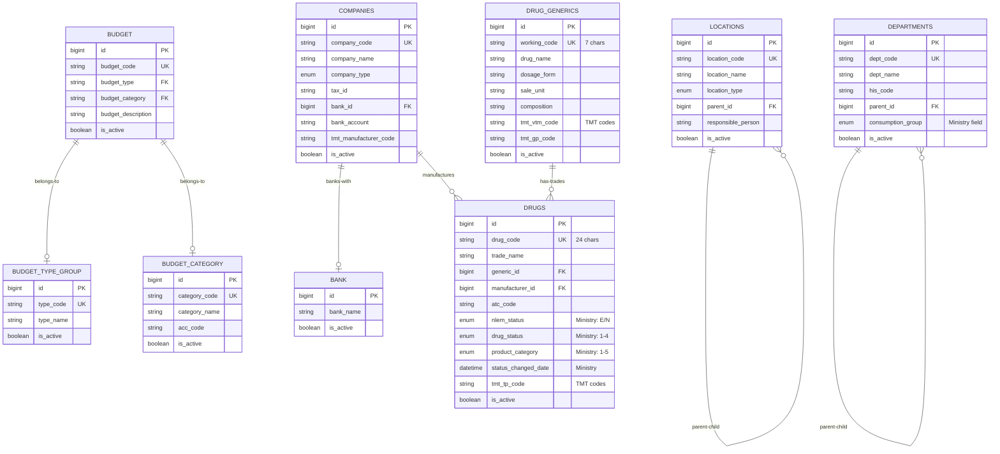
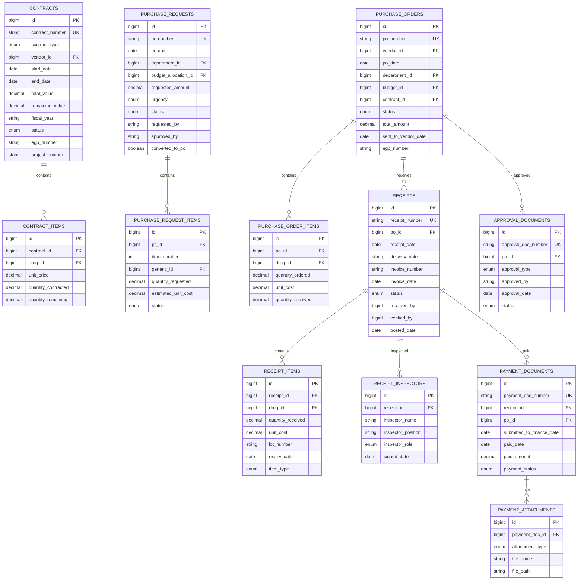

# 🗄️ INVS Modern - Database Structure

**Complete Database Schema Documentation**

**Version:** 2.4.0
**Last Updated:** 2025-01-22
**Database:** PostgreSQL 15-alpine
**ORM:** Prisma
**Data Status:** 3,152 records migrated (Phase 1-4) 🔓

---

## 📊 Database Statistics

```yaml
Total Tables: 52 ⭐ (+16 from base 36)
Total Enums: 22
Total Views: 11
Total Functions: 12
Ministry Compliance: ✅ 100% (79/79 fields)
Data Migrated: 3,152 records (Phase 1-4)
```

---

## 📋 Table of Contents

1. [Database Overview](#database-overview)
2. [Complete ER Diagram](#complete-er-diagram)
3. [System-by-System Details](#system-by-system-details)
4. [Cross-System Relationships](#cross-system-relationships)
5. [Database Functions](#database-functions)
6. [Database Views](#database-views)
7. [Enums Reference](#enums-reference)

---

## 🎯 Database Overview

### Tables Grouped by System

| System                   | Tables    | Description                                                                                                                                                                                                                                                                    |
| ------------------------ | --------- | ------------------------------------------------------------------------------------------------------------------------------------------------------------------------------------------------------------------------------------------------------------------------------ |
| 🏢 **Master Data**       | **12** ⭐ | locations, departments, budget_types, budget_categories, budgets, bank, companies, drug_generics, drugs, drug_pack_ratios, drug_components, drug_focus_lists                                                                                                                   |
| 💰 **Budget Management** | 4         | budget_allocations, budget_plans, budget_plan_items, budget_reservations                                                                                                                                                                                                       |
| 🛒 **Procurement**       | **15** ⭐ | contracts, contract_items, purchase_requests, purchase_request_items, purchase_orders, purchase_order_items, receipts, receipt_items, receipt_inspectors, approval_documents, payment_documents, payment_attachments, purchase_methods, purchase_types, purchase_order_reasons |
| 📦 **Inventory**         | 3         | inventory, drug_lots, inventory_transactions                                                                                                                                                                                                                                   |
| 🏥 **Distribution**      | **3** ⭐  | drug_distributions, drug_distribution_items, distribution_types                                                                                                                                                                                                                |
| 🔄 **Drug Return**       | **3** ⭐  | drug_returns, drug_return_items, return_reasons                                                                                                                                                                                                                                |
| 🔗 **TMT Integration**   | 10        | tmt_concepts, tmt_relationships, tmt_mappings, tmt_attributes, tmt_manufacturers, tmt_dosage_forms, tmt_units, his_drug_master, tmt_usage_stats, ministry_reports                                                                                                              |
| 🏥 **HPP System**        | 2         | hospital_pharmaceutical_products, hpp_formulations                                                                                                                                                                                                                             |
| **TOTAL**                | **52** ⭐ | **+16 tables from base 36**                                                                                                                                                                                                                                                    |

---

## 🗺️ Complete ER Diagram

### High-Level System Relationships


---

## 📚 System-by-System Details

### 1️⃣ Master Data Management (9 Tables)



**Ministry Compliance Fields:**

- `drugs.nlem_status` - สถานะยาในบัญชียาหลักแห่งชาติ (E=ในบัญชี, N=นอกบัญชี)
- `drugs.drug_status` - สถานะการใช้งาน (1=ใช้งาน, 2=ตัดแต่มีเหลือ, 3=เฉพาะราย, 4=ตัดหมด)
- `drugs.product_category` - ประเภทผลิตภัณฑ์ (1=ยาปัจจุบันทะเบียน, 2=ยาโรงพยาบาล, 3=สมุนไพรทะเบียน, 4=สมุนไพรโรงพยาบาล, 5=อื่นๆ)
- `drugs.status_changed_date` - วันที่เปลี่ยนสถานะ
- `departments.consumption_group` - กลุ่มหน่วยงานตามรูปแบบการใช้ยา (1-9)

---

### 2️⃣ Budget Management (4 Tables)


**Key Features:**

- Quarterly budget tracking (Q1-Q4)
- Drug-level planning with 3-year historical data
- Budget reservation system for PR approval
- Automatic budget commitment on PO

---

### 3️⃣ Procurement System (12 Tables)



**Workflow States:**

- **PR:** draft → submitted → approved → converted
- **PO:** draft → pending → approved → sent → received → closed
- **Receipt:** draft → received → pending_verification → verified → posted
- **Payment:** pending → submitted → approved → paid

---

### 4️⃣ Inventory Management (3 Tables)


**Transaction Types:**

- `RECEIVE` - รับเข้า (from receipt)
- `ISSUE` - เบิกออก (distribution)
- `TRANSFER` - โอนระหว่าง location
- `ADJUST` - ปรับปรุง (count adjustment)
- `RETURN` - รับคืน (return from department)

**Key Features:**

- Multi-location inventory tracking
- FIFO/FEFO lot management
- Min/max/reorder point alerts
- Complete audit trail

---

### 5️⃣ Distribution System (2 Tables)


**Status Flow:** pending → approved → dispensed → completed

---

### 6️⃣ Drug Return System (2 Tables)


**Return Types:**

- `PURCHASED` - ยาที่ซื้อมา
- `FREE` - ยาแจกฟรี

**Status Flow:** draft → submitted → verified → posted → cancelled

---

### 7️⃣ TMT Integration (10 Tables)


**TMT Hierarchy Levels:**

```
SUBS → VTM → GP → TP → GPU → TPU → GPP → TPP → GP-F → GP-X
```

**25,991 TMT Concepts** loaded for ministry compliance

---

### 8️⃣ HPP System (2 Tables)


**HPP Types:**

- `R` - Repackaged (บรรจุใหม่)
- `M` - Modified (ดัดแปลง)
- `F` - Hospital Formula (สูตรโรงพยาบาล)
- `X` - Extemporaneous (ผสมตามสั่ง)
- `OHPP` - Outsourced (จ้างผลิตภายนอก)

---

## 🔗 Cross-System Relationships

### Foreign Key Matrix

| From System  | From Table                       | To System   | To Table          | Relationship       |
| ------------ | -------------------------------- | ----------- | ----------------- | ------------------ |
| Budget       | budget_allocations               | Master Data | budgets           | Which budget type  |
| Budget       | budget_allocations               | Master Data | departments       | Budget owner       |
| Budget       | budget_plan_items                | Master Data | drug_generics     | Plan by generic    |
| Budget       | budget_reservations              | Procurement | purchase_requests | Reserve for PR     |
| Procurement  | purchase_requests                | Master Data | departments       | Requesting dept    |
| Procurement  | purchase_orders                  | Master Data | companies         | Vendor             |
| Procurement  | purchase_orders                  | Procurement | contracts         | Under contract     |
| Procurement  | purchase_order_items             | Master Data | drugs             | Which drug         |
| Procurement  | receipts                         | Procurement | purchase_orders   | From PO            |
| Inventory    | inventory                        | Master Data | drugs             | Which drug         |
| Inventory    | inventory                        | Master Data | locations         | Where stored       |
| Inventory    | drug_lots                        | Procurement | receipts          | Created from       |
| Distribution | drug_distributions               | Master Data | locations         | From/To location   |
| Distribution | drug_distributions               | Master Data | departments       | Requesting dept    |
| Distribution | drug_distribution_items          | Master Data | drugs             | Which drug         |
| Return       | drug_returns                     | Master Data | departments       | Returning dept     |
| Return       | drug_return_items                | Master Data | drugs             | Which drug         |
| Return       | drug_return_items                | Master Data | locations         | Return to location |
| TMT          | tmt_mappings                     | Master Data | drug_generics     | Map generic        |
| TMT          | tmt_mappings                     | Master Data | drugs             | Map trade drug     |
| HPP          | hospital_pharmaceutical_products | Master Data | drug_generics     | Base generic       |
| HPP          | hospital_pharmaceutical_products | Master Data | drugs             | Base drug          |

---

## ⚡ Database Functions

### Budget Management Functions (6)

```sql
-- Check if budget is available
check_budget_availability(
    fiscal_year INT,
    budget_type_id BIGINT,
    department_id BIGINT,
    amount DECIMAL,
    quarter INT
) RETURNS TABLE(available BOOLEAN, remaining DECIMAL)

-- Reserve budget for PR (expires after N days)
reserve_budget(
    allocation_id BIGINT,
    pr_id BIGINT,
    amount DECIMAL,
    expires_days INT DEFAULT 30
) RETURNS BIGINT

-- Commit budget when PO approved
commit_budget(
    allocation_id BIGINT,
    po_id BIGINT,
    amount DECIMAL,
    quarter INT
) RETURNS BOOLEAN

-- Release expired/cancelled reservations
release_budget_reservation(
    reservation_id BIGINT
) RETURNS BOOLEAN

-- Check if drug in budget plan
check_drug_in_budget_plan(
    fiscal_year INT,
    department_id BIGINT,
    generic_id BIGINT,
    requested_qty DECIMAL,
    quarter INT
) RETURNS TABLE(in_plan BOOLEAN, remaining_qty DECIMAL)

-- Update budget plan purchased amounts
update_budget_plan_purchase(
    plan_item_id BIGINT,
    quantity DECIMAL,
    value DECIMAL,
    quarter INT
) RETURNS BOOLEAN
```

### Inventory Management Functions (3)

```sql
-- Get lots in FIFO order (oldest first)
get_fifo_lots(
    drug_id BIGINT,
    location_id BIGINT,
    quantity_needed DECIMAL
) RETURNS TABLE(lot_id BIGINT, lot_number VARCHAR, quantity DECIMAL, unit_cost DECIMAL)

-- Get lots in FEFO order (expires first)
get_fefo_lots(
    drug_id BIGINT,
    location_id BIGINT,
    quantity_needed DECIMAL
) RETURNS TABLE(lot_id BIGINT, lot_number VARCHAR, expiry_date DATE, quantity DECIMAL)

-- Auto-update inventory when receipt posted
update_inventory_from_receipt(
    receipt_id BIGINT
) RETURNS BOOLEAN
```

### Utility Functions (3)

Additional utility functions for data validation and calculations.

---

## 📊 Database Views

### Ministry Export Views (5)

```sql
-- 1. DRUGLIST - บัญชีรายการยา (11 fields)
CREATE VIEW export_druglist AS
SELECT
    d.drug_code AS DRUGCODE,
    d.trade_name AS DRUGNAME,
    dg.working_code AS WORKINGCODE,
    d.nlem_status AS NLEM,
    d.drug_status AS STATUS,
    d.status_changed_date AS STATUSDATE,
    d.product_category AS PRODUCT_CAT,
    -- ... (11 fields total)
FROM drugs d
LEFT JOIN drug_generics dg ON d.generic_id = dg.id;

-- 2. PURCHASEPLAN - แผนจัดซื้อ (20 fields)
CREATE VIEW export_purchase_plan AS
SELECT
    bp.fiscal_year AS YEAR,
    d.dept_code AS DEPTCODE,
    dg.working_code AS WORKINGCODE,
    bpi.planned_quantity AS PLANQTY,
    -- ... (20 fields total)
FROM budget_plan_items bpi
JOIN budget_plans bp ON bpi.budget_plan_id = bp.id;

-- 3. RECEIPT - การรับยา (22 fields)
CREATE VIEW export_receipt AS
SELECT
    r.receipt_number AS RECEIPTNO,
    r.receipt_date AS RECEIPTDATE,
    po.po_number AS PONO,
    -- ... (22 fields total)
FROM receipts r
JOIN purchase_orders po ON r.po_id = po.id;

-- 4. DISTRIBUTION - การจ่ายยา (11 fields)
CREATE VIEW export_distribution AS
SELECT
    dd.distribution_number AS DISTNO,
    dd.distribution_date AS DISTDATE,
    dept.dept_code AS DEPTCODE,
    dept.consumption_group AS DEPT_TYPE,
    -- ... (11 fields total)
FROM drug_distributions dd
JOIN departments dept ON dd.requesting_dept_id = dept.id;

-- 5. INVENTORY - ยาคงคลัง (15 fields)
CREATE VIEW export_inventory AS
SELECT
    d.drug_code AS DRUGCODE,
    l.location_code AS LOCCODE,
    i.quantity_on_hand AS QTY,
    -- ... (15 fields total)
FROM inventory i
JOIN drugs d ON i.drug_id = d.id
JOIN locations l ON i.location_id = l.id;
```

**Total:** 79 fields = **100% Ministry Compliance** ✅

### Operational Views (6)

```sql
-- Budget status by department
CREATE VIEW budget_status_current AS
SELECT
    ba.fiscal_year,
    d.dept_name,
    bt.type_name,
    ba.total_budget,
    ba.total_spent,
    ba.remaining_budget,
    ROUND((ba.total_spent / ba.total_budget * 100), 2) AS percent_used
FROM budget_allocations ba
JOIN departments d ON ba.department_id = d.id
JOIN budgets b ON ba.budget_id = b.id
JOIN budget_types bt ON b.budget_type = bt.type_code;

-- Drugs approaching expiry (within 90 days)
CREATE VIEW expiring_drugs AS
SELECT
    d.drug_code,
    d.trade_name,
    dl.lot_number,
    dl.expiry_date,
    dl.quantity_available,
    l.location_name,
    (dl.expiry_date - CURRENT_DATE) AS days_to_expiry
FROM drug_lots dl
JOIN drugs d ON dl.drug_id = d.id
JOIN locations l ON dl.location_id = l.id
WHERE dl.expiry_date <= CURRENT_DATE + INTERVAL '90 days'
  AND dl.quantity_available > 0;

-- Low stock items
CREATE VIEW low_stock_items AS
SELECT
    d.drug_code,
    d.trade_name,
    l.location_name,
    i.quantity_on_hand,
    i.reorder_point,
    i.min_level
FROM inventory i
JOIN drugs d ON i.drug_id = d.id
JOIN locations l ON i.location_id = l.id
WHERE i.quantity_on_hand <= i.reorder_point;

-- Stock summary by location
CREATE VIEW current_stock_summary AS
SELECT
    l.location_name,
    COUNT(DISTINCT i.drug_id) AS total_drugs,
    SUM(i.quantity_on_hand) AS total_quantity,
    SUM(i.quantity_on_hand * i.average_cost) AS total_value
FROM inventory i
JOIN locations l ON i.location_id = l.id
GROUP BY l.id, l.location_name;

-- Active budget reservations
CREATE VIEW budget_reservations_active AS
SELECT
    br.id,
    pr.pr_number,
    d.dept_name,
    br.reserved_amount,
    br.reservation_date,
    br.expires_date,
    (br.expires_date - CURRENT_DATE) AS days_remaining
FROM budget_reservations br
JOIN purchase_requests pr ON br.pr_id = pr.id
JOIN departments d ON pr.department_id = d.id
WHERE br.status = 'active'
  AND br.expires_date >= CURRENT_DATE;

-- Purchase order status dashboard
CREATE VIEW purchase_order_status AS
SELECT
    po.po_number,
    po.po_date,
    c.company_name AS vendor,
    d.dept_name,
    po.total_amount,
    po.status,
    COUNT(poi.id) AS total_items,
    SUM(poi.quantity_received) AS items_received,
    CASE
        WHEN SUM(poi.quantity_ordered) = SUM(poi.quantity_received) THEN 'Complete'
        WHEN SUM(poi.quantity_received) > 0 THEN 'Partial'
        ELSE 'Pending'
    END AS delivery_status
FROM purchase_orders po
JOIN companies c ON po.vendor_id = c.id
LEFT JOIN departments d ON po.department_id = d.id
LEFT JOIN purchase_order_items poi ON po.id = poi.po_id
GROUP BY po.id, c.company_name, d.dept_name;
```

---

## 🏷️ Enums Reference

### Total: 22 Enums

#### System Operation Enums (11)

1. **LocationType** - warehouse, pharmacy, ward, emergency, laboratory, operating_room
2. **CompanyType** - vendor, manufacturer, both
3. **TransactionType** - receive, issue, transfer, adjust, return
4. **BudgetStatus** - active, inactive, locked
5. **ReservationStatus** - active, released, committed
6. **Urgency** - urgent, normal, low
7. **RequestStatus** - draft, submitted, approved, rejected, converted
8. **ItemStatus** - pending, approved, rejected
9. **PoStatus** - draft, pending, approved, sent, received, closed
10. **ReceiptStatus** - draft, received, pending_verification, verified, posted
11. **DistributionStatus** - pending, approved, dispensed, cancelled, completed

#### Procurement System Enums (6)

12. **ContractType** - e_bidding, price_agreement, quotation, special
13. **ContractStatus** - draft, active, expired, cancelled
14. **InspectorRole** - chairman, member, secretary
15. **ApprovalType** - normal, urgent, special
16. **ApprovalStatus** - pending, approved, rejected, cancelled
17. **PaymentStatus** - pending, submitted, approved, paid, cancelled
18. **PurchaseItemType** - normal, urgent, replacement, emergency
19. **AttachmentType** - purchase_order, receipt, invoice, inspection_report, delivery_note, other

#### Ministry Compliance Enums (4) ⭐ NEW v2.2.0

20. **NlemStatus** - E (Essential), N (Non-Essential)
21. **DrugStatus** - 1 (Active), 2 (Discontinued), 3 (Special case), 4 (Removed)
22. **ProductCategory** - 1 (Modern registered), 2 (Modern hospital), 3 (Herbal registered), 4 (Herbal hospital), 5 (Other)
23. **DeptConsumptionGroup** - 1-9 (OPD/IPD mix, OPD mainly, IPD mainly, etc.)

#### TMT System Enums (2)

24. **TmtLevel** - SUBS, VTM, GP, TP, GPU, TPU, GPP, TPP, GP-F, GP-X
25. **HppType** - R (Repackaged), M (Modified), F (Formula), X (Extemporaneous), OHPP (Outsourced)
26. **TmtRelationType** - IS_A, HAS_ACTIVE_INGREDIENT, HAS_DOSE_FORM, etc.
27. **HisMappingStatus** - pending, mapped, verified, rejected

#### Other Enums (2)

28. **ReturnStatus** - draft, submitted, verified, posted, cancelled
29. **ReturnType** - purchased, free
30. **BudgetPlanStatus** - draft, submitted, approved, rejected, active, closed

---

## 🎯 Database Indexes

**Auto-generated by Prisma:**

- Primary keys (id columns)
- Unique constraints (code columns)
- Foreign keys

**Custom Indexes:**

- `departments.his_code` - HIS integration lookup
- All `@unique` fields in schema

---

## 📈 Database Performance

### Table Size Estimates

| Table                  | Estimated Rows/Year | Growth Rate |
| ---------------------- | ------------------- | ----------- |
| tmt_concepts           | 25,991 (static)     | Static      |
| drugs                  | 1,000-5,000         | Low         |
| drug_generics          | 500-2,000           | Low         |
| companies              | 50-200              | Low         |
| purchase_orders        | 500-2,000           | Medium      |
| receipts               | 500-2,000           | Medium      |
| inventory_transactions | 10,000-50,000       | High        |
| drug_distributions     | 2,000-10,000        | High        |
| budget_plan_items      | 1,000-5,000         | Medium      |

### Partitioning Recommendations

**High-volume tables** (future consideration):

- `inventory_transactions` - Partition by created_at (monthly)
- `tmt_usage_stats` - Partition by period_date (quarterly)
- `ministry_reports` - Partition by report_period (yearly)

---

## 🔒 Data Integrity Rules

### Cascade Rules

**ON DELETE CASCADE:**

- `contract_items` → `contracts`
- `budget_plan_items` → `budget_plans`
- `purchase_request_items` → `purchase_requests`
- `purchase_order_items` → `purchase_orders`
- `receipt_items` → `receipts`
- `drug_distribution_items` → `drug_distributions`
- `drug_return_items` → `drug_returns`
- `hpp_formulations` → `hospital_pharmaceutical_products`

**PROTECT (No cascade):**

- `drugs` - Cannot delete if used in inventory
- `companies` - Cannot delete if has purchase orders
- `budget_allocations` - Cannot delete if has reservations

### Unique Constraints

All business documents have unique codes:

- `drug_generics.working_code` (7 chars)
- `drugs.drug_code` (24 chars)
- `purchase_requests.pr_number`
- `purchase_orders.po_number`
- `receipts.receipt_number`
- `contracts.contract_number`
- `drug_distributions.distribution_number`
- `drug_returns.return_number`

---

## 📚 Related Documentation

- [SYSTEM_ARCHITECTURE.md](SYSTEM_ARCHITECTURE.md) - System overview
- [END_TO_END_WORKFLOWS.md](END_TO_END_WORKFLOWS.md) - Data flows
- `prisma/schema.prisma` - Source schema definition
- `prisma/functions.sql` - Function implementations
- `prisma/views.sql` - View definitions

---

**Built with ❤️ for INVS Modern Team**
**Last Updated:** 2025-01-22 | **Version:** 2.2.0
