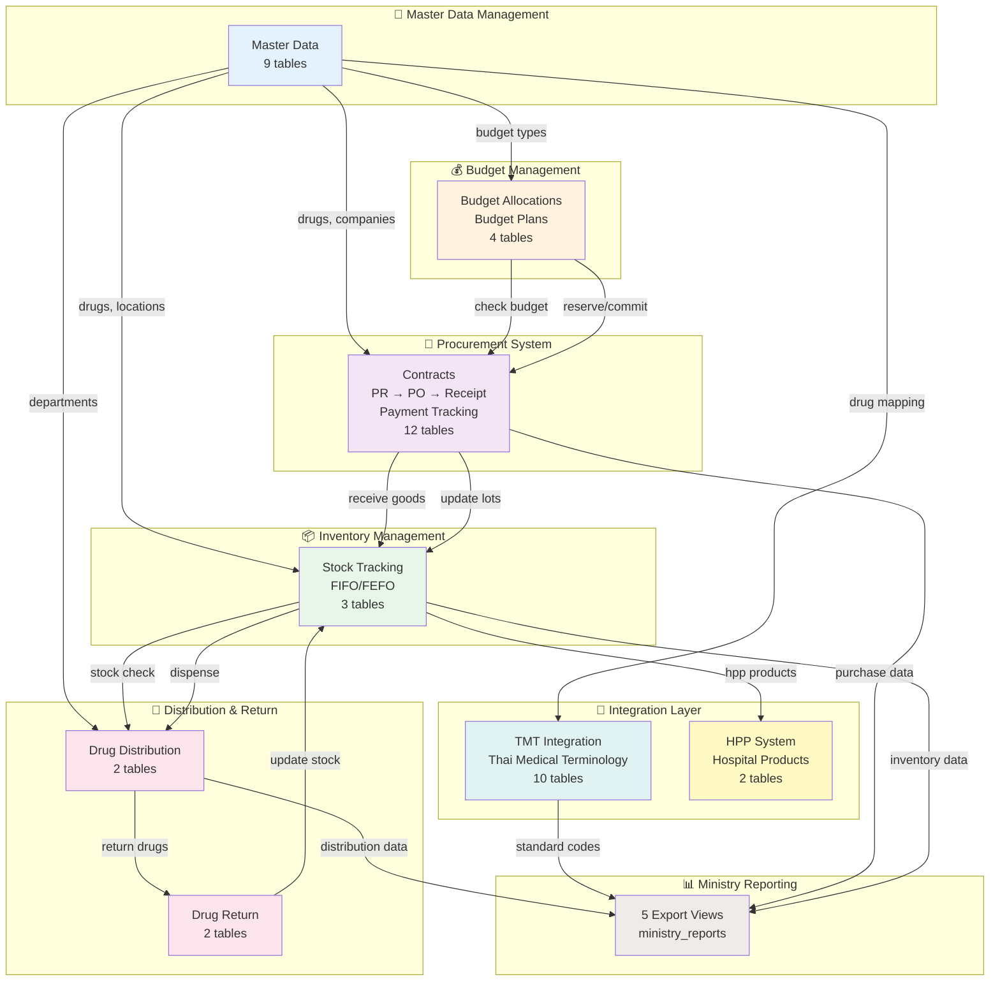
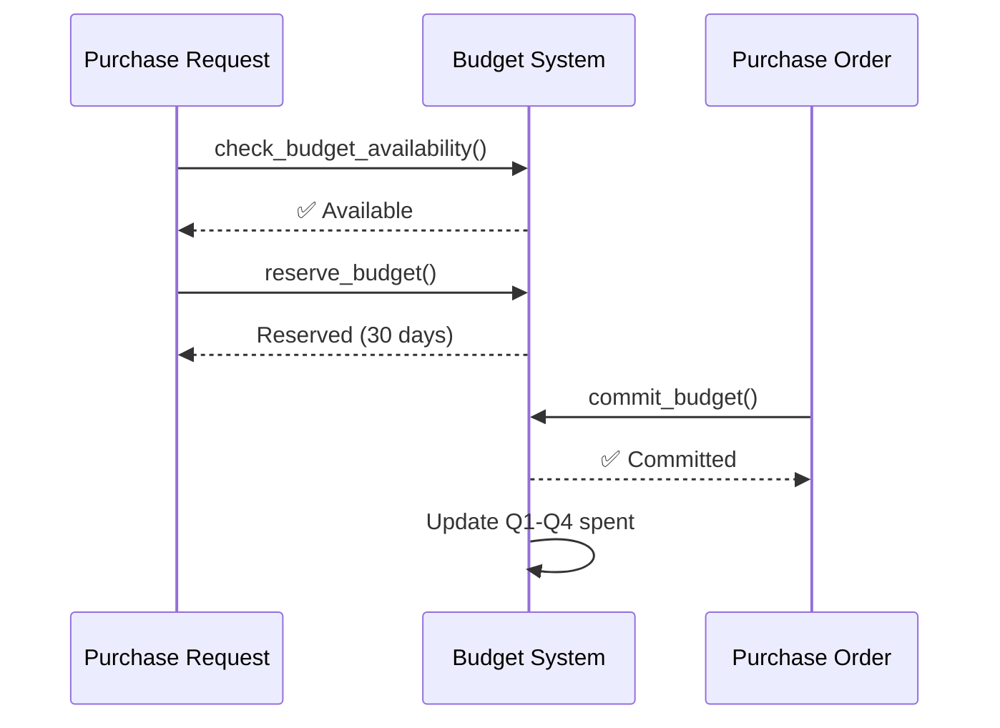
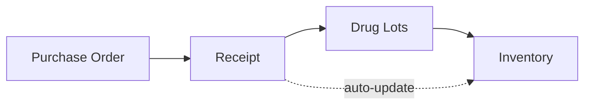
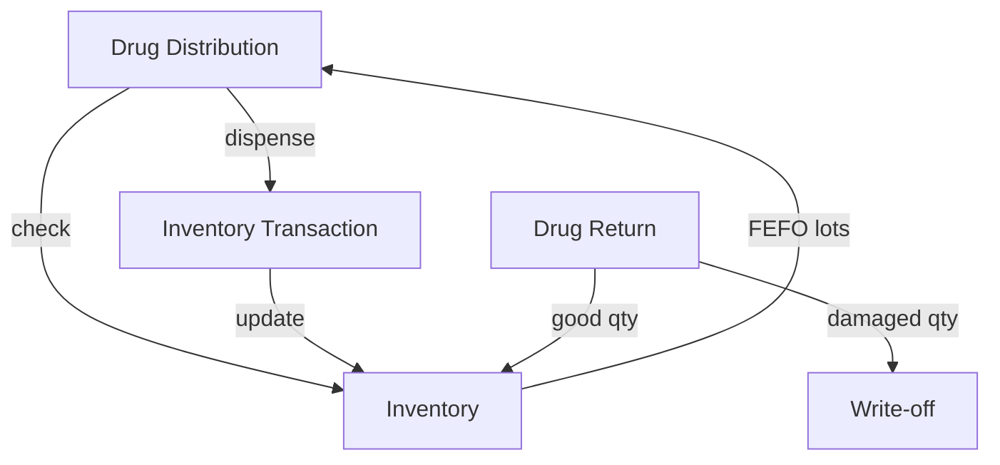
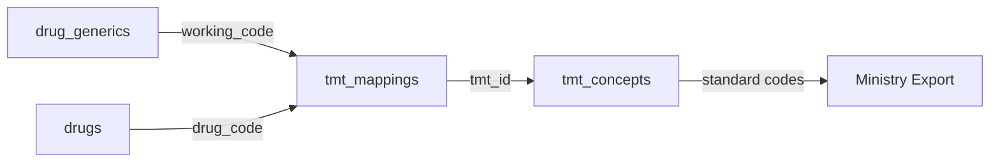
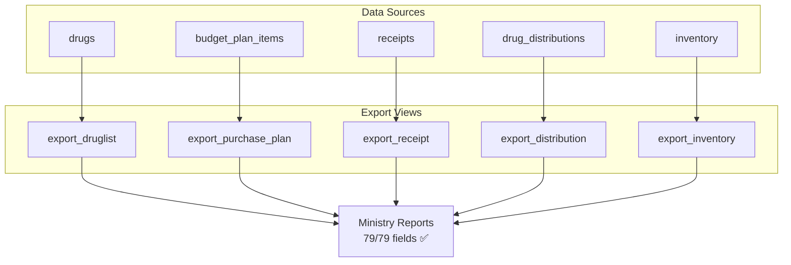

# 🏗️ INVS Modern - System Architecture

**ภาพรวมระบบงานคลังยาโรงพยาบาล (Hospital Drug Inventory Management System)**

**Version:** 2.4.0
**Last Updated:** 2025-01-22
**Database:** PostgreSQL 15 (52 tables, 22 enums, 11 views, 12 functions)
**Data Status:** 3,152 records migrated (Phase 1-4) 🔓
**Ministry Compliance:** ✅ 100% (79/79 fields) 🎉

---

## 📋 Table of Contents

1. [System Overview](#system-overview)
2. [8 Core Systems](#8-core-systems)
3. [System Architecture Diagram](#system-architecture-diagram)
4. [Integration Points](#integration-points)
5. [Data Flow Summary](#data-flow-summary)
6. [Technology Stack](#technology-stack)

---

## 🎯 System Overview

INVS Modern ประกอบด้วย **8 ระบบหลัก** ที่ทำงานร่วมกันครอบคลุมทุกขั้นตอนของการจัดการคลังยา:

```
Master Data → Budget → Procurement → Inventory → Distribution → Return
                                        ↓
                            TMT Integration + HPP System
                                        ↓
                              Ministry Reporting
```

### ✨ Key Features

- ✅ **100% Ministry Compliance** - ตามมาตรฐาน DMSIC พ.ศ. 2568
- ✅ **Real-time Budget Control** - ตรวจสอบงบประมาณแบบ real-time
- ✅ **FIFO/FEFO Management** - จัดการยาตามล็อตและวันหมดอายุ
- ✅ **Thai Medical Terminology** - รองรับ TMT 25,991 concepts
- ✅ **Multi-location Support** - รองรับหลายคลังพร้อมกัน
- ✅ **Complete Audit Trail** - บันทึกทุกการเปลี่ยนแปลง

---

## 🏢 8 Core Systems

### 1️⃣ Master Data Management

**Tables:** 9 tables
**Priority:** ⭐⭐⭐ สูงสุด
**Status:** ✅ Production Ready

**Responsibility:**

- จัดการข้อมูลพื้นฐาน (Locations, Departments, Companies)
- จัดการข้อมูลยา (Drug Generics, Trade Drugs)
- จัดการประเภทงบประมาณ (Budget Types, Categories)

**Key Tables:**

- `locations` - สถานที่จัดเก็บยา (warehouse, pharmacy, ward)
- `departments` - หน่วยงาน (with budget codes & consumption groups)
- `companies` - ผู้ผลิต/จำหน่าย (vendors, manufacturers)
- `drug_generics` - ยาสามัญ (generic catalog with TMT codes)
- `drugs` - ยาการค้า (trade drugs with ministry compliance fields)
- `budget_types`, `budget_categories`, `budgets` - โครงสร้างงบประมาณ
- `bank` - ธนาคารสำหรับข้อมูลบริษัท

**Ministry Compliance:**

- `drugs.nlem_status` - สถานะยาในบัญชียาหลักแห่งชาติ (E/N)
- `drugs.drug_status` - สถานะการใช้งานยา (1-4)
- `drugs.product_category` - ประเภทผลิตภัณฑ์ (1-5)
- `departments.consumption_group` - กลุ่มหน่วยงาน (1-9)

---

### 2️⃣ Budget Management System

**Tables:** 4 tables
**Priority:** ⭐⭐⭐ สูง
**Status:** ✅ Production Ready

**Responsibility:**

- จัดสรรงบประมาณรายปี (แบ่งตามไตรมาส Q1-Q4)
- ตรวจสอบงบประมาณคงเหลือแบบ real-time
- จองงบประมาณสำหรับ Purchase Request
- วางแผนงบประมาณระดับยา (พร้อมข้อมูลย้อนหลัง 3 ปี)

**Key Tables:**

- `budget_allocations` - จัดสรรงบประมาณรายปี (quarterly breakdown)
- `budget_reservations` - จองงบประมาณชั่วคราว (for PR)
- `budget_plans` - แผนงบประมาณระดับหน่วยงาน
- `budget_plan_items` - แผนงบประมาณระดับยา (with 3-year history)

**Key Functions:**

```sql
check_budget_availability(fiscal_year, budget_type, dept, amount, quarter)
reserve_budget(allocation_id, pr_id, amount, expires_days)
commit_budget(allocation_id, po_id, amount, quarter)
release_budget_reservation(reservation_id)
check_drug_in_budget_plan(fiscal_year, dept, generic_id, qty, quarter)
update_budget_plan_purchase(plan_item_id, qty, value, quarter)
```

---

### 3️⃣ Procurement System

**Tables:** 12 tables
**Priority:** ⭐⭐⭐ สูงสุด
**Status:** ✅ Production Ready

**Responsibility:**

- บริหารสัญญาจัดซื้อ (Contracts)
- จัดการคำขอซื้อ (Purchase Requests) พร้อม approval workflow
- สร้างใบสั่งซื้อ (Purchase Orders)
- รับของและตรวจรับ (Receipts with inspection committee)
- ติดตามการจ่ายเงิน (Payment tracking)

**Key Tables:**

- `contracts`, `contract_items` - สัญญาจัดซื้อ
- `purchase_requests`, `purchase_request_items` - คำขอซื้อ
- `purchase_orders`, `purchase_order_items` - ใบสั่งซื้อ
- `receipts`, `receipt_items` - ใบรับของ
- `receipt_inspectors` - คณะกรรมการตรวจรับ
- `approval_documents` - เอกสารอนุมัติ
- `payment_documents`, `payment_attachments` - การจ่ายเงิน

**Workflow:**

```
Contract → PR (draft→submitted→approved) → PO (draft→sent→received)
→ Receipt (draft→verified→posted) → Payment (pending→paid)
```

---

### 4️⃣ Inventory Management System

**Tables:** 3 tables
**Priority:** ⭐⭐⭐ สูง
**Status:** ✅ Production Ready

**Responsibility:**

- ติดตามสต็อกยาตาม location
- จัดการล็อตยา (FIFO/FEFO)
- บันทึก transaction ทุกรายการ
- แจ้งเตือนยาใกล้หมด/หมดอายุ

**Key Tables:**

- `inventory` - สต็อกยาแต่ละ location (with min/max levels)
- `drug_lots` - ล็อตยา (lot number, expiry date, FIFO/FEFO)
- `inventory_transactions` - ประวัติการเคลื่อนไหว (receive, issue, transfer, adjust, return)

**Key Functions:**

```sql
get_fifo_lots(drug_id, location_id, quantity_needed)
get_fefo_lots(drug_id, location_id, quantity_needed)
update_inventory_from_receipt(receipt_id)
```

**Key Views:**

```sql
low_stock_items        -- ยาใกล้หมด
expiring_drugs         -- ยาใกล้หมดอายุ
current_stock_summary  -- สรุปสต็อกตาม location
```

---

### 5️⃣ Drug Distribution System

**Tables:** 2 tables
**Priority:** ⭐⭐ ปานกลาง
**Status:** ✅ Production Ready

**Responsibility:**

- จ่ายยาให้หน่วยงาน
- ตรวจสอบสต็อกก่อนจ่าย
- เลือกล็อตตาม FEFO
- อัปเดต inventory อัตโนมัติ

**Key Tables:**

- `drug_distributions` - ใบเบิกยา (pending→approved→dispensed→completed)
- `drug_distribution_items` - รายการยาที่เบิก

**Workflow:**

```
Request → Check Stock → Approve → Dispense (FEFO) → Update Inventory
```

---

### 6️⃣ Drug Return System

**Tables:** 2 tables
**Priority:** ⭐⭐ ปานกลาง
**Status:** ✅ Production Ready

**Responsibility:**

- รับคืนยาจากหน่วยงาน
- แยกประเภท (ดี/เสียหาย)
- บันทึกสาเหตุการคืน
- อัปเดต inventory

**Key Tables:**

- `drug_returns` - ใบรับคืนยา (draft→submitted→verified→posted)
- `drug_return_items` - รายการยาที่คืน (good qty, damaged qty)

**Return Types:**

- `PURCHASED` - ยาซื้อมา
- `FREE` - ยาแจกฟรี

---

### 7️⃣ TMT Integration System

**Tables:** 10 tables
**Priority:** ⭐⭐ ปานกลาง
**Status:** ✅ Production Ready (25,991 concepts loaded)

**Responsibility:**

- รองรับ Thai Medical Terminology (TMT)
- แปลงรหัสยาไปเป็น standard codes
- เชื่อมกับ HIS (Hospital Information System)
- รองรับมาตรฐานกระทรวงสาธารณสุข

**Key Tables:**

- `tmt_concepts` - TMT concepts (25,991 records)
- `tmt_relationships` - ความสัมพันธ์ TMT hierarchy
- `tmt_mappings` - mapping ยาเข้ากับ TMT
- `tmt_attributes` - คุณสมบัติเพิ่มเติม
- `tmt_manufacturers`, `tmt_dosage_forms`, `tmt_units` - Master data TMT
- `his_drug_master` - ยาจาก HIS
- `tmt_usage_stats` - สถิติการใช้งาน
- `ministry_reports` - รายงานกระทรวง

**TMT Hierarchy:**

```
SUBS → VTM → GP → TP → GPU → TPU → GPP → TPP
       (Generic)  (Trade Product)
```

---

### 8️⃣ HPP System (Hospital Pharmaceutical Products)

**Tables:** 2 tables
**Priority:** ⭐ ต่ำ
**Status:** ✅ Production Ready

**Responsibility:**

- ผลิตภัณฑ์ยาที่ผลิตในโรงพยาบาล
- สูตรยาผสม (formulations)
- ยาบรรจุใหม่, ยาดัดแปลง

**Key Tables:**

- `hospital_pharmaceutical_products` - ผลิตภัณฑ์ HPP
- `hpp_formulations` - สูตรผสมยา

**HPP Types:**

- `R` - Repackaged (บรรจุใหม่)
- `M` - Modified (ดัดแปลง)
- `F` - Hospital Formula (สูตรโรงพยาบาล)
- `X` - Extemporaneous (ยาผสมตามสั่ง)
- `OHPP` - Outsourced (จ้างภายนอก)

---

## 🔗 System Architecture Diagram



---

## 🔌 Integration Points

### 1. Master Data ↔ All Systems

**Type:** Reference Data
**Direction:** Master Data → Other Systems

| From Table      | To System       | To Table               | Relationship        |
| --------------- | --------------- | ---------------------- | ------------------- |
| `drugs`         | Procurement     | `purchase_order_items` | Which drug to order |
| `companies`     | Procurement     | `purchase_orders`      | Which vendor        |
| `locations`     | Inventory       | `inventory`            | Where to store      |
| `departments`   | Budget          | `budget_allocations`   | Budget owner        |
| `drug_generics` | Budget Planning | `budget_plan_items`    | Plan by generic     |

---

### 2. Budget ↔ Procurement

**Type:** Business Logic
**Direction:** Bidirectional



**Key Functions:**

- `check_budget_availability()` - ตรวจสอบงบก่อนสร้าง PR
- `reserve_budget()` - จองงบเมื่อ PR approved
- `commit_budget()` - หักงบจริงเมื่อ PO confirmed

---

### 3. Procurement ↔ Inventory

**Type:** Data Flow
**Direction:** Procurement → Inventory



**Trigger:** เมื่อ receipt status = `POSTED`
**Function:** `update_inventory_from_receipt(receipt_id)`
**Actions:**

1. สร้าง `drug_lots` (lot number, expiry date)
2. อัปเดต `inventory.quantity_on_hand`
3. บันทึก `inventory_transactions` (type: RECEIVE)

---

### 4. Inventory ↔ Distribution

**Type:** Stock Movement
**Direction:** Bidirectional



**Distribution Flow:**

1. Check `inventory.quantity_on_hand`
2. Get lots via `get_fefo_lots()`
3. Create `inventory_transactions` (type: ISSUE)
4. Update `inventory`

**Return Flow:**

1. Separate good/damaged quantity
2. Create `inventory_transactions` (type: RETURN)
3. Update `inventory` (good qty only)

---

### 5. All Systems → TMT Integration

**Type:** Code Mapping
**Direction:** Unidirectional



**Purpose:** แปลงรหัสยาในระบบเป็น standard codes ตามมาตรฐานกระทรวง

---

### 6. All Systems → Ministry Reporting

**Type:** Data Export
**Direction:** Unidirectional



**5 Export Files:**

1. **DRUGLIST** - บัญชีรายการยา (11 fields)
2. **PURCHASEPLAN** - แผนจัดซื้อ (20 fields)
3. **RECEIPT** - การรับยา (22 fields)
4. **DISTRIBUTION** - การจ่ายยา (11 fields)
5. **INVENTORY** - ยาคงคลัง (15 fields)

**Total:** 79/79 fields - **100% Ministry Compliance** ✅

---

## 📊 Data Flow Summary

### End-to-End Procurement Cycle

```
1. Master Data Setup (locations, departments, budget types, drugs, companies)
                ↓
2. Budget Planning (allocate Q1-Q4, plan drug quantities)
                ↓
3. Purchase Request (select drugs, check budget, reserve budget)
                ↓
4. Purchase Order (select vendor, commit budget, send to vendor)
                ↓
5. Goods Receipt (verify items, record lots, inspect committee)
                ↓
6. Inventory Update (create lots, update stock, FIFO/FEFO)
                ↓
7. Drug Distribution (dispense to departments via FEFO)
                ↓
8. Drug Return (receive returns, update stock)
                ↓
9. Ministry Reporting (export 5 files via TMT mapping)
```

### Critical Business Rules

1. **Budget Control:**
   - ✅ Must check budget BEFORE creating PR
   - ✅ Budget reserved for 30 days (configurable)
   - ✅ Budget committed when PO confirmed
   - ✅ Quarterly tracking (Q1-Q4)

2. **Inventory Management:**
   - ✅ FIFO for costing (first in, first out)
   - ✅ FEFO for dispensing (first expire, first out)
   - ✅ Multi-location support
   - ✅ Lot tracking mandatory

3. **Ministry Compliance:**
   - ✅ All drugs must have TMT mapping
   - ✅ Export views match ministry format exactly
   - ✅ 79/79 required fields covered

---

## 🛠️ Technology Stack

### Database Layer

```yaml
Database: PostgreSQL 15-alpine
ORM: Prisma (Type-safe queries)
Port: 5434
Container: invs-modern-db

Statistics:
  - Tables: 44
  - Enums: 22
  - Views: 11
  - Functions: 12
  - Indexes: Auto-generated by Prisma
```

### Backend (Planned)

```yaml
Framework: AegisX (Fastify-based)
Language: TypeScript
API Docs: Auto-generated Swagger/OpenAPI
Port: 3383
Features:
  - Auto CRUD generation
  - Bulk operations
  - Export/Import
  - Validation
```

### Development Tools

```yaml
pgAdmin: http://localhost:8081
Prisma Studio: http://localhost:5555 (npm run db:studio)
Docker Compose: All services containerized
```

---

## 📈 System Statistics

| System            | Tables | Priority | Status   | Complexity |
| ----------------- | ------ | -------- | -------- | ---------- |
| Master Data       | 9      | ⭐⭐⭐   | ✅ Ready | Medium     |
| Budget Management | 4      | ⭐⭐⭐   | ✅ Ready | High       |
| Procurement       | 12     | ⭐⭐⭐   | ✅ Ready | High       |
| Inventory         | 3      | ⭐⭐⭐   | ✅ Ready | Medium     |
| Distribution      | 2      | ⭐⭐     | ✅ Ready | Low        |
| Drug Return       | 2      | ⭐⭐     | ✅ Ready | Low        |
| TMT Integration   | 10     | ⭐⭐     | ✅ Ready | Medium     |
| HPP System        | 2      | ⭐       | ✅ Ready | Low        |
| **TOTAL**         | **44** | -        | **100%** | -          |

---

## 🎯 Next Steps

### For Developers

1. Read [DATABASE_STRUCTURE.md](DATABASE_STRUCTURE.md) - เข้าใจ schema ทั้งหมด
2. Read [END_TO_END_WORKFLOWS.md](END_TO_END_WORKFLOWS.md) - เข้าใจ data flow
3. Check `docs/systems/XX-system/` - เข้าใจแต่ละระบบ
4. Review `prisma/schema.prisma` - Database schema
5. Review `prisma/functions.sql` - Business logic functions

### For Team Discussion

- ✅ ภาพรวม 8 ระบบ - ใช้ diagram ด้านบน
- ✅ จุดเชื่อมต่อระหว่างระบบ - ดู Integration Points
- ✅ โครงสร้างฐานข้อมูล - ไปที่ DATABASE_STRUCTURE.md
- ✅ Workflows - ไปที่ END_TO_END_WORKFLOWS.md

---

**Built with ❤️ for INVS Modern Team**
**Last Updated:** 2025-01-22 | **Version:** 2.2.0
